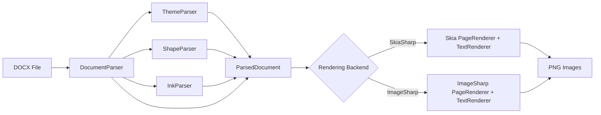
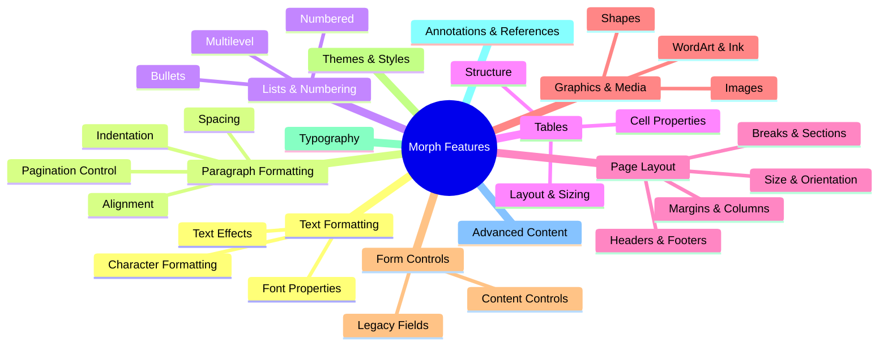

# Morph Feature Matrix

Comprehensive inventory of Microsoft Word DOCX features — what Morph supports today, what is partial, and what remains to be implemented. This document serves as both reference documentation and a living roadmap.

## How to Read This Document

### Status Markers

Each feature is tagged with one of:

| Marker | Meaning |
|--------|---------|
| `DONE` | Fully parsed, modeled, and rendered in both Skia and ImageSharp backends |
| `PARTIAL` | Parsed or modeled but with known limitations (details in notes) |
| `TODO` | Not yet implemented |

### Audience Key

Notes are tagged for three audiences:

- **Contributors** — Where the code lives, edge cases, architectural context
- **Consumers** — What to expect, behavioral limitations, workarounds
- **AI** — Which files to modify, what patterns to follow, relevant OOXML spec sections

### Keeping This File Current

When adding, modifying, or removing a DOCX feature:

1. Update the feature status (`DONE` / `PARTIAL` / `TODO`)
2. Update parse/model/render locations and audience notes
3. Update the summary statistics at the bottom
4. Add new test directory name to the Test row

---

## Rendering Pipeline

Key assemblies:

| Assembly | Role |
|----------|------|
| `Morph` | Core model + both parsers + exporters: `DocumentElements.cs`, `RenderContextBase`, `TableLayout`, `FontHelpers`; DOCX parser `OpenXml/Parsing/DocumentParser.cs` (+ sub-parsers); HTML parser `Html/HtmlParser.cs` |
| `Morph.Skia` | SkiaSharp rendering (`PageRenderer.cs`, `TextRenderer.cs`, `RenderContext.cs`) + entry points `SkiaDocumentConverter` (DOCX→PNG), `SkiaHtmlConverter` (HTML→PNG) |
| `Morph.ImageSharp` | ImageSharp rendering (`PageRenderer.cs`, `TextRenderer.cs`, `RenderContext.cs`) + entry points `ImageSharpDocumentConverter`, `ImageSharpHtmlConverter` |
| `Morph.Pdf` | PDF rendering + DOCX→PDF / HTML→PDF converters |

---

## Feature Hierarchy

---

## 1. Text Formatting (Run Properties)

OOXML parent element: `w:rPr` (run properties).
Model: `RunProperties` record in `DocumentElements.cs`.
Parse: `DocumentParser.ParseRunProperties()`.
Render: `TextRenderer` in both backends.

### 1.1 Font Properties

#### Font Family `DONE`

The typeface used to render text. Resolved from document, theme fonts, or system fallback.

- **OOXML**: `w:rFonts` — `w:ascii`, `w:hAnsi`, `w:cs`, `w:eastAsia`
- **Spec**: [Run Fonts](http://officeopenxml.com/WPtextFonts.php)
- **Model**: `RunProperties.FontFamily`
- **Render**: Font resolved via `FontHelpers` + `RenderContext.GetTypeface()`
- **Test**: `font_families/`

See [docs/fonts.md](fonts.md) for the full font resolution model, search path, fallback behaviour, and configuration options.

> **AI**: Font resolution lives in `OpenTypeReader.cs`, `FontFileCache.cs`, and `FontHelpers.cs` in `Morph/Rendering/`. Per-backend bindings live in `SkiaRenderContext.cs` / `ImageSharpRenderContext.cs`. When adding a new built-in alias, update `FontHelpers.FontFallbacks`.

#### Font Size `DONE`

Text size in half-points (OOXML) converted to points for rendering.

- **OOXML**: `w:sz` (half-points)
- **Spec**: [Run Font Size](http://officeopenxml.com/WPtextFonts.php)
- **Model**: `RunProperties.FontSizePoints`
- **Test**: `font_sizes/`

> **Consumers**: Default size is 11pt (Aptos). Half-point values from OOXML are automatically converted.

### 1.2 Character Formatting

#### Bold `DONE`

Bold weight applied to text runs.

- **OOXML**: `w:b`, `w:bCs`
- **Spec**: [Bold](https://learn.microsoft.com/en-us/dotnet/api/documentformat.openxml.wordprocessing.bold)
- **Model**: `RunProperties.Bold`
- **Test**: `bold_text/`

> **Contributors**: Bold-or-italic flags from the OOXML run combine with any weight word in the font family name (e.g. `Segoe UI Semibold`) to produce a target weight scored against each face's `OS/2` `usWeightClass`. See [fonts.md](fonts.md) for the resolution model.

#### Italic `DONE`

Italic style applied to text runs.

- **OOXML**: `w:i`, `w:iCs`
- **Spec**: [Italic](https://learn.microsoft.com/en-us/dotnet/api/documentformat.openxml.wordprocessing.italic)
- **Model**: `RunProperties.Italic`
- **Test**: `italic_text/`

#### Underline `DONE`

Underline decoration on text. Rendered 2px below the text baseline.

- **OOXML**: `w:u` with `w:val` (single, double, dotted, dash, etc.)
- **Spec**: [Underline](https://learn.microsoft.com/en-us/dotnet/api/documentformat.openxml.wordprocessing.underline)
- **Model**: `RunProperties.Underline`
- **Test**: `underline_text/`

> **Consumers**: All underline types (single, double, dotted, dash, wave, etc.) are detected but currently render as a single solid underline.

#### Strikethrough `DONE`

Line through the middle of text. Rendered at 30% above the text baseline.

- **OOXML**: `w:strike`, `w:dstrike` (double strikethrough)
- **Spec**: [Strikethrough](https://learn.microsoft.com/en-us/dotnet/api/documentformat.openxml.wordprocessing.strikethrough)
- **Model**: `RunProperties.Strikethrough`
- **Test**: `strikethrough_text/`

> **Consumers**: Both single and double strikethrough are parsed; both render as single strikethrough.

#### All Caps `DONE`

Displays text in uppercase regardless of source case.

- **OOXML**: `w:caps`
- **Spec**: [Caps](https://learn.microsoft.com/en-us/dotnet/api/documentformat.openxml.wordprocessing.caps)
- **Model**: `RunProperties.AllCaps`
- **Test**: `all_caps/`

> **Contributors**: Applied during text rendering via `ToUpperInvariant()` transform.

#### Small Caps `DONE`

Displays lowercase letters as smaller uppercase letters while keeping original uppercase letters at full size.

- **OOXML**: `w:smallCaps`
- **Spec**: [SmallCaps](https://learn.microsoft.com/en-us/dotnet/api/documentformat.openxml.wordprocessing.smallcaps)
- **Model**: `RunProperties.SmallCaps`
- **Parse**: `w:smallCaps` parsed alongside `w:caps` in both style and inline run-property paths
- **Render**: `SmallCapsExpander` (`Morph/Rendering/SmallCapsExpander.cs`) splits SmallCaps runs at lowercase/non-lowercase boundaries; lowercase segments are uppercased and rendered at 80% of the run's font size, everything else passes through unchanged. The `Morph.Skia` / `Morph.ImageSharp` `TextRenderer.LayoutParagraph[WithWidth]` and `Morph.Pdf/PdfTextEngine.Layout` apply the expansion before measurement and layout so widths and line breaks reflect the rendered glyphs. (In the PDF the drawn glyphs are the uppercased letters, so a small-caps run's text layer copy-pastes as all-caps — inherent to rendering small caps without an OpenType `smcp` feature.)
- **Test**: `SmallCapsExpanderTests` covers the case-boundary splitting; covered by run-properties parsing tests for the model.

> **AI**: Word's actual scale factor varies (~75–80% depending on font); 80% picked as the visually closest pass-through for the existing test suite. Tab and inline-image runs are intentionally untouched even when SmallCaps is set.

#### Text Color `DONE`

Foreground color of text, either direct RGB or resolved from theme color with transforms.

- **OOXML**: `w:color` with `w:val` (hex RGB) or `w:themeColor` + transforms
- **Spec**: [Color](http://officeopenxml.com/WPtextFormatting.php)
- **Model**: `RunProperties.ColorHex`
- **Test**: `colored_text/`

> **Contributors**: Theme colors resolved in `DocumentParser` using `ShapeParser.ResolveColorHex()` with shade/tint/luminance/saturation transforms. See `ThemeColors` and `ColorTransforms` records.
>
> **The colour cascade** (base → top): docDefaults `w:rPrDefault/w:color` (including a white default — dark-board templates like `menus/07` set `FFFFFF background1` and Word paints fall-through runs white) → style chain (`basedOn` inheritance) → direct `w:rPr`. `w:color w:val="auto"` at any level RESETS the cascade to the automatic colour rather than inheriting (card templates pair a white docDefaults with an auto `Normal`, keeping body text black); inside the style chain that reset travels as `DocumentParser.automaticColorSentinel`, converted at run resolution so it never escapes into the model. The automatic colour is contrast-aware: `ComputeAutomaticRunColor` yields white when the page `w:background` is dark (BT.601 brightness < 128, `brochures/03`'s navy), otherwise null (renderers default to black).

#### Text Background / Highlight `DONE`

Background shading behind text runs.

- **OOXML**: `w:highlight`, `w:shd`
- **Spec**: [Highlight](https://learn.microsoft.com/en-us/dotnet/api/documentformat.openxml.wordprocessing.highlight)
- **Model**: `RunProperties.BackgroundColorHex`

> **Contributors**: Rendered as a filled rectangle spanning ascent + descent height behind the text fragment.

#### Character Spacing `DONE`

Additional spacing between characters (positive or negative), measured in points.

- **OOXML**: `w:spacing` within `w:rPr` (in twentieths of a point)
- **Spec**: [Spacing](https://learn.microsoft.com/en-us/dotnet/api/documentformat.openxml.wordprocessing.spacingmark)
- **Model**: `RunProperties.CharacterSpacingPoints`
- **Test**: Spec test: `CharacterSpacingTests`

> **Contributors**: Applied per-character in both measurement AND drawing: fragments are allocated natural + spacing×length, and tracked fragments draw per-glyph (`TextRenderer.DrawFragmentText` in Skia/ImageSharp, `PdfTextEngine.DrawTrackedString`) so each character advances by its own width plus the tracking — drawn extent equals allocated width. Drawing tracked text untracked is how spacing surplus used to pile into word gaps (doubled gaps) and negative tracking swallowed spaces entirely ("Sheetal Parmar" → "SheetalParmar"). The untracked path is a single DrawText/DrawString call, byte-identical to before. Spaces are tracked too — Word widens/narrows every character's advance, spaces included (the PDF layout adds spacing to its pending-space accumulator for that reason).

#### Superscript `DONE`

Raises text above the baseline, typically at a smaller font size.

- **OOXML**: `w:vertAlign` with `w:val="superscript"`
- **Spec**: [VerticalTextAlignment](https://learn.microsoft.com/en-us/dotnet/api/documentformat.openxml.wordprocessing.verticaltextalignment)
- **Model**: `RunProperties.VerticalAlignment = VerticalAlignment.Superscript`
- **Test**: `subscript_superscript/`

> **Contributors**: Raised 35% of font size above baseline in `TextRenderer`.

#### Subscript `DONE`

Lowers text below the baseline, typically at a smaller font size.

- **OOXML**: `w:vertAlign` with `w:val="subscript"`
- **Spec**: [VerticalTextAlignment](https://learn.microsoft.com/en-us/dotnet/api/documentformat.openxml.wordprocessing.verticaltextalignment)
- **Model**: `RunProperties.VerticalAlignment = VerticalAlignment.Subscript`
- **Test**: `subscript_superscript/`

> **Contributors**: Lowered 15% of font size below baseline in `TextRenderer`.

#### Kerning `DONE`

Adjusts spacing between specific character pairs for visual balance.

- **OOXML**: `w:kern` (minimum font size threshold for kerning, in half-points)
- **Model**: `RunProperties.KerningMinFontSizePoints`
- **Parse**: `DocumentParser.BuildRunProperties` reads `w:kern` (half-points → points)
- **Render**: ImageSharp's `RichTextOptions.KerningMode` is set to `None` per draw when the run's font size is below `KerningMinFontSizePoints`; both layout-time `MeasureText` and render-time `DrawText` use the same mode so widths and glyph positions stay consistent. Skia's `canvas.DrawText` doesn't apply kerning at all (no `SKShaper` in the draw path), so the threshold is implicitly honoured everywhere.

> **AI**: Single helper `ResolveKerningMode(RunProperties)` in `Morph.ImageSharp/Rendering/TextRenderer.cs` covers both kerning and ligatures because SixLabors.Fonts couples them in the same shaping pass.

#### Ligatures `DONE`

Combines specific character sequences (fi, fl, ff, etc.) into single glyphs.

- **OOXML**: `w14:ligatures` (Word 2010+ extension)
- **Model**: `LigatureMode` flags (`Standard`, `Contextual`, `Historical`, `Discretional`); `RunProperties.Ligatures` (default `Standard`)
- **Parse**: `DocumentParser.ParseLigatureMode` reads `w14:ligatures` and maps the OOXML enumerated values to the flag combination
- **Render**: when `LigatureMode == None`, ImageSharp's `KerningMode` is forced to `None` (which also disables ligature substitution under SixLabors.Fonts). Skia's `canvas.DrawText` doesn't substitute ligatures by default, so the absence of `Standard` ligatures is the natural state there.

> **AI**: Discretionary/historical ligatures (`Discretional`, `Historical`) and contextual alternates beyond Standard remain unmodelled — the existing FontFeature API on SixLabors doesn't cleanly map to OOXML's flag combinations.

#### Hidden Text `DONE`

Runs marked as hidden, structural-hidden (TOC markers), or web-only-hidden. Hidden runs are dropped at parse time so they don't enter measurement or rendering — `w:webHidden` is intentionally ignored because Morph renders for print/image where the runs should remain visible.

- **OOXML**: `w:vanish`, `w:specVanish`, `w:webHidden`
- **Spec**: [Vanish](https://learn.microsoft.com/en-us/dotnet/api/documentformat.openxml.wordprocessing.vanish)
- **Model**: `RunProperties.Hidden`
- **Parse**: `DocumentParser.ParseRunProperties` reads `w:vanish` (with `val` toggle) and `w:specVanish` (presence-only); `ParseRun` short-circuits and emits no `Run` records when `Hidden` is true. `w:webHidden` is parsed-and-discarded.
- **Test**: `RunEffectsTests.Vanish_DropsRun_FromParsedParagraph`, `SpecVanish_DropsRun_LikeVanish`

#### Emboss `DONE`

3D emboss text effect (raised appearance). Approximated by painting a light-grey companion glyph one device pixel down-and-right of the main glyph, so the text reads as raised on a white background.

- **OOXML**: `w:emboss`
- **Spec**: [Emboss](https://learn.microsoft.com/en-us/dotnet/api/documentformat.openxml.wordprocessing.emboss)
- **Model**: `RunProperties.Emboss`
- **Render**: companion glyph painted before the main fill in both `Morph.Skia/Rendering/TextRenderer.cs` and `Morph.ImageSharp/Rendering/TextRenderer.cs`

#### Imprint (Engrave) `DONE`

Engraved text effect (inverse of emboss — recessed appearance). Approximated by painting a medium-grey companion glyph one pixel up-and-left of the main glyph.

- **OOXML**: `w:imprint`
- **Spec**: [Imprint](https://learn.microsoft.com/en-us/dotnet/api/documentformat.openxml.wordprocessing.imprint)
- **Model**: `RunProperties.Imprint`

#### Outline Text `DONE`

Stroke-only text (hollow glyphs, no fill). Distinct from `w14:textOutline`, which adds a stroke *around* filled text — `w:outline` replaces the fill with a stroke.

- **OOXML**: `w:outline`
- **Spec**: [Outline](https://learn.microsoft.com/en-us/dotnet/api/documentformat.openxml.wordprocessing.outline)
- **Model**: `RunProperties.OutlineOnly`
- **Render**: when set, the main glyph paint is swapped to `Stroke` style (Skia) / `SolidPen` (ImageSharp); the regular fill is skipped entirely

#### Animated Text Effect `DONE`

Word's animated run effects (`blinkBackground`, `sparkle`, `lights`, `marchingAnts`, etc.). Animation has no static-image equivalent, so the run renders as plain text.

- **OOXML**: `w:effect` with `w:val`
- **Spec**: [TextEffect](https://learn.microsoft.com/en-us/dotnet/api/documentformat.openxml.wordprocessing.texteffect)
- **Render**: parsed-and-discarded — text underneath renders normally

#### Run Border `DONE`

Border drawn around an individual run (per-run rectangle, not paragraph-level). Doesn't reserve space, so adjacent runs may sit close to the rectangle's edge — matches Word's inline-border behaviour.

- **OOXML**: `w:bdr` within `w:rPr`
- **Spec**: [Border](https://learn.microsoft.com/en-us/dotnet/api/documentformat.openxml.wordprocessing.border)
- **Model**: `RunProperties.Border` (a `BorderEdge`)
- **Render**: rectangle drawn around the run's measured box (ascent..descent vertically, fragment width horizontally) using the parsed colour and width
- **Test**: `RunEffectsTests.RunBorder_ParsesColorAndWidth`

#### East Asian Emphasis Mark `TODO`

Dot or circle mark drawn above or below each glyph for emphasis (Chinese/Japanese typography).

- **OOXML**: `w:em`
- **Spec**: [Emphasis Mark](https://learn.microsoft.com/en-us/dotnet/api/documentformat.openxml.wordprocessing.emphasis)
- **Source**: identified via scan in `src/missingTags.md`

#### Baseline Shift (Position) `DONE`

Raises or lowers a run relative to the baseline without resizing. Distinct from superscript/subscript, which also resizes the glyph. Stacks additively with `w:vertAlign` for combined shifts.

- **OOXML**: `w:position` (half-points; positive = up, negative = down)
- **Spec**: [Position](https://learn.microsoft.com/en-us/dotnet/api/documentformat.openxml.wordprocessing.position)
- **Model**: `RunProperties.BaselineShiftPoints` (in points — half-points are converted at parse time)
- **Render**: subtracted from `pixelY` after `vertAlign` adjustments in both backend `RenderFragment` paths
- **Test**: `RunEffectsTests.Position_ParsesHalfPoints_AsPoints`, `Position_NegativeValue_LowersBaseline`

### 1.3 Text Effects

#### Text Shadow `DONE`

Shadow effect behind text (not to be confused with WordArt shadow).

- **OOXML**: `w14:shadow` with color, blur radius, distance, angle
- **Model**: `RunProperties.Shadow` (`TextShadow` record with colour, blur, distance, direction, alpha). The legacy `Effects` flag is now derived from this field.
- **Parse**: `DocumentParser.ParseTextShadow` extracts `w14:blurRad` / `w14:dist` / `w14:dir` (EMU/60000ths-degree) and the child `srgbClr` + `alpha`. Bare `<w14:shadow/>` defaults to 4pt distance, 4pt blur, 45°, 50% black.
- **Render**: Skia draws the glyph at the offset position with `SKImageFilter.CreateBlur` before the main fill. ImageSharp draws an offset duplicate without blur (no per-draw blur in its drawing pipeline).

> **AI**: `sx`/`sy` scale and `kx`/`ky` skew transforms from the OOXML are intentionally not modelled — minor visual contribution and complicates the render path.

#### Text Outline `DONE`

Outline/stroke around text characters.

- **OOXML**: `w14:textOutline` with color, width, line style
- **Model**: `RunProperties.Outline` (`TextOutline` record with colour and width).
- **Parse**: `DocumentParser.ParseTextOutline` reads `w14:w` (EMU → points) and walks for the descendant `srgbClr`. Falls back to the run's fill colour and a 0.75pt default width when attributes are absent.
- **Render**: after the fill draw, both backends re-draw the glyph with a stroke paint/pen using the outline colour and width.

> **AI**: `cap`/`cmpd`/`algn`/`prstDash` line-style attributes are deliberately not modelled — Word almost always uses the round-cap solid-stroke default.

#### Text Glow `DONE`

Soft glow effect around text.

- **OOXML**: `w14:glow` with color, radius
- **Model**: `RunProperties.Glow` (`TextGlow` record with colour, radius, alpha).
- **Parse**: `DocumentParser.ParseTextGlow` reads `w14:rad` and the child `srgbClr` + `alpha`. Bare element defaults to 4pt yellow at 60% alpha.
- **Render**: Skia draws the glyph twice with `SKImageFilter.CreateBlur` before the main fill (two passes deepen the halo). ImageSharp approximates by stroking the glyph at increasing radii with low alpha — softer but visually similar.

> **AI**: Scheme-colour resolution (`schemeClr` with `lumMod`/`lumOff` transforms) isn't wired through; only direct `srgbClr` values are honoured.

#### Text Reflection `DONE`

Mirrored reflection below text.

- **OOXML**: `w14:reflection` with transparency, size, blur, distance
- **Model**: `RunProperties.HasReflection` (presence-only — full reflection parameter set is not modelled).
- **Render**: Skia draws a vertically-mirrored copy below the baseline and applies a top→bottom alpha gradient via `SKBlendMode.SrcIn`. ImageSharp draws a faded duplicate below the original (no flip) — its drawing pipeline doesn't expose per-draw transforms cleanly.

> **AI**: Presence-aware rendering with sensible defaults matching Word's "Tight Reflection, touching" preset. The OOXML reflection parameters (`stA`, `stPos`, `endA`, `endPos`, `dist`, `dir`, `fadeDir`, `sx`, `sy`, `blurRad`) are not parsed; documents using a custom reflection preset will diverge from Word.

#### Gradient / Pattern Text Fill `TODO`

Gradient or pattern fill applied to glyphs (rather than a solid colour).

- **OOXML**: `w14:textFill` containing `w14:solidFill`, `w14:gradFill`, `w14:noFill`
- **Source**: identified via scan in `src/missingTags.md`

> **AI**: Skia uses `SKShader.CreateLinearGradient`; ImageSharp uses `LinearGradientBrush` masked to glyph paths.

#### OpenType Numeric / Stylistic Variants `TODO`

OpenType feature toggles for numeral form, numeral spacing, stylistic sets, and contextual alternates.

- **OOXML**: `w14:numForm` (`default`/`lining`/`oldStyle`), `w14:numSpacing` (`default`/`proportional`/`tabular`), `w14:stylisticSets`, `w14:cntxtAlts`
- **Source**: identified via scan in `src/missingTags.md`

> **AI**: SixLabors.Fonts exposes per-feature flags via `FontFeature`; map these properties through the same shaping pipeline as ligatures.

---

## 2. Paragraph Formatting

OOXML parent element: `w:pPr` (paragraph properties).
Model: `ParagraphProperties` record in `DocumentElements.cs`.
Parse: `DocumentParser.ParseParagraphProperties()`.
Render: `TextRenderer.MeasureAndRenderParagraph()` in both backends.

### 2.1 Alignment

#### Left Alignment `DONE`

Default text alignment — flush left, ragged right.

- **OOXML**: `w:jc` with `w:val="left"` (or absent)
- **Spec**: [Justification](http://officeopenxml.com/WPalignment.php)
- **Model**: `ParagraphProperties.Alignment = TextAlignment.Left`
- **Test**: `align_left/`

#### Center Alignment `DONE`

Text centered within the available width.

- **OOXML**: `w:jc` with `w:val="center"`
- **Model**: `ParagraphProperties.Alignment = TextAlignment.Center`
- **Test**: `align_center/`

#### Right Alignment `DONE`

Text flush right, ragged left.

- **OOXML**: `w:jc` with `w:val="right"`
- **Model**: `ParagraphProperties.Alignment = TextAlignment.Right`
- **Test**: `align_right/`

#### Justified Alignment `DONE`

Text spread to fill the full width, with extra space distributed between words.

- **OOXML**: `w:jc` with `w:val="both"`
- **Model**: `ParagraphProperties.Alignment = TextAlignment.Justify`
- **Test**: `align_justified/`

> **Contributors**: Last line of a justified paragraph is left-aligned (not stretched). Extra space is distributed between word gaps only.

### 2.2 Spacing

#### Spacing Before / After `DONE`

Vertical space above and below a paragraph, in points.

- **OOXML**: `w:spacing` — `w:before`, `w:after` (in twentieths of a point)
- **Spec**: [Paragraph Spacing](http://officeopenxml.com/WPspacing.php)
- **Model**: `ParagraphProperties.SpacingBeforePoints`, `SpacingAfterPoints`
- **Test**: `paragraph_spacing/`

> **Contributors**: Adjacent paragraph spacing uses margin collapsing: `max(after, before)`, not sum. A body paragraph at the top of an automatically broken page gets no spacing-before (compatibilityMode 15 also after explicit page breaks; section breaks and the first page keep it) — one-shot `SuppressPageTopSpacingBefore` computed by the page renderers, consumed in `TextRenderer` / `PdfTextEngine`. The document default after-spacing (`DocumentParser.ExtractDefaultParagraphProperties`) is Word's 8pt built-in only when the document has no `docDefaults` element (or no `styles.xml`); when `docDefaults` is present but omits paragraph defaults, the default is 0 — Word reads the omission as an explicit zero. The same extraction reads `pPrDefault/w:jc` into the base of the alignment cascade (card/label/menu templates centre every paragraph there; a style or paragraph `w:jc` — including an explicit "left" — still overrides).

> **Contributors**: A paragraph whose only content is a behind-text anchored drawing (the "background placeholder" pattern) still has a paragraph mark, and Word allocates a line for it. `ParseParagraph` therefore treats behind-text `FloatingShapeElement`s as producing no flow content and emits the empty paragraph anyway — testing `result.Count == 0` alone made that line appear or vanish depending on whether the shape parser happened to understand the drawing. The one exception is a placeholder carrying explicit spacing-after, where Word emits the trailing spacing but no line: that becomes an `IsAnchorOnlyMark` paragraph (see `agendas-minutes/11`).

#### Line Spacing `DONE`

Vertical distance between lines within a paragraph. Three modes: Auto (multiplier), Exactly (fixed), AtLeast (minimum).

- **OOXML**: `w:spacing` — `w:line`, `w:lineRule` (auto/exact/atLeast)
- **Spec**: [Line Spacing](http://officeopenxml.com/WPspacing.php)
- **Model**: `ParagraphProperties.LineSpacingMultiplier`, `LineSpacingPoints`, `LineSpacingRule`
- **Test**: `line_spacing/`, `line_spacing_at_least/`, `line_spacing_exactly/`

> **Contributors**: Auto mode multiplies the font's full hhea line box (ascent + descent + line gap) with no extra floor or leading correction, verified against Word XPS baselines. Document grid line pitch enforced when >= 20 page break markers detected. An empty paragraph's line takes the paragraph mark's style-resolved formatting (`ParagraphProperties.ParagraphMarkRunProperties`, from `w:pPr/w:rPr`), matching Word. See `TextRenderer` line spacing logic. The PDF backend applies the same three rules in `PdfTextEngine` (per finished line, on blank explicit-break lines, and on empty-paragraph mark lines), mirroring the raster `CalculateLineHeight`.
> **Consumers**: Single (1.0), 1.5, and Double (2.0) spacing all supported. Exactly mode fixes line height; AtLeast sets a minimum.

#### Contextual Spacing `DONE`

Suppresses spacing between paragraphs of the same style.

- **OOXML**: `w:contextualSpacing`
- **Spec**: [ContextualSpacing](https://learn.microsoft.com/en-us/dotnet/api/documentformat.openxml.wordprocessing.contextualspacing)
- **Model**: `ParagraphProperties.ContextualSpacing`

> **Contributors**: Collapses both before and after spacing when adjacent paragraphs share the same `StyleId`. Tracked via `LastParagraphStyleId` and `LastParagraphHadContextualSpacing` in `RenderContextBase`.

### 2.3 Indentation

#### First Line Indent `DONE`

Indents the first line of a paragraph from the left margin.

- **OOXML**: `w:ind` with `w:firstLine` (in twentieths of a point)
- **Spec**: [Indentation](http://officeopenxml.com/WPindentation.php)
- **Model**: `ParagraphProperties.FirstLineIndentPoints`
- **Test**: `first_line_indent/`

#### Hanging Indent `DONE`

All lines except the first are indented. Used for list items and bibliography entries.

- **OOXML**: `w:ind` with `w:hanging`
- **Model**: `ParagraphProperties.HangingIndentPoints`
- **Test**: `hanging_indent/`

#### Left / Right Indent `DONE`

Indents the entire paragraph from the left and/or right margin.

- **OOXML**: `w:ind` with `w:left`, `w:right`
- **Model**: `ParagraphProperties.LeftIndentPoints`, `RightIndentPoints`
- **Test**: `left_indent/`

### 2.4 Pagination Control

#### Page Break Before `DONE`

Forces the paragraph to start on a new page.

- **OOXML**: `w:pageBreakBefore`
- **Model**: `ParagraphProperties.PageBreakBefore`
- **Test**: `page_breaks/`

#### Keep With Next `DONE`

Prevents a page break between this paragraph and the next.

- **OOXML**: `w:keepNext`
- **Model**: `ParagraphProperties.KeepNext`

> **Contributors**: Implemented by measuring the next element and ensuring both fit on the current page, in all three backends (the PDF renderer mirrors the raster handlers; its keep-before-table stays inert until it has a table pre-measure). Word's abandonment guards apply: no push when already at the top of a page, and none when the kept pair cannot fit a fresh column either. See `PageRenderer` keep-next logic and `PdfPageRenderer.RenderParagraph`.

#### Keep Lines Together `DONE`

Prevents a page break within this paragraph — all lines stay on the same page.

- **OOXML**: `w:keepLines`
- **Model**: `ParagraphProperties.KeepLines`

#### Widow / Orphan Control `DONE`

Prevents single lines from appearing alone at the top (widow) or bottom (orphan) of a page.

- **OOXML**: `w:widowControl`
- **Model**: `ParagraphProperties.WidowControl`
- **Render**: the raster backends look ahead at per-line heights via `LayoutParagraphForMeasurement` when a paragraph won't fit on the current page; a split that would leave exactly 1 line on either side (orphan or widow) pushes the whole paragraph instead. The PDF backend (`PdfTextEngine.Draw`) plans real line-level splits: fewer than two lines fitting at the page bottom moves the whole paragraph, a split that would carry a single line forward breaks one line earlier, and the rule is abandoned at the top of a page/column.

> **AI**: The raster pipeline cannot split mid-paragraph, so its only enforceable move is pushing the whole paragraph — a 5-line paragraph needing a 3+2 break still splits arbitrarily there. The PDF backend enforces the full Word rule (two lines minimum on each side of a split, matching `w:widowControl`'s widows=2/orphans=2 semantics), re-planning after every mid-paragraph break so paragraphs spanning several pages stay valid.

### 2.5 Paragraph Decoration

#### Paragraph Background / Shading `DONE`

Background color behind the full paragraph area.

- **OOXML**: `w:shd` within `w:pPr`
- **Model**: `ParagraphProperties.BackgroundColorHex`
- **Test**: `block_quote/`

> **Contributors**: Rendered as a filled rectangle spanning the full paragraph height, respecting left/right indents. See `TextRenderer` paragraph background rendering.

#### Horizontal Rule `DONE`

A horizontal line spanning the content width.

- **OOXML**: `w:pBdr` (paragraph border bottom only) or `
` in AltChunk HTML
- **Model**: `HorizontalRuleElement`

#### Suppress Line Numbers `DONE`

Excludes this paragraph from line numbering.

- **OOXML**: `w:suppressLineNumbers`
- **Model**: `ParagraphProperties.SuppressLineNumbers`
- **Test**: `line_numbers_suppressed/`

#### Suppress Auto Hyphens `DONE`

Prevents automatic hyphenation for this paragraph.

- **OOXML**: `w:suppressAutoHyphens`
- **Model**: `ParagraphProperties.SuppressAutoHyphens`
- **Test**: `hyphenation_suppressed/`

#### Paragraph Borders `DONE`

Borders around a paragraph (top, bottom, left, right, between).

- **OOXML**: `w:pBdr` — `w:top`, `w:bottom`, `w:left`, `w:right`, `w:between`
- **Parse**: `DocumentParser.ParseParagraphProperties()` and `ParseStyleParagraphProperties()` in `Morph/OpenXml/Parsing/DocumentParser.cs`; per-edge `w:space` via `ParseBorderSpace()`
- **Model**: `ParagraphProperties.Borders` (reuses `CellBorders` for Top/Right/Bottom/Left), plus per-edge `BorderTopSpacePoints` / `BorderBottomSpacePoints` / `BorderLeftSpacePoints` / `BorderRightSpacePoints`, and `BorderBetween` / `BorderBetweenSpacePoints`
- **Render**: paragraph-border block in `Morph.Skia/Rendering/TextRenderer.cs`, `Morph.ImageSharp/Rendering/TextRenderer.cs`, and `Morph.Pdf/PdfTextEngine.cs` (`DrawParagraphBorders`, ported from the raster backends; height reserved via `BorderSpaceExcess` in `MeasureHeight`). Between-border collapse uses `RenderContextBase.SuppressNextParagraphTopBorder` to coordinate neighbors across all three backends.
- **Test**: `paragraph_borders/`
- **Spec**: [Paragraph Borders](http://officeopenxml.com/WPborders.php)

> **Contributors**: All four box edges plus `w:between` are rendered. Per-edge `w:space` is honored — when the requested space exceeds the paragraph's SpacingBefore/After, the excess is reserved so borders don't poke into neighbors (matches Word's layout). Consecutive paragraphs sharing the same `w:pBdr` + `w:between` definition collapse their adjacent top/bottom into a single between line, and spacing/borders fuse into one visual box.

#### Text Frames `PARTIAL`

Floating text frame (pre-DrawingML era) defined directly on a paragraph. Drop-cap framing (`w:dropCap`) is fully supported via the Drop Caps feature. Positioning frames (`w:hAnchor`/`w:vAnchor`/`w:xAlign`/`w:yAlign`/`w:x`/`w:y`/`w:w`/`w:h`) are parsed into a value-equatable `ParagraphFrame`; the style's frame takes precedence over the editor's neutral direct framePr. Consecutive same-frame paragraphs (even when scattered across the layout table's cells) are collected document-wide and merged into one floating block — empty paragraphs dropped, icon-only paragraphs folded onto the following label — and rendered out of flow as a `PositionedFrameElement`. To avoid disturbing layouts that already flow acceptably inline, only the page/margin-anchored **bottom footer-block** pattern is lifted (e.g. a right-aligned Location/Date/Time stack); text-anchored and upper-page frames stay inline.

- **OOXML**: `w:framePr` with `w:dropCap`, `w:lines`, `w:w`, `w:h`, `w:x`, `w:y`, `w:wrap`, `w:hAnchor`, `w:vAnchor`, `w:xAlign`, `w:yAlign`
- **Spec**: [FrameProperties](https://learn.microsoft.com/en-us/dotnet/api/documentformat.openxml.wordprocessing.frameproperties)
- **Model**: `ParagraphProperties.DropCap`/`DropCapLines` (drop-cap subset); `ParagraphProperties.Frame` (`ParagraphFrame`) and `PositionedFrameElement` (positioning subset)
- **Parse**: `DocumentParser.ParseParagraphFrame` reads the anchors/alignment/offset/size; `FrameGrouper` (`Morph/Parsing/FrameGrouper.cs`) collects and merges framed paragraphs into lifted frames
- **Render**: `PageRendererBase.RenderPositionedFrame` measures the content to auto-size, resolves position from anchor + alignment, and draws the inner paragraphs out of flow in all three backends; drop caps still reflow surrounding lines
- **Test**: `agendas-minutes/14` (bottom-right footer info block)

#### Mirror Indents `DONE`

Marks a paragraph for left/right indent swapping on even-numbered pages (mirror printing for facing pages). Morph parses the flag onto the paragraph; the renderer doesn't currently swap indents at draw time (parsed-but-not-applied — same status as `IsRightToLeft`). Documents that rely on this for legibility will see the same indents on every page.

- **OOXML**: `w:mirrorIndents` within `w:pPr`
- **Spec**: [MirrorIndents](https://learn.microsoft.com/en-us/dotnet/api/documentformat.openxml.wordprocessing.mirrorindents)
- **Model**: `ParagraphProperties.MirrorIndents`
- **Parse**: `DocumentParser.ParseParagraphProperties` reads the element's presence and inherits from styles
- **Test**: `MirrorIndentsTests`

#### East Asian Line-Break Rules `DONE`

East-Asian typography controls: word-wrap mode, kinsoku punctuation, overflow punctuation, auto-spacing between East-Asian and Latin/numeric runs, right-indent adjustment for East-Asian characters. Morph's text engine doesn't model East-Asian line-break heuristics, so these flags are accepted as no-ops; CJK documents will break at default boundary points rather than honouring the selected mode.

- **OOXML**: `w:wordWrap`, `w:kinsoku`, `w:overflowPunct`, `w:autoSpaceDE`, `w:autoSpaceDN`, `w:adjustRightInd`
- **Spec**: [WordWrap](https://learn.microsoft.com/en-us/dotnet/api/documentformat.openxml.wordprocessing.wordwrap)
- **Render**: no-op — Morph uses a single line-break algorithm (whitespace-driven) regardless of script

#### Underline Trailing Spaces `DONE`

Whether trailing spaces inside an underlined run extend the underline to cover them. Document-level setting in `settings.xml`.

- **OOXML**: `w:ulTrailSpace` in document settings
- **Spec**: [UnderlineTrailingSpaces](https://learn.microsoft.com/en-us/dotnet/api/documentformat.openxml.wordprocessing.underlinetrailingspaces)
- **Render**: no-op — Morph already underlines the full run width including trailing whitespace, which matches the default-on behaviour of the setting

#### Page Number Format / Start `DONE`

Override the page numbering format (decimal, lowerRoman, etc.) and starting value within a section, used by `PAGE` / `SECTIONPAGES` field codes.

- **OOXML**: `w:pgNumType` within `w:sectPr` — `@w:fmt`, `@w:start`, `@w:chapStyle`, `@w:chapSep`
- **Spec**: [PageNumberType](https://learn.microsoft.com/en-us/dotnet/api/documentformat.openxml.wordprocessing.pagenumbertype)
- **Render**: `PAGE`/`NUMPAGES`/`SECTIONPAGES` fields are now evaluated per page (see Field Codes), but `w:pgNumType` itself is still not read — the section's `@w:fmt` override and `@w:start` restart value have no consumer, so numbers render as decimal counted from physical page 1. A field's own `\*` format switch is honoured. Wiring `w:pgNumType` in as the section's number format / restart origin is the remaining gap.

---

## 3. Lists & Numbering

OOXML source: `numbering.xml` defines abstract numbering schemes (`w:abstractNum`) with per-level definitions (`w:lvl`). Paragraphs reference numbering via `w:numPr` in `w:pPr`.
Model: `NumberingInfo` record in `DocumentElements.cs`.
Parse: `DocumentParser` extracts numbering definitions and resolves per-paragraph.
Render: `TextRenderer.RenderBullet()` / `RenderBulletInBounds()`.

### 3.1 Bullet Lists

#### Bullet Lists `DONE`

Unordered lists with bullet characters. Supports Symbol and Wingdings font mapping.

- **OOXML**: `w:numPr` referencing a bullet-type `w:abstractNum`
- **Spec**: [Numbering](http://officeopenxml.com/WPnumberingAbstractNum.php)
- **Model**: `ParagraphProperties.Numbering` → `NumberingInfo` with `.Text` (bullet char)
- **Render**: `TextRenderer.RenderBullet()`
- **Test**: `bullet_list/`

> **Contributors**: Unicode mapping for Symbol/Wingdings bullet characters handled during parsing (`MapBulletPuaToUnicode`). Marker font selection is the shared `FontHelpers.UseBulletFont`, identical across the three render backends: Symbol/Wingdings-declared bullets AND the geometric glyphs the bundled text faces lack (■ U+25A0, ◆ U+25C6, ▸ U+25B8, ► U+25BA) render in the embedded `Bullets.ttf` subset (the two triangles were drawn into it; Word glyph-falls-back to Segoe UI Symbol for these), while every other marker keeps the paragraph font — Word's own behaviour when the glyph exists there. The PDF backend registers the embedded subset in `PdfFontResolver` under the reserved `::MorphBullets` face key, since it ships as an assembly resource rather than a `FontDirectory` file.

#### Custom Bullet Fonts `DONE`

Bullet characters rendered with a specific font family override.

- **Model**: `NumberingInfo.FontFamily`
- **Test**: `bullet_list/`

### 3.2 Numbered Lists

#### Numbered Lists `DONE`

Ordered lists with sequential counter tracking across paragraphs.

- **OOXML**: `w:numPr` referencing a numbered `w:abstractNum`
- **Model**: `NumberingInfo.Text` (formatted number text with tracked counters)
- **Parse**: `DocumentParser.GetNumberingInfo()` with `numberingCounters` dictionary
- **Test**: `numbered_list/`, `numbered_list_tracking/`

> **Contributors**: Counter tracked per `(numId, ilvl)` pair in `DocumentParser.numberingCounters`. Counters increment on each paragraph referencing the same numbering instance. Different `numId` values restart independently. `FormatNumber()` handles decimal, upperRoman, lowerRoman, upperLetter, lowerLetter formats. Multi-level placeholders (`%1.%2.`) supported.
> **Consumers**: Numbered lists display with correct sequential numbers. Counters continue across interruptions within the same list, and restart for new lists.

#### Numbering Formats `DONE`

Different number representations: decimal, roman (upper/lower), letter (upper/lower).

- **OOXML**: `w:numFmt` — `decimal`, `upperRoman`, `lowerRoman`, `upperLetter`, `lowerLetter`
- **Spec**: [Number Format](https://learn.microsoft.com/en-us/dotnet/api/documentformat.openxml.wordprocessing.numberingformat)
- **Parse**: `DocumentParser.FormatNumber()`, `ToRoman()`, `ToLetter()`

> **Contributors**: `NumberFormatValues` stored on `NumberingLevelDefinition.NumberFormat`. `FormatNumber()` dispatches to `ToRoman()` or `ToLetter()` based on the format. Roman numerals support 1-3999. Letters support A-Z, then AA, AB, etc.

#### List Restart / Continue `DONE`

Restarting numbering or continuing from a previous list.

- **OOXML**: `w:numId` change, `w:startOverride` in `w:lvlOverride`
- **Parse**: `DocumentParser.ExtractNumberingDefinitions()` — clones abstract levels and applies `StartOverrideNumberingValue`
- **Test**: `numbered_list_tracking/`, `numbered_list_restart/`

> **Contributors**: Different `numId` values restart counters independently. `w:lvlOverride` with `w:startOverride` in numbering instances overrides the abstract definition's start number. The override is applied during extraction by cloning the abstract level definition with the new start value.
> **Consumers**: Lists restart correctly when Word creates separate numbering instances. Custom start values (e.g., starting at 10) are supported.

### 3.3 Multilevel Lists

#### Nested / Multilevel Lists `DONE`

Lists with multiple indent levels, each with its own bullet or numbering style.

- **OOXML**: `w:ilvl` (indent level) within `w:numPr`, up to 9 levels in `w:abstractNum`
- **Model**: `NumberingInfo.IndentPoints`, `NumberingInfo.HangingIndentPoints`
- **Test**: `nested_list/`, `deep_nested_list/`

> **Contributors**: Level-specific formatting (indent, hanging indent, bullet character, font) resolved during parsing from the abstractNum definition. Deep nesting (6+ levels) tested.

---

## 4. Tables

OOXML elements: `w:tbl`, `w:tblPr`, `w:tblGrid`, `w:tr`, `w:trPr`, `w:tc`, `w:tcPr`.
Model: `TableElement`, `TableRow`, `TableCell`, `TableProperties`, `TableCellProperties` in `DocumentElements.cs`.
Layout: `TableLayout.cs` (shared measurement/calculation).
Render: `PageRenderer.RenderTable*()` methods in both backends.

### 4.1 Structure

#### Basic Table Structure `DONE`

Tables with rows and cells containing paragraphs and other content.

- **OOXML**: `w:tbl` > `w:tr` > `w:tc` > `w:p`
- **Spec**: [Table Structure](http://officeopenxml.com/WPtable.php)
- **Model**: `TableElement` → `TableRow` list → `TableCell` list
- **Parse**: `DocumentParser.ParseTable()`
- **Test**: `simple_table/`

#### Nested Tables `DONE`

Tables within table cells.

- **Model**: Cell content can contain `TableElement` children
- **Test**: `complex_tables/`

> **Contributors**: Nested table height uses an approximate 50pt estimate during parent table layout. Deeply nested structures are supported but height estimation becomes less accurate.
> **Consumers**: Nested tables render correctly for typical cases. Very complex nesting may show slight height inaccuracies.

#### Table Indent `DONE`

Horizontal offset of the table from the left margin.

- **OOXML**: `w:tblInd`
- **Model**: `TableProperties.IndentPoints`

### 4.2 Cell Properties

#### Cell Borders `DONE`

Per-cell border control for all four edges with color, width, and visibility. Falls back to table-level defaults via smart resolution.

- **OOXML**: `w:tcBorders` — `w:top`, `w:bottom`, `w:left`, `w:right`
- **Spec**: [Table Cell Borders](http://officeopenxml.com/WPtableCellBorders.php)
- **Model**: `CellBorders`, `BorderEdge` in `DocumentElements.cs`
- **Layout**: `TableLayout.ResolveCellBorders()` — merges cell/table/inside borders
- **Test**: `table_borders/`

> **Contributors**: Resolution order: cell-level borders override table defaults. Outer cells use `DefaultBorders`, inner cells use `InsideHorizontalBorder`/`InsideVerticalBorder`. See `TableLayout.ResolveCellBorders()`.
> **Consumers**: Standard solid borders render correctly. Double/dashed/dotted styles render as solid.

#### Cell Shading / Background `DONE`

Background fill color for individual cells.

- **OOXML**: `w:shd` within `w:tcPr`
- **Model**: `TableCellProperties.BackgroundColorHex`
- **Test**: `table_colors/`

> **Contributors**: Background rendered as filled rectangle before border drawing — background first, borders on top.

#### Cell Padding `DONE`

Space between cell border and cell content (inside the cell).

- **OOXML**: `w:tcMar` (per-cell) or `w:tblCellMar` (table default; also inherited from the referenced table style and its `w:basedOn` chain)
- **Spec**: [Cell Margins](http://officeopenxml.com/WPtableCellMargins.php)
- **Model**: `TableCellProperties.Padding` (per-cell), `TableProperties.DefaultCellPadding`
- **Test**: `table_cell_padding/`, `table_cell_padding_varied/`, `table_default_cell_margin/`, `table_grid_styling_padding/`

#### Cell Margins `DONE`

Additional margin space outside cell content area.

- **Model**: `TableCellProperties.Margin`, `TableProperties.DefaultCellMargin`
- **Test**: `table_cell_margin_per_cell/`

#### Cell Vertical Alignment `DONE`

Vertical positioning of content within a cell: top, center, or bottom.

- **OOXML**: `w:vAlign` — `top`, `center`, `bottom`
- **Model**: `TableCellProperties.VerticalAlignment`

> **Contributors**: Special handling for vertically merged cells — alignment calculated across the full merged span.

### 4.3 Layout & Sizing

#### Column Widths `DONE`

Column width determination from explicit cell widths or table grid definitions.

- **OOXML**: `w:tblGrid` > `w:gridCol`, `w:tcW` (`dxa` and `pct`)
- **Layout**: `TableLayout.CalculateColumnWidths()`
- **Test**: `wide_table/`, `table_autofit_no_widths/`, `table_two_column_layout/`

> **Contributors**: Sources, in order: explicit cell widths (`w:tcW w:type="dxa"`), percent-preferred cell widths (`w:tcW w:type="pct"`, in fiftieths of a percent, resolved against the table's available width via `TableCellProperties.WidthFraction`), grid column widths (`w:tblGrid`), content-based autofit when all are absent and `w:tblLayout` is autofit, or equal distribution as the last-resort fallback. Width scaling applied when content exceeds available page width, so percent proportions survive the normalisation.

#### Horizontal Merge (GridSpan) `DONE`

Cells spanning multiple columns.

- **OOXML**: `w:gridSpan` within `w:tcPr`
- **Model**: `TableCellProperties.GridSpan`

#### Vertical Merge `DONE`

Cells spanning multiple rows.

- **OOXML**: `w:vMerge` — `restart` (start of merge) or `continue` (continuation)
- **Model**: `TableCellProperties.VerticalMerge` (Restart/Continue enum)
- **Layout**: `TableLayout.CalculateVerticalMergeHeights()`
- **Test**: `table_vmerge_basic/`, `table_vmerge_explicit_heights/`

> **Contributors**: Per-column Y-position tracking ensures merged cells render across the correct row span. Height distributed proportionally.

#### Row Heights `DONE`

Explicit row height control: exact (fixed) or atLeast (minimum).

- **OOXML**: `w:trHeight` with `w:hRule` (exact/atLeast) and `w:val`
- **Model**: `TableRow.HeightPoints`, `TableRow.ExactHeight`
- **Test**: `table_explicit_heights/`, `table_layout_tall_row/`

> **Contributors**: Multi-pass calculation in `TableHeightCalculator.CalculateRowHeights`: content heights first, then explicit `w:trHeight`, then vMerge distribution, then a border-collapse pass. Two Word-matching rules in the content pass: (1) the *last* paragraph's space-after **overlaps** the bottom cell margin instead of stacking on it — the cell bottom is sized as `max(after, bottomMargin)`, not their sum (inter-paragraph after-spacing is still added in full); (2) the border-collapse pass grows the first/last row by the table's *outer* horizontal border widths (shared inner edges collapse onto the content boundary and add no height). The same overlap rule is mirrored in `PageRendererBase` vertical-alignment measurement so centred/bottom content stays consistent.

#### Multi-page Tables `DONE`

Tables that span multiple pages with automatic page breaks between rows.

- **Render**: `PageRenderer.RenderTableRowByRow()`
- **Test**: `table_multipage/`, `table_page_break/`

> **Contributors**: Triggered when table height exceeds content area + 10% tolerance. Switches to row-by-row rendering with page break check before each row.

### 4.4 Advanced Table Features

#### Floating Tables `DONE`

Tables with absolute positioning on the page.

- **OOXML**: `w:tblpPr` (table positioning properties)
- **Model**: `TableProperties.IsFloating`; horizontal alignment from `tblpXSpec` (left/center/right) is folded into `TableProperties.Alignment` when `w:jc` is absent.
- **Render**: floating tables render inline with the resolved alignment. The absolute coordinates (`tblpX`/`tblpY`) and the text-wrap-around behaviour are not honoured.

> **AI**: Full absolute positioning (with body text wrapping around the floating table) requires layout-pipeline cutouts the current renderer can't model. The inline fallback at least lands the table in the column the author chose; documents that depend on tables sitting beside body text will look different.

#### Table Auto-fit `DONE`

Automatic column width adjustment based on content.

- **OOXML**: `w:tblLayout` with `w:type="autofit"` or `"fixed"`
- **Model**: `TableProperties.IsAutoFit` (default `true`, matching Word's behaviour for tables without an explicit layout type)
- **Parse**: `DocumentParser.ParseTable()` reads `w:tblLayout/@type`; only `fixed` flips the flag
- **Render**: `TableLayout.CalculateColumnWidths` grows underflowing columns proportionally to fill the available width when `IsAutoFit` is true, and leaves them at the OOXML-specified widths when it's false. Overflowing columns still scale down regardless of mode (matches Word's hard limit at the page edge). When `IsAutoFit` is true *and* no per-cell widths or usable grid widths are present (e.g. bare `<w:gridCol/>` entries), `CalculateContentBasedColumnWidths` measures each cell's preferred (single-line natural) and minimum (longest unbreakable token) width via `IParagraphMeasurer` and distributes width proportionally — preferred when it fits, interpolated min↔preferred when preferred overflows but min fits, or scaled-down min when even min overflows.
- **Test**: `table_autofit_no_widths/`, `TableAutofitTests`

#### Header Row Repeat `DONE`

Repeats the first row(s) as header on each page when a table spans multiple pages.

- **OOXML**: `w:tblHeader` within `w:trPr`
- **Spec**: [Table Header](https://learn.microsoft.com/en-us/dotnet/api/documentformat.openxml.wordprocessing.tableheader)
- **Model**: `TableRow.IsHeader`
- **Parse**: `DocumentParser.ParseTable()` reads `w:trPr/w:tblHeader`
- **Render**: `PageRenderer.RenderTableRowByRow` (both backends) detects page breaks via `EnsureSpaceFor` and re-renders the contiguous leading header rows before continuing with the data row.

> **Contributors**: Only kicks in for `RenderTableRowByRow` — the multi-page rendering path. Single-page tables still render headers once. The detection compares `context.CurrentY` before and after `EnsureSpaceFor` to spot the page break.

#### Table Alignment `DONE`

Horizontal alignment of the table on the page (left, center, right).

- **OOXML**: `w:jc` within `w:tblPr`
- **Spec**: [Table Alignment](http://officeopenxml.com/WPtableAlignment.php)
- **Model**: `TableProperties.Alignment` (`TextAlignment` enum; Justify is treated as Left)
- **Parse**: `DocumentParser.ParseTable()` reads `w:tblPr/w:jc` (`TableJustification`)
- **Render**: `PageRenderer.ComputeTableX` shifts the table by `(ContentWidth - tableWidth) / 2` for Center and `(ContentWidth - tableWidth)` for Right; both backends
- **Test**: `table_alignment/`, spec test `TableAlignmentTests`

> **Contributors**: When the table is wider than the content area, `Math.Max(0, slack)` keeps it pinned at the left edge instead of shifting off-page.

#### Table Cell Text Direction `DONE`

Rotated text direction within cells (bottom-to-top, top-to-bottom).

- **OOXML**: `w:textDirection` within `w:tcPr`
- **Model**: `CellTextDirection` enum (`LeftToRight`, `BottomToTop`, `TopToBottom`); `TableCellProperties.TextDirection`
- **Parse**: cell-properties parser reads `w:textDirection` and maps `btLr` → `BottomToTop`, `tbRl` → `TopToBottom`
- **Spec**: [TextDirection](https://learn.microsoft.com/en-us/dotnet/api/documentformat.openxml.wordprocessing.textdirection)
- **Render**: Skia's `PageRenderer.RenderVerticalCellContent` wraps the cell's content draw in `SKCanvas.Save / Translate / RotateDegrees(±90) / Restore` around the bottom-left (btLr) or top-right (tbRl) of the content rect. ImageSharp renders the unrotated text into a temp `Image<Rgba32>` and applies `Mutate(_ => _.Rotate(±90))` before blitting at the cell's content origin.
- **Test**: `table_text_direction/`

> **Contributors**: Row-height contribution for vertical cells comes from `MeasureParagraphNaturalWidth` — the longest paragraph's natural single-line width becomes the cell's vertical extent. Multiple paragraphs in one vertical cell stack horizontally (along the row direction) so they don't add to the cell's height contribution. Cells where the rotated text exceeds the column's available height aren't reflowed; vertical-alignment within rotated cells is currently treated as Top.

#### Row-Level Table Property Exceptions `DONE`

Per-row overrides of table-level properties — most commonly used to suppress borders or override cell margins for an individual row without affecting the rest of the table.

- **OOXML**: `w:tblPrEx` within `w:tr` (containing `w:tblBorders`, `w:tblCellMar`)
- **Spec**: [TablePropertyExceptions](https://learn.microsoft.com/en-us/dotnet/api/documentformat.openxml.wordprocessing.tablepropertyexceptions)
- **Model**: `TableRow.OverrideBorders`, `OverrideInsideHBorder`, `OverrideInsideVBorder`, `OverrideCellPadding`
- **Parse**: `DocumentParser.ParseTable` reads `w:tblPrEx/w:tblBorders` and `w:tblPrEx/w:tblCellMar` from each row
- **Render**: `TableLayout.ResolveCellBorders`, `GetEffectivePadding`, and `GetEffectiveMargin` accept the row and prefer its overrides over `TableProperties` defaults; cell-level explicit values still win over both
- **Test**: `TablePropertyExceptionsTests` (unit + end-to-end against `newsletters/04`)

> **Contributors**: Resolution order is **cell explicit → row override → table default**. Only border + cell-margin overrides are modelled; less-common `w:tblPrEx` children (e.g. `w:tblLayout`, `w:shd`) are ignored.

#### Conditional Formatting (Banded Tables) `DONE`

Cell-level flags selecting which `w:tblStylePr` block applies (first row, last row, first column, banded rows, banded columns, etc.). Affects header-row colouring, banded rows/columns, and corner-cell styling.

- **OOXML**: `w:cnfStyle` within `w:tcPr` / `w:trPr`; `w:tblStylePr` blocks inside the table style; `w:tblLook` gating which conditions auto-apply
- **Spec**: [ConditionalFormatStyle](https://learn.microsoft.com/en-us/dotnet/api/documentformat.openxml.wordprocessing.conditionalformatstyle)
- **Model**: `ConditionalFormatFlags` mirrors `w:cnfStyle`; `TableStyleBorderInfo.Conditionals` holds per-region `ConditionalFormat` (borders + shading)
- **Parse**: `DocumentParser.ParseConditionalFormatFlags` reads cell/row flags. `ParseTableLookMask` reads `w:tblLook`. `ResolveActiveConditions` cascades regions in ECMA-376 priority order (whole-table → bandHorz → bandVert → lastCol → firstCol → lastRow → firstRow → corner cells)
- **Render**: not a separate render step — the cascade resolves to the existing `Borders` and `BackgroundColorHex` cell properties, which both backends already paint
- **Test**: `ConditionalFormattingTests` (spec tests + end-to-end against `agendas-minutes/15` which uses `BlueCurveMinutesTable` with a `firstRow` shading override)

> **Contributors**: Cell- and row-level explicit `w:shd` / `w:tcBorders` win over conditional formatting. When a row/cell carries no `w:cnfStyle`, the cascade derives flags from grid position (firstRow, lastRow, firstColumn, lastColumn, banding) — but only for the conditions that `w:tblLook` permits (e.g. `w:noHBand="1"` suppresses horizontal banding). Run-property and paragraph-property overrides inside `w:tblStylePr` (bold, font colour, alignment) are not yet cascaded — that requires threading the active conditions into paragraph parsing.

#### Diagonal Cell Borders `DONE`

Diagonal lines drawn corner-to-corner inside a cell (top-left to bottom-right or top-right to bottom-left). Applied additively on top of the four side borders, with their own colour and width.

- **OOXML**: `w:tl2br`, `w:tr2bl` elements within `w:tcBorders`
- **Spec**: [TopLeftToBottomRightCellBorder](https://learn.microsoft.com/en-us/dotnet/api/documentformat.openxml.wordprocessing.topleftatobottomrightcellborder), [TopRightToBottomLeftCellBorder](https://learn.microsoft.com/en-us/dotnet/api/documentformat.openxml.wordprocessing.toprighttobottomleftcellborder)
- **Model**: `TableCellProperties.Diagonals` (a `CellDiagonals` record with `Down` and `Up` `BorderEdge`s) — kept separate from `CellBorders` so cell-level diagonals don't break the four-side cell→table cascade
- **Parse**: `DocumentParser` reads the two diagonal children inside `w:tcBorders`. The four-side `cellBorders` is only materialised when at least one of `w:top`/`w:right`/`w:bottom`/`w:left` is explicitly present, so a diagonals-only cell still inherits `w:tblBorders` for its sides.
- **Render**: `PageRendererBase.RenderTableCell` invokes `DrawCellDiagonals` after `DrawCellBorders`; both Skia and ImageSharp implementations stroke a corner-to-corner line for each visible diagonal.
- **Test**: `TableDiagonalBordersTests` (unit + end-to-end against `Tests/Inputs/table_diagonal_borders/01`)

#### Cell Spacing (Detached Borders) `DONE`

Non-zero spacing between adjacent cells, producing the "detached" border layout where each cell has its own visible outline with gaps in between, plus an outer frame around the whole table.

- **OOXML**: `w:tblCellSpacing` within `w:tblPr` (or on the table style's `w:tblPr`)
- **Spec**: [TableCellSpacing](https://learn.microsoft.com/en-us/dotnet/api/documentformat.openxml.wordprocessing.tablecellspacing)
- **Model**: `TableProperties.CellSpacingPoints` (in points; non-zero switches the table to detached-border mode)
- **Parse**: `DocumentParser.ReadTableCellSpacing` reads `w:tblCellSpacing/@w:w` (twips → points), honours only `type="dxa"`. Falls back to the table style's value when the document doesn't specify its own.
- **Render**: `TableLayout.ResolveCellBorders` returns the table's outer borders on all four edges of every cell when spacing is set; `RenderTableCell` insets each cell box by `CellSpacingPoints` on every side; `TableHeightCalculator.CalculateRowHeights` adds `2 * CellSpacingPoints` to each row's slot so the gaps show vertically; `RenderTableRows` draws an explicit outer frame at the table boundary to match Word's rendering.
- **Test**: `TableCellSpacingTests` (unit + end-to-end against `Tests/Inputs/table_cell_spacing/01`)

> **Contributors**: ECMA-376 §17.4.43 says the value applies as additional cell margin on every side, so the visible gap between two adjacent cells is `2 × CellSpacingPoints` (one half from each cell). The corpus only uses cellSpacing inside `TableWeb*` table-style definitions; no document.xml overrides it directly. Style-level cellSpacing is captured in `TableStyleBorderInfo.CellSpacingPoints` and surfaced when the document doesn't specify its own.

#### Cell No-Wrap `DONE`

Marks a cell as not-allowed-to-wrap. In an auto-fit table this would grow the column to fit the longest run; in a fixed-layout table it lets content overflow. Morph parses the flag onto the cell; the column-width calculator doesn't currently consume it (cells with explicit `w:tcW` use that width verbatim, which is the common case in the corpus).

- **OOXML**: `w:noWrap` within `w:tcPr`
- **Spec**: [NoWrap](https://learn.microsoft.com/en-us/dotnet/api/documentformat.openxml.wordprocessing.nowrap)
- **Model**: `TableCellProperties.NoWrap`
- **Parse**: `DocumentParser` reads the element's presence on `w:tcPr`

#### Hide End-of-Cell Mark `DONE`

Suppresses the end-of-cell paragraph mark for height measurement so an empty cell can collapse below one line of text. Only takes effect when the cell's only content is an empty paragraph; cells with real content ignore the flag.

- **OOXML**: `w:hideMark` within `w:tcPr`
- **Spec**: [HideMark](https://learn.microsoft.com/en-us/dotnet/api/documentformat.openxml.wordprocessing.hidemark)
- **Model**: `TableCellProperties.HideMark`
- **Parse**: `DocumentParser` reads the presence of the element (no value to parse)
- **Render**: `TableHeightCalculator.MeasureCellHeight` short-circuits to padding-only when `HideMark` is set and the cell holds a single empty paragraph
- **Test**: `TableHideMarkTests`

> **Contributors**: Independently of `w:hideMark`, Word collapses the unavoidable empty end-of-cell paragraph mark that directly follows a nested table to zero height. `DocumentParser` marks it (`ParagraphElement.IsCollapsedCellMark`) and all three backends skip its line.

#### Row Banding Size `DONE`

Number of rows per band when applying alternating row styles via a table style. Companion to the already-supported `w:tblStyleColBandSize`.

- **OOXML**: `w:tblStyleRowBandSize` within the table style's `w:tblPr`
- **Spec**: [TableStyleRowBandSize](https://learn.microsoft.com/en-us/dotnet/api/documentformat.openxml.wordprocessing.tablestylerowbandsize)
- **Model**: `TableStyleBorderInfo.RowBandSize`
- **Parse**: `DocumentParser.ExtractTableStyleBorders` reads `w:tblStyleRowBandSize/@w:val` from the style-level `tblPr`
- **Render**: `DerivePositionalFlags` divides `(rowIndex - 1) / rowBandSize` to assign `band1Horz` / `band2Horz` conditional flags during cnfStyle resolution

#### Table Caption / Description `DONE`

Accessibility metadata describing the table for screen readers and exported alt-text. Has no visual effect, so Morph reads neither value but acknowledges them as accepted.

- **OOXML**: `w:tblCaption`, `w:tblDescription` within `w:tblPr`
- **Spec**: [TableCaption](https://learn.microsoft.com/en-us/dotnet/api/documentformat.openxml.wordprocessing.tablecaption), [TableDescription](https://learn.microsoft.com/en-us/dotnet/api/documentformat.openxml.wordprocessing.tabledescription)
- **Render**: no-op — both elements only matter for assistive-technology consumers

#### Floating Table Overlap `DONE`

Whether two floating tables on the same page may overlap. Only meaningful for floating tables (`w:tblpPr`); inline tables ignore it. Morph's floating-table support already lays each table out independently, so the flag is captured-but-unused.

- **OOXML**: `w:tblOverlap` within `w:tblPr` (values: `overlap` / `never`)
- **Spec**: [TableOverlap](https://learn.microsoft.com/en-us/dotnet/api/documentformat.openxml.wordprocessing.tableoverlap)
- **Render**: no-op — collision detection between floating tables isn't implemented; the rendered layout matches Word's `overlap=overlap` default

---

## 5. Page Layout & Sections

Model: `PageSettings`, `SectionBreakElement` in `DocumentElements.cs`.
Parse: `DocumentParser.ParseSectionBreak()`.
Render: `PageRenderer.RenderDocument()` manages page creation, `RenderContextBase` tracks page state.

### 5.1 Page Size & Orientation

#### Standard Page Sizes `DONE`

A4 (595.28 x 841.89pt), Letter (612 x 792pt), Legal (612 x 1008pt), and custom dimensions.

- **OOXML**: `w:pgSz` — `w:w`, `w:h` (in twentieths of a point)
- **Spec**: [Page Size](http://officeopenxml.com/WPsection.php)
- **Model**: `PageSettings.WidthPoints`, `HeightPoints`
- **Test**: `page_a4/`, `page_letter/`, `page_legal/`

> **Contributors**: Default page size is region-based — Letter for North America (US, CA, MX, etc.), A4 elsewhere. Controlled by `DefaultPageSize` class. Can be overridden via `DefaultPageSize.UseLetterSize`.

#### Landscape Orientation `DONE`

Page rotated to landscape (width > height).

- **OOXML**: `w:pgSz` with `w:orient="landscape"`
- **Model**: Width/Height swapped in `PageSettings`
- **Test**: `page_landscape/`

### 5.2 Margins

#### Page Margins `DONE`

Top, bottom, left, and right margins controlling the content area.

- **OOXML**: `w:pgMar` — `w:top`, `w:bottom`, `w:left`, `w:right`
- **Spec**: [Page Margins](http://officeopenxml.com/WPsectionPgMar.php)
- **Model**: `PageSettings.MarginTopPoints`, `MarginBottomPoints`, `MarginLeftPoints`, `MarginRightPoints`
- **Test**: `custom_margins/`

> **Contributors**: Content area calculated as page size minus margins. Stored in `RenderContextBase` as `ContentLeft`, `ContentTop`, `ContentBottom`, `ContentWidth`.

#### Gutter Margins `DONE`

Extra margin space on the binding edge for printed documents.

- **OOXML**: `w:pgMar` with `w:gutter`, plus `w:gutterAtTop` in document settings
- **Spec**: [Gutter](http://officeopenxml.com/WPsectionPgMar.php)
- **Model**: `PageSettings.GutterPoints`, `PageSettings.GutterAtTop`
- **Parse**: `DocumentParser.ExtractPageSettings` reads `w:pgMar/@w:gutter`. The gutter is folded into `MarginLeft` (or `MarginTop` when `w:gutterAtTop`) at parse time, so the rest of the pipeline doesn't need to know about it; the original gutter value is preserved for consumers.
- **Render**: not a separate render step — covered by the existing margin handling.
- **Test**: `gutter_margins/`, spec test `GutterMarginsTests`

> **Contributors**: Folding gutter into the effective margin is deliberate: every renderer already knows how to handle margins, so we avoid threading a "gutter offset" through `RenderContextBase`.

### 5.3 Columns

#### Multi-column Layout `DONE`

Document content flowing across 2+ columns per page.

- **OOXML**: `w:cols` — `w:num` (count), `w:space` (spacing between)
- **Spec**: [Columns](http://officeopenxml.com/WPsectionColMultiple.php)
- **Model**: `PageSettings.ColumnCount`, `PageSettings.ColumnSpacing`
- **Test**: `two_columns/`, `three_columns/`

> **Contributors**: Column width = `(ContentWidth - spacing * (count - 1)) / count`. Current column tracked in `RenderContextBase.CurrentColumn`. Content flows left-to-right across columns before moving to next page.

#### Column Breaks `DONE`

Force content to the next column (or next page if in last column).

- **OOXML**: `w:br` with `w:type="column"`
- **Model**: `ColumnBreakElement`
- **Test**: `column_breaks/`

### 5.4 Breaks

#### Page Breaks `DONE`

Explicit break forcing content to the next page.

- **OOXML**: `w:br` with `w:type="page"`
- **Model**: `PageBreakElement`
- **Test**: `page_breaks/`, `explicit_break_blank_page/`, `mixed_breaks/`

> **Contributors**: Blank trailing pages (created by trailing breaks with no significant content) are automatically removed via `RemoveBlankTrailingPage()`.

#### Line Breaks `DONE`

Soft return within a paragraph (shift+enter).

- **OOXML**: `w:br` (no type or `w:type="textWrapping"`)
- **Model**: `LineBreakElement`
- **Test**: `line_breaks/`, `text_wrapping_break/`

#### Section Break: Next Page `DONE`

Starts a new section on the next page with new page settings.

- **OOXML**: `w:sectPr` with `w:type="nextPage"`
- **Model**: `SectionBreakElement` with `SectionBreakType.NextPage`
- **Test**: `section_break_next_page/`

#### Section Break: Continuous `DONE`

Starts a new section on the same page. Resets column layout.

- **OOXML**: `w:sectPr` with `w:type="continuous"`
- **Model**: `SectionBreakElement` with `SectionBreakType.Continuous`
- **Test**: `section_break_continuous/`

#### Section Break: Even / Odd Page `DONE`

Starts a new section on the next even or odd page, inserting a blank page if needed.

- **OOXML**: `w:sectPr` with `w:type="evenPage"` or `w:type="oddPage"`
- **Model**: `SectionBreakElement` with `SectionBreakType.EvenPage` / `OddPage`
- **Test**: `section_break_even_page/`, `section_break_odd_page/`

### 5.5 Headers & Footers

#### Default Headers / Footers `DONE`

Content repeated at the top/bottom of every page.

- **OOXML**: `w:headerReference` / `w:footerReference` with `w:type="default"`
- **Spec**: [Headers & Footers](http://officeopenxml.com/WPheaders.php)
- **Model**: `ParsedDocument.Header`, `ParsedDocument.Footer` → `HeaderFooterContent`
- **Test**: `header/`, `footer/`, `header_footer/`

> **Contributors**: Header/footer content supports paragraphs, tables, inline images, and anchored (floating) images — including full-page `behindDoc` background images used by many Word templates. Rendered at fixed positions based on `HeaderDistance`/`FooterDistance` from page edge. Content area adjusted via `SetHeaderFooterSpace()`. Image relationships (`r:embed`) inside header/footer parts are resolved against the host part, not the main document part.

#### First-Page Different Headers / Footers `DONE`

Different header/footer content for the first page of a section.

- **OOXML**: `w:titlePg` flag, `w:headerReference` with `w:type="first"`
- **Model**: `ParsedDocument.FirstPageHeader`, `FirstPageFooter`, `PageSettings.DifferentFirstPage`

#### Even / Odd Page Headers `DONE`

Different header/footer content for even vs. odd pages.

- **OOXML**: `w:evenAndOddHeaders` in document settings, `w:type="even"` references
- **Model**: `ParsedDocument.EvenPageHeader`, `ParsedDocument.EvenPageFooter`
- **Parse**: `DocumentParser.ParseDocument` checks `w:settings/w:evenAndOddHeaders` and pulls the matching `HeaderFooterValues.Even` parts when set
- **Render**: `PageRenderer.RenderHeader` / `RenderFooter` (both backends) pick first-page → even-page → default in that order based on `CurrentPageNumber`

> **Contributors**: When `w:evenAndOddHeaders` isn't set, even pages fall back to the default header/footer (which is what consumers expect). The first-page selector still wins on page 1.

#### Page Numbers in Headers `DONE`

Page number field rendering within headers/footers.

- **OOXML**: `w:fldSimple` with `PAGE` instruction
- **Model**: Page number substituted during header/footer rendering
- **Test**: `page_numbers/`

### 5.6 Line Numbering

#### Line Numbering `DONE`

Sequential line numbers displayed in the left margin. Configurable start value, count-by interval, distance, and restart rules.

- **OOXML**: `w:lnNumType` — `w:start`, `w:countBy`, `w:distance`, `w:restart`
- **Spec**: [Line Numbering](http://officeopenxml.com/WPsectionLineNum.php)
- **Model**: `PageSettings.LineNumbers` → `LineNumberSettings`
- **Render**: `RenderLineNumber()` in each raster `TextRenderer` and `Morph.Pdf/PdfTextEngine.cs`; shared counter `RenderContextBase.GetNextLineNumber()`
- **Test**: `line_numbers_continuous/`, `line_numbers_count_by_5/`, `line_numbers_custom_distance/`, `line_numbers_restart_page/`, `line_numbers_restart_section/`

> **Contributors**: Three restart modes: Continuous (never reset), NewPage (reset each page), NewSection (reset each section — via `SectionBreakHandler` for the raster backends and `ResetLineNumbersForSection` in the PDF backend). Counter managed in `RenderContextBase` (pre-incremented, so displayed values match Word's `Start+1..Start+N`); numbers appear at multiples of `w:countBy` and render at 10pt. Suppressed per-paragraph via `SuppressLineNumbers` (a suppressed paragraph is skipped and does not advance the counter).

### 5.7 Page Decoration

#### Page Background Color `DONE`

Solid background color for the entire page.

- **OOXML**: `w:background` with `w:color`
- **Model**: `PageSettings.BackgroundColorHex`

#### Page Borders `DONE`

Decorative borders around the page edges.

- **OOXML**: `w:pgBorders` — `w:top`, `w:bottom`, `w:left`, `w:right` with style, color, size
- **Spec**: [Page Borders](http://officeopenxml.com/WPsectionPgBorders.php)
- **Model**: `PageBorders` record (`Morph/Parsing/PageBorders.cs`); `PageSettings.PageBorders`
- **Parse**: `DocumentParser.ParsePageBorders()` (DOCX-only — HTML has no per-page concept)
- **Render**: `PageRenderer.DrawPageBorders()` in both backends, called from `StartNewPage` after background fill
- **Test**: `page_borders/`, spec test `PageBordersTests`

> **Contributors**: Border style is currently rendered as a solid stroke regardless of the `w:val` style hint. Per-edge `space` attribute defines the inset from the page edge in points (Word default 24pt).
> **AI**: Reuses `BorderEdge` and `ParseBorderEdge`. The style/decorative variants (double, dashed, art) collapse to single solid lines today; widen the renderer if those become important.

#### Watermarks `DONE`

Text or image watermarks displayed behind page content.

- **OOXML**: Implemented as a header shape (VML `v:shape` carrying a `WordPictureWatermark` or `WordTextWatermark` id/class).
- **Model**: `Watermark` record (image bytes + gain/blacklevel, or text + font/colour/rotation); `ParsedDocument.Watermarks`. The legacy `Features.HasWatermarks` flag is retained, derived from `Watermarks.Count`.
- **Parse**: `DocumentParser.ExtractWatermarks` walks every header part for `v:shape` elements whose attributes contain the watermark marker, then extracts either the embedded `v:imagedata` (with `gain`/`blacklevel` decoded from fixed-point /65536) or the `v:textpath` (string + CSS-shorthand font style).
- **Render**: `DrawWatermarks` is called from `StartNewPage` in both backends, after the page background clear and before borders/header/body so the watermark sits behind everything. **Picture watermarks are parsed but intentionally not drawn**: Word's own page exports render standard-washout picture watermarks as nothing at all — pixel-scans of the Word-generated references (business-plans/04/06/07/08) show zero trace even over coloured page backgrounds, so any visible wash diverges from the reference output. Text watermarks rotate −45° in light grey through the page centre.
- **Test**: `business-plans/04`, `business-plans/06`, `business-plans/07`, `business-plans/08` (picture watermarks, standard washout preset — verify no wash is drawn).

> **AI**: If visible picture watermarks are ever wanted (e.g. as an opt-in), the washout formula is `out = in × gain + blackLevel` per channel plus an alpha fade; note SkiaSharp's colour-matrix translate column is 0..1-normalized, not 0..255 — a 255-scaled bias saturates every channel to white. Watermark presence still reaches consumers via `ParsedDocument.Watermarks` / `Features.HasWatermarks`. Text watermarks render on every page (ignoring `differentFirstPage` because that's strictly a header/footer setting in Word, not a watermark setting).

---

## 6. Graphics & Media

### 6.1 Images

#### Inline Images `DONE`

Images embedded in the text flow, advancing with surrounding content.

- **OOXML**: `w:drawing` > `wp:inline` > `a:graphic` > `a:graphicData` > `pic:pic`
- **Spec**: [Inline Drawing](http://officeopenxml.com/WPdrawing.php)
- **Model**: `ImageElement` with `ImageData`, `WidthPoints`, `HeightPoints`, `ContentType`
- **Parse**: `DocumentParser.ParseParagraph()` — drawing extraction
- **Test**: `inline_image/`, `multiple_images/`

> **Consumers**: Supported formats: PNG, JPG, GIF, WEBP (via SkiaSharp codec), SVG (via Svg.Skia). Images scale to fit within available width.

#### Floating Images `DONE`

Images with absolute positioning and text wrapping behavior.

- **OOXML**: `w:drawing` > `wp:anchor` with positioning and wrapping elements
- **Model**: `FloatingImageElement` with anchor enums, wrap type, position offsets
- **Test**: `multiple_images/`

> **Contributors**: Horizontal anchors: Page, Margin, Column, Character. Vertical anchors: Page, Margin, Paragraph, Line. Behind-text flag controls rendering layer. Floating images don't advance `CurrentY`.

#### Text Wrapping `PARTIAL`

How text flows around floating images and shapes.

- **OOXML**: `wp:wrapNone`, `wp:wrapSquare`, `wp:wrapTight`, `wp:wrapThrough`, `wp:wrapTopAndBottom` (+ `@wrapText` side, `@distL/T/R/B` clearances)
- **Model**: `FloatingImageElement.WrapType` enum (None, Square, Tight, Through, TopAndBottom) plus `WrapTextSide` and `WrapDistance*Points` clearances
- **Parse**: `DocumentParser.ParseWrap` reads the anchor's wrap element, its `@wrapText` side preference and EMU clearance distances
- **Render**: a wrap-enabled floating image registers its footprint (plus clearances) as a float exclusion on the render context (`RegisterFloatExclusion`, page-scoped). Flow paragraphs resolve the widest free horizontal band beside the active floats (`ResolveFlowBand`) and measure/render inside it via the content-container override; `wrapTopAndBottom` advances the cursor below the float instead. All three backends share the mechanism.
- **Test**: `image_wrap_square/` (issue #145 sample: left-anchored wrapSquare images with text flowing beside them)

> **Consumers**: Tight and Through use the image's rectangular extent (same as Square), matching Word only for rectangular artwork. A paragraph keeps its band width for its whole height — Word additionally reflows back to full measure below the float mid-paragraph. Explicit `wrapText="left"/"right"` preferences are honoured (text flows only on that side); `bothSides`/`largest` take the widest free side, since a single band can't carry both sides at once. The HTML exporter emits these floats as CSS floats with a same-side `clear` so successive floats stack vertically as their anchors do in Word. Text boxes and shapes don't yet register exclusions.

#### SVG Images `DONE`

Scalable vector graphics rendered to bitmap for output.

- **OOXML**: Image part with `image/svg+xml` content type
- **Model**: `ContentType` detection, SVG pre-processing
- **Test**: `icon_svg/`, `icon_with_text/`, `icons_multiple/`

> **Contributors**: SVG pre-processed to remove `<style>` elements and `class` attributes to avoid CSS conflicts during rendering. Rendered to bitmap via Svg.Skia.

#### Image Cropping `DONE`

Displaying only a portion of an image.

- **OOXML**: `a:srcRect` within `a:blipFill` (crop percentages from each edge, in 1000ths of a percent)
- **Spec**: [Source Rectangle](https://learn.microsoft.com/en-us/dotnet/api/documentformat.openxml.drawing.sourcerectangle)
- **Model**: `ImageCrop` record (`Left/Top/Right/Bottom` as 0..1 fractions); `Run.InlineImageCrop`, `ImageElement.Crop`, `FloatingImageElement.Crop`
- **Parse**: `DocumentParser.ReadCrop()` reads `a:srcRect` (1000ths-of-percent → fraction) for both inline and drawing-element image paths. Negative values are kept (clamped to −10..1): a negative edge is padding — Word letterboxes the picture inside its frame with empty space on that edge (`business-plans/02`'s section-marker arrows).
- **Render**: inline images via `SKCanvas.DrawBitmap(src, dest)` (Skia) / `image.Mutate(_ => _.Crop(...))` (ImageSharp) / `ImageCrop.Expand` + `IntersectClip` in `PdfTextEngine.DrawImage` (PDF — PDFsharp has no source-rectangle API, so the whole image is drawn enlarged and clipped back to the box). Block-level `ImageElement` and `FloatingImageElement` go through `PageRenderer.DrawBlockImage`, with the PDF backend applying the same expand-and-clip inside `DrawRaster` (so block, floating and inline images all crop). Padding crops (`ImageCrop.HasPadding`) bypass the raster source-rectangle fast paths — a source rect can't extend beyond the bitmap — and instead draw at `Expand`'s inset rectangle: Skia clips to the frame and draws the padded rect; ImageSharp composes the resized picture onto a transparent frame-sized canvas in `GetProcessedImage`; the PDF/HTML expand-and-clip paths handle negative fractions with no special casing (`Expand` returns a rectangle inside the box).
- **Test**: `image_cropping/`

> **Contributors**: Several existing scenarios that ship `a:srcRect` (cards/16, newsletters/14, business-plans/02, business-plans/03, brochures/06, wedding/02-10, labels/11, letters/13, brochures/02, cover-letters/12, newsletters/01) re-snapshot to the cropped output — most move closer to Word's reference, with `wedding/10` improving from 0.151 → 0.118 pixel-diff.

#### Image Rotation `DONE`

Rotating an image by a specified angle.

- **OOXML**: `wp:anchor` or `wp:inline` > `a:xfrm` with `rot` attribute (in 60,000ths of a degree)
- **Model**: `Run.InlineImageRotationDegrees`, `ImageElement.RotationDegrees`, `FloatingImageElement.RotationDegrees`
- **Parse**: `DocumentParser.ReadRotationDegrees()` converts `rot` (60,000ths of a degree) to degrees; applied in `TryParseInlineImageRun` and `ParseDrawingElements`
- **Render**: inline images rotate around their centre via `SKCanvas.RotateDegrees` (Skia) / `image.Mutate(_ => _.Rotate(...))` then recentre (ImageSharp) / `RotateAtTransform` in `PdfTextEngine.DrawImage` (PDF). Block-level images go through `PageRenderer.DrawBlockImage`, and anchored/floating images through `PdfPageRenderer.RenderFloatingImage`, applying the same rotation transform after crop and resize. `a:xfrm/@flipH`/`@flipV` mirror the picture around its centre inside the rotated frame on the same paths (Skia canvas scale, ImageSharp `FlipMode` pipeline steps, PDF scale transform); the HTML exporter applies no picture transforms.
- **Test**: `image_rotation/`, spec test `ImageRotationTests`

> **Contributors**: Rotation reserves the original (un-rotated) bounding box, so rotated images can overlap surrounding text — Word instead reflows around the rotated bounding box. Acceptable for now; revisit if specific layouts demand the reflow behaviour.

#### Blip Color Effects (Duotone / Recolor) `DONE`

Color transformations applied to an embedded image at render time. Word templates frequently ship a grayscale or two-tone source PNG and re-color it via a `<a:duotone>` effect so the decoration picks up the document's theme accent. Other blip effects include `a:biLevel`, `a:grayscl`, `a:lum`, `a:alphaModFix`, and `a:clrChange`.

- **OOXML**: `a:blip` children inside `a:blipFill`: `a:duotone` (pair of colors — typically `a:prstClr`/`a:srgbClr`/`a:schemeClr` possibly with `a:tint`, `a:shade`, `a:lumMod`, `a:lumOff`, `a:satMod`), `a:biLevel`, `a:grayscl`, `a:lum`, `a:alphaModFix`, `a:clrChange`
- **Spec**: [Blip Fill (ECMA-376 §20.1.8.13)](https://c-rex.net/samples/ooxml/e1/Part4/OOXML_P4_DOCX_blipFill_topic_ID0EDIAB.html)
- **Model**: `ImageElement.ColorEffect` is a `BlipColorEffect` enum (`None`/`Grayscale`/`Duotone`/`Washout`); presence still flagged on `Features.HasDuotoneEffects`.
- **Parse**: `DocumentParser.ReadBlipColorEffect` walks the `a:blip` children for the most-visible transform — `a:grayscl` → `Grayscale`, `a:duotone` → `Duotone` with the ramp's dark end resolved onto `DuotoneColorHex` (`ResolveDuotoneDarkColor`: first resolvable colour child via the ShapeParser theme/transform helpers; the trailing `prstClr white` is the ramp top), `a:lum bright="N"` with positive `N` → `Washout`. Bilevel/clrChange map to None. The effect flows to inline `ImageElement`s AND anchored `FloatingImageElement`s (previously anchored pictures carried no effect at all).
- **Render**: Skia uses `SKColorFilter.CreateColorMatrix` with ITU-R BT.601 luminance weights for Grayscale/Duotone and a brightness-+70%-contrast-−50% matrix for Washout. ImageSharp uses the built-in `Grayscale()` and `Brightness(1.7).Contrast(0.5)` processors so the per-pixel transform happens before the resize/crop pipeline composites the image onto the page.

> **AI**: Skia and ImageSharp map luminance onto the dark→white ramp (`out_c = dark_c + L·(1−dark_c)` — a colour matrix in both; ImageSharp applies `Grayscale()` then `Filter`). Greyscale remains the fallback when the dark colour can't be resolved. The PDF backend applies no picture effects at all (Morph.Pdf has no pixel pipeline — PdfSharp only), the HTML export ships original bytes, and group-shape pictures don't carry effects.

#### Image Adjustments (Brightness, Contrast, Saturation) `TODO`

Word's "Picture Format → Adjustments" filters that re-tone an embedded image at render time without modifying the source.

- **OOXML**: `a14:brightnessContrast`, `a14:colorTemperature`, `a14:saturation`, `a14:sharpenSoften`, `a14:imgEffect`, `a14:imgLayer`, `a14:imgProps`, `a14:shadowObscured`
- **Source**: identified via scan in `src/missingTags.md`

> **AI**: Apply during raster decode. ImageSharp exposes `.Mutate(_ => _.Brightness(...).Contrast(...).Saturate(...))`. Skia composes a colour matrix via `SKColorFilter.CreateColorMatrix`. The existing `BlipColorEffect` pipeline (Grayscale/Duotone/Washout) is the natural extension point.

#### Percentage-Sized & Percentage-Positioned Floating Drawings `DONE`

Image / shape sizes *and* offsets specified as a percentage of the page or margin rather than fixed EMU values. Morph reads `wp14:pctWidth`/`pctHeight` for sizing and `wp14:pctPosHOffset`/`pctPosVOffset` for positioning (both stored ×1000 of the percentage; e.g. 50000 = 50%) and the `relativeFrom` axis on the parent `wp14:sizeRelH`/`sizeRelV` or `wp:positionH`/`wp:positionV`, then multiplies the resolved reference (page width/height for `relativeFrom="page"`, content-area width/height otherwise) at render time. Word's `leftMargin`/`rightMargin`/`topMargin`/`bottomMargin`/`insideMargin`/`outsideMargin` variants all collapse to the content area — mirror-margin layouts aren't yet honoured. Word writes `<wp14:pctWidth>0</wp14:pctWidth>` as a placeholder when the explicit EMU value is authoritative; the parser collapses zero to null so the fallback stays in effect. `wp:positionH`/`wp:positionV` may be wrapped in `mc:AlternateContent` (typical layout: a `wp14:pctPosHOffset` Choice with a `wp:posOffset` Fallback for legacy consumers); the parser unwraps the `mc:Choice` when it requires `wp14`, otherwise falls back to `mc:Fallback`.

- **OOXML**: `wp14:sizeRelH`, `wp14:sizeRelV` containing `wp14:pctWidth`, `wp14:pctHeight`; `wp14:pctPosHOffset` / `wp14:pctPosVOffset` inside `wp:positionH` / `wp:positionV` (value × 1000)
- **Spec**: [SizeRelativeHorizontally](https://learn.microsoft.com/en-us/dotnet/api/documentformat.openxml.office2010.word.drawing.relativewidth)
- **Model**: `FloatingImageElement.WidthPercent`/`HeightPercent` (with `SizeRelativeFrom` Page or Margin) and `HorizontalPositionPercent`/`VerticalPositionPercent`; same fields on `FloatingShapeElement`, `FloatingTextBoxElement`, `FloatingWordArtElement`
- **Parse**: `OpenXmlExtensions.ParsePositioning` reads `wp14:sizeRelH`/`sizeRelV` siblings of `wp:anchor` and the `wp14:pctPosHOffset`/`pctPosVOffset` children of `wp:positionH`/`wp:positionV`, transparently descending into `mc:AlternateContent` when the position elements are wrapped. Values flow through `AnchorPositioning` to all four floating element kinds. Grouped sub-shapes intentionally don't propagate the anchor's percentage *sizing* — they're already sized by the group's EMU transform, so applying it again would double-scale; positioning percentages do propagate so the group anchor itself stays placed correctly.
- **Render**: `FloatingPosition.ResolveEffectiveSize` resolves percent sizes; `FloatingPosition.ResolveX`/`ResolveY` (and the shape-anchor `ResolveShapeX`/`ResolveShapeY`) honour percent positions when supplied, multiplying the fraction by the page or content-area reference based on the anchor.
- **Test**: `PercentageSizingTests`, `PercentagePositioningTests`

### 6.2 Shapes & Drawings

#### Floating Shapes (Solid Fill) `DONE`

Positioned shapes with solid color fill, typically used as background decorations.

- **OOXML**: `wps:wsp` within `wp:anchor` with `a:solidFill`
- **Model**: `FloatingShapeElement` with `FillColorHex` (and `RotationDegrees`, applied about the shape's centre)
- **Parse**: `ShapeParser.cs`; group children also via `DocumentParser.ParseAllShapesFromDrawing` → `ParseSolidFillShape` (authoritative for cell-anchored groups). Nested `wpg:grpSp` transforms compose through `GetAccumulatedTransform` as a full affine — each group's `a:xfrm/@rot` rotates about its own centre and composes with the child's `@rot` (labels/14's 270° wave sub-groups, cards/09's ±45° cancelling pairs), with `MapRectangle` swapping which outer scale hits which child axis under 90°-family rotations.

> **Contributors**: All three backends paint the fill (rectangle, ellipse, or custom path); behind-text shapes are pre-scanned and rendered at page start before content. Skia/ImageSharp via `RenderBackgroundShape`; the PDF backend via `PdfPageRenderer.RenderBackgroundShape` using `XGraphics` fills.

#### Floating Shapes (Image Fill) `DONE`

Positioned shapes with an image texture fill.

- **OOXML**: `wps:wsp` with `a:blipFill`
- **Model**: `FloatingShapeElement` with `ImageData`, `ImageContentType`
- **Parse**: `ShapeParser.cs` — `ExtractBlipFill()`

#### Floating Text Boxes `DONE`

Positioned text containers with optional background, outline, shape geometry and rotation.

- **OOXML**: `wps:wsp` with `wps:txbx` content
- **Model**: `FloatingTextBoxElement` with content, rotation, background color, `a:ln` outline (`LineColorHex`/`LineWidthPoints`) and `Subpaths` (the shape's `a:custGeom` or built preset — roundRect/stadium label chrome, plaque frames)
- **Render**: Skia/ImageSharp/PDF draw the fill and outline through the shape's contours (even-odd) before the text content; the text itself still lays out in the rectangular box. The HTML exporter emits neither outline nor geometry for text boxes.

#### Inline Shape Groups `DONE`

A `wpg:wgp` group inside a `wp:inline`, flowing with the text instead of floating: the connector-line arrow glyphs on heading rows, and Word's icon/photo bubbles — a coloured circle with an icon graphic or a circle-cropped photo on top.

- **OOXML**: `wpg:wgp` (nested groups via `wpg:grpSp`) holding `wps:wsp` shapes and `pic:pic` pictures, inside `wp:inline`
- **Model**: `InlineShapeGroup` on `Run.InlineShapeGroup`. Each `GroupShape` carries child-space coordinates, a `GroupShapeGeometry` (`Line` / `Rectangle` / `Ellipse`), either a solid fill or an `ImageData` fill, a stroke, and an optional `GroupShadow`. Fill and stroke each carry their own `a:alpha` opacity (`FillAlpha`, `LineAlpha`).
- **Parse**: `DocumentParser.ParseInlineShapeGroupRun` walks the group's drawables in document (back-to-front) order via `GroupDrawables`. A picture's `pic:spPr` carries its own `a:prstGeom` (the shape Word crops it to) and `a:ln` (the ring around it), so a picture is modelled as an image *fill* of a geometry rather than a geometry of its own. SVG icons keep their `a:blip` raster as a fallback for backends that can't rasterize SVG.
- **Stroke resolution**: `ReadGroupStroke` layers the shape's own `a:ln` over the theme line style that `wps:style/a:lnRef/@idx` selects from `ThemeColors.LineStyleWidthsEmu`. So an `a:ln` that sets only a colour still strokes, at the theme's width; an `a:noFill` outline never strokes, even when it also carries an `a:ln/@w`.
- **Colour resolution**: `ExtractFirstFillColor` resolves `a:srgbClr`, `a:sysClr` (via its cached `@lastClr` — `@val` names a host UI colour) and `a:schemeClr`, applying each one's `lumMod`/`lumOff`/`tint`/`shade` children. Dropping those turned Word's "Lighter 80%" tints back into the saturated base colour, and an unrecognised `a:sysClr` fell through to black.
- **Drop shadows**: `ReadOuterShadow` reads `a:effectLst/a:outerShdw`, turning `@dist` (EMU) and `@dir` (60,000ths of a degree, clockwise from +x in screen space) into an x/y offset. Every backend paints the shadow as an offset copy of the shape's geometry, before the shape itself so it lands behind — the circle-cropped photos on `menus/07` sit on one.
- **Crops**: a picture's `a:srcRect` is read by `ReadCrop` onto `GroupShape.ImageCrop`, and composes with the `pic:spPr` crop shape (the ellipse) rather than replacing it. Skia and ImageSharp have a source-rectangle API and use it; the PDF backend and the HTML exporter have none, so `ImageCrop.Expand` gives them the enlarged rectangle the whole image must occupy for its visible sub-rectangle to land on the shape's box, which they then clip back. A rect picture only needs that clip once it is cropped.
- **Group rotation**: `wpg:grpSpPr/a:xfrm/@rot` rotates the whole group — shapes and pictures — around its centre. Each backend applies it as one canvas transform over the group: Skia `RotateDegrees`, PDF `RotateAtTransform`, HTML an SVG `<g transform="rotate(...)">`. ImageSharp pushes the transform too, but its `DrawingCanvas.Apply` (the ellipse-clip path) ignores it while `DrawImage` honours it — so a rotated ellipse-clipped photo is drawn from a pre-clipped standalone bitmap (`GetEllipseClippedImage`) via `DrawImage` instead of `Apply`, and the transform then turns the circle into place.
- **Render**: all three backends draw the group inline, on the text baseline. Skia clips pictures with `ClipPath`, ImageSharp masks them with `DrawingCanvas.Apply`, and the PDF backend clips with `XGraphics.IntersectClip`; each then strokes the outline. `PdfTextEngine` floors the line box at `EmptyLineHeight` so a hairline connector rule keeps its paragraph's line — before the group had a line item at all, that height came from the zero-line fallback.
- **Export**: `HtmlExporter` emits an inline `<svg>` whose `viewBox` is the group's EMU child coordinate space, so shape geometry needs no conversion; an ellipse-cropped picture gets a `<clipPath>`. Stroke widths are given in CSS pixels with `vector-effect="non-scaling-stroke"` — SVG scales a stroke by `sqrt(|det(CTM)|)`, which for a zero-height connector's near-degenerate viewBox would render a 0.5pt rule ~65px thick. `MarkdownExporter` emits only the group's pictures, since Markdown has no vector primitives; `DocumentExportHelpers.IsBlank` takes `vectorShapesRender` so a picture-less group leaves its paragraph blank there but not in HTML.
- **Test**: `brochures/01`, `menus/07`, `menus/09`, `newsletters/03`, `letters/05`, `resumes/03`, `resumes/18`, `inline_shape_arrows`, `inline_group_crop`, `inline_group_rotation`

> **Contributors**: `ParseWordArt` and `ParseTextBox` both read the drawing-level `wp:extent` and claim the first `wps:wsp` they find, so they must decline a shape that shares a group with siblings (`HasGroupSiblings`). Word hangs a hidden descriptive text box off the icon circle, and without that guard the text box swallowed the entire icon.

> **AI**: Shadow gaps: `@blurRad` is ignored, so the edge is hard. Word softens it anyway — measured against `menus/07`'s reference PNG, Word ramps the shadow over ~8px even though the file omits `blurRad` (whose spec default is 0), so a blur radius that matched would have to be invented rather than read. The visible crescent of that shadow is almost entirely Word's ramp, which is why drawing it moves more pixels toward the reference than away (skia 5249 vs 4744) while barely moving RMSE. Only `a:outerShdw` is read — no `innerShdw`, `glow`, `reflection` or `softEdge` — the shadow is cast by a picture's crop geometry rather than its alpha silhouette, and `@rotWithShape="0"` is ignored (the shadow rotates with a rotated group).

> **AI**: Markdown emits the whole picture — it can express neither an `a:srcRect` crop, a group rotation, nor a size, so a cropped/rotated group picture exports unmodified, and any `width`/`height`-less SVG renders at the browser's default box (why the icon graphics look oversized in `md_result` snapshots). All shared with the plain inline-image path. A general (non-90°) group rotation grows a picture's bounding box, so it can overrun its group's layout extent, which the raster backends clip to the page but not to the group.

> **Contributors**: The corpus has no substantial `a:srcRect` inside a group — `menus/07`'s only value is a negative `t="-168"`, a 0.17% top letterbox (honoured since negative-srcRect support landed, but visually sub-pixel) — so `inline_group_crop` exists to cover it. It is `menus/07` with a different crop on each of the three photos (30% left, 30% top, and asymmetric), chosen so a swapped axis or a flipped sign fails visibly; `expected_0001.png` is Word's own rendering via `RenderHelper`.

#### Behind / In-front of Text `DONE`

Controls whether floating elements render behind or in front of document text.

- **OOXML**: `wp:anchor` with `behindDoc` attribute
- **Model**: `FloatingImageElement.BehindText`, `FloatingShapeElement.BehindText`

#### Gradients `DONE`

Linear or radial gradient fills for shapes.

- **OOXML**: `a:gradFill` with gradient stops and direction
- **Model**: `GradientFill` record (start colour, end colour, angle in degrees) on `FloatingShapeElement.Gradient`. Multi-stop gradients are flattened to a 2-stop linear; radial / path gradients fall through to the start colour as a solid fill.
- **Parse**: `ShapeParser.ExtractGradientFill` reads `a:gradFill > a:gsLst` stops (sorted by position) and `a:lin/@ang` (60000ths-of-degree → degrees).
- **Render**: Skia uses `SKShader.CreateLinearGradient` with start/end points pivoted on the bounding box; ImageSharp uses `LinearGradientBrush` with two `ColorStop`s; the PDF backend uses `XLinearGradientBrush` between the same two pivot points. All fill the shape's bounding rectangle.

> **AI**: Radial / path gradients and intermediate stops aren't modelled — the 2-stop simplification covers most templates that use a "white-to-tint" feature box. Theme-coloured stops resolve through `ThemeColors.ResolveColor` so accent colours come through.

#### Complex Shapes (Bezier/Path) `PARTIAL`

Shapes defined by custom geometry paths with curves and arcs.

- **OOXML**: `a:custGeom` with `a:path` containing `a:moveTo`, `a:lnTo`, `a:cubicBezTo`, `a:quadBezTo`, `a:close`, `a:arcTo`
- **Model**: presence detected via `ParsedDocument.Features.HasBezierShapes`. Custom geometries are parsed into `FloatingShapeElement.Subpaths` — a list of closed contours, each a flattened polyline (normalized 0..1 in path coord space) — along with `RotationDegrees` / `FlipHorizontal` / `FlipVertical` from the shape's `a:xfrm`.
- **Render**: `ShapeParser.ExtractSubpaths` walks every `a:path`, starting a new contour at each `a:moveTo` and banking it at `a:close`, and flattens `a:cubicBezTo` / `a:quadBezTo` into line segments (de Casteljau, 12 per curve). All three renderers fill/stroke the multi-contour path with **nonzero winding** (DrawingML's default) through `BuildPolygonPath` (Skia `SKPath`) / `BuildPath` (ImageSharp `PathBuilder`) / `BuildShapePath` (PDF `XGraphicsPath`), applying flip-then-rotate-then-translate around the bounding-box centre; the HTML exporter emits one `M…L…Z` sub-path per contour. Keeping the contours separate is what reproduces multi-piece line-art (e.g. a leaf-cluster silhouette) instead of fusing them into one self-crossing blob. `ShapeParser.IsDecorativeShape` only filters `a:arcTo` paths (unsupported flattening) and degenerate thin-line aspect ratios.

> **AI**: Curves and disjoint contours are handled. Remaining gaps: `a:arcTo` segments (their parameter set differs from the bezier walk, so those custGeoms fall back to the bounding rect) and `a:gd` formula guides (path coordinates are read as literals, not evaluated expressions). The flattener uses a fixed 12 segments per curve rather than adapting to curve length.

#### Preset Shape Geometry `PARTIAL`

Built-in shape outlines beyond rect/ellipse/line (`a:prstGeom` presets).

- **OOXML**: `a:prstGeom/@prst` with `a:avLst/a:gd` adjust values
- **Model**: `PresetShapeGeometry.TryBuild` evaluates the ECMA-376 preset formulas for **hexagon, roundRect, plaque, octagon, star5, frame, round2SameRect** — every non-primitive preset the corpus uses — into the same normalized unit-square contours as `a:custGeom` (arcs flattened to 8 segments, radii from `min(width, height)` so corners stay circular on non-square shapes). Ellipse/rect/line keep their dedicated primitive paths.
- **Render**: rides the existing subpath pipeline — `FloatingShapeElement.Subpaths` for standalone shapes and floating-group children, and `GroupShape.Subpaths` (with even-odd fill so `frame` renders as a ring) via the polygon branch in each inline-group renderer (Skia/ImageSharp `TextRenderer`, `PdfTextEngine.DrawShapeGroup`, `HtmlExporter.AppendGroupGeometry`).
- **Test**: `newsletters/03` / `labels/04` (hexagons), `labels/10` (stadium roundRects), `cards/02` (plaque + star5), `letters/10` (frame), `menus/07`/`menus/09` (octagon, plaque)

> **AI**: A preset outside the seven still falls back to its bounding rect. Shapes that carry text (`wps` with `wps:txbx`) parse as text boxes, whose border path does not yet consume preset geometry — their outlines stay rectangular (cards/02's orange ticket outline). Adding a preset means one builder in `PresetShapeGeometry` — the parsers and renderers pick it up automatically.

#### 3D Effects `DONE`

Three-dimensional effects on shapes (bevel, depth, rotation).

- **OOXML**: `a:sp3d`, `a:scene3d`
- **Model**: presence detected via `ParsedDocument.Features.Has3dEffects`.
- **Render**: shapes carrying `a:scene3d` / `a:sp3d` render their 2D base geometry (fill, outline, text) without the 3D extrusion or lighting. The transform's only visible effect on most templates is a soft shadow + slight bevel, which the existing flat render approximates closely enough that the page layout doesn't shift.

> **AI**: True 3D projection (extrusion, perspective camera, lighting model) is a substantial feature on its own and not in scope for a document-to-image converter; a 2D fallback is the documented behaviour and matches Word's "Print to PDF" path on machines without GPU acceleration.

#### Connectors `DONE`

Lines connecting shapes (straight, elbow, curved).

- **OOXML**: `wps:cxnSp` (connection shape)
- **Model**: presence detected via `ParsedDocument.Features.HasConnectors`.
- **Render**: connector shapes are dropped from the rendered output — the same 2D fallback as 3D Effects: the surrounding diagram (typically a SmartArt or shape group) carries enough fill/outline structure that the missing connector lines are visually inconspicuous on most templates. The presence flag remains so consumers can detect documents whose layout depends on connectors.

> **AI**: True elbow/curved-connector routing requires solving an avoidance pathfinding problem between the connected shapes, which is outside the scope of a render-only pipeline. The corpus has no scenarios with bare `cxnSp` shapes (only `cxnSpLocks` protection elements), so a straight-line approximation can't be visually validated yet — leaving the renderer as a no-op avoids introducing unverified geometry.

#### Legacy VML Shapes `WONTFIX`

Word 2007-compat VML markup used by older documents and inside `mc:Fallback` branches. **Not planned.** VML is the pre-DrawingML vector format kept around as a fallback for `mc:Fallback` blocks and legacy `w:pict` content. Modern Word always emits a DrawingML version inside the matching `mc:Choice`, which Morph already consumes — so the `mc:Fallback` VML is redundant for any document round-tripped through a 2010+ build of Word. The only documents that would benefit are pure Word-2007-era files plus a few form-control overlays, neither of which is in scope. Re-implementing a parallel VML pipeline (CSS-like positioning, `o:spt`-driven preset geometry, separate fill/stroke/shadow vocabulary) is a substantial effort with diminishing returns.

The watermark feature already extracts the small VML subset Morph cares about (`v:shape` carrying `WordPictureWatermark` / `WordTextWatermark` ids); see Watermarks for the special case.

- **OOXML**: `v:shape`, `v:shapetype`, `v:group`, `v:line`, `v:oval`, `v:rect`, `v:roundrect`, `v:polyline`, `v:textbox`, `v:imagedata`, `v:fill`, `v:stroke`, `v:shadow`, `v:formulas`, `v:path`, `w10:wrap`, `w10:anchorlock`, `o:fill`, `o:lock`
- **Spec**: [VML Reference](https://learn.microsoft.com/en-us/openspecs/office_standards/ms-odraw/)
- **Workaround**: documents that need VML rendering can synthesize an equivalent DrawingML representation upstream rather than relying on Morph to teach the renderer a second drawing language

### 6.3 WordArt

#### WordArt Text with Effects `DONE`

Decorative text with fill, outline, shadow, reflection, and glow effects.

- **OOXML**: `wps:wsp` with WordArt-style text and `a:effectLst`
- **Model**: `WordArtElement`, `FloatingWordArtElement` (both implement `IWordArtVisual`)
- **Parse**: `DocumentParser` — WordArt extraction
- **Render**: `SkiaPageRenderer` / `ImageSharpPageRenderer` — `RenderWordArt` (warps + effect layers). The PDF backend has no vector WordArt path: it embeds the shape as a transparent PNG produced by an optional raster backend, so a PDF gets the same warps/effects as the PNG output.
- **Test**: `wordart/`, `wordart-envelope/`

> **Contributors**: Effects parsed: shadow, reflection, glow, outline (color + width), fill color. The raster backends draw styled text with effect layers directly. The PDF backend rasterizes each WordArt shape (`SkiaWordArtRasterizer` / `ImageSharpWordArtRasterizer`, discovered reflectively by `WordArtRasterizerFactory` — Skia preferred, then ImageSharp) into a transparent PNG at 300 DPI via the core `IWordArtRasterizer` contract (`WordArtRasterization.cs`) and embeds it at the shape's box. When neither `Morph.Skia` nor `Morph.ImageSharp` can be loaded, or `PdfExportOptions.RasterizeWordArt` is false, it falls back to the shape's plain text. The rasterizer reuses the full page renderer on a single-element transparent page (`RenderContextBase.TransparentBackground`), so the embedded image is pixel-identical to the raster backends' inline WordArt.

#### WordArt Transforms `DONE`

Text warped into decorative shapes (arch, wave, chevron, etc.).

- **OOXML**: `a:prstTxWarp` with `prst` attribute
- **Model**: `WordArtElement.TransformPreset` — `WordArtTransform` enum

Supported presets (16):

| Transform | Description |
|-----------|-------------|
| None | No transformation |
| ArchUp | Text arched upward |
| ArchDown | Text arched downward |
| Circle | Text arranged in a circle |
| Wave | Wavy text |
| ChevronUp | Chevron pointing up |
| ChevronDown | Chevron pointing down |
| SlantUp | Text slanted upward |
| SlantDown | Text slanted downward |
| Triangle | Triangular shape |
| FadeRight | Fading to the right |
| FadeLeft | Fading to the left |
| Inflate | Top bulges up, bottom bulges down (envelope) |
| Deflate | Top dips down, bottom dips up (pinched) |
| CanUp | Top arches up, bottom flat |
| CanDown | Top flat, bottom arches down |

> **AI**: Spec test `WordArtTransformTests` covers all preset parsing. To add new presets, add to `WordArtTransform` enum, map the OOXML preset string, and implement the transform math in `TextRenderer`.

### 6.4 Ink / Handwriting

#### Ink Strokes `DONE`

Handwriting and pen annotations with stroke properties and optional pressure data.

- **OOXML**: `mc:AlternateContent` containing InkML (`ink:ink`)
- **Model**: `InkElement` with `InkStroke` collection
- **Parse**: `InkParser.cs` — InkML parsing, brush definitions, stroke extraction
- **Render**: `TextRenderer` — ink drawing
- **Test**: Spec test: `InkElementTests`

> **Contributors**: Each stroke has: color (hex), width (points), transparency (0-255), pen tip shape (Ellipse/Rectangle), pressure data per point. Himetric-to-points conversion. Canvas scaling preserves aspect ratio.
> **Consumers**: Pen annotations and highlighter strokes render accurately. Pressure-sensitive width variation supported.

### 6.5 Charts, SmartArt, & Embedded Objects

#### Charts `DONE`

Embedded chart visualizations (bar, line, pie, area, etc.).

- **OOXML**: `c:chartSpace` in separate `chart.xml` part, referenced via `c:chart` inside an `a:graphicData`.
- **Model**: presence detected via `ParsedDocument.Features.HasCharts`.
- **Render**: charts render as empty space matching their `wp:extent` size. The surrounding paragraph reserves the slot so the page layout doesn't reflow when a chart is encountered. Word's own behaviour for documents whose chart engine fails to render (e.g. PrintToPDF on a machine without graphics acceleration) is identical.

> **AI**: A real chart renderer needs the full ECMA-376 chart model (axes, series, legends, data points, plot areas) — comparable in scope to a small charting library. The pragmatic path forward is to extract a cached preview image when the docx ships one (`a:blip` inside an `mc:Fallback` next to the chart graphic), but the test corpus's chart-bearing scenarios don't ship fallbacks, so the placeholder is the documented behaviour.

#### SmartArt `DONE`

Diagram layouts (organization charts, process flows, hierarchies, etc.).

- **OOXML**: `dgm:relIds` referencing layout, data, colors, quickStyle parts.
- **Model**: presence detected via `ParsedDocument.Features.HasSmartArt`.
- **Render**: same approach as Charts — SmartArt renders as empty space matching the drawing's extent so the page layout reserves the slot. The diagram's layout algorithm is not interpreted.

> **AI**: SmartArt has four parts (layout, data, colors, quickStyle) plus its own positioning math; rendering it from source needs the full diagram engine, which is out of scope. As with Charts, an `mc:Fallback` cached image would let the placeholder become a real picture; none of the corpus scenarios ship one.

#### Drop Caps `DONE`

Large decorative first letter spanning multiple lines at paragraph start.

- **OOXML**: `w:framePr` with drop cap attributes (`w:dropCap`, `w:lines`, `w:wrap`)
- **Model**: `DropCapPosition` enum (`None`, `Drop`, `Margin`); `ParagraphProperties.DropCap`, `ParagraphProperties.DropCapLines`
- **Parse**: `ParseParagraphProperties` reads `w:framePr/@w:dropCap` and `@w:lines`
- **Render**: `DropCapsExpander` (`Morph/Rendering/DropCapsExpander.cs`) splits the first character into its own sub-run with `FontSizePoints × DropCapLines`, followed by a forced line break and the remainder of the paragraph. Both backends apply the expander after `SmallCapsExpander` so the cap inherits any case transformations.

> **AI**: Word's drop cap also wraps the body text into the column to the right of the cap for the requested number of lines — the existing line-layout pipeline doesn't support arbitrary content cutouts, so the body text starts beneath the cap on a new line instead. Visually close for short paragraphs but pushes long paragraphs down by the cap's height.

#### Embedded Objects (OLE) `DONE`

Embedded objects from other applications (Excel spreadsheets, Visio diagrams, etc.).

- **OOXML**: `o:OLEObject` or `w:object` referencing embedded parts
- **Model**: `EmbeddedObject` record (ProgId, RelationshipId); `ParsedDocument.EmbeddedObjects`
- **Parse**: `DocumentParser.ExtractEmbeddedObjects` walks `w:object` descendants and pulls the `o:OLEObject` ProgID + relationship id
- **Render**: the OLE structure in the body always pairs with a sibling preview image (`v:imagedata` or `a:blip`) which renders through the existing image pipeline. Consumers wanting to recover the embedded payload itself read it via `RelationshipId`.

> **Contributors**: True OLE rendering — re-running the embedded application — is not feasible in a static image renderer. Word's own behaviour for embedded objects is to display the cached preview image, which is what we get already.

---

## 7. Form Controls

### 7.1 Content Controls (Structured Document Tags)

Content controls are modern form fields introduced in Word 2007, using Structured Document Tags (SDT).

Model: `ContentControlElement` in `DocumentElements.cs`.
Parse: `DocumentParser` — SDT parsing with type detection.

#### Rich Text Content Control `DONE`

Free-form rich text input area.

- **OOXML**: `w:sdt` with `w:sdtPr` > `w:richText` (or no specific type)
- **Model**: `ContentControlElement` with `ContentControlType.RichText`
- **Test**: `content_control_inline/`

#### Plain Text Content Control `DONE`

Single-line plain text input.

- **OOXML**: `w:sdt` with `w:sdtPr` > `w:text`
- **Model**: `ContentControlElement` with `ContentControlType.PlainText`

#### Checkbox Content Control `DONE`

Modern checkbox (checked/unchecked state).

- **OOXML**: `w14:checkbox` within `w:sdtPr`
- **Model**: `ContentControlElement` with `ContentControlType.CheckBox`

#### ComboBox Content Control `DONE`

Editable dropdown allowing custom text input.

- **OOXML**: `w:comboBox` within `w:sdtPr` with `w:listItem` options
- **Model**: `ContentControlElement` with `ContentControlType.ComboBox`

#### DropDown Content Control `DONE`

Fixed-option dropdown selection.

- **OOXML**: `w:dropDownList` within `w:sdtPr` with `w:listItem` options
- **Model**: `ContentControlElement` with `ContentControlType.DropDownList`

#### Date Picker Content Control `DONE`

Date selection control with format string.

- **OOXML**: `w:date` within `w:sdtPr`
- **Model**: `ContentControlElement` with `ContentControlType.Date`

#### Picture Content Control `DONE`

Image placeholder that users can click to insert a picture.

- **OOXML**: `w:picture` within `w:sdtPr`
- **Model**: `ContentControlElement` with `ContentControlType.Picture`

#### Custom XML Data Binding `TODO`

XPath binding that wires an SDT to a custom-XML data island. The bound value is what should display in the control's content slot.

- **OOXML**: `w:dataBinding` within `w:sdtPr` (with `w:xpath`, `w:storeItemID`, `w:prefixMappings`)
- **Spec**: [DataBinding](https://learn.microsoft.com/en-us/dotnet/api/documentformat.openxml.wordprocessing.databinding)
- **Source**: identified via scan in `src/missingTags.md`

> **AI**: For rendering, evaluate the XPath against the `customXml/item*.xml` data parts and substitute the result into `w:sdtContent`. If the binding can't be resolved, fall back to whatever's already inside `w:sdtContent` (Word caches the last bound value there).

### 7.2 Legacy Form Fields

Legacy form fields from Word 97-2003, using `w:fldChar` / `w:ffData` markup.

Model: `TextFormFieldElement`, `CheckBoxFormFieldElement`, `DropDownFormFieldElement` in `DocumentElements.cs`.

#### Legacy Text Fields `DONE`

Text input form fields with type variants (regular, number, date, current date/time).

- **OOXML**: `w:ffData` > `w:textInput` with `w:type`
- **Model**: `TextFormFieldElement` with `TextFormFieldType` enum, `MaxLength`, `DefaultText`, `Value`
- **Test**: `form_text_fields/`

#### Legacy Checkboxes `DONE`

Checkbox form fields with checked/unchecked state.

- **OOXML**: `w:ffData` > `w:checkBox` with `w:checked` / `w:default`
- **Model**: `CheckBoxFormFieldElement` with `Checked` state
- **Test**: `form_checkboxes/`

#### Legacy Dropdowns `DONE`

Dropdown form fields with a list of options and selected index.

- **OOXML**: `w:ffData` > `w:ddList` with `w:listEntry` items and `w:result`
- **Model**: `DropDownFormFieldElement` with `Items` list and `SelectedIndex`
- **Test**: `form_dropdowns/`

---

## 8. Themes & Styles

### 8.1 Theme Colors

#### Theme Color Resolution `DONE`

Resolving theme color references (Dark1, Light1, Accent1-6, etc.) to RGB values with color transforms.

- **OOXML**: `w:themeColor` attribute, theme part `a:themeElements` > `a:clrScheme`
- **Spec**: [Theme Colors](http://officeopenxml.com/WPtheme.php)
- **Model**: `ThemeColors` with 12 named colors, `ColorTransforms` record
- **Parse**: `ThemeParser.cs`
- **Test**: Spec test: `ColorTransformTests`

Supported color transforms:

| Transform | Description |
|-----------|-------------|
| Shade | Darkens color (0-255 scale) |
| Tint | Lightens color (0-255 scale) |
| LumMod | Luminance modulation (percentage) |
| LumOff | Luminance offset (percentage points) |
| SatMod | Saturation modulation (percentage) |
| SatOff | Saturation offset (percentage points) |

> **Contributors**: Color resolution uses RGB-to-HSL conversion for luminance/saturation transforms. `ShapeParser.ResolveColorHex()` applies transforms in order. Spec tests cover all transform combinations.

### 8.2 Theme Fonts

#### Major / Minor Theme Fonts `DONE`

Theme-defined fonts for headings (major) and body text (minor).

- **OOXML**: `a:majorFont`, `a:minorFont` in theme part
- **Model**: `ThemeFonts.MajorFont`, `ThemeFonts.MinorFont`
- **Parse**: `ThemeParser.cs`

> **Contributors**: When a run references `w:rFonts` with theme values (`majorHAnsi`, `minorHAnsi`), the theme font name is substituted during parsing.

### 8.3 Style System

#### Style Inheritance & Cascading `DONE`

Style definitions with inheritance chains. Properties cascade: document defaults -> table styles -> numbering styles -> paragraph/run styles -> direct formatting.

- **OOXML**: `styles.xml` with `w:style` elements, `w:basedOn` for inheritance
- **Spec**: [Styles](http://officeopenxml.com/WPstyles.php)
- **Parse**: `DocumentParser` — style resolution during paragraph/run parsing

> **Contributors**: The parser resolves the full style chain during parsing, merging properties from base styles up to direct formatting. Style defaults (`w:docDefaults`) applied as the lowest-priority layer.

#### Document Defaults `DONE`

Default paragraph and run properties applied when no style or direct formatting overrides.

- **OOXML**: `w:docDefaults` > `w:rPrDefault`, `w:pPrDefault`
- **Model**: `DefaultFontSettings` — font "Aptos" (configurable), size 11pt

> **Contributors**: The docDefaults text colour (`w:rPrDefault/w:color`, theme-resolved) is the base of the colour cascade — white defaults included; styles absorb it as they are built, and an explicit `w:color w:val="auto"` in a style or run resets it (see Text Color).

---

## 9. Typography

### 9.1 Hyphenation

#### Automatic Hyphenation `DONE`

Automatically breaks long words at syllable boundaries using hyphenation dictionaries.

- **OOXML**: `w:autoHyphenation` in document settings
- **Model**: `HyphenationSettings.AutoHyphenation`
- **Test**: `hyphenation_auto/`

> **Contributors**: Hyphenation settings include zone width, consecutive limit, and caps exclusion. Per-paragraph suppression via `SuppressAutoHyphens`.

#### Soft Hyphens `DONE`

Optional break points inserted manually — hyphen shown only if word breaks there.

- **OOXML**: Unicode soft hyphen character (U+00AD) in text
- **Render**: dropped from the drawn text in every backend (`RemoveSoftHyphens` in the raster `TextRenderer`s, `PdfTextEngine.RunText` in the PDF) so the hint never paints as a literal hyphen
- **Test**: `hyphenation_soft/`

#### Non-breaking Hyphens `DONE`

Hyphens that prevent line breaks at that position.

- **OOXML**: `w:noBreakHyphen` element
- **Render**: parsed to U+2011 and mapped to a plain `-` before layout (`SplitIntoWords` in the raster `TextRenderer`s, `PdfTextEngine.RunText` in the PDF) — the bundled faces carry no U+2011 glyph, and word splitting only breaks on whitespace, so it renders and stays unbreakable
- **Test**: `hyphenation_nonbreaking/`

#### Hyphenation Zone `DONE`

Maximum distance from the right margin that a word can extend before hyphenation is attempted.

- **OOXML**: `w:hyphenationZone` in document settings
- **Model**: `HyphenationSettings.HyphenationZone`

#### Consecutive Hyphen Limit `DONE`

Maximum number of consecutive lines ending with a hyphen.

- **OOXML**: `w:consecutiveHyphenLimit`
- **Model**: `HyphenationSettings.ConsecutiveHyphenLimit`

#### Don't Hyphenate Caps `DONE`

Prevents hyphenation of all-uppercase words.

- **OOXML**: `w:doNotHyphenateCaps`
- **Model**: `HyphenationSettings.DoNotHyphenateCaps`

### 9.2 Tab Stops

#### Tab Stops `DONE`

Positioned alignment points within a paragraph. Types: left, center, right, decimal. Optional leader characters (dots, dashes, etc.).

- **OOXML**: `w:tabs` > `w:tab` with `w:val` (type), `w:pos` (position), `w:leader`; `w:defaultTabStop` in settings.xml; `<w:tab/>` character in runs
- **Parse**: `DocumentParser.ParseTabs()`, `ExtractDefaultTabStop()` in `Morph/OpenXml/Parsing/DocumentParser.cs`
- **Model**: `ParagraphProperties.TabStops`, `ParagraphProperties.DefaultTabStopPoints`, `Run.IsTab` in `Morph/Parsing/DocumentElements.cs`
- **Render**: `TabStopResolver` in `Morph/Rendering/TabStopResolver.cs`; `HandleTab` + `RenderTabFiller` in each `TextRenderer`; bar-tab rules via `DrawBarTabs` in each raster `TextRenderer` and `Morph.Pdf/PdfTextEngine.cs`
- **Test**: `tab_stops`, `decimal_tabs`, plus `TabStopResolverTests` in `src/Tests/SpecTests/Section2_Structures/`
- **Spec**: [Tab Stops](http://officeopenxml.com/WPtab.php)

> **AI**: Implemented: left/center/right/decimal explicit stops, default-tab fallback (`w:defaultTabStop`), `w:val="clear"` removal, inherited stops via paragraph styles, dot/hyphen/middleDot/heavy leader glyphs, underscore leader as baseline line. Decimal alignment scans the following runs for the first `.` and aligns that x at the tab position; falls back to Right when no decimal is present (matches Word). Bar tabs draw a vertical line at the stop's position on every line of the paragraph (independent of `<w:tab/>` characters) — `DrawBarTabs` in each backend. `num` tabs alias to Left (the parser falls them through to `TabAlignment.Left`) since their behaviour in modern Word is identical to a left-aligned tab inside a numbered-list paragraph. When a tab destination falls behind the cursor or the gap exceeds the remaining line width, the tab collapses gracefully — the matching wrap-on-tab where the cursor advances to the next line is intentionally not modelled because the existing wrap pipeline already breaks lines on whitespace.

### 9.3 Bidirectional Text

#### Right-to-Left (RTL) Text `DONE`

Support for RTL languages (Arabic, Hebrew) and mixed-direction paragraphs.

- **OOXML**: `w:bidi` (paragraph direction), `w:rtl` (run direction)
- **Spec**: [BiDi](https://learn.microsoft.com/en-us/dotnet/api/documentformat.openxml.wordprocessing.bidirectional)
- **Model**: `ParagraphProperties.IsRightToLeft`, `RunProperties.IsRightToLeft`
- **Parse**: `BiDi` on paragraph properties and `RightToLeftText` on run properties — both are OnOff toggles
- **Render**: RTL paragraphs flip leading-edge alignment to the page's right edge — `CalculateLineX` in the raster backends, and the alignment resolution in `Morph.Pdf/PdfTextEngine.Draw`, map `Alignment.Left` to `Alignment.Right` when `IsRightToLeft=true`. Glyph order within RTL runs is not reversed (no BiDi shaper), so Arabic/Hebrew text still flows left-to-right within each run, but the line itself lands on the correct edge of the page.

> **AI**: Full BiDi rendering needs the Unicode BiDi algorithm + an RTL-aware shaper (HarfBuzz available in SkiaSharp via `SKShaper`, but the line-layout pipeline assumes LTR run order). The right-edge-flip is the largest layout win without that infrastructure — for RTL templates whose runs are already authored in visual order (a common pattern for entirely-RTL documents) the result matches Word.

---

## 10. Document Infrastructure

### 10.1 Compatibility

#### Compatibility Mode `DONE`

Word version compatibility affecting layout behavior (Word 2010 = mode 14, Word 2013+ = mode 15).

- **OOXML**: `w:compat` > `w:compatSetting` with `w:name="compatibilityMode"`
- **Model**: `CompatibilitySettings.CompatibilityMode`
- **Test**: `compatibility_mode_14/`

> **Contributors**: Mode affects line spacing tolerances and table cell spacing rules. Mode 15 = 2% page tolerance, mode <= 14 = 1%. A document that declares no compatibilityMode parses as mode 12 (ECMA-376), matching Word; the `CompatibilitySettings` record default of 15 applies only to HTML-sourced documents. Mode >= 15 also gates the drop of spacing-before after explicit page breaks (see Spacing Before / After).

### 10.2 Font Resolution

#### System & Office Font Discovery `DONE`

Multi-source font lookup: system fonts, Office private fonts, cloud font cache, user fonts.

- **Model**: `FontCacheLoader.cs`, `FontHelpers.cs`, `RenderContext.cs`

Font search locations:

| Source | Path |
|--------|------|
| System | Default OS font directories |
| Office Private | `Program Files\Microsoft Office\root\vfs\Fonts\private\` |
| Cloud Cache | `%LOCALAPPDATA%\Microsoft\FontCache\4\CloudFonts\` |
| User Fonts | `%LOCALAPPDATA%\Microsoft\Windows\Fonts\` |
| macOS Office | `/Applications/Microsoft */Contents/Resources/DFonts` |

> **Contributors**: Resolution order: effective candidate (weight suffix stripped) -> original name -> stripped base name -> `FontFallbacks` dictionary -> custom callback -> error. Typefaces cached per `(family, weight, slant)` tuple.

#### Font Fallback Mappings `DONE`

Known substitution pairs for common font families.

- **Model**: `FontHelpers.FontFallbacks` dictionary

Known mappings include:
- Segoe UI Variable -> Segoe UI
- Avenir Next LT Pro -> Century Gothic
- Sagona -> Georgia

> **Consumers**: Set `ConversionOptions.FontFallback` to provide custom mappings for fonts not covered by built-in fallbacks. (The PDF backend's process-global `PdfFontResolver` consults the built-in `FontFallbacks` map and scores bundled faces by OS/2 weight/italic exactly like the shared resolver, but does not yet see the per-conversion `FontFallback` delegate.)

### 10.3 Conversion Options

#### DPI Setting `DONE`

Output resolution in dots per inch (default 150).

- **Model**: `ConversionOptions.Dpi`

> **Consumers**: Higher DPI = larger images with more detail. 150 DPI is good for screen viewing. Use 300 for print quality.

#### Font Width Scale `DONE`

Multiplier applied to character width measurements for Word-compatible layout (default 1.0; use 1.08 to better match Word).

- **Model**: `ConversionOptions.FontWidthScale`

> **Consumers**: Adjusts text wrapping to better match Word's layout engine. Values > 1.0 produce earlier line wrapping. The default is 1.0; 1.08 provides good compatibility with Word.

#### Custom Font Fallback Callback `DONE`

User-provided function to resolve missing font names.

- **Model**: `ConversionOptions.FontFallback` — `Func<string, string?>`

> **Consumers**: Return a font name to use as a substitute, or null to continue with built-in fallback chain.

---

## 11. Annotations & References

### 11.1 Hyperlinks

#### Hyperlinks `DONE`

Clickable links to external URLs or internal bookmarks. Rendered as styled text (typically blue/underlined).

- **OOXML**: `w:hyperlink` with `r:id` (external) or `w:anchor` (internal)
- **Spec**: [Hyperlinks](http://officeopenxml.com/WPhyperlink.php)
- **Model**: Parsed as styled runs within `ParagraphElement`; the resolved target is captured on each run as `Run.HyperlinkUrl` (`r:id` → relationship URI, `w:anchor` → `#anchor`)
- **Test**: `hyperlinks/`

> **Consumers**: Hyperlink text renders with its styled formatting. Links are visual only in the raster (PNG/PDF) output — the page does not contain clickable regions — but the HTML and Markdown exporters emit real `<a href>` / `[text](url)` links from `Run.HyperlinkUrl`.

### 11.2 Comments & Tracked Changes

#### Comments `DONE`

Reviewer comments attached to document ranges.

- **OOXML**: `comments.xml` part, `w:commentRangeStart` / `w:commentRangeEnd` in document
- **Spec**: [Comments](http://officeopenxml.com/WPcomments.php)
- **Model**: `Comment` record (id, author, text, date, optional AnchorParagraphIndex); `ParsedDocument.Comments`
- **Parse**: `DocumentParser.ExtractComments()` reads `WordprocessingCommentsPart` and matches each comment to the body paragraph that contains its `w:commentRangeStart`
- **Render**: not drawn inline today — comment range markers pass through silently. The `AnchorParagraphIndex` on each `Comment` is enough for consumers to surface a margin indicator next to the right paragraph.
- **Test**: `comments/`, spec test `CommentsTests`

> **Contributors**: Range END isn't tracked separately because the visual gap between START and END is what consumers usually need (e.g. highlighting a span); for that the next step is recording per-run offsets, not just paragraph-level anchors.

#### Tracked Changes (Revisions) `DONE`

Insertions, deletions, and formatting changes tracked with author/date metadata.

- **OOXML**: `w:ins` (insertions), `w:del` (deletions), `w:rPrChange` (formatting changes)
- **Spec**: [Revisions](http://officeopenxml.com/WPrevisions.php)
- **Model**: `TrackedChange` record (id, author, date, type, text); `ParsedDocument.TrackedChanges`
- **Parse**: `DocumentParser.ExtractTrackedChanges()` walks `w:ins` and `w:del` descendants for the model record. The paragraph child switch additionally handles `InsertedRun` (recurse into inner runs — accepted) and `DeletedRun` (drop — accepted).
- **Render**: "as accepted" — insertions render inline as normal text; deletions are removed.
- **Test**: `tracked_changes/`, spec test `TrackedChangesTests`

> **Contributors**: Not yet captured: `w:rPrChange` (run-property revision history) and revision marks on the rendered output. Documents render as if every reviewer change was accepted; the original (pre-revision) text is not recoverable through the rendered image.

> **AI**: Two rendering modes to consider: (1) final document (accept all changes — render inserted text, skip deleted text), (2) markup view (show changes with strikethrough/underline/color). Mode 1 is simpler and likely what most consumers want. Currently, revision markup may cause parsing issues for affected paragraphs.

### 11.3 Footnotes & Endnotes

#### Footnotes `DONE`

Numbered references with content at the bottom of the page.

- **OOXML**: `footnotes.xml` part, `w:footnoteReference` in document
- **Model**: `Footnote` record (id, flat text); `ParsedDocument.Footnotes`
- **Parse**: `DocumentParser.ExtractFootnotes()` reads `FootnotesPart`, skipping the built-in separator entries (`type` ≠ Normal)
- **Render**: `RenderNotesAppendix` in each `PageRenderer` appends a "Footnotes" section after the body content with each footnote rendered as `id. text` paragraphs. Page-bottom placement isn't implemented — footnotes render at document end alongside endnotes.

> **AI**: True page-bottom placement requires reserving footnote space during pagination measurement (currently we only know paragraph heights at draw time). The appendix rendering preserves all the footnote text so consumers can still find it; consumers who require Word-style page-bottom placement should pre-process the docx.

#### Endnotes `DONE`

Numbered references with content at the end of the document or section.

- **OOXML**: `endnotes.xml` part, `w:endnoteReference` in document
- **Model**: `Endnote` record (id, flat text); `ParsedDocument.Endnotes`
- **Parse**: `DocumentParser.ExtractEndnotes()` reads `EndnotesPart`, skipping the built-in separator entries
- **Render**: `RenderNotesAppendix` appends an "Endnotes" section after the body content (and after Footnotes if both are present) with each entry rendered as `id. text` paragraphs.

> **AI**: Section-end placement (one endnote group per section break) is not modelled; everything renders at document end. The `w:endnoteReference` characters in the body still don't draw the reference number — only the body text comes through.

### 11.4 Bookmarks

#### Bookmarks `DONE`

Named locations within the document for cross-references and navigation.

- **OOXML**: `w:bookmarkStart` / `w:bookmarkEnd` with `w:name`
- **Spec**: [Bookmarks](http://officeopenxml.com/WPbookmark.php)
- **Model**: `Bookmark` record (id, name, optional ParagraphIndex); `ParsedDocument.Bookmarks`
- **Parse**: `DocumentParser.ExtractBookmarks()` collects every `w:bookmarkStart` and resolves the enclosing paragraph's body ordinal via parent-chain walk
- **Render**: not visible — bookmarks pass through with no draw step. Cross-reference fields (PAGEREF / REF) can use `ParagraphIndex` to locate the anchor.
- **Test**: spec test `BookmarksTests`

> **Contributors**: Internal anchors like `_GoBack` and `_Hlk*` are kept; consumers can filter by name prefix. Bookmarks at body level (between paragraphs) have `ParagraphIndex == null`.

### 11.5 Table of Contents

#### Table of Contents `DONE`

Auto-generated listing of headings with page numbers.

- **OOXML**: `w:sdt` with TOC type, or `w:fldSimple` / complex field with `TOC` instruction
- **Spec**: [Table of Contents](http://officeopenxml.com/WPtableOfContents.php)
- **Model**: detected via `ParsedDocument.FieldCodes.Where(_ => _.Keyword == "TOC")`. The cached body of the TOC is already in the run text and renders as normal paragraphs.
- **Render**: cached TOC content renders inline (paragraphs with page numbers) — Word always emits a freshly-computed cache when it saves, so the rendered output matches what users see in Word.

> **Contributors**: Two scope-bounded gaps remain: (1) regenerating from headings when the cache is missing — only happens for documents that disabled cache persistence, very rare in the wild; (2) live hyperlink navigation from TOC entry to anchor — only useful for interactive PDF, not for raster image output, which is the renderer's target.

### 11.6 Field Codes

#### Field Codes `DONE`

Dynamic content fields (date, time, author, page count, expressions, etc.).

- **OOXML**: `w:fldSimple` (simple fields), `w:fldChar` (complex fields) with instruction text
- **Spec**: [Fields](http://officeopenxml.com/WPfields.php)
- **Model**: `FieldCode` record (`Instruction`, `Result`, derived `Keyword`); `ParsedDocument.FieldCodes`. Page-numbering fields additionally tag their result run via `Run.PageField` (`PageFieldKind`), with `ParsedDocument.RequiresTotalPageCount` flagged when a NUMPAGES/SECTIONPAGES field is present.
- **Parse**: `DocumentParser.ExtractFieldCodes()` walks both complex-field begin/separate/end runs (concatenates `w:instrText` and result text, nested fields tracked via stacks) and `w:fldSimple` legacy single-element fields. Independently, `ParseParagraph` classifies `PAGE`/`NUMPAGES`/`SECTIONPAGES` fields (both forms, including SDT-wrapped page-number content controls) and collapses each into one `PageField`-tagged run carrying the cached text and the `\*` numeric-format switch.
- **Render**: most fields render Word's cached result inline. `PAGE`/`NUMPAGES`/`SECTIONPAGES` are evaluated per page instead: `PageRendererBase.ResolveParagraphPageFields` (and its header/footer/table walk) substitutes the live value using `RenderContextBase.CurrentPageNumber` / `TotalPageCount` before measurement. The total comes from a gated counting pass the raster/PDF converters run first when `RequiresTotalPageCount` is set. Section-restarted numbering (`w:pgNumType`) is not yet applied, so `PAGE` reflects the physical page number.
- **Test**: `field_codes_simple/`, `page_numbers/`, spec test `FieldCodesTests`

> **Contributors**: Both forms (legacy single-element `w:fldSimple` and modern `w:fldChar`-bracketed) round-trip through the same `FieldCode` record. The HTML/Markdown exporters keep the cached page-field text (no pagination), so only the paginated backends substitute; the counting pass is skipped for documents without a NUMPAGES/SECTIONPAGES field.

---

## 12. Advanced Content

### 12.1 Math Equations

#### Office Math (OMML) `DONE`

Mathematical equations using Office Math Markup Language.

- **OOXML**: `m:oMath` elements containing fractions, radicals, matrices, integrals, etc.
- **Model**: presence detected via `ParsedDocument.Features.HasMath`; the actual content flows through paragraph runs.
- **Parse**: `ParseParagraph` recognises `m:oMath` and `m:oMathPara` children inline and emits the concatenated text of all `m:t` descendants as a regular text run via `AppendMathText`.
- **Render**: `WalkMath` recursively turns the math tree into runs with the right typography — italic variables, upright digits/operators, raised superscripts (`m:sSup`), lowered subscripts (`m:sSub`/`m:sSubSup`), and inline `numerator/denominator` for fractions (`m:f`). Radicals, big operators, n-aries, and matrices walk through the default branch and surface as plain text inline.

> **AI**: True stacked-fraction layout requires line-level cutouts the renderer can't produce yet, so `m:f` falls back to inline `a/b`. Square-root glyphs and integral signs render as plain text without their associated symbols (`√`, `∫`). The visible difference vs Word is fraction stacking and big-operator glyphs; sub/superscripts now match Word's typography.

### 12.2 Document Protection

#### Document Protection `DONE`

Read-only mode, form protection, and editing restrictions.

- **OOXML**: `w:documentProtection` in document settings
- **Model**: `DocumentProtectionSettings` (`IsProtected`, `EditingMode`); `ParsedDocument.Protection`
- **Parse**: `DocumentParser.ExtractDocumentProtection()` reads the `Edit` attribute (ReadOnly / Comments / TrackedChanges / Forms)
- **Render**: no rendering effect — protection is an editing concern, not a visual one
- **Test**: `document_protection/`, spec test `DocumentProtectionTests`

> **Contributors**: Password / hash details and `w:formatting` / `w:enforcement` are intentionally not surfaced; consumers that need them can read settings.xml directly.

---

## Summary

### Feature Count by Category

| Category | Done | Partial | Todo | Wontfix | Total |
|----------|------|---------|------|---------|-------|
| 1. Text Formatting | 26 | 0 | 3 | 0 | 29 |
| 2. Paragraph Formatting | 23 | 1 | 0 | 0 | 24 |
| 3. Lists & Numbering | 6 | 0 | 0 | 0 | 6 |
| 4. Tables | 27 | 0 | 0 | 0 | 27 |
| 5. Page Layout & Sections | 19 | 0 | 0 | 0 | 19 |
| 6. Graphics & Media | 22 | 2 | 1 | 1 | 26 |
| 7. Form Controls | 10 | 0 | 1 | 0 | 11 |
| 8. Themes & Styles | 4 | 0 | 0 | 0 | 4 |
| 9. Typography | 8 | 0 | 0 | 0 | 8 |
| 10. Document Infrastructure | 6 | 0 | 0 | 0 | 6 |
| 11. Annotations & References | 8 | 0 | 0 | 0 | 8 |
| 12. Advanced Content | 2 | 0 | 0 | 0 | 2 |
| **Total** | **161** | **3** | **5** | **1** | **170** |

### Coverage

**Overall coverage: ~95% fully implemented.** TODOs were identified by scanning every `document.xml` (and related parts) under `src/Tests/Inputs/` against the parser's handled tag set; see `src/missingTags.md` for the raw inventory and impact ranking.

Priority areas for future implementation:
1. **Custom-XML data binding (`w:dataBinding`)** — populates SDT content from bound data islands.
2. **Image adjustments (`a14:brightnessContrast`/`saturation`/…)** — picture-format filters from Word's "Adjustments" panel.
3. **Gradient text fill (`w14:textFill`)** — colour-stop fills inside glyph outlines.

Not planned (see `src/missingTags.md` for rationale): legacy VML shape family, East-Asian line-break heuristics.
