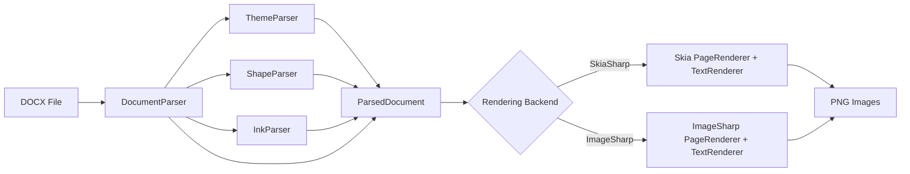
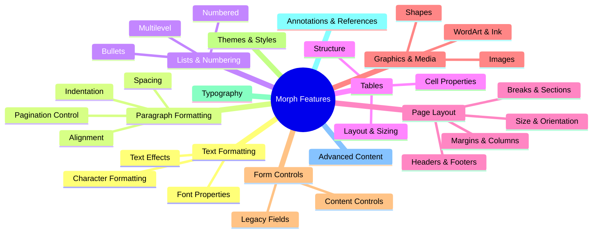
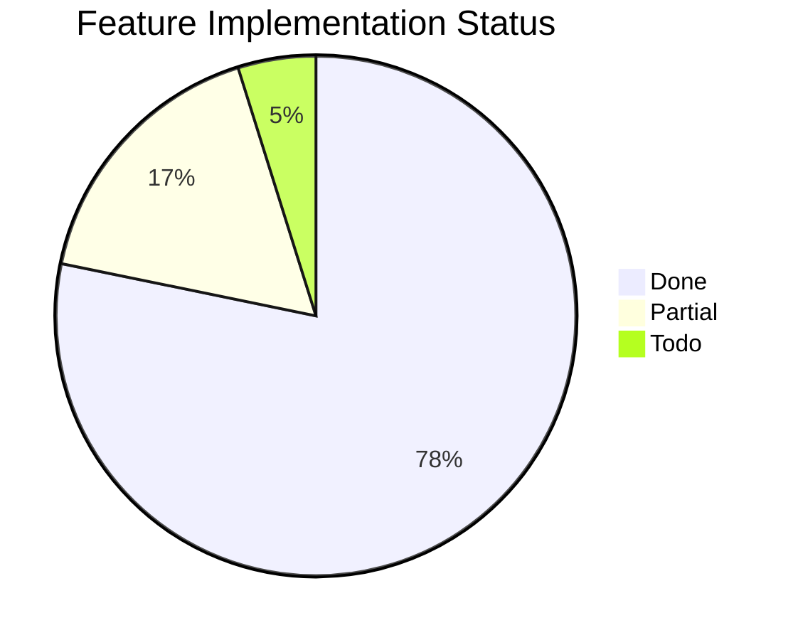

# Morph Feature Matrix

Comprehensive inventory of Microsoft Word DOCX features — what Morph supports today, what is partial, and what remains to be implemented. This document serves as both reference documentation and a living roadmap.

## How to Read This Document

### Status Markers

Each feature is tagged with one of:

| Marker | Meaning |
|--------|---------|
| `DONE` | Fully parsed, modeled, and rendered in both Skia and ImageSharp backends |
| `PARTIAL` | Parsed or modeled but with known limitations (details in notes) |
| `TODO` | Not yet implemented |

### Audience Key

Notes are tagged for three audiences:

- **Contributors** — Where the code lives, edge cases, architectural context
- **Consumers** — What to expect, behavioral limitations, workarounds
- **AI** — Which files to modify, what patterns to follow, relevant OOXML spec sections

### Keeping This File Current

When adding, modifying, or removing a DOCX feature:

1. Update the feature status (`DONE` / `PARTIAL` / `TODO`)
2. Update parse/model/render locations and audience notes
3. Update the summary statistics at the bottom
4. Add new test directory name to the Test row

---

## Rendering Pipeline

Key assemblies:

| Assembly | Role |
|----------|------|
| `Morph` | Core model: `DocumentElements.cs`, `RenderContextBase`, `TableLayout`, `FontHelpers` |
| `Morph.OpenXml` | DOCX parser: `DocumentParser.cs`, sub-parsers in `Parsers/` |
| `Morph.Skia` | SkiaSharp rendering: `PageRenderer.cs`, `TextRenderer.cs`, `RenderContext.cs` |
| `Morph.ImageSharp` | ImageSharp rendering: `PageRenderer.cs`, `TextRenderer.cs`, `RenderContext.cs` |
| `Morph.OpenXml.Skia` | Entry point: `WordRender.Skia.DocumentConverter` |
| `Morph.OpenXml.ImageSharp` | Entry point: `WordRender.ImageSharp.DocumentConverter` |

---

## Feature Hierarchy

---

## 1. Text Formatting (Run Properties)

OOXML parent element: `w:rPr` (run properties).
Model: `RunProperties` record in `DocumentElements.cs`.
Parse: `DocumentParser.ParseRunProperties()`.
Render: `TextRenderer` in both backends.

### 1.1 Font Properties

#### Font Family `DONE`

The typeface used to render text. Resolved from document, theme fonts, or system fallback.

- **OOXML**: `w:rFonts` — `w:ascii`, `w:hAnsi`, `w:cs`, `w:eastAsia`
- **Spec**: [Run Fonts](http://officeopenxml.com/WPtextFonts.php)
- **Model**: `RunProperties.FontFamily`
- **Render**: Font resolved via `FontHelpers` + `RenderContext.GetTypeface()`
- **Test**: `font_families/`

> **Contributors**: Font resolution order: effective candidate name (weight suffix stripping) -> original name -> stripped base name -> `FontHelpers.FontFallbacks` dictionary -> custom `FontFallback` callback. Cloud fonts searched in `%LOCALAPPDATA%\Microsoft\FontCache\4\CloudFonts\`. Office private fonts checked in `Program Files\Microsoft Office\root\vfs\Fonts\private\`.
> **Consumers**: If a document uses a font not installed on the system, Morph falls back through a chain of alternatives. Set `ConversionOptions.FontFallback` to provide custom mappings. Default font is Georgia 11pt — Georgia ships on Windows, macOS, and most Linux distributions out of the box, unlike Word's newer default (Aptos, Microsoft 365 only). Override globally via `DefaultFontSettings.DefaultFont` (must be set before the first render — throws afterwards), or per conversion via `WordRender.ConversionOptions.DefaultFont`. For pixel-stable rendering across machines (useful for snapshot tests), set `DefaultFontSettings.DeterministicRendering = true` during startup — the Skia backend then uses greyscale AA at integer pixel positions with no font hinting, eliminating platform-specific subpixel drift at the cost of slightly softer text.
> **AI**: Font resolution lives in `RenderContext.cs` (per backend) and `FontHelpers.cs`. When adding new fallback mappings, update `FontHelpers.FontFallbacks`. The `FontCacheLoader.cs` handles system font enumeration.

#### Font Size `DONE`

Text size in half-points (OOXML) converted to points for rendering.

- **OOXML**: `w:sz` (half-points)
- **Spec**: [Run Font Size](http://officeopenxml.com/WPtextFonts.php)
- **Model**: `RunProperties.FontSizePoints`
- **Test**: `font_sizes/`

> **Consumers**: Default size is 11pt (Georgia). Half-point values from OOXML are automatically converted.

### 1.2 Character Formatting

#### Bold `DONE`

Bold weight applied to text runs.

- **OOXML**: `w:b`, `w:bCs`
- **Spec**: [Bold](https://learn.microsoft.com/en-us/dotnet/api/documentformat.openxml.wordprocessing.bold)
- **Model**: `RunProperties.Bold`
- **Test**: `bold_text/`

> **Contributors**: Font weight detection in `FontHelpers.ImpliesBold()` handles fonts with "Bold", "Black", "Heavy", "Medium", "Demi", "Semibold" in the name. When bold is requested on a medium-weight font, the suffix is stripped and the base Bold variant is looked up.

#### Italic `DONE`

Italic style applied to text runs.

- **OOXML**: `w:i`, `w:iCs`
- **Spec**: [Italic](https://learn.microsoft.com/en-us/dotnet/api/documentformat.openxml.wordprocessing.italic)
- **Model**: `RunProperties.Italic`
- **Test**: `italic_text/`

#### Underline `DONE`

Underline decoration on text. Rendered 2px below the text baseline.

- **OOXML**: `w:u` with `w:val` (single, double, dotted, dash, etc.)
- **Spec**: [Underline](https://learn.microsoft.com/en-us/dotnet/api/documentformat.openxml.wordprocessing.underline)
- **Model**: `RunProperties.Underline`
- **Test**: `underline_text/`

> **Consumers**: All underline types (single, double, dotted, dash, wave, etc.) are detected but currently render as a single solid underline.

#### Strikethrough `DONE`

Line through the middle of text. Rendered at 30% above the text baseline.

- **OOXML**: `w:strike`, `w:dstrike` (double strikethrough)
- **Spec**: [Strikethrough](https://learn.microsoft.com/en-us/dotnet/api/documentformat.openxml.wordprocessing.strikethrough)
- **Model**: `RunProperties.Strikethrough`
- **Test**: `strikethrough_text/`

> **Consumers**: Both single and double strikethrough are parsed; both render as single strikethrough.

#### All Caps `DONE`

Displays text in uppercase regardless of source case.

- **OOXML**: `w:caps`
- **Spec**: [Caps](https://learn.microsoft.com/en-us/dotnet/api/documentformat.openxml.wordprocessing.caps)
- **Model**: `RunProperties.AllCaps`
- **Test**: `all_caps/`

> **Contributors**: Applied during text rendering via `ToUpperInvariant()` transform.

#### Small Caps `PARTIAL`

Displays lowercase letters as smaller uppercase letters while keeping original uppercase letters at full size.

- **OOXML**: `w:smallCaps`
- **Spec**: [SmallCaps](https://learn.microsoft.com/en-us/dotnet/api/documentformat.openxml.wordprocessing.smallcaps)
- **Model**: `RunProperties.SmallCaps`
- **Parse**: `w:smallCaps` parsed alongside `w:caps` in both style and inline run-property paths
- **Render**: not yet — small-caps runs render with their original case
- **Test**: covered by run-properties parsing tests; HtmlParserTests JSON snapshots regenerated to include the new field.

> **Contributors**: Marked PARTIAL until the renderer splits each run on case boundaries and renders the originally-lowercase segments uppercased at ~70% font size — a per-character font-scale change that the current line layout doesn't support.

#### Text Color `DONE`

Foreground color of text, either direct RGB or resolved from theme color with transforms.

- **OOXML**: `w:color` with `w:val` (hex RGB) or `w:themeColor` + transforms
- **Spec**: [Color](http://officeopenxml.com/WPtextFormatting.php)
- **Model**: `RunProperties.ColorHex`
- **Test**: `colored_text/`

> **Contributors**: Theme colors resolved in `DocumentParser` using `ShapeParser.ResolveColorHex()` with shade/tint/luminance/saturation transforms. See `ThemeColors` and `ColorTransforms` records.

#### Text Background / Highlight `DONE`

Background shading behind text runs.

- **OOXML**: `w:highlight`, `w:shd`
- **Spec**: [Highlight](https://learn.microsoft.com/en-us/dotnet/api/documentformat.openxml.wordprocessing.highlight)
- **Model**: `RunProperties.BackgroundColorHex`

> **Contributors**: Rendered as a filled rectangle spanning ascent + descent height behind the text fragment.

#### Character Spacing `DONE`

Additional spacing between characters (positive or negative), measured in points.

- **OOXML**: `w:spacing` within `w:rPr` (in twentieths of a point)
- **Spec**: [Spacing](https://learn.microsoft.com/en-us/dotnet/api/documentformat.openxml.wordprocessing.spacingmark)
- **Model**: `RunProperties.CharacterSpacingPoints`
- **Test**: Spec test: `CharacterSpacingTests`

> **Contributors**: Applied per-character during text measurement and rendering. Added to each character advance width.

#### Superscript `DONE`

Raises text above the baseline, typically at a smaller font size.

- **OOXML**: `w:vertAlign` with `w:val="superscript"`
- **Spec**: [VerticalTextAlignment](https://learn.microsoft.com/en-us/dotnet/api/documentformat.openxml.wordprocessing.verticaltextalignment)
- **Model**: `RunProperties.VerticalAlignment = VerticalAlignment.Superscript`
- **Test**: `subscript_superscript/`

> **Contributors**: Raised 35% of font size above baseline in `TextRenderer`.

#### Subscript `DONE`

Lowers text below the baseline, typically at a smaller font size.

- **OOXML**: `w:vertAlign` with `w:val="subscript"`
- **Spec**: [VerticalTextAlignment](https://learn.microsoft.com/en-us/dotnet/api/documentformat.openxml.wordprocessing.verticaltextalignment)
- **Model**: `RunProperties.VerticalAlignment = VerticalAlignment.Subscript`
- **Test**: `subscript_superscript/`

> **Contributors**: Lowered 15% of font size below baseline in `TextRenderer`.

#### Kerning `PARTIAL`

Adjusts spacing between specific character pairs for visual balance.

- **OOXML**: `w:kern` (minimum font size threshold for kerning, in half-points)
- **Spec**: [Kern](https://learn.microsoft.com/en-us/dotnet/api/documentformat.openxml.wordprocessing.kern)
- **Model**: `RunProperties.KerningMinFontSizePoints`
- **Parse**: `DocumentParser.BuildRunProperties` reads `w:kern` (half-points → points)
- **Render**: relies on the platform shaper. SkiaSharp via HarfBuzz applies font kerning tables by default at all sizes; ImageSharp.Fonts also kerns automatically. The `KerningMinFontSizePoints` threshold is captured but not enforced — kerning happens regardless of size.
- **Test**: covered by run-properties parsing tests.

> **Contributors**: Marked PARTIAL because we don't currently honour the size threshold (kerning is unconditionally on). Most documents target the default Word threshold (16pt), so visual differences are minor.

#### Ligatures `PARTIAL`

Combines specific character sequences (fi, fl, ff, etc.) into single glyphs.

- **OOXML**: `w14:ligatures` (Word 2010+ extension)
- **Spec**: [Ligatures](https://learn.microsoft.com/en-us/openspecs/office_standards/ms-docx/b839fe1f-e1ca-4fa6-8c26-5954d0abbccd)
- **Model**: `LigatureMode` flags (`Standard`, `Contextual`, `Historical`, `Discretional`); `RunProperties.Ligatures` (default `Standard`)
- **Parse**: `DocumentParser.ParseLigatureMode` reads `w14:ligatures` and maps the OOXML enumerated values to the flag combination
- **Render**: not enforced — SkiaSharp/HarfBuzz and ImageSharp.Fonts both apply standard OpenType ligatures by default. The flags are captured but the renderer doesn't toggle them per run.
- **Test**: covered by run-properties parsing tests.

> **Contributors**: To honour `LigatureMode.None` we'd need to disable the default `liga`/`clig` features per draw call, and to honour `Discretional`/`Historical` we'd need to enable `dlig`/`hlig` — both possible via SKShaper / HarfBuzz feature settings, neither wired today.

### 1.3 Text Effects

#### Text Shadow `PARTIAL`

Shadow effect behind text (not to be confused with WordArt shadow).

- **OOXML**: `w14:shadow` with color, blur radius, distance, angle
- **Spec**: [MS-DOCX Text Effects](https://learn.microsoft.com/en-us/openspecs/office_standards/ms-docx/b839fe1f-e1ca-4fa6-8c26-5954d0abbccd)
- **Model**: `RunProperties.Effects` includes `TextEffects.Shadow` flag (presence only)
- **Parse**: detects `w14:shadow` element on run properties
- **Render**: not yet — shadow effect is not drawn

> **Contributors**: Captures presence only. Shadow parameters (color, blur, distance, angle) aren't extracted; full rendering would adapt the WordArt shadow code in `TextRenderer`.

#### Text Outline `PARTIAL`

Outline/stroke around text characters.

- **OOXML**: `w14:textOutline` with color, width, line style
- **Spec**: [MS-DOCX Text Effects](https://learn.microsoft.com/en-us/openspecs/office_standards/ms-docx/b839fe1f-e1ca-4fa6-8c26-5954d0abbccd)
- **Model**: `RunProperties.Effects` includes `TextEffects.Outline` flag (presence only)
- **Parse**: detects `w14:textOutline` element on run properties
- **Render**: not yet — outline stroke is not drawn

> **Contributors**: Outline color, width, and line-style parameters aren't extracted; rendering would mirror the WordArt outline code in `TextRenderer`.

#### Text Glow `PARTIAL`

Soft glow effect around text.

- **OOXML**: `w14:glow` with color, radius
- **Spec**: [MS-DOCX Text Effects](https://learn.microsoft.com/en-us/openspecs/office_standards/ms-docx/b839fe1f-e1ca-4fa6-8c26-5954d0abbccd)
- **Model**: `RunProperties.Effects` includes `TextEffects.Glow` flag (presence only)
- **Parse**: detects `w14:glow` element on run properties
- **Render**: not yet — glow is not drawn

#### Text Reflection `PARTIAL`

Mirrored reflection below text.

- **OOXML**: `w14:reflection` with transparency, size, blur, distance
- **Spec**: [MS-DOCX Text Effects](https://learn.microsoft.com/en-us/openspecs/office_standards/ms-docx/b839fe1f-e1ca-4fa6-8c26-5954d0abbccd)
- **Model**: `RunProperties.Effects` includes `TextEffects.Reflection` flag (presence only)
- **Parse**: detects `w14:reflection` element on run properties
- **Render**: not yet — reflection is not drawn

---

## 2. Paragraph Formatting

OOXML parent element: `w:pPr` (paragraph properties).
Model: `ParagraphProperties` record in `DocumentElements.cs`.
Parse: `DocumentParser.ParseParagraphProperties()`.
Render: `TextRenderer.MeasureAndRenderParagraph()` in both backends.

### 2.1 Alignment

#### Left Alignment `DONE`

Default text alignment — flush left, ragged right.

- **OOXML**: `w:jc` with `w:val="left"` (or absent)
- **Spec**: [Justification](http://officeopenxml.com/WPalignment.php)
- **Model**: `ParagraphProperties.Alignment = TextAlignment.Left`
- **Test**: `align_left/`

#### Center Alignment `DONE`

Text centered within the available width.

- **OOXML**: `w:jc` with `w:val="center"`
- **Model**: `ParagraphProperties.Alignment = TextAlignment.Center`
- **Test**: `align_center/`

#### Right Alignment `DONE`

Text flush right, ragged left.

- **OOXML**: `w:jc` with `w:val="right"`
- **Model**: `ParagraphProperties.Alignment = TextAlignment.Right`
- **Test**: `align_right/`

#### Justified Alignment `DONE`

Text spread to fill the full width, with extra space distributed between words.

- **OOXML**: `w:jc` with `w:val="both"`
- **Model**: `ParagraphProperties.Alignment = TextAlignment.Justify`
- **Test**: `align_justified/`

> **Contributors**: Last line of a justified paragraph is left-aligned (not stretched). Extra space is distributed between word gaps only.

### 2.2 Spacing

#### Spacing Before / After `DONE`

Vertical space above and below a paragraph, in points.

- **OOXML**: `w:spacing` — `w:before`, `w:after` (in twentieths of a point)
- **Spec**: [Paragraph Spacing](http://officeopenxml.com/WPspacing.php)
- **Model**: `ParagraphProperties.SpacingBeforePoints`, `SpacingAfterPoints`
- **Test**: `paragraph_spacing/`

> **Contributors**: Adjacent paragraph spacing uses margin collapsing: `max(after, before)`, not sum. Implemented in `TextRenderer`.

#### Line Spacing `DONE`

Vertical distance between lines within a paragraph. Three modes: Auto (multiplier), Exactly (fixed), AtLeast (minimum).

- **OOXML**: `w:spacing` — `w:line`, `w:lineRule` (auto/exact/atLeast)
- **Spec**: [Line Spacing](http://officeopenxml.com/WPspacing.php)
- **Model**: `ParagraphProperties.LineSpacingMultiplier`, `LineSpacingPoints`, `LineSpacingRule`
- **Test**: `line_spacing/`, `line_spacing_at_least/`, `line_spacing_exactly/`

> **Contributors**: Auto mode applies a Word compatibility boost (~7.5% for 1.0x spacing, graduated). Document grid line pitch enforced when >= 20 page break markers detected. See `TextRenderer` line spacing logic.
> **Consumers**: Single (1.0), 1.5, and Double (2.0) spacing all supported. Exactly mode fixes line height; AtLeast sets a minimum.

#### Contextual Spacing `DONE`

Suppresses spacing between paragraphs of the same style.

- **OOXML**: `w:contextualSpacing`
- **Spec**: [ContextualSpacing](https://learn.microsoft.com/en-us/dotnet/api/documentformat.openxml.wordprocessing.contextualspacing)
- **Model**: `ParagraphProperties.ContextualSpacing`

> **Contributors**: Collapses both before and after spacing when adjacent paragraphs share the same `StyleId`. Tracked via `LastParagraphStyleId` and `LastParagraphHadContextualSpacing` in `RenderContextBase`.

### 2.3 Indentation

#### First Line Indent `DONE`

Indents the first line of a paragraph from the left margin.

- **OOXML**: `w:ind` with `w:firstLine` (in twentieths of a point)
- **Spec**: [Indentation](http://officeopenxml.com/WPindentation.php)
- **Model**: `ParagraphProperties.FirstLineIndentPoints`
- **Test**: `first_line_indent/`

#### Hanging Indent `DONE`

All lines except the first are indented. Used for list items and bibliography entries.

- **OOXML**: `w:ind` with `w:hanging`
- **Model**: `ParagraphProperties.HangingIndentPoints`
- **Test**: `hanging_indent/`

#### Left / Right Indent `DONE`

Indents the entire paragraph from the left and/or right margin.

- **OOXML**: `w:ind` with `w:left`, `w:right`
- **Model**: `ParagraphProperties.LeftIndentPoints`, `RightIndentPoints`
- **Test**: `left_indent/`

### 2.4 Pagination Control

#### Page Break Before `DONE`

Forces the paragraph to start on a new page.

- **OOXML**: `w:pageBreakBefore`
- **Model**: `ParagraphProperties.PageBreakBefore`
- **Test**: `page_breaks/`

#### Keep With Next `DONE`

Prevents a page break between this paragraph and the next.

- **OOXML**: `w:keepNext`
- **Model**: `ParagraphProperties.KeepNext`

> **Contributors**: Implemented by measuring the next element and ensuring both fit on the current page. See `PageRenderer` keep-next logic.

#### Keep Lines Together `DONE`

Prevents a page break within this paragraph — all lines stay on the same page.

- **OOXML**: `w:keepLines`
- **Model**: `ParagraphProperties.KeepLines`

#### Widow / Orphan Control `PARTIAL`

Prevents single lines from appearing alone at the top (widow) or bottom (orphan) of a page.

- **OOXML**: `w:widowControl`
- **Spec**: [WidowControl](https://learn.microsoft.com/en-us/dotnet/api/documentformat.openxml.wordprocessing.widowcontrol)
- **Model**: `ParagraphProperties.WidowControl`

> **Contributors**: Property is parsed and stored but not enforced during pagination. Implementation would require measuring individual lines and moving at least 2 lines when breaking.
> **Consumers**: Parsed but not enforced — single lines may appear at page top/bottom.
> **AI**: Enforcement requires changes to the page break logic in `PageRenderer`. When a paragraph breaks across pages, ensure at least 2 lines remain on each side. Reference the `KeepLines` implementation for approach.

### 2.5 Paragraph Decoration

#### Paragraph Background / Shading `DONE`

Background color behind the full paragraph area.

- **OOXML**: `w:shd` within `w:pPr`
- **Model**: `ParagraphProperties.BackgroundColorHex`
- **Test**: `block_quote/`

> **Contributors**: Rendered as a filled rectangle spanning the full paragraph height, respecting left/right indents. See `TextRenderer` paragraph background rendering.

#### Horizontal Rule `DONE`

A horizontal line spanning the content width.

- **OOXML**: `w:pBdr` (paragraph border bottom only) or `
` in AltChunk HTML
- **Model**: `HorizontalRuleElement`

#### Suppress Line Numbers `DONE`

Excludes this paragraph from line numbering.

- **OOXML**: `w:suppressLineNumbers`
- **Model**: `ParagraphProperties.SuppressLineNumbers`
- **Test**: `line_numbers_suppressed/`

#### Suppress Auto Hyphens `DONE`

Prevents automatic hyphenation for this paragraph.

- **OOXML**: `w:suppressAutoHyphens`
- **Model**: `ParagraphProperties.SuppressAutoHyphens`
- **Test**: `hyphenation_suppressed/`

#### Paragraph Borders `DONE`

Borders around a paragraph (top, bottom, left, right, between).

- **OOXML**: `w:pBdr` — `w:top`, `w:bottom`, `w:left`, `w:right`, `w:between`
- **Parse**: `DocumentParser.ParseParagraphProperties()` and `ParseStyleParagraphProperties()` in `Morph.OpenXml/Parsing/DocumentParser.cs`; per-edge `w:space` via `ParseBorderSpace()`
- **Model**: `ParagraphProperties.Borders` (reuses `CellBorders` for Top/Right/Bottom/Left), plus per-edge `BorderTopSpacePoints` / `BorderBottomSpacePoints` / `BorderLeftSpacePoints` / `BorderRightSpacePoints`, and `BorderBetween` / `BorderBetweenSpacePoints`
- **Render**: paragraph-border block in `Morph.Skia/Rendering/TextRenderer.cs` and `Morph.ImageSharp/Rendering/TextRenderer.cs`. Between-border collapse uses `RenderContextBase.SuppressNextParagraphTopBorder` to coordinate neighbors.
- **Test**: `paragraph_borders/`
- **Spec**: [Paragraph Borders](http://officeopenxml.com/WPborders.php)

> **Contributors**: All four box edges plus `w:between` are rendered. Per-edge `w:space` is honored — when the requested space exceeds the paragraph's SpacingBefore/After, the excess is reserved so borders don't poke into neighbors (matches Word's layout). Consecutive paragraphs sharing the same `w:pBdr` + `w:between` definition collapse their adjacent top/bottom into a single between line, and spacing/borders fuse into one visual box.

---

## 3. Lists & Numbering

OOXML source: `numbering.xml` defines abstract numbering schemes (`w:abstractNum`) with per-level definitions (`w:lvl`). Paragraphs reference numbering via `w:numPr` in `w:pPr`.
Model: `NumberingInfo` record in `DocumentElements.cs`.
Parse: `DocumentParser` extracts numbering definitions and resolves per-paragraph.
Render: `TextRenderer.RenderBullet()` / `RenderBulletInBounds()`.

### 3.1 Bullet Lists

#### Bullet Lists `DONE`

Unordered lists with bullet characters. Supports Symbol and Wingdings font mapping.

- **OOXML**: `w:numPr` referencing a bullet-type `w:abstractNum`
- **Spec**: [Numbering](http://officeopenxml.com/WPnumberingAbstractNum.php)
- **Model**: `ParagraphProperties.Numbering` → `NumberingInfo` with `.Text` (bullet char)
- **Render**: `TextRenderer.RenderBullet()`
- **Test**: `bullet_list/`

> **Contributors**: Unicode mapping for Symbol/Wingdings bullet characters handled during parsing. Bullet font defaults to Arial for standard Unicode bullet chars.

#### Custom Bullet Fonts `DONE`

Bullet characters rendered with a specific font family override.

- **Model**: `NumberingInfo.FontFamily`
- **Test**: `bullet_list/`

### 3.2 Numbered Lists

#### Numbered Lists `DONE`

Ordered lists with sequential counter tracking across paragraphs.

- **OOXML**: `w:numPr` referencing a numbered `w:abstractNum`
- **Model**: `NumberingInfo.Text` (formatted number text with tracked counters)
- **Parse**: `DocumentParser.GetNumberingInfo()` with `numberingCounters` dictionary
- **Test**: `numbered_list/`, `numbered_list_tracking/`

> **Contributors**: Counter tracked per `(numId, ilvl)` pair in `DocumentParser.numberingCounters`. Counters increment on each paragraph referencing the same numbering instance. Different `numId` values restart independently. `FormatNumber()` handles decimal, upperRoman, lowerRoman, upperLetter, lowerLetter formats. Multi-level placeholders (`%1.%2.`) supported.
> **Consumers**: Numbered lists display with correct sequential numbers. Counters continue across interruptions within the same list, and restart for new lists.

#### Numbering Formats `DONE`

Different number representations: decimal, roman (upper/lower), letter (upper/lower).

- **OOXML**: `w:numFmt` — `decimal`, `upperRoman`, `lowerRoman`, `upperLetter`, `lowerLetter`
- **Spec**: [Number Format](https://learn.microsoft.com/en-us/dotnet/api/documentformat.openxml.wordprocessing.numberingformat)
- **Parse**: `DocumentParser.FormatNumber()`, `ToRoman()`, `ToLetter()`

> **Contributors**: `NumberFormatValues` stored on `NumberingLevelDefinition.NumberFormat`. `FormatNumber()` dispatches to `ToRoman()` or `ToLetter()` based on the format. Roman numerals support 1-3999. Letters support A-Z, then AA, AB, etc.

#### List Restart / Continue `DONE`

Restarting numbering or continuing from a previous list.

- **OOXML**: `w:numId` change, `w:startOverride` in `w:lvlOverride`
- **Parse**: `DocumentParser.ExtractNumberingDefinitions()` — clones abstract levels and applies `StartOverrideNumberingValue`
- **Test**: `numbered_list_tracking/`, `numbered_list_restart/`

> **Contributors**: Different `numId` values restart counters independently. `w:lvlOverride` with `w:startOverride` in numbering instances overrides the abstract definition's start number. The override is applied during extraction by cloning the abstract level definition with the new start value.
> **Consumers**: Lists restart correctly when Word creates separate numbering instances. Custom start values (e.g., starting at 10) are supported.

### 3.3 Multilevel Lists

#### Nested / Multilevel Lists `DONE`

Lists with multiple indent levels, each with its own bullet or numbering style.

- **OOXML**: `w:ilvl` (indent level) within `w:numPr`, up to 9 levels in `w:abstractNum`
- **Model**: `NumberingInfo.IndentPoints`, `NumberingInfo.HangingIndentPoints`
- **Test**: `nested_list/`, `deep_nested_list/`

> **Contributors**: Level-specific formatting (indent, hanging indent, bullet character, font) resolved during parsing from the abstractNum definition. Deep nesting (6+ levels) tested.

---

## 4. Tables

OOXML elements: `w:tbl`, `w:tblPr`, `w:tblGrid`, `w:tr`, `w:trPr`, `w:tc`, `w:tcPr`.
Model: `TableElement`, `TableRow`, `TableCell`, `TableProperties`, `TableCellProperties` in `DocumentElements.cs`.
Layout: `TableLayout.cs` (shared measurement/calculation).
Render: `PageRenderer.RenderTable*()` methods in both backends.

### 4.1 Structure

#### Basic Table Structure `DONE`

Tables with rows and cells containing paragraphs and other content.

- **OOXML**: `w:tbl` > `w:tr` > `w:tc` > `w:p`
- **Spec**: [Table Structure](http://officeopenxml.com/WPtable.php)
- **Model**: `TableElement` → `TableRow` list → `TableCell` list
- **Parse**: `DocumentParser.ParseTable()`
- **Test**: `simple_table/`

#### Nested Tables `DONE`

Tables within table cells.

- **Model**: Cell content can contain `TableElement` children
- **Test**: `complex_tables/`

> **Contributors**: Nested table height uses an approximate 50pt estimate during parent table layout. Deeply nested structures are supported but height estimation becomes less accurate.
> **Consumers**: Nested tables render correctly for typical cases. Very complex nesting may show slight height inaccuracies.

#### Table Indent `DONE`

Horizontal offset of the table from the left margin.

- **OOXML**: `w:tblInd`
- **Model**: `TableProperties.IndentPoints`

### 4.2 Cell Properties

#### Cell Borders `DONE`

Per-cell border control for all four edges with color, width, and visibility. Falls back to table-level defaults via smart resolution.

- **OOXML**: `w:tcBorders` — `w:top`, `w:bottom`, `w:left`, `w:right`
- **Spec**: [Table Cell Borders](http://officeopenxml.com/WPtableCellBorders.php)
- **Model**: `CellBorders`, `BorderEdge` in `DocumentElements.cs`
- **Layout**: `TableLayout.ResolveCellBorders()` — merges cell/table/inside borders
- **Test**: `table_borders/`

> **Contributors**: Resolution order: cell-level borders override table defaults. Outer cells use `DefaultBorders`, inner cells use `InsideHorizontalBorder`/`InsideVerticalBorder`. See `TableLayout.ResolveCellBorders()`.
> **Consumers**: Standard solid borders render correctly. Double/dashed/dotted styles render as solid.

#### Cell Shading / Background `DONE`

Background fill color for individual cells.

- **OOXML**: `w:shd` within `w:tcPr`
- **Model**: `TableCellProperties.BackgroundColorHex`
- **Test**: `table_colors/`

> **Contributors**: Background rendered as filled rectangle before border drawing — background first, borders on top.

#### Cell Padding `DONE`

Space between cell border and cell content (inside the cell).

- **OOXML**: `w:tcMar` (per-cell) or `w:tblCellMar` (table default)
- **Spec**: [Cell Margins](http://officeopenxml.com/WPtableCellMargins.php)
- **Model**: `TableCellProperties.Padding` (per-cell), `TableProperties.DefaultCellPadding`
- **Test**: `table_cell_padding/`, `table_cell_padding_varied/`, `table_default_cell_margin/`

#### Cell Margins `DONE`

Additional margin space outside cell content area.

- **Model**: `TableCellProperties.Margin`, `TableProperties.DefaultCellMargin`
- **Test**: `table_cell_margin_per_cell/`

#### Cell Vertical Alignment `DONE`

Vertical positioning of content within a cell: top, center, or bottom.

- **OOXML**: `w:vAlign` — `top`, `center`, `bottom`
- **Model**: `TableCellProperties.VerticalAlignment`

> **Contributors**: Special handling for vertically merged cells — alignment calculated across the full merged span.

### 4.3 Layout & Sizing

#### Column Widths `DONE`

Column width determination from explicit cell widths or table grid definitions.

- **OOXML**: `w:tblGrid` > `w:gridCol`, `w:tcW`
- **Layout**: `TableLayout.CalculateColumnWidths()`
- **Test**: `wide_table/`

> **Contributors**: Three sources: explicit cell widths (`w:tcW`), grid column widths (`w:tblGrid`), or equal distribution. Width scaling applied when content exceeds available page width.

#### Horizontal Merge (GridSpan) `DONE`

Cells spanning multiple columns.

- **OOXML**: `w:gridSpan` within `w:tcPr`
- **Model**: `TableCellProperties.GridSpan`

#### Vertical Merge `DONE`

Cells spanning multiple rows.

- **OOXML**: `w:vMerge` — `restart` (start of merge) or `continue` (continuation)
- **Model**: `TableCellProperties.VerticalMerge` (Restart/Continue enum)
- **Layout**: `TableLayout.CalculateVerticalMergeHeights()`
- **Test**: `table_vmerge_basic/`, `table_vmerge_explicit_heights/`

> **Contributors**: Per-column Y-position tracking ensures merged cells render across the correct row span. Height distributed proportionally.

#### Row Heights `DONE`

Explicit row height control: exact (fixed) or atLeast (minimum).

- **OOXML**: `w:trHeight` with `w:hRule` (exact/atLeast) and `w:val`
- **Model**: `TableRow.HeightPoints`, `TableRow.ExactHeight`
- **Test**: `table_explicit_heights/`, `table_layout_tall_row/`

> **Contributors**: Multi-pass calculation: content heights first, then explicit heights, then vMerge adjustment.

#### Multi-page Tables `DONE`

Tables that span multiple pages with automatic page breaks between rows.

- **Render**: `PageRenderer.RenderTableRowByRow()`
- **Test**: `table_multipage/`, `table_page_break/`

> **Contributors**: Triggered when table height exceeds content area + 10% tolerance. Switches to row-by-row rendering with page break check before each row.

### 4.4 Advanced Table Features

#### Floating Tables `PARTIAL`

Tables with absolute positioning on the page.

- **OOXML**: `w:tblpPr` (table positioning properties)
- **Model**: `TableProperties.IsFloating`

> **Contributors**: The `IsFloating` property is parsed but absolute positioning logic is limited. Floating tables currently render inline.
> **Consumers**: Floating tables are rendered but may not appear at their intended absolute position.
> **AI**: Full implementation requires reading `w:tblpPr` attributes (horizontal/vertical position, anchor), then rendering the table at the calculated absolute position similar to `FloatingImageElement` handling.

#### Table Auto-fit `PARTIAL`

Automatic column width adjustment based on content.

- **OOXML**: `w:tblLayout` with `w:type="autofit"` or `"fixed"`
- **Spec**: [Table Layout](http://officeopenxml.com/WPtableLayout.php)
- **Model**: `TableProperties.IsAutoFit` (default `true`, matching Word's behaviour for tables without an explicit layout type)
- **Parse**: `DocumentParser.ParseTable()` reads `w:tblLayout/@type`; only `fixed` flips the flag
- **Render**: `TableLayout.CalculateColumnWidths` already distributes widths proportionally regardless of mode, so the field is captured but doesn't yet drive different layouts
- **Test**: HtmlParserTests JSON snapshots regenerated to include the new field

> **Contributors**: Marked PARTIAL until the renderer measures cell content and reflows columns when `IsAutoFit` is true (currently the grid widths from `w:tblGrid` are used regardless).

#### Header Row Repeat `PARTIAL`

Repeats the first row(s) as header on each page when a table spans multiple pages.

- **OOXML**: `w:tblHeader` within `w:trPr`
- **Spec**: [Table Header](https://learn.microsoft.com/en-us/dotnet/api/documentformat.openxml.wordprocessing.tableheader)
- **Model**: `TableRow.IsHeader`
- **Parse**: `DocumentParser.ParseTable()` reads `w:trPr/w:tblHeader`
- **Render**: not yet — header rows render once at the top of the table; multi-page tables don't repeat them at each page break.

> **Contributors**: Marked PARTIAL until `RenderTableRowByRow` re-renders the contiguous header rows after each page break in both backends.
> **AI**: To finish, in both `PageRenderer.RenderTableRowByRow` paths track whether the current row is the first row on a freshly-started page (compare `context.CurrentY` to `context.ContentTop` after `EnsureSpaceFor`). When it is and the current row isn't itself a header, render `table.Rows.TakeWhile(_ => _.IsHeader)` first.

#### Table Alignment `DONE`

Horizontal alignment of the table on the page (left, center, right).

- **OOXML**: `w:jc` within `w:tblPr`
- **Spec**: [Table Alignment](http://officeopenxml.com/WPtableAlignment.php)
- **Model**: `TableProperties.Alignment` (`TextAlignment` enum; Justify is treated as Left)
- **Parse**: `DocumentParser.ParseTable()` reads `w:tblPr/w:jc` (`TableJustification`)
- **Render**: `PageRenderer.ComputeTableX` shifts the table by `(ContentWidth - tableWidth) / 2` for Center and `(ContentWidth - tableWidth)` for Right; both backends
- **Test**: `table_alignment/`, spec test `TableAlignmentTests`

> **Contributors**: When the table is wider than the content area, `Math.Max(0, slack)` keeps it pinned at the left edge instead of shifting off-page.

#### Table Cell Text Direction `PARTIAL`

Rotated text direction within cells (bottom-to-top, top-to-bottom).

- **OOXML**: `w:textDirection` within `w:tcPr`
- **Model**: `CellTextDirection` enum (`LeftToRight`, `BottomToTop`, `TopToBottom`); `TableCellProperties.TextDirection`
- **Parse**: cell-properties parser reads `w:textDirection` and maps `btLr` → `BottomToTop`, `tbRl` → `TopToBottom`
- **Spec**: [TextDirection](https://learn.microsoft.com/en-us/dotnet/api/documentformat.openxml.wordprocessing.textdirection)
- **Render**: not yet — vertical-direction cells render with horizontal text. Capturing this lets consumers detect and skip cells they can't render meaningfully.

> **Contributors**: Marked PARTIAL until the renderer wraps cell content in a `SKCanvas.RotateDegrees(±90)` (Skia) or equivalent rotation in ImageSharp.

---

## 5. Page Layout & Sections

Model: `PageSettings`, `SectionBreakElement` in `DocumentElements.cs`.
Parse: `DocumentParser.ParseSectionBreak()`.
Render: `PageRenderer.RenderDocument()` manages page creation, `RenderContextBase` tracks page state.

### 5.1 Page Size & Orientation

#### Standard Page Sizes `DONE`

A4 (595.28 x 841.89pt), Letter (612 x 792pt), Legal (612 x 1008pt), and custom dimensions.

- **OOXML**: `w:pgSz` — `w:w`, `w:h` (in twentieths of a point)
- **Spec**: [Page Size](http://officeopenxml.com/WPsection.php)
- **Model**: `PageSettings.WidthPoints`, `HeightPoints`
- **Test**: `page_a4/`, `page_letter/`, `page_legal/`

> **Contributors**: Default page size is region-based — Letter for North America (US, CA, MX, etc.), A4 elsewhere. Controlled by `DefaultPageSize` class. Can be overridden via `DefaultPageSize.UseLetterSize`.

#### Landscape Orientation `DONE`

Page rotated to landscape (width > height).

- **OOXML**: `w:pgSz` with `w:orient="landscape"`
- **Model**: Width/Height swapped in `PageSettings`
- **Test**: `page_landscape/`

### 5.2 Margins

#### Page Margins `DONE`

Top, bottom, left, and right margins controlling the content area.

- **OOXML**: `w:pgMar` — `w:top`, `w:bottom`, `w:left`, `w:right`
- **Spec**: [Page Margins](http://officeopenxml.com/WPsectionPgMar.php)
- **Model**: `PageSettings.MarginTopPoints`, `MarginBottomPoints`, `MarginLeftPoints`, `MarginRightPoints`
- **Test**: `custom_margins/`

> **Contributors**: Content area calculated as page size minus margins. Stored in `RenderContextBase` as `ContentLeft`, `ContentTop`, `ContentBottom`, `ContentWidth`.

#### Gutter Margins `DONE`

Extra margin space on the binding edge for printed documents.

- **OOXML**: `w:pgMar` with `w:gutter`, plus `w:gutterAtTop` in document settings
- **Spec**: [Gutter](http://officeopenxml.com/WPsectionPgMar.php)
- **Model**: `PageSettings.GutterPoints`, `PageSettings.GutterAtTop`
- **Parse**: `DocumentParser.ExtractPageSettings` reads `w:pgMar/@w:gutter`. The gutter is folded into `MarginLeft` (or `MarginTop` when `w:gutterAtTop`) at parse time, so the rest of the pipeline doesn't need to know about it; the original gutter value is preserved for consumers.
- **Render**: not a separate render step — covered by the existing margin handling.
- **Test**: `gutter_margins/`, spec test `GutterMarginsTests`

> **Contributors**: Folding gutter into the effective margin is deliberate: every renderer already knows how to handle margins, so we avoid threading a "gutter offset" through `RenderContextBase`.

### 5.3 Columns

#### Multi-column Layout `DONE`

Document content flowing across 2+ columns per page.

- **OOXML**: `w:cols` — `w:num` (count), `w:space` (spacing between)
- **Spec**: [Columns](http://officeopenxml.com/WPsectionColMultiple.php)
- **Model**: `PageSettings.ColumnCount`, `PageSettings.ColumnSpacing`
- **Test**: `two_columns/`, `three_columns/`

> **Contributors**: Column width = `(ContentWidth - spacing * (count - 1)) / count`. Current column tracked in `RenderContextBase.CurrentColumn`. Content flows left-to-right across columns before moving to next page.

#### Column Breaks `DONE`

Force content to the next column (or next page if in last column).

- **OOXML**: `w:br` with `w:type="column"`
- **Model**: `ColumnBreakElement`
- **Test**: `column_breaks/`

### 5.4 Breaks

#### Page Breaks `DONE`

Explicit break forcing content to the next page.

- **OOXML**: `w:br` with `w:type="page"`
- **Model**: `PageBreakElement`
- **Test**: `page_breaks/`, `explicit_break_blank_page/`, `mixed_breaks/`

> **Contributors**: Blank trailing pages (created by trailing breaks with no significant content) are automatically removed via `RemoveBlankTrailingPage()`.

#### Line Breaks `DONE`

Soft return within a paragraph (shift+enter).

- **OOXML**: `w:br` (no type or `w:type="textWrapping"`)
- **Model**: `LineBreakElement`
- **Test**: `line_breaks/`, `text_wrapping_break/`

#### Section Break: Next Page `DONE`

Starts a new section on the next page with new page settings.

- **OOXML**: `w:sectPr` with `w:type="nextPage"`
- **Model**: `SectionBreakElement` with `SectionBreakType.NextPage`
- **Test**: `section_break_next_page/`

#### Section Break: Continuous `DONE`

Starts a new section on the same page. Resets column layout.

- **OOXML**: `w:sectPr` with `w:type="continuous"`
- **Model**: `SectionBreakElement` with `SectionBreakType.Continuous`
- **Test**: `section_break_continuous/`

#### Section Break: Even / Odd Page `DONE`

Starts a new section on the next even or odd page, inserting a blank page if needed.

- **OOXML**: `w:sectPr` with `w:type="evenPage"` or `w:type="oddPage"`
- **Model**: `SectionBreakElement` with `SectionBreakType.EvenPage` / `OddPage`
- **Test**: `section_break_even_page/`, `section_break_odd_page/`

### 5.5 Headers & Footers

#### Default Headers / Footers `DONE`

Content repeated at the top/bottom of every page.

- **OOXML**: `w:headerReference` / `w:footerReference` with `w:type="default"`
- **Spec**: [Headers & Footers](http://officeopenxml.com/WPheaders.php)
- **Model**: `ParsedDocument.Header`, `ParsedDocument.Footer` → `HeaderFooterContent`
- **Test**: `header/`, `footer/`, `header_footer/`

> **Contributors**: Header/footer content supports paragraphs, tables, inline images, and anchored (floating) images — including full-page `behindDoc` background images used by many Word templates. Rendered at fixed positions based on `HeaderDistance`/`FooterDistance` from page edge. Content area adjusted via `SetHeaderFooterSpace()`. Image relationships (`r:embed`) inside header/footer parts are resolved against the host part, not the main document part.

#### First-Page Different Headers / Footers `DONE`

Different header/footer content for the first page of a section.

- **OOXML**: `w:titlePg` flag, `w:headerReference` with `w:type="first"`
- **Model**: `ParsedDocument.FirstPageHeader`, `FirstPageFooter`, `PageSettings.DifferentFirstPage`

#### Even / Odd Page Headers `PARTIAL`

Different header/footer content for even vs. odd pages.

- **OOXML**: `w:evenAndOddHeaders` in document settings, `w:type="even"` references

> **Contributors**: Even/odd header references are parsed but only first-page different and default are rendered. Even-page specific headers are not applied.
> **Consumers**: Even/odd page headers are not rendered — all pages use the default header.
> **AI**: Parse the `w:evenAndOddHeaders` flag from document settings. Store even-page header/footer references in `ParsedDocument`. In `PageRenderer`, check page number parity and select the appropriate header/footer.

#### Page Numbers in Headers `DONE`

Page number field rendering within headers/footers.

- **OOXML**: `w:fldSimple` with `PAGE` instruction
- **Model**: Page number substituted during header/footer rendering
- **Test**: `page_numbers/`

### 5.6 Line Numbering

#### Line Numbering `DONE`

Sequential line numbers displayed in the left margin. Configurable start value, count-by interval, distance, and restart rules.

- **OOXML**: `w:lnNumType` — `w:start`, `w:countBy`, `w:distance`, `w:restart`
- **Spec**: [Line Numbering](http://officeopenxml.com/WPsectionLineNum.php)
- **Model**: `PageSettings.LineNumbers` → `LineNumberSettings`
- **Render**: `TextRenderer.RenderLineNumber()`, `RenderContextBase.GetNextLineNumber()`
- **Test**: `line_numbers_continuous/`, `line_numbers_count_by_5/`, `line_numbers_custom_distance/`, `line_numbers_restart_page/`, `line_numbers_restart_section/`

> **Contributors**: Three restart modes: Continuous (never reset), NewPage (reset each page), NewSection (reset each section). Counter managed in `RenderContextBase`. Suppressed per-paragraph via `SuppressLineNumbers`.

### 5.7 Page Decoration

#### Page Background Color `DONE`

Solid background color for the entire page.

- **OOXML**: `w:background` with `w:color`
- **Model**: `PageSettings.BackgroundColorHex`

#### Page Borders `DONE`

Decorative borders around the page edges.

- **OOXML**: `w:pgBorders` — `w:top`, `w:bottom`, `w:left`, `w:right` with style, color, size
- **Spec**: [Page Borders](http://officeopenxml.com/WPsectionPgBorders.php)
- **Model**: `PageBorders` record (`Morph/Parsing/PageBorders.cs`); `PageSettings.PageBorders`
- **Parse**: `DocumentParser.ParsePageBorders()` (DOCX-only — HTML has no per-page concept)
- **Render**: `PageRenderer.DrawPageBorders()` in both backends, called from `StartNewPage` after background fill
- **Test**: `page_borders/`, spec test `PageBordersTests`

> **Contributors**: Border style is currently rendered as a solid stroke regardless of the `w:val` style hint. Per-edge `space` attribute defines the inset from the page edge in points (Word default 24pt).
> **AI**: Reuses `BorderEdge` and `ParseBorderEdge`. The style/decorative variants (double, dashed, art) collapse to single solid lines today; widen the renderer if those become important.

#### Watermarks `TODO`

Text or image watermarks displayed behind page content.

- **OOXML**: Implemented as a header shape with specific formatting (VML `v:shape` or DrawingML)
- **Spec**: [Watermarks](https://learn.microsoft.com/en-us/office/open-xml/word/structure-of-a-wordprocessingml-document)

> **AI**: Watermarks in OOXML are stored as shapes in the header. Detect watermark shapes by their properties (diagonal text, semi-transparent image). Render behind content using the existing floating shape infrastructure. `FloatingShapeElement` with `BehindText=true` is the closest existing pattern.

---

## 6. Graphics & Media

### 6.1 Images

#### Inline Images `DONE`

Images embedded in the text flow, advancing with surrounding content.

- **OOXML**: `w:drawing` > `wp:inline` > `a:graphic` > `a:graphicData` > `pic:pic`
- **Spec**: [Inline Drawing](http://officeopenxml.com/WPdrawing.php)
- **Model**: `ImageElement` with `ImageData`, `WidthPoints`, `HeightPoints`, `ContentType`
- **Parse**: `DocumentParser.ParseParagraph()` — drawing extraction
- **Test**: `inline_image/`, `multiple_images/`

> **Consumers**: Supported formats: PNG, JPG, GIF, WEBP (via SkiaSharp codec), SVG (via Svg.Skia). Images scale to fit within available width.

#### Floating Images `DONE`

Images with absolute positioning and text wrapping behavior.

- **OOXML**: `w:drawing` > `wp:anchor` with positioning and wrapping elements
- **Model**: `FloatingImageElement` with anchor enums, wrap type, position offsets
- **Test**: `multiple_images/`

> **Contributors**: Horizontal anchors: Page, Margin, Column, Character. Vertical anchors: Page, Margin, Paragraph, Line. Behind-text flag controls rendering layer. Floating images don't advance `CurrentY`.

#### Text Wrapping `DONE`

How text flows around floating images and shapes.

- **OOXML**: `wp:wrapNone`, `wp:wrapSquare`, `wp:wrapTight`, `wp:wrapThrough`, `wp:wrapTopAndBottom`
- **Model**: `FloatingImageElement.WrapType` enum: None, Square, Tight, Through, TopAndBottom

> **Consumers**: All five wrapping types are supported. Tight and Through currently behave the same as Square (rectangular wrap boundary).

#### SVG Images `DONE`

Scalable vector graphics rendered to bitmap for output.

- **OOXML**: Image part with `image/svg+xml` content type
- **Model**: `ContentType` detection, SVG pre-processing
- **Test**: `icon_svg/`, `icon_with_text/`, `icons_multiple/`

> **Contributors**: SVG pre-processed to remove `<style>` elements and `class` attributes to avoid CSS conflicts during rendering. Rendered to bitmap via Svg.Skia.

#### Image Cropping `DONE`

Displaying only a portion of an image.

- **OOXML**: `a:srcRect` within `a:blipFill` (crop percentages from each edge, in 1000ths of a percent)
- **Spec**: [Source Rectangle](https://learn.microsoft.com/en-us/dotnet/api/documentformat.openxml.drawing.sourcerectangle)
- **Model**: `ImageCrop` record (`Left/Top/Right/Bottom` as 0..1 fractions); `Run.InlineImageCrop`, `ImageElement.Crop`, `FloatingImageElement.Crop`
- **Parse**: `DocumentParser.ReadCrop()` reads `a:srcRect` (1000ths-of-percent → fraction) for both inline and drawing-element image paths
- **Render**: inline images via `SKCanvas.DrawBitmap(src, dest)` (Skia) / `image.Mutate(_ => _.Crop(...))` (ImageSharp). Block-level `ImageElement` and `FloatingImageElement` go through `PageRenderer.DrawBlockImage` which applies the same crop+rotate pipeline.
- **Test**: `image_cropping/`

> **Contributors**: Several existing scenarios that ship `a:srcRect` (cards/16, newsletters/14, business-plans/02, business-plans/03, brochures/06, wedding/02-10, labels/11, letters/13, brochures/02, cover-letters/12, newsletters/01) re-snapshot to the cropped output — most move closer to Word's reference, with `wedding/10` improving from 0.151 → 0.118 pixel-diff.

#### Image Rotation `DONE`

Rotating an image by a specified angle.

- **OOXML**: `wp:anchor` or `wp:inline` > `a:xfrm` with `rot` attribute (in 60,000ths of a degree)
- **Model**: `Run.InlineImageRotationDegrees`, `ImageElement.RotationDegrees`, `FloatingImageElement.RotationDegrees`
- **Parse**: `DocumentParser.ReadRotationDegrees()` converts `rot` (60,000ths of a degree) to degrees; applied in `TryParseInlineImageRun` and `ParseDrawingElements`
- **Render**: inline images rotate around their centre via `SKCanvas.RotateDegrees` (Skia) / `image.Mutate(_ => _.Rotate(...))` then recentre (ImageSharp). Block-level images go through `PageRenderer.DrawBlockImage` which applies the same rotation transform after crop and resize.
- **Test**: `image_rotation/`, spec test `ImageRotationTests`

> **Contributors**: Rotation reserves the original (un-rotated) bounding box, so rotated images can overlap surrounding text — Word instead reflows around the rotated bounding box. Acceptable for now; revisit if specific layouts demand the reflow behaviour.

#### Blip Color Effects (Duotone / Recolor) `TODO`

Color transformations applied to an embedded image at render time. Word templates frequently ship a grayscale or two-tone source PNG and re-color it via a `<a:duotone>` effect so the decoration picks up the document's theme accent. Other blip effects include `a:biLevel`, `a:grayscl`, `a:lum`, `a:alphaModFix`, and `a:clrChange`.

- **OOXML**: `a:blip` children inside `a:blipFill`: `a:duotone` (pair of colors — typically `a:prstClr`/`a:srgbClr`/`a:schemeClr` possibly with `a:tint`, `a:shade`, `a:lumMod`, `a:lumOff`, `a:satMod`), `a:biLevel`, `a:grayscl`, `a:lum`, `a:alphaModFix`, `a:clrChange`
- **Spec**: [Blip Fill (ECMA-376 §20.1.8.13)](https://c-rex.net/samples/ooxml/e1/Part4/OOXML_P4_DOCX_blipFill_topic_ID0EDIAB.html)
- **Model**: _not parsed_ — current `FloatingImageElement`/`ImageElement` stores only raw `ImageData`
- **Test**: `letters/01/` (duotone remaps a lime+purple source PNG to accent3-blue corner shapes — currently rendered as the raw source)

> **Consumers**: Current behavior paints the source image bytes unchanged. For any template that relies on duotone/recolor for its decorative graphics, the rendered colors will be wrong regardless of theme.
> **AI**: Needs (1) a parse-time pass in `ParseDrawingElements` / `TryParseInlineImageRun` to extract the blip effect children and resolve scheme colors via the theme (reuse `ThemeColorResolver`), storing the result as e.g. `ImageElement.BlipEffect`; (2) a render-time pixel transform in both backends. Duotone: map each source pixel's luminance to a linear interpolation between the two target colors. Simplest approach: decode to 32bpp, iterate pixels, rewrite, re-encode — Skia via `SKBitmap.Pixels`, ImageSharp via `image.Mutate(...ProcessPixelRowsAsVector4...)`. Tint/satMod modifiers need HSL conversion (see existing `HslColorConversion` helpers in `Word2010/ComplexTypes`).

### 6.2 Shapes & Drawings

#### Floating Shapes (Solid Fill) `DONE`

Positioned shapes with solid color fill, typically used as background decorations.

- **OOXML**: `wps:wsp` within `wp:anchor` with `a:solidFill`
- **Model**: `FloatingShapeElement` with `FillColorHex`
- **Parse**: `ShapeParser.cs`

> **Contributors**: Shapes rendered as filled rectangles. Behind-text shapes are pre-scanned and rendered at page start before content.

#### Floating Shapes (Image Fill) `DONE`

Positioned shapes with an image texture fill.

- **OOXML**: `wps:wsp` with `a:blipFill`
- **Model**: `FloatingShapeElement` with `ImageData`, `ImageContentType`
- **Parse**: `ShapeParser.cs` — `ExtractBlipFill()`

#### Floating Text Boxes `DONE`

Positioned text containers with optional background and rotation.

- **OOXML**: `wps:wsp` with `wps:txbx` content
- **Model**: `FloatingTextBoxElement` with content, rotation, background color

#### Behind / In-front of Text `DONE`

Controls whether floating elements render behind or in front of document text.

- **OOXML**: `wp:anchor` with `behindDoc` attribute
- **Model**: `FloatingImageElement.BehindText`, `FloatingShapeElement.BehindText`

#### Gradients `TODO`

Linear or radial gradient fills for shapes.

- **OOXML**: `a:gradFill` with gradient stops and direction
- **Spec**: [Gradient Fill](https://learn.microsoft.com/en-us/dotnet/api/documentformat.openxml.drawing.gradientfill)

> **AI**: Parse gradient stops (color + position) and direction from `a:gradFill`. SkiaSharp: use `SKShader.CreateLinearGradient()`. ImageSharp: use `LinearGradientBrush`. Add gradient support to `FloatingShapeElement`.

#### Complex Shapes (Bezier/Path) `TODO`

Shapes defined by custom geometry paths with curves and arcs.

- **OOXML**: `a:custGeom` with `a:path` containing `a:moveTo`, `a:lnTo`, `a:cubicBezTo`, `a:arcTo`

> **Contributors**: Currently filtered out as "decorative" in `ShapeParser`. Complex Bezier path rendering would require a path builder for each backend.
> **AI**: Parse `a:custGeom` paths into a backend-agnostic path representation. SkiaSharp: build `SKPath` with `MoveTo`, `LineTo`, `CubicTo`. ImageSharp: use `PathBuilder`.

#### 3D Effects `TODO`

Three-dimensional effects on shapes (bevel, depth, rotation).

- **OOXML**: `a:sp3d`, `a:scene3d`

> **AI**: Complex to implement — requires 3D projection math. Low priority for a document-to-image converter.

#### Connectors `TODO`

Lines connecting shapes (straight, elbow, curved).

- **OOXML**: `wps:cxnSp` (connection shape)

### 6.3 WordArt

#### WordArt Text with Effects `DONE`

Decorative text with fill, outline, shadow, reflection, and glow effects.

- **OOXML**: `wps:wsp` with WordArt-style text and `a:effectLst`
- **Model**: `WordArtElement`, `FloatingWordArtElement`
- **Parse**: `DocumentParser` — WordArt extraction
- **Render**: `TextRenderer` — WordArt rendering methods
- **Test**: `wordart/`

> **Contributors**: Effects parsed: shadow, reflection, glow, outline (color + width), fill color. Rendered as styled text with effect layers.

#### WordArt Transforms `DONE`

Text warped into decorative shapes (arch, wave, chevron, etc.).

- **OOXML**: `a:prstTxWarp` with `prst` attribute
- **Model**: `WordArtElement.TransformPreset` — `WordArtTransform` enum

Supported presets (12):

| Transform | Description |
|-----------|-------------|
| None | No transformation |
| ArchUp | Text arched upward |
| ArchDown | Text arched downward |
| Circle | Text arranged in a circle |
| Wave | Wavy text |
| ChevronUp | Chevron pointing up |
| ChevronDown | Chevron pointing down |
| SlantUp | Text slanted upward |
| SlantDown | Text slanted downward |
| Triangle | Triangular shape |
| FadeRight | Fading to the right |
| FadeLeft | Fading to the left |

> **AI**: Spec test `WordArtTransformTests` covers all preset parsing. To add new presets, add to `WordArtTransform` enum, map the OOXML preset string, and implement the transform math in `TextRenderer`.

### 6.4 Ink / Handwriting

#### Ink Strokes `DONE`

Handwriting and pen annotations with stroke properties and optional pressure data.

- **OOXML**: `mc:AlternateContent` containing InkML (`ink:ink`)
- **Model**: `InkElement` with `InkStroke` collection
- **Parse**: `InkParser.cs` — InkML parsing, brush definitions, stroke extraction
- **Render**: `TextRenderer` — ink drawing
- **Test**: Spec test: `InkElementTests`

> **Contributors**: Each stroke has: color (hex), width (points), transparency (0-255), pen tip shape (Ellipse/Rectangle), pressure data per point. Himetric-to-points conversion. Canvas scaling preserves aspect ratio.
> **Consumers**: Pen annotations and highlighter strokes render accurately. Pressure-sensitive width variation supported.

### 6.5 Charts, SmartArt, & Embedded Objects

#### Charts `TODO`

Embedded chart visualizations (bar, line, pie, area, etc.).

- **OOXML**: `c:chartSpace` in separate `chart.xml` part, referenced via `c:chart`
- **Spec**: [Charts](https://learn.microsoft.com/en-us/dotnet/api/documentformat.openxml.drawing.charts)

> **AI**: Charts are complex — they have their own data model, axes, series, and rendering logic. Consider extracting the chart's fallback image (stored as `a:blip` in the drawing) as a simpler first step. Full chart rendering would be a major feature addition.

#### SmartArt `TODO`

Diagram layouts (organization charts, process flows, hierarchies, etc.).

- **OOXML**: `dgm:relIds` referencing layout, data, colors, quickStyle parts
- **Spec**: [SmartArt](https://learn.microsoft.com/en-us/openspecs/office_standards/ms-docx/b839fe1f-e1ca-4fa6-8c26-5954d0abbccd)

> **AI**: SmartArt has 4 parts: layout definition, data, colors, style. Like charts, consider extracting the fallback image first. Full SmartArt rendering requires interpreting the layout algorithm.

#### Drop Caps `PARTIAL`

Large decorative first letter spanning multiple lines at paragraph start.

- **OOXML**: `w:framePr` with drop cap attributes (`w:dropCap`, `w:lines`, `w:wrap`)
- **Spec**: [Frame Properties](https://learn.microsoft.com/en-us/dotnet/api/documentformat.openxml.wordprocessing.frameproperties)
- **Model**: `DropCapPosition` enum (`None`, `Drop`, `Margin`); `ParagraphProperties.DropCap`, `ParagraphProperties.DropCapLines`
- **Parse**: `ParseParagraphProperties` reads `w:framePr/@w:dropCap` and `@w:lines`
- **Render**: not yet — paragraphs with drop caps render as a normal paragraph
- **Test**: covered by paragraph-properties parsing tests

> **Contributors**: Marked PARTIAL until the renderer floats the first character at the requested span. Reference `FloatingTextBoxElement` for the positioning approach.

#### Embedded Objects (OLE) `TODO`

Embedded objects from other applications (Excel spreadsheets, Visio diagrams, etc.).

- **OOXML**: `o:OLEObject` or `w:object` referencing embedded parts

> **AI**: OLE objects typically have a preview image (EMF/WMF). Extract and render the preview image as a fallback. Full OLE rendering is not feasible.

---

## 7. Form Controls

### 7.1 Content Controls (Structured Document Tags)

Content controls are modern form fields introduced in Word 2007, using Structured Document Tags (SDT).

Model: `ContentControlElement` in `DocumentElements.cs`.
Parse: `DocumentParser` — SDT parsing with type detection.

#### Rich Text Content Control `DONE`

Free-form rich text input area.

- **OOXML**: `w:sdt` with `w:sdtPr` > `w:richText` (or no specific type)
- **Model**: `ContentControlElement` with `ContentControlType.RichText`
- **Test**: `content_control_inline/`

#### Plain Text Content Control `DONE`

Single-line plain text input.

- **OOXML**: `w:sdt` with `w:sdtPr` > `w:text`
- **Model**: `ContentControlElement` with `ContentControlType.PlainText`

#### Checkbox Content Control `DONE`

Modern checkbox (checked/unchecked state).

- **OOXML**: `w14:checkbox` within `w:sdtPr`
- **Model**: `ContentControlElement` with `ContentControlType.CheckBox`

#### ComboBox Content Control `DONE`

Editable dropdown allowing custom text input.

- **OOXML**: `w:comboBox` within `w:sdtPr` with `w:listItem` options
- **Model**: `ContentControlElement` with `ContentControlType.ComboBox`

#### DropDown Content Control `DONE`

Fixed-option dropdown selection.

- **OOXML**: `w:dropDownList` within `w:sdtPr` with `w:listItem` options
- **Model**: `ContentControlElement` with `ContentControlType.DropDownList`

#### Date Picker Content Control `DONE`

Date selection control with format string.

- **OOXML**: `w:date` within `w:sdtPr`
- **Model**: `ContentControlElement` with `ContentControlType.Date`

#### Picture Content Control `DONE`

Image placeholder that users can click to insert a picture.

- **OOXML**: `w:picture` within `w:sdtPr`
- **Model**: `ContentControlElement` with `ContentControlType.Picture`

### 7.2 Legacy Form Fields

Legacy form fields from Word 97-2003, using `w:fldChar` / `w:ffData` markup.

Model: `TextFormFieldElement`, `CheckBoxFormFieldElement`, `DropDownFormFieldElement` in `DocumentElements.cs`.

#### Legacy Text Fields `DONE`

Text input form fields with type variants (regular, number, date, current date/time).

- **OOXML**: `w:ffData` > `w:textInput` with `w:type`
- **Model**: `TextFormFieldElement` with `TextFormFieldType` enum, `MaxLength`, `DefaultText`, `Value`
- **Test**: `form_text_fields/`

#### Legacy Checkboxes `DONE`

Checkbox form fields with checked/unchecked state.

- **OOXML**: `w:ffData` > `w:checkBox` with `w:checked` / `w:default`
- **Model**: `CheckBoxFormFieldElement` with `Checked` state
- **Test**: `form_checkboxes/`

#### Legacy Dropdowns `DONE`

Dropdown form fields with a list of options and selected index.

- **OOXML**: `w:ffData` > `w:ddList` with `w:listEntry` items and `w:result`
- **Model**: `DropDownFormFieldElement` with `Items` list and `SelectedIndex`
- **Test**: `form_dropdowns/`

---

## 8. Themes & Styles

### 8.1 Theme Colors

#### Theme Color Resolution `DONE`

Resolving theme color references (Dark1, Light1, Accent1-6, etc.) to RGB values with color transforms.

- **OOXML**: `w:themeColor` attribute, theme part `a:themeElements` > `a:clrScheme`
- **Spec**: [Theme Colors](http://officeopenxml.com/WPtheme.php)
- **Model**: `ThemeColors` with 12 named colors, `ColorTransforms` record
- **Parse**: `ThemeParser.cs`
- **Test**: Spec test: `ColorTransformTests`

Supported color transforms:

| Transform | Description |
|-----------|-------------|
| Shade | Darkens color (0-255 scale) |
| Tint | Lightens color (0-255 scale) |
| LumMod | Luminance modulation (percentage) |
| LumOff | Luminance offset (percentage points) |
| SatMod | Saturation modulation (percentage) |
| SatOff | Saturation offset (percentage points) |

> **Contributors**: Color resolution uses RGB-to-HSL conversion for luminance/saturation transforms. `ShapeParser.ResolveColorHex()` applies transforms in order. Spec tests cover all transform combinations.

### 8.2 Theme Fonts

#### Major / Minor Theme Fonts `DONE`

Theme-defined fonts for headings (major) and body text (minor).

- **OOXML**: `a:majorFont`, `a:minorFont` in theme part
- **Model**: `ThemeFonts.MajorFont`, `ThemeFonts.MinorFont`
- **Parse**: `ThemeParser.cs`

> **Contributors**: When a run references `w:rFonts` with theme values (`majorHAnsi`, `minorHAnsi`), the theme font name is substituted during parsing.

### 8.3 Style System

#### Style Inheritance & Cascading `DONE`

Style definitions with inheritance chains. Properties cascade: document defaults -> table styles -> numbering styles -> paragraph/run styles -> direct formatting.

- **OOXML**: `styles.xml` with `w:style` elements, `w:basedOn` for inheritance
- **Spec**: [Styles](http://officeopenxml.com/WPstyles.php)
- **Parse**: `DocumentParser` — style resolution during paragraph/run parsing

> **Contributors**: The parser resolves the full style chain during parsing, merging properties from base styles up to direct formatting. Style defaults (`w:docDefaults`) applied as the lowest-priority layer.

#### Document Defaults `DONE`

Default paragraph and run properties applied when no style or direct formatting overrides.

- **OOXML**: `w:docDefaults` > `w:rPrDefault`, `w:pPrDefault`
- **Model**: `DefaultFontSettings` — font "Georgia" (configurable), size 11pt

---

## 9. Typography

### 9.1 Hyphenation

#### Automatic Hyphenation `DONE`

Automatically breaks long words at syllable boundaries using hyphenation dictionaries.

- **OOXML**: `w:autoHyphenation` in document settings
- **Model**: `HyphenationSettings.AutoHyphenation`
- **Test**: `hyphenation_auto/`

> **Contributors**: Hyphenation settings include zone width, consecutive limit, and caps exclusion. Per-paragraph suppression via `SuppressAutoHyphens`.

#### Soft Hyphens `DONE`

Optional break points inserted manually — hyphen shown only if word breaks there.

- **OOXML**: Unicode soft hyphen character (U+00AD) in text
- **Test**: `hyphenation_soft/`

#### Non-breaking Hyphens `DONE`

Hyphens that prevent line breaks at that position.

- **OOXML**: `w:noBreakHyphen` element
- **Test**: `hyphenation_nonbreaking/`

#### Hyphenation Zone `DONE`

Maximum distance from the right margin that a word can extend before hyphenation is attempted.

- **OOXML**: `w:hyphenationZone` in document settings
- **Model**: `HyphenationSettings.HyphenationZone`

#### Consecutive Hyphen Limit `DONE`

Maximum number of consecutive lines ending with a hyphen.

- **OOXML**: `w:consecutiveHyphenLimit`
- **Model**: `HyphenationSettings.ConsecutiveHyphenLimit`

#### Don't Hyphenate Caps `DONE`

Prevents hyphenation of all-uppercase words.

- **OOXML**: `w:doNotHyphenateCaps`
- **Model**: `HyphenationSettings.DoNotHyphenateCaps`

### 9.2 Tab Stops

#### Tab Stops `PARTIAL`

Positioned alignment points within a paragraph. Types: left, center, right, decimal. Optional leader characters (dots, dashes, etc.).

- **OOXML**: `w:tabs` > `w:tab` with `w:val` (type), `w:pos` (position), `w:leader`; `w:defaultTabStop` in settings.xml; `<w:tab/>` character in runs
- **Parse**: `DocumentParser.ParseTabs()`, `ExtractDefaultTabStop()` in `Morph.OpenXml/Parsing/DocumentParser.cs`
- **Model**: `ParagraphProperties.TabStops`, `ParagraphProperties.DefaultTabStopPoints`, `Run.IsTab` in `Morph/Parsing/DocumentElements.cs`
- **Render**: `TabStopResolver` in `Morph/Rendering/TabStopResolver.cs`; `HandleTab` + `RenderTabFiller` in each `TextRenderer`
- **Test**: `tab_stops`, plus `TabStopResolverTests` in `src/Tests/SpecTests/Section2_Structures/`
- **Spec**: [Tab Stops](http://officeopenxml.com/WPtab.php)

> **AI**: Implemented: left/center/right explicit stops, default-tab fallback (`w:defaultTabStop`), `w:val="clear"` removal, inherited stops via paragraph styles, dot/hyphen/middleDot/heavy leader glyphs, underscore leader as baseline line. Deferred: decimal alignment (parsed, renders as Left), bar tabs (parsed, not drawn), `num` tabs, and full wrap-on-tab (tab collapses to zero when destination behind cursor or gap exceeds remaining line width).

### 9.3 Bidirectional Text

#### Right-to-Left (RTL) Text `PARTIAL`

Support for RTL languages (Arabic, Hebrew) and mixed-direction paragraphs.

- **OOXML**: `w:bidi` (paragraph direction), `w:rtl` (run direction)
- **Spec**: [BiDi](https://learn.microsoft.com/en-us/dotnet/api/documentformat.openxml.wordprocessing.bidirectional)
- **Model**: `ParagraphProperties.IsRightToLeft`, `RunProperties.IsRightToLeft`
- **Parse**: `BiDi` on paragraph properties and `RightToLeftText` on run properties — both are OnOff toggles
- **Render**: not yet — RTL paragraphs/runs render left-to-right with no reordering. Capturing this lets consumers detect Arabic/Hebrew content even though the visual output isn't yet accurate.
- **Test**: HtmlParserTests JSON snapshots regenerated to include the new fields

> **Contributors**: Marked PARTIAL because proper rendering requires the Unicode BiDi algorithm and a shaper that supports RTL — HarfBuzz can do this in Skia, but the layout pipeline today assumes LTR. Most documents in the test suite are LTR, so the visual gap is invisible until an Arabic/Hebrew scenario lands.

---

## 10. Document Infrastructure

### 10.1 Compatibility

#### Compatibility Mode `DONE`

Word version compatibility affecting layout behavior (Word 2010 = mode 14, Word 2013+ = mode 15).

- **OOXML**: `w:compat` > `w:compatSetting` with `w:name="compatibilityMode"`
- **Model**: `CompatibilitySettings.CompatibilityMode`
- **Test**: `compatibility_mode_14/`

> **Contributors**: Mode affects line spacing tolerances and table cell spacing rules. Mode 15 = 2% page tolerance, mode <= 14 = 1%.

### 10.2 Font Resolution

#### System & Office Font Discovery `DONE`

Multi-source font lookup: system fonts, Office private fonts, cloud font cache, user fonts.

- **Model**: `FontCacheLoader.cs`, `FontHelpers.cs`, `RenderContext.cs`

Font search locations:

| Source | Path |
|--------|------|
| System | Default OS font directories |
| Office Private | `Program Files\Microsoft Office\root\vfs\Fonts\private\` |
| Cloud Cache | `%LOCALAPPDATA%\Microsoft\FontCache\4\CloudFonts\` |
| User Fonts | `%LOCALAPPDATA%\Microsoft\Windows\Fonts\` |
| macOS Office | `/Applications/Microsoft */Contents/Resources/DFonts` |

> **Contributors**: Resolution order: effective candidate (weight suffix stripped) -> original name -> stripped base name -> `FontFallbacks` dictionary -> custom callback -> error. Typefaces cached per `(family, weight, slant)` tuple.

#### Font Fallback Mappings `DONE`

Known substitution pairs for common font families.

- **Model**: `FontHelpers.FontFallbacks` dictionary

Known mappings include:
- Segoe UI Variable -> Segoe UI
- Avenir Next LT Pro -> Century Gothic
- Sagona -> Georgia

> **Consumers**: Set `ConversionOptions.FontFallback` to provide custom mappings for fonts not covered by built-in fallbacks.

### 10.3 Conversion Options

#### DPI Setting `DONE`

Output resolution in dots per inch (default 150).

- **Model**: `ConversionOptions.Dpi`

> **Consumers**: Higher DPI = larger images with more detail. 150 DPI is good for screen viewing. Use 300 for print quality.

#### Font Width Scale `DONE`

Multiplier applied to character width measurements for Word-compatible layout (default 1.07).

- **Model**: `ConversionOptions.FontWidthScale`

> **Consumers**: Adjusts text wrapping to better match Word's layout engine. Values > 1.0 produce earlier line wrapping. The default 1.07 provides good compatibility.

#### Custom Font Fallback Callback `DONE`

User-provided function to resolve missing font names.

- **Model**: `ConversionOptions.FontFallback` — `Func<string, string?>`

> **Consumers**: Return a font name to use as a substitute, or null to continue with built-in fallback chain.

---

## 11. Annotations & References

### 11.1 Hyperlinks

#### Hyperlinks `DONE`

Clickable links to external URLs or internal bookmarks. Rendered as styled text (typically blue/underlined).

- **OOXML**: `w:hyperlink` with `r:id` (external) or `w:anchor` (internal)
- **Spec**: [Hyperlinks](http://officeopenxml.com/WPhyperlink.php)
- **Model**: Parsed as styled runs within `ParagraphElement`
- **Test**: `hyperlinks/`

> **Consumers**: Hyperlink text renders with its styled formatting. Links are visual only — the output PNG does not contain clickable regions.

### 11.2 Comments & Tracked Changes

#### Comments `PARTIAL`

Reviewer comments attached to document ranges.

- **OOXML**: `comments.xml` part, `w:commentRangeStart` / `w:commentRangeEnd` in document
- **Spec**: [Comments](http://officeopenxml.com/WPcomments.php)
- **Model**: `Comment` record (id, author, text, date); `ParsedDocument.Comments`
- **Parse**: `DocumentParser.ExtractComments()` reads `WordprocessingCommentsPart`
- **Render**: not visible — comment ranges in the body are silently skipped (matches existing behaviour)
- **Test**: `comments/`, spec test `CommentsTests`

> **Contributors**: Captures the comment payload only (id, author, flat text, date). Comment range markers (`w:commentRangeStart` / `End`) and references (`w:commentReference`) in the body are not associated back with comments yet, so we don't know which range a comment is attached to.
> **AI**: Marked PARTIAL because margin/inline rendering and range positioning are still TODO. To draw comments later, parse the range markers during paragraph walk and store start/end positions on each `Comment`.

#### Tracked Changes (Revisions) `PARTIAL`

Insertions, deletions, and formatting changes tracked with author/date metadata.

- **OOXML**: `w:ins` (insertions), `w:del` (deletions), `w:rPrChange` (formatting changes)
- **Spec**: [Revisions](http://officeopenxml.com/WPrevisions.php)
- **Model**: `TrackedChange` record (id, author, date, type, text); `ParsedDocument.TrackedChanges`
- **Parse**: `DocumentParser.ExtractTrackedChanges()` walks `w:ins` and `w:del` descendants
- **Render**: revisions are silently skipped — neither insertion underline nor deletion strike-through is drawn
- **Test**: `tracked_changes/`, spec test `TrackedChangesTests`

> **Contributors**: `w:rPrChange` (run-property revision history) is not captured. Run children inside `w:ins`/`w:del` are dropped from the rendered output, so documents with pending revisions render as if every change was rejected.
> **AI**: Marked PARTIAL because rendering is missing. To implement "as accepted" rendering, add `case InsertedRun ins:` to the paragraph child switch (recurse into the inner runs) and continue ignoring `DeletedRun`.

> **AI**: Two rendering modes to consider: (1) final document (accept all changes — render inserted text, skip deleted text), (2) markup view (show changes with strikethrough/underline/color). Mode 1 is simpler and likely what most consumers want. Currently, revision markup may cause parsing issues for affected paragraphs.

### 11.3 Footnotes & Endnotes

#### Footnotes `PARTIAL`

Numbered references with content at the bottom of the page.

- **OOXML**: `footnotes.xml` part, `w:footnoteReference` in document
- **Spec**: [Footnotes](http://officeopenxml.com/WPfootnotes.php)
- **Model**: `Footnote` record (id, flat text); `ParsedDocument.Footnotes`
- **Parse**: `DocumentParser.ExtractFootnotes()` reads `FootnotesPart`, skipping the built-in separator entries (negative ids)
- **Render**: not yet — footnote references in the body are silently dropped, footnote bodies aren't drawn at the page bottom

> **Contributors**: Marked PARTIAL because rendering needs to (a) measure footnote heights before page-break calculation, (b) reserve bottom space, (c) draw a separator line and the footnote text. The model capture lets consumers detect documents that depend on footnotes.

#### Endnotes `PARTIAL`

Numbered references with content at the end of the document or section.

- **OOXML**: `endnotes.xml` part, `w:endnoteReference` in document
- **Spec**: [Endnotes](http://officeopenxml.com/WPfootnotes.php)
- **Model**: `Endnote` record (id, flat text); `ParsedDocument.Endnotes`
- **Parse**: `DocumentParser.ExtractEndnotes()` reads `EndnotesPart`, skipping the built-in separator entries
- **Render**: not yet — endnote references are silently dropped, endnote bodies aren't drawn at the document end

> **Contributors**: Endnote rendering is straightforward once we decide to ship it: append a section after the last page with the endnote bodies. Today the model capture is the only output.

### 11.4 Bookmarks

#### Bookmarks `PARTIAL`

Named locations within the document for cross-references and navigation.

- **OOXML**: `w:bookmarkStart` / `w:bookmarkEnd` with `w:name`
- **Spec**: [Bookmarks](http://officeopenxml.com/WPbookmark.php)
- **Model**: `Bookmark` record (`Morph/Parsing/Bookmark.cs`); `ParsedDocument.Bookmarks`
- **Parse**: `DocumentParser.ExtractBookmarks()` collects every `w:bookmarkStart` (id + name)
- **Render**: not visible — bookmarks pass through with no draw step
- **Test**: spec test `BookmarksTests`

> **Contributors**: Captures the start anchor (id + name) only — not the position within the element tree, and not the matching `w:bookmarkEnd`. Internal anchors like `_GoBack` and `_Hlk*` are kept; consumers can filter by name prefix.
> **AI**: Marked PARTIAL because cross-reference fields (`PAGEREF` / `REF`) and hyperlink anchors aren't wired up yet — those need positional information per bookmark, not just name/id.

### 11.5 Table of Contents

#### Table of Contents `TODO`

Auto-generated listing of headings with page numbers.

- **OOXML**: `w:sdt` with TOC type, or `w:fldSimple` with `TOC` instruction
- **Spec**: [Table of Contents](http://officeopenxml.com/WPtableOfContents.php)

> **AI**: TOC in OOXML has two parts: the field instruction (which generates the TOC) and the cached content (the last-generated TOC text). For rendering, use the cached content — it's already formatted as paragraphs with page numbers. No need to regenerate from headings.

### 11.6 Field Codes

#### Field Codes `PARTIAL`

Dynamic content fields (date, time, author, page count, expressions, etc.).

- **OOXML**: `w:fldSimple` (simple fields), `w:fldChar` (complex fields) with instruction text
- **Spec**: [Fields](http://officeopenxml.com/WPfields.php)
- **Model**: `FieldCode` record (`Instruction`, `Result`, derived `Keyword`); `ParsedDocument.FieldCodes`
- **Parse**: `DocumentParser.ExtractFieldCodes()` walks complex-field begin/separate/end runs and concatenates `w:instrText` and result text. Tracks nested fields via stacks.
- **Render**: not directly — Word's cached result is already in the run text and renders inline. The `FieldCodes` list lets consumers ask "are there any TOC / PAGEREF / HYPERLINK fields?" without re-walking the OOXML.
- **Test**: spec test `FieldCodesTests`

> **Contributors**: `w:fldSimple` (the legacy single-element form) isn't captured yet — only the modern `w:fldChar`-bracketed form. Cached results stay in the rendered output regardless of model state.

---

## 12. Advanced Content

### 12.1 Math Equations

#### Office Math (OMML) `TODO`

Mathematical equations using Office Math Markup Language.

- **OOXML**: `m:oMath` elements containing fractions, radicals, matrices, integrals, etc.
- **Spec**: [Office Math](https://learn.microsoft.com/en-us/openspecs/office_standards/ms-docx/b839fe1f-e1ca-4fa6-8c26-5954d0abbccd)

> **AI**: Major feature — OMML has its own layout engine for fractions (`m:f`), radicals (`m:rad`), matrices (`m:m`), scripts (`m:sSup`, `m:sSub`), etc. Consider using a MathML-to-image library or implementing a subset of the most common equation types.

### 12.2 Document Protection

#### Document Protection `DONE`

Read-only mode, form protection, and editing restrictions.

- **OOXML**: `w:documentProtection` in document settings
- **Model**: `DocumentProtectionSettings` (`IsProtected`, `EditingMode`); `ParsedDocument.Protection`
- **Parse**: `DocumentParser.ExtractDocumentProtection()` reads the `Edit` attribute (ReadOnly / Comments / TrackedChanges / Forms)
- **Render**: no rendering effect — protection is an editing concern, not a visual one
- **Test**: `document_protection/`, spec test `DocumentProtectionTests`

> **Contributors**: Password / hash details and `w:formatting` / `w:enforcement` are intentionally not surfaced; consumers that need them can read settings.xml directly.

---

## Summary

### Feature Count by Category

| Category | Done | Partial | Todo | Total |
|----------|------|---------|------|-------|
| 1. Text Formatting | 12 | 7 | 0 | 19 |
| 2. Paragraph Formatting | 11 | 1 | 0 | 12 |
| 3. Lists & Numbering | 6 | 0 | 0 | 6 |
| 4. Tables | 13 | 4 | 0 | 17 |
| 5. Page Layout & Sections | 16 | 1 | 1 | 18 |
| 6. Graphics & Media | 12 | 1 | 6 | 19 |
| 7. Form Controls | 10 | 0 | 0 | 10 |
| 8. Themes & Styles | 5 | 0 | 0 | 5 |
| 9. Typography | 6 | 2 | 0 | 8 |
| 10. Document Infrastructure | 5 | 0 | 0 | 5 |
| 11. Annotations & References | 1 | 6 | 1 | 8 |
| 12. Advanced Content | 1 | 0 | 1 | 2 |
| **Total** | **97** | **21** | **6** | **124** |

### Coverage

**Overall coverage: 78% fully implemented, 17% partial, 5% remaining.**

Priority areas for future implementation:
1. **Numbered list counters** — high user-visibility fix (currently PARTIAL)
2. **Footnotes / endnotes** — common in academic and formal documents
3. **Table of contents** — can use cached content (now unblocked by Tab Stops PARTIAL)
4. **Tracked changes (accept all)** — allows rendering documents with revisions
6. **Charts / SmartArt fallback images** — extract preview images for quick coverage
