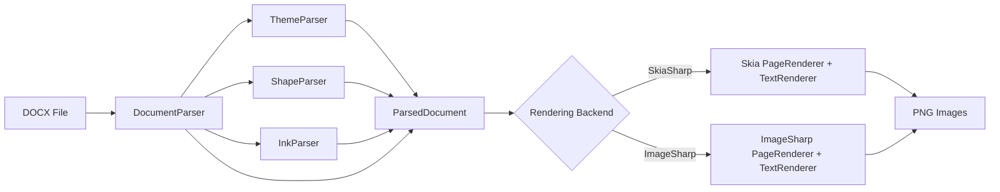
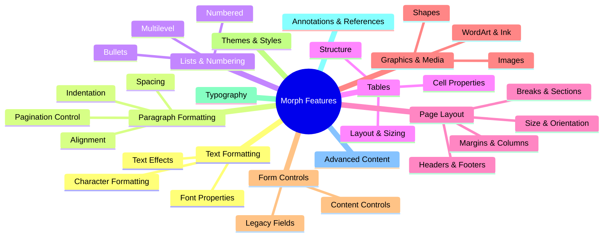
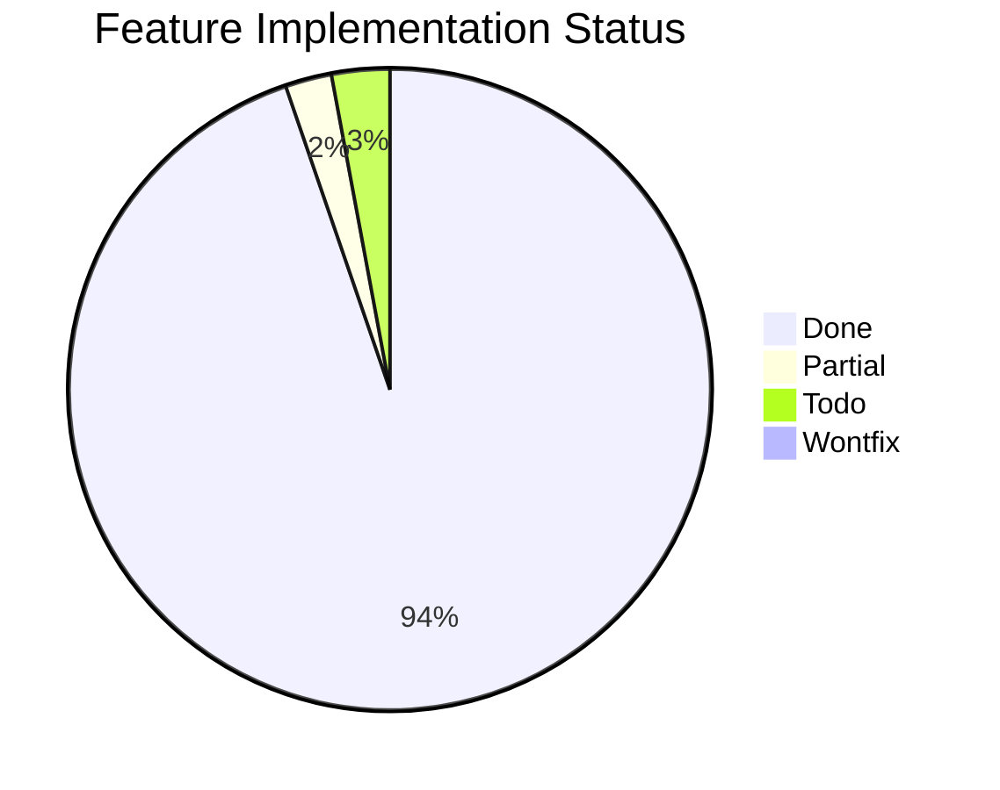

# Morph Feature Matrix

Comprehensive inventory of Microsoft Word DOCX features — what Morph supports today, what is partial, and what remains to be implemented. This document serves as both reference documentation and a living roadmap.

## How to Read This Document

### Status Markers

Each feature is tagged with one of:

| Marker | Meaning |
|--------|---------|
| `DONE` | Fully parsed, modeled, and rendered in both Skia and ImageSharp backends |
| `PARTIAL` | Parsed or modeled but with known limitations (details in notes) |
| `TODO` | Not yet implemented |

### Audience Key

Notes are tagged for three audiences:

- **Contributors** — Where the code lives, edge cases, architectural context
- **Consumers** — What to expect, behavioral limitations, workarounds
- **AI** — Which files to modify, what patterns to follow, relevant OOXML spec sections

### Keeping This File Current

When adding, modifying, or removing a DOCX feature:

1. Update the feature status (`DONE` / `PARTIAL` / `TODO`)
2. Update parse/model/render locations and audience notes
3. Update the summary statistics at the bottom
4. Add new test directory name to the Test row

---

## Rendering Pipeline

Key assemblies:

| Assembly | Role |
|----------|------|
| `Morph` | Core model + both parsers + exporters: `DocumentElements.cs`, `RenderContextBase`, `TableLayout`, `FontHelpers`; DOCX parser `OpenXml/Parsing/DocumentParser.cs` (+ sub-parsers); HTML parser `Html/HtmlParser.cs` (see [html-import.md](html-import.md)) |
| `Morph.Skia` | SkiaSharp rendering (`PageRenderer.cs`, `TextRenderer.cs`, `RenderContext.cs`) + entry points `SkiaDocumentConverter` (DOCX→PNG), `SkiaHtmlConverter` (HTML→PNG) |
| `Morph.ImageSharp` | ImageSharp rendering (`PageRenderer.cs`, `TextRenderer.cs`, `RenderContext.cs`) + entry points `ImageSharpDocumentConverter`, `ImageSharpHtmlConverter` |
| `Morph.Pdf` | PDF rendering + DOCX→PDF / HTML→PDF converters |

---

## Feature Hierarchy

---

## 1. Text Formatting (Run Properties)

OOXML parent element: `w:rPr` (run properties).
Model: `RunProperties` record in `DocumentElements.cs`.
Parse: `DocumentParser.ParseRunProperties()`.
Render: `TextRenderer` in both backends.

### 1.1 Font Properties

#### Font Family `DONE`

The typeface used to render text. Resolved from document, theme fonts, or system fallback.

- **OOXML**: `w:rFonts` — `w:ascii`, `w:hAnsi`, `w:cs`, `w:eastAsia`
- **Spec**: [Run Fonts](http://officeopenxml.com/WPtextFonts.php)
- **Model**: `RunProperties.FontFamily`
- **Render**: Font resolved via `FontHelpers` + `RenderContext.GetTypeface()`
- **Test**: `font_families/`

See [docs/fonts.md](fonts.md) for the full font resolution model, search path, fallback behaviour, and configuration options.

> **AI**: Font resolution lives in `OpenTypeReader.cs`, `FontFileCache.cs`, and `FontHelpers.cs` in `Morph/Rendering/`. Per-backend bindings live in `SkiaRenderContext.cs` / `ImageSharpRenderContext.cs`. When adding a new built-in alias, update `FontHelpers.FontFallbacks`.

#### Font Size `DONE`

Text size in half-points (OOXML) converted to points for rendering.

- **OOXML**: `w:sz` (half-points)
- **Spec**: [Run Font Size](http://officeopenxml.com/WPtextFonts.php)
- **Model**: `RunProperties.FontSizePoints`
- **Test**: `font_sizes/`

> **Consumers**: Word's built-in default for a document with no docDefaults is Calibri 12pt (Word-probed; see `DocumentParser.builtInDefaultFontFamily`); a document that declares docDefaults but omits `w:sz` gets the spec default 10pt. Half-point values from OOXML are automatically converted. Word lays text out on per-glyph pixel advances at the em rounded onto its 120-dpi grid, memoized per half-point size in the `src/Fonts/*.wordadvances.pending` sidecars (`FontMetrics.WordAdvances`) — parked until kerning is modelled, see `src/todo.md` #43.

### 1.2 Character Formatting

#### Bold `DONE`

Bold weight applied to text runs.

- **OOXML**: `w:b`, `w:bCs`
- **Spec**: [Bold](https://learn.microsoft.com/en-us/dotnet/api/documentformat.openxml.wordprocessing.bold)
- **Model**: `RunProperties.Bold`
- **Test**: `bold_text/`, `SyntheticBoldTests`

> **Contributors**: Bold-or-italic flags from the OOXML run combine with any weight word in the font family name (e.g. `Segoe UI Semibold`) to produce a target weight scored against each face's `OS/2` `usWeightClass`. See [fonts.md](fonts.md) for the resolution model.
>
> **Character-style toggle semantics (ECMA-376 §17.7.3, landed 2026-08-20).** `w:b`, `w:i`, `w:strike`, `w:caps` and `w:smallCaps` declared ON in a CHARACTER style FLIP the paragraph-chain state rather than asserting it; an explicit `w:val="0"` is not a toggle and forces the property off. resumes/18 is the evidence: its "NotBold" character style is a bare `<w:b/>` applied to date runs inside bold Heading2 rows, and Word renders those dates regular — bold XOR bold. The XOR only diverges from plain assignment when the paragraph chain already carries the property, so a character style toggling over a plain chain behaves as it always did. One landing cleared the whole family: resumes/18's dates, cover-letters/11's "Astrom", resumes/08's "CONNORS", agendas-minutes/02's Date/Time/Facilitator values and resumes/07's SKILLS values, every one previously rendered bold where Word shows regular (`DocumentParser.ParseRunProperties`, run-style arm).
>
> **Which face to select and whether to draw it bold are separate questions.** `FontHelpers.ResolveTargetWeight` answers the first and lets a weight word in the NAME outrank the bold flag on purpose — a bold run in "Segoe UI Semilight" must still resolve the Semilight face rather than jumping to 700 and landing on a different member of the family. The consequence is that the target weight can equal the resolved face's weight even for a bold run, so the synthetic-embolden check cannot be driven by that gap alone: Skia emboldens whenever a bold run resolved a face lighter than 700. Without it, "Franklin Gothic Book" (a weight word in the name, and no bold face bundled) rendered bold runs at normal weight — `resumes/07`'s "Company, location" and its SKILLS labels, which inherit `Normal`'s `w:b`.
>
> Judged by crops rather than by the metric, per `fidelity-audit.md`: the change moves 18 scenarios, all slightly WORSE numerically (+0.0320 AE total, SSIM −0.0151) because synthetic emboldening keeps the regular face's advances while Word uses a real bold face with wider ones, so correctly-bold glyphs drift a little along the line. Three-up crops on `resumes/07`, `labels/06` and `menus/06` each show text Word renders bold that previously rendered regular and now matches Word's weight — the new-ink offset penalty, at ~0.0018 AE per scenario, inside the band the audit treats as noise.
>
> **Known cost, pre-dating this work: synthetic bold overshoots on script and display faces.** Measured on `labels/15`'s 32pt "Cochocib Script Latin Pro", glyphs alone: Word 509 ink, Skia 660 (**+29.7%**). That comes from the long-standing `target − faceWeight ≥ 200` clause, not from the bold-run clause added here — the family name carries no weight suffix, so the target has always been 700 against a 400 face. Mechanical dilation is not a designed bold: a real bold script is redrawn rather than fattened and sits far closer to its regular weight. The crops used to justify the change were all sans-serif text, where the approximation holds; it does not hold for script faces, and no stroke width fixes that.
>
> **Backend gap:** only Skia synthesises bold. ImageSharp falls back Bold → Regular with no equivalent, so these runs still render at normal weight there. Three stroke-the-fill versions were built and **all reverted 2026-07-22**, differing only in when to fire. Stroke width was calibrated against Skia's ink ratio (bold/regular 1.507 vs 1.465 on 24pt Franklin Gothic Book), so width was never the problem:
>
> | condition | scenarios | net AE | over-applies to |
> |---|---|---|---|
> | `!font.IsBold` | 41 | +0.1127 | already-heavy faces under a Regular style |
> | resolved OS/2 weight < 700 | 38 | +0.1127 | runs drawn with a real bold sibling |
> | both | 33 | +0.0933 | still ~2× Skia |
>
> Skia's own version moves 18 scenarios for +0.0320. Crops showed real over-application rather than the new-ink offset penalty that made Skia's worth keeping — `labels/15`'s script went from too thin to far heavier than Word, `resumes/02`'s display type gained weight Word lacks.
>
> **Weight-aware resolution was not the blocker**, contrary to what this note previously said: ImageSharp already resolves through the *same* `FontResolver` as Skia, and the picked face's OS/2 weight is available on `FontFace.Weight` inside `LoadFace`. Plumbing it through changed the corpus number by nothing. The structural difference is `LoadFace`'s sibling pre-loading — every candidate face joins the shared collection so `PickAvailableStyle` can find the italic variant, so the family often has a real Bold style even when the score-pick was Regular. Skia cannot hit this; an `SKTypeface` is the single picked file. `labels/15`'s delta was +0.0138 under all three conditions, bit-identical. That is not mysterious: the scenario has exactly one qualifying run — 32pt "Cochocib Script Latin Pro", bold, resolved face weight 400, no bold face bundled — and it satisfies all three, so identical output is expected. Skia has emboldened that same run all along (the family name carries no weight suffix, so the target is 700 against a 400 face and the pre-existing "gap ≥ 200" clause fires), which is why landing the Franklin Gothic Book fix changed `labels/15`'s Skia baseline by zero pixels; only `" Book"`-style names were ever missed. **So the ImageSharp over-application there is stroke WEIGHT, not the predicate** — its script rendered thin without synthesis (1836 ink against Word's 2044) and too heavy with it, because the width was calibrated at 24pt while that run is 32pt and Skia's embolden tapers with size (roughly size/24 at 9pt easing to size/32 at 36pt) where the flat divisor does not. A fourth attempt applied Skia's exact taper (1/24 at 9px easing to 1/32 at 36px of the device-space size) and came in at **+0.0952** — marginally worse, because the taper only differs below ~16pt and so only adds weight to small text. Measuring the script glyphs alone (an earlier crop box had spanned the address lines beside them) shows why width was never the lever: Word 509 ink, Skia 660 (+29.7%), ImageSharp unsynthesised 234 (−54.0%), ImageSharp stroked 747 (+46.8%). **Skia is already 30% over Word there.** Detecting "a designed bold exists that we do not bundle" was then investigated and is a dead end from the font file — PANOSE is the obvious signal, but Cochocib Script reports `bFamilyType` 2 (Latin Text), identical to Franklin Gothic Book, with the rest left at generic defaults; nothing in OS/2 says whether a sibling weight exists elsewhere.
>
> **The real finding is that the calibration reference was wrong.** A Word probe of one word in Franklin Gothic Book (no bold face bundled) across sizes, measured against the same document through Skia:
>
> | pt | Word bold adds | Skia synthesis adds |
> |---|---|---|
> | 8 | +48.7% | +54.1% |
> | 12 | +30.7% | +41.2% |
> | 16 | +24.4% | +56.3% |
> | 24 | +19.0% | +46.3% |
> | 32 | +34.5% | +46.3% |
> | 48 | +27.9% | +48.7% |
>
> Word's bold adds **~26%** ink on average; Skia's synthesis adds **~46%** — roughly 1.8× heavy from 16pt up, agreeing only at 8–12pt. Every ImageSharp attempt was calibrated against *Skia's* ratio, so all of them inherited that error. That multi-font calibration was then done — 10 bold-less families spanning text sans, text serif, geometric, display, script and handwriting, at six sizes, ink measured as threshold-free coverage. The overshoot is **size-independent** (Skia/Word ratio 1.58–2.05 with no trend, mean ~1.9), so no taper is warranted and the earlier non-monotonic per-size numbers were noise. The variation is **per-typeface**: Tw Cen MT 1.00, Playfair 1.26, Bahnschrift 1.30, Impact 1.37, Kristen 1.50, Franklin Gothic Book 1.62, Trade Gothic 1.83, Baskerville Old 1.89, Vladimir Script 2.25, Cochocib Script 2.53.
>
> A fifth attempt used the resulting flat `size/59` stroke (Skia is effectively `size/32`) and measured **+0.0698** over 33 scenarios — the best of the five, and per-scenario (+0.0021) essentially Skia's accepted +0.0018. Ink matched Word well: `labels/15`'s script went from −22.5% to **+5.3%**, `resumes/07`'s text from −33.6% to −17.0%. **It was still reverted**, because at that width `resumes/07`'s "Company, location" *does not read as bold* — Word's is unmistakable, the stroked version only marginally heavier than regular. **Matching Word's ink is not the same as matching Word's bold:** a designed bold redraws the letterforms with wider stems and altered proportions, so at ink parity the text still looks unbolded. The trade has no winning side — `size/32` makes text look bold but overshoots scripts, `size/59` matches script ink but fails the case the feature exists for. That ends outline dilation as an approach; anything further needs real weight (bundle the missing bold faces, or instance a variable font's `wght` axis).

#### Italic `DONE`

Italic style applied to text runs.

- **OOXML**: `w:i`, `w:iCs`
- **Spec**: [Italic](https://learn.microsoft.com/en-us/dotnet/api/documentformat.openxml.wordprocessing.italic)
- **Model**: `RunProperties.Italic`
- **Test**: `italic_text/`

> **Synthetic oblique**: an italic run whose family has no italic face (bundled Century Gothic,
> Tenorite, Baskerville Old Face) is sheared right about the baseline instead of rendering
> upright, in every backend. The shear is Word-measured, not conventional: `_probe_synitalic`
> (96pt and 48pt Century Gothic italic, stem edges regressed on both sides, upright control at
> exactly 0.0000) put Word's synthesized slant at **0.1355–0.1371** — size-independent — where
> Skia's stock fake italic is 0.25 and PdfSharp's `mustSimulateItalic` is sin 20° (0.342,
> PDFium-measured), which is why the PDF backend shears its own text matrix
> (`PdfPainter.DrawTracked`) rather than using PdfSharp's simulation. The constant lives in
> `FontHelpers.SyntheticItalicSkew`. A real italic face is never sheared — Word's own Calibri
> italic measures 0.2001 and Morph reproduces it exactly through the face itself.

#### Underline `DONE`

Underline decoration on text. Rendered 2px below the text baseline. `w:u/@w:color` paints the
rule in its own colour (absent or `auto` means the run's text colour), and `w:val="double"`
draws a second rule one gap below the first — every backend, plus
`text-decoration-color` / `text-decoration-style: double` in the HTML export.

- **OOXML**: `w:u` with `w:val` (single, double, dotted, dash, etc.) and `w:color`
- **Spec**: [Underline](https://learn.microsoft.com/en-us/dotnet/api/documentformat.openxml.wordprocessing.underline)
- **Model**: `RunProperties.Underline`, `RunProperties.UnderlineColorHex`, `RunProperties.DoubleUnderline`
- **Test**: `underline_text/`, `wordart/` (page 9: red single + blue double)

> **Consumers**: Underline types beyond single/double (dotted, dash, wave, etc.) are detected but render as a single solid underline.

#### Strikethrough `DONE`

Line through the middle of text. Rendered at 30% above the text baseline.

- **OOXML**: `w:strike`, `w:dstrike` (double strikethrough)
- **Spec**: [Strikethrough](https://learn.microsoft.com/en-us/dotnet/api/documentformat.openxml.wordprocessing.strikethrough)
- **Model**: `RunProperties.Strikethrough`
- **Test**: `strikethrough_text/`

> **Consumers**: Both single and double strikethrough are parsed; both render as single strikethrough.

#### All Caps `DONE`

Displays text in uppercase regardless of source case.

- **OOXML**: `w:caps`
- **Spec**: [Caps](https://learn.microsoft.com/en-us/dotnet/api/documentformat.openxml.wordprocessing.caps)
- **Model**: `RunProperties.AllCaps`
- **Test**: `all_caps/`

> **Contributors**: Applied during text rendering via `ToUpperInvariant()` transform.

#### Small Caps `DONE`

Displays lowercase letters as smaller uppercase letters while keeping original uppercase letters at full size.

- **OOXML**: `w:smallCaps`
- **Spec**: [SmallCaps](https://learn.microsoft.com/en-us/dotnet/api/documentformat.openxml.wordprocessing.smallcaps)
- **Model**: `RunProperties.SmallCaps`
- **Parse**: `w:smallCaps` parsed alongside `w:caps` in both style and inline run-property paths
- **Render**: `SmallCapsExpander` (`Morph/Rendering/SmallCapsExpander.cs`) splits SmallCaps runs at lowercase/non-lowercase boundaries; lowercase segments are uppercased and rendered at 80% of the run's font size, everything else passes through unchanged. The `Morph.Skia` / `Morph.ImageSharp` `TextRenderer.LayoutParagraph[WithWidth]` and `Morph.Pdf/PdfTextEngine.Layout` apply the expansion before measurement and layout so widths and line breaks reflect the rendered glyphs. (In the PDF the drawn glyphs are the uppercased letters, so a small-caps run's text layer copy-pastes as all-caps — inherent to rendering small caps without an OpenType `smcp` feature.)
- **Test**: `SmallCapsExpanderTests` covers the case-boundary splitting; covered by run-properties parsing tests for the model.

> **AI**: Word's actual scale factor varies (~75–80% depending on font); 80% picked as the visually closest pass-through for the existing test suite. Tab and inline-image runs are intentionally untouched even when SmallCaps is set.

#### Text Color `DONE`

Foreground color of text, either direct RGB or resolved from theme color with transforms.

- **OOXML**: `w:color` with `w:val` (hex RGB) or `w:themeColor` + transforms
- **Spec**: [Color](http://officeopenxml.com/WPtextFormatting.php)
- **Model**: `RunProperties.ColorHex`
- **Test**: `colored_text/`

> **Contributors**: Theme colors resolved in `DocumentParser.ResolveRunColor`, which reads the `w:themeShade` / `w:themeTint` bytes alongside the `w:themeColor` name and hands both to `ThemeColors.ResolveColor`. The transform model itself lives in `ColorTransforms.ApplyTo` — see §8.1.
>
> **The colour cascade** (base → top): docDefaults `w:rPrDefault/w:color` (including a white default — dark-board templates like `menus/07` set `FFFFFF background1` and Word paints fall-through runs white) → style chain (`basedOn` inheritance) → direct `w:rPr`. `w:color w:val="auto"` at any level RESETS the cascade to the automatic colour rather than inheriting (card templates pair a white docDefaults with an auto `Normal`, keeping body text black); inside the style chain that reset travels as `DocumentParser.automaticColorSentinel`, converted at run resolution so it never escapes into the model. The automatic colour is contrast-aware: `ComputeAutomaticRunColor` yields white when the page `w:background` is dark (BT.601 brightness < 128, `brochures/03`'s navy), otherwise null (renderers default to black).

#### Text Background / Highlight `DONE`

Background shading behind text runs.

- **OOXML**: `w:highlight`, `w:shd`
- **Spec**: [Highlight](https://learn.microsoft.com/en-us/dotnet/api/documentformat.openxml.wordprocessing.highlight)
- **Model**: `RunProperties.BackgroundColorHex`

> **Contributors**: Rendered as a filled rectangle spanning ascent + descent height behind the text fragment, in all three backends — `TextRenderer` draws it per fragment in Skia and ImageSharp, `PdfTextEngine.DrawItem` per line item in PDF. The PDF backend drew only the PARAGRAPH-level band for a long time and dropped every run highlight; the run-level fill is a separate call and has to sit before the glyphs. Word's box is a little tighter than the full ascent-to-descent span (~10% less ink on `wordart` p10), so the colours match exactly while the bars run slightly tall.

#### Character Spacing `DONE`

Additional spacing between characters (positive or negative), measured in points.

- **OOXML**: `w:spacing` within `w:rPr` (in twentieths of a point)
- **Spec**: [Spacing](https://learn.microsoft.com/en-us/dotnet/api/documentformat.openxml.wordprocessing.spacingmark)
- **Model**: `RunProperties.CharacterSpacingPoints`
- **Test**: Spec test: `CharacterSpacingTests`

> **Contributors**: Applied per-character in both measurement AND drawing: fragments are allocated natural + spacing×length, and tracked fragments draw per-glyph (`TextRenderer.DrawFragmentText` in Skia/ImageSharp, `PdfTextEngine.DrawTrackedString`) so each character advances by its own width plus the tracking — drawn extent equals allocated width. Drawing tracked text untracked is how spacing surplus used to pile into word gaps (doubled gaps) and negative tracking swallowed spaces entirely ("Sheetal Parmar" → "SheetalParmar"). The untracked path is a single DrawText/DrawString call, byte-identical to before. Spaces are tracked too — Word widens/narrows every character's advance, spaces included (the PDF layout adds spacing to its pending-space accumulator for that reason).

#### Superscript `DONE`

Raises text above the baseline, typically at a smaller font size.

- **OOXML**: `w:vertAlign` with `w:val="superscript"`
- **Spec**: [VerticalTextAlignment](https://learn.microsoft.com/en-us/dotnet/api/documentformat.openxml.wordprocessing.verticaltextalignment)
- **Model**: `RunProperties.VerticalAlignment = VerticalAlignment.Superscript`
- **Test**: `subscript_superscript/`

> **Contributors**: Raised 35% of font size above baseline in `TextRenderer`.

#### Subscript `DONE`

Lowers text below the baseline, typically at a smaller font size.

- **OOXML**: `w:vertAlign` with `w:val="subscript"`
- **Spec**: [VerticalTextAlignment](https://learn.microsoft.com/en-us/dotnet/api/documentformat.openxml.wordprocessing.verticaltextalignment)
- **Model**: `RunProperties.VerticalAlignment = VerticalAlignment.Subscript`
- **Test**: `subscript_superscript/`

> **Contributors**: Lowered 15% of font size below baseline in `TextRenderer`.

#### Kerning `DONE`

Adjusts spacing between specific character pairs for visual balance. Applied at LAYOUT
(2026-08-19): the engine measures kerned advances, so wrap points, segment positions and
pagination match Word's kerned text.

- **OOXML**: `w:kern` (minimum font size threshold for kerning, in half-points)
- **Model**: `RunProperties.KerningMinFontSizePoints`; pair values from GPOS via `FontMetrics.KernPairs` (`GposKernTable` — `kern` feature, PairPos formats 1/2 + extension lookups, first glyph's xAdvance)
- **Parse**: inline `w:kern` per run; an absent inline kern inherits the document default (`DocumentParser.ResolveDocDefaultKerningMinPoints`) — Word-probed with the `_probe_kern_*` fixtures: a document with NO docDefaults kerns by default (built-in Normal), docDefaults WITHOUT `w:kern` disable it, a docDefaults `w:kern` sets the threshold. Per-STYLE `w:kern` (e.g. a heading style enabling kerning) is not yet cascaded.
- **Render**: `CanonicalTextMeasurer` applies Word's measured pair quantization — the kern value snaps to 1/16 px on the 120-dpi grid and the pair's first-glyph advance then rounds to a whole pixel (`KernPairDelta`; measured across six Calibri pairs at three sizes, e.g. 24pt `Ta` draws T at 17.000px from an unkerned 20.042). Painter ink is NOT yet kerned — backends draw runs with their own advances — so kerning moves wrap points and segment origins, not glyph spacing inside a drawn run; that gap closes when painters consume per-glyph positions (`PlacedGlyphRun`, deferred).

> **AI**: The kern lookup is glyph-pair based and deliberately shaping-free — no GSUB, no contextual lookups. `KerningEnabled` in `CanonicalParagraphMeasurer` is the per-run gate.

#### Ligatures `DONE`

Combines specific character sequences (fi, fl, ff, etc.) into single glyphs.

- **OOXML**: `w14:ligatures` (Word 2010+ extension)
- **Model**: `LigatureMode` flags (`Standard`, `Contextual`, `Historical`, `Discretional`); `RunProperties.Ligatures` (default `Standard`)
- **Parse**: `DocumentParser.ParseLigatureMode` reads `w14:ligatures` and maps the OOXML enumerated values to the flag combination
- **Render**: when `LigatureMode == None`, ImageSharp's `KerningMode` is forced to `None` (which also disables ligature substitution under SixLabors.Fonts). Skia's `canvas.DrawText` doesn't substitute ligatures by default, so the absence of `Standard` ligatures is the natural state there.

> **AI**: Discretionary/historical ligatures (`Discretional`, `Historical`) and contextual alternates beyond Standard remain unmodelled — the existing FontFeature API on SixLabors doesn't cleanly map to OOXML's flag combinations.

#### Hidden Text `DONE`

Runs marked as hidden, structural-hidden (TOC markers), or web-only-hidden. Hidden runs are dropped at parse time so they don't enter measurement or rendering — `w:webHidden` is intentionally ignored because Morph renders for print/image where the runs should remain visible.

- **OOXML**: `w:vanish`, `w:specVanish`, `w:webHidden`
- **Spec**: [Vanish](https://learn.microsoft.com/en-us/dotnet/api/documentformat.openxml.wordprocessing.vanish)
- **Model**: `RunProperties.Hidden`
- **Parse**: `DocumentParser.ParseRunProperties` reads `w:vanish` (with `val` toggle) and `w:specVanish` (presence-only); `ParseRun` short-circuits and emits no `Run` records when `Hidden` is true. `w:webHidden` is parsed-and-discarded.
- **Test**: `RunEffectsTests.Vanish_DropsRun_FromParsedParagraph`, `SpecVanish_DropsRun_LikeVanish`

#### Emboss `DONE`

3D emboss text effect (raised appearance). Approximated by painting a light-grey companion glyph one device pixel down-and-right of the main glyph, so the text reads as raised on a white background.

- **OOXML**: `w:emboss`
- **Spec**: [Emboss](https://learn.microsoft.com/en-us/dotnet/api/documentformat.openxml.wordprocessing.emboss)
- **Model**: `RunProperties.Emboss`
- **Render**: companion glyph painted before the main fill in both `Morph.Skia/Rendering/TextRenderer.cs` and `Morph.ImageSharp/Rendering/TextRenderer.cs`

#### Imprint (Engrave) `DONE`

Engraved text effect (inverse of emboss — recessed appearance). Approximated by painting a medium-grey companion glyph one pixel up-and-left of the main glyph.

- **OOXML**: `w:imprint`
- **Spec**: [Imprint](https://learn.microsoft.com/en-us/dotnet/api/documentformat.openxml.wordprocessing.imprint)
- **Model**: `RunProperties.Imprint`

#### Outline Text `DONE`

Stroke-only text (hollow glyphs, no fill). Distinct from `w14:textOutline`, which adds a stroke *around* filled text — `w:outline` replaces the fill with a stroke.

- **OOXML**: `w:outline`
- **Spec**: [Outline](https://learn.microsoft.com/en-us/dotnet/api/documentformat.openxml.wordprocessing.outline)
- **Model**: `RunProperties.OutlineOnly`
- **Render**: when set, the main glyph paint is swapped to `Stroke` style (Skia) / `SolidPen` (ImageSharp); the regular fill is skipped entirely

#### Animated Text Effect `DONE`

Word's animated run effects (`blinkBackground`, `sparkle`, `lights`, `marchingAnts`, etc.). Animation has no static-image equivalent, so the run renders as plain text.

- **OOXML**: `w:effect` with `w:val`
- **Spec**: [TextEffect](https://learn.microsoft.com/en-us/dotnet/api/documentformat.openxml.wordprocessing.texteffect)
- **Render**: parsed-and-discarded — text underneath renders normally

#### Run Border `DONE`

Border drawn around an individual run (per-run rectangle, not paragraph-level). Doesn't reserve space, so adjacent runs may sit close to the rectangle's edge — matches Word's inline-border behaviour.

- **OOXML**: `w:bdr` within `w:rPr`
- **Spec**: [Border](https://learn.microsoft.com/en-us/dotnet/api/documentformat.openxml.wordprocessing.border)
- **Model**: `RunProperties.Border` (a `BorderEdge`)
- **Render**: each painter's `PaintLine` strokes the run's line box (the same rectangle the highlight fills) through `CellBorders.Uniform` and the shared `BorderStroke` recipe, so a run border gets the same styles and dashes as any other edge without per-backend stroke code
- **Test**: `RunEffectsTests.RunBorder_ParsesColorAndWidth`, `border_style_variants/`

> **History**: `RunProperties.Border` was parsed with no reader anywhere between the layout-engine migration and 2026-08-13 — the rectangle the deleted production renderers drew was lost in the move, the same way `IsAnchorOnlyMark` was (`src/todo.md` #26). `border_style_variants` section 3 caught it: Word boxes each of its 27 runs, every backend drew plain text.

#### East Asian Emphasis Mark `TODO`

Dot or circle mark drawn above or below each glyph for emphasis (Chinese/Japanese typography).

- **OOXML**: `w:em`
- **Spec**: [Emphasis Mark](https://learn.microsoft.com/en-us/dotnet/api/documentformat.openxml.wordprocessing.emphasis)
- **Source**: identified via scan in `src/missingTags.md`

#### Baseline Shift (Position) `DONE`

Raises or lowers a run relative to the baseline without resizing. Distinct from superscript/subscript, which also resizes the glyph. Stacks additively with `w:vertAlign` for combined shifts.

- **OOXML**: `w:position` (half-points; positive = up, negative = down)
- **Spec**: [Position](https://learn.microsoft.com/en-us/dotnet/api/documentformat.openxml.wordprocessing.position)
- **Model**: `RunProperties.BaselineShiftPoints` (in points — half-points are converted at parse time)
- **Render**: subtracted from `pixelY` after `vertAlign` adjustments in both backend `RenderFragment` paths
- **Test**: `RunEffectsTests.Position_ParsesHalfPoints_AsPoints`, `Position_NegativeValue_LowersBaseline`

### 1.3 Text Effects

#### Text Shadow `DONE`

Shadow effect behind text (not to be confused with WordArt shadow).

- **OOXML**: `w14:shadow` with color, blur radius, distance, angle
- **Model**: `RunProperties.Shadow` (`TextShadow` record with colour, blur, distance, direction, alpha). The legacy `Effects` flag is now derived from this field.
- **Parse**: `DocumentParser.ParseTextShadow` extracts `w14:blurRad` / `w14:dist` / `w14:dir` (EMU/60000ths-degree) and the child `srgbClr` + `alpha`. Once the element declares anything at all, the omitted parts default to 4pt distance, 4pt blur, 45°, 50% black.
- **Render**: Skia draws the glyph at the offset position with `SKImageFilter.CreateBlur` before the main fill. ImageSharp draws an offset duplicate without blur (no per-draw blur in its drawing pipeline).

> **Contributors — a BARE w14 effect is inert.** `<w14:shadow/>`, `<w14:textOutline/>`, `<w14:glow/>` and `<w14:reflection/>` declared with no attributes and no children carry no effect, and Word renders the run plain — `feature_capture/01` declares all four that way and Word's reference draws "All features" as unadorned small caps. Treating presence alone as "on" made each parser invent Word's UI defaults, which drew an offset shadow copy of the heading in ImageSharp and a glow in Skia. `DocumentParser.IsInertEffect` gates all four, and the defaults above apply only past that gate. The boundary is pinned from both sides: `RunPropertyCaptureTests.DocumentParser_BareW14TextEffects_AreInert` and `RunEffectsTests.W14Shadow_WithAnyProperty_KeepsDefaultsForTheRest`.

> **AI**: `sx`/`sy` scale and `kx`/`ky` skew transforms from the OOXML are intentionally not modelled — minor visual contribution and complicates the render path.

#### Text Outline `DONE`

Outline/stroke around text characters.

- **OOXML**: `w14:textOutline` with color, width, line style
- **Model**: `RunProperties.Outline` (`TextOutline` record with colour and width).
- **Parse**: `DocumentParser.ParseTextOutline` reads `w14:w` (EMU → points) and walks for the descendant `srgbClr`. Falls back to the run's fill colour and a 0.75pt default width when attributes are absent.
- **Render**: after the fill draw, both backends re-draw the glyph with a stroke paint/pen using the outline colour and width.

> **AI**: `cap`/`cmpd`/`algn`/`prstDash` line-style attributes are deliberately not modelled — Word almost always uses the round-cap solid-stroke default.

#### Text Glow `DONE`

Soft glow effect around text.

- **OOXML**: `w14:glow` with color, radius
- **Model**: `RunProperties.Glow` (`TextGlow` record with colour, radius, alpha).
- **Parse**: `DocumentParser.ParseTextGlow` reads `w14:rad` and the child `srgbClr` + `alpha`. Bare element defaults to 4pt yellow at 60% alpha.
- **Render**: Skia draws the glyph twice with `SKImageFilter.CreateBlur` before the main fill (two passes deepen the halo). ImageSharp approximates by stroking the glyph at increasing radii with low alpha — softer but visually similar.

> **AI**: Scheme-colour resolution (`schemeClr` with `lumMod`/`lumOff` transforms) isn't wired through; only direct `srgbClr` values are honoured.

#### Text Reflection `DONE`

Mirrored reflection below text.

- **OOXML**: `w14:reflection` with transparency, size, blur, distance
- **Model**: `RunProperties.HasReflection` (presence-only — full reflection parameter set is not modelled).
- **Render**: Skia draws a vertically-mirrored copy below the baseline and applies a top→bottom alpha gradient via `SKBlendMode.SrcIn`. ImageSharp draws a faded duplicate below the original (no flip) — its drawing pipeline doesn't expose per-draw transforms cleanly.

> **AI**: Presence-aware rendering with sensible defaults matching Word's "Tight Reflection, touching" preset. The OOXML reflection parameters (`stA`, `stPos`, `endA`, `endPos`, `dist`, `dir`, `fadeDir`, `sx`, `sy`, `blurRad`) are not parsed; documents using a custom reflection preset will diverge from Word.

#### Gradient / Pattern Text Fill `TODO`

Gradient or pattern fill applied to glyphs (rather than a solid colour).

- **OOXML**: `w14:textFill` containing `w14:solidFill`, `w14:gradFill`, `w14:noFill`
- **Source**: identified via scan in `src/missingTags.md`

> **AI**: Skia uses `SKShader.CreateLinearGradient`; ImageSharp uses `LinearGradientBrush` masked to glyph paths.

#### OpenType Numeric / Stylistic Variants `TODO`

OpenType feature toggles for numeral form, numeral spacing, stylistic sets, and contextual alternates.

- **OOXML**: `w14:numForm` (`default`/`lining`/`oldStyle`), `w14:numSpacing` (`default`/`proportional`/`tabular`), `w14:stylisticSets`, `w14:cntxtAlts`
- **Source**: identified via scan in `src/missingTags.md`

> **AI**: SixLabors.Fonts exposes per-feature flags via `FontFeature`; map these properties through the same shaping pipeline as ligatures.

---

## 2. Paragraph Formatting

OOXML parent element: `w:pPr` (paragraph properties).
Model: `ParagraphProperties` record in `DocumentElements.cs`.
Parse: `DocumentParser.ParseParagraphProperties()`.
Render: `TextRenderer.MeasureAndRenderParagraph()` in both backends.

### 2.1 Alignment

#### Left Alignment `DONE`

Default text alignment — flush left, ragged right.

- **OOXML**: `w:jc` with `w:val="left"` (or absent)
- **Spec**: [Justification](http://officeopenxml.com/WPalignment.php)
- **Model**: `ParagraphProperties.Alignment = TextAlignment.Left`
- **Test**: `align_left/`

#### Center Alignment `DONE`

Text centered within the available width.

- **OOXML**: `w:jc` with `w:val="center"`
- **Model**: `ParagraphProperties.Alignment = TextAlignment.Center`
- **Test**: `align_center/`

#### Right Alignment `DONE`

Text flush right, ragged left.

- **OOXML**: `w:jc` with `w:val="right"`
- **Model**: `ParagraphProperties.Alignment = TextAlignment.Right`
- **Test**: `align_right/`

#### Justified Alignment `DONE`

Text spread to fill the full width, with extra space distributed between words.

- **OOXML**: `w:jc` with `w:val="both"`
- **Model**: `ParagraphProperties.Alignment = TextAlignment.Justify`
- **Test**: `align_justified/`

> **Contributors**: Last line of a justified paragraph is left-aligned (not stretched). Extra space is distributed between word gaps only.

### 2.2 Spacing

#### Spacing Before / After `DONE`

Vertical space above and below a paragraph, in points.

- **OOXML**: `w:spacing` — `w:before`, `w:after` (in twentieths of a point)
- **Spec**: [Paragraph Spacing](http://officeopenxml.com/WPspacing.php)
- **Model**: `ParagraphProperties.SpacingBeforePoints`, `SpacingAfterPoints`
- **Test**: `paragraph_spacing/`

> **Contributors**: Adjacent paragraph spacing uses margin collapsing: `max(after, before)`, not sum. A body paragraph at the top of an automatically broken page gets no spacing-before (compatibilityMode 15 also after explicit page breaks; section breaks and the first page keep it) — one-shot `SuppressPageTopSpacingBefore` computed by the page renderers, consumed in `TextRenderer` / `PdfTextEngine`. The document default after-spacing (`DocumentParser.ExtractDefaultParagraphProperties`) is Word's 8pt built-in (with the 278/240 line multiplier) when nothing in the package has replaced the built-in Normal: no `styles.xml`, no `docDefaults`, or — refined 2026-08-19 — `docDefaults` present but with NO `w:pPrDefault` element at all and no default paragraph style defined (`even_odd_headers/02`'s footer line and `decimal_tabs/01`'s rows each sit exactly the built-in spacing below a zero-spacing render; the row pitch is 46.5px against the 25.5px bare line at 150 DPI). An EMPTY `<w:pPrDefault/>` is an explicit "no paragraph defaults" and reads as zero — `wordart` declares one and Word's reference is tight — as does a package that defines a default paragraph style (`resumes/13`, `cover-letters/03`, `letters/09`, `wedding/05`). The same extraction reads `pPrDefault/w:jc` into the base of the alignment cascade (card/label/menu templates centre every paragraph there; a style or paragraph `w:jc` — including an explicit "left" — still overrides).

> **Contributors**: A paragraph whose only content is anchored drawing (the "background placeholder" pattern) still has a paragraph mark, and Word allocates a line for it. `ParseParagraph` therefore treats anchored art as producing no flow content and emits the empty paragraph anyway — testing `result.Count == 0` alone made that line appear or vanish depending on whether the shape parser happened to understand the drawing. The one exception is a placeholder carrying explicit spacing-after, where Word emits the trailing spacing but no line: that becomes an `IsAnchorOnlyMark` paragraph (see `agendas-minutes/11`) — inert in the engine today (todo #26), so it lays out as an ordinary empty paragraph.
>
> The predicate is `onlyFloatingArt`, and it must name **both** float types. It read `_ is FloatingShapeElement` alone until 2026-08-12, so a paragraph that lifted out a floating PICTURE matched no branch at all and lost its mark outright — `business-plans/13`'s cover anchors one image and one shape from a single paragraph, and losing that line carried its title and subtitle ~24pt up the page (restoring it puts the subtitle within 1px of Word: ink at 1407–1434 against Word's 1408–1434, where it had been 51px high). Widening it moved **35 scenarios by −0.559 / −0.467 / −0.556 on Skia / ImageSharp / PDF, 30 better and 4 worse, no page-count change**. The four are all templates whose anchor paragraph carries a tiny-font style (`GraphicAnchor`/`Graphicsanchor`/`ObjectAnchor` at `w:sz` 4–10 half-points), and on the two largest the render is measurably CLOSER to Word than the metric suggests — `agendas-minutes/02`'s title ink goes from 11px above Word's to 4px below, `brochures/07`'s from 9px above to 4px below — so they read as the new-ink offset penalty over a residual, not a lost rule.

> **Exporters**: The raster/PDF backends allocate a line for every empty paragraph (above), so blank-line block spacing renders for free. Word's letter/résumé templates lean on this heavily — they separate date/address/greeting/body/closing with EMPTY paragraphs rather than paragraph after-spacing — so the HTML export must reproduce it explicitly: `HtmlExporter.WriteParagraph` emits an empty body paragraph as a one-line `
&nbsp;
` spacer (carrying its own before/after margins), and `AppendCellContent` emits a ` ` for an empty cell paragraph, so `text / <empty> / text` keeps its gap. Dropping them — the naive "skip empty blocks" — ran the letters together (a dozen cover-letters / letters findings). A NON-blank cell paragraph that declares before/after `w:spacing` leaves the inline join and renders as a real `
` with explicit margins (2026-08-19), so a letter template separating its cell-held body with paragraph spacing keeps the gaps; zero-spacing cell paragraphs stay on the compact ` ` model. Body-level paragraphs keep their spacing on the `
` margin as normal.

#### Line Spacing `DONE`

Vertical distance between lines within a paragraph. Three modes: Auto (multiplier), Exactly (fixed), AtLeast (minimum).

- **OOXML**: `w:spacing` — `w:line`, `w:lineRule` (auto/exact/atLeast)
- **Spec**: [Line Spacing](http://officeopenxml.com/WPspacing.php)
- **Model**: `ParagraphProperties.LineSpacingMultiplier`, `LineSpacingPoints`, `LineSpacingRule`
- **Test**: `line_spacing/`, `line_spacing_at_least/`, `line_spacing_exactly/`

> **Contributors**: Auto mode multiplies the font's full hhea line box (ascent + descent + line gap) with no extra floor or leading correction, verified against Word XPS baselines. Document grid line pitch enforced when >= 20 page break markers detected. An empty paragraph's line takes the paragraph mark's style-resolved formatting (`ParagraphProperties.ParagraphMarkRunProperties`, from `w:pPr/w:rPr`), matching Word. See `TextRenderer` line spacing logic.
>
> **An auto multiple divides its box asymmetrically, and only in one direction** (`CanonicalTextMeasurer.LineAscentPoints`, pinned by `CanonicalMetricsTests.Line_ascent_scales_only_when_the_multiple_compresses`). Word-probed with `_probe_linemultiple` — 48pt Aptos paragraphs at multiples 0.6/0.7/0.8/0.9/1.0/1.158/1.25/1.5, bracketed by reference lines with every spacing zeroed so the boxes stack exactly, and baselines read from the XPS `Glyphs` origins rather than from ink:
>
> | multiple | 0.6 | 0.7 | 0.8 | 0.9 | 1.0 | 1.158 | 1.25 | 1.5 |
> | --- | --- | --- | --- | --- | --- | --- | --- | --- |
> | height | 34.87 | 40.23 | 46.86 | 52.26 | 58.29 | 67.86 | 72.68 | 87.69 |
> | ascent | 26.51 | 30.70 | 36.13 | 40.33 | 44.53 | 45.10 | 44.50 | 45.10 |
> | descent | 8.36 | 9.53 | 10.73 | 11.93 | 13.76 | 22.76 | 28.18 | 42.59 |
>
> The height is the natural pitch times the multiple throughout (h/natural 0.598 … 1.504). The ascent is NOT: **expanding leaves it at the natural value and puts every extra point below the baseline**, while **compressing scales it with the box** (a/natural 0.595 / 0.689 / 0.811 / 0.906 against the multiple). Keeping the natural ascent in both directions — which is what this did until 2026-08-12 — leaves compressed text `ascent × (1 − multiple)` too low inside its own box: 9.2pt on `business-plans/13`'s 0.8× cover title, whose ink measured exactly 19px low before and lands within 1px of Word after (Skia 1251–1328 and PDF 1252–1328 against Word's 1252–1329). Worth **Skia −0.195 / PDF −0.192 over 38 scenarios**, no page-count change; ImageSharp is +0.023 for a painter reason, not a layout one — see the anchoring note below.
>
> Two residues the same probe measured but did not fix, each needing its own fixture. **Morph's natural ascent runs ~0.08 em large** — 48.47 against Word's 44.53 at 48pt, and 11.11 against 10.28 on the reference lines — so the ascent column above is reproduced in shape but offset by a constant ~3.4–3.9pt; the box heights match within 0.8pt throughout, so this is purely where the baseline sits inside the box. And **Word's first line on a page is 0.6pt shorter than the rest**, which the probe sees as a one-off at the top of the page.
>
> **The mark's SIZE and FACE both inherit even when its `w:rPr` is partial.** A mark that names a font but no `w:sz` still takes its size from the paragraph style chain, exactly as a run would; only when the chain is silent too does the document default apply. Inside a table cell this is the entire line height, because the cell path omits `ParagraphMarkRunProperties` (see "Hide Cell Mark") and an empty cell has no leading run for `MarkProperties` to fall back on — so the mark size is all `CanonicalParagraphMeasurer` has left. Reading only the direct `w:sz` child left those marks at the `RunProperties` record's 11pt default: `business-plans/15`'s cost table has value cells carrying `<w:rPr><w:rFonts w:ascii="Univers"/></w:rPr>` and no size, so every row was sized off an 11pt mark rather than the 9pt `Normal` resolves, making single-line rows 5px too tall at 150dpi and accumulating ~46pt across 21 rows — enough to tip content onto the next page.
>
> Word-probed by bisection over the real table (each variant the same package with one thing changed): removing `w:cnfStyle`, switching `w:tblLayout` to autofit, and neutralising the inherited `w:line`/`w:spacing` all left the gap intact, and sweeping `w:after` over 0/60/120 twips moved Word and Morph on the same slope — so neither conditional formatting, nor the layout mode, nor the spacing was responsible. Localising the surplus put it entirely BELOW the text (Word 6–11px, Morph 12–16px) with the space above and the ink itself matching, and extrapolating the sweep to zero spacing left a 7px line-box difference — 28px against 21px, i.e. 11pt where 9pt was due. Adding an explicit `w:sz` to those marks made Morph's rows match Word's exactly (35px against 35px), which pinned it. Fixing it moved the corpus AE sum by **−1.19**, `business-plans/15` alone by −1.07.
>
> The FACE resolves the same way and for the same reason: an auto line box comes straight from the font's metrics, so a chain-SIZED mark measured against the record's default face still gets the pitch wrong. `ParagraphMarkFontFamily` takes an explicit `w:rFonts/@w:ascii` (theme references resolved through `ResolveRunFontFamily`) and otherwise the chain's face. The common shape needing it is an `rFonts` that names only `w:eastAsiaTheme`/`w:cstheme` — `business-plans/13` has 189 of those and 316 more marks declaring `w:sz` with no `rFonts` at all, so in both groups the ascii face has to come from the chain. Worth **−0.24** across 37 scenarios, `newsletters/06` alone −0.12; the largest counter-move is `newsletters/05` at +0.0085 spread over 12 page-metrics, which crops show as sub-pixel.
>
> Note this did NOT resolve `business-plans/13`'s own +0.069 from the size fix, which was the reason to look at the face — that scenario's metrics are untouched by it, so its residual has some other cause and is still open. The PDF backend applies the same three rules in `PdfTextEngine` (per finished line, on blank explicit-break lines, and on empty-paragraph mark lines), mirroring the raster `CalculateLineHeight`.
>
> **Inline images are not scaled by the Auto multiplier.** The multiplier applies to the text line box only; an inline image contributes its height unscaled and the line takes `max(imageHeight, textHeight × multiplier)` — see `AutoLineHeight` in each raster `TextRenderer`. Verified against Word by sweeping `brochures/06`'s docDefault `w:line` from 1.15 to 1.50: its two image-bearing table rows grew 1.3% and 3.4%, where scaling the image would predict 30%; fitting the sweep gives `row = 211.6px image + 22.6px text line × multiplier` with residuals under 1px. `PdfTextEngine` has always modelled this (an image item keeps its raw height while text runs get `rawHeight × multiplier`). Note the rule has to hold in BOTH the render path (`CalculateLineHeight`) and the table-cell measurement path (`LayoutParagraphForMeasurement` → `TableLayout.CalculateCompactLineHeight`); the latter takes the caller's already-computed Auto height precisely so the two cannot drift apart again.
> **The spacing rule also decides what a line must get inside the bottom margin.** Only `auto` tolerates an overhang: the baseline has to clear the margin, and Word draws the overhanging descent and clips it at the text area. `exact` and `atLeast` both reserve the whole line box. Three Word renders pin the auto-versus-exact half, all against a content bottom of exactly 720pt, quoting box / ink / ascent bottoms: an exact-spaced 50th line is REJECTED at 722.00 / 722.43 / 719.47, an auto-spaced 42nd is KEPT at 720.56 / 718.55 / 715.59, and `image_wrap_square`'s sixth column line is KEPT at 724.36 / 722.35 / 719.39. No single quantity survives that set — the full box fails the last two, the ink box the last, the ascent the first — and no threshold separates the first and last either, since they straddle by 0.08pt in ascent bottom while disagreeing, and the box overhang runs non-monotone (0.56 kept, 2.00 rejected, 4.36 kept). The clipping is visible in Word's own render: `image_wrap_square`'s last column line has a full-width ink band ending dead on the content bottom, where the line above trails descenders 1.92pt past its own band.
>
> **`atLeast` follows `exact`, not `auto`, and does so categorically** — probed three ways after the natural assumption proved wrong. Word keeps 41 lines at a declared 15.5pt where the lenient reading takes 42, and 30 at 21pt against 31. The case that fixes the shape of the rule is a declared 10pt that LOSES to Calibri's natural 13.4277pt pitch: Word keeps 44 against 45, so it is strict even where the box is the font's own and identical to what single `auto` produces. The leniency therefore belongs to the `auto` rule itself rather than to how the box was derived, which makes the test `rule != Auto` rather than any comparison of the declared value against the natural pitch. `Fragmenter.PlaceParagraph` implements the split; `CanonicalFragmenterTests` pins every branch, since no corpus document breaks a paragraph inside the narrow window where the readings disagree.
>
> **Where the baseline sits inside an `exact` or `atLeast` box** (settled 2026-08-19 by the fixtures themselves, which sweep 12/18/24/36pt against Word's references): an EXACT box hard-sets the baseline at **80% of the declared height**, whatever the font's natural ascent — the rule LibreOffice implements for Word compatibility (`itrform2.cxx`) — and an AT-LEAST box that grows past the natural pitch anchors its ink at the BOTTOM, the whole excess landing above the text. `CanonicalTextMeasurer.LineAscentPoints` carries both. Keeping the natural ascent left `line_spacing_exactly`'s band gaps at 42/54/67px against Word's 51/65/87 (the 0.8 rule predicts 51.7/64.2/86.7) and `line_spacing_at_least`'s at 47/55/66 against Word's 55/66/92 (bottom-anchoring predicts 54.1/66.7/91.7); with both rules the two fixtures match Word's band starts within 1px at every magnitude.
>
> **Consumers**: Single (1.0), 1.5, and Double (2.0) spacing all supported. Exactly mode fixes line height; AtLeast sets a minimum.

#### Contextual Spacing `DONE`

Suppresses spacing between paragraphs of the same style.

- **OOXML**: `w:contextualSpacing`
- **Spec**: [ContextualSpacing](https://learn.microsoft.com/en-us/dotnet/api/documentformat.openxml.wordprocessing.contextualspacing)
- **Model**: `ParagraphProperties.ContextualSpacing`
- **Render**: `Fragmenter` (flow arm and cell arm), `TableHeightCalculator.MeasureCellHeight`
- **Test**: `CanonicalContextualSpacingTests`, `TableRowHeightRulesTests`

> **Contributors**: Collapses both before and after spacing when adjacent paragraphs share the same `StyleId`. Tracked via `LastParagraphStyleId` and `LastParagraphHadContextualSpacing` in `RenderContextBase`.
>
> **Exporters**: the HTML export drops `margin-bottom` on a contextual paragraph whose next sibling shares its style (`HtmlExporter.WriteElements` lookahead) — letters/10's recipient block declares 18pt-after on every line and renders tight in Word, and the export used to show the full gaps.
>
> **Two rules the cell path learned the hard way (2026-08-08).**
>
> 1. **Measure and placement must apply the collapse alike.** `TableHeightCalculator.MeasureCellHeight`
>    sizes the row and `Fragmenter`'s cell arm positions the content inside it; for a while only the
>    latter collapsed, so a contextual block was drawn tight in a row sized as if every suppressed gap
>    were paid, and the surplus sat as dead space below the content. `letters/04`'s address block —
>    four 18pt-after `RecipientAddress` paragraphs in the last row of the header table — carried 54pt
>    of it, measured band-to-band (Word's address-to-salutation gap 53.28pt against the engine's
>    107.04pt), and pushed the salutation, the signature and the footer contact strip down the page by
>    exactly that much; the strip landed inside the navy footer band. With the rules aligned every
>    landmark on that page sits within 2px of Word's.
> 2. **Non-paragraph content separates the paragraphs either side of it.** The suppression is against
>    the immediately preceding/following PARAGRAPH, so a drawing between two same-style contextual
>    paragraphs keeps them apart. Both paths once filtered non-paragraph elements out and left the
>    survivors looking adjacent: `wedding/08`'s cell is Title, an inline oval (a `WordArtElement`),
>    Title, and collapsing across the oval pulled "GROOM'S FULL NAME" and everything below it 8pt up
>    the page.
>
> The corpus adjudication for the pair: 23 pages better, 6 worse, mean SSIM 0.8359 → 0.8474, no
> page-count changes. Of the six, `resumes/19`'s three ImageSharp pages move ±0.0009 while Skia and
> PDF improve on the same pages (rasterisation noise), and `letters/01` is the fidelity audit's
> documented new-ink offset penalty — its whole-page metric is dominated by the large-area colour
> error on its decorative bands, while direct measurement of the text rows shows the layout moving
> much closer to Word (best-alignment offset 137px → 53px, residual 30570 → 26735; its recipient
> block goes from 120px below Word's to 37px).

### 2.3 Indentation

#### First Line Indent `DONE`

Indents the first line of a paragraph from the left margin.

- **OOXML**: `w:ind` with `w:firstLine` (in twentieths of a point)
- **Spec**: [Indentation](http://officeopenxml.com/WPindentation.php)
- **Model**: `ParagraphProperties.FirstLineIndentPoints`
- **Test**: `first_line_indent/`

#### Hanging Indent `DONE`

All lines except the first are indented. Used for list items and bibliography entries.

- **OOXML**: `w:ind` with `w:hanging`
- **Model**: `ParagraphProperties.HangingIndentPoints`
- **Test**: `hanging_indent/`

#### Left / Right Indent `DONE`

Indents the entire paragraph from the left and/or right margin.

- **OOXML**: `w:ind` with `w:left`, `w:right`
- **Model**: `ParagraphProperties.LeftIndentPoints`, `RightIndentPoints`
- **Test**: `left_indent/`

### 2.4 Pagination Control

#### Page Break Before `DONE`

Forces the paragraph to start on a new page.

- **OOXML**: `w:pageBreakBefore`
- **Model**: `ParagraphProperties.PageBreakBefore`
- **Test**: `page_breaks/`

> **Contributors**: The property inherits from styles like every other pagination property — a
> parser comment long claimed Word only honours it inline, and Word refuted that directly
> (probes `_probe_bp10_nointro`/`_nokeep`, 2026-08-07): a Heading1 paragraph whose only
> `pageBreakBefore` is the style's breaks the page, with or without the style's `keepNext`.
> The inline element is an on/off toggle over the style value — bare presence turns the break
> on, `w:val="0"` suppresses an inherited one (`_probe_bp10_pbboff`). `business-plans/10`'s
> "Campaign Sign-off" page rides on the style-level break; before the fix the engine
> reproduced that page boundary only through an accident of whole-table pagination, and the
> fit-routing change exposed the miss.

#### Keep With Next `DONE`

Prevents a page break between this paragraph and the next.

- **OOXML**: `w:keepNext`
- **Model**: `ParagraphProperties.KeepNext`

> **Contributors**: Implemented by measuring the next element and ensuring both fit on the current page, in all three backends (the PDF renderer mirrors the raster handlers; its keep-before-table stays inert until it has a table pre-measure). Word's abandonment guards apply: no push when already at the top of a page, and none when the kept pair cannot fit a fresh column either. See `PageRenderer` keep-next logic and `PdfPageRenderer.RenderParagraph`.

#### Keep Lines Together `DONE`

Prevents a page break within this paragraph — all lines stay on the same page.

- **OOXML**: `w:keepLines`
- **Model**: `ParagraphProperties.KeepLines`

#### Widow / Orphan Control `DONE`

Prevents single lines from appearing alone at the top (widow) or bottom (orphan) of a page.

- **OOXML**: `w:widowControl`
- **Model**: `ParagraphProperties.WidowControl`
- **Render**: the raster backends look ahead at per-line heights via `LayoutParagraphForMeasurement` when a paragraph won't fit on the current page; a split that would leave exactly 1 line on either side (orphan or widow) pushes the whole paragraph instead. The PDF backend (`PdfTextEngine.Draw`) plans real line-level splits: fewer than two lines fitting at the page bottom moves the whole paragraph, a split that would carry a single line forward breaks one line earlier, and the rule is abandoned at the top of a page/column.

> **AI**: The raster pipeline cannot split mid-paragraph, so its only enforceable move is pushing the whole paragraph — a 5-line paragraph needing a 3+2 break still splits arbitrarily there. The PDF backend enforces the full Word rule (two lines minimum on each side of a split, matching `w:widowControl`'s widows=2/orphans=2 semantics), re-planning after every mid-paragraph break so paragraphs spanning several pages stay valid.

### 2.5 Paragraph Decoration

#### Paragraph Background / Shading `DONE`

Background color behind the full paragraph area.

- **OOXML**: `w:shd` within `w:pPr`
- **Model**: `ParagraphProperties.BackgroundColorHex`
- **Export**: `HtmlExporter.AppendParagraphStyle` emits it as the `
`'s `background-color` (since 2026-08-19 — resumes/15's lavender name band, and the HTML-input block backgrounds in `html_inline_styles`/`html_css_colors`)
- **Test**: `block_quote/`, `newsletters/14` (style-cascaded shading inside a layout-table cell), `resumes/15` (PDF)

> **Contributors**: Rendered as a filled rectangle spanning the full paragraph height, respecting left/right indents, in the flow path AND the table-cell path (`RenderParagraphInBounds`) of all three backends — the shading cascades from the paragraph style like any pPr property (newsletters/14's DECEMBER banner is Subtitle-style shading). Paragraph BORDERS remain flow-path-only by design (Word does not border a paragraph inside a table cell — see `PdfTextEngine`).

#### Horizontal Rule `DONE`

A horizontal line spanning the content width.

- **OOXML**: `w:pBdr` (paragraph border bottom only) or `
` in AltChunk HTML
- **Model**: `HorizontalRuleElement`

#### Suppress Line Numbers `DONE`

Excludes this paragraph from line numbering.

- **OOXML**: `w:suppressLineNumbers`
- **Model**: `ParagraphProperties.SuppressLineNumbers`
- **Test**: `line_numbers_suppressed/`

#### Suppress Auto Hyphens `DONE`

Prevents automatic hyphenation for this paragraph.

- **OOXML**: `w:suppressAutoHyphens`
- **Model**: `ParagraphProperties.SuppressAutoHyphens`
- **Test**: `hyphenation_suppressed/`

#### Paragraph Borders `DONE`

Borders around a paragraph (top, bottom, left, right, between).

- **OOXML**: `w:pBdr` — `w:top`, `w:bottom`, `w:left`, `w:right`, `w:between`
- **Parse**: `DocumentParser.ParseParagraphProperties()` and `ParseStyleParagraphProperties()` in `Morph/OpenXml/Parsing/DocumentParser.cs`; per-edge `w:space` via `ParseBorderSpace()`
- **Model**: `ParagraphProperties.Borders` (reuses `CellBorders` for Top/Right/Bottom/Left), plus per-edge `BorderTopSpacePoints` / `BorderBottomSpacePoints` / `BorderLeftSpacePoints` / `BorderRightSpacePoints`, and `BorderBetween` / `BorderBetweenSpacePoints`
- **Render**: `Fragmenter` accumulates a border *run* (`borderRunProperties` and friends) and `FlushBorderRun` emits one `PlacedBorder` per run plus a zero-height top-only `PlacedBorder` for each internal `w:between` rule; every backend's painter strokes what the run produced, measuring and grouping nothing itself.
- **Test**: `paragraph_borders/`, `border_style_variants/`
- **Spec**: [Paragraph Borders](http://officeopenxml.com/WPborders.php)

> **Contributors**: All four box edges plus `w:between` are rendered. Consecutive paragraphs form a **border group** that Word draws ONE box around — the grouping rule lives in `ParagraphProperties.SharesBorderGroupWith` and is Word-probed seven ways in a single render (A–G below, A4, red `sz=12` borders, 150dpi):
>
> | Fixture | Varied against its neighbours | Word draws |
> | --- | --- | --- |
> | A | nothing — three identical paragraphs | **one** box, no rule between members |
> | B | border colour | three abutting boxes |
> | C | left indent (227 → 511 twips) | three boxes, the middle one inset |
> | D | `w:space` (6 → 20pt) | three boxes |
> | E | `spacing after` 12pt between two members | **one** box — the 12pt gap sits INSIDE it |
> | F | `w:between` present | **one** box plus an internal rule per boundary |
> | G | middle paragraph drops its bottom edge | three boxes |
>
> So the test is equality of the whole border set, all four spaces, and both indents; `w:between` has no say in whether a run groups, only in how its internal boundaries are ruled. Group A measured 179→300px for three lines + 6pt top space + 6pt bottom space + 2×1.5pt border, so the group box is the per-paragraph geometry stretched from the first line's top minus the top space to the last line's bottom plus the bottom space. In F, with a 6pt between-space, the rule fell 11px (5.3pt) below the previous member's line bottom.
>
> **Left edge and the hanging indent.** The box's left edge is `(leftIndent − hangingIndent) − leftSpace`, so a list marker sits inside the box instead of astride its left rule. A second Word probe (H1–H7, same page setup, box-left measured in device pixels at 150dpi):
>
> | Fixture | `w:ind` | Word's box left | Word's box right |
> | --- | --- | --- | --- |
> | H1 | left 511 | 146 | 1123 |
> | H2 | left 511, hanging 284, **numbered** | 116 | 1123 |
> | H3 | left 511, hanging 284, **unnumbered** | 116 | 1123 |
> | H4 | left 511, firstLine 284 | 146 | 1123 |
> | H5 | left 511, hanging 511 | 93 | 1123 |
> | H6 | as H2, two grouped members | 116 | 1123 |
> | H7 | two members differing only in hanging | 116 then 146 — **two boxes** | 1123 |
>
> H2/H5 move left by exactly the hanging (30px for 284tw, 53px for 511tw). H3 matching H2 makes the rule **indent-driven, not marker-driven** — the gutter counts whether or not a marker occupies it. H4 shows a first-line indent (which moves text right) never shifts the edge. The right edge never moves, so the width takes the hanging back. H7 is why `HangingIndentPoints` joins the grouping key.
>
> **Flow reservation.** A run's top and bottom edges take flow space — their own width plus the `w:space` gap — so the box pushes the surrounding text apart rather than drawing back over it. Charged once per run, not per member. A third Word probe (R0–R7, each a PREV/MID/NEXT trio where MID varies, every bordered fixture paired with an unbordered twin so the reserve reads as a difference):
>
> | `w:space` | predicted (space + 1.5pt rule) | measured above | measured below |
> | --- | --- | --- | --- |
> | 0pt | 3.1px | 3 | 3 |
> | 6pt | 15.6px | 14 | 15–16 |
> | 20pt | 44.8px | 45 | 45 |
>
> It **adds to** the paragraph's own spacing rather than collapsing with it, on both sides. R3 (12pt before plus a 6pt space) put the line 70px down against control R6's 54px; R4 (12pt after plus a 6pt space) put the following line 71px down against control R7's 55px. A `max()` rule would have left each pair identical. Against this probe Morph now matches Word within ±3px on all eight fixtures, where before the reserve landed it was 14px+ out.
>
> **Cell paragraphs (2026-08-20).** The cell arm of `Fragmenter.LayoutCellFragment` tracks the same border run under the same group law and strokes one `PlacedBorder` per run, with `w:between` ruling internal boundaries; `TableHeightCalculator.MeasureCellHeight` charges the identical top/bottom reserves so measure equals placement. cover-letters/10's date cell pinned it — three style-bordered Heading2 address lines draw ONE rule, between the date and "Adatum Corp.", at Word's position — and brochures/08's Heading1/Heading1Alt rules and business-plans/12's TABLE OF CONTENTS rule landed with it (aggregate −0.139 AE over 54 pages, no page-count changes). Style-inherited `w:pBdr` also reaches a paragraph with no inline `w:pPr` at all: the parser's style-defaults return path carries the border fields.
>
> **HTML export group law (2026-08-20).** The export applies the group law per member: the top edge belongs to the group's first member — a later member shows the `w:between` rule there, or nothing — and the bottom edge to its last, with the `w:space` padding following the edges (`HtmlExporter.AppendParagraphBorderStyle`, fed neighbour context by the body walk and the cell-content walk). Members remain separate CSS boxes, so a four-sided group keeps hairline gaps in its side rules at member boundaries. A bordered cell paragraph renders as a real `
` block so its rules survive the inline cell join (resumes/08's separator rules).
>
> **Not yet Word-accurate**: the bottom reserve is charged when the run *flushes*, which is after its last line has already been fitted to the region — so a run whose last line fits but whose bottom space does not can still overhang. Closing that needs lookahead to the run's end. A run that breaks across a column or page also drops to no box rather than closing and reopening the way Word does.
>
> **Landing note (aggregate vs measurement).** The reservation raised the corpus AE sum by +0.50 across four scenarios while being demonstrably closer to Word — `business-plans/12`'s rule-to-next-line gap went from 6.3px out to 2.1px, and `paragraph_borders` / `cover-letters/02` improved outright. The positive sum came from `business-plans/15` p11 and `business-plans/12`, whose pages were misaligned by a separate defect: the paragraph mark's size not inheriting through the style chain, which made that scenario's table rows 5px too tall each and tipped content across page boundaries. **That has since been fixed** (see "Line Spacing"), taking the corpus AE sum down by 1.19 and bringing `business-plans/15` p11 back into line with Word. The reservation's own +0.50 is subsumed in that; what remains of the original decomposition was wrong — it inferred a too-large per-row overhead and a too-small line pitch from a single assumed 2-line row, where a controlled probe over cell margins, paragraph spacing and line count independently showed the row-height model itself matching Word within ±1.5px all along.

#### Text Frames `PARTIAL`

Floating text frame (pre-DrawingML era) defined directly on a paragraph. Drop-cap framing (`w:dropCap`) is fully supported via the Drop Caps feature. Positioning frames (`w:hAnchor`/`w:vAnchor`/`w:xAlign`/`w:yAlign`/`w:x`/`w:y`/`w:w`/`w:h`) are parsed into a value-equatable `ParagraphFrame`; the style's frame takes precedence over the editor's neutral direct framePr. Consecutive same-frame paragraphs (even when scattered across the layout table's cells) are collected document-wide and merged into one floating block — empty paragraphs dropped, icon-only paragraphs folded onto the following label — and rendered out of flow as a `PositionedFrameElement`. To avoid disturbing layouts that already flow acceptably inline, only the page/margin-anchored **bottom footer-block** pattern is lifted (e.g. a right-aligned Location/Date/Time stack); text-anchored and upper-page frames stay inline.

- **OOXML**: `w:framePr` with `w:dropCap`, `w:lines`, `w:w`, `w:h`, `w:x`, `w:y`, `w:wrap`, `w:hAnchor`, `w:vAnchor`, `w:xAlign`, `w:yAlign`
- **Spec**: [FrameProperties](https://learn.microsoft.com/en-us/dotnet/api/documentformat.openxml.wordprocessing.frameproperties)
- **Model**: `ParagraphProperties.DropCap`/`DropCapLines` (drop-cap subset); `ParagraphProperties.Frame` (`ParagraphFrame`) and `PositionedFrameElement` (positioning subset)
- **Parse**: `DocumentParser.ParseParagraphFrame` reads the anchors/alignment/offset/size; `FrameGrouper` (`Morph/Parsing/FrameGrouper.cs`) collects and merges framed paragraphs into lifted frames
- **Render**: `PageRendererBase.RenderPositionedFrame` measures the content to auto-size, resolves position from anchor + alignment, and draws the inner paragraphs out of flow in all three backends; drop caps still reflow surrounding lines
- **Test**: `agendas-minutes/14` (bottom-right footer info block)

#### Mirror Indents `DONE`

Marks a paragraph for left/right indent swapping on even-numbered pages (mirror printing for facing pages). Word-probed 2026-08-19 (`_probe_mirror`, margin at 1in, indents at two magnitudes): in a document without mirror margins Word DROPS a mirror paragraph's left/right and hanging indents entirely and keeps only `w:firstLine` — `w:left="1440"`, `w:left="2880"`, `w:start="1440"` and `left+hanging` under the flag all render flush at the margin, while `left=1440 firstLine=720` puts the first line at margin+0.5in; the same declarations without the flag indent in full. The parser therefore zeroes left/right/hanging when the flag is set (`complex_spacing` is the corpus case — its Combination 7 wraps at the full column width in Word where the declared 2880/2880/1440 indents wrapped it into 10 lines).

- **OOXML**: `w:mirrorIndents` within `w:pPr`
- **Spec**: [MirrorIndents](https://learn.microsoft.com/en-us/dotnet/api/documentformat.openxml.wordprocessing.mirrorindents)
- **Model**: `ParagraphProperties.MirrorIndents`
- **Parse**: `DocumentParser.ParseParagraphProperties` reads the element's presence and inherits from styles
- **Test**: `MirrorIndentsTests`

#### East Asian Line-Break Rules `DONE`

East-Asian typography controls: word-wrap mode, kinsoku punctuation, overflow punctuation, auto-spacing between East-Asian and Latin/numeric runs, right-indent adjustment for East-Asian characters. Morph's text engine doesn't model East-Asian line-break heuristics, so these flags are accepted as no-ops; CJK documents will break at default boundary points rather than honouring the selected mode.

- **OOXML**: `w:wordWrap`, `w:kinsoku`, `w:overflowPunct`, `w:autoSpaceDE`, `w:autoSpaceDN`, `w:adjustRightInd`
- **Spec**: [WordWrap](https://learn.microsoft.com/en-us/dotnet/api/documentformat.openxml.wordprocessing.wordwrap)
- **Render**: no-op — Morph uses a single line-break algorithm (whitespace-driven) regardless of script

#### Underline Trailing Spaces `DONE`

Whether trailing spaces inside an underlined run extend the underline to cover them. Document-level setting in `settings.xml`.

- **OOXML**: `w:ulTrailSpace` in document settings
- **Spec**: [UnderlineTrailingSpaces](https://learn.microsoft.com/en-us/dotnet/api/documentformat.openxml.wordprocessing.underlinetrailingspaces)
- **Render**: no-op — Morph already underlines the full run width including trailing whitespace, which matches the default-on behaviour of the setting

#### Page Number Format / Start `DONE`

Override the page numbering format (decimal, lowerRoman, etc.) and starting value within a section, used by `PAGE` / `SECTIONPAGES` field codes.

- **OOXML**: `w:pgNumType` within `w:sectPr` — `@w:fmt`, `@w:start`, `@w:chapStyle`, `@w:chapSep`
- **Spec**: [PageNumberType](https://learn.microsoft.com/en-us/dotnet/api/documentformat.openxml.wordprocessing.pagenumbertype)
- **Render**: `PAGE` fields evaluate per page with the section's `w:pgNumType` applied: `@w:start` restarts the displayed number at the section's first page (`PageSettings.PageNumberStart` → a display offset the render context consumes at the section's page turn; the first section applies from page 1, covering the cover-page start=0 pattern), and `@w:fmt` supplies the number format when the field carries no `\*` switch of its own (lowerRoman/upperRoman/lowerLetter/upperLetter map onto the field-switch vocabulary). `@w:chapStyle`/`@w:chapSep` chapter numbering remains unread.

---

## 3. Lists & Numbering

OOXML source: `numbering.xml` defines abstract numbering schemes (`w:abstractNum`) with per-level definitions (`w:lvl`). Paragraphs reference numbering via `w:numPr` in `w:pPr`.
Model: `NumberingInfo` record in `DocumentElements.cs`.
Parse: `DocumentParser` extracts numbering definitions and resolves per-paragraph.
Render: `TextRenderer.RenderBullet()` / `RenderBulletInBounds()`.

### 3.1 Bullet Lists

#### Bullet Lists `DONE`

Unordered lists with bullet characters. Supports Symbol and Wingdings font mapping.

- **OOXML**: `w:numPr` referencing a bullet-type `w:abstractNum`
- **Spec**: [Numbering](http://officeopenxml.com/WPnumberingAbstractNum.php)
- **Model**: `ParagraphProperties.Numbering` → `NumberingInfo` with `.Text` (bullet char)
- **Render**: `TextRenderer.RenderBullet()`
- **Test**: `bullet_list/`

> **Contributors**: Unicode mapping for Symbol/Wingdings bullet characters handled during parsing (`MapBulletPuaToUnicode`). Marker font selection is the shared `FontHelpers.UseBulletFont`, identical across the three render backends: Symbol/Wingdings-declared bullets AND the geometric glyphs the bundled text faces lack (■ U+25A0, ◆ U+25C6, ▸ U+25B8, ► U+25BA) render in the embedded `Bullets.ttf` subset (the two triangles were drawn into it; Word glyph-falls-back to Segoe UI Symbol for these), while every other marker keeps the paragraph font — Word's own behaviour when the glyph exists there. The PDF backend registers the embedded subset in `PdfFontResolver` under the reserved `::MorphBullets` face key, since it ships as an assembly resource rather than a `FontDirectory` file. Marker COLOUR: the numbering level's own `w:lvl/w:rPr/w:color` wins over the paragraph's first-run colour at every marker-draw site in all three backends (business-plans/12's SWOT bullets declare lavender/red/grey at the level; "auto" falls back to the run colour).

#### Custom Bullet Fonts `DONE`

Bullet characters rendered with a specific font family override.

- **Model**: `NumberingInfo.FontFamily`
- **Test**: `bullet_list/`

### 3.2 Numbered Lists

#### Numbered Lists `DONE`

Ordered lists with sequential counter tracking across paragraphs.

- **OOXML**: `w:numPr` referencing a numbered `w:abstractNum`
- **Model**: `NumberingInfo.Text` (formatted number text with tracked counters)
- **Parse**: `DocumentParser.GetNumberingInfo()` with `numberingCounters` dictionary
- **Test**: `numbered_list/`, `numbered_list_tracking/`

> **Contributors**: Counter tracked per `(numId, ilvl)` pair in `DocumentParser.numberingCounters`. Counters increment on each paragraph referencing the same numbering instance. Different `numId` values restart independently. `FormatNumber()` handles decimal, upperRoman, lowerRoman, upperLetter, lowerLetter formats. Multi-level placeholders (`%1.%2.`) supported.
> **Consumers**: Numbered lists display with correct sequential numbers. Counters continue across interruptions within the same list, and restart for new lists.

#### Numbering Formats `DONE`

Different number representations: decimal, roman (upper/lower), letter (upper/lower).

- **OOXML**: `w:numFmt` — `decimal`, `upperRoman`, `lowerRoman`, `upperLetter`, `lowerLetter`
- **Spec**: [Number Format](https://learn.microsoft.com/en-us/dotnet/api/documentformat.openxml.wordprocessing.numberingformat)
- **Parse**: `DocumentParser.FormatNumber()`, `ToRoman()`, `ToLetter()`

> **Contributors**: `NumberFormatValues` stored on `NumberingLevelDefinition.NumberFormat`. `FormatNumber()` dispatches to `ToRoman()` or `ToLetter()` based on the format. Roman numerals support 1-3999. Letters support A-Z, then AA, AB, etc.
>
> The raster and PDF backends draw `NumberingInfo.Text` (the already-formatted marker) verbatim, so the format is correct there for free. The **HTML/Markdown exporters** use semantic `<ol>` and let the renderer generate the marker, which defaults to decimal — so the level's format is carried through independently as `NumberingInfo.Format` (a Morph `ListNumberFormat`, mapped from `NumberFormatValues` in the parser). `HtmlExporter.WriteList` emits it as `list-style-type: upper-roman / lower-roman / upper-alpha / lower-alpha` (decimal is the default and stays clean; the `.`-vs-`)` marker suffix is not expressible via `list-style-type`). Because Word keeps ONE running counter while the exporter re-opens a fresh `<ol>` at every intervening body paragraph (`agendas-minutes/06`'s "I. Call to order / <para> / II. Roll call …", `business-plans/15`'s TOC), `DocumentExportHelpers.ListStartNumber` reads `Format` to recover the ordinal from a **roman or letter** marker (`"IV." → 4`, `"d)" → 4`), not just a decimal one, and emits `<ol start>` so the resumed list continues instead of restarting at I/1. Without this, every roman/letter list rendered `1.` and each interrupted fragment restarted.

#### List Restart / Continue `DONE`

Restarting numbering or continuing from a previous list.

- **OOXML**: `w:numId` change, `w:startOverride` in `w:lvlOverride`
- **Parse**: `DocumentParser.ExtractNumberingDefinitions()` — clones abstract levels and applies `StartOverrideNumberingValue`
- **Test**: `numbered_list_tracking/`, `numbered_list_restart/`

> **Contributors**: Different `numId` values restart counters independently. `w:lvlOverride` with `w:startOverride` in numbering instances overrides the abstract definition's start number. The override is applied during extraction by cloning the abstract level definition with the new start value.
> **Consumers**: Lists restart correctly when Word creates separate numbering instances. Custom start values (e.g., starting at 10) are supported.

### 3.3 Multilevel Lists

#### Nested / Multilevel Lists `DONE`

Lists with multiple indent levels, each with its own bullet or numbering style.

- **OOXML**: `w:ilvl` (indent level) within `w:numPr`, up to 9 levels in `w:abstractNum`
- **Model**: `NumberingInfo.IndentPoints`, `NumberingInfo.HangingIndentPoints`
- **Test**: `nested_list/`, `deep_nested_list/`

> **Contributors**: Level-specific formatting (indent, hanging indent, bullet character, font) resolved during parsing from the abstractNum definition. Deep nesting (6+ levels) tested.
>
> **Marker alignment and the overflow tab (probed 2026-08-21, `_probe_numtab`, 24pt with four
> numbering variants).** Two laws, both measured within 1px of Word after landing:
>
> - **`w:lvlJc="right"` right-aligns the marker**: its RIGHT edge sits at the number position
>   (`left − hanging`), the numeral growing leftward into the margin so the periods of
>   I./VIII./XVIII. line up (probe right edges landed within 3px of the position at two
>   geometries). Modelled as `NumberingInfo.MarkerRightAligned`, consumed by
>   `Fragmenter.MarkerRun`. Before this, `agendas-minutes/14`'s roman headings drew the numeral
>   LEFT-aligned at the position, overrunning the text ("III.APPROVAL OF MINUTES").
> - **A left-aligned marker that overruns the text indent pushes the FIRST line's text to the
>   next tab stop** — the text indent itself when the marker ends before it (the ordinary case),
>   else the next DEFAULT-interval stop measured from the margin. The probe's "888." ending
>   96.5pt from the margin put its text at exactly 108pt (the next 36pt multiple), matching
>   `business-plans/12`'s section headings ("1." at 22pt over an 18pt hanging → text at 36pt,
>   where the run-together "1.EXECUTIVE SUMMARY" had been). Implemented as
>   `CanonicalParagraphMeasurer.MarkerTextShift`, applied identically to the first line's wrap
>   width and to `Fragmenter.LineRuns`' placement so measure and paint agree; continuation lines
>   stay at the LeftIndent.

---

## 4. Tables

OOXML elements: `w:tbl`, `w:tblPr`, `w:tblGrid`, `w:tr`, `w:trPr`, `w:tc`, `w:tcPr`.
Model: `TableElement`, `TableRow`, `TableCell`, `TableProperties`, `TableCellProperties` in `DocumentElements.cs`.
Layout: `TableLayout.cs` (shared measurement/calculation).
Render: `PageRenderer.RenderTable*()` methods in both backends.

### 4.1 Structure

#### Basic Table Structure `DONE`

Tables with rows and cells containing paragraphs and other content.

- **OOXML**: `w:tbl` > `w:tr` > `w:tc` > `w:p`
- **Spec**: [Table Structure](http://officeopenxml.com/WPtable.php)
- **Model**: `TableElement` → `TableRow` list → `TableCell` list
- **Parse**: `DocumentParser.ParseTable()`
- **Test**: `simple_table/`

> **Contributors — cell-level content controls.** Word wraps a templated cell in `<w:sdt>` (an `SdtCell` whose `SdtContentCell` holds the real `<w:tc>`), so reading only a row's DIRECT `w:tc` children drops those cells and everything in them — menus/03's "EVENT TITLE", resumes/19's Skills list and wedding/11's venue block all live in one and never reached the model. The direct count also UNDER-shoots the grid (newsletters/09 has a row of 4 direct cells against an 11-column `w:tblGrid`), so the surviving cells stretched to the wrong widths. `DocumentParser.RowCells` unwraps `SdtCell` in document order and both the grid-count fallback and the row loop go through it; the unwrapped count then matches the declared grid exactly in every affected scenario. The newly-surfaced content lands a little off Word's exact positions on the two dense newspaper layouts (newsletters/09, brochures/05), which the SSIM metric reads as a regression, but crops confirm the render is more complete — the old baselines were missing whole article columns. Judged on fidelity per `docs/fidelity-audit.md`.

#### Nested Tables `DONE`

Tables within table cells.

- **Model**: Cell content can contain `TableElement` children
- **Test**: `complex_tables/`

> **Contributors**: Nested table height uses an approximate 50pt estimate during parent table layout. Deeply nested structures are supported but height estimation becomes less accurate.
> **Consumers**: Nested tables render correctly for typical cases. Very complex nesting may show slight height inaccuracies.

#### Table Indent `DONE`

Horizontal offset of the table from the left margin. May be NEGATIVE, which outdents the table past the
margin — and past the paper edge, which is how a template draws a full-bleed rule or colour bar.

- **OOXML**: `w:tblInd`
- **Model**: `TableProperties.IndentPoints`
- **Layout**: `Fragmenter.ComputeTableX` in the body (centred/right tables collapse the indent into the
  slack instead); `Fragmenter.LayoutBand` in a header or footer band
- **Test**: `table_indent/` (body, positive indents); `header_full_bleed_banner/` (band, negative indent)

> **Contributors — the full-bleed band idiom.** A banner header is usually a one-column table far wider
> than the text column, pulled left by a negative `w:tblInd`: `header_full_bleed_banner` is 12792 twips
> indented −1593 against a 720-twip margin, so it starts 79.65pt off the left edge and ends level with the
> right edge of an A4 sheet. Laying a band table out at the band's own left edge instead — which is what
> happens if `w:tblInd` is only honoured on the body path — insets the bar by the margin on one side and
> runs it off the paper on the other. The width itself needs no special case: the table is `tblLayout`
> fixed, and `TableLayout.CalculateColumnWidths` only squeezes an over-wide table back to the column when
> it is autofit.

### 4.2 Cell Properties

#### Cell Borders `DONE`

Per-cell border control for all four edges with color, width, and visibility. Falls back to table-level defaults via smart resolution.

- **OOXML**: `w:tcBorders` — `w:top`, `w:bottom`, `w:left`, `w:right`
- **Spec**: [Table Cell Borders](http://officeopenxml.com/WPtableCellBorders.php)
- **Model**: `CellBorders`, `BorderEdge` in `DocumentElements.cs`
- **Layout**: `TableLayout.ResolveCellBorders()` — merges cell/table/inside borders
- **Test**: `table_borders/`, `border_style_variants/`

> **Contributors**: Resolution order: cell-level borders override table defaults. Outer cells use `DefaultBorders`, inner cells use `InsideHorizontalBorder`/`InsideVerticalBorder`. See `TableLayout.ResolveCellBorders()`.
> **Consumers**: Border STYLE is shared with every other border (paragraph, cell, run) through `BorderStroke`, which turns a style plus `w:sz` into the parallel lines a painter strokes and an optional dash pattern, so the three backends cannot drift on what "double" or "dotDash" means. `HtmlExporter` maps the same enum to CSS keywords.
>
> **Geometry**: bands stack OUTWARD from the border box, innermost at offset 0, and each painter expands the band's SPAN by the same offset so the four edges close into concentric rectangles. Both halves matter: stacking inward put a wide border through its own text (a `triple` box rendered its label as "riple"), and drawing every band across the original box extent left the corners open, so the verticals came out as stubs beside full-width horizontals. A CELL stack is re-centred on its edge instead — the edge is shared with the neighbouring cell, so there is no outward side to thicken into, and Word draws labels/08's 3pt `double` as two rules straddling the boundary.
>
> **The per-line rule holds in BOTH scopes** — read off Word's own renders rather than the spec, because the spec's "width of the border" is ambiguous for a stacked style:
> - A PARAGRAPH border's `w:sz` is the width of EACH LINE for the symmetric families: Word draws a 3pt `double` as two 3pt lines with a 3pt gap, a 9.1pt stack (measured at y=386/399 on `border_style_variants` p3), and `_probe_bordersp` confirms the flow reserve to match — mark-to-mark 134px against a `single`'s 109px at the same `sz=24`.
> - A CELL border follows the SAME rule: line = `w:sz`, gap = `w:sz`, centre-to-centre exactly `2 × w:sz`. `_probe_celldouble` measured it at four magnitudes (150 DPI: 13px lines with a 12px gap at `sz=48`, 6/6 at `sz=24`, 3/2 at `sz=12`, 1/2 at `sz=6`), and `_probe_celltriple` confirmed `triple` the same way at `sz=12/24/48` (three `sz`-wide lines with `sz`-wide gaps). An earlier reading off `table_default_style` at `sz=12` ("the declared width as a TOTAL") was settled at a size where the two hypotheses are 2px apart and antialiasing decides the answer — exactly the amplification failure mode this file warns about; at `sz=48` the readings are 12px apart and unambiguous. The scopes still differ in PLACEMENT: a cell stack straddles its shared edge, a paragraph stack grows outward.
>
> The thin/thick family follows neither — `thinThickLargeGap` at `sz=24` reserves ~5pt, not the 18pt its six units would imply — so it divides the declared width, landing within 3px of Word. That one is fitted to the measurement, not understood.
>
> **Floor**: a declared width too small to resolve is floored to 0.75pt per unit rather than divided into invisible slivers, which is what Word does (its own `double` at `sz=6` spans ~5px against the 1.6px the declared width allows). 0.75pt rather than Word's 0.5pt because Word draws these pixel-aligned and unantialiased while Morph antialiases, and at 0.5pt the gap closes unpredictably by pixel phase. `BorderStroke.Extent` reports the resulting drawn thickness so `Fragmenter.EdgeReserve` charges the flow what the border actually occupies.
>
> **Bevels**: `threeDEngrave`/`threeDEmboss` are not a line/gap layout at all — Word draws ONE contiguous block, part darkened and part at the declared colour, in opposite order for the two. `inset`/`outset` carry no shading whatever: at `sz=48` both are solid at the declared grey. Measured with `_probe_bevel` at 6pt, and the size mattered — at the 0.75pt the fixture originally used, every one of these collapses to 1-2px where antialiasing is indistinguishable from a light line, and reading `outset` at that size suggested a highlight that does not exist. `Band.Shade` carries the darkening (0.41x, from an 808080 groove drawing grey 53).
>
> **Not modelled**: `wave`/`doubleWave` stroke straight (one and two lines) — the sine path needs geometry in three painters and no corpus document uses either.

#### Cell Shading / Background `DONE`

Background fill color for individual cells.

- **OOXML**: `w:shd` within `w:tcPr`, or from the table style's `w:tblStylePr` conditional formatting
- **Model**: `TableCellProperties.BackgroundColorHex`
- **Parse**: `DocumentParser`'s cell loop; `IsDarkForAutomaticText` decides the automatic text colour over the resolved fill
- **Test**: `table_colors/`

> **Contributors**: Background rendered as filled rectangle before border drawing — background first, borders on top.
>
> **Automatic text over a dark fill.** A run whose colour is "automatic" (`w:color w:val="auto"`, or nothing declared anywhere in the cascade) is drawn WHITE on a dark cell, which is what makes a navy header row legible. Resolved against the cell's *effective* fill, so a `w:tblStylePr`-derived shading counts the same as a direct `w:shd`; an explicit `w:color`, or one cascaded from the table style, always wins and is never flipped.
>
> Word-probed over a greyscale ramp plus saturated fills, all with `w:val="auto"` text:
>
> | fill | BT.601 luma | Word draws | fill | BT.601 luma | Word draws |
> | --- | --- | --- | --- | --- | --- |
> | `000000` | 0 | white | `FF0000` | 76 | black |
> | `0000FF` | 29 | white | `FF00FF` | 105 | black |
> | `092B57` | 38 | white | `00FF00` | 150 | black |
> | `C00000` | 57 | white | `FFFF00` | 226 | black |
>
> `00FF00` (luma 150 → black) and `FF00FF` (105 → white) together fix the FORMULA as ITU-R BT.601 luma: a simple channel mean gets both backwards, and HSL lightness / max-channel are ruled out because `0000FF` and `FF0000` share both yet take opposite colours. A WCAG contrast crossover would sit near luma 122 and is refuted by the whole ramp.
>
> The THRESHOLD is bracketed to (58, 59.9] — greys `3A3A3A` (58.0) white against `3C3C3C` (60.0) black, and greens `006000` (56.4) white against `006600` (59.9) black. Grey and green agreeing confirms it keys off the luma value, not any single channel. Implemented as `< 59`; against the 22-row probe Morph now matches Word on every row.
>
> **The same rule covers PARAGRAPH and RUN shading.** Word applies it at every level a fill can come from, and the probe carries a `w:shd` on a `w:pPr` and on a `w:rPr` alongside the cell rows — both take white over `092B57`, and Morph now matches. The seams differ because the fills become available at different points: run shading resolves inside `ParseRunProperties`, where the run's own fill is in hand and a null colour is exactly what "automatic" leaves behind; paragraph shading resolves in one pass at the END of `ParseParagraph`, over every paragraph that method built, since the runs are flushed into `ParagraphElement`s at a dozen points and each would otherwise need its own call. `w:highlight` rides the run path too, since it lands in the same `BackgroundColorHex`.
>
> **Still not covered**: the page-background path (`ComputeAutomaticRunColor`) uses a threshold of 128 where the shading rule measured 59. No probe has distinguished them — every corpus page background that exercises it is dark enough to come out white under either number — so the difference is untested rather than deliberate.

#### Cell Padding `DONE`

Space between cell border and cell content (inside the cell).

- **OOXML**: `w:tcMar` (per-cell) or `w:tblCellMar` (table default; also inherited from the referenced table style and its `w:basedOn` chain)
- **Spec**: [Cell Margins](http://officeopenxml.com/WPtableCellMargins.php)
- **Model**: `TableCellProperties.Padding` (per-cell), `TableProperties.DefaultCellPadding`
- **Parse**: `DocumentParser.ResolveStyleCellPadding` walks the style's `w:basedOn` chain taking each side from the NEAREST ancestor that states it; `MergeTableCellMargin` then merges the table's own `w:tblPr/w:tblCellMar` over that result per side (the pair is cached as `effectiveCellPadding`) and again for a row's `w:tblPrEx/w:tblCellMar`; `ParseCellMargin` does the same for a `w:tcMar`
- **Export**: `HtmlExporter.CellStyle` emits the declared margins as CSS `padding` — always for a per-cell `w:tcMar` (the author's explicit ask), and for the table-wide default only when an edge exceeds the stylesheet's generic 4pt/7pt `td` look, so an ordinary Word default (0 vertical, 5.4pt horizontal) keeps the shared rule
- **Test**: `table_cell_padding/`, `table_cell_padding_varied/`, `table_default_cell_margin/`, `table_grid_styling_padding/`, `TableCellMarginParseTests`

> **Contributors**: `w:tblCellMar` merges PER SIDE at EVERY level of the cascade — style
> `w:basedOn` chain → the table's own `w:tblPr` → a row's `w:tblPrEx` → a cell's `w:tcMar`. It is
> NOT a box that the nearest definition replaces wholesale. Absent ≠ zero at any level: only a side
> actually written in the XML overrides the level below it, and each level merges against the
> RESOLVED result of the ones above it (not against the style directly).
>
> Both merge points were measured against Word with isolating probes — copies of one table
> differing only in `w:tblCellMar`, rendered at 150 DPI with the glyph inset measured from the cell
> edge rather than eyeballed.
>
> Table level, over a style chain supplying left/right = 108 dxa:
>
> | Table's own `w:tblCellMar` | Word's effective left padding |
> |---|---|
> | *(absent)* | 12px ≈ 108 dxa — from the style chain |
> | `top`/`bottom` only | 11px ≈ 108 dxa — **style's left/right survives** |
> | `left`/`right` = `0` explicitly | 0px — the stated zero wins |
> | `left`/`right` = `720` | 720 dxa — override wins (columns crush to one char per line) |
>
> Row level, over a table default of 360 dxa with a style chain of 108 — three-way discriminating,
> since a wholesale replace could plausibly have fallen back to either the style (108) or zero:
>
> | Row's `w:tblPrEx/w:tblCellMar` | Word's effective left padding |
> |---|---|
> | *(absent)* | 38–40px ≈ 360 dxa — the table default |
> | `top`/`bottom` only | 38–40px ≈ 360 dxa — **identical to no `w:tblPrEx`**, and the row is visibly taller, so the element WAS honoured |
> | `left`/`right` = `0` explicitly | 0px |
> | `left`/`right` = `720` | 76–78px ≈ 720 dxa |
>
> Getting this wrong is very visible: resolving the first `w:tblCellMar` found as the whole box
> zeroed the horizontal padding, rendering cell text flush against the column rules and widening
> the text measure so lines that Word wraps fit on one line (`wedding/04`).
>
> The corpus cannot guard the row level — `newsletters/09` is the only scenario whose `w:tblPrEx`
> carries a `w:tblCellMar`, and its enclosing table resolves to an all-zero default, so merging and
> replacing coincide there. `TableCellMarginParseTests` builds an in-memory document with a
> non-zero table default for that reason.

#### Cell Margins `DONE`

Additional margin space outside cell content area.

- **Model**: `TableCellProperties.Margin`, `TableProperties.DefaultCellMargin`
- **Test**: `table_cell_margin_per_cell/`

#### Cell Vertical Alignment `DONE`

Vertical positioning of content within a cell: top, center, or bottom.

- **OOXML**: `w:vAlign` — `top`, `center`, `bottom`
- **Model**: `TableCellProperties.VerticalAlignment`

> **Contributors**: Special handling for vertically merged cells — alignment calculated across the full merged span.

### 4.3 Layout & Sizing

#### Column Widths `DONE`

Column width determination from explicit cell widths or table grid definitions.

- **OOXML**: `w:tblGrid` > `w:gridCol`, `w:tcW` (`dxa` and `pct`)
- **Layout**: `TableLayout.CalculateColumnWidths()`
- **Test**: `wide_table/`, `table_autofit_no_widths/`, `table_two_column_layout/`

> **Contributors**: Sources, in order: explicit cell widths (`w:tcW w:type="dxa"`), percent-preferred cell widths (`w:tcW w:type="pct"`, in fiftieths of a percent, resolved against the table's available width via `TableCellProperties.WidthFraction`), grid column widths (`w:tblGrid`), content-based autofit when all are absent and `w:tblLayout` is autofit, or equal distribution as the last-resort fallback. Width scaling applied when content exceeds available page width, so percent proportions survive the normalisation. A `w:tblW w:type="pct"` table additionally SCALES its columns to the pct target — fraction × container (`TableProperties.PreferredWidthFraction`), regardless of `tblLayout`: Word grows a FIXED-layout pct table's columns past their declared `w:tcW` sum (cards/15's card table says tcW 10800 under tblW 5000pct on an 11520 grid and lays out at 11520; the shortfall squeezed its placeholder to 6 lines vs Word's 5). The fraction is honoured, not assumed 100% — labels/15's sheet is 4880 pct whose widths already sum to exactly 97.6% of the container, and blanket-100% scaling shifted all eight of its columns (+0.04 before the fraction landed).

#### Horizontal Merge (GridSpan) `DONE`

Cells spanning multiple columns.

- **OOXML**: `w:gridSpan` within `w:tcPr`
- **Model**: `TableCellProperties.GridSpan`

#### Vertical Merge `DONE`

Cells spanning multiple rows.

- **OOXML**: `w:vMerge` — `restart` (start of merge) or `continue` (continuation)
- **Model**: `TableCellProperties.VerticalMerge` (Restart/Continue enum)
- **Layout**: `TableLayout.CalculateVerticalMergeHeights()`
- **Test**: `table_vmerge_basic/`, `table_vmerge_explicit_heights/`

> **Contributors**: Per-column Y-position tracking ensures merged cells render across the correct row span. Height distributed proportionally.

#### Row Heights `DONE`

Explicit row height control: exact (fixed) or atLeast (minimum).

- **OOXML**: `w:trHeight` with `w:hRule` (exact/atLeast) and `w:val`
- **Model**: `TableRow.HeightPoints`, `TableRow.ExactHeight`
- **Test**: `table_explicit_heights/`, `table_layout_tall_row/`

> **Contributors**: Multi-pass calculation in `TableHeightCalculator.CalculateRowHeights`: content heights first, then explicit `w:trHeight`, then vMerge distribution, then a border-collapse pass. Two Word-matching rules in the content pass: (1) the *last* paragraph's space-after **overlaps** the bottom cell margin instead of stacking on it — the cell bottom is sized as `max(after, bottomMargin)`, not their sum (inter-paragraph after-spacing is still added in full); (2) the border-collapse pass grows the first/last row by the table's *outer* horizontal border widths (shared inner edges collapse onto the content boundary and add no height). The same overlap rule is mirrored in `PageRendererBase` vertical-alignment measurement so centred/bottom content stays consistent.

#### Multi-page Tables `DONE`

Tables that span multiple pages with automatic page breaks between rows, splitting a row at a
line boundary when it does not fit.

- **Render**: `Fragmenter.PlaceTableRowByRow` / `PlaceSplitRow` / `BuildRowFragment`
- **Test**: `table_multipage/`, `table_page_break/`, `business-plans/15`, `CanonicalFragmenterTests`

> **Contributors**: Two routes into row-by-row placement: a table over 110% of a column's
> content height, and — Word's own trigger, probed and landed 2026-08-07 after two reverted
> attempts — a table that merely does not fit the space left. The routing condition mirrors the
> whole-table move it replaces exactly (height less 2% against the 2%-extended bottom, an
> effective 4% slack), because a knife-edge table the move would have squeezed onto the page
> must not be routed into a split the old path never made (`business-plans/15`'s 79.6pt
> boundary table clears the move by 0.24pt).
>
> Probe-measured row rules (`_probe_multirow_*`, `_probe_straddle_*`, `_probe_cantsplit_*`,
> `_probe_trail2_*`, plus `resumes/06` and `letters/04` measured in situ, 2026-08-07):
>
> 1. **Rows flow into the remainder.** A multi-row table starting near the page bottom puts as
>    many rows as fit there, with or without a keep-next heading above it (Word band-measured:
>    4 of 10 rows fill a 204pt remainder, the rest overleaf).
> 2. **A straddling row splits at a line boundary** when at least one of its lines fits
>    (`_probe_straddle_25`/`_35`: exactly 2 and 3 of the row's 4 lines placed); with no room
>    for a single line it moves whole. A first row with the whole remainder splits the same way
>    (`_probe_cantsplit_fit_off`: 13 of 20 lines, 7 overleaf).
> 3. **The split-acceptance test**: a first fragment offered only a region remainder stands
>    only when something continues overleaf AND the placed content fits the space; otherwise
>    the split is rejected and the row moves whole. This is what turns unbreakable content
>    (a nested table force-placed into the remainder) and floor-only misses into the moves
>    Word makes, and its absence is what wrecked the two earlier trigger attempts (129 pages
>    then 3 documents regressed). LibreOffice implements the same rejection
>    (`lcl_RecalcSplitLine`, tabfrm.cxx:868-884).
> 4. **A vertical-merge continuation row never breaks from its predecessor** — the span head
>    carries the only break decision and the continuations stack under it, overflowing the
>    bottom margin and clipping at the paper edge if they must (`resumes/06`: the sidebar's
>    restartless-continue rows run to a clipped band at 750–792pt rather than moving to a page
>    they would fit).
> 5. **An atLeast `w:trHeight` floor participates in break decisions and reserves STRICTLY.**
>    Probed four ways (`_probe_floorfit_single`/`_last`/`_mid`/`_enddoc`): a 30pt-floored row
>    of one 12pt line offered a 24pt remainder moves whole in every structure — single-row
>    table, last row, mid row, end of document — and `business-plans/13`'s landscape pages
>    break exactly where the floored row's floor crosses the bottom margin (box to 519.4pt,
>    floor to 541.2, margin 540). A content-only fit was briefly landed off an in-situ
>    letters/04 reading; that keep was upstream height drift, not a fit law — the drift was
>    root-caused on 2026-08-08 as the cell-measure contextual-spacing hole (see Contextual
>    Spacing), which sized that document's address row 54pt over its drawn content. The
>    bottom-margin overhang
>    tolerance belongs to CONTENT: Word keeps `business-plans/15`'s content-sized 79.6pt
>    boundary table 13pt past the margin, drawn and clipped — the same shape as the last-line
>    rule, where auto lines overhang and exact/atLeast boxes reserve fully. A row carrying any
>    vertical merge (span head included) is exempt from the strict test — a merge span is one
>    drawn unit Word clips rather than moves. An exact row's declared box is verbatim in both
>    directions and fits as declared. A whole row carried to a region top keeps the authored
>    floor (`_probe_trail2_nested`: AFTER text at 174.72pt, margin plus the full declared
>    height).
> 6. **Fragment chrome**: a fragment pays its own horizontal border edges out of the cell
>    budget, draws its full box including rules at the split edges (Word closes the outgoing
>    fragment at 708.96 and reopens the continuation at 72.00 in `_probe_cantsplit_tall_off`),
>    and sizes tight to its content rather than stretching to the region bottom. Repeated
>    `w:tblHeader` rows re-emit above every fragment that follows a break, including a first
>    fragment carried by the sliver advance — and they do **not** cost the row beneath them the
>    carried-to-a-region-top floor of rule 5. That flag has to be snapshotted before the header
>    loop, which advances the cursor and clears it; reading it afterwards sized
>    business-plans/13's first data row from content at 11pt against its declared 21.6pt on
>    pages 14, 16 and 20, putting the eight rows below it 23px up the page at 150 DPI.
> 7. **`w:cantSplit` is honoured until the row exceeds a full region's height**, at which point
>    the row overflows and clips rather than splitting (`_probe_cantsplit_tall_on`) — and a
>    cantSplit row that fits a fresh page moves whole (`_probe_cantsplit_fit_on`).

### 4.4 Advanced Table Features

#### Floating Tables `DONE`

Tables with absolute positioning on the page.

- **OOXML**: `w:tblpPr` (table positioning properties)
- **Model**: `TableProperties.IsFloating`; horizontal alignment from `tblpXSpec` (left/center/right) is folded into `TableProperties.Alignment` when `w:jc` is absent.
- **Render**: floating tables render inline with the resolved alignment. The absolute coordinates (`tblpX`/`tblpY`) and the text-wrap-around behaviour are not honoured.

> **AI**: Full absolute positioning (with body text wrapping around the floating table) requires layout-pipeline cutouts the current renderer can't model. The inline fallback at least lands the table in the column the author chose; documents that depend on tables sitting beside body text will look different.

#### Table Auto-fit `DONE`

Automatic column width adjustment based on content.

- **OOXML**: `w:tblLayout` with `w:type="autofit"` or `"fixed"`
- **Model**: `TableProperties.IsAutoFit` (default `true`, matching Word's behaviour for tables without an explicit layout type)
- **Parse**: `DocumentParser.ParseTable()` reads `w:tblLayout/@type`; only `fixed` flips the flag
- **Render**: `TableLayout.CalculateColumnWidths` grows underflowing columns proportionally to fill the available width when `IsAutoFit` is true, and leaves them at the OOXML-specified widths when it's false. **Overflow and width source both depend on the mode.** An autofit table that overflows is scaled back to the text column; a FIXED one keeps its declared width and bleeds past the margin, which is how a template's banner table spans the full page (`nonstandard_main_part_name`'s header declares a 625.4pt grid at a −79.65pt indent inside a 487.35pt column and Word draws it edge to edge). And for a fixed table the **`w:tblGrid` is authoritative while the per-cell `w:tcW` is advisory** — `labels/13`'s grid is exactly its text column while its cells declare 17.4pt more, and Word lays the sheet out at the grid. Those two rules are joined at the hip: reading the tcW sum only looked right while over-wide tables were squeezed back, because the squeeze was cancelling the wrong width. When `IsAutoFit` is true *and* no per-cell widths or usable grid widths are present (e.g. bare `<w:gridCol/>` entries), `CalculateContentBasedColumnWidths` measures each cell's preferred (single-line natural) and minimum (longest unbreakable token) width via `IParagraphMeasurer` and distributes width proportionally — preferred when it fits, interpolated min↔preferred when preferred overflows but min fits, or scaled-down min when even min overflows.
- **Test**: `table_autofit_no_widths/`, `TableAutofitTests`

#### Header Row Repeat `DONE`

Repeats the first row(s) as header on each page when a table spans multiple pages.

- **OOXML**: `w:tblHeader` within `w:trPr`
- **Spec**: [Table Header](https://learn.microsoft.com/en-us/dotnet/api/documentformat.openxml.wordprocessing.tableheader)
- **Model**: `TableRow.IsHeader`
- **Parse**: `DocumentParser.ParseTable()` reads `w:trPr/w:tblHeader`
- **Render**: `Fragmenter.PlaceTableRowByRow` re-emits the contiguous leading header rows after each break before continuing with the data row, and `Fragmenter.PlaceSplitRow` does the same above every fragment that follows one (the continuations, and a first fragment the sliver advance carried to a fresh region).
- **Test**: `header_row_repeat/`, spec test `CanonicalFragmenterTests.A_row_carried_under_repeated_headers_keeps_its_declared_height`

> **Contributors**: Only the row-by-row path repeats headers — a table placed whole draws them once. Both re-emission sites build the header with `BuildRow` off the shared `rowHeights`, so a repeated header is the same box as its original; `PlacedTableRow.IsRepeatedHeader` marks it for painters. The re-emission moves the cursor and clears `atRegionTop`, which is why the row beneath it needs the flag snapshotted first — see rule 6 under Multi-page Tables.

#### Table Alignment `DONE`

Horizontal alignment of the table on the page (left, center, right).

- **OOXML**: `w:jc` within `w:tblPr`
- **Spec**: [Table Alignment](http://officeopenxml.com/WPtableAlignment.php)
- **Model**: `TableProperties.Alignment` (`TextAlignment` enum; Justify is treated as Left)
- **Parse**: `DocumentParser.ParseTable()` reads `w:tblPr/w:jc` (`TableJustification`)
- **Render**: `PageRenderer.ComputeTableX` shifts the table by `(ContentWidth - tableWidth) / 2` for Center and `(ContentWidth - tableWidth)` for Right; both backends
- **Test**: `table_alignment/`, spec test `TableAlignmentTests`

> **Contributors**: When the table is wider than the content area, `Math.Max(0, slack)` keeps it pinned at the left edge instead of shifting off-page.

#### Table Cell Text Direction `DONE`

Rotated text direction within cells (bottom-to-top, top-to-bottom).

- **OOXML**: `w:textDirection` within `w:tcPr`
- **Model**: `CellTextDirection` enum (`LeftToRight`, `BottomToTop`, `TopToBottom`); `TableCellProperties.TextDirection`
- **Parse**: cell-properties parser reads `w:textDirection` and maps `btLr` → `BottomToTop`, `tbRl` → `TopToBottom`
- **Spec**: [TextDirection](https://learn.microsoft.com/en-us/dotnet/api/documentformat.openxml.wordprocessing.textdirection)
- **Render**: Skia's `PageRenderer.RenderVerticalCellContent` wraps the cell's content draw in `SKCanvas.Save / Translate / RotateDegrees(±90) / Restore` around the bottom-left (btLr) or top-right (tbRl) of the content rect. ImageSharp renders the unrotated text into a temp `Image<Rgba32>` and applies `Mutate(_ => _.Rotate(±90))` before blitting at the cell's content origin.
- **Export**: `HtmlExporter.CellStyle` maps `btLr` → `writing-mode: sideways-lr` and `tbRl` → `writing-mode: vertical-rl`, so the browser lays out (and wraps) the vertical text itself
- **Test**: `table_text_direction/`

> **Contributors**: Row-height contribution for vertical cells comes from `MeasureParagraphNaturalWidth` — the longest paragraph's natural single-line width becomes the cell's vertical extent. Multiple paragraphs in one vertical cell stack horizontally (along the row direction) so they don't add to the cell's height contribution. Cells where the rotated text exceeds the column's available height aren't reflowed; vertical-alignment within rotated cells is currently treated as Top.

#### Row-Level Table Property Exceptions `DONE`

Per-row overrides of table-level properties — most commonly used to suppress borders or override cell margins for an individual row without affecting the rest of the table.

- **OOXML**: `w:tblPrEx` within `w:tr` (containing `w:tblBorders`, `w:tblCellMar`)
- **Spec**: [TablePropertyExceptions](https://learn.microsoft.com/en-us/dotnet/api/documentformat.openxml.wordprocessing.tablepropertyexceptions)
- **Model**: `TableRow.OverrideBorders`, `OverrideInsideHBorder`, `OverrideInsideVBorder`, `OverrideCellPadding`
- **Parse**: `DocumentParser.ParseTable` reads `w:tblPrEx/w:tblBorders` and `w:tblPrEx/w:tblCellMar` from each row. An inside-border override is stored whenever the ELEMENT is present, visible or not — `w:insideH`/`w:insideV` `val="none"` is an explicit suppression, and skipping invisible values let the table style's inside borders resurface on rows that switched them off (newsletters/04's layout tables nil every row's borders through `w:tblPrEx` and grew column dividers Word never draws).
- **Render**: `TableLayout.ResolveCellBorders`, `GetEffectivePadding`, and `GetEffectiveMargin` accept the row and prefer its overrides over `TableProperties` defaults; cell-level explicit values still win over both. The resolver is also NEIGHBOUR-aware: a facing cell's explicit `w:tcBorders` whose shared edge is invisible suppresses this cell's style-inherited inside border (Word lets a direct `nil` beat a table-style border from either side), following a vertical merge up to its span head since the merged region is one cell.
- **Test**: `TablePropertyExceptionsTests` (unit + end-to-end against `newsletters/04`)

> **Contributors**: Resolution order is **cell explicit → row override → table default**. Only border + cell-margin overrides are modelled; less-common `w:tblPrEx` children (e.g. `w:tblLayout`, `w:shd`) are ignored.

#### Conditional Formatting (Banded Tables) `DONE`

Cell-level flags selecting which `w:tblStylePr` block applies (first row, last row, first column, banded rows, banded columns, etc.). Affects header-row colouring, banded rows/columns, and corner-cell styling.

- **OOXML**: `w:cnfStyle` within `w:tcPr` / `w:trPr`; `w:tblStylePr` blocks inside the table style; `w:tblLook` gating which conditions auto-apply
- **Spec**: [ConditionalFormatStyle](https://learn.microsoft.com/en-us/dotnet/api/documentformat.openxml.wordprocessing.conditionalformatstyle)
- **Model**: `ConditionalFormatFlags` mirrors `w:cnfStyle`; `TableStyleBorderInfo.Conditionals` holds per-region `ConditionalFormat` (borders, shading and the region's `DeclaredRunProperties`)
- **Parse**: `DocumentParser.ParseConditionalFormatFlags` reads cell/row flags. `ParseTableLookMask` reads `w:tblLook`. `ResolveActiveConditions` cascades regions in ECMA-376 priority order (whole-table → bandHorz → bandVert → lastCol → firstCol → lastRow → firstRow → corner cells). The whole-table `w:tblBorders` under the regions comes from `ResolveStyleBorders`, which walks `w:basedOn` per side (see below)
- **Render**: not a separate render step — the cascade resolves to the existing `Borders` and `BackgroundColorHex` cell properties, which both backends already paint
- **Test**: `ConditionalFormattingTests` (spec tests + end-to-end against `agendas-minutes/15` which uses `BlueCurveMinutesTable` with a `firstRow` shading override); `TableStyleBorderInheritanceTests` for the `w:basedOn` merge, end-to-end in `header_full_bleed_banner/` (two sibling styles over one inherited grid, differing only in their `firstRow` fill)

> **Contributors**: Cell- and row-level explicit `w:shd` / `w:tcBorders` win over conditional formatting. When a row/cell carries no `w:cnfStyle`, the cascade derives flags from grid position (firstRow, lastRow, firstColumn, lastColumn, banding) — but only for the conditions that `w:tblLook` permits (e.g. `w:noHBand="1"` suppresses horizontal banding). Run properties inside `w:tblStylePr` (font, size, colour, bold/italic/caps) ARE cascaded — see the ladder below. Paragraph-property overrides inside `w:tblStylePr` still are not.

> **Contributors — the `w:tblStylePr` run-property ladder.** Resolved in `ParseRunProperties` against `tableStyleRunDefaults`, the whole-table `w:rPr` with the cell's matching conditional region layered over it, computed before the cell's content is parsed (save/restore, so nesting cannot leak). The rung sits between the document defaults and the paragraph style, which is why it needs `DeclaredRunProperties` — every member nullable, so "this rung said nothing" stays distinguishable from "this rung said the default". That tri-state modelling is the prerequisite an earlier attempt lacked; it mirrors what `StyleParagraphSpacing` already does for the `w:pPr` side.
>
> Word-probed with a table style declaring `Courier New` + `w:b` + `sz 18` + red on its `firstRow`, and `sz 40` + blue for the whole table, against a paragraph style declaring `sz 28` + green + `w:b w:val="0"`:
>
> | cell | paragraph style | direct | Word renders |
> | --- | --- | --- | --- |
> | A1 | — | — | Courier, bold, 9pt, red |
> | A2 | sz 28, green, `b=0` | — | Courier, **bold**, 14pt, green |
> | A3 | — | sz 32 | Courier, bold, 16pt, red |
> | A4 | — | `b=0` | Courier, not bold, 9pt, red |
> | B1 (no conditional) | — | — | 20pt blue |
> | B2 (no conditional) | sz 28, green | — | 14pt green |
>
> A2 is the informative one: size and colour come from the PARAGRAPH style, font from the conditional — the ladder is whole-table < conditional < paragraph style < direct (ECMA-376 §17.7.2), exactly as the `w:pPr` side already resolves.
>
> **Toggles do not follow that ladder — they XOR** (§17.7.3), and Word really behaves this way. Probed with a `firstRow` region declaring `w:b`: a paragraph style that ALSO declares `w:b` renders **not bold**, one declaring `w:b w:val="0"` renders bold, and one silent on it renders bold. Direct formatting is not a style rung and overrides the result outright. Implemented as `DeclaredRunProperties.ToggleAcross`. An override-style implementation passes the ordinary cases and silently unbolds the both-on case, so this is worth keeping measured.
>
> **The whole-table `w:rPr` inherits through `w:basedOn`**, resolved by `ResolveStyleRunProperties` the same way `ResolveStyleBorders` and `ResolveStyleCellPadding` walk the chain for sides and margins — each property from the nearest ancestor that declares it. Same template shape those two exist for: a base style carries the formatting and a per-variant style based on it adds nothing but its own `w:tblStylePr` blocks. Reading only the leaf dropped the base's `w:sz` entirely, and because the autofit measurement runs off the parsed run properties the damage was not just visual — a summary table whose chain sets 9pt measured its cells at the document default 11pt, inflating every preferred width by 11/9 and skewing the column distribution. Fixing it took that table's columns from up to 10pt out to within 0.9pt of Word, three of seven exact. (The CONDITIONAL blocks still do not inherit — a `w:tblStylePr` on the leaf shadows the base's block for that region whole, where Word merges them per property.)
>
> Landing this moved 13 of 325 scenarios, five of them closer to Word and most of the rest metric-invisible. It also raised the corpus AE sum by +0.10, effectively all of it `business-plans/15` p14, where the now-correct `w:caps` makes "ANNUAL %" wrap in a column Morph sizes too narrow — the autofit gap tracked as `src/todo.md` #10, not a fault in the cascade.

> **Contributors — the style's own `w:tblBorders` inherit through `w:basedOn`.** `ResolveStyleBorders` walks the chain taking each side (plus `insideH`/`insideV`) from the NEAREST ancestor that declares it, exactly as `ResolveStyleCellPadding` does for the margins; a side declared `w:val="none"` STOPS the walk for that side, since that is a derived style switching a base's rule off. The common template shape makes this load-bearing: a base style carries the grid and a per-variant style based on it adds nothing but a `w:tblStylePr` header colour. Reading only the leaf's own `w:tblPr` dropped every rule in such a table while the header band still painted, so it looked deliberately borderless rather than broken. Note the CONDITIONAL blocks themselves do not inherit yet — a `w:tblStylePr` on the leaf shadows the base's block for that region whole, where Word merges them per property.

#### Table Style Paragraph Properties `DONE`

A table style's own style-level `w:pPr` applies to every paragraph inside tables that reference it. ECMA-376 resolves a paragraph in a table as **docDefaults → table style `w:pPr` → paragraph style chain → direct `w:pPr`**, so the table style overrides the document defaults and yields to anything the paragraph's style chain declares.

- **OOXML**: `w:pPr` as a direct child of `<w:style w:type="table">` (distinct from the conditional `w:tblStylePr/w:pPr` above)
- **Model**: `StyleParagraphSpacing` — nullable spacing/indent fields, so "declared as zero" stays distinguishable from "not declared"
- **Parse**: `DocumentParser.ExtractDeclaredSpacing` builds one map per style type, each resolved through `w:basedOn`; `ParseTable` publishes the table's style id (save/restore, so nesting cannot leak) and the paragraph resolution applies the table value wherever the paragraph style chain is silent
- **Test**: `TableStyleParagraphSpacingTests`

> **Contributors**: The archetype is `resumes/07`, whose tables use `TableGrid` declaring `<w:pPr><w:spacing w:after="0" w:line="240" w:lineRule="auto"/></w:pPr>` — zero space-after and single line spacing for every cell paragraph, immune to that document's 8pt after and its 1.158 docDefault line. Word-probe verified three ways: stripping that `w:pPr` takes Word from 1 page to 2 (and shifts 4% of its pixels); sweeping the docDefault `w:after` 0/160/600 leaves its cell rows at 28/28/27px while non-table gaps move sharply; and the same sweep on `table_default_style` (no table-style `w:pPr`) moves its row pitch 68/100/193, so Word does charge a cell paragraph's after in general — it is simply absent here.
>
> The three line values (multiplier, points, rule) layer as a unit: a re-declared `w:line` replaces all three, so splitting them would let an Auto multiplier survive under a later `Exactly` rule. **35 scenarios** use a table style with a style-level `w:pPr` (40 declare `w:spacing`, 2 `w:ind`). Landing it alone is close to neutral (21 scenarios, −0.05 AE but −0.25 SSIM); its value is as the missing prerequisite for the docDefaults `w:line` cascade, which lands cleanly on top of it.
>
> **Precedence trap:** the lookup for "did the paragraph style declare this?" must use the EFFECTIVE style id (`styleId ?? defaultParagraphStyleId`), not the explicit `w:pStyle`. A paragraph with no `w:pStyle` still uses the document's default paragraph style, and that style's declarations outrank the table style. `business-plans/02` is the case — its `Normal` declares `w:line="336"` (1.4) while its tables use `TableGrid` declaring 240, and Word keeps 1.4 inside those tables. Reading only the explicit pStyle let the table style win and set the cell text single-spaced, costing 11px on every affected gap (+0.17 AE on that scenario alone, and regressions across five more). Guarded by `DefaultParagraphStyleDeclaration_OutranksTableStyle`.

#### Diagonal Cell Borders `DONE`

Diagonal lines drawn corner-to-corner inside a cell (top-left to bottom-right or top-right to bottom-left). Applied additively on top of the four side borders, with their own colour and width.

- **OOXML**: `w:tl2br`, `w:tr2bl` elements within `w:tcBorders`
- **Spec**: [TopLeftToBottomRightCellBorder](https://learn.microsoft.com/en-us/dotnet/api/documentformat.openxml.wordprocessing.topleftatobottomrightcellborder), [TopRightToBottomLeftCellBorder](https://learn.microsoft.com/en-us/dotnet/api/documentformat.openxml.wordprocessing.toprighttobottomleftcellborder)
- **Model**: `TableCellProperties.Diagonals` (a `CellDiagonals` record with `Down` and `Up` `BorderEdge`s) — kept separate from `CellBorders` so cell-level diagonals don't break the four-side cell→table cascade
- **Parse**: `DocumentParser` reads the two diagonal children inside `w:tcBorders`. The four-side `cellBorders` is only materialised when at least one of `w:top`/`w:right`/`w:bottom`/`w:left` is explicitly present, so a diagonals-only cell still inherits `w:tblBorders` for its sides.
- **Render**: `PageRendererBase.RenderTableCell` invokes `DrawCellDiagonals` after `DrawCellBorders`; both Skia and ImageSharp implementations stroke a corner-to-corner line for each visible diagonal.
- **Export**: `HtmlExporter.DiagonalGradient` — CSS has no diagonal border, so each diagonal is a corner-keyword `linear-gradient` band at the declared width and colour: the CSS spec constructs `to bottom left` so the perpendicular through the 50% stop passes exactly through the top-left and bottom-right corners (mirrored for `to bottom right`), making the coloured band the corner-to-corner line at any cell aspect ratio.
- **Test**: `TableDiagonalBordersTests` (unit + end-to-end against `Tests/Inputs/table_diagonal_borders/01`)

#### Cell Spacing (Detached Borders) `DONE`

Non-zero spacing between adjacent cells, producing the "detached" border layout where each cell has its own visible outline with gaps in between, plus an outer frame around the whole table.

- **OOXML**: `w:tblCellSpacing` within `w:tblPr` (or on the table style's `w:tblPr`)
- **Spec**: [TableCellSpacing](https://learn.microsoft.com/en-us/dotnet/api/documentformat.openxml.wordprocessing.tablecellspacing)
- **Model**: `TableProperties.CellSpacingPoints` (in points; non-zero switches the table to detached-border mode)
- **Parse**: `DocumentParser.ReadTableCellSpacing` reads `w:tblCellSpacing/@w:w` (twips → points), honours only `type="dxa"`. Falls back to the table style's value when the document doesn't specify its own.
- **Render**: `TableLayout.ResolveCellBorders` returns the table's outer borders on all four edges of every cell when spacing is set. The engine's detached geometry (`Fragmenter.BuildRow` + `TableLayout.CellSpacingInsets`, 2026-08-19) insets each cell's drawn box by `CellSpacingPoints` per inner edge and by DOUBLE that on the table-outer edges, widens the first/last row slots by one spacing each, and emits the table frame as a content-less synthetic `PlacedCell` at the row extent — so every drawn gap is `2 × spacing`, the law `_probe_cellspacing` measured at 2/6/12pt (frame-to-cell 11/27/52px at 150 DPI, cell-to-cell the same from two adjacent single insets). Residual: Word's gap runs between the rules' inner FACES, so the engine reads ~half a rule-width tight per gap — sub-pixel at hairline widths.
- **Export**: `HtmlExporter.WriteTable` overrides the stylesheet's `border-collapse: collapse` with `border-collapse: separate; border-spacing: 2 × CellSpacingPoints` and puts the table's own borders on the `<table>` as the outer frame — the per-cell boxes already ride on the cells, so the browser renders the same detached model.
- **Test**: `TableCellSpacingTests` (unit + end-to-end against `Tests/Inputs/table_cell_spacing/01`)

> **Contributors**: ECMA-376 §17.4.43 says the value applies as additional cell margin on every side, so the visible gap between two adjacent cells is `2 × CellSpacingPoints` (one half from each cell). The corpus only uses cellSpacing inside `TableWeb*` table-style definitions; no document.xml overrides it directly. Style-level cellSpacing is captured in `TableStyleBorderInfo.CellSpacingPoints` and surfaced when the document doesn't specify its own.

#### Cell No-Wrap `DONE`

Marks a cell as not-allowed-to-wrap. In an auto-fit table this would grow the column to fit the longest run; in a fixed-layout table it lets content overflow. Morph parses the flag onto the cell; the column-width calculator doesn't currently consume it (cells with explicit `w:tcW` use that width verbatim, which is the common case in the corpus).

- **OOXML**: `w:noWrap` within `w:tcPr`
- **Spec**: [NoWrap](https://learn.microsoft.com/en-us/dotnet/api/documentformat.openxml.wordprocessing.nowrap)
- **Model**: `TableCellProperties.NoWrap`
- **Parse**: `DocumentParser` reads the element's presence on `w:tcPr`

#### Hide End-of-Cell Mark `DONE`

Suppresses the end-of-cell paragraph mark for height measurement so an empty cell can collapse below one line of text. Only takes effect when the cell's only content is an empty paragraph; cells with real content ignore the flag.

- **OOXML**: `w:hideMark` within `w:tcPr`
- **Spec**: [HideMark](https://learn.microsoft.com/en-us/dotnet/api/documentformat.openxml.wordprocessing.hidemark)
- **Model**: `TableCellProperties.HideMark`
- **Parse**: `DocumentParser` reads the presence of the element (no value to parse)
- **Render**: `TableHeightCalculator.MeasureCellHeight` short-circuits to padding-only when `HideMark` is set and the cell holds a single empty paragraph
- **Test**: `TableHideMarkTests`

> **Contributors**: Independently of `w:hideMark`, Word collapses the unavoidable empty end-of-cell paragraph mark that directly follows a nested table to zero height. `DocumentParser` marks it (`ParagraphElement.IsCollapsedCellMark`) and all three backends skip its line.

#### Row Banding Size `DONE`

Number of rows per band when applying alternating row styles via a table style. Companion to the already-supported `w:tblStyleColBandSize`.

- **OOXML**: `w:tblStyleRowBandSize` within the table style's `w:tblPr`
- **Spec**: [TableStyleRowBandSize](https://learn.microsoft.com/en-us/dotnet/api/documentformat.openxml.wordprocessing.tablestylerowbandsize)
- **Model**: `TableStyleBorderInfo.RowBandSize`
- **Parse**: `DocumentParser.ExtractTableStyleBorders` reads `w:tblStyleRowBandSize/@w:val` from the style-level `tblPr`
- **Render**: `DerivePositionalFlags` divides `(rowIndex - 1) / rowBandSize` to assign `band1Horz` / `band2Horz` conditional flags during cnfStyle resolution

#### Table Caption / Description `DONE`

Accessibility metadata describing the table for screen readers and exported alt-text. Has no visual effect, so Morph reads neither value but acknowledges them as accepted.

- **OOXML**: `w:tblCaption`, `w:tblDescription` within `w:tblPr`
- **Spec**: [TableCaption](https://learn.microsoft.com/en-us/dotnet/api/documentformat.openxml.wordprocessing.tablecaption), [TableDescription](https://learn.microsoft.com/en-us/dotnet/api/documentformat.openxml.wordprocessing.tabledescription)
- **Render**: no-op — both elements only matter for assistive-technology consumers

#### Floating Table Overlap `DONE`

Whether two floating tables on the same page may overlap. Only meaningful for floating tables (`w:tblpPr`); inline tables ignore it. Morph's floating-table support already lays each table out independently, so the flag is captured-but-unused.

- **OOXML**: `w:tblOverlap` within `w:tblPr` (values: `overlap` / `never`)
- **Spec**: [TableOverlap](https://learn.microsoft.com/en-us/dotnet/api/documentformat.openxml.wordprocessing.tableoverlap)
- **Render**: no-op — collision detection between floating tables isn't implemented; the rendered layout matches Word's `overlap=overlap` default

---

## 5. Page Layout & Sections

Model: `PageSettings`, `SectionBreakElement` in `DocumentElements.cs`.
Parse: `DocumentParser.ParseSectionBreak()`.
Render: `PageRenderer.RenderDocument()` manages page creation, `RenderContextBase` tracks page state.

### 5.1 Page Size & Orientation

#### Standard Page Sizes `DONE`

A4 (595.28 x 841.89pt), Letter (612 x 792pt), Legal (612 x 1008pt), and custom dimensions.

- **OOXML**: `w:pgSz` — `w:w`, `w:h` (in twentieths of a point), `w:code` (printer paper code)
- **Spec**: [Page Size](http://officeopenxml.com/WPsection.php)
- **Model**: `PageSettings.WidthPoints`, `HeightPoints`
- **Paper code**: `w:code` carries the Windows `DMPAPER_*` constant naming the paper, and Word gives it priority over the `w:w`/`w:h` beside it — those are a rounded copy of a size the code names exactly. `DocumentParser.SnapToPaperCode` resolves the code against `paperSizePoints` and substitutes the exact dimensions. Only metric papers can actually move: an inch-defined size is a whole number of points and exactly representable in twips, while a millimetre-defined one never is (A4's 841.8898pt is 16838 twips at best, and Word writes 16840 in some files).
- **Test**: `page_a4/`, `page_letter/`, `page_legal/`, `nonstandard_main_part_name/` + `PaperCodePageSizeTests`

> **Contributors**: Default page size is region-based — Letter for North America (US, CA, MX, etc.), A4 elsewhere. Controlled by `DefaultPageSize` class. Can be overridden via `DefaultPageSize.UseLetterSize`.

> **Contributors**: The paper-code substitution only fires when the declared size ALREADY matches that paper to within half a point, in either orientation (Word writes `w:w`/`w:h` already swapped for landscape). A stale code is otherwise free to destroy the page — `cards/03` is a 7×5in card still carrying code 23, a 5×11.5in envelope, from whatever it was branched off. An unknown code falls through untouched, so the lookup can only refine a declared size, never invent one.

#### Landscape Orientation `DONE`

Page rotated to landscape (width > height).

- **OOXML**: `w:pgSz` with `w:orient="landscape"`
- **Model**: Width/Height swapped in `PageSettings`
- **Test**: `page_landscape/`

### 5.2 Margins

#### Page Margins `DONE`

Top, bottom, left, and right margins controlling the content area.

- **OOXML**: `w:pgMar` — `w:top`, `w:bottom`, `w:left`, `w:right`
- **Spec**: [Page Margins](http://officeopenxml.com/WPsectionPgMar.php)
- **Model**: `PageSettings.MarginTopPoints`, `MarginBottomPoints`, `MarginLeftPoints`, `MarginRightPoints`
- **Test**: `custom_margins/`

> **Contributors**: Content area calculated as page size minus margins. Stored in `RenderContextBase` as `ContentLeft`, `ContentTop`, `ContentBottom`, `ContentWidth`.

#### Gutter Margins `DONE`

Extra margin space on the binding edge for printed documents.

- **OOXML**: `w:pgMar` with `w:gutter`, plus `w:gutterAtTop` in document settings
- **Spec**: [Gutter](http://officeopenxml.com/WPsectionPgMar.php)
- **Model**: `PageSettings.GutterPoints`, `PageSettings.GutterAtTop`
- **Parse**: `DocumentParser.ExtractPageSettings` reads `w:pgMar/@w:gutter`. The gutter is folded into `MarginLeft` (or `MarginTop` when `w:gutterAtTop`) at parse time, so the rest of the pipeline doesn't need to know about it; the original gutter value is preserved for consumers.
- **Render**: not a separate render step — covered by the existing margin handling.
- **Test**: `gutter_margins/`, spec test `GutterMarginsTests`

> **Contributors**: Folding gutter into the effective margin is deliberate: every renderer already knows how to handle margins, so we avoid threading a "gutter offset" through `RenderContextBase`.

### 5.3 Columns

#### Multi-column Layout `DONE`

Document content flowing across 2+ columns per page.

- **OOXML**: `w:cols` — `w:num` (count), `w:space` (spacing between)
- **Spec**: [Columns](http://officeopenxml.com/WPsectionColMultiple.php)
- **Model**: `PageSettings.ColumnCount`, `PageSettings.ColumnSpacing`
- **Test**: `two_columns/`, `three_columns/`

> **Contributors**: Column width = `(ContentWidth - spacing * (count - 1)) / count`. Current column tracked in `RenderContextBase.CurrentColumn`. Content flows left-to-right across columns before moving to next page.

#### Column Breaks `DONE`

Force content to the next column (or next page if in last column). A paragraph that ENDS at a
column break still has its mark, and Word places it at the top of the NEXT column as a line of
its own — the following paragraph starts one line (plus the break paragraph's after-spacing)
further down. The parser emits an empty mark paragraph after the `ColumnBreakElement` for that
case; measured against Word's references it took `column_breaks`' second column from one line
high to within 1px, and `mixed_breaks`' post-break content from ~1.5 line heights high to within
1px. Deliberately not done for page breaks — page counts are Word-exact and the page-break mark
interacts with `FinishPage`'s blank-page rules, so that flip needs its own adjudication.

- **OOXML**: `w:br` with `w:type="column"`
- **Model**: `ColumnBreakElement`
- **Test**: `column_breaks/`, `mixed_breaks/`

### 5.4 Breaks

#### Page Breaks `DONE`

Explicit break forcing content to the next page.

- **OOXML**: `w:br` with `w:type="page"`
- **Model**: `PageBreakElement`
- **Test**: `page_breaks/`, `explicit_break_blank_page/`, `mixed_breaks/`

> **Contributors**: Blank trailing pages (created by trailing breaks with no significant content) are automatically removed via `RemoveBlankTrailingPage()`.

#### Line Breaks `DONE`

Soft return within a paragraph (shift+enter).

- **OOXML**: `w:br` (no type or `w:type="textWrapping"`)
- **Model**: a run carrying `Text = "\n"` at the break's document position, so text on either side of it survives in order
- **Test**: `line_breaks/`, `text_wrapping_break/`, `nonstandard_main_part_name/`

> **Contributors — exporters**: `HtmlExporter` turns each newline run into a ` `. The catch is `DocumentExportHelpers.IsBlank`, which drops whitespace-only paragraphs: a `w:br` arrives as a `"\n"` run, so a break-only paragraph is all whitespace and was dropped whole before reaching the break code — `nonstandard_main_part_name`'s Notes cell exported as an empty `<td>`. `IsBlank` takes a `lineBreaksRender` flag (alongside `vectorShapesRender`) that HTML passes and Markdown does not, since a lone newline there is a soft break that renders as a space.

> **Contributors — U+2028/U+2029 are NOT line breaks**: despite the names LINE SEPARATOR and PARAGRAPH SEPARATOR, and despite UAX #14 classing both as mandatory breaks, Word does not break on either. A probe rendering `LINESEPAAA` U+2028 `LINESEPBBB` keeps both words on one line with a blank gap, while a `w:br` control in the same document splits; a trailing separator adds no empty line; U+2029 behaves identically. Word's line break is `w:br`, so a literal separator in `w:t` is stray content from a converter or a paste. `StringExtensions.ReplaceSeparatorsWithSpace` substitutes a space at the `w:t` ingestion points in `DocumentParser` (run text, WordArt text, both field-result paths — field *instruction* text is left alone, never being drawn); without it the characters reach a backend and paint a missing-glyph box, as `business-plans/01` did twice. Known residual: Word advances ~2.4 space widths (18px against 8px for one space, Calibri 16pt at 150dpi) where this gives exactly one — the corpus only ever carries the character at paragraph end, where the advance is invisible. Note that C# counts both as source line terminators, so they must be written `\u2028`/`\u2029` in code; a literal one breaks the lexer, and in a string literal it silently normalises to a plain space and makes a test vacuous.

> **Contributors — `xml:space` edge trimming (2026-08-20)**: a `w:t` (or `w:delText`) without `xml:space="preserve"` sheds its XML edge whitespace — space, tab, CR, LF, but not the no-break space, which is content (`DocumentParser.EffectiveText`). document_capture/01 authors `<w:t>Footnote ref </w:t>` unpreserved and Word sets the reference mark flush after "ref". Word's own writer stamps `preserve` wherever an edge space is real, so Word-authored packages are unaffected; only hand-authored XML hits it.

> **Contributors**: A paragraph that ENDS on a break still gets the line box that follows it — N trailing breaks lay out as N+1 lines. Every layout engine flushed its final line only when fragments were pending, so that last box was dropped and a break-only cell came out one line short. Each now keeps the last break's font metrics and emits the empty line when the paragraph runs out with nothing on the current line, which is exactly the case where the break was its last content (anything after a break lands in the fragment list, and a wrap can only fire while that list is non-empty). Measured against Word by rendering probe copies of `nonstandard_main_part_name` with 1/3/7 breaks: Word's box grows 26.17px per break at 150 DPI and its intercept only fits the N+1 model.

#### Section Break: Next Page `DONE`

Starts a new section on the next page with new page settings.

- **OOXML**: `w:sectPr` with `w:type="nextPage"`
- **Model**: `SectionBreakElement` with `SectionBreakType.NextPage`
- **Test**: `section_break_next_page/`

#### Section Break: Continuous `DONE`

Starts a new section on the same page. Resets column layout.

- **OOXML**: `w:sectPr` with `w:type="continuous"`
- **Model**: `SectionBreakElement` with `SectionBreakType.Continuous`
- **Test**: `section_break_continuous/`

#### Section Break: Even / Odd Page `DONE`

Starts a new section on the next even or odd page, inserting a blank page if needed.

- **OOXML**: `w:sectPr` with `w:type="evenPage"` or `w:type="oddPage"`
- **Model**: `SectionBreakElement` with `SectionBreakType.EvenPage` / `OddPage`
- **Test**: `section_break_even_page/`, `section_break_odd_page/`

### 5.5 Headers & Footers

#### Default Headers / Footers `DONE`

Content repeated at the top/bottom of every page.

- **OOXML**: `w:headerReference` / `w:footerReference` with `w:type="default"`
- **Spec**: [Headers & Footers](http://officeopenxml.com/WPheaders.php)
- **Model**: `ParsedDocument.Header`, `ParsedDocument.Footer` → `HeaderFooterContent`
- **Test**: `header/`, `footer/`, `header_footer/`, `header_banner_table/` (a shaded banner table at text width), `header_full_bleed_banner/` (the same shape bleeding off both edges, and tall enough that the body has to clear it)

> **Contributors**: Header/footer content supports paragraphs, tables, inline images, and anchored (floating) images — including full-page `behindDoc` background images used by many Word templates. Rendered at fixed positions based on `HeaderDistance`/`FooterDistance` from page edge. Image relationships (`r:embed`) inside header/footer parts are resolved against the host part, not the main document part.

> **Contributors — HTML export stylesheet**: the boilerplate stylesheet must carry only what the exporter cannot express per element, and must not assert Word's BUILT-IN look over the document's own. It sizes `h1`-`h6` and makes them bold — bold is safe to assert because the run writer pairs it, suppressing `<strong>` inside a heading and emitting `font-weight: normal` for an explicitly non-bold run. Italic is NOT asserted, though Word's built-in Heading 4/6 are italic: there is no matching suppression, so `h4 { font-style: italic }` simply forced italic onto every h4 whose style is upright, and of the 12 corpus scenarios using Heading 4 not one declares italic. A heading whose style really is italic arrives as italic runs and emits `<em>` regardless (`HtmlExporterTests.Heading4NotForcedItalic`).

> **Contributors — HTML export**: HTML has no pagination, so `HtmlExporter` emits the header once before the body and the footer once after, wrapped in `<header class="doc-header">` / `<footer class="doc-footer">` (the stylesheet gives each a separating rule and leaves the authored formatting alone). It prefers the DEFAULT variant — what most of the document carries — and falls back to the first-page one, testing for CONTENT rather than null, because a blank first-page header is Word's way of suppressing the header on page 1 and must not mask a real default. Header/footer floating shapes also count toward the body's `position: relative`, or a template whose only floating art is a header banner would resolve it against the viewport. Known gap: a page-number field keeps its cached value, so an export can read "Page 2 of 2" with no pages to speak of. `MarkdownExporter` still drops both — Markdown has no equivalent structure.

> **Contributors — footer anchoring**: `w:pgMar/@footer` is the distance from the bottom of the PAGE to the bottom of the FOOTER, so a footer grows UPWARD — adding paragraphs leaves its last line where it was. `PageRendererBase.RenderFooter` therefore starts the block at `pageHeight − footer − MeasureHeaderFooterHeight(activeFooter)`, measuring the ACTIVE footer since first/even/default differ in height. Verified against Word with probe copies of `nonstandard_main_part_name` carrying 1 and 3 footer paragraphs: the final line held at y=1684..1705 in both while the block extended up. `MeasureHeaderFooterHeight` sums the flow elements (paragraphs and tables); floating shapes and images position independently and contribute nothing, matching Word, whose header/footer extent is its text flow.

> **Contributors — header space reservation**: A positive `w:pgMar/@top` is a MINIMUM, not a fixed offset. Word starts the body at `max(top, header + headerContentHeight)`, so a header taller than the top margin pushes the body down instead of being drawn through by it — and it shortens the page's content area, which moves where pagination breaks (`header_footer`'s page 1 holds 24 paragraphs like Word's, not 25). `PageRendererBase.RenderHeader` reserves the space via `RenderContextBase.SetPageHeaderBottom` from the header it just painted, PER PAGE: the active header varies (first/even/default) and those differ in height, so a `titlePg` banner in the first-page header reserves nothing if only the default header is measured. Reserving from the rendered header also removes any chance of a separate measurement pass drifting out of step with what is drawn. A page with no header releases the previous page's reservation. A NEGATIVE `w:top` is exempt (ECMA-376 §17.6.11 makes it the absolute body offset and Word lets the header overlap) — spec-driven, but note no corpus scenario exercises that render path: `agendas-minutes/11` is the only document with a negative `w:top` and it has no header at all.

> **Contributors — the engine reserves from a MEASUREMENT, and must measure band tables.** `Fragmenter.HeaderReservedTop` is the live implementation of the rule above (the `PageRendererBase` account beside it is history). Unlike the deleted renderer it cannot reserve from what it just painted — the body flows before the bands assemble — so it re-measures the header, and it has to stack it the same way `LayoutBand` will: paragraphs AND tables. Counting only the paragraphs reserved a banner header's two lines of marking text and none of the bar below them, dropping the body ~40pt and landing the first heading inside the bar (`header_full_bleed_banner` and `nonstandard_main_part_name`, page 1 of each). `FooterBand` had always summed both; the two now agree.

#### First-Page Different Headers / Footers `DONE`

Different header/footer content for the first page of a section.

- **OOXML**: `w:titlePg` flag, `w:headerReference` with `w:type="first"`
- **Model**: `ParsedDocument.FirstPageHeader`, `FirstPageFooter`, `PageSettings.DifferentFirstPage`

#### Even / Odd Page Headers `DONE`

Different header/footer content for even vs. odd pages.

- **OOXML**: `w:evenAndOddHeaders` in document settings, `w:type="even"` references
- **Model**: `ParsedDocument.EvenPageHeader`, `ParsedDocument.EvenPageFooter`
- **Parse**: `DocumentParser.ParseDocument` checks `w:settings/w:evenAndOddHeaders` and pulls the matching `HeaderFooterValues.Even` parts when set
- **Render**: `PageRenderer.RenderHeader` / `RenderFooter` (both backends) pick first-page → even-page → default in that order based on `CurrentPageNumber`

> **Contributors**: When `w:evenAndOddHeaders` isn't set, even pages fall back to the default header/footer (which is what consumers expect). The first-page selector still wins on page 1.

#### Page Numbers in Headers `DONE`

Page number field rendering within headers/footers.

- **OOXML**: `w:fldSimple` with `PAGE` instruction
- **Model**: Page number substituted during header/footer rendering
- **Test**: `page_numbers/`

### 5.6 Line Numbering

#### Line Numbering `DONE`

Sequential line numbers displayed in the left margin. Configurable start value, count-by interval, distance, and restart rules.

- **OOXML**: `w:lnNumType` — `w:start`, `w:countBy`, `w:distance`, `w:restart`
- **Spec**: [Line Numbering](http://officeopenxml.com/WPsectionLineNum.php)
- **Model**: `PageSettings.LineNumbers` → `LineNumberSettings`
- **Render**: the Fragmenter emits each counted body line's ordinal as an extra `PlacedRun` on the line itself, right-aligned `DistancePoints` left of the text column at the line's own font — restored 2026-08-19 (the deleted production `RenderLineNumber` paths drew these and the engine did not, so the gutters vanished in the flip). Every fixture now matches Word's reference band-for-band.
- **Test**: `line_numbers_continuous/`, `line_numbers_count_by_5/`, `line_numbers_custom_distance/`, `line_numbers_restart_page/`, `line_numbers_restart_section/`, `line_numbers_suppressed/`

> **Contributors**: Three restart modes: Continuous (never reset), NewPage (reset in `FinishPage` — the OOXML default), NewSection (reset in `ApplySectionBreak`). **`w:start` holds the value BEFORE the first counted line** — Word's UI "start at 1" writes `w:start="0"`, and the references for the fixtures' `start="1"` number their first line 2 (`count_by_5` marks lines 4/9/14/19, whose VALUES are 5/10/15/20); the parser default is therefore 0, and numbers display at value % `countBy` == 0. Suppressed per-paragraph via `SuppressLineNumbers` (a suppressed paragraph is skipped and does not advance the counter). The HTML export deliberately carries no gutter — a per-layout-line feature has no place in reflow.

### 5.7 Page Decoration

#### Page Background Color `DONE`

Solid background color for the entire page.

- **OOXML**: `w:background` with `w:color`
- **Model**: `PageSettings.BackgroundColorHex`

> **AI**: The HTML export paints all three backings — a `w:background` page colour becomes the body's `background-color`, and floating shapes and wrap-NONE floating images are placed absolutely behind the text at `z-index: -1`. A long-standing note here claimed the opposite and blamed white-on-white text on a missing background; that was wrong. The panels were painted, and the text was landing OFF them because wrap-none floating images were emitted in flow and displaced it (see the wrap-NONE placement rule under Text Wrapping). When white text still reads white-on-white, check where the text landed before suspecting the paint.

#### Page Borders `DONE`

Decorative borders around the page edges.

- **OOXML**: `w:pgBorders` — `w:top`, `w:bottom`, `w:left`, `w:right` with style, color, size
- **Spec**: [Page Borders](http://officeopenxml.com/WPsectionPgBorders.php)
- **Model**: `PageBorders` record (`Morph/Parsing/PageBorders.cs`); `PageSettings.PageBorders`
- **Parse**: `DocumentParser.ParsePageBorders()` (DOCX-only — HTML has no per-page concept), including `w:offsetFrom` (`PageBorders.MeasureFromText`; "text" is the OOXML default)
- **Render**: every painter frames the page after its items via the shared `PageBorders.EdgeRect` geometry (`SkiaPainter.Paint` / `ImageSharpPainter.Paint` / `PdfPainter.Paint`); the HTML export carries the frame as body borders (`HtmlExporter.AddBodyBorder`). Restored 2026-08-19 — the engine flip deleted the production `DrawPageBorders` and nothing consumed the model until then.
- **Test**: `page_borders/`, spec test `PageBordersTests`

> **Contributors**: Line styles flow through the shared `BorderStroke`, so double/dashed/etc. render as they do on cells; the ~160 art borders are not modelled. Per-edge `space` defines the inset in points (Word default 24pt). Word-measured on `page_borders/01` (offsetFrom="page", space=24pt, sz=3pt): the border's OUTER edge sits exactly the space from the page edge — rows 50–55 at 150 DPI — which is what `EdgeRect` reproduces; in "text" mode the space grows outward from the text boundary.

#### Watermarks `DONE`

Text or image watermarks displayed behind page content.

- **OOXML**: Implemented as a header shape (VML `v:shape` carrying a `WordPictureWatermark` or `WordTextWatermark` id/class).
- **Model**: `Watermark` record (image bytes + gain/blacklevel, or text + font/colour/rotation); `ParsedDocument.Watermarks`. The legacy `Features.HasWatermarks` flag is retained, derived from `Watermarks.Count`.
- **Parse**: `DocumentParser.ExtractWatermarks` walks every header part for `v:shape` elements whose attributes contain the watermark marker, then extracts either the embedded `v:imagedata` (with `gain`/`blacklevel` decoded from fixed-point /65536) or the `v:textpath` (string + CSS-shorthand font style).
- **Render**: `DrawWatermarks` is called from `StartNewPage` in both backends, after the page background clear and before borders/header/body so the watermark sits behind everything. **Picture watermarks are parsed but intentionally not drawn**: Word's own page exports render standard-washout picture watermarks as nothing at all — pixel-scans of the Word-generated references (business-plans/04/06/07/08) show zero trace even over coloured page backgrounds, so any visible wash diverges from the reference output. Text watermarks rotate −45° in light grey through the page centre.
- **Test**: `business-plans/04`, `business-plans/06`, `business-plans/07`, `business-plans/08` (picture watermarks, standard washout preset — verify no wash is drawn).

> **AI**: If visible picture watermarks are ever wanted (e.g. as an opt-in), the washout formula is `out = in × gain + blackLevel` per channel plus an alpha fade; note SkiaSharp's colour-matrix translate column is 0..1-normalized, not 0..255 — a 255-scaled bias saturates every channel to white. Watermark presence still reaches consumers via `ParsedDocument.Watermarks` / `Features.HasWatermarks`. Text watermarks render on every page (ignoring `differentFirstPage` because that's strictly a header/footer setting in Word, not a watermark setting).

---

## 6. Graphics & Media

### 6.1 Images

#### Inline Images `DONE`

Images embedded in the text flow, advancing with surrounding content.

- **OOXML**: `w:drawing` > `wp:inline` > `a:graphic` > `a:graphicData` > `pic:pic`
- **Spec**: [Inline Drawing](http://officeopenxml.com/WPdrawing.php)
- **Model**: `ImageElement` with `ImageData`, `WidthPoints`, `HeightPoints`, `ContentType`
- **Parse**: `DocumentParser.ParseParagraph()` — drawing extraction
- **Test**: `inline_image/`, `multiple_images/`

> **Contributors — PDFsharp dedups images by their PIXELS, not their palette.** `PdfImageTable.ImageSelector` keys an imported bitmap by a hash of its pixel data, so two indexed PNGs sharing pixel indices and differing only in `PLTE` — the same icon recoloured, menus/06's white icon vs red sheep — collide, and whichever draws second renders as the first everywhere. `PdfRenderContext.GetImage` detects the pair via `IndexedPngNormalizer.PixelIdentity` (hash of IHDR+IDAT+tRNS vs hash of PLTE) and re-encodes only the collider as RGBA (`ExpandPaletteToRgba`), putting its colours into the data PDFsharp hashes; every PDF without such a pair is byte-identical to before. Reproduced outside Morph with a three-image PdfSharp 6.2.4 program, ruling out everything Morph-side.

> **Consumers**: Supported formats: PNG, JPG, GIF, WEBP (via SkiaSharp codec), SVG (via Svg.Skia). Images scale to fit within available width.

> **Contributors — PDF and GIF.** PDFsharp's cross-platform build decodes only BMP/PNG/JPEG, so a GIF was dropped from the export entirely — `image_wrap_square`'s globe reserved its square-wrap band and rendered nothing inside it. `GifToPng` unpacks the first frame (GIF is LZW-compressed indexed colour) and re-emits it as an 8-bit indexed PNG, carrying the palette and a single transparent index through `tRNS`; the raster backends already decode GIF through their own codecs. PDF saturated-pixel count on that scenario went 2462 → 6509 against Word's 6488.

> **Contributors — PDF and sub-8-bit indexed PNGs.** PDFsharp builds an image's soft mask from the PNG's `tRNS` transparency, and for an indexed PNG at a packed bit depth (1/2/4) it emits an **all-zero** SMask — a fully transparent alpha channel. The picture is written into the PDF, referenced from the page and drawn at the right position, yet renders as nothing, which makes it look like a missing-art bug rather than an image one. `cards/19`'s card-back stripe motif is a 4-bit indexed PNG and all ten draws on pages 2 and 4 came out invisible while the 8-bit backgrounds on pages 1 and 3 masked correctly. `IndexedPngNormalizer` re-encodes those to 8 bits before `XImage.FromStream`, keeping the palette, `tRNS` and pixel indices identical; anything else — other colour types, depth ≥ 8, interlaced, malformed — passes through untouched. Diagnosed by dumping the emitted PDF: the content stream showed 10 correct `Do` calls per page, so the mask was the only thing left. Landed at −0.0802 AE / **+0.1786 SSIM** on `cards/19`.

#### Floating Images `DONE`

Images with absolute positioning and text wrapping behavior.

- **OOXML**: `w:drawing` > `wp:anchor` with positioning and wrapping elements
- **Model**: `FloatingImageElement` with anchor enums, wrap type, position offsets The picture's `pic:spPr` geometry crop rides along as `ClipToEllipse`/`ClipSubpaths` — Word's circular picture style (brochures/03) clips the draw in Skia (`ClipPath`), PDF (`IntersectClip`) and ImageSharp (pre-clipped ellipse composite; custGeom unclipped there); rotated pictures exempt.
- **Test**: `multiple_images/`

> **Contributors**: Horizontal anchors: Page, Margin, Column, Character. Vertical anchors: Page, Margin, Paragraph, Line. Behind-text flag controls rendering layer. Floating images don't advance `CurrentY`.

#### Text Wrapping `PARTIAL`

How text flows around floating images and shapes.

- **OOXML**: `wp:wrapNone`, `wp:wrapSquare`, `wp:wrapTight`, `wp:wrapThrough`, `wp:wrapTopAndBottom` (+ `@wrapText` side, `@distL/T/R/B` clearances)
- **Model**: `FloatingImageElement.WrapType` enum (None, Square, Tight, Through, TopAndBottom) plus `WrapTextSide` and `WrapDistance*Points` clearances
- **Parse**: `DocumentParser.ParseWrap` reads the anchor's wrap element, its `@wrapText` side preference and EMU clearance distances
- **Render**: a wrap-enabled floating image registers its footprint (plus clearances) as a float exclusion on the render context (`RegisterFloatExclusion`, page-scoped). Flow paragraphs resolve the widest free horizontal band beside the active floats (`ResolveFlowBand`) and measure/render inside it via the content-container override; `wrapTopAndBottom` advances the cursor below the float instead. All three backends share the mechanism.
- **Test**: `image_wrap_square/` (issue #145 sample: left-anchored wrapSquare images with text flowing beside them)

> **Consumers**: Tight and Through use the image's rectangular extent (same as Square), matching Word only for rectangular artwork. A paragraph keeps its band width for its whole height — Word additionally reflows back to full measure below the float mid-paragraph. Explicit `wrapText="left"/"right"` preferences are honoured (text flows only on that side); `bothSides`/`largest` take the widest free side, since a single band can't carry both sides at once. The HTML exporter emits these floats as CSS floats with a same-side `clear` so successive floats stack vertically as their anchors do in Word. Text boxes and shapes don't yet register exclusions.
>
> **HTML export — wrap NONE is placed, not flowed.** A wrap-NONE float sits over or under the text without displacing it, so the exporter places it absolutely (shapes as `<svg>`, images as ``) with `z-index` from the behind-text flag, rather than emitting a block that consumes flow height. `w:wrapTopAndBottom` is the exception and keeps its paragraph — it is the one non-wrapping type that genuinely does displace text. The coordinates resolve against an empty, zero-height `position: relative` wrapper emitted at the float's own place in the flow, NOT against the document origin: across the corpus 128 of ~207 wrap-none floats declare `wp:positionV relativeFrom="paragraph"` against only 24 page-relative ones, so a document-origin placement mis-positions the common case, and — because the export has no pages — it stacks every page's background art onto page one. The wrapper is empty so it collapses through and costs the flow nothing. A float anchored inside a TABLE CELL is placed against the cell instead, which is Word's own rule (`wp:anchor@layoutInCell`, default true), and the cell carries `position: relative` for it: the DOCX parser detaches such floats out of the cell's flow content into `TableCell.Floats` so the cell measures without them, and an exporter that reads only `Content` drops the artwork entirely. Known limit: a page-RELATIVE float approximates its page top by the anchor's flow position, exact when the art is anchored at a page's first paragraph (the usual template shape) and drifting otherwise, so a multi-panel brochure can still overlap where Word separates by page.

#### SVG Images `DONE`

Scalable vector graphics rendered to bitmap for output.

- **OOXML**: Image part with `image/svg+xml` content type
- **Model**: `ContentType` detection, SVG pre-processing
- **Test**: `icon_svg/`, `icon_with_text/`, `icons_multiple/`

> **Contributors**: SVG pre-processed to remove `<style>` elements and `class` attributes to avoid CSS conflicts during rendering. Rendered to bitmap via Svg.Skia.

#### Image Cropping `DONE`

Displaying only a portion of an image.

- **OOXML**: `a:srcRect` within `a:blipFill` (crop percentages from each edge, in 1000ths of a percent)
- **Spec**: [Source Rectangle](https://learn.microsoft.com/en-us/dotnet/api/documentformat.openxml.drawing.sourcerectangle)
- **Model**: `ImageCrop` record (`Left/Top/Right/Bottom` as 0..1 fractions); `Run.InlineImageCrop`, `ImageElement.Crop`, `FloatingImageElement.Crop`
- **Parse**: `DocumentParser.ReadCrop()` reads `a:srcRect` (1000ths-of-percent → fraction) for both inline and drawing-element image paths. Negative values are kept (clamped to −10..1): a negative edge is padding — Word letterboxes the picture inside its frame with empty space on that edge (`business-plans/02`'s section-marker arrows).
- **Render**: every placed image — inline, block or floating — reaches its backend as `PlacedImage.Crop` and is drawn by `SkiaShapeDrawing.DrawCropped` (Skia: `SKCanvas.DrawBitmap(src, dest)`, shared with the group-picture path) / `ImageSharpRenderContext.GetProcessedImage` (`image.Mutate(_ => _.Crop(...))`) / `ImageCrop.Expand` + `IntersectClip` in `PdfPainter.PaintImage` (PDF — PDFsharp has no source-rectangle API, so the whole image is drawn enlarged and clipped back to the box). **`SkiaPainter.PaintImage` ignored `Crop` until 2026-08-12** — the engine-path painters were written from the drawing primitives up and Skia's never got the source-rectangle port its shape path already had, so on that backend alone every cropped picture drew as a full-bitmap stretch (business-plans/13's cover photo, `l="15077" t="1231" r="15076"`, was 79% of that page's error; reconstructing both candidates from the source JPEG scored Word/ImageSharp/PDF at 1.7/1.3/1.0 mean abs error against the cropped image and Skia at 0.5 against the *uncropped* one). Fixing it moved 16 DOCX scenarios by −0.443 aggregate and 9 decks by −0.504, with no page-count change and the other two backends untouched. Rotation and flip landed on that path 2026-08-19 (`SkiaPainter.PaintImage` transforms about the box centre, mirroring `PdfPainter`); until then Skia drew rotated inline images UPRIGHT while the other backends rotated. Padding crops (`ImageCrop.HasPadding`) bypass the raster source-rectangle fast paths — a source rect can't extend beyond the bitmap — and instead draw at `Expand`'s inset rectangle: Skia clips to the frame and draws the padded rect; ImageSharp composes the resized picture onto a transparent frame-sized canvas in `GetProcessedImage`; the PDF/HTML expand-and-clip paths handle negative fractions with no special casing (`Expand` returns a rectangle inside the box).
- **Export**: `HtmlExporter.AppendImageTag` wraps a cropped image in a hidden-overflow inline block the frame's size, with the full image inside offset by the cropped-away edges via `ImageCrop.Expand` — the browser clips exactly as the raster backends do.
- **Test**: `image_cropping/`

> **Contributors**: Several existing scenarios that ship `a:srcRect` (cards/16, newsletters/14, business-plans/02, business-plans/03, brochures/06, wedding/02-10, labels/11, letters/13, brochures/02, cover-letters/12, newsletters/01) re-snapshot to the cropped output — most move closer to Word's reference, with `wedding/10` improving from 0.151 → 0.118 pixel-diff.

#### Image Rotation `DONE`

Rotating an image by a specified angle.

- **OOXML**: `wp:anchor` or `wp:inline` > `a:xfrm` with `rot` attribute (in 60,000ths of a degree)
- **Model**: `Run.InlineImageRotationDegrees`, `ImageElement.RotationDegrees`, `FloatingImageElement.RotationDegrees`
- **Parse**: `DocumentParser.ReadRotationDegrees()` converts `rot` (60,000ths of a degree) to degrees; applied in `TryParseInlineImageRun` and `ParseDrawingElements`
- **Render**: inline images rotate around their centre via `SKCanvas.RotateDegrees` (Skia) / `image.Mutate(_ => _.Rotate(...))` then recentre (ImageSharp) / `RotateAtTransform` in `PdfTextEngine.DrawImage` (PDF). Block-level images go through `PageRenderer.DrawBlockImage`, and anchored/floating images through `PdfPageRenderer.RenderFloatingImage`, applying the same rotation transform after crop and resize. `a:xfrm/@flipH`/`@flipV` mirror the picture around its centre inside the rotated frame on the same paths (Skia canvas scale, ImageSharp `FlipMode` pipeline steps, PDF scale transform). The HTML export emits the same transforms as CSS — `transform: rotate(..) scale(±1, ±1)` on the `` (or on the crop wrapper), scale listed last since CSS applies the list right-to-left and DrawingML rotates the already-flipped picture; CSS transforms don't affect layout, which coincides with the un-rotated-footprint reservation below.
- **Test**: `image_rotation/`, spec test `ImageRotationTests`

> **Contributors**: Rotation reserves the original (un-rotated) bounding box, so rotated images can overlap surrounding text — Word instead reflows around the rotated bounding box. Acceptable for now; revisit if specific layouts demand the reflow behaviour.

#### Blip Color Effects (Duotone / Recolor) `DONE`

Color transformations applied to an embedded image at render time. Word templates frequently ship a grayscale or two-tone source PNG and re-color it via a `<a:duotone>` effect so the decoration picks up the document's theme accent. Other blip effects include `a:biLevel`, `a:grayscl`, `a:lum`, `a:alphaModFix`, and `a:clrChange`.

- **OOXML**: `a:blip` children inside `a:blipFill`: `a:duotone` (pair of colors — typically `a:prstClr`/`a:srgbClr`/`a:schemeClr` possibly with `a:tint`, `a:shade`, `a:lumMod`, `a:lumOff`, `a:satMod`), `a:biLevel`, `a:grayscl`, `a:lum`, `a:alphaModFix`, `a:clrChange`
- **Spec**: [Blip Fill (ECMA-376 §20.1.8.13)](https://c-rex.net/samples/ooxml/e1/Part4/OOXML_P4_DOCX_blipFill_topic_ID0EDIAB.html)
- **Model**: `ImageElement.ColorEffect` is a `BlipColorEffect` enum (`None`/`Grayscale`/`Duotone`/`Washout`); presence still flagged on `Features.HasDuotoneEffects`. Transparency is separate and orthogonal: `ImageElement.Opacity` (and `FloatingImageElement`/`Run`/`FloatingShapeElement`'s equivalents), 1 when absent. The layout tree carries both on `LaidOutImage`/`PlacedImage` — the colour transform as an `ImageRecolor`, which `ImageRecolor.For` returns null for on `None`, so a plain picture keeps every painter's untouched fast path.
- **Parse**: `DocumentParser.ReadBlipColorEffect` walks the `a:blip` children for the most-visible transform — `a:grayscl` → `Grayscale`, `a:duotone` → `Duotone` with BOTH ramp ends resolved (`ResolveDuotoneColors`: the first colour child is the shadow end onto `DuotoneColorHex`, the second the highlight end onto `DuotoneLightColorHex`; each child consumes its position even when unresolvable, and `prstClr` black/white resolve directly), `a:lum bright="N"` with positive `N` → `Washout`. Bilevel/clrChange map to None. `ReadBlipOpacity` scans the same blip SEPARATELY for `a:alphaModFix` — a picture may declare a colour transform AND a transparency, and the effect scan returns on the first transform it finds — reading `@amt` as a percentage in thousandths (`50000` = 50%). The effect flows to inline `ImageElement`s, anchored `FloatingImageElement`s AND the inline-image RUN path (`TryParseInlineImageRun` onto `Run.InlineImageColorEffect` + the duotone pair — brochures/03's greyscale circle photo is an inline pic in a table, which previously dropped its `a:grayscl`).
- **Render**: `ImageRecolor.Rows` is the one recipe all four outputs transform from, stated as three output-channel rows (weights on the source R/G/B plus a constant, in 0-1 sRGB) rather than a flat matrix, because the backends disagree on layout — Skia's colour matrix is row-major over output channels and ImageSharp's `ColorMatrix` is its transpose. Skia hangs `SkiaImageRecolorer.Filter` on the draw paint (no decode, no re-encode); ImageSharp applies `ImageSharpImageRecolorer.ColorMatrixFor` as one more step in `GetProcessedImage`'s decode pipeline; the PDF backend, which embeds encoded bytes and has no pixel pipeline, bakes the transform in through `IImageEffects` located reflectively by `ImageEffectsFactory` (the arrangement WordArt already uses — with no raster backend deployed the picture embeds its original colours); the HTML export emits an SVG `feColorMatrix` per distinct recolour and references it as `filter: url(#morph-recolor-N)`, since CSS has no duotone. Transparency uses each backend's native alpha instead of the colour matrix's alpha row — Skia's paint alpha, ImageSharp's `Opacity` processor, CSS `opacity` — so none of them has to know whether its filter sees premultiplied data; the PDF backend bakes it in with the recolour.

> **AI**: Every effect is one affine map per channel. Duotone puts luminance on the two-colour ramp (`out_c = dark_c + L·(light_c − dark_c)`), greyscale is that ramp from black to white, and washout composes Word's brightness +70% then contrast −50% into `c × 0.85 + 0.25`. An unresolved dark end falls back to black and light end to white, so the Recolor-gallery `(darkColor, white)` form is what a single resolved colour produces; letters/02's frame pairs `prstClr black` with a tinted accent, so neither end can be assumed (treating the first RESOLVABLE colour as the dark end painted that frame with its highlight colour). Greyscale remains the fallback when neither resolves.
>
> **Rec. 709 luminance (0.2126/0.7152/0.0722), not 601.** The deleted production renderers disagreed with each other here — Skia used BT.601 while ImageSharp inherited 709 from its own `Grayscale()` — and 709 is the one that measures right: on brochures/02 at 150 DPI the mean over saturated pixels lands within 1 unit per channel of Word's own render on both pages, and the same luminance step feeds the duotone ramp, so a wrong coefficient would show up there first.
>
> This was dead code between the 2026-08 engine flip and 2026-08-29: the effect was parsed and modelled but `PlacedImage` had no field for it, so every `GetProcessedImage` call passed `None` and Skia and PDF had no consumer at all. Restoring it moved all five affected corpus scenarios (brochures/02, brochures/03, letters/01, letters/02, newsletters/01) — mean ErrorMetric −0.0290 over the 16 changed page/backend pairs, every one an improvement, letters/01 by −0.108.
>
> **Transparency lives on SHAPE FILLS, not pictures** (measured 2026-08-29). brochures/08 is the corpus's only `a:alphaModFix`, and all five of its blips sit under `wps:spPr/a:blipFill` rather than `pic:pic` — greyscale sources drawn at 50% over a navy panel, which reads as a navy duotone and was recorded as one for a year. Plumbing the opacity through the picture carriers alone changed nothing: the photos travel `FloatingShapeElement.ImageData`, so the read is in `ShapeParser` and the carry is `FloatingShapeElement.ImageOpacity`. Landing it took its two pages from a whole-page mean of (201.8, 168.2, 145.3) against Word's (184.2, 154.2, 134.7) to (185.4, 155.3, 136.0), with the worst photo tile going from 65.9 mean absolute difference to 0.3.
>
> Still unmodelled: shape fills carry their transparency but not their COLOUR transforms (`FloatingShapeElement` has no effect fields; no corpus scenario needs it yet), and `a:clrChange`/`a:biLevel` parse to `None`. Note that a shape fill reaches the HTML export as an SVG `<image>` inside the shape's `<svg>` (`WriteShape`), not as an ``, so its transparency is an `opacity` attribute there rather than the CSS `opacity` a picture gets.

#### Image Adjustments (Brightness, Contrast, Saturation) `TODO`

Word's "Picture Format → Adjustments" filters that re-tone an embedded image at render time without modifying the source.

- **OOXML**: `a14:brightnessContrast`, `a14:colorTemperature`, `a14:saturation`, `a14:sharpenSoften`, `a14:imgEffect`, `a14:imgLayer`, `a14:imgProps`, `a14:shadowObscured`
- **Source**: identified via scan in `src/missingTags.md`

> **AI**: Apply during raster decode. ImageSharp exposes `.Mutate(_ => _.Brightness(...).Contrast(...).Saturate(...))`. Skia composes a colour matrix via `SKColorFilter.CreateColorMatrix`. The existing `BlipColorEffect` pipeline (Grayscale/Duotone/Washout) is the natural extension point.

#### Percentage-Sized & Percentage-Positioned Floating Drawings `DONE`

Image / shape sizes *and* offsets specified as a percentage of the page or margin rather than fixed EMU values. Morph reads `wp14:pctWidth`/`pctHeight` for sizing and `wp14:pctPosHOffset`/`pctPosVOffset` for positioning (both stored ×1000 of the percentage; e.g. 50000 = 50%) and the `relativeFrom` axis on the parent `wp14:sizeRelH`/`sizeRelV` or `wp:positionH`/`wp:positionV`, then multiplies the resolved reference (page width/height for `relativeFrom="page"`, content-area width/height otherwise) at render time. Word's `leftMargin`/`rightMargin`/`topMargin`/`bottomMargin`/`insideMargin`/`outsideMargin` variants all collapse to the content area — mirror-margin layouts aren't yet honoured. Word writes `<wp14:pctWidth>0</wp14:pctWidth>` as a placeholder when the explicit EMU value is authoritative; the parser collapses zero to null so the fallback stays in effect. `wp:positionH`/`wp:positionV` may be wrapped in `mc:AlternateContent` (typical layout: a `wp14:pctPosHOffset` Choice with a `wp:posOffset` Fallback for legacy consumers); the parser unwraps the `mc:Choice` when it requires `wp14`, otherwise falls back to `mc:Fallback`.

- **OOXML**: `wp14:sizeRelH`, `wp14:sizeRelV` containing `wp14:pctWidth`, `wp14:pctHeight`; `wp14:pctPosHOffset` / `wp14:pctPosVOffset` inside `wp:positionH` / `wp:positionV` (value × 1000)
- **Spec**: [SizeRelativeHorizontally](https://learn.microsoft.com/en-us/dotnet/api/documentformat.openxml.office2010.word.drawing.relativewidth)
- **Model**: `FloatingImageElement.WidthPercent`/`HeightPercent` (with `SizeRelativeFrom` Page or Margin) and `HorizontalPositionPercent`/`VerticalPositionPercent`; same fields on `FloatingShapeElement`, `FloatingTextBoxElement`, `FloatingWordArtElement`
- **Parse**: `OpenXmlExtensions.ParsePositioning` reads `wp14:sizeRelH`/`sizeRelV` siblings of `wp:anchor` and the `wp14:pctPosHOffset`/`pctPosVOffset` children of `wp:positionH`/`wp:positionV`, transparently descending into `mc:AlternateContent` when the position elements are wrapped. Values flow through `AnchorPositioning` to all four floating element kinds. Grouped sub-shapes intentionally don't propagate the anchor's percentage *sizing* — they're already sized by the group's EMU transform, so applying it again would double-scale; positioning percentages do propagate so the group anchor itself stays placed correctly.
- **Render**: `FloatingPosition.ResolveEffectiveSize` resolves percent sizes; `FloatingPosition.ResolveX`/`ResolveY` (and the shape-anchor `ResolveShapeX`/`ResolveShapeY`) honour percent positions when supplied, multiplying the fraction by the page or content-area reference based on the anchor.
- **Test**: `PercentageSizingTests`, `PercentagePositioningTests`

### 6.2 Shapes & Drawings

#### Floating Shapes (Solid Fill) `DONE`

Positioned shapes with solid color fill, typically used as background decorations. The
cross-cutting pipeline — parse-path authority, nested-transform composition, z-order,
group-frame clipping and the attempted-and-reverted decision log — is documented in
[floating-art-pipeline.md](floating-art-pipeline.md).

- **OOXML**: `wps:wsp` within `wp:anchor` with `a:solidFill` — or `a:grpFill`, which defers to the nearest ancestor group's fill (`ResolveGroupFill` walks the grpSp/wgp chain, looking through fill-less wrapper groups; labels/07's collage clusters inherit their group's accent colour this way). Group children clip to the group's extent frame at parse (`GroupFrameClipper`, Sutherland–Hodgman on the unit-square contours — Word cuts children at the frame; rotated/percent children exempt; images/text boxes deliberately NOT clipped — the corpus's group pictures legitimately overflow their frames, and cutting them regressed 16 scenarios)
- **Model**: `FloatingShapeElement` with `FillColorHex` (and `RotationDegrees`, applied about the shape's centre)
- **Parse**: `ShapeParser.cs`; group children also via `DocumentParser.ParseAllShapesFromDrawing` → `ParseSolidFillShape` (authoritative for cell-anchored groups). Nested `wpg:grpSp` transforms compose through `GetAccumulatedTransform` as a full affine — each group's `a:xfrm/@rot` rotates about its own centre and composes with the child's `@rot` (labels/14's 270° wave sub-groups, cards/09's ±45° cancelling pairs), with `MapRectangle` swapping which outer scale hits which child axis under 90°-family rotations. Group `@flipH`/`@flipV` compose into the same affine for shape and picture geometry (cards/03's streamer group is flipH'd; text boxes keep the flip-free transform — see `floating-art-pipeline.md`). A group's children — across all three parse sweeps (ShapeParser shapes, pictures, walk text boxes/fills) — re-interleave into the group's DOCUMENT order via per-element source tracking (`childSources` → `GroupDrawables` ordinal), reproducing Word's back-to-front child painting; every walk emission carries the anchor's `relativeHeight` so the batch z-sort keeps same-anchor children together.

> **Contributors**: All three backends paint the fill (rectangle, ellipse, or custom path) and then stroke the shape's `a:ln` outline (`LineColorHex`/`LineWidthPoints`/`LineAlpha`, colour+width falling back independently to the theme style `wps:style/a:lnRef` names) — BOTH parse paths emit the stroke, for filled, image-filled and outline-only (`a:noFill` + visible `a:ln`) shapes alike; behind-text shapes are pre-scanned and rendered at page start before content. Skia/ImageSharp via `RenderBackgroundShape`; the PDF backend via `PdfPageRenderer.RenderBackgroundShape` using `XGraphics` fills. Line connectors (`prstGeom prst="line"`, parsed by `ParseLineShape`) additionally support preset DASH patterns (`FloatingShapeElement.LineDashPattern`, alternating on/off lengths in multiples of the line width per ECMA-376 ST_PresetLineDashVal — Skia `SKPathEffect.CreateDash`, ImageSharp `PatternPen`, PDF `XPen.DashPattern`) and quarter-turn rotations (90°/270° transpose the box about its centre, 180° is a no-op; oblique angles still bail — the rect-stroke path can't draw a diagonal). `labels/03`'s tear lines are 90°-rotated sysDot connectors.

#### Floating Shapes (Image Fill) `DONE`

Positioned shapes with an image texture fill — including Word's "fill a shape with a picture" (a circle-cropped profile photo is an ellipse `wps:wsp` whose fill is the photo).

- **OOXML**: `wps:wsp` with `a:blipFill` in `wps:spPr`
- **Model**: `FloatingShapeElement` with `ImageData`, `ImageContentType`
- **Parse**: `ShapeParser.ExtractBlipFillImage` (the behindDoc sweep), and `DocumentParser.ParseSolidFillShape` (the composed-transform walk) — the walk path is what reaches blip fills inside walk-owned groups (cell-anchored, non-identity nesting) and FRONT-of-text anchored standalones, which enter the group branch via `hasAnchoredBlipShape` (see `docs/floating-art-pipeline.md`)
- **Render**: all three backends clip the picture to the shape's geometry when one is declared — ellipse preset (page-space, unrotated only) or contours (Skia/PDF; ImageSharp draws contours unclipped). Contours come from `a:custGeom` or, for image fills only, from `PresetShapeGeometry.TryBuild` (`newsletters/13`'s arch-top photo is a `round2SameRect`). Front-of-text floating shapes render whatever their fill — solid front shapes draw at flow order over the content painted so far, with the same page-advance as behind-text ones (see `floating-art-pipeline.md`)
- **Test**: `cover-letters/09` (inline standalone ellipse — see Inline Shape Groups), `newsletters/08` (front-anchored blip-filled freeform cover photo), `newsletters/12`, `letters/11` + `resumes/10` (front-anchored solid shapes)

#### Floating Text Boxes `DONE`

Positioned text containers with optional background, outline, shape geometry and rotation.

- **OOXML**: `wps:wsp` with `wps:txbx` content
- **Model**: `FloatingTextBoxElement` with content, rotation, background color, `a:ln` outline (`LineColorHex`/`LineWidthPoints`) and `Subpaths` (the shape's `a:custGeom` or built preset — roundRect/stadium label chrome, plaque frames)
- **Render**: Skia/ImageSharp/PDF draw the fill and outline through the shape's contours (even-odd) before the text content; the text itself still lays out in the rectangular box. All three rotate the whole box (chrome + text) about its centre when `a:xfrm/@rot` (or a composed nested-group rotation) is present — the PDF via `RotateAtTransform`.
- **Export**: the HTML exporter keeps a body-flow text box in flow but wraps it in its chrome — fill, `a:ln` frame and Word's default 0.05/0.1in inner inset (`TextBoxOpenTag`); geometry contours and rotation are not attempted. A CELL-anchored text box places absolutely against its cell like the images and shapes (`AppendCellFloats`) — it previously fell off that dispatch entirely, which is how `brochures/06`'s quote text vanished from the export. WordArt exports as a styled paragraph — family, size, weight, fill colour (`AppendWordArtParagraph`); an UNWARPED WordArt is Word's inline text box and carries its `Box*` chrome (`business/06`'s outlined LOGO box), a `BoxSubpaths` frame ring approximating as a border at the preset's eighth-of-short-side thickness (`brochures/08`'s "Contoso Logo"). Warps have no reflowable-HTML form and are deliberately not attempted.

#### Inline Shape Groups `DONE`

A `wpg:wgp` group inside a `wp:inline`, flowing with the text instead of floating: the connector-line arrow glyphs on heading rows, and Word's icon/photo bubbles — a coloured circle with an icon graphic or a circle-cropped photo on top.

- **OOXML**: `wpg:wgp` (nested groups via `wpg:grpSp`) holding `wps:wsp` shapes and `pic:pic` pictures, inside `wp:inline`
- **Model**: `InlineShapeGroup` on `Run.InlineShapeGroup`. Each `GroupShape` carries child-space coordinates, a `GroupShapeGeometry` (`Line` / `Rectangle` / `Ellipse`), either a solid fill or an `ImageData` fill, a stroke, and an optional `GroupShadow`. Fill and stroke each carry their own `a:alpha` opacity (`FillAlpha`, `LineAlpha`).
- **Parse**: `DocumentParser.ParseInlineShapeGroupRun` walks the group's drawables in document (back-to-front) order via `GroupDrawables`. A picture's `pic:spPr` carries its own `a:prstGeom` (the shape Word crops it to) and `a:ln` (the ring around it), so a picture is modelled as an image *fill* of a geometry rather than a geometry of its own. A `wps:wsp` child whose `spPr` carries an `a:blipFill` is the same thing authored the other way round (`newsletters/03`'s inset photos) and fills `GroupShape.ImageData` identically. A STANDALONE inline wsp — no `wpg:wgp` wrapper — wraps into a one-element group via `ParseInlineSingleShapeRun` when it carries a blip fill (`cover-letters/09`'s circular profile photo; the ellipse clip still applies) or a solid fill (`cover-letters/10`'s custGeom letterhead logo, `labels/12`'s ornament flourishes, `business-plans/01`'s accent art). SVG icons keep their `a:blip` raster as a fallback for backends that can't rasterize SVG.
- **Fill resolution**: a shape may name no fill in `spPr` at all and take it from the style's `wps:style/a:fillRef` instead — Word writes exactly that for a template's accent rules and bands. Inline: `resumes/12`'s coral bar under "Manager" is a `rect` with `<a:ln><a:noFill/>` whose colour lives only in `<a:fillRef><a:schemeClr val="accent1">`; `ParseInlineSingleShapeRun` falls back to that reference and the standalone-inline gate admits a shape on the strength of it. Floating: `ShapeParser.ResolveFillReferenceColor` does the same for anchored `behindDoc` bands — `business-plans/13`'s full-width cover band and `menus/06`'s pale-blue page background are both `fillRef`-only rects that were being dropped (they fell through to the outline-only path, which has no line to draw either). This mirrors what the stroke path has always done with `lnRef`; landing the floating half measured −0.81 AE on `menus/06` and −0.25 on `business-plans/13` per backend. A shape may instead name `<a:grpFill/>`, deferring its fill to the ancestor `wpg:wgp` group's `a:solidFill` — `brochures/06`'s accent stripes and hot-air-balloon line-art fill the group once (`accent1`→`#492A86`) and let every child rect inherit it (outline `a:noFill` too). `ParseInlineShapeGroupRun` resolves this via the shared `ResolveGroupFill` (the floating path already did); before that every grpFill child parsed to `FillColorHex == null` and drew as nothing on p1 in every backend (+0.030 page-1 SSIM on Skia once resolved).
- **Stroke resolution**: `ReadGroupStroke` layers the shape's own `a:ln` over the theme line style that `wps:style/a:lnRef/@idx` selects from `ThemeColors.LineStyleWidthsEmu`. So an `a:ln` that sets only a colour still strokes, at the theme's width; an `a:noFill` outline never strokes, even when it also carries an `a:ln/@w`. The resolved width is ABSOLUTE EMU and every backend converts it straight to points — the group's child→display transform scales geometry only. `a:chExt` is not reliably EMU (a VML-converted group carries the legacy twip grid: `newsletters/06`'s icons are `a:ext=908050` over `a:chExt=1430`), so folding the child-space factor into the stroke turns a unit conversion into a 635× stroke. Measured both ways against Word in `docs/floating-art-pipeline.md`.
- **Colour resolution**: `ExtractFirstFillColor` resolves `a:srgbClr`, `a:sysClr` (via its cached `@lastClr` — `@val` names a host UI colour) and `a:schemeClr`, applying each one's `lumMod`/`lumOff`/`tint`/`shade` children. Dropping those turned Word's "Lighter 80%" tints back into the saturated base colour, and an unrecognised `a:sysClr` fell through to black.
- **Drop shadows**: `ReadOuterShadow` reads `a:effectLst/a:outerShdw`, turning `@dist` (EMU) and `@dir` (60,000ths of a degree, clockwise from +x in screen space) into an x/y offset. Every backend paints the shadow as an offset copy of the shape's geometry, before the shape itself so it lands behind — the circle-cropped photos on `menus/07` sit on one.
- **Crops**: a picture's `a:srcRect` is read by `ReadCrop` onto `GroupShape.ImageCrop`, and composes with the `pic:spPr` crop shape (the ellipse) rather than replacing it. Skia and ImageSharp have a source-rectangle API and use it; the PDF backend and the HTML exporter have none, so `ImageCrop.Expand` gives them the enlarged rectangle the whole image must occupy for its visible sub-rectangle to land on the shape's box, which they then clip back. A rect picture only needs that clip once it is cropped.
- **Group rotation**: `wpg:grpSpPr/a:xfrm/@rot` rotates the whole group — shapes and pictures — around its centre. Each backend applies it as one canvas transform over the group: Skia `RotateDegrees`, PDF `RotateAtTransform`, HTML an SVG `<g transform="rotate(...)">`. ImageSharp pushes the transform too, but its `DrawingCanvas.Apply` (the ellipse-clip path) ignores it while `DrawImage` honours it — so a rotated ellipse-clipped photo is drawn from a pre-clipped standalone bitmap (`GetEllipseClippedImage`) via `DrawImage` instead of `Apply`, and the transform then turns the circle into place.
- **Render**: all three backends draw the group inline, on the text baseline. Skia clips pictures with `ClipPath`, ImageSharp masks them with `DrawingCanvas.Apply`, and the PDF backend clips with `XGraphics.IntersectClip`; each then strokes the outline. `PdfTextEngine` floors the line box at `EmptyLineHeight` so a hairline connector rule keeps its paragraph's line — before the group had a line item at all, that height came from the zero-line fallback.
- **Export**: `HtmlExporter` emits an inline `<svg>` whose `viewBox` is the group's child coordinate space, so shape geometry needs no conversion; an ellipse-cropped picture gets a `<clipPath>`. Stroke widths are given in CSS pixels with `vector-effect="non-scaling-stroke"`, which is also what keeps them absolute (above): SVG would otherwise scale a stroke by `sqrt(|det(CTM)|)`, rendering a 0.5pt rule ~65px thick inside a zero-height connector's near-degenerate viewBox. `MarkdownExporter` emits only the group's pictures, since Markdown has no vector primitives; `DocumentExportHelpers.IsBlank` takes `vectorShapesRender` so a picture-less group leaves its paragraph blank there but not in HTML.
- **Test**: `brochures/01`, `cover-letters/09`, `menus/07`, `menus/09`, `newsletters/03`, `letters/05`, `resumes/03`, `resumes/18`, `inline_shape_arrows`, `inline_group_crop`, `inline_group_rotation`

> **Contributors**: `ParseWordArt` and `ParseTextBox` both read the drawing-level `wp:extent` and claim the first `wps:wsp` they find, so they must decline a shape that shares a group with siblings (`HasGroupSiblings`). Word hangs a hidden descriptive text box off the icon circle, and without that guard the text box swallowed the entire icon.

> **AI**: Shadow gaps: `@blurRad` is ignored, so the edge is hard. Word softens it anyway — measured against `menus/07`'s reference PNG, Word ramps the shadow over ~8px even though the file omits `blurRad` (whose spec default is 0), so a blur radius that matched would have to be invented rather than read. The visible crescent of that shadow is almost entirely Word's ramp, which is why drawing it moves more pixels toward the reference than away (skia 5249 vs 4744) while barely moving RMSE. Only `a:outerShdw` is read — no `innerShdw`, `glow`, `reflection` or `softEdge` — the shadow is cast by a picture's crop geometry rather than its alpha silhouette, and `@rotWithShape="0"` is ignored (the shadow rotates with a rotated group).

> **AI**: Markdown emits the whole picture — it can express neither an `a:srcRect` crop, a group rotation, nor a size, so a cropped/rotated group picture exports unmodified, and any `width`/`height`-less SVG renders at the browser's default box (why the icon graphics look oversized in `md_result` snapshots). All shared with the plain inline-image path. A general (non-90°) group rotation grows a picture's bounding box, so it can overrun its group's layout extent, which the raster backends clip to the page but not to the group.

> **Contributors**: The corpus has no substantial `a:srcRect` inside a group — `menus/07`'s only value is a negative `t="-168"`, a 0.17% top letterbox (honoured since negative-srcRect support landed, but visually sub-pixel) — so `inline_group_crop` exists to cover it. It is `menus/07` with a different crop on each of the three photos (30% left, 30% top, and asymmetric), chosen so a swapped axis or a flipped sign fails visibly; `expected_0001.png` is Word's own rendering via `RenderHelper`.

#### Behind / In-front of Text `DONE`

Controls whether floating elements render behind or in front of document text.

- **OOXML**: `wp:anchor` with `behindDoc` attribute
- **Model**: `FloatingImageElement.BehindText`, `FloatingShapeElement.BehindText`

#### Gradients `DONE`

Linear or radial gradient fills for shapes.

- **OOXML**: `a:gradFill` with gradient stops and direction
- **Model**: `GradientFill` record (start colour, end colour, angle in degrees) on `FloatingShapeElement.Gradient`. Multi-stop gradients are flattened to a 2-stop linear; radial / path gradients fall through to the start colour as a solid fill.
- **Parse**: `ShapeParser.ExtractGradientFill` reads `a:gradFill > a:gsLst` stops (sorted by position) and `a:lin/@ang` (60000ths-of-degree → degrees).
- **Render**: Skia uses `SKShader.CreateLinearGradient` with start/end points pivoted on the bounding box; ImageSharp uses `LinearGradientBrush` with two `ColorStop`s; the PDF backend uses `XLinearGradientBrush` between the same two pivot points. All fill the shape's bounding rectangle.

> **AI**: Radial / path gradients and intermediate stops aren't modelled — the 2-stop simplification covers most templates that use a "white-to-tint" feature box. Theme-coloured stops resolve through `ThemeColors.ResolveColor` so accent colours come through.

#### Complex Shapes (Bezier/Path) `PARTIAL`

Shapes defined by custom geometry paths with curves and arcs.

- **OOXML**: `a:custGeom` with `a:path` containing `a:moveTo`, `a:lnTo`, `a:cubicBezTo`, `a:quadBezTo`, `a:close`, `a:arcTo`
- **Model**: presence detected via `ParsedDocument.Features.HasBezierShapes`. Custom geometries are parsed into `FloatingShapeElement.Subpaths` — a list of closed contours, each a flattened polyline (normalized 0..1 in path coord space) — along with `RotationDegrees` / `FlipHorizontal` / `FlipVertical` from the shape's `a:xfrm`.
- **Render**: `ShapeParser.ExtractSubpaths` walks every `a:path`, starting a new contour at each `a:moveTo` and banking it at `a:close`, and flattens `a:cubicBezTo` / `a:quadBezTo` into line segments (de Casteljau, 12 per curve). All three renderers fill/stroke the multi-contour path with **nonzero winding** (DrawingML's default) through `BuildPolygonPath` (Skia `SKPath`) / `BuildPath` (ImageSharp `PathBuilder`) / `BuildShapePath` (PDF `XGraphicsPath`), applying flip-then-rotate-then-translate around the bounding-box centre; the HTML exporter emits one `M…L…Z` sub-path per contour. Keeping the contours separate is what reproduces multi-piece line-art (e.g. a leaf-cluster silhouette) instead of fusing them into one self-crossing blob. `ShapeParser.IsDecorativeShape` only filters `a:arcTo` paths (unsupported flattening) and degenerate thin-line aspect ratios.

> **AI**: Curves and disjoint contours are handled. Remaining gaps: `a:arcTo` segments (their parameter set differs from the bezier walk, so those custGeoms fall back to the bounding rect) and `a:gd` formula guides (path coordinates are read as literals, not evaluated expressions). The flattener uses a fixed 12 segments per curve rather than adapting to curve length.

#### Preset Shape Geometry `PARTIAL`

Built-in shape outlines beyond rect/ellipse/line (`a:prstGeom` presets).

- **OOXML**: `a:prstGeom/@prst` with `a:avLst/a:gd` adjust values
- **Model**: `PresetShapeGeometry.TryBuild` evaluates the ECMA-376 preset formulas for **hexagon, roundRect, plaque, octagon, star5, frame, round2SameRect** — every non-primitive preset the corpus uses — into the same normalized unit-square contours as `a:custGeom` (arcs flattened to 8 segments, radii from `min(width, height)` so corners stay circular on non-square shapes). Ellipse/rect/line keep their dedicated primitive paths.
- **Render**: rides the existing subpath pipeline — `FloatingShapeElement.Subpaths` for standalone shapes and floating-group children, and `GroupShape.Subpaths` (with even-odd fill so `frame` renders as a ring) via the polygon branch in each inline-group renderer (Skia/ImageSharp `TextRenderer`, `PdfTextEngine.DrawShapeGroup`, `HtmlExporter.AppendGroupGeometry`).
- **Test**: `newsletters/03` / `labels/04` (hexagons), `labels/10` (stadium roundRects), `cards/02` (plaque + star5), `letters/10` (frame), `menus/07`/`menus/09` (octagon, plaque)

> **AI**: A preset outside the seven still falls back to its bounding rect. Shapes that carry text (`wps` with `wps:txbx`) parse as text boxes, whose border path does not yet consume preset geometry — their outlines stay rectangular (cards/02's orange ticket outline). Adding a preset means one builder in `PresetShapeGeometry` — the parsers and renderers pick it up automatically.

#### 3D Effects `DONE`

Three-dimensional effects on shapes (bevel, depth, rotation).

- **OOXML**: `a:sp3d`, `a:scene3d`
- **Model**: presence detected via `ParsedDocument.Features.Has3dEffects`.
- **Render**: shapes carrying `a:scene3d` / `a:sp3d` render their 2D base geometry (fill, outline, text) without the 3D extrusion or lighting. The transform's only visible effect on most templates is a soft shadow + slight bevel, which the existing flat render approximates closely enough that the page layout doesn't shift.

> **AI**: True 3D projection (extrusion, perspective camera, lighting model) is a substantial feature on its own and not in scope for a document-to-image converter; a 2D fallback is the documented behaviour and matches Word's "Print to PDF" path on machines without GPU acceleration.

#### Connectors `DONE`

Lines connecting shapes (straight, elbow, curved).

- **OOXML**: `wps:cxnSp` (connection shape)
- **Model**: presence detected via `ParsedDocument.Features.HasConnectors`.
- **Render**: connector shapes are dropped from the rendered output — the same 2D fallback as 3D Effects: the surrounding diagram (typically a SmartArt or shape group) carries enough fill/outline structure that the missing connector lines are visually inconspicuous on most templates. The presence flag remains so consumers can detect documents whose layout depends on connectors.

> **AI**: True elbow/curved-connector routing requires solving an avoidance pathfinding problem between the connected shapes, which is outside the scope of a render-only pipeline. The corpus has no scenarios with bare `cxnSp` shapes (only `cxnSpLocks` protection elements), so a straight-line approximation can't be visually validated yet — leaving the renderer as a no-op avoids introducing unverified geometry.

#### Legacy VML Shapes `WONTFIX`

Word 2007-compat VML markup used by older documents and inside `mc:Fallback` branches. **Not planned.** VML is the pre-DrawingML vector format kept around as a fallback for `mc:Fallback` blocks and legacy `w:pict` content. Modern Word always emits a DrawingML version inside the matching `mc:Choice`, which Morph already consumes — so the `mc:Fallback` VML is redundant for any document round-tripped through a 2010+ build of Word. The only documents that would benefit are pure Word-2007-era files plus a few form-control overlays, neither of which is in scope. Re-implementing a parallel VML pipeline (CSS-like positioning, `o:spt`-driven preset geometry, separate fill/stroke/shadow vocabulary) is a substantial effort with diminishing returns.

The watermark feature already extracts the small VML subset Morph cares about (`v:shape` carrying `WordPictureWatermark` / `WordTextWatermark` ids); see Watermarks for the special case.

- **OOXML**: `v:shape`, `v:shapetype`, `v:group`, `v:line`, `v:oval`, `v:rect`, `v:roundrect`, `v:polyline`, `v:textbox`, `v:imagedata`, `v:fill`, `v:stroke`, `v:shadow`, `v:formulas`, `v:path`, `w10:wrap`, `w10:anchorlock`, `o:fill`, `o:lock`
- **Spec**: [VML Reference](https://learn.microsoft.com/en-us/openspecs/office_standards/ms-odraw/)
- **Workaround**: documents that need VML rendering can synthesize an equivalent DrawingML representation upstream rather than relying on Morph to teach the renderer a second drawing language

### 6.3 WordArt

#### WordArt Text with Effects `DONE`

Decorative text with fill, outline, shadow, reflection, and glow effects.

- **OOXML**: `wps:wsp` with WordArt-style text and `a:effectLst`
- **Model**: `WordArtElement`, `FloatingWordArtElement` (both implement `IWordArtVisual`)
- **Parse**: `DocumentParser` — WordArt extraction
- **Render**: `SkiaPageRenderer` / `ImageSharpPageRenderer` — `RenderWordArt` (warps + effect layers). The PDF backend has no vector WordArt path: it embeds the shape as a transparent PNG produced by an optional raster backend, so a PDF gets the same warps/effects as the PNG output.
- **Test**: `wordart/`, `wordart-envelope/`

> **Contributors — inline WordArt is placed by its paragraph's alignment.** `ParseWordArt` emits the
> element as a SIBLING of its paragraph rather than a run inside it, so the paragraph's `w:jc` does
> not reach it on its own. `WordArtElement.Alignment` carries it, and every backend offsets the box
> within the content width (clamped at 0 so an over-wide box still starts at the left). Without it a
> centred WordArt always drew at the content-box left edge: `wordart-envelope`'s stack sat ~27px left
> of Word's, and brochures/08's logo frame 43px left. Landing it measured **−0.1101 AE / +0.0591
> SSIM** across `wordart`, `wordart-envelope`, `wedding/08` and `brochures/08`.
>
> **Contributors**: `ParseWordArt`'s claim condition has no warp check, so an INLINE standalone text-carrying wsp with `prstTxWarp="textNoShape"` — Word's inline text BOX — also lands here (business/06's LOGO frame). For those, the shape-level `a:ln` is the BOX border, not a glyph stroke: it parses into `WordArtElement.BoxLineColorHex`/`BoxLineWidthPoints`/`BoxLineAlpha` (via `ShapeParser.ExtractLineStyle` — theme + `lnRef` fallback) and each backend strokes the frame under the text; warped shapes keep the legacy spPr-`a:ln`-as-glyph-outline interpretation. Because an unwarped box renders as an ordinary text box, its glyph colour, size, weight and font follow the run's RESOLVED properties — direct run rPr over the paragraph style chain over the document defaults, via the same `ParseRunProperties` cascade the body path uses — not the first-run direct read the warped path uses. menus/03's "EVENT INTRO"/"EVENT DATE" labels carry NO run rPr, so their 10pt white formatting lives entirely in the Heading1→Normal chain (`w:color FFFFFF/background1`); reading only the direct run left them 36pt black, invisible on the dark band. The shape's `wps:style/a:fontRef` colour — DrawingML's glyph-colour fallback BELOW the style chain — is consulted when neither the run nor any style in its chain declares an explicit `w:color` (`ShapeParser.ExtractFontReferenceColor` + `DeclaresRunColor`): wedding/08's `&` badge is white purely through a `fontRef` `lt1`, while menus/03's labels keep their style's explicit white over a `dk1` fontRef. **`w:color w:val="auto"` does not count as declared** — "automatic" is precisely the value that defers to context, and Word paints the fontRef through it (the Ampersand style carries an auto colour). Re-dispatching to `ParseTextBox` instead is NOT viable for inline drawings — it resolves positioning from the anchor and would land the box at absolute (0,0) rather than the flow cursor. Effects parsed: shadow, reflection, glow, outline (color + width), fill color. The raster backends draw styled text with effect layers directly. The PDF backend rasterizes each WordArt shape (`SkiaWordArtRasterizer` / `ImageSharpWordArtRasterizer`, discovered reflectively by `WordArtRasterizerFactory` — Skia preferred, then ImageSharp) into a transparent PNG at 300 DPI via the core `IWordArtRasterizer` contract (`WordArtRasterization.cs`) and embeds it at the shape's box. When neither `Morph.Skia` nor `Morph.ImageSharp` can be loaded, or `PdfExportOptions.RasterizeWordArt` is false, it falls back to the shape's plain text. The rasterizer reuses the full page renderer on a single-element transparent page (`RenderContextBase.TransparentBackground`), so the embedded image is pixel-identical to the raster backends' inline WordArt.

#### WordArt Transforms `DONE`

Text warped into decorative shapes (arch, wave, chevron, etc.).

- **OOXML**: `a:prstTxWarp` with `prst` attribute
- **Model**: `WordArtElement.TransformPreset` — `WordArtTransform` enum

Supported presets (16):

| Transform | Description |
|-----------|-------------|
| None | No transformation |
| ArchUp | Text arched upward |
| ArchDown | Text arched downward |
| Circle | Text arranged in a circle |
| Wave | Wavy text |
| ChevronUp | Chevron pointing up |
| ChevronDown | Chevron pointing down |
| SlantUp | Text slanted upward |
| SlantDown | Text slanted downward |
| Triangle | Triangular shape |
| FadeRight | Fading to the right |
| FadeLeft | Fading to the left |
| Inflate | Top bulges up, bottom bulges down (envelope) |
| Deflate | Top dips down, bottom dips up (pinched) |
| CanUp | Top arches up, bottom flat |
| CanDown | Top flat, bottom arches down |

> **AI**: Spec test `WordArtTransformTests` covers all preset parsing. To add new presets, add to `WordArtTransform` enum, map the OOXML preset string, and implement the transform math in `TextRenderer`.

### 6.4 Ink / Handwriting

#### Ink Strokes `DONE`

Handwriting and pen annotations with stroke properties and optional pressure data.

- **OOXML**: `mc:AlternateContent` containing InkML (`ink:ink`)
- **Model**: `InkElement` with `InkStroke` collection
- **Parse**: `InkParser.cs` — InkML parsing, brush definitions, stroke extraction
- **Render**: `TextRenderer` — ink drawing
- **Test**: Spec test: `InkElementTests`

> **Contributors**: Each stroke has: color (hex), width (points), transparency (0-255), pen tip shape (Ellipse/Rectangle), pressure data per point. Himetric-to-points conversion. Canvas scaling preserves aspect ratio.
> **Consumers**: Pen annotations and highlighter strokes render accurately. Pressure-sensitive width variation supported.

### 6.5 Charts, SmartArt, & Embedded Objects

#### Charts `DONE`

Embedded chart visualizations (bar, line, pie, area, etc.).

- **OOXML**: `c:chartSpace` in separate `chart.xml` part, referenced via `c:chart` inside an `a:graphicData`.
- **Model**: presence detected via `ParsedDocument.Features.HasCharts`.
- **Render**: charts render as empty space matching their `wp:extent` size. The surrounding paragraph reserves the slot so the page layout doesn't reflow when a chart is encountered. Word's own behaviour for documents whose chart engine fails to render (e.g. PrintToPDF on a machine without graphics acceleration) is identical.

> **AI**: A real chart renderer needs the full ECMA-376 chart model (axes, series, legends, data points, plot areas) — comparable in scope to a small charting library. The pragmatic path forward is to extract a cached preview image when the docx ships one (`a:blip` inside an `mc:Fallback` next to the chart graphic), but the test corpus's chart-bearing scenarios don't ship fallbacks, so the placeholder is the documented behaviour.

#### SmartArt `DONE`

Diagram layouts (organization charts, process flows, hierarchies, etc.).

- **OOXML**: `dgm:relIds` referencing layout, data, colors, quickStyle parts.
- **Model**: presence detected via `ParsedDocument.Features.HasSmartArt`.
- **Render**: same approach as Charts — SmartArt renders as empty space matching the drawing's extent so the page layout reserves the slot. The diagram's layout algorithm is not interpreted.

> **AI**: SmartArt has four parts (layout, data, colors, quickStyle) plus its own positioning math; rendering it from source needs the full diagram engine, which is out of scope. As with Charts, an `mc:Fallback` cached image would let the placeholder become a real picture; none of the corpus scenarios ship one.

#### Drop Caps `DONE`

Large decorative first letter spanning multiple lines at paragraph start.

- **OOXML**: `w:framePr` with drop cap attributes (`w:dropCap`, `w:lines`, `w:wrap`)
- **Model**: `DropCapPosition` enum (`None`, `Drop`, `Margin`); `ParagraphProperties.DropCap`, `ParagraphProperties.DropCapLines`
- **Parse**: `ParseParagraphProperties` reads `w:framePr/@w:dropCap` and `@w:lines` — and honours them only when the framePr also anchors the frame (`w:wrap`/`w:hAnchor`/`w:vAnchor` present). Word ignores a bare `dropCap`+`lines`: `feature_capture/01` declares exactly that and Word's reference renders the paragraph as one normal-size line; Word's own authoring always writes the anchoring attributes beside `w:dropCap`.
- **Render**: `DropCapsExpander` (`Morph/Rendering/DropCapsExpander.cs`) splits the first character into its own sub-run with `FontSizePoints × DropCapLines`, followed by a forced line break and the remainder of the paragraph — currently UNWIRED: the deleted production renderers called it, the engine does not, so a drop cap renders as a normal paragraph today.

> **AI**: Word's drop cap also wraps the body text into the column to the right of the cap for the requested number of lines — the existing line-layout pipeline doesn't support arbitrary content cutouts, so wiring the expander back in would start the body beneath the cap on a new line instead. No corpus scenario carries a real (anchored) drop cap, which is why the unwiring went unnoticed.

#### Embedded Objects (OLE) `DONE`

Embedded objects from other applications (Excel spreadsheets, Visio diagrams, etc.).

- **OOXML**: `o:OLEObject` or `w:object` referencing embedded parts
- **Model**: `EmbeddedObject` record (ProgId, RelationshipId); `ParsedDocument.EmbeddedObjects`
- **Parse**: `DocumentParser.ExtractEmbeddedObjects` walks `w:object` descendants and pulls the `o:OLEObject` ProgID + relationship id
- **Render**: the OLE structure in the body always pairs with a sibling preview image (`v:imagedata` or `a:blip`) which renders through the existing image pipeline. Consumers wanting to recover the embedded payload itself read it via `RelationshipId`.

> **Contributors**: True OLE rendering — re-running the embedded application — is not feasible in a static image renderer. Word's own behaviour for embedded objects is to display the cached preview image, which is what we get already.

---

## 7. Form Controls

### 7.1 Content Controls (Structured Document Tags)

Content controls are modern form fields introduced in Word 2007, using Structured Document Tags (SDT).

Model: `ContentControlElement` in `DocumentElements.cs`.
Parse: `DocumentParser` — SDT parsing with type detection.

#### Rich Text Content Control `DONE`

Free-form rich text input area.

- **OOXML**: `w:sdt` with `w:sdtPr` > `w:richText` (or no specific type)
- **Model**: `ContentControlElement` with `ContentControlType.RichText`
- **Test**: `content_control_inline/`

#### Plain Text Content Control `DONE`

Single-line plain text input.

- **OOXML**: `w:sdt` with `w:sdtPr` > `w:text`
- **Model**: `ContentControlElement` with `ContentControlType.PlainText`

> **Contributors — a FILLED run-level control stays inline, whatever its type.** Once `w:sdtContent` holds runs, those runs ARE the value and Word's print output lays them out inline with the rest of the paragraph — plain "☒ Yes", "Medium", "2025-06-15" with no box chrome (`content_control_inline`'s reference), and `labels/07`'s `[Name]` centred in its cell through the paragraph's own style. Routing a filled control through the block path emitted a `ContentControlElement` widget and split the paragraph around it, which cost three things: the value vanished from any header or footer (the band renders paragraphs and tables only, so a `COMPASS | <Title>` footer lost its title and stranded its page number on a second line — and the HTML cell path dropped it outright, losing all eight `[Name]`s), a centred label sat at the margin instead of inside its box, and an inline `Name: John Doe` came out as two paragraphs. This landed first for plain text (net corpus AE −0.058) and was widened 2026-08-19 to checkbox/combo/dropdown/date: `IsContentControlType` returns true only for picture controls and for controls whose cached content is EMPTY — the checkbox glyph from its checked state, a date formatted from `w:fullDate`, or the grayed placeholder are the things the cached content genuinely cannot supply.

#### Checkbox Content Control `DONE`

Modern checkbox (checked/unchecked state).

- **OOXML**: `w14:checkbox` within `w:sdtPr`
- **Model**: `ContentControlElement` with `ContentControlType.CheckBox`

#### ComboBox Content Control `DONE`

Editable dropdown allowing custom text input.

- **OOXML**: `w:comboBox` within `w:sdtPr` with `w:listItem` options
- **Model**: `ContentControlElement` with `ContentControlType.ComboBox`

#### DropDown Content Control `DONE`

Fixed-option dropdown selection.

- **OOXML**: `w:dropDownList` within `w:sdtPr` with `w:listItem` options
- **Model**: `ContentControlElement` with `ContentControlType.DropDownList`

#### Date Picker Content Control `DONE`

Date selection control with format string.

- **OOXML**: `w:date` within `w:sdtPr`
- **Model**: `ContentControlElement` with `ContentControlType.Date`

#### Picture Content Control `DONE`

Image placeholder that users can click to insert a picture.

- **OOXML**: `w:picture` within `w:sdtPr`
- **Model**: `ContentControlElement` with `ContentControlType.Picture`

#### Custom XML Data Binding `TODO`

XPath binding that wires an SDT to a custom-XML data island. The bound value is what should display in the control's content slot.

- **OOXML**: `w:dataBinding` within `w:sdtPr` (with `w:xpath`, `w:storeItemID`, `w:prefixMappings`)
- **Spec**: [DataBinding](https://learn.microsoft.com/en-us/dotnet/api/documentformat.openxml.wordprocessing.databinding)
- **Source**: identified via scan in `src/missingTags.md`

> **AI**: For rendering, evaluate the XPath against the `customXml/item*.xml` data parts and substitute the result into `w:sdtContent`. If the binding can't be resolved, fall back to whatever's already inside `w:sdtContent` (Word caches the last bound value there).

### 7.2 Legacy Form Fields

Legacy form fields from Word 97-2003, using `w:fldChar` / `w:ffData` markup. `w:ffData` nests
INSIDE the begin `w:fldChar`; `ParseFormField` reads it there (with a run-level fallback).
Rendering follows Word's PRINT layout: only the checkbox draws a widget glyph — text and
dropdown fields print their cached result text inline through the ordinary field plumbing.

Model: `TextFormFieldElement`, `CheckBoxFormFieldElement`, `DropDownFormFieldElement` in `DocumentElements.cs`.

#### Legacy Text Fields `DONE`

Text input form fields with type variants (regular, number, date, current date/time).

- **OOXML**: `w:ffData` > `w:textInput` with `w:type`
- **Model**: `TextFormFieldElement` with `TextFormFieldType` enum, `MaxLength`, `DefaultText`, `Value`
- **Render**: the cached result runs between the field's separate/end flow inline — "Date: 01/01/2024" on one line, exactly Word's print output. No block widget is emitted (drawing one double-rendered the value).
- **Test**: `form_text_fields/`

#### Legacy Checkboxes `DONE`

Checkbox form fields with checked/unchecked state.

- **OOXML**: `w:ffData` > `w:checkBox` with `w:checked` / `w:default`
- **Model**: `CheckBoxFormFieldElement` with `Checked` state
- **Render**: an INLINE run — ☐ U+2610 / ☒ U+2612 from the embedded `Morph Bullets` face (box ≈1.15em dipping below the baseline, matching Word's field rendering), sized by the ffData half-point size when present. Flows with the label text like Word ("☐ Option 1").
- **Test**: `form_checkboxes/`

#### Legacy Dropdowns `DONE`

Dropdown form fields with a list of options and selected index.

- **OOXML**: `w:ffData` > `w:ddList` with `w:listEntry` items and `w:result`
- **Model**: `DropDownFormFieldElement` with `Items` list and `SelectedIndex`
- **Render**: like text fields, the selected entry's cached text flows inline; no dropdown chrome in print output.
- **Test**: `form_dropdowns/`

---

## 8. Themes & Styles

### 8.1 Theme Colors

#### Theme Color Resolution `DONE`

Resolving theme color references (Dark1, Light1, Accent1-6, etc.) to RGB values with color transforms.

- **OOXML**: `w:themeColor` / `w:themeFill` attributes, theme part `a:themeElements` > `a:clrScheme`
- **Spec**: [Theme Colors](http://officeopenxml.com/WPtheme.php)
- **Model**: `ThemeColors` with 12 named colors, `ColorTransforms` + `ColorTransform` records
- **Parse**: `ThemeParser.cs`; transforms read by `ShapeParser.ExtractColorTransforms`
- **Render**: `ColorTransforms.ApplyTo` — the single implementation for every colour path
- **Test**: `color_transform_shade_tint/`, `color_transform_hsl/`, `color_transform_order/`, `color_transform_theme_fill/` — one scenario per row of the model table below, each with its measured values in `notes.md`. Spec tests `CT_SchemeColorTests`, `HslColorConversionTests`

##### The colour transform model

OOXML carries **two unrelated families** of colour transform. They are not two encodings of one
operation, and applying either model to the other's input is wrong by up to half the channel range.
Measured against Word over 104 rendered swatches, kept as corpus fixtures so a regression fails a
test rather than going unnoticed — each carries its measured values in its own `notes.md`:

| Transform | Encoding | Model | Evidence | Fixture |
|-----------|----------|-------|----------|---------|
| `a:shade` / `a:tint` (DrawingML) | 0-100000, full precision | **Linear light**: `lin' = lin·f`, and `lin·f + (1−f)` for tint | exact on 24/24; an sRGB blend is out by up to 127 per channel, HSL luminance by up to 69 | `color_transform_shade_tint` |
| `a:lumMod` / `a:lumOff` / `a:satMod` / `a:satOff` | 0-100000+ | **HSL**; luminance clamped, **saturation NOT clamped** | unclamped exact on 24/24; clamping is out by up to 51 | `color_transform_hsl` |
| `w:themeShade` / `w:themeTint` (WordprocessingML) | 0-255 byte | **HSL luminance**: `L·(S/255)`, and `L·(T/255) + (255−T)/255` for tint | exact to 1 LSB on 12/12; linear light is out by up to 62 | `color_transform_theme_fill` |
| composition | — | **document order** | `lumMod`-then-`shade` gives 142748 where the reverse gives 182948; any fixed order mispredicts one by up to 94 | `color_transform_order` |

Three consequences worth keeping:

- **Saturation must not be clamped.** Word lets `a:satMod` drive HSL saturation past 1 and clips at
  the RGB byte, so 4472C4 at `satMod 400%` renders 003CFF, not the 0961FF a clamp parks it at. Over
  97% of the corpus's `a:satMod` values exceed 100%, so this is the common case, not an edge.
- **Identity transforms are skipped, not applied.** Word writes plenty of them — the corpus carries
  250 `a:shade val="100000"` and 36 `a:satMod val="100000"`. Both spaces quantise back to a byte per
  channel, so applying a nominal no-op still shifts a channel by one; it moved 176 corpus pages
  before `ColorTransform.IsIdentity` guarded it.
- **Consecutive HSL operations accumulate in HSL** rather than round-tripping through 8-bit RGB
  between each. `lumMod` immediately followed by `lumOff` is the commonest sequence in the corpus by
  a wide margin (1442 occurrences), and quantising between the pair costs an LSB.

The residual against Word is a single LSB on some byte-form theme shades, consistent with a rounding
difference in the HSL round trip; neither `Math.Round` nor truncation clears it on every sample.

> **Contributors**: every colour path — literal `a:srgbClr`/`a:sysClr`, `a:schemeClr`, `w:themeFill`
> shading and `w:themeColor` runs — resolves through `ColorTransforms.ApplyTo`. Adding a second
> implementation is how this subsystem went wrong before: a literal colour once took an sRGB blend
> while the identical transform on a scheme colour took HSL luminance, six shape-fill call sites
> dropped the transform children entirely, and `w:themeFillShade`/`w:themeFillTint` were parsed
> nowhere, so every tint of an accent painted as the flat accent.

### 8.2 Theme Fonts

#### Major / Minor Theme Fonts `DONE`

Theme-defined fonts for headings (major) and body text (minor).

- **OOXML**: `a:majorFont`, `a:minorFont` in theme part
- **Model**: `ThemeFonts.MajorFont`, `ThemeFonts.MinorFont`
- **Parse**: `ThemeParser.cs`

> **Contributors**: When a run references `w:rFonts` with theme values (`majorHAnsi`, `minorHAnsi`), the theme font name is substituted during parsing.

### 8.3 Style System

#### Style Inheritance & Cascading `DONE`

Style definitions with inheritance chains. Properties cascade: document defaults -> table styles -> numbering styles -> paragraph/run styles -> direct formatting.

- **OOXML**: `styles.xml` with `w:style` elements, `w:basedOn` for inheritance
- **Spec**: [Styles](http://officeopenxml.com/WPstyles.php)
- **Parse**: `DocumentParser` — style resolution during paragraph/run parsing

> **Contributors**: The parser resolves the full style chain during parsing, merging properties from base styles up to direct formatting. Style defaults (`w:docDefaults`) applied as the lowest-priority layer.

#### Document Defaults `DONE`

Default paragraph and run properties applied when no style or direct formatting overrides.

- **OOXML**: `w:docDefaults` > `w:rPrDefault`, `w:pPrDefault`
- **Model**: `DefaultFontSettings` — font "Aptos" (configurable). Size is resolved per document by `DocumentParser`, not held here: `builtInDefaultFontSizePoints` (12pt) or `specDefaultFontSizePoints` (10pt), per the rule below

> **Contributors**: The docDefaults text colour (`w:rPrDefault/w:color`, theme-resolved) is the base of the colour cascade — white defaults included; styles absorb it as they are built, and an explicit `w:color w:val="auto"` in a style or run resets it (see Text Color).
>
> **Default run size** (`DocumentParser.ResolveDocDefaultFontSizePoints`) keys on `docDefaults` *presence*, mirroring the after-spacing rule above. No styles part or no `docDefaults` element → Word's normal.dotm built-in **12pt** (`builtInDefaultFontSizePoints`, evidence-backed against `long_paragraph`). `docDefaults` present but no `w:rPrDefault/w:sz` → the ECMA-376 §17.3.2.38 default of 20 half-points = **10pt** (`specDefaultFontSizePoints`), because Word reads the omission as an explicit 10pt rather than falling through to its built-in. A `w:sz` on the `Normal` style still outranks the document default. Verified by rendering doctored copies through Word: injecting `w:sz="20"` into `brochures/05` (which declares `docDefaults` and no `w:sz` anywhere) reproduces Word's render with zero differing text pixels, while `w:sz="24"` repaginates it from 4 pages to 5. 23 corpus scenarios declare `docDefaults` without a `w:sz`. Test: `DocDefaultFontSizeTests`.
>
> **Default line spacing** (`DocumentParser.docDefaultLineSpacingMultiplier`): `pPrDefault/w:spacing/@w:line` under the auto rule is a document-wide multiplier (`w:line ÷ 240`) that styles inherit when they declare none of their own. Word-probe-confirmed three ways — doubling `agendas-minutes/07`'s declared `w:line="264"` to 480 takes Word's own render from 2 pages to 3 and removing it leaves Word single-spaced; it *does* reach table-cell paragraphs, so the long-suspected "cells are exempt" rule is wrong (`brochures/05` is almost entirely cell text and doubling its docDefault takes Word from 4 pages to 7); and an explicit style `w:line="240"` means single and outranks it. Where a document declares no `pPrDefault` `w:line`, the invented fallbacks still apply (1.04 for a style with no base, 1.08 for the no-style path, and `builtInLineSpacingMultiplier` 278/240 when there is no styles part, no `docDefaults`, or no `w:pPrDefault` element alongside no default paragraph style — see the after-spacing rule under Spacing Before / After).
>
> Landing it took three attempts and two prerequisites — the table style `w:pPr` step above, and the rule that an Auto multiplier must not scale an inline image — because it is half of a compensating pair with the default run size: the same documents omit `w:sz`, so an inflated 12pt was cancelling an under-inflated pitch. Together: 75 scenarios move, 55 better / 20 worse, net **−1.8694 AE**, SSIM **+3.8378**, and zero page-count changes in either direction. Measurements per experiment are in `src/page_counts.md` (17–21).

---

## 9. Typography

### 9.1 Hyphenation

#### Automatic Hyphenation `DONE`

Automatically breaks long words at syllable boundaries using hyphenation dictionaries.

- **OOXML**: `w:autoHyphenation` in document settings
- **Model**: `HyphenationSettings.AutoHyphenation`
- **Test**: `hyphenation_auto/`

> **Contributors**: Hyphenation settings include zone width, consecutive limit, and caps exclusion. Per-paragraph suppression via `SuppressAutoHyphens`.

#### Soft Hyphens `DONE`

Optional break points inserted manually — hyphen shown only if word breaks there.

- **OOXML**: Unicode soft hyphen character (U+00AD) in text
- **Render**: dropped from the drawn text in every backend (`RemoveSoftHyphens` in the raster `TextRenderer`s, `PdfTextEngine.RunText` in the PDF) so the hint never paints as a literal hyphen
- **Test**: `hyphenation_soft/`

#### Non-breaking Hyphens `DONE`

Hyphens that prevent line breaks at that position.

- **OOXML**: `w:noBreakHyphen` element
- **Render**: parsed to U+2011 and mapped to a plain `-` before layout (`SplitIntoWords` in the raster `TextRenderer`s, `PdfTextEngine.RunText` in the PDF) — the bundled faces carry no U+2011 glyph, and word splitting only breaks on whitespace, so it renders and stays unbreakable
- **Test**: `hyphenation_nonbreaking/`

> **The no-break space (U+00A0) follows the same shape** (`CanonicalParagraphMeasurer.Flatten`): tokenization splits only on ' ', so an nbsp glues its neighbours into one unbreakable token, and the token's TEXT then swaps the nbsp for a plain space before measuring and painting — Word draws it at the ordinary space advance, while a face that leaves U+00A0 unmapped resolved it to `.notdef`'s wide advance (business-plans/05 drew "designed to improve" with a double-width gap). The HTML export mirrors the presentation half (`HtmlExporter.SoftenNoBreakSpaces`): a single inter-word nbsp exports as a plain space so the browser's substitute face cannot widen it, while one beside another space, or at a text edge, keeps its `&#160;` against collapsing.

#### Hyphenation Zone `DONE`

Maximum distance from the right margin that a word can extend before hyphenation is attempted.

- **OOXML**: `w:hyphenationZone` in document settings
- **Model**: `HyphenationSettings.HyphenationZone`

#### Consecutive Hyphen Limit `DONE`

Maximum number of consecutive lines ending with a hyphen.

- **OOXML**: `w:consecutiveHyphenLimit`
- **Model**: `HyphenationSettings.ConsecutiveHyphenLimit`

#### Don't Hyphenate Caps `DONE`

Prevents hyphenation of all-uppercase words.

- **OOXML**: `w:doNotHyphenateCaps`
- **Model**: `HyphenationSettings.DoNotHyphenateCaps`

### 9.2 Tab Stops

#### Tab Stops `DONE`

Positioned alignment points within a paragraph. Types: left, center, right, decimal. Optional leader characters (dots, dashes, etc.).

- **OOXML**: `w:tabs` > `w:tab` with `w:val` (type), `w:pos` (position), `w:leader`; `w:defaultTabStop` in settings.xml; `<w:tab/>` character in runs; `<w:ptab/>` absolute position tabs
- **Parse**: `DocumentParser.ParseTabs()`, `ExtractDefaultTabStop()` in `Morph/OpenXml/Parsing/DocumentParser.cs`
- **Model**: `ParagraphProperties.TabStops`, `ParagraphProperties.DefaultTabStopPoints`, `Run.IsTab` in `Morph/Parsing/DocumentElements.cs`
- **Render**: `TabStopResolver` in `Morph/Rendering/TabStopResolver.cs`; `HandleTab` + `RenderTabFiller` in each `TextRenderer`; bar-tab rules via `DrawBarTabs` in each raster `TextRenderer` and `Morph.Pdf/PdfTextEngine.cs`
- **Test**: `tab_stops`, `decimal_tabs`, plus `TabStopResolverTests` in `src/Tests/SpecTests/Section2_Structures/`
- **Spec**: [Tab Stops](http://officeopenxml.com/WPtab.php)

> **AI**: Implemented: left/center/right/decimal explicit stops, default-tab fallback (`w:defaultTabStop`), `w:val="clear"` removal, inherited stops via paragraph styles, dot/hyphen/middleDot/heavy leader glyphs tiled at the glyph's NATURAL advance (Word-measured on table_of_contents/01: dot pitch ~6.3px at 150 DPI with the last dot within one advance of the page number — a doubled stride drew half as many dots and stopped ~14px short), underscore leader as baseline line. Decimal alignment scans the following runs for the first `.` and aligns that x at the tab position; falls back to Right when no decimal is present (matches Word). Bar tabs draw a vertical line at the stop's position on every line of the paragraph (independent of `<w:tab/>` characters) — `DrawBarTabs` in each backend. `num` tabs alias to Left (the parser falls them through to `TabAlignment.Left`) since their behaviour in modern Word is identical to a left-aligned tab inside a numbered-list paragraph. When a tab destination falls behind the cursor or the gap exceeds the remaining line width, the tab collapses gracefully — the matching wrap-on-tab where the cursor advances to the next line is intentionally not modelled because the existing wrap pipeline already breaks lines on whitespace. A Right/Center/Decimal stop past the paragraph's wrap width CLAMPS to the wrap width — TOC styles carry full-page stops into narrow cells, and Word right-aligns the page numbers at the cell edge (business-plans/12/13, verified against Word's renders).

> **Absolute position tabs (`w:ptab`).** These snap to no stop list: they jump to a position taken from the text area and align the following text there, which is how Word pins a footer's page number to the right margin or centres a header's marking without a stop. Modelled on `Run.PositionalTab` rather than resolved at parse time, because the position depends on the measure the paragraph is finally laid out in; `CanonicalParagraphMeasurer` resolves it against the column width beside the ordinary stop path, and a `w:leader` fills the gap exactly as a stop's does. `w:relativeTo` margin and page both resolve to that measure, `indent` to the paragraph's own left indent. A ptab that would pull text back behind the pen collapses, as a stop does. Word-probed against left/right/centre stops and right/centre/leadered ptabs in one render — Morph now lands all five within 3px.
>
> **Exporters**: the HTML export lays a paragraph with DECLARED stops out as a flex row
> (`HtmlExporter.TryWriteTabbedParagraph`): a left/center stop sizes the preceding segment's box
> to the stop position; a right/decimal stop at (or within 40pt of) the content's right edge
> becomes a stretching filler carrying the leader as a dotted/dashed/solid rule — the TOC and
> signature-underline patterns; a mid-line right/decimal stop right-justifies the following
> segment inside a box ending at the stop (decimal degrades to right, which coincides with it
> when the column's values carry equal fraction digits — `decimal_tabs/01`). Tabs pair with
> stops in declaration order; a tab riding the DEFAULT 36pt grid still collapses to a single
> space, because its landing position depends on the text width before it, which a reflowing
> export cannot know (`resumes/14`/`resumes/16` are that residue). Markdown keeps the
> single-space collapse. HEADINGS take the same flex form inside their `<hN>` tag
> (`PlanTabbedHeading` + `WriteTabbedSegments`, 2026-08-20) so a tabbed heading keeps its
> semantics and stylesheet weight — resumes/18's "date<tab>title" Experience rows are the
> shape that demanded it, previously collapsing to one space-joined line.

> **A leading tab must survive the split anchored art causes.** `ParseParagraph` breaks a paragraph's runs around anchored art so the art keeps its place in document order. Runs made only of tabs are not a paragraph though: flushing them strands the tab from the text it was advancing, so the continuation restarts at the indent, and a phantom blank line is left behind. That is how `Classification`'s header — a leading `<w:tab/>` against a centre stop, with an anchored decorative rule between it and the text — rendered its marking hard against the left margin, one line low. `IsTabOnly` holds those runs back to join the continuation; the art is out of flow, so nothing about the ordering changes.

### 9.3 Bidirectional Text

#### Right-to-Left (RTL) Text `DONE`

Support for RTL languages (Arabic, Hebrew) and mixed-direction paragraphs.

- **OOXML**: `w:bidi` (paragraph direction), `w:rtl` (run direction)
- **Spec**: [BiDi](https://learn.microsoft.com/en-us/dotnet/api/documentformat.openxml.wordprocessing.bidirectional)
- **Model**: `ParagraphProperties.IsRightToLeft`, `RunProperties.IsRightToLeft`
- **Parse**: `BiDi` on paragraph properties and `RightToLeftText` on run properties — both are OnOff toggles
- **Render**: RTL paragraphs flip leading-edge alignment to the page's right edge — `CalculateLineX` in the raster backends, and the alignment resolution in `Morph.Pdf/PdfTextEngine.Draw`, map `Alignment.Left` to `Alignment.Right` when `IsRightToLeft=true`. Glyph order within RTL runs is not reversed (no BiDi shaper), so Arabic/Hebrew text still flows left-to-right within each run, but the line itself lands on the correct edge of the page.

> **AI**: Full BiDi rendering needs the Unicode BiDi algorithm + an RTL-aware shaper (HarfBuzz available in SkiaSharp via `SKShaper`, but the line-layout pipeline assumes LTR run order). The right-edge-flip is the largest layout win without that infrastructure — for RTL templates whose runs are already authored in visual order (a common pattern for entirely-RTL documents) the result matches Word.

---

## 10. Document Infrastructure

### 10.1 Compatibility

#### Compatibility Mode `DONE`

Word version compatibility affecting layout behavior (Word 2010 = mode 14, Word 2013+ = mode 15).

- **OOXML**: `w:compat` > `w:compatSetting` with `w:name="compatibilityMode"`
- **Model**: `CompatibilitySettings.CompatibilityMode`
- **Test**: `compatibility_mode_14/`

> **Contributors**: Mode affects line spacing tolerances and table cell spacing rules. Mode 15 = 2% page tolerance, mode <= 14 = 1%. A document that declares no compatibilityMode parses as mode 12 (ECMA-376), matching Word; the `CompatibilitySettings` record default of 15 applies only to HTML-sourced documents. Mode >= 15 also gates the drop of spacing-before after explicit page breaks (see Spacing Before / After).

### 10.2 Font Resolution

#### System & Office Font Discovery `DONE`

Multi-source font lookup: system fonts, Office private fonts, cloud font cache, user fonts.

- **Model**: `FontCacheLoader.cs`, `FontHelpers.cs`, `RenderContext.cs`

Font search locations:

| Source | Path |
|--------|------|
| System | Default OS font directories |
| Office Private | `Program Files\Microsoft Office\root\vfs\Fonts\private\` |
| Cloud Cache | `%LOCALAPPDATA%\Microsoft\FontCache\4\CloudFonts\` |
| User Fonts | `%LOCALAPPDATA%\Microsoft\Windows\Fonts\` |
| macOS Office | `/Applications/Microsoft */Contents/Resources/DFonts` |

> **Contributors**: Resolution order: effective candidate (weight suffix stripped) -> original name -> stripped base name -> `FontFallbacks` dictionary -> custom callback -> error. Typefaces cached per `(family, weight, slant)` tuple.

#### Font Fallback Mappings `DONE`

Known substitution pairs for common font families.

- **Model**: `FontHelpers.FontFallbacks` dictionary

Known mappings include:
- Segoe UI Variable -> Segoe UI
- Avenir Next LT Pro -> Century Gothic
- Sagona -> Georgia

> **Consumers**: Set `ExportOptions.FontFallback` to provide custom mappings for fonts not covered by built-in fallbacks. (The PDF backend's process-global `PdfFontResolver` consults the built-in `FontFallbacks` map and scores bundled faces by OS/2 weight/italic exactly like the shared resolver. It cannot see per-conversion state, so the delegate is applied one level up in `PdfRenderContext` — after the indexed faces and `HostFontIndex` have both missed, and before the substituted family reaches PdfSharp.)

### 10.3 Conversion Options

#### DPI Setting `DONE`

Output resolution in dots per inch (default 150).

- **Model**: `ImageExportOptions.Dpi`

> **Consumers**: Higher DPI = larger images with more detail. 150 DPI is good for screen viewing. Use 300 for print quality.

#### Font Width Scale `DONE`

Multiplier applied to character width measurements for Word-compatible layout (default 1.0; use 1.08 to better match Word).

- **Model**: `ImageExportOptions.FontWidthScale`, `PdfExportOptions.FontWidthScale`

> **Consumers**: Adjusts text wrapping to better match Word's layout engine. Values > 1.0 produce earlier line wrapping. The default is 1.0; 1.08 provides good compatibility with Word. Honoured by every backend: the PDF engine (`PdfTextEngine`) scales the glyph advances that drive wrapping and right/decimal tab stops, and advances the draw pen by the same widths.

#### Custom Font Fallback Callback `DONE`

User-provided function to resolve missing font names.

- **Model**: `ExportOptions.FontFallback` — `Func<string, string?>`

> **Consumers**: Return a font name to use as a substitute, or null to continue with built-in fallback chain. Honoured by every backend: the PDF path applies it in `PdfRenderContext` before the family reaches PdfSharp, since its resolver is process-global and cannot see per-conversion state. It sits on the shared record rather than the two rendering ones because a workbook resolves fonts at PARSE time — Excel's column-width unit is a glyph of the body font — so it decides the grid geometry of the HTML and Markdown exports too.

---

## 11. Annotations & References

### 11.1 Hyperlinks

#### Hyperlinks `DONE`

Clickable links to external URLs or internal bookmarks. Rendered as styled text (typically blue/underlined).

- **OOXML**: `w:hyperlink` with `r:id` (external) or `w:anchor` (internal)
- **Spec**: [Hyperlinks](http://officeopenxml.com/WPhyperlink.php)
- **Model**: Parsed as styled runs within `ParagraphElement`; the resolved target is captured on each run as `Run.HyperlinkUrl` (`r:id` → relationship URI, `w:anchor` → `#anchor`)
- **Test**: `hyperlinks/`

> **Consumers**: Hyperlink text renders with its styled formatting. Links are visual only in the raster (PNG/PDF) output — the page does not contain clickable regions — but the HTML and Markdown exporters emit real `<a href>` / `[text](url)` links from `Run.HyperlinkUrl`. The HTML anchor carries `color: inherit; text-decoration: inherit`: the link's LOOK comes from the document's own resolved runs (a Hyperlink-styled run emits its blue and underline itself), so a plain-styled link — resumes/03's black bare email — no longer picks up the browser's default blue underline on top.

### 11.2 Comments & Tracked Changes

#### Comments `DONE`

Reviewer comments attached to document ranges.

- **OOXML**: `comments.xml` part, `w:commentRangeStart` / `w:commentRangeEnd` in document
- **Spec**: [Comments](http://officeopenxml.com/WPcomments.php)
- **Model**: `Comment` record (id, author, text, date, optional AnchorParagraphIndex); `ParsedDocument.Comments`
- **Parse**: `DocumentParser.ExtractComments()` reads `WordprocessingCommentsPart` and matches each comment to the body paragraph that contains its `w:commentRangeStart`
- **Render**: not drawn inline today — comment range markers pass through silently. The `AnchorParagraphIndex` on each `Comment` is enough for consumers to surface a margin indicator next to the right paragraph.
- **Test**: `comments/`, spec test `CommentsTests`

> **Contributors**: Range END isn't tracked separately because the visual gap between START and END is what consumers usually need (e.g. highlighting a span); for that the next step is recording per-run offsets, not just paragraph-level anchors.

#### Tracked Changes (Revisions) `DONE`

Insertions, deletions, and formatting changes tracked with author/date metadata.

- **OOXML**: `w:ins` (insertions), `w:del` (deletions), `w:rPrChange` (formatting changes)
- **Spec**: [Revisions](http://officeopenxml.com/WPrevisions.php)
- **Model**: `TrackedChange` record (id, author, date, type, text); `ParsedDocument.TrackedChanges`
- **Parse**: `DocumentParser.ExtractTrackedChanges()` walks `w:ins` and `w:del` descendants for the model record. The paragraph child switch recurses into both `InsertedRun` and `DeletedRun`, tagging their runs with a `RevisionMark` that `ParseRun` layers onto the resolved run properties.
- **Render**: **markup view**, which is what Word PRINTS — an insertion underlined, a deletion struck through, both in the revision colour. `w:delText` is read alongside `w:t` (it is a sibling type, not a subclass, so a deleted run yielded no text at all before it was handled).
- **Test**: `tracked_changes/`, spec test `TrackedChangesTests`

> **Contributors**: Rendering "as accepted" (dropping deletions) was the original choice and it is **wrong against Word**: Word's own render of `tracked_changes/01` shows "removed." struck through in red on the page, so accepting the change silently deleted ink Word draws. The revision colour is `D13438`, sampled from that render at 150 DPI; Word cycles a palette per author and only the first entry is modelled, which covers the whole corpus (exactly one document carries tracked changes). The model record on `ParsedDocument.TrackedChanges` is unaffected either way, so a consumer that wants the accepted text still has it.
>
> The left-margin change bar landed 2026-08-19: any placed line whose runs carry
> `RunProperties.IsRevisionMark` gets a 0.75pt black rule at half the left margin, spanning the
> line box, in all three painters — Word-measured on `tracked_changes/01` (a ~1px column at
> x=75 = 36pt inside the 72pt margin at 150 DPI, spanning the revised lines).
>
> Not yet rendered: `w:rPrChange` (run-property revision history).

### 11.3 Footnotes & Endnotes

#### Footnotes `DONE`

Numbered references with content at the bottom of the page.

- **OOXML**: `footnotes.xml` part, `w:footnoteReference` in document
- **Model**: `Footnote` record (id, flat text); `ParsedDocument.Footnotes`; the reference run carries the citation-order number as superscripted `Text` plus `FootnoteReferenceId`
- **Parse**: `DocumentParser.ExtractFootnotes()` reads `FootnotesPart`, skipping the built-in separator entries (`type` ≠ Normal). Reference marks number by citation order (`footnoteCitationNumbers` — footnotes.xml ids start at 2, so ids are never the display number; repeat citations reuse their number), format via the document's `w:footnotePr`/`w:endnotePr` `w:numFmt` (Word defaults: decimal footnotes, LOWERCASE-ROMAN endnotes — an undeclared endnote mark reads "i", not "1"; document_capture/01, 2026-08-20), and render through the ordinary superscript path in every backend. The appendix numbering follows the same format (`ParsedDocument.EndnoteNumberFormat`). The exporters branch on `FootnoteReferenceId` before `Text` and keep their own marker emission.
- **Render**: the shared `NotesAppendix` builder appends a "Footnotes" section after the body content, numbering entries sequentially to match the citation marks — the layout engine appends it to the element flow (`NotesAppendix.AppendTo` at each `RenderViaEngine`) and each production `PageRenderer`'s `RenderNotesAppendix` renders the same builder's paragraphs. Page-bottom placement isn't implemented — footnotes render at document end alongside endnotes.

> **AI**: True page-bottom placement requires reserving footnote space during pagination measurement (currently we only know paragraph heights at draw time). The appendix rendering preserves all the footnote text so consumers can still find it; consumers who require Word-style page-bottom placement should pre-process the docx.

#### Endnotes `DONE`

Numbered references with content at the end of the document or section.

- **OOXML**: `endnotes.xml` part, `w:endnoteReference` in document
- **Model**: `Endnote` record (id, flat text); `ParsedDocument.Endnotes`
- **Parse**: `DocumentParser.ExtractEndnotes()` reads `EndnotesPart`, skipping the built-in separator entries
- **Render**: the shared `NotesAppendix` builder appends an "Endnotes" section after the body content (and after Footnotes if both are present) with each entry rendered as numbered paragraphs — on both the layout-engine and production paths.

> **AI**: Section-end placement (one endnote group per section break) is not modelled; everything renders at document end. The `w:endnoteReference` characters in the body still don't draw the reference number — only the body text comes through.

### 11.4 Bookmarks

#### Bookmarks `DONE`

Named locations within the document for cross-references and navigation.

- **OOXML**: `w:bookmarkStart` / `w:bookmarkEnd` with `w:name`
- **Spec**: [Bookmarks](http://officeopenxml.com/WPbookmark.php)
- **Model**: `Bookmark` record (id, name, optional ParagraphIndex); `ParsedDocument.Bookmarks`
- **Parse**: `DocumentParser.ExtractBookmarks()` collects every `w:bookmarkStart` and resolves the enclosing paragraph's body ordinal via parent-chain walk
- **Render**: not visible — bookmarks pass through with no draw step. `DocumentConverter.GetBookmarkPages` resolves each one to a page number for cross-reference fields (PAGEREF / REF) to consume, joining `ParagraphIndex` to the page its paragraph was laid out on (`PlacedLine.Paragraph` → `LaidOutPage.Number`); a document outside `EngineCoverage` reports nothing rather than a guess.
- **Test**: spec tests `BookmarksTests`, `BookmarkPageTests`

> **Contributors**: Internal anchors like `_GoBack` and `_Hlk*` are kept; consumers can filter by name prefix. Bookmarks at body level (between paragraphs) have `ParagraphIndex == null`.

### 11.5 Table of Contents

#### Table of Contents `DONE`

Auto-generated listing of headings with page numbers.

- **OOXML**: `w:sdt` with TOC type, or `w:fldSimple` / complex field with `TOC` instruction
- **Spec**: [Table of Contents](http://officeopenxml.com/WPtableOfContents.php)
- **Model**: detected via `ParsedDocument.FieldCodes.Where(_ => _.Keyword == "TOC")`. The cached body of the TOC is already in the run text and renders as normal paragraphs.
- **Render**: cached TOC content renders inline (paragraphs with page numbers) — Word always emits a freshly-computed cache when it saves, so the rendered output matches what users see in Word. Entry runs carry `rStyle=Hyperlink` (from the TOC field's `\h` switch), which Word's print layout suppresses inside TOC entries — `ParseRunProperties` drops the Hyperlink character style when the paragraph style is `TOC*`, so entries render in the TOC N style's formatting (no underline, no link colour). The TOC styles' full-width right-leader tab clamps to the host cell's wrap width (see Tab Stops).

> **Contributors**: Two scope-bounded gaps remain: (1) regenerating from headings when the cache is missing — only happens for documents that disabled cache persistence, very rare in the wild; (2) live hyperlink navigation from TOC entry to anchor — only useful for interactive PDF, not for raster image output, which is the renderer's target.

### 11.6 Field Codes

#### Field Codes `DONE`

Dynamic content fields (date, time, author, page count, expressions, etc.).

- **OOXML**: `w:fldSimple` (simple fields), `w:fldChar` (complex fields) with instruction text
- **Spec**: [Fields](http://officeopenxml.com/WPfields.php)
- **Model**: `FieldCode` record (`Instruction`, `Result`, derived `Keyword`); `ParsedDocument.FieldCodes`. Page-numbering fields additionally tag their result run via `Run.PageField` (`PageFieldKind`), with `ParsedDocument.RequiresTotalPageCount` flagged when a NUMPAGES/SECTIONPAGES field is present.
- **Parse**: `DocumentParser.ExtractFieldCodes()` walks both complex-field begin/separate/end runs (concatenates `w:instrText` and result text, nested fields tracked via stacks) and `w:fldSimple` legacy single-element fields. Independently, `ParseParagraph` classifies `PAGE`/`NUMPAGES`/`SECTIONPAGES` fields (both forms, including SDT-wrapped page-number content controls) and collapses each into one `PageField`-tagged run carrying the cached text and the `\*` numeric-format switch.
- **Render**: most fields render Word's cached result inline. `PAGE`/`NUMPAGES`/`SECTIONPAGES` are evaluated per page instead: `PageRendererBase.ResolveParagraphPageFields` (and its header/footer/table walk) substitutes the live value using `RenderContextBase.CurrentPageNumber` / `TotalPageCount` before measurement. The total comes from a gated counting pass the raster/PDF converters run first when `RequiresTotalPageCount` is set. Section-restarted numbering (`w:pgNumType` `@start`/`@fmt`) applies through the render context's display offset and section format (see Page Numbering).
- **Test**: `field_codes_simple/`, `page_numbers/`, spec test `FieldCodesTests`

> **Contributors**: Both forms (legacy single-element `w:fldSimple` and modern `w:fldChar`-bracketed) round-trip through the same `FieldCode` record. The HTML/Markdown exporters evaluate page fields as a ONE-page document — the reflow really is one page, so "Page 1 of 3" exports as "Page 1 of 1" and a header cached mid-document reads 1 rather than its stale ordinal. Presentations are exempt (`ParsedDocument.PageFieldsPreEvaluated`): each slide's `a:fld` caches that slide's own number, which IS the right text per slide-div. `DocumentExportHelpers.CanMerge` refuses to coalesce a field run into its neighbours so the field identity survives to the writer. The counting pass is skipped for documents without a NUMPAGES/SECTIONPAGES field.

---

## 12. Advanced Content

### 12.1 Math Equations

#### Office Math (OMML) `DONE`

Mathematical equations using Office Math Markup Language.

- **OOXML**: `m:oMath` elements containing fractions, radicals, matrices, integrals, etc.
- **Model**: presence detected via `ParsedDocument.Features.HasMath`; the actual content flows through paragraph runs.
- **Parse**: `ParseParagraph` recognises `m:oMath` and `m:oMathPara` children inline and emits the concatenated text of all `m:t` descendants as a regular text run via `AppendMathText`.
- **Render**: `WalkMath` recursively turns the math tree into runs with the right typography — italic variables, upright digits/operators, raised superscripts (`m:sSup`), lowered subscripts (`m:sSub`/`m:sSubSup`), and inline `numerator/denominator` for fractions (`m:f`). Radicals, big operators, n-aries, and matrices walk through the default branch and surface as plain text inline. Math sets in **Cambria** — Word's math face is Cambria Math whatever the body font, and plain Cambria gives the same serif letterforms at a normal line box (Cambria Math's own vertical metrics are sized for stretchy operators and inflated every math line ~55px when tried) — and single-character binary operators/relations gain Word's surrounding spaces ("a² + b² = c²").

> **AI**: True stacked-fraction layout requires line-level cutouts the renderer can't produce yet, so `m:f` falls back to inline `a/b`. Square-root glyphs and integral signs render as plain text without their associated symbols (`√`, `∫`). The visible difference vs Word is fraction stacking and big-operator glyphs; sub/superscripts now match Word's typography.

### 12.2 Document Protection

#### Document Protection `DONE`

Read-only mode, form protection, and editing restrictions.

- **OOXML**: `w:documentProtection` in document settings
- **Model**: `DocumentProtectionSettings` (`IsProtected`, `EditingMode`); `ParsedDocument.Protection`
- **Parse**: `DocumentParser.ExtractDocumentProtection()` reads the `Edit` attribute (ReadOnly / Comments / TrackedChanges / Forms)
- **Render**: no rendering effect — protection is an editing concern, not a visual one
- **Test**: `document_protection/`, spec test `DocumentProtectionTests`

> **Contributors**: Password / hash details and `w:formatting` / `w:enforcement` are intentionally not surfaced; consumers that need them can read settings.xml directly.

---

## Summary

### Feature Count by Category

| Category | Done | Partial | Todo | Wontfix | Total |
|----------|------|---------|------|---------|-------|
| 1. Text Formatting | 26 | 0 | 3 | 0 | 29 |
| 2. Paragraph Formatting | 23 | 1 | 0 | 0 | 24 |
| 3. Lists & Numbering | 6 | 0 | 0 | 0 | 6 |
| 4. Tables | 28 | 0 | 0 | 0 | 28 |
| 5. Page Layout & Sections | 19 | 0 | 0 | 0 | 19 |
| 6. Graphics & Media | 22 | 3 | 1 | 1 | 27 |
| 7. Form Controls | 10 | 0 | 1 | 0 | 11 |
| 8. Themes & Styles | 4 | 0 | 0 | 0 | 4 |
| 9. Typography | 8 | 0 | 0 | 0 | 8 |
| 10. Document Infrastructure | 6 | 0 | 0 | 0 | 6 |
| 11. Annotations & References | 8 | 0 | 0 | 0 | 8 |
| 12. Advanced Content | 2 | 0 | 0 | 0 | 2 |
| **Total** | **162** | **4** | **5** | **1** | **172** |

### Coverage

**Overall coverage: ~94% fully implemented.** TODOs were identified by scanning every `document.xml` (and related parts) under `src/Tests/Inputs/` against the parser's handled tag set; see `src/missingTags.md` for the raw inventory and impact ranking.

Priority areas for future implementation:
1. **Custom-XML data binding (`w:dataBinding`)** — populates SDT content from bound data islands.
2. **Image adjustments (`a14:brightnessContrast`/`saturation`/…)** — picture-format filters from Word's "Adjustments" panel.
3. **Gradient text fill (`w14:textFill`)** — colour-stop fills inside glyph outlines.

Not planned (see `src/missingTags.md` for rationale): legacy VML shape family, East-Asian line-break heuristics.
