# All export scenarios (320)

The HTML, Markdown and PDF exporters side by side against the Pandoc reference. HTML and Markdown are rendered to PNG via the headless-browser screenshot pipeline; PDF pages are rendered by PDFium (Verify.PDFium). The Pandoc expected.pdf reference has no raster, so it is linked as a file.

## Contents

- [agendas-minutes/01](#agendas-minutes01)
- [agendas-minutes/02](#agendas-minutes02)
- [agendas-minutes/03](#agendas-minutes03)
- [agendas-minutes/04](#agendas-minutes04)
- [agendas-minutes/05](#agendas-minutes05)
- [agendas-minutes/06](#agendas-minutes06)
- [agendas-minutes/07](#agendas-minutes07)
- [agendas-minutes/08](#agendas-minutes08)
- [agendas-minutes/09](#agendas-minutes09)
- [agendas-minutes/10](#agendas-minutes10)
- [agendas-minutes/11](#agendas-minutes11)
- [agendas-minutes/12](#agendas-minutes12)
- [agendas-minutes/13](#agendas-minutes13)
- [agendas-minutes/14](#agendas-minutes14)
- [agendas-minutes/15](#agendas-minutes15)
- [agendas-minutes/16](#agendas-minutes16)
- [agendas-minutes/17](#agendas-minutes17)
- [agendas-minutes/18](#agendas-minutes18)
- [agendas-minutes/19](#agendas-minutes19)
- [align_center](#align_center)
- [align_justified](#align_justified)
- [align_left](#align_left)
- [align_mixed](#align_mixed)
- [align_right](#align_right)
- [all_caps](#all_caps)
- [bar_tabs](#bar_tabs)
- [block_quote](#block_quote)
- [bold_text](#bold_text)
- [brochures/01](#brochures01)
- [brochures/02](#brochures02)
- [brochures/03](#brochures03)
- [brochures/04](#brochures04)
- [brochures/05](#brochures05)
- [brochures/06](#brochures06)
- [brochures/07](#brochures07)
- [brochures/08](#brochures08)
- [bullet_list](#bullet_list)
- [business-plans/01](#business-plans01)
- [business-plans/02](#business-plans02)
- [business-plans/03](#business-plans03)
- [business-plans/04](#business-plans04)
- [business-plans/05](#business-plans05)
- [business-plans/06](#business-plans06)
- [business-plans/07](#business-plans07)
- [business-plans/08](#business-plans08)
- [business-plans/09](#business-plans09)
- [business-plans/10](#business-plans10)
- [business-plans/12](#business-plans12)
- [business-plans/13](#business-plans13)
- [business-plans/15](#business-plans15)
- [business/01](#business01)
- [business/02](#business02)
- [business/03](#business03)
- [business/04](#business04)
- [business/05](#business05)
- [business/06](#business06)
- [cards/01](#cards01)
- [cards/02](#cards02)
- [cards/03](#cards03)
- [cards/04](#cards04)
- [cards/05](#cards05)
- [cards/06](#cards06)
- [cards/07](#cards07)
- [cards/08](#cards08)
- [cards/09](#cards09)
- [cards/10](#cards10)
- [cards/11](#cards11)
- [cards/12](#cards12)
- [cards/13](#cards13)
- [cards/15](#cards15)
- [cards/16](#cards16)
- [cards/18](#cards18)
- [cards/19](#cards19)
- [colored_text](#colored_text)
- [column_breaks](#column_breaks)
- [comments/01](#comments01)
- [compatibility_mode_14](#compatibility_mode_14)
- [complex_document](#complex_document)
- [complex_spacing](#complex_spacing)
- [complex_tables](#complex_tables)
- [content_control_inline](#content_control_inline)
- [cover-letters/01](#cover-letters01)
- [cover-letters/02](#cover-letters02)
- [cover-letters/03](#cover-letters03)
- [cover-letters/04](#cover-letters04)
- [cover-letters/05](#cover-letters05)
- [cover-letters/06](#cover-letters06)
- [cover-letters/07](#cover-letters07)
- [cover-letters/08](#cover-letters08)
- [cover-letters/09](#cover-letters09)
- [cover-letters/10](#cover-letters10)
- [cover-letters/11](#cover-letters11)
- [cover-letters/12](#cover-letters12)
- [cover-letters/14](#cover-letters14)
- [cover-letters/15](#cover-letters15)
- [cover-letters/16](#cover-letters16)
- [custom_margins](#custom_margins)
- [decimal_tabs/01](#decimal_tabs01)
- [deep_nested_list](#deep_nested_list)
- [document_capture/01](#document_capture01)
- [document_protection/01](#document_protection01)
- [dot_points](#dot_points)
- [embedded_font](#embedded_font)
- [empty_paragraphs](#empty_paragraphs)
- [even_odd_headers/01](#even_odd_headers01)
- [even_odd_headers/02](#even_odd_headers02)
- [explicit_break_blank_page](#explicit_break_blank_page)
- [feature_capture/01](#feature_capture01)
- [field_codes_simple/01](#field_codes_simple01)
- [first_line_indent](#first_line_indent)
- [font_families](#font_families)
- [font_sizes](#font_sizes)
- [footer](#footer)
- [form_checkboxes](#form_checkboxes)
- [form_dropdowns](#form_dropdowns)
- [form_text_fields](#form_text_fields)
- [gutter_margins/01](#gutter_margins01)
- [hanging_indent](#hanging_indent)
- [header](#header)
- [header_footer](#header_footer)
- [header_row_repeat/01](#header_row_repeat01)
- [headings](#headings)
- [html_basic_formatting](#html_basic_formatting)
- [html_complex](#html_complex)
- [html_css_alignment](#html_css_alignment)
- [html_css_borders](#html_css_borders)
- [html_css_colors](#html_css_colors)
- [html_css_margin_padding](#html_css_margin_padding)
- [html_font_tag](#html_font_tag)
- [html_headings](#html_headings)
- [html_images](#html_images)
- [html_inline_styles](#html_inline_styles)
- [html_links](#html_links)
- [html_lists](#html_lists)
- [html_nested_lists](#html_nested_lists)
- [html_paragraphs](#html_paragraphs)
- [html_table](#html_table)
- [html_table_cellpadding](#html_table_cellpadding)
- [html_table_cell_margin_css](#html_table_cell_margin_css)
- [html_table_cell_padding_css](#html_table_cell_padding_css)
- [html_table_styled](#html_table_styled)
- [hyperlinks](#hyperlinks)
- [hyphenation_auto](#hyphenation_auto)
- [hyphenation_nonbreaking](#hyphenation_nonbreaking)
- [hyphenation_soft](#hyphenation_soft)
- [hyphenation_suppressed](#hyphenation_suppressed)
- [icons_multiple](#icons_multiple)
- [icon_svg](#icon_svg)
- [icon_with_text](#icon_with_text)
- [image_cropping/01](#image_cropping01)
- [image_rotation/01](#image_rotation01)
- [inline_image](#inline_image)
- [inline_shape_arrows](#inline_shape_arrows)
- [italic_text](#italic_text)
- [labels/01](#labels01)
- [labels/02](#labels02)
- [labels/03](#labels03)
- [labels/04](#labels04)
- [labels/05](#labels05)
- [labels/06](#labels06)
- [labels/07](#labels07)
- [labels/08](#labels08)
- [labels/09](#labels09)
- [labels/10](#labels10)
- [labels/11](#labels11)
- [labels/12](#labels12)
- [labels/13](#labels13)
- [labels/14](#labels14)
- [labels/15](#labels15)
- [labels/16](#labels16)
- [left_indent](#left_indent)
- [letters/01](#letters01)
- [letters/02](#letters02)
- [letters/03](#letters03)
- [letters/04](#letters04)
- [letters/05](#letters05)
- [letters/06](#letters06)
- [letters/07](#letters07)
- [letters/08](#letters08)
- [letters/09](#letters09)
- [letters/10](#letters10)
- [letters/11](#letters11)
- [letters/12](#letters12)
- [letters/13](#letters13)
- [line_breaks](#line_breaks)
- [line_numbers_continuous](#line_numbers_continuous)
- [line_numbers_count_by_5](#line_numbers_count_by_5)
- [line_numbers_custom_distance](#line_numbers_custom_distance)
- [line_numbers_restart_page](#line_numbers_restart_page)
- [line_numbers_restart_section](#line_numbers_restart_section)
- [line_numbers_suppressed](#line_numbers_suppressed)
- [line_spacing](#line_spacing)
- [line_spacing_at_least](#line_spacing_at_least)
- [line_spacing_exactly](#line_spacing_exactly)
- [long_paragraph](#long_paragraph)
- [menus/01](#menus01)
- [menus/02](#menus02)
- [menus/03](#menus03)
- [menus/04](#menus04)
- [menus/05](#menus05)
- [menus/06](#menus06)
- [menus/07](#menus07)
- [menus/08](#menus08)
- [menus/09](#menus09)
- [mixed_breaks](#mixed_breaks)
- [mixed_formatting](#mixed_formatting)
- [multiple_images](#multiple_images)
- [multiple_pages](#multiple_pages)
- [multiple_paragraphs](#multiple_paragraphs)
- [nested_list](#nested_list)
- [newsletters/01](#newsletters01)
- [newsletters/02](#newsletters02)
- [newsletters/03](#newsletters03)
- [newsletters/04](#newsletters04)
- [newsletters/05](#newsletters05)
- [newsletters/06](#newsletters06)
- [newsletters/07](#newsletters07)
- [newsletters/08](#newsletters08)
- [newsletters/09](#newsletters09)
- [newsletters/10](#newsletters10)
- [newsletters/11](#newsletters11)
- [newsletters/12](#newsletters12)
- [newsletters/13](#newsletters13)
- [newsletters/14](#newsletters14)
- [numbered_list](#numbered_list)
- [numbered_list_restart](#numbered_list_restart)
- [numbered_list_tracking](#numbered_list_tracking)
- [office_math](#office_math)
- [page_a4](#page_a4)
- [page_borders/01](#page_borders01)
- [page_breaks](#page_breaks)
- [page_landscape](#page_landscape)
- [page_legal](#page_legal)
- [page_letter](#page_letter)
- [page_numbers](#page_numbers)
- [paragraph_borders](#paragraph_borders)
- [paragraph_spacing](#paragraph_spacing)
- [pct_pos_offset](#pct_pos_offset)
- [postcards/01](#postcards01)
- [postcards/02](#postcards02)
- [postcards/03](#postcards03)
- [postcards/04](#postcards04)
- [resumes/01](#resumes01)
- [resumes/02](#resumes02)
- [resumes/03](#resumes03)
- [resumes/04](#resumes04)
- [resumes/05](#resumes05)
- [resumes/06](#resumes06)
- [resumes/07](#resumes07)
- [resumes/08](#resumes08)
- [resumes/09](#resumes09)
- [resumes/10](#resumes10)
- [resumes/11](#resumes11)
- [resumes/12](#resumes12)
- [resumes/13](#resumes13)
- [resumes/14](#resumes14)
- [resumes/15](#resumes15)
- [resumes/16](#resumes16)
- [resumes/17](#resumes17)
- [resumes/18](#resumes18)
- [resumes/19](#resumes19)
- [rtl_paragraph](#rtl_paragraph)
- [section_break_continuous](#section_break_continuous)
- [section_break_even_page](#section_break_even_page)
- [section_break_next_page](#section_break_next_page)
- [section_break_odd_page](#section_break_odd_page)
- [simple_paragraph](#simple_paragraph)
- [simple_table](#simple_table)
- [small_caps](#small_caps)
- [strikethrough_text](#strikethrough_text)
- [subscript_superscript](#subscript_superscript)
- [table_alignment/01](#table_alignment01)
- [table_autofit_no_widths](#table_autofit_no_widths)
- [table_borders](#table_borders)
- [table_cell_margin_per_cell](#table_cell_margin_per_cell)
- [table_cell_padding](#table_cell_padding)
- [table_cell_padding_varied](#table_cell_padding_varied)
- [table_cell_spacing/01](#table_cell_spacing01)
- [table_colors](#table_colors)
- [table_default_cell_margin](#table_default_cell_margin)
- [table_default_cell_margin_start_end](#table_default_cell_margin_start_end)
- [table_default_style](#table_default_style)
- [table_default_style_first_row_run_color](#table_default_style_first_row_run_color)
- [table_default_style_first_row_shading](#table_default_style_first_row_shading)
- [table_default_style_inside_h](#table_default_style_inside_h)
- [table_default_style_outer_borders](#table_default_style_outer_borders)
- [table_diagonal_borders/01](#table_diagonal_borders01)
- [table_explicit_heights](#table_explicit_heights)
- [table_grid_styling_padding](#table_grid_styling_padding)
- [table_indent](#table_indent)
- [table_layout_tall_row](#table_layout_tall_row)
- [table_multipage](#table_multipage)
- [table_of_contents/01](#table_of_contents01)
- [table_of_contents/02](#table_of_contents02)
- [table_of_contents/03](#table_of_contents03)
- [table_page_break](#table_page_break)
- [table_text_direction](#table_text_direction)
- [table_two_column_layout](#table_two_column_layout)
- [table_vmerge_basic](#table_vmerge_basic)
- [table_vmerge_explicit_heights](#table_vmerge_explicit_heights)
- [tab_stops](#tab_stops)
- [text_wrapping_break](#text_wrapping_break)
- [three_columns](#three_columns)
- [tracked_changes/01](#tracked_changes01)
- [two_columns](#two_columns)
- [underline_text](#underline_text)
- [wedding/01](#wedding01)
- [wedding/02](#wedding02)
- [wedding/03](#wedding03)
- [wedding/04](#wedding04)
- [wedding/05](#wedding05)
- [wedding/06](#wedding06)
- [wedding/07](#wedding07)
- [wedding/08](#wedding08)
- [wedding/09](#wedding09)
- [wedding/10](#wedding10)
- [wedding/11](#wedding11)
- [wide_table](#wide_table)
- [wordart](#wordart)
- [wordart-envelope](#wordart-envelope)

## agendas-minutes/01

| Reference (Pandoc HTML) | Morph HTML | Morph Markdown |
| --- | --- | --- |
|  |  | 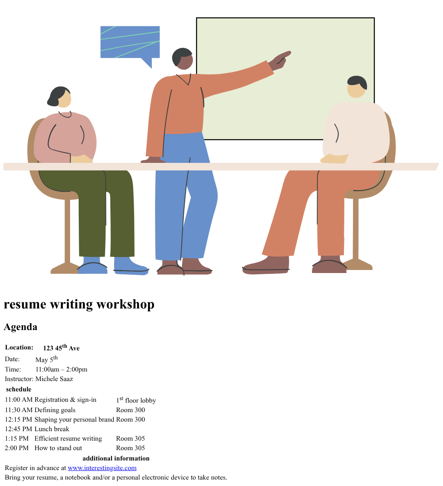 |

| Morph PDF |
| --- |
|  |

PDF: [Morph PDF](agendas-minutes/01/pdf_result.verified.pdf)

## agendas-minutes/02

| Reference (Pandoc HTML) | Morph HTML | Morph Markdown |
| --- | --- | --- |
| 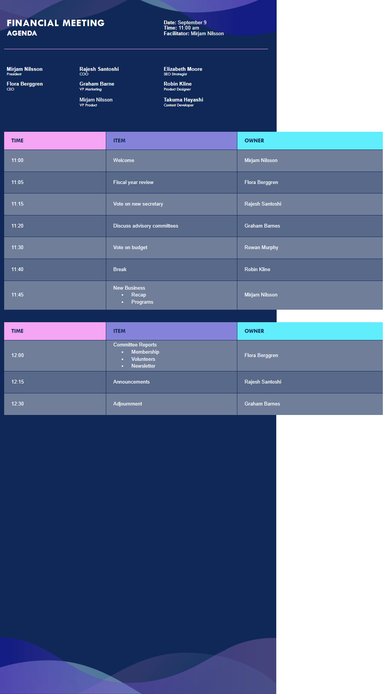 |  | 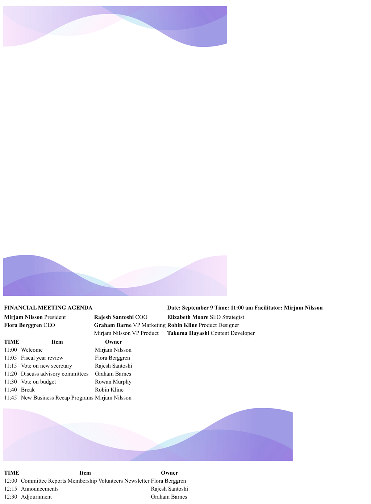 |

| Morph PDF |
| --- |
|  |
|  |

PDF: [Morph PDF](agendas-minutes/02/pdf_result.verified.pdf) · [Pandoc reference](agendas-minutes/02/expected.pdf)

## agendas-minutes/03

| Reference (Pandoc HTML) | Morph HTML | Morph Markdown |
| --- | --- | --- |
|  | 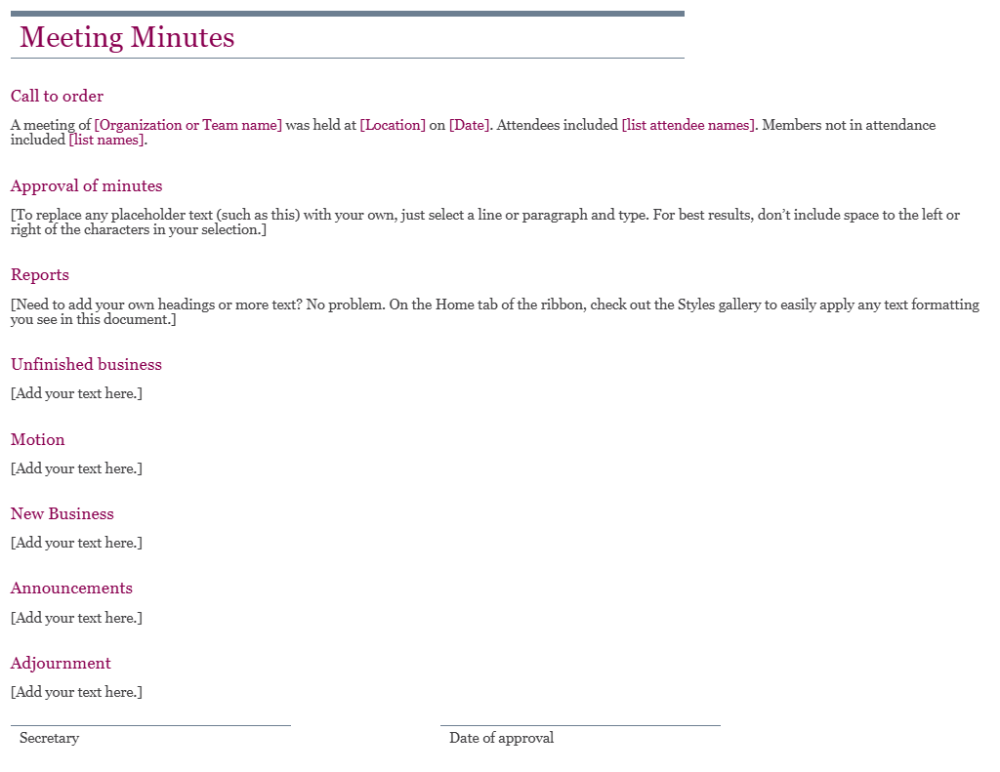 | 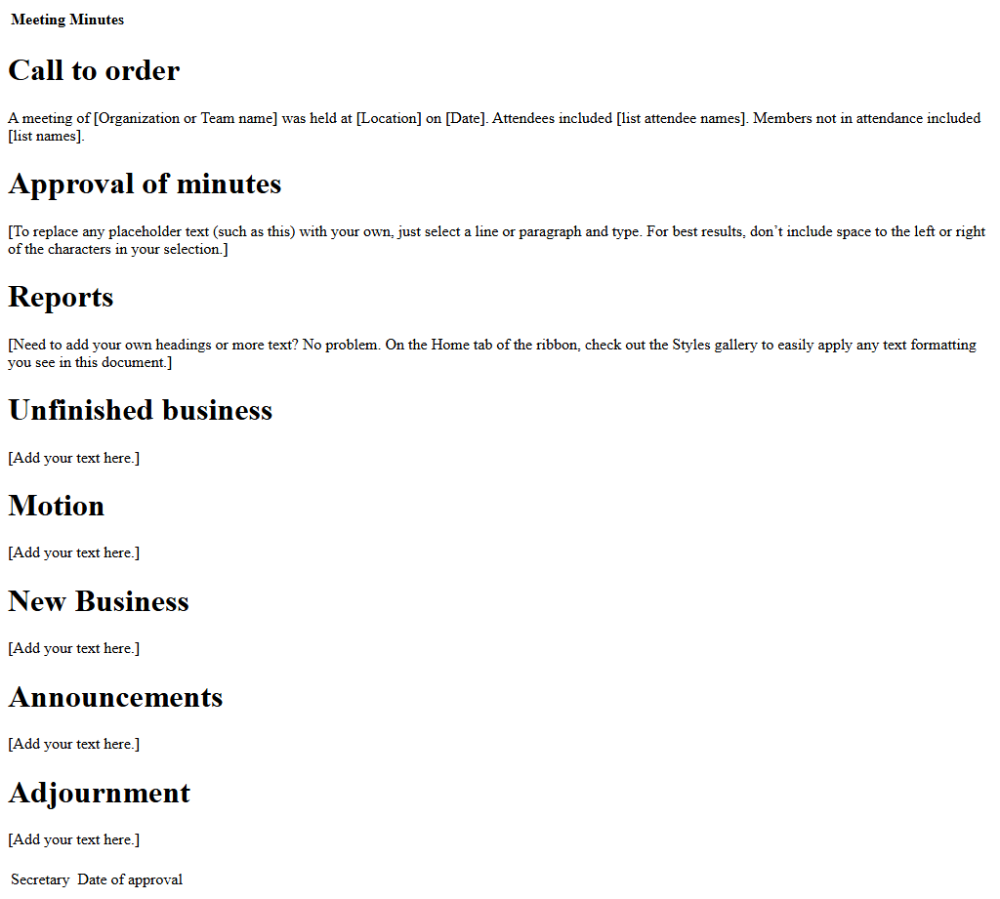 |

| Morph PDF |
| --- |
|  |

PDF: [Morph PDF](agendas-minutes/03/pdf_result.verified.pdf) · [Pandoc reference](agendas-minutes/03/expected.pdf)

## agendas-minutes/04

| Reference (Pandoc HTML) | Morph HTML | Morph Markdown |
| --- | --- | --- |
|  |  |  |

| Morph PDF |
| --- |
|  |

PDF: [Morph PDF](agendas-minutes/04/pdf_result.verified.pdf) · [Pandoc reference](agendas-minutes/04/expected.pdf)

## agendas-minutes/05

| Reference (Pandoc HTML) | Morph HTML | Morph Markdown |
| --- | --- | --- |
|  |  | 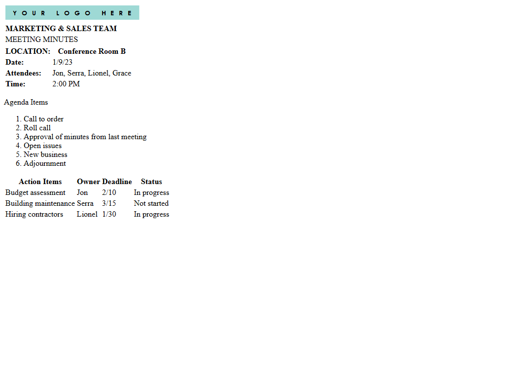 |

| Morph PDF |
| --- |
|  |

PDF: [Morph PDF](agendas-minutes/05/pdf_result.verified.pdf) · [Pandoc reference](agendas-minutes/05/expected.pdf)

## agendas-minutes/06

| Reference (Pandoc HTML) | Morph HTML | Morph Markdown |
| --- | --- | --- |
|  |  |  |

| Morph PDF |
| --- |
|  |

PDF: [Morph PDF](agendas-minutes/06/pdf_result.verified.pdf) · [Pandoc reference](agendas-minutes/06/expected.pdf)

## agendas-minutes/07

| Reference (Pandoc HTML) | Morph HTML | Morph Markdown |
| --- | --- | --- |
| 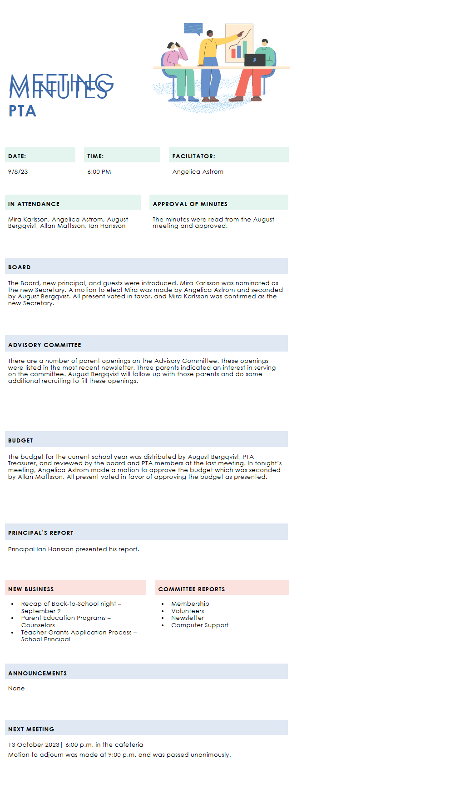 |  |  |

| Morph PDF |
| --- |
|  |
|  |

PDF: [Morph PDF](agendas-minutes/07/pdf_result.verified.pdf)

## agendas-minutes/08

| Reference (Pandoc HTML) | Morph HTML | Morph Markdown |
| --- | --- | --- |
|  |  |  |

| Morph PDF |
| --- |
|  |
|  |
|  |

PDF: [Morph PDF](agendas-minutes/08/pdf_result.verified.pdf) · [Pandoc reference](agendas-minutes/08/expected.pdf)

## agendas-minutes/09

| Reference (Pandoc HTML) | Morph HTML | Morph Markdown |
| --- | --- | --- |
|  |  |  |

| Morph PDF |
| --- |
|  |

PDF: [Morph PDF](agendas-minutes/09/pdf_result.verified.pdf) · [Pandoc reference](agendas-minutes/09/expected.pdf)

## agendas-minutes/10

| Reference (Pandoc HTML) | Morph HTML | Morph Markdown |
| --- | --- | --- |
|  |  |  |

| Morph PDF |
| --- |
|  |

PDF: [Morph PDF](agendas-minutes/10/pdf_result.verified.pdf) · [Pandoc reference](agendas-minutes/10/expected.pdf)

## agendas-minutes/11

| Reference (Pandoc HTML) | Morph HTML | Morph Markdown |
| --- | --- | --- |
|  |  |  |

| Morph PDF |
| --- |
|  |

PDF: [Morph PDF](agendas-minutes/11/pdf_result.verified.pdf) · [Pandoc reference](agendas-minutes/11/expected.pdf)

## agendas-minutes/12

| Reference (Pandoc HTML) | Morph HTML | Morph Markdown |
| --- | --- | --- |
|  |  | 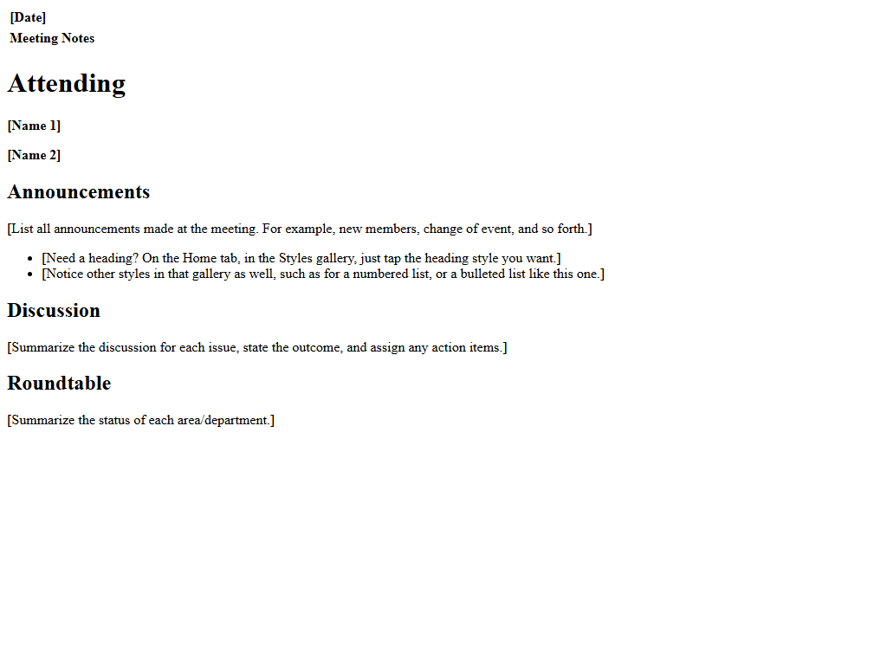 |

| Morph PDF |
| --- |
|  |

PDF: [Morph PDF](agendas-minutes/12/pdf_result.verified.pdf) · [Pandoc reference](agendas-minutes/12/expected.pdf)

## agendas-minutes/13

| Reference (Pandoc HTML) | Morph HTML | Morph Markdown |
| --- | --- | --- |
| 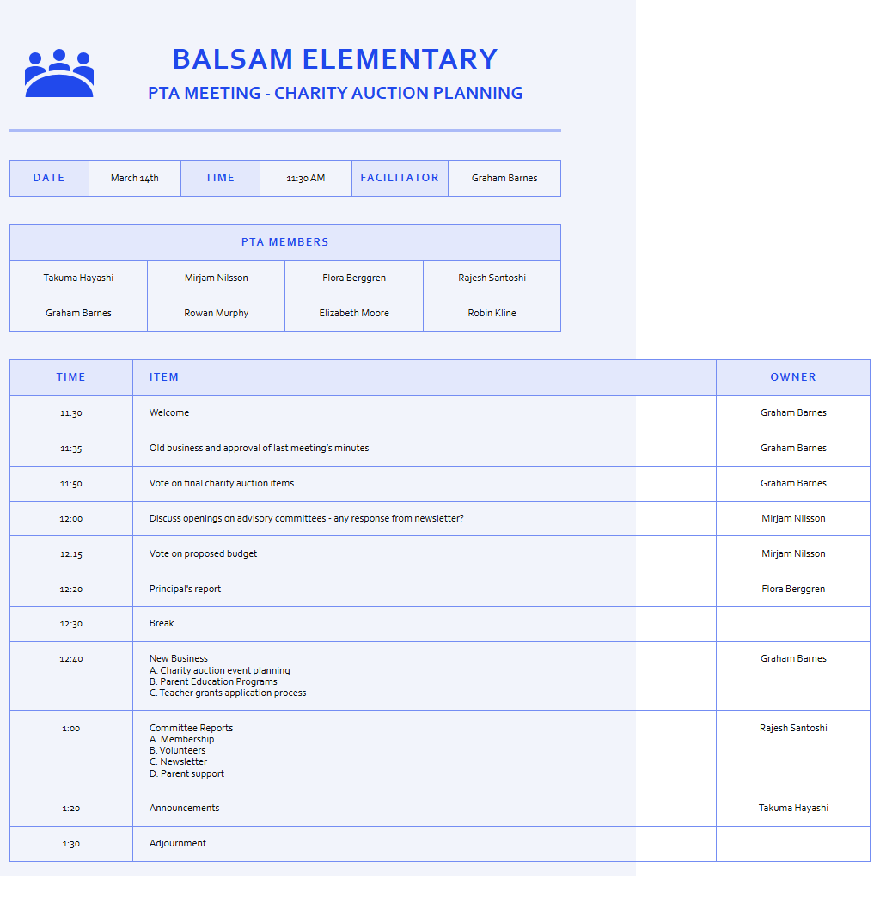 | 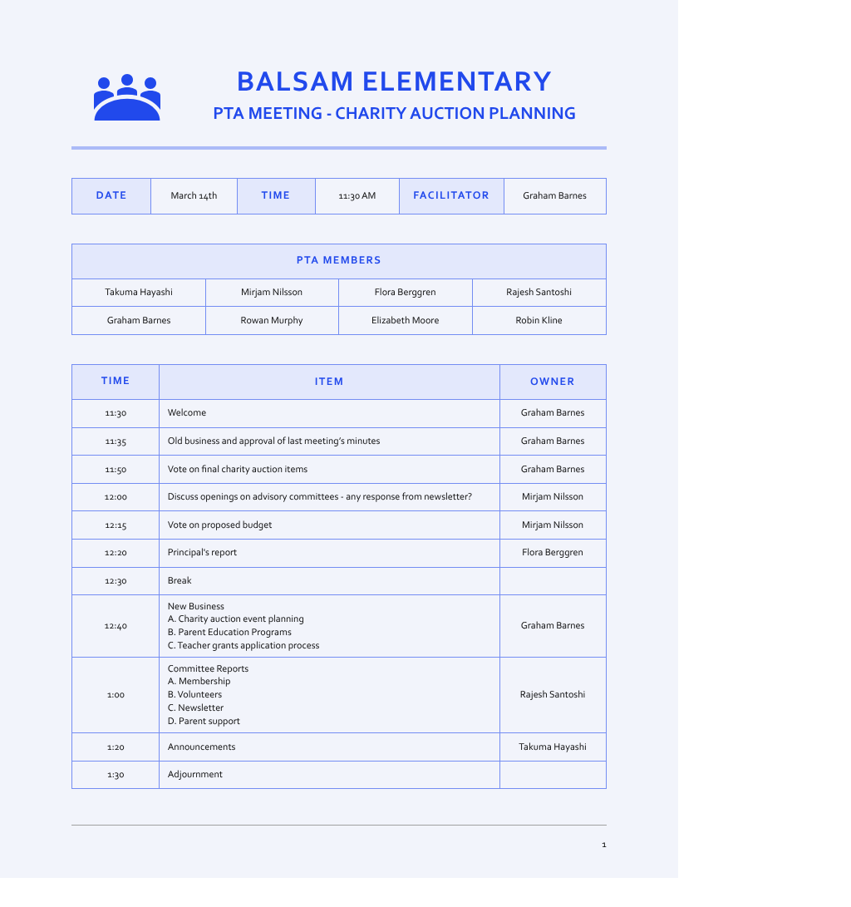 |  |

| Morph PDF |
| --- |
|  |

PDF: [Morph PDF](agendas-minutes/13/pdf_result.verified.pdf)

## agendas-minutes/14

| Reference (Pandoc HTML) | Morph HTML | Morph Markdown |
| --- | --- | --- |
|  |  |  |

| Morph PDF |
| --- |
|  |

PDF: [Morph PDF](agendas-minutes/14/pdf_result.verified.pdf)

## agendas-minutes/15

| Reference (Pandoc HTML) | Morph HTML | Morph Markdown |
| --- | --- | --- |
|  |  | 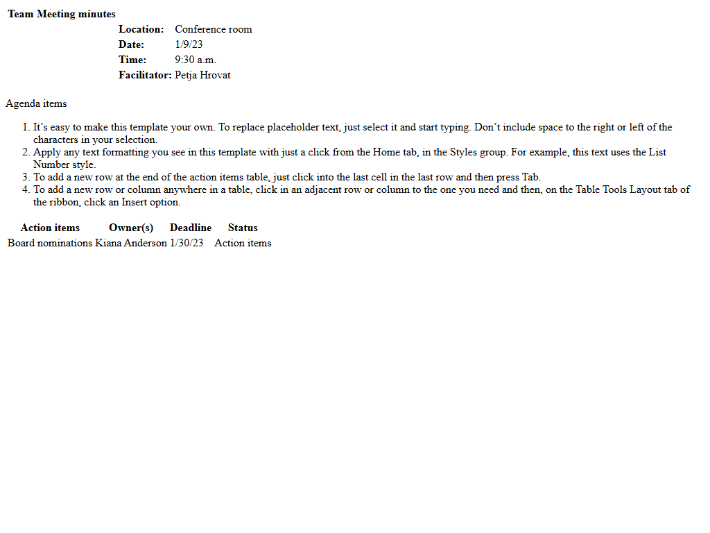 |

| Morph PDF |
| --- |
|  |

PDF: [Morph PDF](agendas-minutes/15/pdf_result.verified.pdf) · [Pandoc reference](agendas-minutes/15/expected.pdf)

## agendas-minutes/16

| Reference (Pandoc HTML) | Morph HTML | Morph Markdown |
| --- | --- | --- |
|  | 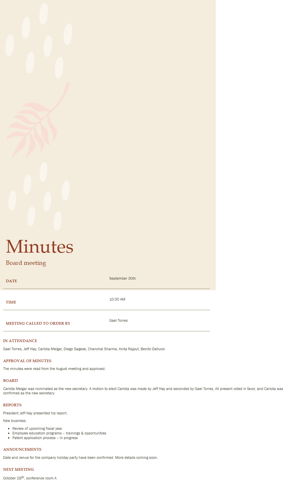 |  |

| Morph PDF |
| --- |
|  |

PDF: [Morph PDF](agendas-minutes/16/pdf_result.verified.pdf) · [Pandoc reference](agendas-minutes/16/expected.pdf)

## agendas-minutes/17

| Reference (Pandoc HTML) | Morph HTML | Morph Markdown |
| --- | --- | --- |
| 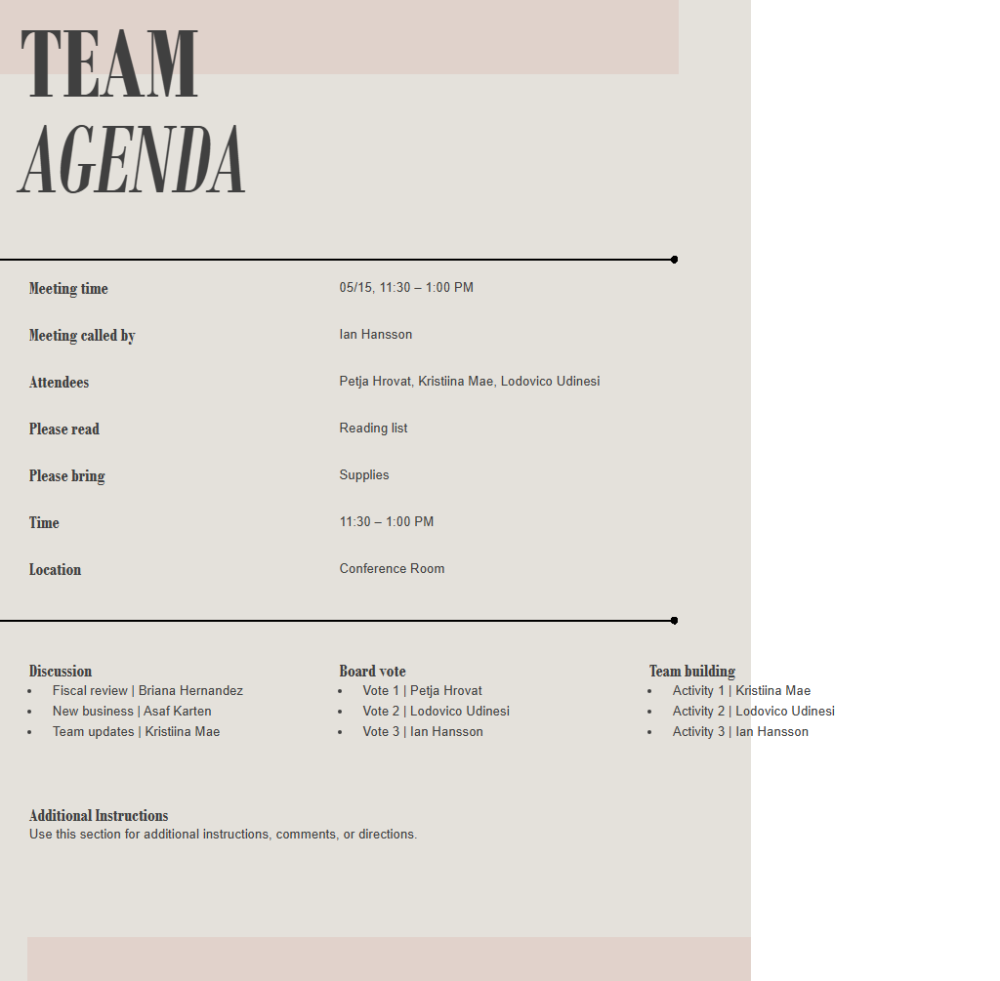 |  |  |

| Morph PDF |
| --- |
|  |

PDF: [Morph PDF](agendas-minutes/17/pdf_result.verified.pdf) · [Pandoc reference](agendas-minutes/17/expected.pdf)

## agendas-minutes/18

| Reference (Pandoc HTML) | Morph HTML | Morph Markdown |
| --- | --- | --- |
|  | 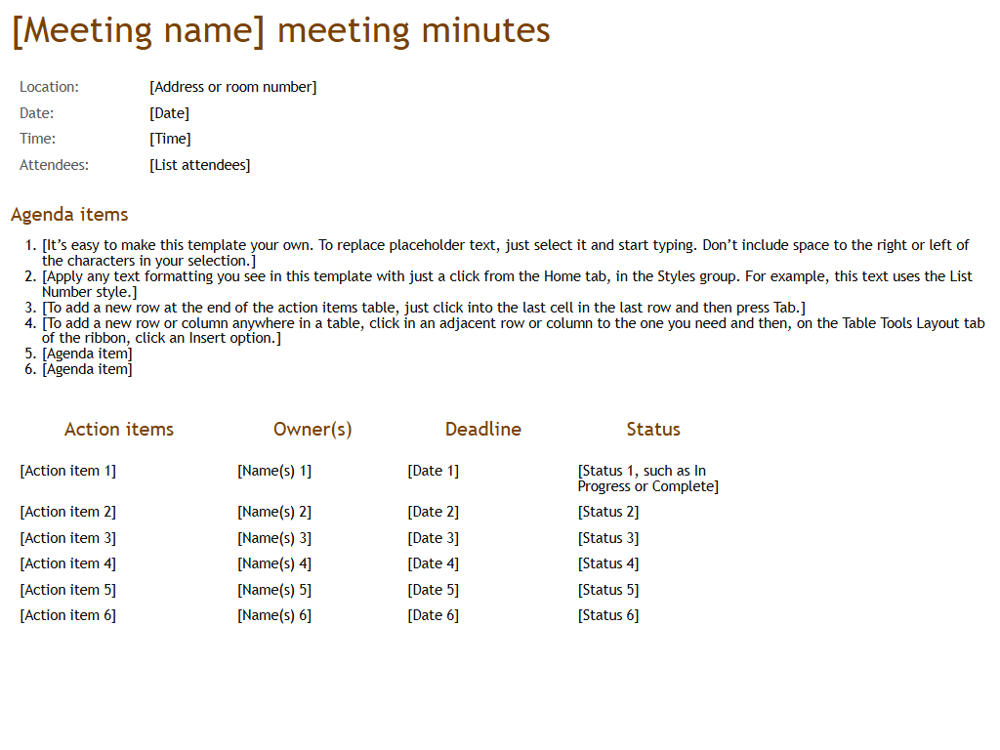 | 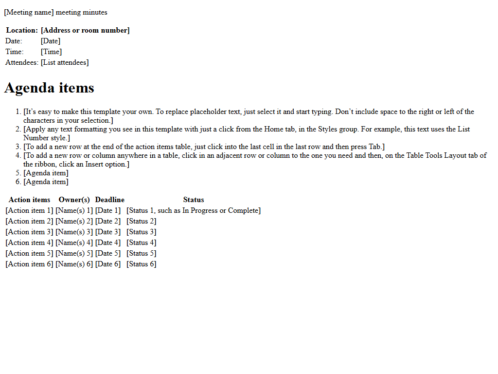 |

| Morph PDF |
| --- |
|  |

PDF: [Morph PDF](agendas-minutes/18/pdf_result.verified.pdf) · [Pandoc reference](agendas-minutes/18/expected.pdf)

## agendas-minutes/19

| Reference (Pandoc HTML) | Morph HTML | Morph Markdown |
| --- | --- | --- |
|  |  |  |

| Morph PDF |
| --- |
|  |

PDF: [Morph PDF](agendas-minutes/19/pdf_result.verified.pdf) · [Pandoc reference](agendas-minutes/19/expected.pdf)

## align_center

| Reference (Pandoc HTML) | Morph HTML | Morph Markdown |
| --- | --- | --- |
|  |  |  |

| Morph PDF |
| --- |
|  |

PDF: [Morph PDF](align_center/pdf_result.verified.pdf) · [Pandoc reference](align_center/expected.pdf)

## align_justified

| Reference (Pandoc HTML) | Morph HTML | Morph Markdown |
| --- | --- | --- |
| 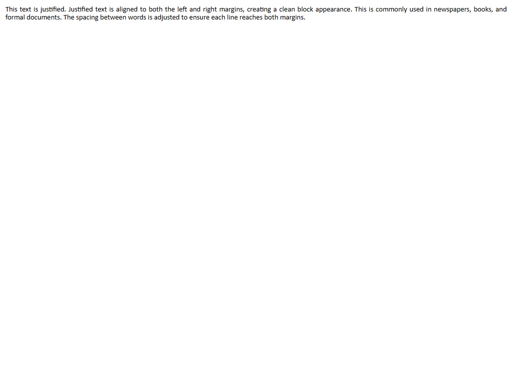 |  | 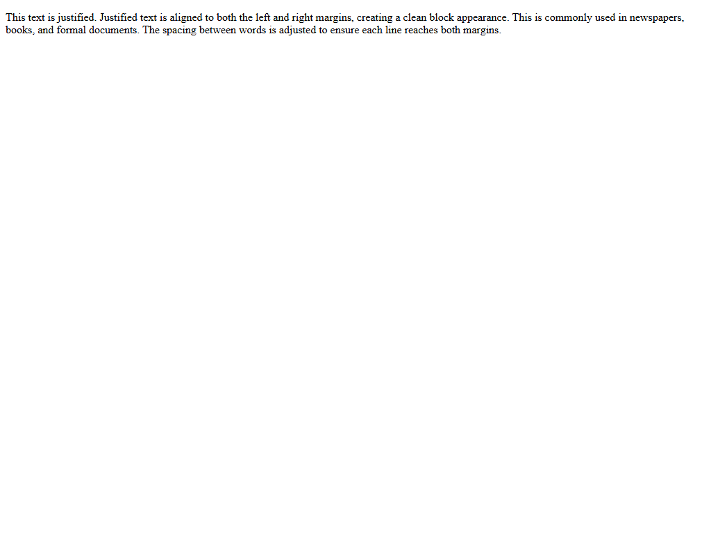 |

| Morph PDF |
| --- |
|  |

PDF: [Morph PDF](align_justified/pdf_result.verified.pdf) · [Pandoc reference](align_justified/expected.pdf)

## align_left

| Reference (Pandoc HTML) | Morph HTML | Morph Markdown |
| --- | --- | --- |
|  |  | 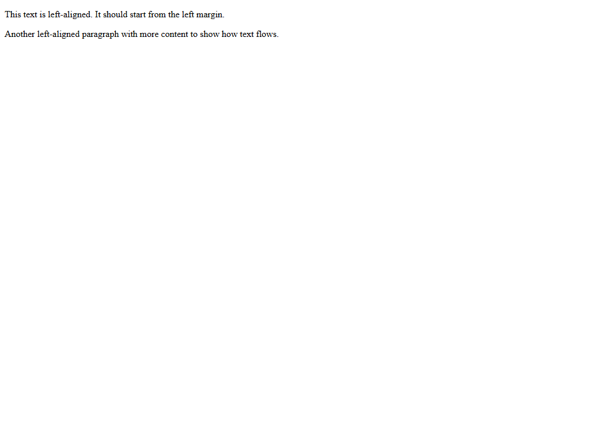 |

| Morph PDF |
| --- |
|  |

PDF: [Morph PDF](align_left/pdf_result.verified.pdf) · [Pandoc reference](align_left/expected.pdf)

## align_mixed

| Reference (Pandoc HTML) | Morph HTML | Morph Markdown |
| --- | --- | --- |
|  |  | 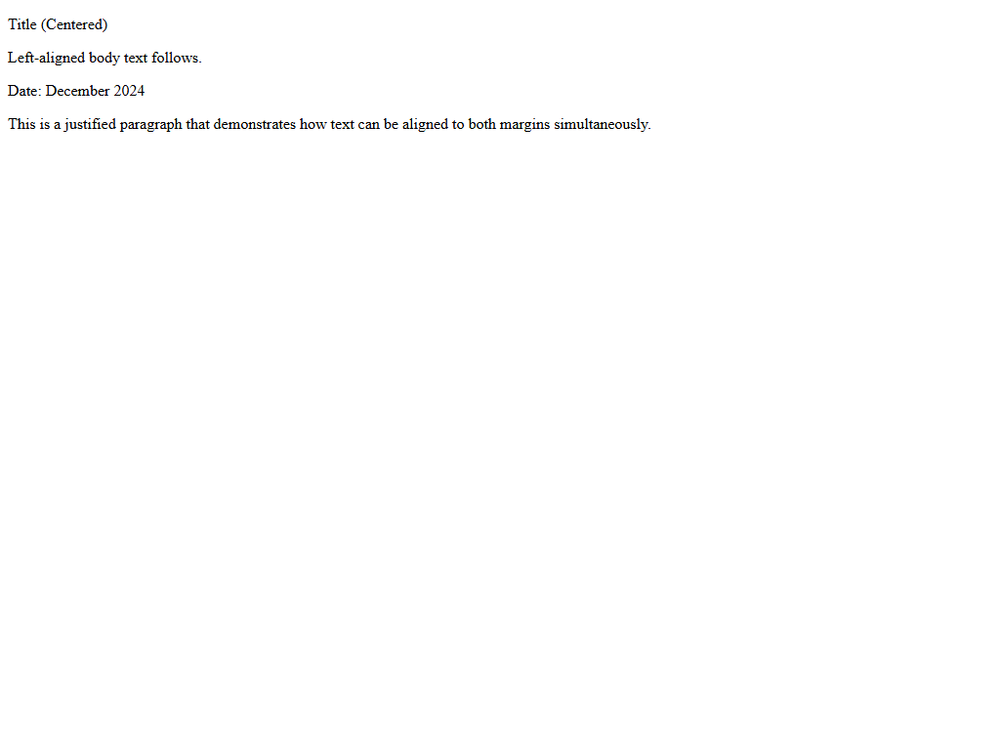 |

| Morph PDF |
| --- |
|  |

PDF: [Morph PDF](align_mixed/pdf_result.verified.pdf) · [Pandoc reference](align_mixed/expected.pdf)

## align_right

| Reference (Pandoc HTML) | Morph HTML | Morph Markdown |
| --- | --- | --- |
|  |  |  |

| Morph PDF |
| --- |
|  |

PDF: [Morph PDF](align_right/pdf_result.verified.pdf) · [Pandoc reference](align_right/expected.pdf)

## all_caps

| Reference (Pandoc HTML) | Morph HTML | Morph Markdown |
| --- | --- | --- |
|  |  |  |

| Morph PDF |
| --- |
|  |

PDF: [Morph PDF](all_caps/pdf_result.verified.pdf) · [Pandoc reference](all_caps/expected.pdf)

## bar_tabs

| Reference (Pandoc HTML) | Morph HTML | Morph Markdown |
| --- | --- | --- |
|  | 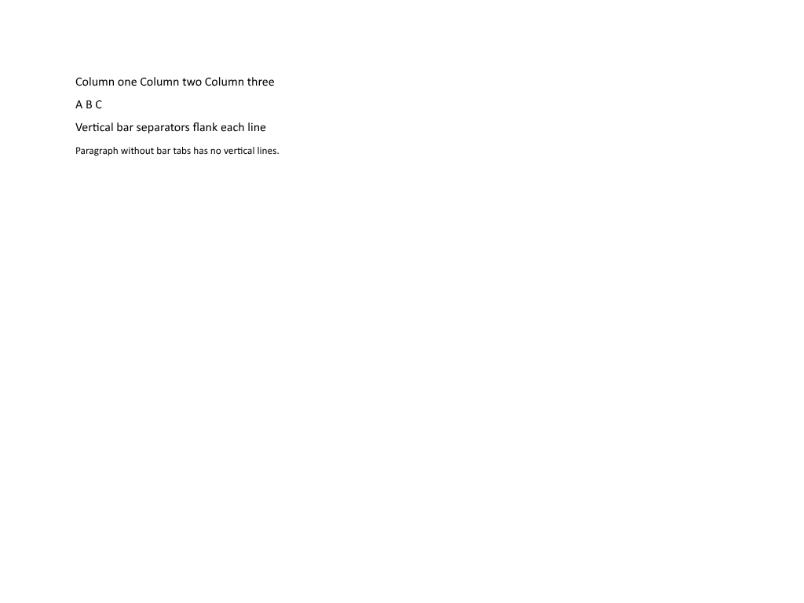 |  |

| Morph PDF |
| --- |
|  |

PDF: [Morph PDF](bar_tabs/pdf_result.verified.pdf) · [Pandoc reference](bar_tabs/expected.pdf)

## block_quote

| Reference (Pandoc HTML) | Morph HTML | Morph Markdown |
| --- | --- | --- |
|  |  |  |

| Morph PDF |
| --- |
|  |

PDF: [Morph PDF](block_quote/pdf_result.verified.pdf) · [Pandoc reference](block_quote/expected.pdf)

## bold_text

| Reference (Pandoc HTML) | Morph HTML | Morph Markdown |
| --- | --- | --- |
|  |  |  |

| Morph PDF |
| --- |
|  |

PDF: [Morph PDF](bold_text/pdf_result.verified.pdf) · [Pandoc reference](bold_text/expected.pdf)

## brochures/01

| Reference (Pandoc HTML) | Morph HTML | Morph Markdown |
| --- | --- | --- |
|  |  |  |

| Morph PDF |
| --- |
|  |
|  |

PDF: [Morph PDF](brochures/01/pdf_result.verified.pdf)

## brochures/02

| Reference (Pandoc HTML) | Morph HTML | Morph Markdown |
| --- | --- | --- |
| 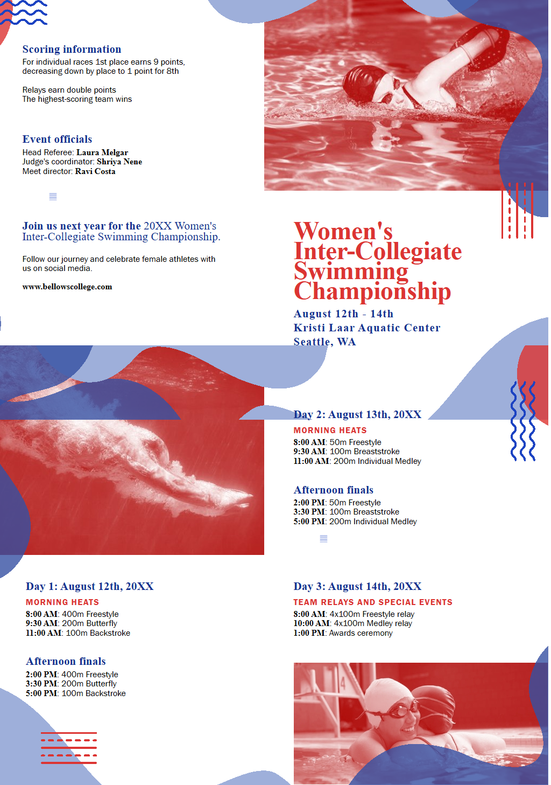 | 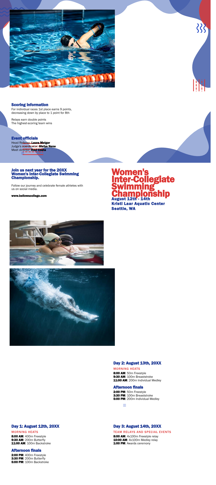 | 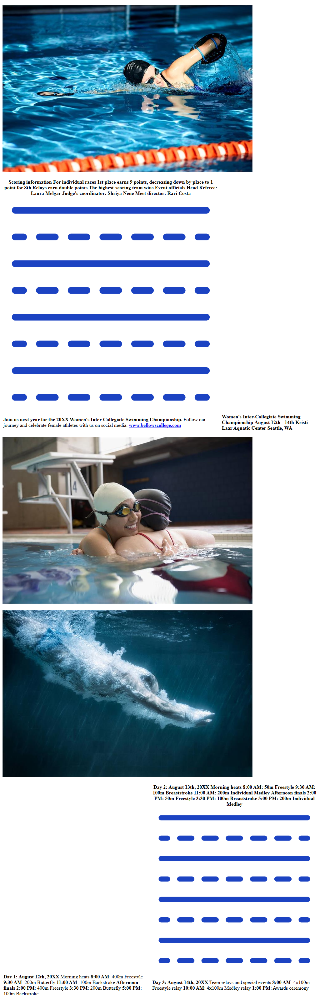 |

| Morph PDF |
| --- |
|  |
|  |

PDF: [Morph PDF](brochures/02/pdf_result.verified.pdf)

## brochures/03

| Reference (Pandoc HTML) | Morph HTML | Morph Markdown |
| --- | --- | --- |
|  |  |  |

| Morph PDF |
| --- |
|  |
|  |

PDF: [Morph PDF](brochures/03/pdf_result.verified.pdf) · [Pandoc reference](brochures/03/expected.pdf)

## brochures/04

| Reference (Pandoc HTML) | Morph HTML | Morph Markdown |
| --- | --- | --- |
|  |  |  |

| Morph PDF |
| --- |
|  |
|  |

PDF: [Morph PDF](brochures/04/pdf_result.verified.pdf) · [Pandoc reference](brochures/04/expected.pdf)

## brochures/05

| Reference (Pandoc HTML) | Morph HTML | Morph Markdown |
| --- | --- | --- |
|  |  | 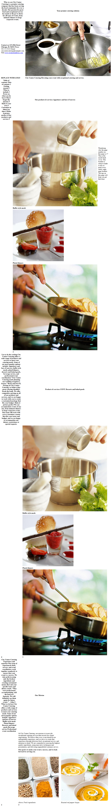 |

| Morph PDF |
| --- |
|  |
|  |
|  |
|  |

PDF: [Morph PDF](brochures/05/pdf_result.verified.pdf) · [Pandoc reference](brochures/05/expected.pdf)

## brochures/06

| Reference (Pandoc HTML) | Morph HTML | Morph Markdown |
| --- | --- | --- |
|  |  | 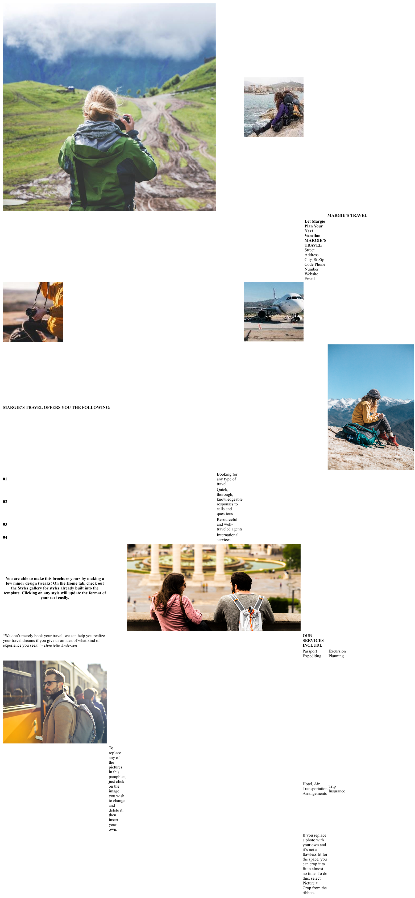 |

| Morph PDF |
| --- |
|  |
|  |

PDF: [Morph PDF](brochures/06/pdf_result.verified.pdf) · [Pandoc reference](brochures/06/expected.pdf)

## brochures/07

| Reference (Pandoc HTML) | Morph HTML | Morph Markdown |
| --- | --- | --- |
|  |  | 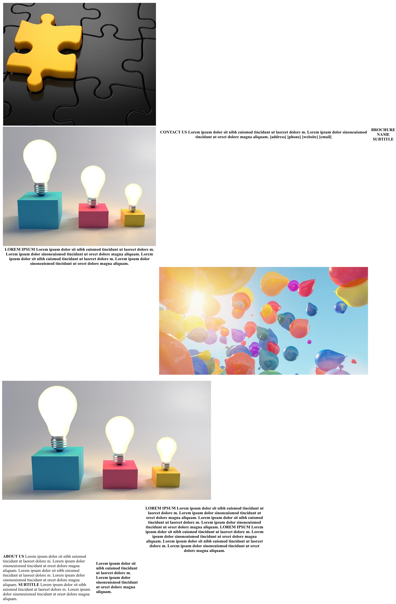 |

| Morph PDF |
| --- |
|  |
|  |
|  |

PDF: [Morph PDF](brochures/07/pdf_result.verified.pdf) · [Pandoc reference](brochures/07/expected.pdf)

## brochures/08

| Reference (Pandoc HTML) | Morph HTML | Morph Markdown |
| --- | --- | --- |
|  |  | 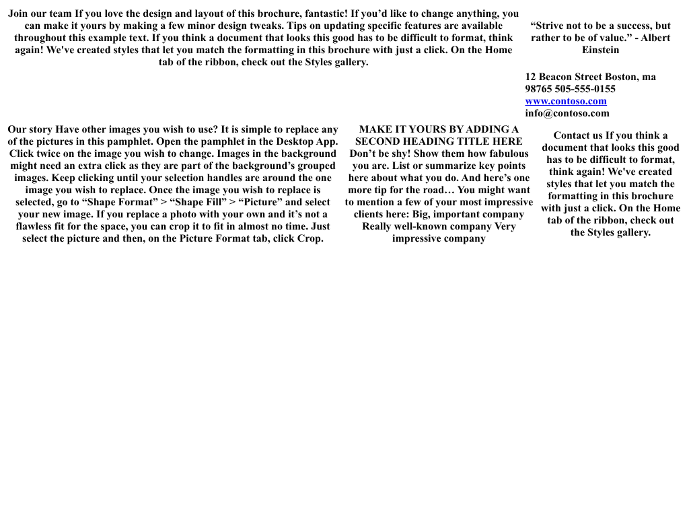 |

| Morph PDF |
| --- |
|  |
|  |

PDF: [Morph PDF](brochures/08/pdf_result.verified.pdf) · [Pandoc reference](brochures/08/expected.pdf)

## bullet_list

| Reference (Pandoc HTML) | Morph HTML | Morph Markdown |
| --- | --- | --- |
|  |  |  |

| Morph PDF |
| --- |
|  |

PDF: [Morph PDF](bullet_list/pdf_result.verified.pdf) · [Pandoc reference](bullet_list/expected.pdf)

## business-plans/01

| Reference (Pandoc HTML) | Morph HTML | Morph Markdown |
| --- | --- | --- |
|  |  | 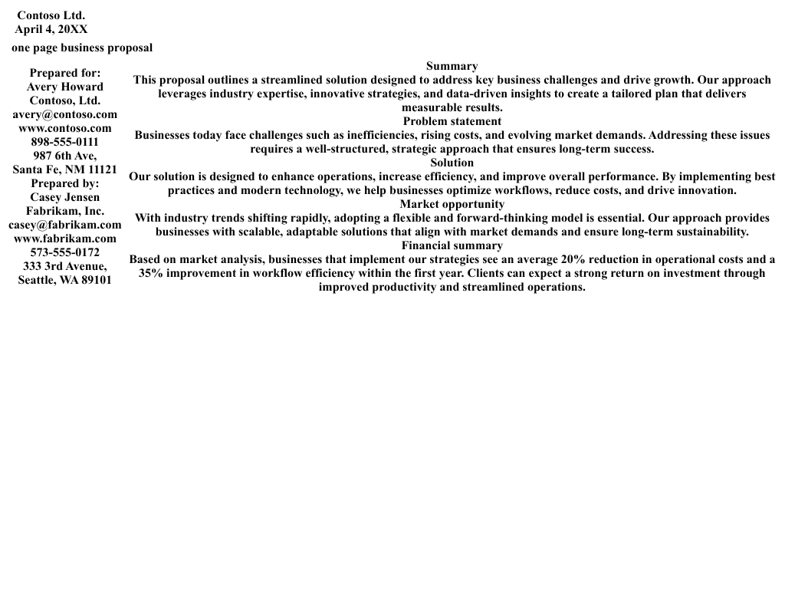 |

| Morph PDF |
| --- |
|  |

PDF: [Morph PDF](business-plans/01/pdf_result.verified.pdf) · [Pandoc reference](business-plans/01/expected.pdf)

## business-plans/02

| Reference (Pandoc HTML) | Morph HTML | Morph Markdown |
| --- | --- | --- |
| 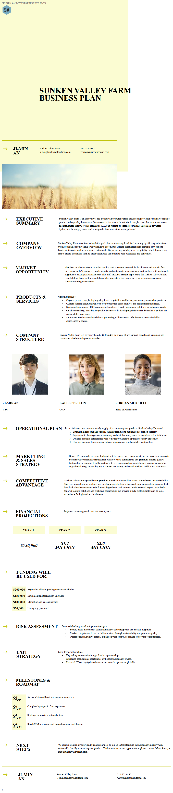 | 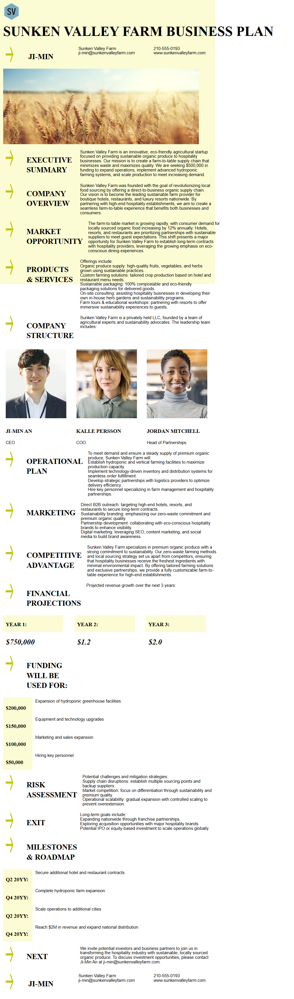 | 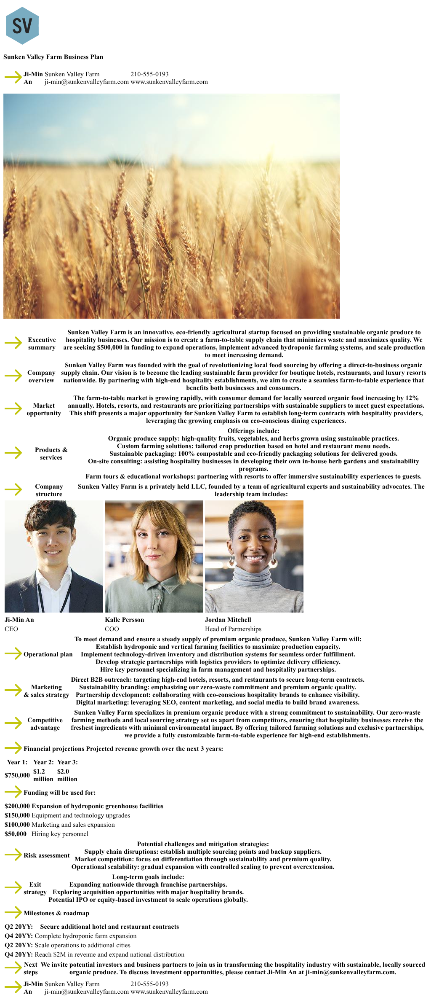 |

| Morph PDF |
| --- |
|  |
|  |
|  |
|  |
|  |
|  |

PDF: [Morph PDF](business-plans/02/pdf_result.verified.pdf) · [Pandoc reference](business-plans/02/expected.pdf)

## business-plans/03

| Reference (Pandoc HTML) | Morph HTML | Morph Markdown |
| --- | --- | --- |
|  | 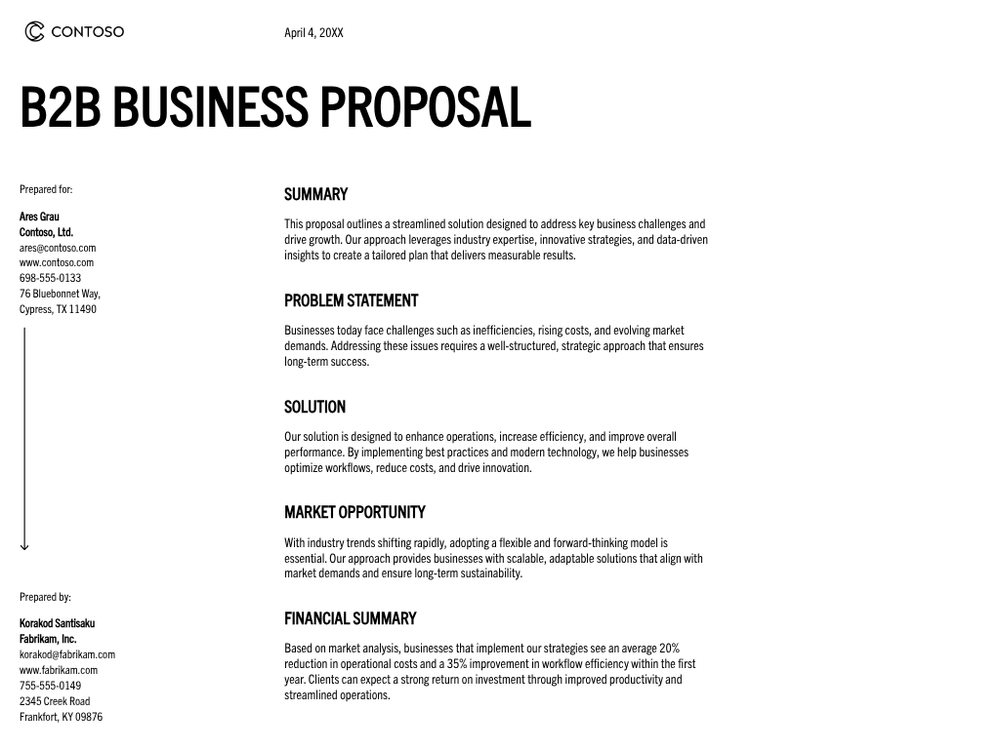 | 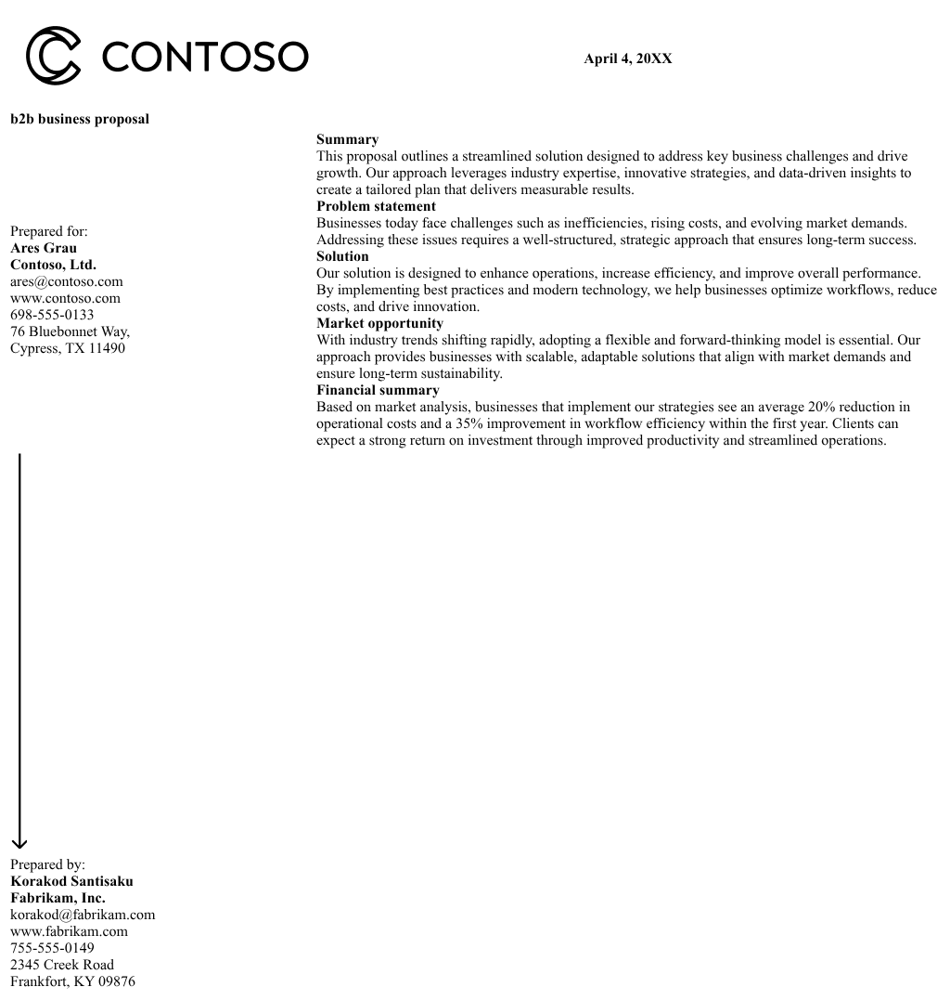 |

| Morph PDF |
| --- |
|  |

PDF: [Morph PDF](business-plans/03/pdf_result.verified.pdf) · [Pandoc reference](business-plans/03/expected.pdf)

## business-plans/04

| Reference (Pandoc HTML) | Morph HTML | Morph Markdown |
| --- | --- | --- |
|  |  |  |

| Morph PDF |
| --- |
|  |

PDF: [Morph PDF](business-plans/04/pdf_result.verified.pdf) · [Pandoc reference](business-plans/04/expected.pdf)

## business-plans/05

| Reference (Pandoc HTML) | Morph HTML | Morph Markdown |
| --- | --- | --- |
| 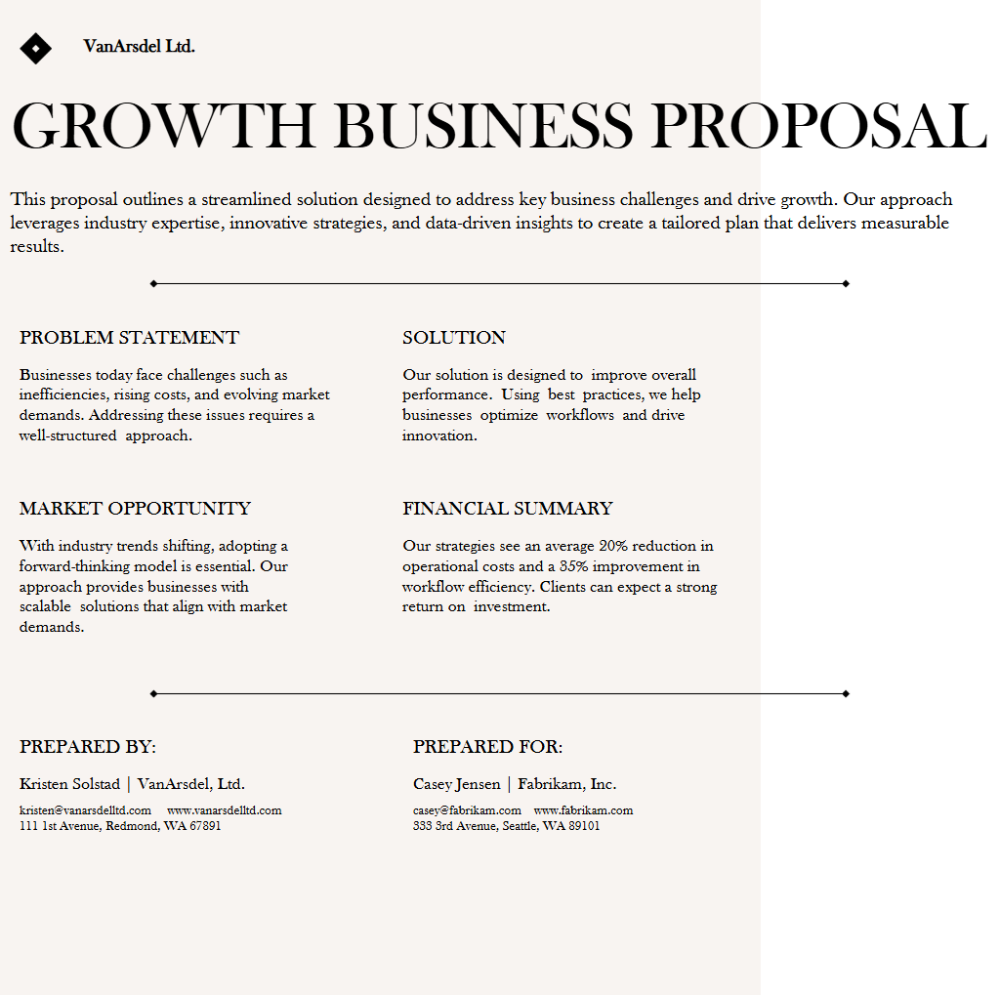 |  |  |

| Morph PDF |
| --- |
|  |

PDF: [Morph PDF](business-plans/05/pdf_result.verified.pdf) · [Pandoc reference](business-plans/05/expected.pdf)

## business-plans/06

| Reference (Pandoc HTML) | Morph HTML | Morph Markdown |
| --- | --- | --- |
|  |  | 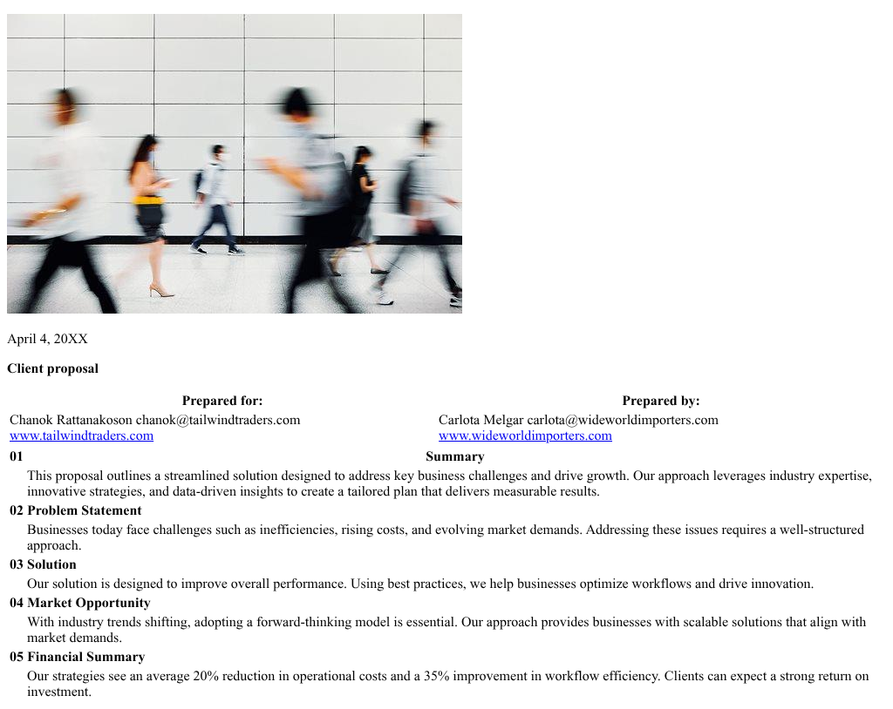 |

| Morph PDF |
| --- |
|  |
|  |

PDF: [Morph PDF](business-plans/06/pdf_result.verified.pdf) · [Pandoc reference](business-plans/06/expected.pdf)

## business-plans/07

| Reference (Pandoc HTML) | Morph HTML | Morph Markdown |
| --- | --- | --- |
|  |  |  |

| Morph PDF |
| --- |
|  |

PDF: [Morph PDF](business-plans/07/pdf_result.verified.pdf) · [Pandoc reference](business-plans/07/expected.pdf)

## business-plans/08

| Reference (Pandoc HTML) | Morph HTML | Morph Markdown |
| --- | --- | --- |
|  |  |  |

| Morph PDF |
| --- |
|  |
|  |

PDF: [Morph PDF](business-plans/08/pdf_result.verified.pdf) · [Pandoc reference](business-plans/08/expected.pdf)

## business-plans/09

| Reference (Pandoc HTML) | Morph HTML | Morph Markdown |
| --- | --- | --- |
| 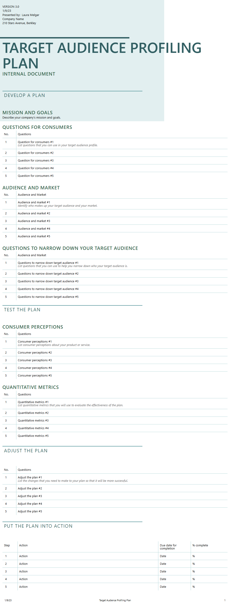 |  | 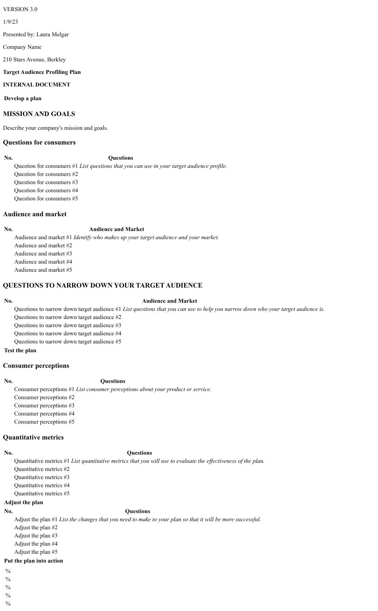 |

| Morph PDF |
| --- |
|  |
|  |
|  |
|  |

PDF: [Morph PDF](business-plans/09/pdf_result.verified.pdf) · [Pandoc reference](business-plans/09/expected.pdf)

## business-plans/10

| Reference (Pandoc HTML) | Morph HTML | Morph Markdown |
| --- | --- | --- |
|  | 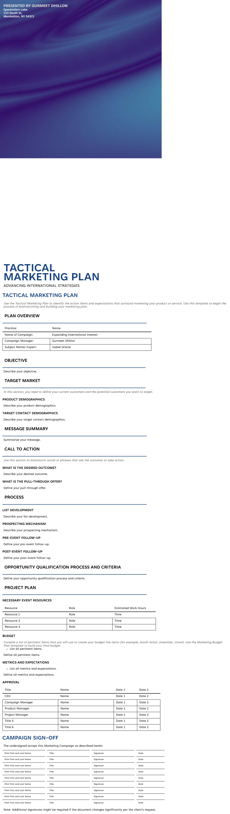 |  |

| Morph PDF |
| --- |
|  |
|  |
|  |
|  |
|  |
|  |

PDF: [Morph PDF](business-plans/10/pdf_result.verified.pdf) · [Pandoc reference](business-plans/10/expected.pdf)

## business-plans/12

| Reference (Pandoc HTML) | Morph HTML | Morph Markdown |
| --- | --- | --- |
|  |  | 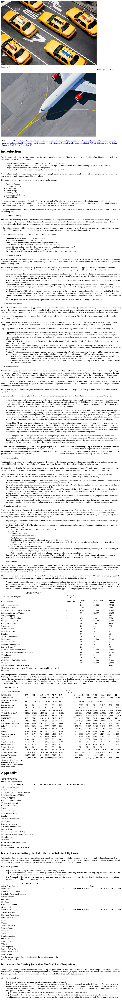 |

| Morph PDF |
| --- |
|  |
|  |
|  |
|  |
|  |
|  |
|  |
|  |
|  |
|  |
|  |
|  |
|  |
|  |
|  |
|  |
|  |
|  |
|  |
|  |
|  |

PDF: [Morph PDF](business-plans/12/pdf_result.verified.pdf) · [Pandoc reference](business-plans/12/expected.pdf)

## business-plans/13

| Reference (Pandoc HTML) | Morph HTML | Morph Markdown |
| --- | --- | --- |
|  |  | 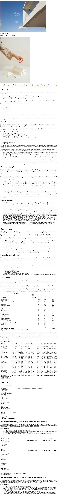 |

| Morph PDF |
| --- |
|  |
|  |
|  |
|  |
|  |
|  |
|  |
|  |
|  |
|  |
|  |
|  |
|  |
|  |
|  |
|  |
|  |
|  |
|  |
|  |
|  |

PDF: [Morph PDF](business-plans/13/pdf_result.verified.pdf) · [Pandoc reference](business-plans/13/expected.pdf)

## business-plans/15

| Reference (Pandoc HTML) | Morph HTML | Morph Markdown |
| --- | --- | --- |
|  |  |  |

| Morph PDF |
| --- |
|  |
|  |
|  |
|  |
|  |
|  |
|  |
|  |
|  |
|  |
|  |
|  |
|  |
|  |
|  |
|  |
|  |
|  |
|  |
|  |
|  |

PDF: [Morph PDF](business-plans/15/pdf_result.verified.pdf)

## business/01

| Reference (Pandoc HTML) | Morph HTML | Morph Markdown |
| --- | --- | --- |
| 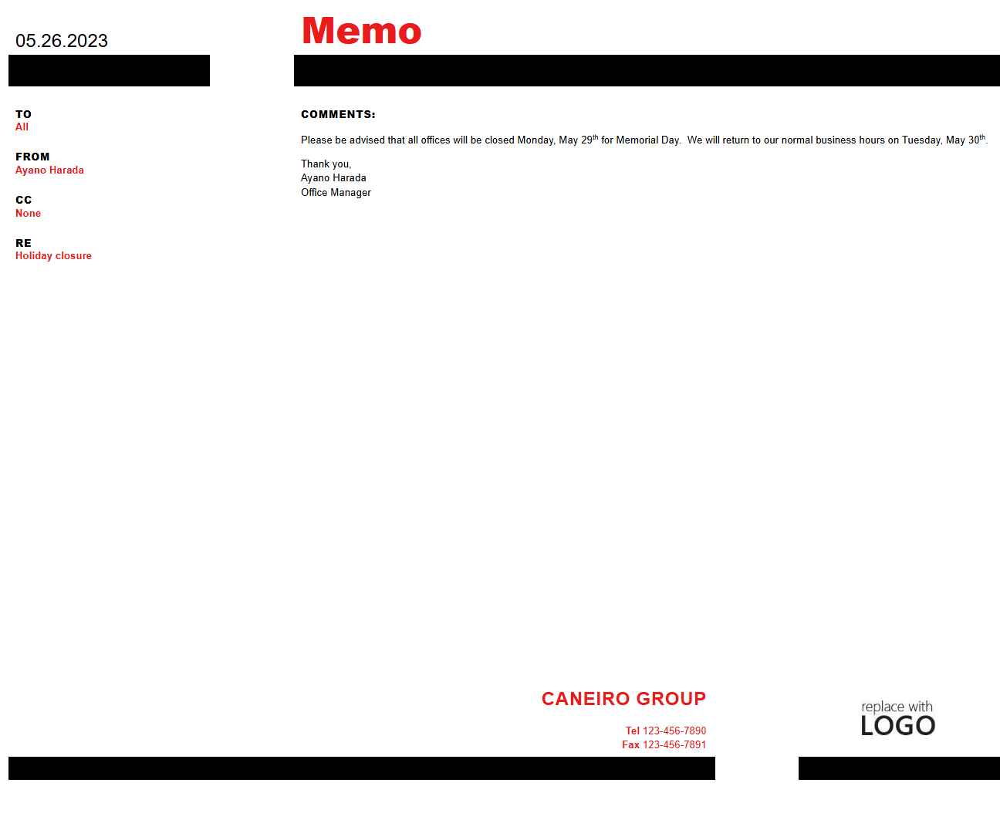 |  |  |

| Morph PDF |
| --- |
|  |

PDF: [Morph PDF](business/01/pdf_result.verified.pdf) · [Pandoc reference](business/01/expected.pdf)

## business/02

| Reference (Pandoc HTML) | Morph HTML | Morph Markdown |
| --- | --- | --- |
| 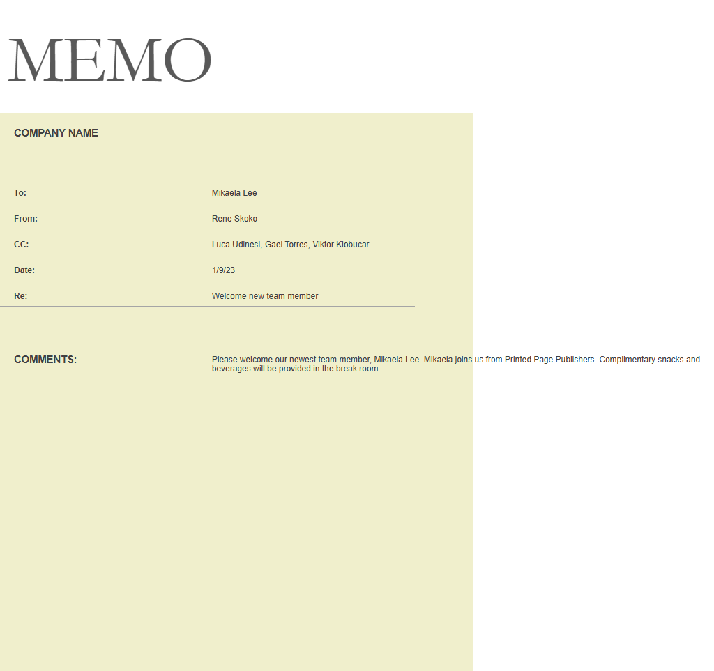 |  | 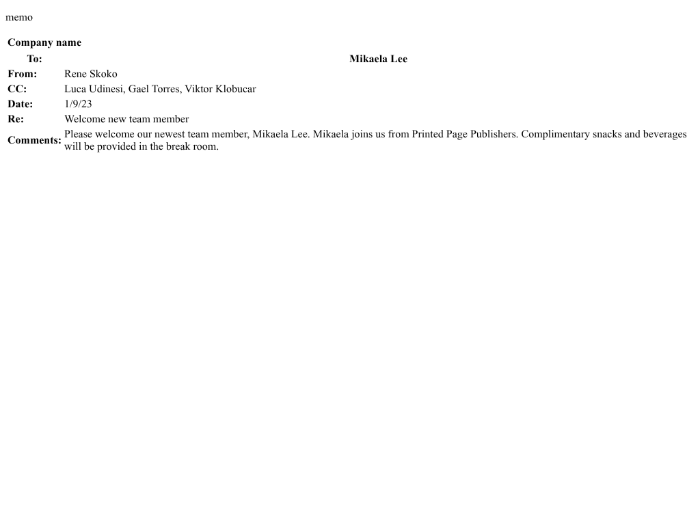 |

| Morph PDF |
| --- |
|  |

PDF: [Morph PDF](business/02/pdf_result.verified.pdf) · [Pandoc reference](business/02/expected.pdf)

## business/03

| Reference (Pandoc HTML) | Morph HTML | Morph Markdown |
| --- | --- | --- |
|  |  | 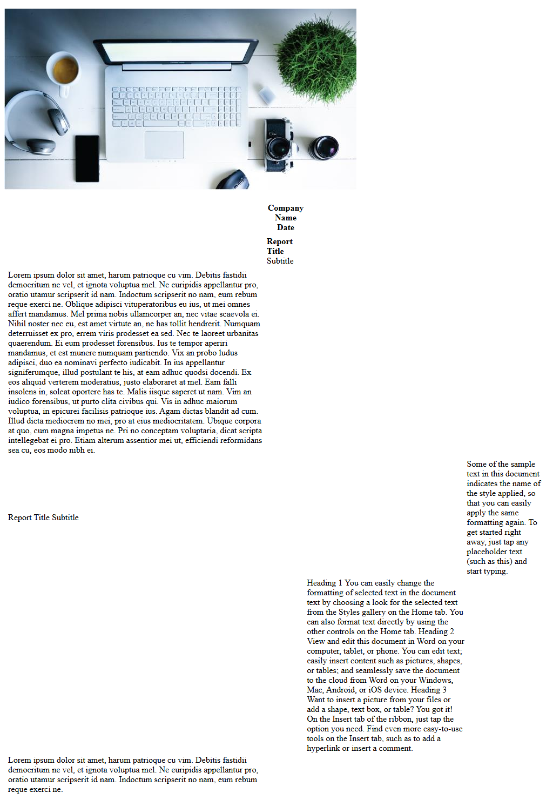 |

| Morph PDF |
| --- |
|  |
|  |

PDF: [Morph PDF](business/03/pdf_result.verified.pdf)

## business/04

| Reference (Pandoc HTML) | Morph HTML | Morph Markdown |
| --- | --- | --- |
| 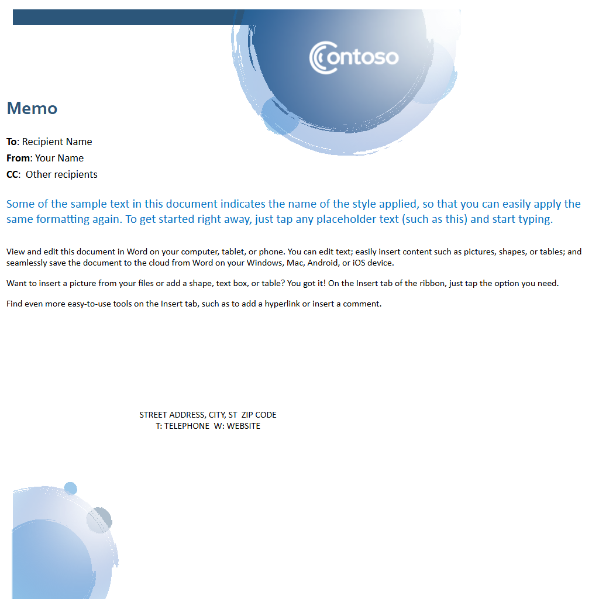 | 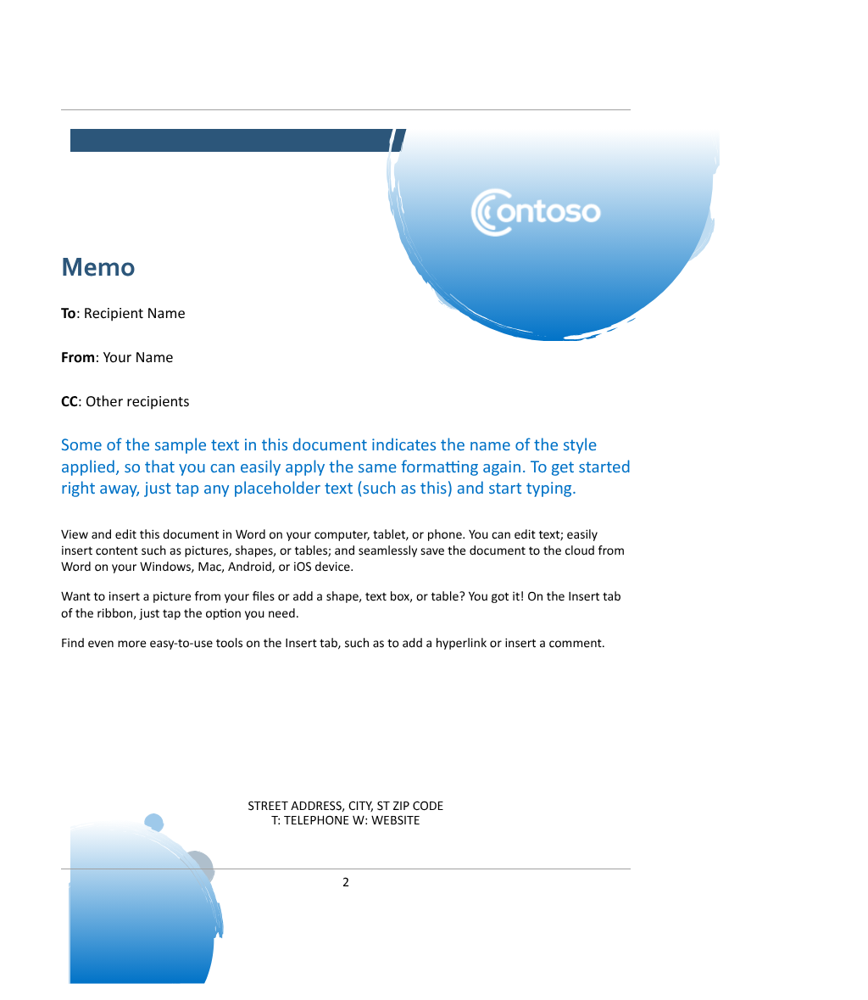 | 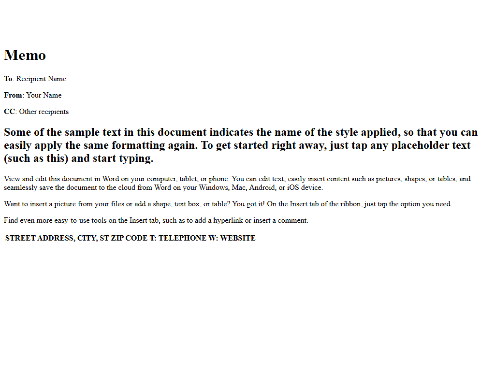 |

| Morph PDF |
| --- |
|  |

PDF: [Morph PDF](business/04/pdf_result.verified.pdf) · [Pandoc reference](business/04/expected.pdf)

## business/05

| Reference (Pandoc HTML) | Morph HTML | Morph Markdown |
| --- | --- | --- |
| 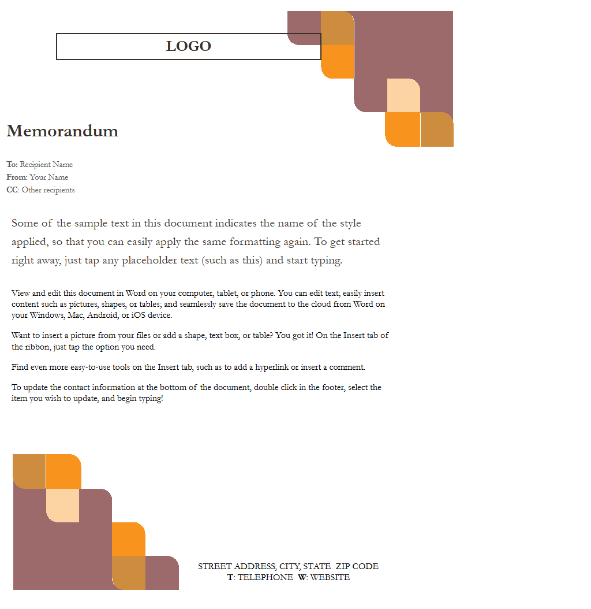 | 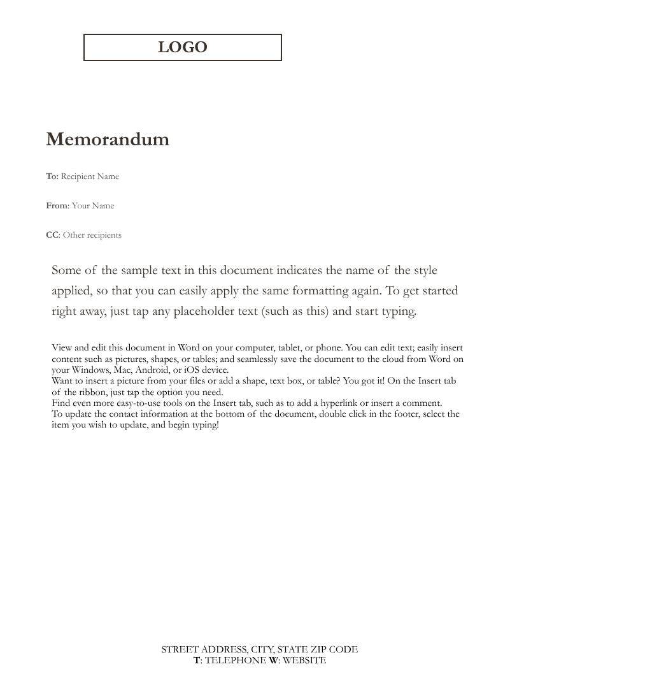 | 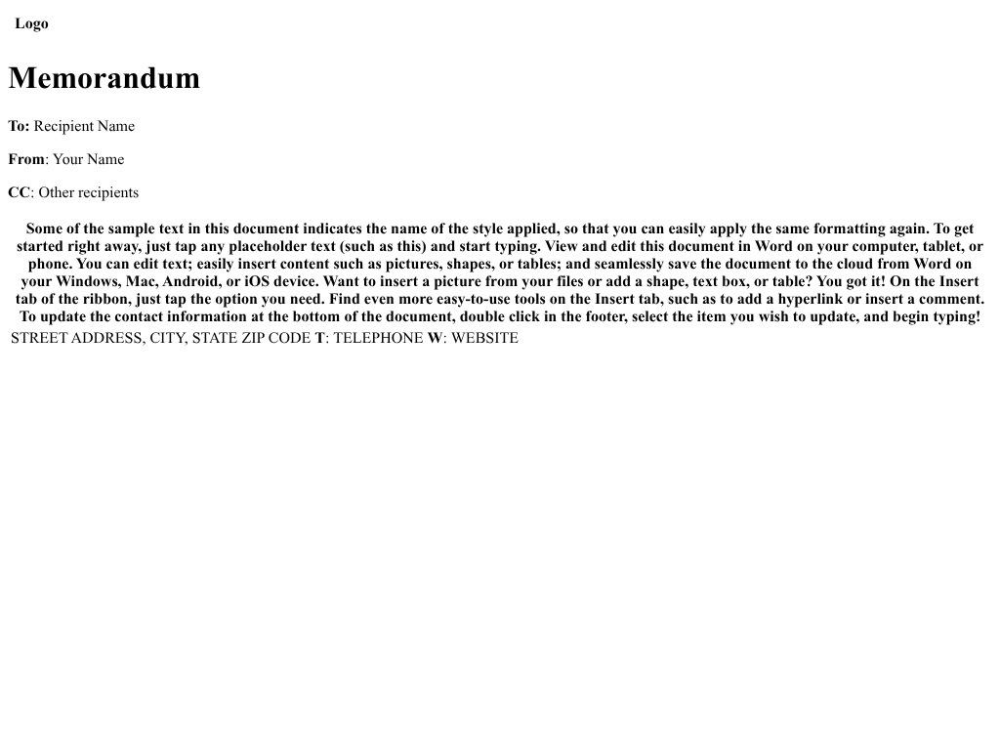 |

| Morph PDF |
| --- |
|  |
|  |

PDF: [Morph PDF](business/05/pdf_result.verified.pdf) · [Pandoc reference](business/05/expected.pdf)

## business/06

| Reference (Pandoc HTML) | Morph HTML | Morph Markdown |
| --- | --- | --- |
|  |  |  |

| Morph PDF |
| --- |
|  |

PDF: [Morph PDF](business/06/pdf_result.verified.pdf) · [Pandoc reference](business/06/expected.pdf)

## cards/01

| Reference (Pandoc HTML) | Morph HTML | Morph Markdown |
| --- | --- | --- |
|  |  |  |

| Morph PDF |
| --- |
|  |
|  |

PDF: [Morph PDF](cards/01/pdf_result.verified.pdf) · [Pandoc reference](cards/01/expected.pdf)

## cards/02

| Reference (Pandoc HTML) | Morph HTML | Morph Markdown |
| --- | --- | --- |
|  |  |  |

| Morph PDF |
| --- |
|  |
|  |

PDF: [Morph PDF](cards/02/pdf_result.verified.pdf) · [Pandoc reference](cards/02/expected.pdf)

## cards/03

| Reference (Pandoc HTML) | Morph HTML | Morph Markdown |
| --- | --- | --- |
|  |  |  |

| Morph PDF |
| --- |
|  |

PDF: [Morph PDF](cards/03/pdf_result.verified.pdf) · [Pandoc reference](cards/03/expected.pdf)

## cards/04

| Reference (Pandoc HTML) | Morph HTML | Morph Markdown |
| --- | --- | --- |
|  |  |  |

| Morph PDF |
| --- |
|  |

PDF: [Morph PDF](cards/04/pdf_result.verified.pdf) · [Pandoc reference](cards/04/expected.pdf)

## cards/05

| Reference (Pandoc HTML) | Morph HTML | Morph Markdown |
| --- | --- | --- |
|  |  |  |

| Morph PDF |
| --- |
|  |
|  |
|  |
|  |
|  |
|  |
|  |
|  |

PDF: [Morph PDF](cards/05/pdf_result.verified.pdf) · [Pandoc reference](cards/05/expected.pdf)

## cards/06

| Reference (Pandoc HTML) | Morph HTML | Morph Markdown |
| --- | --- | --- |
|  |  |  |

| Morph PDF |
| --- |
|  |
|  |

PDF: [Morph PDF](cards/06/pdf_result.verified.pdf) · [Pandoc reference](cards/06/expected.pdf)

## cards/07

| Reference (Pandoc HTML) | Morph HTML | Morph Markdown |
| --- | --- | --- |
|  |  |  |

| Morph PDF |
| --- |
|  |
|  |

PDF: [Morph PDF](cards/07/pdf_result.verified.pdf) · [Pandoc reference](cards/07/expected.pdf)

## cards/08

| Reference (Pandoc HTML) | Morph HTML | Morph Markdown |
| --- | --- | --- |
|  |  |  |

| Morph PDF |
| --- |
|  |
|  |
|  |
|  |

PDF: [Morph PDF](cards/08/pdf_result.verified.pdf) · [Pandoc reference](cards/08/expected.pdf)

## cards/09

| Reference (Pandoc HTML) | Morph HTML | Morph Markdown |
| --- | --- | --- |
|  |  |  |

| Morph PDF |
| --- |
|  |

PDF: [Morph PDF](cards/09/pdf_result.verified.pdf) · [Pandoc reference](cards/09/expected.pdf)

## cards/10

| Reference (Pandoc HTML) | Morph HTML | Morph Markdown |
| --- | --- | --- |
|  |  |  |

| Morph PDF |
| --- |
|  |

PDF: [Morph PDF](cards/10/pdf_result.verified.pdf) · [Pandoc reference](cards/10/expected.pdf)

## cards/11

| Reference (Pandoc HTML) | Morph HTML | Morph Markdown |
| --- | --- | --- |
|  |  |  |

| Morph PDF |
| --- |
|  |
|  |

PDF: [Morph PDF](cards/11/pdf_result.verified.pdf) · [Pandoc reference](cards/11/expected.pdf)

## cards/12

| Reference (Pandoc HTML) | Morph HTML | Morph Markdown |
| --- | --- | --- |
|  |  |  |

| Morph PDF |
| --- |
|  |
|  |

PDF: [Morph PDF](cards/12/pdf_result.verified.pdf) · [Pandoc reference](cards/12/expected.pdf)

## cards/13

| Reference (Pandoc HTML) | Morph HTML | Morph Markdown |
| --- | --- | --- |
|  |  |  |

| Morph PDF |
| --- |
|  |

PDF: [Morph PDF](cards/13/pdf_result.verified.pdf) · [Pandoc reference](cards/13/expected.pdf)

## cards/15

| Reference (Pandoc HTML) | Morph HTML | Morph Markdown |
| --- | --- | --- |
|  |  |  |

| Morph PDF |
| --- |
|  |
|  |

PDF: [Morph PDF](cards/15/pdf_result.verified.pdf) · [Pandoc reference](cards/15/expected.pdf)

## cards/16

| Reference (Pandoc HTML) | Morph HTML | Morph Markdown |
| --- | --- | --- |
|  |  |  |

| Morph PDF |
| --- |
|  |
|  |
|  |
|  |
|  |
|  |

PDF: [Morph PDF](cards/16/pdf_result.verified.pdf) · [Pandoc reference](cards/16/expected.pdf)

## cards/18

| Reference (Pandoc HTML) | Morph HTML | Morph Markdown |
| --- | --- | --- |
|  |  |  |

| Morph PDF |
| --- |
|  |

PDF: [Morph PDF](cards/18/pdf_result.verified.pdf) · [Pandoc reference](cards/18/expected.pdf)

## cards/19

| Reference (Pandoc HTML) | Morph HTML | Morph Markdown |
| --- | --- | --- |
|  |  |  |

| Morph PDF |
| --- |
|  |
|  |
|  |
|  |

PDF: [Morph PDF](cards/19/pdf_result.verified.pdf) · [Pandoc reference](cards/19/expected.pdf)

## colored_text

| Reference (Pandoc HTML) | Morph HTML | Morph Markdown |
| --- | --- | --- |
|  |  |  |

| Morph PDF |
| --- |
|  |

PDF: [Morph PDF](colored_text/pdf_result.verified.pdf) · [Pandoc reference](colored_text/expected.pdf)

## column_breaks

| Reference (Pandoc HTML) | Morph HTML | Morph Markdown |
| --- | --- | --- |
|  |  |  |

| Morph PDF |
| --- |
|  |
|  |

PDF: [Morph PDF](column_breaks/pdf_result.verified.pdf) · [Pandoc reference](column_breaks/expected.pdf)

## comments/01

| Reference (Pandoc HTML) | Morph HTML | Morph Markdown |
| --- | --- | --- |
|  |  |  |

| Morph PDF |
| --- |
|  |

PDF: [Morph PDF](comments/01/pdf_result.verified.pdf) · [Pandoc reference](comments/01/expected.pdf)

## compatibility_mode_14

| Reference (Pandoc HTML) | Morph HTML | Morph Markdown |
| --- | --- | --- |
|  |  |  |

| Morph PDF |
| --- |
|  |

PDF: [Morph PDF](compatibility_mode_14/pdf_result.verified.pdf)

## complex_document

| Reference (Pandoc HTML) | Morph HTML | Morph Markdown |
| --- | --- | --- |
|  |  |  |

| Morph PDF |
| --- |
|  |

PDF: [Morph PDF](complex_document/pdf_result.verified.pdf) · [Pandoc reference](complex_document/expected.pdf)

## complex_spacing

| Reference (Pandoc HTML) | Morph HTML | Morph Markdown |
| --- | --- | --- |
|  |  |  |

| Morph PDF |
| --- |
|  |
|  |
|  |
|  |
|  |
|  |

PDF: [Morph PDF](complex_spacing/pdf_result.verified.pdf) · [Pandoc reference](complex_spacing/expected.pdf)

## complex_tables

| Reference (Pandoc HTML) | Morph HTML | Morph Markdown |
| --- | --- | --- |
|  |  |  |

| Morph PDF |
| --- |
|  |
|  |

PDF: [Morph PDF](complex_tables/pdf_result.verified.pdf) · [Pandoc reference](complex_tables/expected.pdf)

## content_control_inline

| Reference (Pandoc HTML) | Morph HTML | Morph Markdown |
| --- | --- | --- |
|  |  |  |

| Morph PDF |
| --- |
|  |

PDF: [Morph PDF](content_control_inline/pdf_result.verified.pdf) · [Pandoc reference](content_control_inline/expected.pdf)

## cover-letters/01

| Reference (Pandoc HTML) | Morph HTML | Morph Markdown |
| --- | --- | --- |
|  |  |  |

| Morph PDF |
| --- |
|  |

PDF: [Morph PDF](cover-letters/01/pdf_result.verified.pdf) · [Pandoc reference](cover-letters/01/expected.pdf)

## cover-letters/02

| Reference (Pandoc HTML) | Morph HTML | Morph Markdown |
| --- | --- | --- |
|  |  |  |

| Morph PDF |
| --- |
|  |

PDF: [Morph PDF](cover-letters/02/pdf_result.verified.pdf) · [Pandoc reference](cover-letters/02/expected.pdf)

## cover-letters/03

| Reference (Pandoc HTML) | Morph HTML | Morph Markdown |
| --- | --- | --- |
|  |  |  |

| Morph PDF |
| --- |
|  |
|  |

PDF: [Morph PDF](cover-letters/03/pdf_result.verified.pdf) · [Pandoc reference](cover-letters/03/expected.pdf)

## cover-letters/04

| Reference (Pandoc HTML) | Morph HTML | Morph Markdown |
| --- | --- | --- |
|  |  |  |

| Morph PDF |
| --- |
|  |

PDF: [Morph PDF](cover-letters/04/pdf_result.verified.pdf) · [Pandoc reference](cover-letters/04/expected.pdf)

## cover-letters/05

| Reference (Pandoc HTML) | Morph HTML | Morph Markdown |
| --- | --- | --- |
|  |  |  |

| Morph PDF |
| --- |
|  |
|  |
|  |

PDF: [Morph PDF](cover-letters/05/pdf_result.verified.pdf) · [Pandoc reference](cover-letters/05/expected.pdf)

## cover-letters/06

| Reference (Pandoc HTML) | Morph HTML | Morph Markdown |
| --- | --- | --- |
|  |  |  |

| Morph PDF |
| --- |
|  |
|  |

PDF: [Morph PDF](cover-letters/06/pdf_result.verified.pdf) · [Pandoc reference](cover-letters/06/expected.pdf)

## cover-letters/07

| Reference (Pandoc HTML) | Morph HTML | Morph Markdown |
| --- | --- | --- |
|  |  |  |

| Morph PDF |
| --- |
|  |

PDF: [Morph PDF](cover-letters/07/pdf_result.verified.pdf) · [Pandoc reference](cover-letters/07/expected.pdf)

## cover-letters/08

| Reference (Pandoc HTML) | Morph HTML | Morph Markdown |
| --- | --- | --- |
|  |  |  |

| Morph PDF |
| --- |
|  |

PDF: [Morph PDF](cover-letters/08/pdf_result.verified.pdf) · [Pandoc reference](cover-letters/08/expected.pdf)

## cover-letters/09

| Reference (Pandoc HTML) | Morph HTML | Morph Markdown |
| --- | --- | --- |
|  |  |  |

| Morph PDF |
| --- |
|  |
|  |

PDF: [Morph PDF](cover-letters/09/pdf_result.verified.pdf)

## cover-letters/10

| Reference (Pandoc HTML) | Morph HTML | Morph Markdown |
| --- | --- | --- |
|  |  |  |

| Morph PDF |
| --- |
|  |

PDF: [Morph PDF](cover-letters/10/pdf_result.verified.pdf) · [Pandoc reference](cover-letters/10/expected.pdf)

## cover-letters/11

| Reference (Pandoc HTML) | Morph HTML | Morph Markdown |
| --- | --- | --- |
|  |  |  |

| Morph PDF |
| --- |
|  |

PDF: [Morph PDF](cover-letters/11/pdf_result.verified.pdf) · [Pandoc reference](cover-letters/11/expected.pdf)

## cover-letters/12

| Reference (Pandoc HTML) | Morph HTML | Morph Markdown |
| --- | --- | --- |
|  |  |  |

| Morph PDF |
| --- |
|  |

PDF: [Morph PDF](cover-letters/12/pdf_result.verified.pdf) · [Pandoc reference](cover-letters/12/expected.pdf)

## cover-letters/14

| Reference (Pandoc HTML) | Morph HTML | Morph Markdown |
| --- | --- | --- |
|  |  |  |

| Morph PDF |
| --- |
|  |

PDF: [Morph PDF](cover-letters/14/pdf_result.verified.pdf) · [Pandoc reference](cover-letters/14/expected.pdf)

## cover-letters/15

| Reference (Pandoc HTML) | Morph HTML | Morph Markdown |
| --- | --- | --- |
|  |  |  |

| Morph PDF |
| --- |
|  |
|  |

PDF: [Morph PDF](cover-letters/15/pdf_result.verified.pdf) · [Pandoc reference](cover-letters/15/expected.pdf)

## cover-letters/16

| Reference (Pandoc HTML) | Morph HTML | Morph Markdown |
| --- | --- | --- |
|  |  |  |

| Morph PDF |
| --- |
|  |

PDF: [Morph PDF](cover-letters/16/pdf_result.verified.pdf) · [Pandoc reference](cover-letters/16/expected.pdf)

## custom_margins

| Reference (Pandoc HTML) | Morph HTML | Morph Markdown |
| --- | --- | --- |
|  |  |  |

| Morph PDF |
| --- |
|  |

PDF: [Morph PDF](custom_margins/pdf_result.verified.pdf) · [Pandoc reference](custom_margins/expected.pdf)

## decimal_tabs/01

| Reference (Pandoc HTML) | Morph HTML | Morph Markdown |
| --- | --- | --- |
|  |  |  |

| Morph PDF |
| --- |
|  |

PDF: [Morph PDF](decimal_tabs/01/pdf_result.verified.pdf) · [Pandoc reference](decimal_tabs/01/expected.pdf)

## deep_nested_list

| Reference (Pandoc HTML) | Morph HTML | Morph Markdown |
| --- | --- | --- |
|  |  |  |

| Morph PDF |
| --- |
|  |

PDF: [Morph PDF](deep_nested_list/pdf_result.verified.pdf) · [Pandoc reference](deep_nested_list/expected.pdf)

## document_capture/01

| Reference (Pandoc HTML) | Morph HTML | Morph Markdown |
| --- | --- | --- |
|  |  |  |

| Morph PDF |
| --- |
|  |

PDF: [Morph PDF](document_capture/01/pdf_result.verified.pdf) · [Pandoc reference](document_capture/01/expected.pdf)

## document_protection/01

| Reference (Pandoc HTML) | Morph HTML | Morph Markdown |
| --- | --- | --- |
|  |  |  |

| Morph PDF |
| --- |
|  |

PDF: [Morph PDF](document_protection/01/pdf_result.verified.pdf) · [Pandoc reference](document_protection/01/expected.pdf)

## dot_points

| Reference (Pandoc HTML) | Morph HTML | Morph Markdown |
| --- | --- | --- |
|  |  |  |

| Morph PDF |
| --- |
|  |

PDF: [Morph PDF](dot_points/pdf_result.verified.pdf) · [Pandoc reference](dot_points/expected.pdf)

## embedded_font

| Reference (Pandoc HTML) | Morph HTML | Morph Markdown |
| --- | --- | --- |
|  |  |  |

| Morph PDF |
| --- |
|  |

PDF: [Morph PDF](embedded_font/pdf_result.verified.pdf) · [Pandoc reference](embedded_font/expected.pdf)

## empty_paragraphs

| Reference (Pandoc HTML) | Morph HTML | Morph Markdown |
| --- | --- | --- |
|  |  |  |

| Morph PDF |
| --- |
|  |

PDF: [Morph PDF](empty_paragraphs/pdf_result.verified.pdf) · [Pandoc reference](empty_paragraphs/expected.pdf)

## even_odd_headers/01

| Reference (Pandoc HTML) | Morph HTML | Morph Markdown |
| --- | --- | --- |
|  |  |  |

| Morph PDF |
| --- |
|  |
|  |

PDF: [Morph PDF](even_odd_headers/01/pdf_result.verified.pdf) · [Pandoc reference](even_odd_headers/01/expected.pdf)

## even_odd_headers/02

| Reference (Pandoc HTML) | Morph HTML | Morph Markdown |
| --- | --- | --- |
|  |  |  |

| Morph PDF |
| --- |
|  |
|  |
|  |
|  |

PDF: [Morph PDF](even_odd_headers/02/pdf_result.verified.pdf) · [Pandoc reference](even_odd_headers/02/expected.pdf)

## explicit_break_blank_page

| Reference (Pandoc HTML) | Morph HTML | Morph Markdown |
| --- | --- | --- |
|  |  |  |

| Morph PDF |
| --- |
|  |
|  |

PDF: [Morph PDF](explicit_break_blank_page/pdf_result.verified.pdf) · [Pandoc reference](explicit_break_blank_page/expected.pdf)

## feature_capture/01

| Reference (Pandoc HTML) | Morph HTML | Morph Markdown |
| --- | --- | --- |
|  |  |  |

| Morph PDF |
| --- |
|  |

PDF: [Morph PDF](feature_capture/01/pdf_result.verified.pdf) · [Pandoc reference](feature_capture/01/expected.pdf)

## field_codes_simple/01

| Reference (Pandoc HTML) | Morph HTML | Morph Markdown |
| --- | --- | --- |
|  |  |  |

| Morph PDF |
| --- |
|  |

PDF: [Morph PDF](field_codes_simple/01/pdf_result.verified.pdf) · [Pandoc reference](field_codes_simple/01/expected.pdf)

## first_line_indent

| Reference (Pandoc HTML) | Morph HTML | Morph Markdown |
| --- | --- | --- |
|  |  |  |

| Morph PDF |
| --- |
|  |

PDF: [Morph PDF](first_line_indent/pdf_result.verified.pdf) · [Pandoc reference](first_line_indent/expected.pdf)

## font_families

| Reference (Pandoc HTML) | Morph HTML | Morph Markdown |
| --- | --- | --- |
|  |  |  |

| Morph PDF |
| --- |
|  |

PDF: [Morph PDF](font_families/pdf_result.verified.pdf) · [Pandoc reference](font_families/expected.pdf)

## font_sizes

| Reference (Pandoc HTML) | Morph HTML | Morph Markdown |
| --- | --- | --- |
|  |  |  |

| Morph PDF |
| --- |
|  |

PDF: [Morph PDF](font_sizes/pdf_result.verified.pdf) · [Pandoc reference](font_sizes/expected.pdf)

## footer

| Reference (Pandoc HTML) | Morph HTML | Morph Markdown |
| --- | --- | --- |
|  |  |  |

| Morph PDF |
| --- |
|  |

PDF: [Morph PDF](footer/pdf_result.verified.pdf) · [Pandoc reference](footer/expected.pdf)

## form_checkboxes

| Reference (Pandoc HTML) | Morph HTML | Morph Markdown |
| --- | --- | --- |
|  |  |  |

| Morph PDF |
| --- |
|  |

PDF: [Morph PDF](form_checkboxes/pdf_result.verified.pdf) · [Pandoc reference](form_checkboxes/expected.pdf)

## form_dropdowns

| Reference (Pandoc HTML) | Morph HTML | Morph Markdown |
| --- | --- | --- |
|  |  |  |

| Morph PDF |
| --- |
|  |

PDF: [Morph PDF](form_dropdowns/pdf_result.verified.pdf) · [Pandoc reference](form_dropdowns/expected.pdf)

## form_text_fields

| Reference (Pandoc HTML) | Morph HTML | Morph Markdown |
| --- | --- | --- |
|  |  |  |

| Morph PDF |
| --- |
|  |

PDF: [Morph PDF](form_text_fields/pdf_result.verified.pdf) · [Pandoc reference](form_text_fields/expected.pdf)

## gutter_margins/01

| Reference (Pandoc HTML) | Morph HTML | Morph Markdown |
| --- | --- | --- |
|  |  |  |

| Morph PDF |
| --- |
|  |

PDF: [Morph PDF](gutter_margins/01/pdf_result.verified.pdf) · [Pandoc reference](gutter_margins/01/expected.pdf)

## hanging_indent

| Reference (Pandoc HTML) | Morph HTML | Morph Markdown |
| --- | --- | --- |
|  |  |  |

| Morph PDF |
| --- |
|  |

PDF: [Morph PDF](hanging_indent/pdf_result.verified.pdf) · [Pandoc reference](hanging_indent/expected.pdf)

## header

| Reference (Pandoc HTML) | Morph HTML | Morph Markdown |
| --- | --- | --- |
|  |  |  |

| Morph PDF |
| --- |
|  |

PDF: [Morph PDF](header/pdf_result.verified.pdf) · [Pandoc reference](header/expected.pdf)

## header_footer

| Reference (Pandoc HTML) | Morph HTML | Morph Markdown |
| --- | --- | --- |
|  |  |  |

| Morph PDF |
| --- |
|  |
|  |

PDF: [Morph PDF](header_footer/pdf_result.verified.pdf) · [Pandoc reference](header_footer/expected.pdf)

## header_row_repeat/01

| Reference (Pandoc HTML) | Morph HTML | Morph Markdown |
| --- | --- | --- |
|  |  |  |

| Morph PDF |
| --- |
|  |
|  |
|  |

PDF: [Morph PDF](header_row_repeat/01/pdf_result.verified.pdf) · [Pandoc reference](header_row_repeat/01/expected.pdf)

## headings

| Reference (Pandoc HTML) | Morph HTML | Morph Markdown |
| --- | --- | --- |
|  |  |  |

| Morph PDF |
| --- |
|  |

PDF: [Morph PDF](headings/pdf_result.verified.pdf) · [Pandoc reference](headings/expected.pdf)

## html_basic_formatting

| Reference (Pandoc HTML) | Morph HTML | Morph Markdown |
| --- | --- | --- |
|  |  |  |

| Morph PDF |
| --- |
|  |

PDF: [Morph PDF](html_basic_formatting/pdf_result.verified.pdf) · [Pandoc reference](html_basic_formatting/expected.pdf)

## html_complex

| Reference (Pandoc HTML) | Morph HTML | Morph Markdown |
| --- | --- | --- |
|  |  |  |

| Morph PDF |
| --- |
|  |
|  |

PDF: [Morph PDF](html_complex/pdf_result.verified.pdf) · [Pandoc reference](html_complex/expected.pdf)

## html_css_alignment

| Reference (Pandoc HTML) | Morph HTML | Morph Markdown |
| --- | --- | --- |
|  |  |  |

| Morph PDF |
| --- |
|  |

PDF: [Morph PDF](html_css_alignment/pdf_result.verified.pdf) · [Pandoc reference](html_css_alignment/expected.pdf)

## html_css_borders

| Reference (Pandoc HTML) | Morph HTML | Morph Markdown |
| --- | --- | --- |
|  |  |  |

| Morph PDF |
| --- |
|  |

PDF: [Morph PDF](html_css_borders/pdf_result.verified.pdf) · [Pandoc reference](html_css_borders/expected.pdf)

## html_css_colors

| Reference (Pandoc HTML) | Morph HTML | Morph Markdown |
| --- | --- | --- |
|  |  |  |

| Morph PDF |
| --- |
|  |

PDF: [Morph PDF](html_css_colors/pdf_result.verified.pdf) · [Pandoc reference](html_css_colors/expected.pdf)

## html_css_margin_padding

| Reference (Pandoc HTML) | Morph HTML | Morph Markdown |
| --- | --- | --- |
|  |  |  |

| Morph PDF |
| --- |
|  |

PDF: [Morph PDF](html_css_margin_padding/pdf_result.verified.pdf) · [Pandoc reference](html_css_margin_padding/expected.pdf)

## html_font_tag

| Reference (Pandoc HTML) | Morph HTML | Morph Markdown |
| --- | --- | --- |
|  |  |  |

| Morph PDF |
| --- |
|  |

PDF: [Morph PDF](html_font_tag/pdf_result.verified.pdf) · [Pandoc reference](html_font_tag/expected.pdf)

## html_headings

| Reference (Pandoc HTML) | Morph HTML | Morph Markdown |
| --- | --- | --- |
|  |  |  |

| Morph PDF |
| --- |
|  |

PDF: [Morph PDF](html_headings/pdf_result.verified.pdf) · [Pandoc reference](html_headings/expected.pdf)

## html_images

| Reference (Pandoc HTML) | Morph HTML | Morph Markdown |
| --- | --- | --- |
|  |  |  |

| Morph PDF |
| --- |
|  |

PDF: [Morph PDF](html_images/pdf_result.verified.pdf) · [Pandoc reference](html_images/expected.pdf)

## html_inline_styles

| Reference (Pandoc HTML) | Morph HTML | Morph Markdown |
| --- | --- | --- |
|  |  |  |

| Morph PDF |
| --- |
|  |

PDF: [Morph PDF](html_inline_styles/pdf_result.verified.pdf) · [Pandoc reference](html_inline_styles/expected.pdf)

## html_links

| Reference (Pandoc HTML) | Morph HTML | Morph Markdown |
| --- | --- | --- |
|  |  |  |

| Morph PDF |
| --- |
|  |

PDF: [Morph PDF](html_links/pdf_result.verified.pdf) · [Pandoc reference](html_links/expected.pdf)

## html_lists

| Reference (Pandoc HTML) | Morph HTML | Morph Markdown |
| --- | --- | --- |
|  |  |  |

| Morph PDF |
| --- |
|  |

PDF: [Morph PDF](html_lists/pdf_result.verified.pdf) · [Pandoc reference](html_lists/expected.pdf)

## html_nested_lists

| Reference (Pandoc HTML) | Morph HTML | Morph Markdown |
| --- | --- | --- |
|  |  |  |

| Morph PDF |
| --- |
|  |

PDF: [Morph PDF](html_nested_lists/pdf_result.verified.pdf) · [Pandoc reference](html_nested_lists/expected.pdf)

## html_paragraphs

| Reference (Pandoc HTML) | Morph HTML | Morph Markdown |
| --- | --- | --- |
|  |  |  |

| Morph PDF |
| --- |
|  |

PDF: [Morph PDF](html_paragraphs/pdf_result.verified.pdf) · [Pandoc reference](html_paragraphs/expected.pdf)

## html_table

| Reference (Pandoc HTML) | Morph HTML | Morph Markdown |
| --- | --- | --- |
|  |  |  |

| Morph PDF |
| --- |
|  |

PDF: [Morph PDF](html_table/pdf_result.verified.pdf) · [Pandoc reference](html_table/expected.pdf)

## html_table_cellpadding

| Reference (Pandoc HTML) | Morph HTML | Morph Markdown |
| --- | --- | --- |
|  |  |  |

| Morph PDF |
| --- |
|  |

PDF: [Morph PDF](html_table_cellpadding/pdf_result.verified.pdf) · [Pandoc reference](html_table_cellpadding/expected.pdf)

## html_table_cell_margin_css

| Reference (Pandoc HTML) | Morph HTML | Morph Markdown |
| --- | --- | --- |
|  |  |  |

| Morph PDF |
| --- |
|  |

PDF: [Morph PDF](html_table_cell_margin_css/pdf_result.verified.pdf) · [Pandoc reference](html_table_cell_margin_css/expected.pdf)

## html_table_cell_padding_css

| Reference (Pandoc HTML) | Morph HTML | Morph Markdown |
| --- | --- | --- |
|  |  |  |

| Morph PDF |
| --- |
|  |

PDF: [Morph PDF](html_table_cell_padding_css/pdf_result.verified.pdf) · [Pandoc reference](html_table_cell_padding_css/expected.pdf)

## html_table_styled

| Reference (Pandoc HTML) | Morph HTML | Morph Markdown |
| --- | --- | --- |
|  |  |  |

| Morph PDF |
| --- |
|  |

PDF: [Morph PDF](html_table_styled/pdf_result.verified.pdf) · [Pandoc reference](html_table_styled/expected.pdf)

## hyperlinks

| Reference (Pandoc HTML) | Morph HTML | Morph Markdown |
| --- | --- | --- |
|  |  |  |

| Morph PDF |
| --- |
|  |

PDF: [Morph PDF](hyperlinks/pdf_result.verified.pdf) · [Pandoc reference](hyperlinks/expected.pdf)

## hyphenation_auto

| Reference (Pandoc HTML) | Morph HTML | Morph Markdown |
| --- | --- | --- |
|  |  |  |

| Morph PDF |
| --- |
|  |

PDF: [Morph PDF](hyphenation_auto/pdf_result.verified.pdf) · [Pandoc reference](hyphenation_auto/expected.pdf)

## hyphenation_nonbreaking

| Reference (Pandoc HTML) | Morph HTML | Morph Markdown |
| --- | --- | --- |
|  |  |  |

| Morph PDF |
| --- |
|  |

PDF: [Morph PDF](hyphenation_nonbreaking/pdf_result.verified.pdf) · [Pandoc reference](hyphenation_nonbreaking/expected.pdf)

## hyphenation_soft

| Reference (Pandoc HTML) | Morph HTML | Morph Markdown |
| --- | --- | --- |
|  |  |  |

| Morph PDF |
| --- |
|  |

PDF: [Morph PDF](hyphenation_soft/pdf_result.verified.pdf) · [Pandoc reference](hyphenation_soft/expected.pdf)

## hyphenation_suppressed

| Reference (Pandoc HTML) | Morph HTML | Morph Markdown |
| --- | --- | --- |
|  |  |  |

| Morph PDF |
| --- |
|  |

PDF: [Morph PDF](hyphenation_suppressed/pdf_result.verified.pdf) · [Pandoc reference](hyphenation_suppressed/expected.pdf)

## icons_multiple

| Reference (Pandoc HTML) | Morph HTML | Morph Markdown |
| --- | --- | --- |
|  |  |  |

| Morph PDF |
| --- |
|  |

PDF: [Morph PDF](icons_multiple/pdf_result.verified.pdf)

## icon_svg

| Reference (Pandoc HTML) | Morph HTML | Morph Markdown |
| --- | --- | --- |
|  |  |  |

| Morph PDF |
| --- |
|  |

PDF: [Morph PDF](icon_svg/pdf_result.verified.pdf)

## icon_with_text

| Reference (Pandoc HTML) | Morph HTML | Morph Markdown |
| --- | --- | --- |
|  |  |  |

| Morph PDF |
| --- |
|  |

PDF: [Morph PDF](icon_with_text/pdf_result.verified.pdf)

## image_cropping/01

| Reference (Pandoc HTML) | Morph HTML | Morph Markdown |
| --- | --- | --- |
|  |  |  |

| Morph PDF |
| --- |
|  |

PDF: [Morph PDF](image_cropping/01/pdf_result.verified.pdf) · [Pandoc reference](image_cropping/01/expected.pdf)

## image_rotation/01

| Reference (Pandoc HTML) | Morph HTML | Morph Markdown |
| --- | --- | --- |
|  |  |  |

| Morph PDF |
| --- |
|  |

PDF: [Morph PDF](image_rotation/01/pdf_result.verified.pdf) · [Pandoc reference](image_rotation/01/expected.pdf)

## inline_image

| Reference (Pandoc HTML) | Morph HTML | Morph Markdown |
| --- | --- | --- |
|  |  |  |

| Morph PDF |
| --- |
|  |

PDF: [Morph PDF](inline_image/pdf_result.verified.pdf) · [Pandoc reference](inline_image/expected.pdf)

## inline_shape_arrows

| Reference (Pandoc HTML) | Morph HTML | Morph Markdown |
| --- | --- | --- |
|  |  |  |

| Morph PDF |
| --- |
|  |

PDF: [Morph PDF](inline_shape_arrows/pdf_result.verified.pdf) · [Pandoc reference](inline_shape_arrows/expected.pdf)

## italic_text

| Reference (Pandoc HTML) | Morph HTML | Morph Markdown |
| --- | --- | --- |
|  |  |  |

| Morph PDF |
| --- |
|  |

PDF: [Morph PDF](italic_text/pdf_result.verified.pdf) · [Pandoc reference](italic_text/expected.pdf)

## labels/01

| Reference (Pandoc HTML) | Morph HTML | Morph Markdown |
| --- | --- | --- |
|  |  |  |

| Morph PDF |
| --- |
|  |

PDF: [Morph PDF](labels/01/pdf_result.verified.pdf) · [Pandoc reference](labels/01/expected.pdf)

## labels/02

| Reference (Pandoc HTML) | Morph HTML | Morph Markdown |
| --- | --- | --- |
|  |  |  |

| Morph PDF |
| --- |
|  |

PDF: [Morph PDF](labels/02/pdf_result.verified.pdf) · [Pandoc reference](labels/02/expected.pdf)

## labels/03

| Reference (Pandoc HTML) | Morph HTML | Morph Markdown |
| --- | --- | --- |
|  |  |  |

| Morph PDF |
| --- |
|  |

PDF: [Morph PDF](labels/03/pdf_result.verified.pdf) · [Pandoc reference](labels/03/expected.pdf)

## labels/04

| Reference (Pandoc HTML) | Morph HTML | Morph Markdown |
| --- | --- | --- |
|  |  |  |

| Morph PDF |
| --- |
|  |

PDF: [Morph PDF](labels/04/pdf_result.verified.pdf) · [Pandoc reference](labels/04/expected.pdf)

## labels/05

| Reference (Pandoc HTML) | Morph HTML | Morph Markdown |
| --- | --- | --- |
|  |  |  |

| Morph PDF |
| --- |
|  |

PDF: [Morph PDF](labels/05/pdf_result.verified.pdf) · [Pandoc reference](labels/05/expected.pdf)

## labels/06

| Reference (Pandoc HTML) | Morph HTML | Morph Markdown |
| --- | --- | --- |
|  |  |  |

| Morph PDF |
| --- |
|  |

PDF: [Morph PDF](labels/06/pdf_result.verified.pdf) · [Pandoc reference](labels/06/expected.pdf)

## labels/07

| Reference (Pandoc HTML) | Morph HTML | Morph Markdown |
| --- | --- | --- |
|  |  |  |

| Morph PDF |
| --- |
|  |

PDF: [Morph PDF](labels/07/pdf_result.verified.pdf) · [Pandoc reference](labels/07/expected.pdf)

## labels/08

| Reference (Pandoc HTML) | Morph HTML | Morph Markdown |
| --- | --- | --- |
|  |  |  |

| Morph PDF |
| --- |
|  |

PDF: [Morph PDF](labels/08/pdf_result.verified.pdf) · [Pandoc reference](labels/08/expected.pdf)

## labels/09

| Reference (Pandoc HTML) | Morph HTML | Morph Markdown |
| --- | --- | --- |
|  |  |  |

| Morph PDF |
| --- |
|  |

PDF: [Morph PDF](labels/09/pdf_result.verified.pdf) · [Pandoc reference](labels/09/expected.pdf)

## labels/10

| Reference (Pandoc HTML) | Morph HTML | Morph Markdown |
| --- | --- | --- |
|  |  |  |

| Morph PDF |
| --- |
|  |

PDF: [Morph PDF](labels/10/pdf_result.verified.pdf) · [Pandoc reference](labels/10/expected.pdf)

## labels/11

| Reference (Pandoc HTML) | Morph HTML | Morph Markdown |
| --- | --- | --- |
|  |  |  |

| Morph PDF |
| --- |
|  |

PDF: [Morph PDF](labels/11/pdf_result.verified.pdf) · [Pandoc reference](labels/11/expected.pdf)

## labels/12

| Reference (Pandoc HTML) | Morph HTML | Morph Markdown |
| --- | --- | --- |
|  |  |  |

| Morph PDF |
| --- |
|  |

PDF: [Morph PDF](labels/12/pdf_result.verified.pdf) · [Pandoc reference](labels/12/expected.pdf)

## labels/13

| Reference (Pandoc HTML) | Morph HTML | Morph Markdown |
| --- | --- | --- |
|  |  |  |

| Morph PDF |
| --- |
|  |

PDF: [Morph PDF](labels/13/pdf_result.verified.pdf)

## labels/14

| Reference (Pandoc HTML) | Morph HTML | Morph Markdown |
| --- | --- | --- |
|  |  |  |

| Morph PDF |
| --- |
|  |

PDF: [Morph PDF](labels/14/pdf_result.verified.pdf) · [Pandoc reference](labels/14/expected.pdf)

## labels/15

| Reference (Pandoc HTML) | Morph HTML | Morph Markdown |
| --- | --- | --- |
|  |  |  |

| Morph PDF |
| --- |
|  |
|  |

PDF: [Morph PDF](labels/15/pdf_result.verified.pdf) · [Pandoc reference](labels/15/expected.pdf)

## labels/16

| Reference (Pandoc HTML) | Morph HTML | Morph Markdown |
| --- | --- | --- |
|  |  |  |

| Morph PDF |
| --- |
|  |

PDF: [Morph PDF](labels/16/pdf_result.verified.pdf) · [Pandoc reference](labels/16/expected.pdf)

## left_indent

| Reference (Pandoc HTML) | Morph HTML | Morph Markdown |
| --- | --- | --- |
|  |  |  |

| Morph PDF |
| --- |
|  |

PDF: [Morph PDF](left_indent/pdf_result.verified.pdf) · [Pandoc reference](left_indent/expected.pdf)

## letters/01

| Reference (Pandoc HTML) | Morph HTML | Morph Markdown |
| --- | --- | --- |
|  |  |  |

| Morph PDF |
| --- |
|  |

PDF: [Morph PDF](letters/01/pdf_result.verified.pdf) · [Pandoc reference](letters/01/expected.pdf)

## letters/02

| Reference (Pandoc HTML) | Morph HTML | Morph Markdown |
| --- | --- | --- |
|  |  |  |

| Morph PDF |
| --- |
|  |

PDF: [Morph PDF](letters/02/pdf_result.verified.pdf) · [Pandoc reference](letters/02/expected.pdf)

## letters/03

| Reference (Pandoc HTML) | Morph HTML | Morph Markdown |
| --- | --- | --- |
|  |  |  |

| Morph PDF |
| --- |
|  |

PDF: [Morph PDF](letters/03/pdf_result.verified.pdf) · [Pandoc reference](letters/03/expected.pdf)

## letters/04

| Reference (Pandoc HTML) | Morph HTML | Morph Markdown |
| --- | --- | --- |
|  |  |  |

| Morph PDF |
| --- |
|  |

PDF: [Morph PDF](letters/04/pdf_result.verified.pdf) · [Pandoc reference](letters/04/expected.pdf)

## letters/05

| Reference (Pandoc HTML) | Morph HTML | Morph Markdown |
| --- | --- | --- |
|  |  |  |

| Morph PDF |
| --- |
|  |
|  |
|  |

PDF: [Morph PDF](letters/05/pdf_result.verified.pdf) · [Pandoc reference](letters/05/expected.pdf)

## letters/06

| Reference (Pandoc HTML) | Morph HTML | Morph Markdown |
| --- | --- | --- |
|  |  |  |

| Morph PDF |
| --- |
|  |

PDF: [Morph PDF](letters/06/pdf_result.verified.pdf) · [Pandoc reference](letters/06/expected.pdf)

## letters/07

| Reference (Pandoc HTML) | Morph HTML | Morph Markdown |
| --- | --- | --- |
|  |  |  |

| Morph PDF |
| --- |
|  |

PDF: [Morph PDF](letters/07/pdf_result.verified.pdf) · [Pandoc reference](letters/07/expected.pdf)

## letters/08

| Reference (Pandoc HTML) | Morph HTML | Morph Markdown |
| --- | --- | --- |
|  |  |  |

| Morph PDF |
| --- |
|  |

PDF: [Morph PDF](letters/08/pdf_result.verified.pdf) · [Pandoc reference](letters/08/expected.pdf)

## letters/09

| Reference (Pandoc HTML) | Morph HTML | Morph Markdown |
| --- | --- | --- |
|  |  |  |

| Morph PDF |
| --- |
|  |
|  |

PDF: [Morph PDF](letters/09/pdf_result.verified.pdf) · [Pandoc reference](letters/09/expected.pdf)

## letters/10

| Reference (Pandoc HTML) | Morph HTML | Morph Markdown |
| --- | --- | --- |
|  |  |  |

| Morph PDF |
| --- |
|  |

PDF: [Morph PDF](letters/10/pdf_result.verified.pdf)

## letters/11

| Reference (Pandoc HTML) | Morph HTML | Morph Markdown |
| --- | --- | --- |
|  |  |  |

| Morph PDF |
| --- |
|  |
|  |

PDF: [Morph PDF](letters/11/pdf_result.verified.pdf) · [Pandoc reference](letters/11/expected.pdf)

## letters/12

| Reference (Pandoc HTML) | Morph HTML | Morph Markdown |
| --- | --- | --- |
|  |  |  |

| Morph PDF |
| --- |
|  |

PDF: [Morph PDF](letters/12/pdf_result.verified.pdf) · [Pandoc reference](letters/12/expected.pdf)

## letters/13

| Reference (Pandoc HTML) | Morph HTML | Morph Markdown |
| --- | --- | --- |
|  |  |  |

| Morph PDF |
| --- |
|  |
|  |
|  |

PDF: [Morph PDF](letters/13/pdf_result.verified.pdf)

## line_breaks

| Reference (Pandoc HTML) | Morph HTML | Morph Markdown |
| --- | --- | --- |
|  |  |  |

| Morph PDF |
| --- |
|  |

PDF: [Morph PDF](line_breaks/pdf_result.verified.pdf) · [Pandoc reference](line_breaks/expected.pdf)

## line_numbers_continuous

| Reference (Pandoc HTML) | Morph HTML | Morph Markdown |
| --- | --- | --- |
|  |  |  |

| Morph PDF |
| --- |
|  |

PDF: [Morph PDF](line_numbers_continuous/pdf_result.verified.pdf) · [Pandoc reference](line_numbers_continuous/expected.pdf)

## line_numbers_count_by_5

| Reference (Pandoc HTML) | Morph HTML | Morph Markdown |
| --- | --- | --- |
|  |  |  |

| Morph PDF |
| --- |
|  |

PDF: [Morph PDF](line_numbers_count_by_5/pdf_result.verified.pdf) · [Pandoc reference](line_numbers_count_by_5/expected.pdf)

## line_numbers_custom_distance

| Reference (Pandoc HTML) | Morph HTML | Morph Markdown |
| --- | --- | --- |
|  |  |  |

| Morph PDF |
| --- |
|  |

PDF: [Morph PDF](line_numbers_custom_distance/pdf_result.verified.pdf) · [Pandoc reference](line_numbers_custom_distance/expected.pdf)

## line_numbers_restart_page

| Reference (Pandoc HTML) | Morph HTML | Morph Markdown |
| --- | --- | --- |
|  |  |  |

| Morph PDF |
| --- |
|  |

PDF: [Morph PDF](line_numbers_restart_page/pdf_result.verified.pdf) · [Pandoc reference](line_numbers_restart_page/expected.pdf)

## line_numbers_restart_section

| Reference (Pandoc HTML) | Morph HTML | Morph Markdown |
| --- | --- | --- |
|  |  |  |

| Morph PDF |
| --- |
|  |
|  |

PDF: [Morph PDF](line_numbers_restart_section/pdf_result.verified.pdf) · [Pandoc reference](line_numbers_restart_section/expected.pdf)

## line_numbers_suppressed

| Reference (Pandoc HTML) | Morph HTML | Morph Markdown |
| --- | --- | --- |
|  |  |  |

| Morph PDF |
| --- |
|  |

PDF: [Morph PDF](line_numbers_suppressed/pdf_result.verified.pdf) · [Pandoc reference](line_numbers_suppressed/expected.pdf)

## line_spacing

| Reference (Pandoc HTML) | Morph HTML | Morph Markdown |
| --- | --- | --- |
|  |  |  |

| Morph PDF |
| --- |
|  |

PDF: [Morph PDF](line_spacing/pdf_result.verified.pdf) · [Pandoc reference](line_spacing/expected.pdf)

## line_spacing_at_least

| Reference (Pandoc HTML) | Morph HTML | Morph Markdown |
| --- | --- | --- |
|  |  |  |

| Morph PDF |
| --- |
|  |

PDF: [Morph PDF](line_spacing_at_least/pdf_result.verified.pdf) · [Pandoc reference](line_spacing_at_least/expected.pdf)

## line_spacing_exactly

| Reference (Pandoc HTML) | Morph HTML | Morph Markdown |
| --- | --- | --- |
|  |  |  |

| Morph PDF |
| --- |
|  |

PDF: [Morph PDF](line_spacing_exactly/pdf_result.verified.pdf) · [Pandoc reference](line_spacing_exactly/expected.pdf)

## long_paragraph

| Reference (Pandoc HTML) | Morph HTML | Morph Markdown |
| --- | --- | --- |
|  |  |  |

| Morph PDF |
| --- |
|  |

PDF: [Morph PDF](long_paragraph/pdf_result.verified.pdf) · [Pandoc reference](long_paragraph/expected.pdf)

## menus/01

| Reference (Pandoc HTML) | Morph HTML | Morph Markdown |
| --- | --- | --- |
|  |  |  |

| Morph PDF |
| --- |
|  |
|  |
|  |

PDF: [Morph PDF](menus/01/pdf_result.verified.pdf) · [Pandoc reference](menus/01/expected.pdf)

## menus/02

| Reference (Pandoc HTML) | Morph HTML | Morph Markdown |
| --- | --- | --- |
|  |  |  |

| Morph PDF |
| --- |
|  |

PDF: [Morph PDF](menus/02/pdf_result.verified.pdf) · [Pandoc reference](menus/02/expected.pdf)

## menus/03

| Reference (Pandoc HTML) | Morph HTML | Morph Markdown |
| --- | --- | --- |
|  |  |  |

| Morph PDF |
| --- |
|  |
|  |

PDF: [Morph PDF](menus/03/pdf_result.verified.pdf) · [Pandoc reference](menus/03/expected.pdf)

## menus/04

| Reference (Pandoc HTML) | Morph HTML | Morph Markdown |
| --- | --- | --- |
|  |  |  |

| Morph PDF |
| --- |
|  |

PDF: [Morph PDF](menus/04/pdf_result.verified.pdf) · [Pandoc reference](menus/04/expected.pdf)

## menus/05

| Reference (Pandoc HTML) | Morph HTML | Morph Markdown |
| --- | --- | --- |
|  |  |  |

| Morph PDF |
| --- |
|  |
|  |
|  |

PDF: [Morph PDF](menus/05/pdf_result.verified.pdf)

## menus/06

| Reference (Pandoc HTML) | Morph HTML | Morph Markdown |
| --- | --- | --- |
|  |  |  |

| Morph PDF |
| --- |
|  |
|  |
|  |

PDF: [Morph PDF](menus/06/pdf_result.verified.pdf)

## menus/07

| Reference (Pandoc HTML) | Morph HTML | Morph Markdown |
| --- | --- | --- |
|  |  |  |

| Morph PDF |
| --- |
|  |

PDF: [Morph PDF](menus/07/pdf_result.verified.pdf) · [Pandoc reference](menus/07/expected.pdf)

## menus/08

| Reference (Pandoc HTML) | Morph HTML | Morph Markdown |
| --- | --- | --- |
|  |  |  |

| Morph PDF |
| --- |
|  |

PDF: [Morph PDF](menus/08/pdf_result.verified.pdf) · [Pandoc reference](menus/08/expected.pdf)

## menus/09

| Reference (Pandoc HTML) | Morph HTML | Morph Markdown |
| --- | --- | --- |
|  |  |  |

| Morph PDF |
| --- |
|  |

PDF: [Morph PDF](menus/09/pdf_result.verified.pdf) · [Pandoc reference](menus/09/expected.pdf)

## mixed_breaks

| Reference (Pandoc HTML) | Morph HTML | Morph Markdown |
| --- | --- | --- |
|  |  |  |

| Morph PDF |
| --- |
|  |
|  |
|  |
|  |

PDF: [Morph PDF](mixed_breaks/pdf_result.verified.pdf) · [Pandoc reference](mixed_breaks/expected.pdf)

## mixed_formatting

| Reference (Pandoc HTML) | Morph HTML | Morph Markdown |
| --- | --- | --- |
|  |  |  |

| Morph PDF |
| --- |
|  |

PDF: [Morph PDF](mixed_formatting/pdf_result.verified.pdf) · [Pandoc reference](mixed_formatting/expected.pdf)

## multiple_images

| Reference (Pandoc HTML) | Morph HTML | Morph Markdown |
| --- | --- | --- |
|  |  |  |

| Morph PDF |
| --- |
|  |

PDF: [Morph PDF](multiple_images/pdf_result.verified.pdf) · [Pandoc reference](multiple_images/expected.pdf)

## multiple_pages

| Reference (Pandoc HTML) | Morph HTML | Morph Markdown |
| --- | --- | --- |
|  |  |  |

| Morph PDF |
| --- |
|  |
|  |
|  |
|  |

PDF: [Morph PDF](multiple_pages/pdf_result.verified.pdf) · [Pandoc reference](multiple_pages/expected.pdf)

## multiple_paragraphs

| Reference (Pandoc HTML) | Morph HTML | Morph Markdown |
| --- | --- | --- |
|  |  |  |

| Morph PDF |
| --- |
|  |

PDF: [Morph PDF](multiple_paragraphs/pdf_result.verified.pdf) · [Pandoc reference](multiple_paragraphs/expected.pdf)

## nested_list

| Reference (Pandoc HTML) | Morph HTML | Morph Markdown |
| --- | --- | --- |
|  |  |  |

| Morph PDF |
| --- |
|  |

PDF: [Morph PDF](nested_list/pdf_result.verified.pdf) · [Pandoc reference](nested_list/expected.pdf)

## newsletters/01

| Reference (Pandoc HTML) | Morph HTML | Morph Markdown |
| --- | --- | --- |
|  |  |  |

| Morph PDF |
| --- |
|  |
|  |
|  |
|  |

PDF: [Morph PDF](newsletters/01/pdf_result.verified.pdf) · [Pandoc reference](newsletters/01/expected.pdf)

## newsletters/02

| Reference (Pandoc HTML) | Morph HTML | Morph Markdown |
| --- | --- | --- |
|  |  |  |

| Morph PDF |
| --- |
|  |
|  |

PDF: [Morph PDF](newsletters/02/pdf_result.verified.pdf) · [Pandoc reference](newsletters/02/expected.pdf)

## newsletters/03

| Reference (Pandoc HTML) | Morph HTML | Morph Markdown |
| --- | --- | --- |
|  |  |  |

| Morph PDF |
| --- |
|  |
|  |
|  |
|  |

PDF: [Morph PDF](newsletters/03/pdf_result.verified.pdf) · [Pandoc reference](newsletters/03/expected.pdf)

## newsletters/04

| Reference (Pandoc HTML) | Morph HTML | Morph Markdown |
| --- | --- | --- |
|  |  |  |

| Morph PDF |
| --- |
|  |
|  |
|  |
|  |

PDF: [Morph PDF](newsletters/04/pdf_result.verified.pdf) · [Pandoc reference](newsletters/04/expected.pdf)

## newsletters/05

| Reference (Pandoc HTML) | Morph HTML | Morph Markdown |
| --- | --- | --- |
|  |  |  |

| Morph PDF |
| --- |
|  |
|  |
|  |
|  |

PDF: [Morph PDF](newsletters/05/pdf_result.verified.pdf) · [Pandoc reference](newsletters/05/expected.pdf)

## newsletters/06

| Reference (Pandoc HTML) | Morph HTML | Morph Markdown |
| --- | --- | --- |
|  |  |  |

| Morph PDF |
| --- |
|  |
|  |
|  |
|  |
|  |
|  |

PDF: [Morph PDF](newsletters/06/pdf_result.verified.pdf) · [Pandoc reference](newsletters/06/expected.pdf)

## newsletters/07

| Reference (Pandoc HTML) | Morph HTML | Morph Markdown |
| --- | --- | --- |
|  |  |  |

| Morph PDF |
| --- |
|  |
|  |

PDF: [Morph PDF](newsletters/07/pdf_result.verified.pdf) · [Pandoc reference](newsletters/07/expected.pdf)

## newsletters/08

| Reference (Pandoc HTML) | Morph HTML | Morph Markdown |
| --- | --- | --- |
|  |  |  |

| Morph PDF |
| --- |
|  |
|  |

PDF: [Morph PDF](newsletters/08/pdf_result.verified.pdf) · [Pandoc reference](newsletters/08/expected.pdf)

## newsletters/09

| Reference (Pandoc HTML) | Morph HTML | Morph Markdown |
| --- | --- | --- |
|  |  |  |

| Morph PDF |
| --- |
|  |
|  |
|  |
|  |

PDF: [Morph PDF](newsletters/09/pdf_result.verified.pdf) · [Pandoc reference](newsletters/09/expected.pdf)

## newsletters/10

| Reference (Pandoc HTML) | Morph HTML | Morph Markdown |
| --- | --- | --- |
|  |  |  |

| Morph PDF |
| --- |
|  |

PDF: [Morph PDF](newsletters/10/pdf_result.verified.pdf) · [Pandoc reference](newsletters/10/expected.pdf)

## newsletters/11

| Reference (Pandoc HTML) | Morph HTML | Morph Markdown |
| --- | --- | --- |
|  |  |  |

| Morph PDF |
| --- |
|  |
|  |

PDF: [Morph PDF](newsletters/11/pdf_result.verified.pdf) · [Pandoc reference](newsletters/11/expected.pdf)

## newsletters/12

| Reference (Pandoc HTML) | Morph HTML | Morph Markdown |
| --- | --- | --- |
|  |  |  |

| Morph PDF |
| --- |
|  |
|  |

PDF: [Morph PDF](newsletters/12/pdf_result.verified.pdf) · [Pandoc reference](newsletters/12/expected.pdf)

## newsletters/13

| Reference (Pandoc HTML) | Morph HTML | Morph Markdown |
| --- | --- | --- |
|  |  |  |

| Morph PDF |
| --- |
|  |

PDF: [Morph PDF](newsletters/13/pdf_result.verified.pdf) · [Pandoc reference](newsletters/13/expected.pdf)

## newsletters/14

| Reference (Pandoc HTML) | Morph HTML | Morph Markdown |
| --- | --- | --- |
|  |  |  |

| Morph PDF |
| --- |
|  |
|  |

PDF: [Morph PDF](newsletters/14/pdf_result.verified.pdf) · [Pandoc reference](newsletters/14/expected.pdf)

## numbered_list

| Reference (Pandoc HTML) | Morph HTML | Morph Markdown |
| --- | --- | --- |
|  |  |  |

| Morph PDF |
| --- |
|  |

PDF: [Morph PDF](numbered_list/pdf_result.verified.pdf) · [Pandoc reference](numbered_list/expected.pdf)

## numbered_list_restart

| Reference (Pandoc HTML) | Morph HTML | Morph Markdown |
| --- | --- | --- |
|  |  |  |

| Morph PDF |
| --- |
|  |

PDF: [Morph PDF](numbered_list_restart/pdf_result.verified.pdf) · [Pandoc reference](numbered_list_restart/expected.pdf)

## numbered_list_tracking

| Reference (Pandoc HTML) | Morph HTML | Morph Markdown |
| --- | --- | --- |
|  |  |  |

| Morph PDF |
| --- |
|  |

PDF: [Morph PDF](numbered_list_tracking/pdf_result.verified.pdf) · [Pandoc reference](numbered_list_tracking/expected.pdf)

## office_math

| Reference (Pandoc HTML) | Morph HTML | Morph Markdown |
| --- | --- | --- |
|  |  |  |

| Morph PDF |
| --- |
|  |

PDF: [Morph PDF](office_math/pdf_result.verified.pdf) · [Pandoc reference](office_math/expected.pdf)

## page_a4

| Reference (Pandoc HTML) | Morph HTML | Morph Markdown |
| --- | --- | --- |
|  |  |  |

| Morph PDF |
| --- |
|  |

PDF: [Morph PDF](page_a4/pdf_result.verified.pdf) · [Pandoc reference](page_a4/expected.pdf)

## page_borders/01

| Reference (Pandoc HTML) | Morph HTML | Morph Markdown |
| --- | --- | --- |
|  |  |  |

| Morph PDF |
| --- |
|  |

PDF: [Morph PDF](page_borders/01/pdf_result.verified.pdf) · [Pandoc reference](page_borders/01/expected.pdf)

## page_breaks

| Reference (Pandoc HTML) | Morph HTML | Morph Markdown |
| --- | --- | --- |
|  |  |  |

| Morph PDF |
| --- |
|  |
|  |
|  |

PDF: [Morph PDF](page_breaks/pdf_result.verified.pdf) · [Pandoc reference](page_breaks/expected.pdf)

## page_landscape

| Reference (Pandoc HTML) | Morph HTML | Morph Markdown |
| --- | --- | --- |
|  |  |  |

| Morph PDF |
| --- |
|  |

PDF: [Morph PDF](page_landscape/pdf_result.verified.pdf) · [Pandoc reference](page_landscape/expected.pdf)

## page_legal

| Reference (Pandoc HTML) | Morph HTML | Morph Markdown |
| --- | --- | --- |
|  |  |  |

| Morph PDF |
| --- |
|  |

PDF: [Morph PDF](page_legal/pdf_result.verified.pdf) · [Pandoc reference](page_legal/expected.pdf)

## page_letter

| Reference (Pandoc HTML) | Morph HTML | Morph Markdown |
| --- | --- | --- |
|  |  |  |

| Morph PDF |
| --- |
|  |

PDF: [Morph PDF](page_letter/pdf_result.verified.pdf) · [Pandoc reference](page_letter/expected.pdf)

## page_numbers

| Reference (Pandoc HTML) | Morph HTML | Morph Markdown |
| --- | --- | --- |
|  |  |  |

| Morph PDF |
| --- |
|  |
|  |

PDF: [Morph PDF](page_numbers/pdf_result.verified.pdf) · [Pandoc reference](page_numbers/expected.pdf)

## paragraph_borders

| Reference (Pandoc HTML) | Morph HTML | Morph Markdown |
| --- | --- | --- |
|  |  |  |

| Morph PDF |
| --- |
|  |

PDF: [Morph PDF](paragraph_borders/pdf_result.verified.pdf) · [Pandoc reference](paragraph_borders/expected.pdf)

## paragraph_spacing

| Reference (Pandoc HTML) | Morph HTML | Morph Markdown |
| --- | --- | --- |
|  |  |  |

| Morph PDF |
| --- |
|  |

PDF: [Morph PDF](paragraph_spacing/pdf_result.verified.pdf) · [Pandoc reference](paragraph_spacing/expected.pdf)

## pct_pos_offset

| Reference (Pandoc HTML) | Morph HTML | Morph Markdown |
| --- | --- | --- |
|  |  |  |

| Morph PDF |
| --- |
|  |

PDF: [Morph PDF](pct_pos_offset/pdf_result.verified.pdf) · [Pandoc reference](pct_pos_offset/expected.pdf)

## postcards/01

| Reference (Pandoc HTML) | Morph HTML | Morph Markdown |
| --- | --- | --- |
|  |  |  |

| Morph PDF |
| --- |
|  |
|  |

PDF: [Morph PDF](postcards/01/pdf_result.verified.pdf)

## postcards/02

| Reference (Pandoc HTML) | Morph HTML | Morph Markdown |
| --- | --- | --- |
|  |  |  |

| Morph PDF |
| --- |
|  |
|  |

PDF: [Morph PDF](postcards/02/pdf_result.verified.pdf)

## postcards/03

| Reference (Pandoc HTML) | Morph HTML | Morph Markdown |
| --- | --- | --- |
|  |  |  |

| Morph PDF |
| --- |
|  |
|  |

PDF: [Morph PDF](postcards/03/pdf_result.verified.pdf)

## postcards/04

| Reference (Pandoc HTML) | Morph HTML | Morph Markdown |
| --- | --- | --- |
|  |  |  |

| Morph PDF |
| --- |
|  |
|  |
|  |

PDF: [Morph PDF](postcards/04/pdf_result.verified.pdf) · [Pandoc reference](postcards/04/expected.pdf)

## resumes/01

| Reference (Pandoc HTML) | Morph HTML | Morph Markdown |
| --- | --- | --- |
|  |  |  |

| Morph PDF |
| --- |
|  |

PDF: [Morph PDF](resumes/01/pdf_result.verified.pdf)

## resumes/02

| Reference (Pandoc HTML) | Morph HTML | Morph Markdown |
| --- | --- | --- |
|  |  |  |

| Morph PDF |
| --- |
|  |
|  |

PDF: [Morph PDF](resumes/02/pdf_result.verified.pdf) · [Pandoc reference](resumes/02/expected.pdf)

## resumes/03

| Reference (Pandoc HTML) | Morph HTML | Morph Markdown |
| --- | --- | --- |
|  |  |  |

| Morph PDF |
| --- |
|  |

PDF: [Morph PDF](resumes/03/pdf_result.verified.pdf) · [Pandoc reference](resumes/03/expected.pdf)

## resumes/04

| Reference (Pandoc HTML) | Morph HTML | Morph Markdown |
| --- | --- | --- |
|  |  |  |

| Morph PDF |
| --- |
|  |

PDF: [Morph PDF](resumes/04/pdf_result.verified.pdf)

## resumes/05

| Reference (Pandoc HTML) | Morph HTML | Morph Markdown |
| --- | --- | --- |
|  |  |  |

| Morph PDF |
| --- |
|  |

PDF: [Morph PDF](resumes/05/pdf_result.verified.pdf)

## resumes/06

| Reference (Pandoc HTML) | Morph HTML | Morph Markdown |
| --- | --- | --- |
|  |  |  |

| Morph PDF |
| --- |
|  |
|  |
|  |
|  |
|  |
|  |

PDF: [Morph PDF](resumes/06/pdf_result.verified.pdf) · [Pandoc reference](resumes/06/expected.pdf)

## resumes/07

| Reference (Pandoc HTML) | Morph HTML | Morph Markdown |
| --- | --- | --- |
|  |  |  |

| Morph PDF |
| --- |
|  |
|  |

PDF: [Morph PDF](resumes/07/pdf_result.verified.pdf) · [Pandoc reference](resumes/07/expected.pdf)

## resumes/08

| Reference (Pandoc HTML) | Morph HTML | Morph Markdown |
| --- | --- | --- |
|  |  |  |

| Morph PDF |
| --- |
|  |

PDF: [Morph PDF](resumes/08/pdf_result.verified.pdf) · [Pandoc reference](resumes/08/expected.pdf)

## resumes/09

| Reference (Pandoc HTML) | Morph HTML | Morph Markdown |
| --- | --- | --- |
|  |  |  |

| Morph PDF |
| --- |
|  |

PDF: [Morph PDF](resumes/09/pdf_result.verified.pdf) · [Pandoc reference](resumes/09/expected.pdf)

## resumes/10

| Reference (Pandoc HTML) | Morph HTML | Morph Markdown |
| --- | --- | --- |
|  |  |  |

| Morph PDF |
| --- |
|  |
|  |
|  |

PDF: [Morph PDF](resumes/10/pdf_result.verified.pdf) · [Pandoc reference](resumes/10/expected.pdf)

## resumes/11

| Reference (Pandoc HTML) | Morph HTML | Morph Markdown |
| --- | --- | --- |
|  |  |  |

| Morph PDF |
| --- |
|  |
|  |

PDF: [Morph PDF](resumes/11/pdf_result.verified.pdf) · [Pandoc reference](resumes/11/expected.pdf)

## resumes/12

| Reference (Pandoc HTML) | Morph HTML | Morph Markdown |
| --- | --- | --- |
|  |  |  |

| Morph PDF |
| --- |
|  |

PDF: [Morph PDF](resumes/12/pdf_result.verified.pdf) · [Pandoc reference](resumes/12/expected.pdf)

## resumes/13

| Reference (Pandoc HTML) | Morph HTML | Morph Markdown |
| --- | --- | --- |
|  |  |  |

| Morph PDF |
| --- |
|  |
|  |
|  |
|  |
|  |
|  |
|  |
|  |

PDF: [Morph PDF](resumes/13/pdf_result.verified.pdf) · [Pandoc reference](resumes/13/expected.pdf)

## resumes/14

| Reference (Pandoc HTML) | Morph HTML | Morph Markdown |
| --- | --- | --- |
|  |  |  |

| Morph PDF |
| --- |
|  |

PDF: [Morph PDF](resumes/14/pdf_result.verified.pdf) · [Pandoc reference](resumes/14/expected.pdf)

## resumes/15

| Reference (Pandoc HTML) | Morph HTML | Morph Markdown |
| --- | --- | --- |
|  |  |  |

| Morph PDF |
| --- |
|  |
|  |

PDF: [Morph PDF](resumes/15/pdf_result.verified.pdf) · [Pandoc reference](resumes/15/expected.pdf)

## resumes/16

| Reference (Pandoc HTML) | Morph HTML | Morph Markdown |
| --- | --- | --- |
|  |  |  |

| Morph PDF |
| --- |
|  |
|  |

PDF: [Morph PDF](resumes/16/pdf_result.verified.pdf) · [Pandoc reference](resumes/16/expected.pdf)

## resumes/17

| Reference (Pandoc HTML) | Morph HTML | Morph Markdown |
| --- | --- | --- |
|  |  |  |

| Morph PDF |
| --- |
|  |

PDF: [Morph PDF](resumes/17/pdf_result.verified.pdf) · [Pandoc reference](resumes/17/expected.pdf)

## resumes/18

| Reference (Pandoc HTML) | Morph HTML | Morph Markdown |
| --- | --- | --- |
|  |  |  |

| Morph PDF |
| --- |
|  |
|  |

PDF: [Morph PDF](resumes/18/pdf_result.verified.pdf) · [Pandoc reference](resumes/18/expected.pdf)

## resumes/19

| Reference (Pandoc HTML) | Morph HTML | Morph Markdown |
| --- | --- | --- |
|  |  |  |

| Morph PDF |
| --- |
|  |
|  |
|  |
|  |
|  |
|  |

PDF: [Morph PDF](resumes/19/pdf_result.verified.pdf) · [Pandoc reference](resumes/19/expected.pdf)

## rtl_paragraph

| Reference (Pandoc HTML) | Morph HTML | Morph Markdown |
| --- | --- | --- |
|  |  |  |

| Morph PDF |
| --- |
|  |

PDF: [Morph PDF](rtl_paragraph/pdf_result.verified.pdf) · [Pandoc reference](rtl_paragraph/expected.pdf)

## section_break_continuous

| Reference (Pandoc HTML) | Morph HTML | Morph Markdown |
| --- | --- | --- |
|  |  |  |

| Morph PDF |
| --- |
|  |
|  |

PDF: [Morph PDF](section_break_continuous/pdf_result.verified.pdf) · [Pandoc reference](section_break_continuous/expected.pdf)

## section_break_even_page

| Reference (Pandoc HTML) | Morph HTML | Morph Markdown |
| --- | --- | --- |
|  |  |  |

| Morph PDF |
| --- |
|  |
|  |

PDF: [Morph PDF](section_break_even_page/pdf_result.verified.pdf) · [Pandoc reference](section_break_even_page/expected.pdf)

## section_break_next_page

| Reference (Pandoc HTML) | Morph HTML | Morph Markdown |
| --- | --- | --- |
|  |  |  |

| Morph PDF |
| --- |
|  |
|  |

PDF: [Morph PDF](section_break_next_page/pdf_result.verified.pdf) · [Pandoc reference](section_break_next_page/expected.pdf)

## section_break_odd_page

| Reference (Pandoc HTML) | Morph HTML | Morph Markdown |
| --- | --- | --- |
|  |  |  |

| Morph PDF |
| --- |
|  |
|  |
|  |

PDF: [Morph PDF](section_break_odd_page/pdf_result.verified.pdf) · [Pandoc reference](section_break_odd_page/expected.pdf)

## simple_paragraph

| Reference (Pandoc HTML) | Morph HTML | Morph Markdown |
| --- | --- | --- |
|  |  |  |

| Morph PDF |
| --- |
|  |

PDF: [Morph PDF](simple_paragraph/pdf_result.verified.pdf) · [Pandoc reference](simple_paragraph/expected.pdf)

## simple_table

| Reference (Pandoc HTML) | Morph HTML | Morph Markdown |
| --- | --- | --- |
|  |  |  |

| Morph PDF |
| --- |
|  |

PDF: [Morph PDF](simple_table/pdf_result.verified.pdf) · [Pandoc reference](simple_table/expected.pdf)

## small_caps

| Reference (Pandoc HTML) | Morph HTML | Morph Markdown |
| --- | --- | --- |
|  |  |  |

| Morph PDF |
| --- |
|  |

PDF: [Morph PDF](small_caps/pdf_result.verified.pdf) · [Pandoc reference](small_caps/expected.pdf)

## strikethrough_text

| Reference (Pandoc HTML) | Morph HTML | Morph Markdown |
| --- | --- | --- |
|  |  |  |

| Morph PDF |
| --- |
|  |

PDF: [Morph PDF](strikethrough_text/pdf_result.verified.pdf) · [Pandoc reference](strikethrough_text/expected.pdf)

## subscript_superscript

| Reference (Pandoc HTML) | Morph HTML | Morph Markdown |
| --- | --- | --- |
|  |  |  |

| Morph PDF |
| --- |
|  |

PDF: [Morph PDF](subscript_superscript/pdf_result.verified.pdf) · [Pandoc reference](subscript_superscript/expected.pdf)

## table_alignment/01

| Reference (Pandoc HTML) | Morph HTML | Morph Markdown |
| --- | --- | --- |
|  |  |  |

| Morph PDF |
| --- |
|  |

PDF: [Morph PDF](table_alignment/01/pdf_result.verified.pdf) · [Pandoc reference](table_alignment/01/expected.pdf)

## table_autofit_no_widths

| Reference (Pandoc HTML) | Morph HTML | Morph Markdown |
| --- | --- | --- |
|  |  |  |

| Morph PDF |
| --- |
|  |

PDF: [Morph PDF](table_autofit_no_widths/pdf_result.verified.pdf) · [Pandoc reference](table_autofit_no_widths/expected.pdf)

## table_borders

| Reference (Pandoc HTML) | Morph HTML | Morph Markdown |
| --- | --- | --- |
|  |  |  |

| Morph PDF |
| --- |
|  |

PDF: [Morph PDF](table_borders/pdf_result.verified.pdf) · [Pandoc reference](table_borders/expected.pdf)

## table_cell_margin_per_cell

| Reference (Pandoc HTML) | Morph HTML | Morph Markdown |
| --- | --- | --- |
|  |  |  |

| Morph PDF |
| --- |
|  |

PDF: [Morph PDF](table_cell_margin_per_cell/pdf_result.verified.pdf) · [Pandoc reference](table_cell_margin_per_cell/expected.pdf)

## table_cell_padding

| Reference (Pandoc HTML) | Morph HTML | Morph Markdown |
| --- | --- | --- |
|  |  |  |

| Morph PDF |
| --- |
|  |

PDF: [Morph PDF](table_cell_padding/pdf_result.verified.pdf) · [Pandoc reference](table_cell_padding/expected.pdf)

## table_cell_padding_varied

| Reference (Pandoc HTML) | Morph HTML | Morph Markdown |
| --- | --- | --- |
|  |  |  |

| Morph PDF |
| --- |
|  |

PDF: [Morph PDF](table_cell_padding_varied/pdf_result.verified.pdf) · [Pandoc reference](table_cell_padding_varied/expected.pdf)

## table_cell_spacing/01

| Reference (Pandoc HTML) | Morph HTML | Morph Markdown |
| --- | --- | --- |
|  |  |  |

| Morph PDF |
| --- |
|  |

PDF: [Morph PDF](table_cell_spacing/01/pdf_result.verified.pdf) · [Pandoc reference](table_cell_spacing/01/expected.pdf)

## table_colors

| Reference (Pandoc HTML) | Morph HTML | Morph Markdown |
| --- | --- | --- |
|  |  |  |

| Morph PDF |
| --- |
|  |

PDF: [Morph PDF](table_colors/pdf_result.verified.pdf) · [Pandoc reference](table_colors/expected.pdf)

## table_default_cell_margin

| Reference (Pandoc HTML) | Morph HTML | Morph Markdown |
| --- | --- | --- |
|  |  |  |

| Morph PDF |
| --- |
|  |

PDF: [Morph PDF](table_default_cell_margin/pdf_result.verified.pdf) · [Pandoc reference](table_default_cell_margin/expected.pdf)

## table_default_cell_margin_start_end

| Reference (Pandoc HTML) | Morph HTML | Morph Markdown |
| --- | --- | --- |
|  |  |  |

| Morph PDF |
| --- |
|  |

PDF: [Morph PDF](table_default_cell_margin_start_end/pdf_result.verified.pdf) · [Pandoc reference](table_default_cell_margin_start_end/expected.pdf)

## table_default_style

| Reference (Pandoc HTML) | Morph HTML | Morph Markdown |
| --- | --- | --- |
|  |  |  |

| Morph PDF |
| --- |
|  |

PDF: [Morph PDF](table_default_style/pdf_result.verified.pdf) · [Pandoc reference](table_default_style/expected.pdf)

## table_default_style_first_row_run_color

| Reference (Pandoc HTML) | Morph HTML | Morph Markdown |
| --- | --- | --- |
|  |  |  |

| Morph PDF |
| --- |
|  |

PDF: [Morph PDF](table_default_style_first_row_run_color/pdf_result.verified.pdf) · [Pandoc reference](table_default_style_first_row_run_color/expected.pdf)

## table_default_style_first_row_shading

| Reference (Pandoc HTML) | Morph HTML | Morph Markdown |
| --- | --- | --- |
|  |  |  |

| Morph PDF |
| --- |
|  |

PDF: [Morph PDF](table_default_style_first_row_shading/pdf_result.verified.pdf) · [Pandoc reference](table_default_style_first_row_shading/expected.pdf)

## table_default_style_inside_h

| Reference (Pandoc HTML) | Morph HTML | Morph Markdown |
| --- | --- | --- |
|  |  |  |

| Morph PDF |
| --- |
|  |

PDF: [Morph PDF](table_default_style_inside_h/pdf_result.verified.pdf) · [Pandoc reference](table_default_style_inside_h/expected.pdf)

## table_default_style_outer_borders

| Reference (Pandoc HTML) | Morph HTML | Morph Markdown |
| --- | --- | --- |
|  |  |  |

| Morph PDF |
| --- |
|  |

PDF: [Morph PDF](table_default_style_outer_borders/pdf_result.verified.pdf) · [Pandoc reference](table_default_style_outer_borders/expected.pdf)

## table_diagonal_borders/01

| Reference (Pandoc HTML) | Morph HTML | Morph Markdown |
| --- | --- | --- |
|  |  |  |

| Morph PDF |
| --- |
|  |

PDF: [Morph PDF](table_diagonal_borders/01/pdf_result.verified.pdf) · [Pandoc reference](table_diagonal_borders/01/expected.pdf)

## table_explicit_heights

| Reference (Pandoc HTML) | Morph HTML | Morph Markdown |
| --- | --- | --- |
|  |  |  |

| Morph PDF |
| --- |
|  |

PDF: [Morph PDF](table_explicit_heights/pdf_result.verified.pdf) · [Pandoc reference](table_explicit_heights/expected.pdf)

## table_grid_styling_padding

| Reference (Pandoc HTML) | Morph HTML | Morph Markdown |
| --- | --- | --- |
|  |  |  |

| Morph PDF |
| --- |
|  |

PDF: [Morph PDF](table_grid_styling_padding/pdf_result.verified.pdf) · [Pandoc reference](table_grid_styling_padding/expected.pdf)

## table_indent

| Reference (Pandoc HTML) | Morph HTML | Morph Markdown |
| --- | --- | --- |
|  |  |  |

| Morph PDF |
| --- |
|  |

PDF: [Morph PDF](table_indent/pdf_result.verified.pdf) · [Pandoc reference](table_indent/expected.pdf)

## table_layout_tall_row

| Reference (Pandoc HTML) | Morph HTML | Morph Markdown |
| --- | --- | --- |
|  |  |  |

| Morph PDF |
| --- |
|  |
|  |

PDF: [Morph PDF](table_layout_tall_row/pdf_result.verified.pdf) · [Pandoc reference](table_layout_tall_row/expected.pdf)

## table_multipage

| Reference (Pandoc HTML) | Morph HTML | Morph Markdown |
| --- | --- | --- |
|  |  |  |

| Morph PDF |
| --- |
|  |
|  |

PDF: [Morph PDF](table_multipage/pdf_result.verified.pdf) · [Pandoc reference](table_multipage/expected.pdf)

## table_of_contents/01

| Reference (Pandoc HTML) | Morph HTML | Morph Markdown |
| --- | --- | --- |
|  |  |  |

| Morph PDF |
| --- |
|  |

PDF: [Morph PDF](table_of_contents/01/pdf_result.verified.pdf) · [Pandoc reference](table_of_contents/01/expected.pdf)

## table_of_contents/02

| Reference (Pandoc HTML) | Morph HTML | Morph Markdown |
| --- | --- | --- |
|  |  |  |

| Morph PDF |
| --- |
|  |

PDF: [Morph PDF](table_of_contents/02/pdf_result.verified.pdf) · [Pandoc reference](table_of_contents/02/expected.pdf)

## table_of_contents/03

| Reference (Pandoc HTML) | Morph HTML | Morph Markdown |
| --- | --- | --- |
|  |  |  |

| Morph PDF |
| --- |
|  |

PDF: [Morph PDF](table_of_contents/03/pdf_result.verified.pdf) · [Pandoc reference](table_of_contents/03/expected.pdf)

## table_page_break

| Reference (Pandoc HTML) | Morph HTML | Morph Markdown |
| --- | --- | --- |
|  |  |  |

| Morph PDF |
| --- |
|  |
|  |
|  |

PDF: [Morph PDF](table_page_break/pdf_result.verified.pdf) · [Pandoc reference](table_page_break/expected.pdf)

## table_text_direction

| Reference (Pandoc HTML) | Morph HTML | Morph Markdown |
| --- | --- | --- |
|  |  |  |

| Morph PDF |
| --- |
|  |

PDF: [Morph PDF](table_text_direction/pdf_result.verified.pdf) · [Pandoc reference](table_text_direction/expected.pdf)

## table_two_column_layout

| Reference (Pandoc HTML) | Morph HTML | Morph Markdown |
| --- | --- | --- |
|  |  |  |

| Morph PDF |
| --- |
|  |

PDF: [Morph PDF](table_two_column_layout/pdf_result.verified.pdf) · [Pandoc reference](table_two_column_layout/expected.pdf)

## table_vmerge_basic

| Reference (Pandoc HTML) | Morph HTML | Morph Markdown |
| --- | --- | --- |
|  |  |  |

| Morph PDF |
| --- |
|  |

PDF: [Morph PDF](table_vmerge_basic/pdf_result.verified.pdf) · [Pandoc reference](table_vmerge_basic/expected.pdf)

## table_vmerge_explicit_heights

| Reference (Pandoc HTML) | Morph HTML | Morph Markdown |
| --- | --- | --- |
|  |  |  |

| Morph PDF |
| --- |
|  |

PDF: [Morph PDF](table_vmerge_explicit_heights/pdf_result.verified.pdf) · [Pandoc reference](table_vmerge_explicit_heights/expected.pdf)

## tab_stops

| Reference (Pandoc HTML) | Morph HTML | Morph Markdown |
| --- | --- | --- |
|  |  |  |

| Morph PDF |
| --- |
|  |

PDF: [Morph PDF](tab_stops/pdf_result.verified.pdf) · [Pandoc reference](tab_stops/expected.pdf)

## text_wrapping_break

| Reference (Pandoc HTML) | Morph HTML | Morph Markdown |
| --- | --- | --- |
|  |  |  |

| Morph PDF |
| --- |
|  |

PDF: [Morph PDF](text_wrapping_break/pdf_result.verified.pdf) · [Pandoc reference](text_wrapping_break/expected.pdf)

## three_columns

| Reference (Pandoc HTML) | Morph HTML | Morph Markdown |
| --- | --- | --- |
|  |  |  |

| Morph PDF |
| --- |
|  |
|  |

PDF: [Morph PDF](three_columns/pdf_result.verified.pdf) · [Pandoc reference](three_columns/expected.pdf)

## tracked_changes/01

| Reference (Pandoc HTML) | Morph HTML | Morph Markdown |
| --- | --- | --- |
|  |  |  |

| Morph PDF |
| --- |
|  |

PDF: [Morph PDF](tracked_changes/01/pdf_result.verified.pdf) · [Pandoc reference](tracked_changes/01/expected.pdf)

## two_columns

| Reference (Pandoc HTML) | Morph HTML | Morph Markdown |
| --- | --- | --- |
|  |  |  |

| Morph PDF |
| --- |
|  |
|  |

PDF: [Morph PDF](two_columns/pdf_result.verified.pdf) · [Pandoc reference](two_columns/expected.pdf)

## underline_text

| Reference (Pandoc HTML) | Morph HTML | Morph Markdown |
| --- | --- | --- |
|  |  |  |

| Morph PDF |
| --- |
|  |

PDF: [Morph PDF](underline_text/pdf_result.verified.pdf) · [Pandoc reference](underline_text/expected.pdf)

## wedding/01

| Reference (Pandoc HTML) | Morph HTML | Morph Markdown |
| --- | --- | --- |
|  |  |  |

| Morph PDF |
| --- |
|  |

PDF: [Morph PDF](wedding/01/pdf_result.verified.pdf) · [Pandoc reference](wedding/01/expected.pdf)

## wedding/02

| Reference (Pandoc HTML) | Morph HTML | Morph Markdown |
| --- | --- | --- |
|  |  |  |

| Morph PDF |
| --- |
|  |
|  |

PDF: [Morph PDF](wedding/02/pdf_result.verified.pdf) · [Pandoc reference](wedding/02/expected.pdf)

## wedding/03

| Reference (Pandoc HTML) | Morph HTML | Morph Markdown |
| --- | --- | --- |
|  |  |  |

| Morph PDF |
| --- |
|  |
|  |

PDF: [Morph PDF](wedding/03/pdf_result.verified.pdf) · [Pandoc reference](wedding/03/expected.pdf)

## wedding/04

| Reference (Pandoc HTML) | Morph HTML | Morph Markdown |
| --- | --- | --- |
|  |  |  |

| Morph PDF |
| --- |
|  |
|  |

PDF: [Morph PDF](wedding/04/pdf_result.verified.pdf) · [Pandoc reference](wedding/04/expected.pdf)

## wedding/05

| Reference (Pandoc HTML) | Morph HTML | Morph Markdown |
| --- | --- | --- |
|  |  |  |

| Morph PDF |
| --- |
|  |
|  |

PDF: [Morph PDF](wedding/05/pdf_result.verified.pdf) · [Pandoc reference](wedding/05/expected.pdf)

## wedding/06

| Reference (Pandoc HTML) | Morph HTML | Morph Markdown |
| --- | --- | --- |
|  |  |  |

| Morph PDF |
| --- |
|  |
|  |

PDF: [Morph PDF](wedding/06/pdf_result.verified.pdf) · [Pandoc reference](wedding/06/expected.pdf)

## wedding/07

| Reference (Pandoc HTML) | Morph HTML | Morph Markdown |
| --- | --- | --- |
|  |  |  |

| Morph PDF |
| --- |
|  |

PDF: [Morph PDF](wedding/07/pdf_result.verified.pdf) · [Pandoc reference](wedding/07/expected.pdf)

## wedding/08

| Reference (Pandoc HTML) | Morph HTML | Morph Markdown |
| --- | --- | --- |
|  |  |  |

| Morph PDF |
| --- |
|  |
|  |

PDF: [Morph PDF](wedding/08/pdf_result.verified.pdf) · [Pandoc reference](wedding/08/expected.pdf)

## wedding/09

| Reference (Pandoc HTML) | Morph HTML | Morph Markdown |
| --- | --- | --- |
|  |  |  |

| Morph PDF |
| --- |
|  |
|  |

PDF: [Morph PDF](wedding/09/pdf_result.verified.pdf) · [Pandoc reference](wedding/09/expected.pdf)

## wedding/10

| Reference (Pandoc HTML) | Morph HTML | Morph Markdown |
| --- | --- | --- |
|  |  |  |

| Morph PDF |
| --- |
|  |
|  |
|  |
|  |
|  |

PDF: [Morph PDF](wedding/10/pdf_result.verified.pdf)

## wedding/11

| Reference (Pandoc HTML) | Morph HTML | Morph Markdown |
| --- | --- | --- |
|  |  |  |

| Morph PDF |
| --- |
|  |
|  |

PDF: [Morph PDF](wedding/11/pdf_result.verified.pdf) · [Pandoc reference](wedding/11/expected.pdf)

## wide_table

| Reference (Pandoc HTML) | Morph HTML | Morph Markdown |
| --- | --- | --- |
|  |  |  |

| Morph PDF |
| --- |
|  |

PDF: [Morph PDF](wide_table/pdf_result.verified.pdf) · [Pandoc reference](wide_table/expected.pdf)

## wordart

| Reference (Pandoc HTML) | Morph HTML | Morph Markdown |
| --- | --- | --- |
|  |  |  |

| Morph PDF |
| --- |
|  |
|  |
|  |
|  |
|  |
|  |
|  |
|  |
|  |
|  |
|  |
|  |
|  |

PDF: [Morph PDF](wordart/pdf_result.verified.pdf) · [Pandoc reference](wordart/expected.pdf)

## wordart-envelope

| Reference (Pandoc HTML) | Morph HTML | Morph Markdown |
| --- | --- | --- |
|  |  |  |

| Morph PDF |
| --- |
|  |

PDF: [Morph PDF](wordart-envelope/pdf_result.verified.pdf) · [Pandoc reference](wordart-envelope/expected.pdf)

