# All scenarios (40)

Contents

- [address-and-phone-list](#address-and-phone-list)
- [back-to-school-planner](#back-to-school-planner)
- [basic-business-invoice](#basic-business-invoice)
- [business-plan-checklist](#business-plan-checklist)
- [check-register](#check-register)
- [construction-proposal](#construction-proposal)
- [home-contents-inventory-list](#home-contents-inventory-list)
- [household-organizer](#household-organizer)
- [inventory-list](#inventory-list)
- [inventory-list-accessibility-guide](#inventory-list-accessibility-guide)
- [inventory-list-with-highlighting](#inventory-list-with-highlighting)
- [invoice-accessibility-guide](#invoice-accessibility-guide)
- [invoice-worksheet](#invoice-worksheet)
- [modern-basic-black-yellow-standard](#modern-basic-black-yellow-standard)
- [modern-basic-purple-timesheet-invoice](#modern-basic-purple-timesheet-invoice)
- [modern-corporate-blue-timesheet-invoice](#modern-corporate-blue-timesheet-invoice)
- [modern-corporate-green-standard-invoice](#modern-corporate-green-standard-invoice)
- [modern-corporate-purple-black-timesheet](#modern-corporate-purple-black-timesheet)
- [org-charts-visual](#org-charts-visual)
- [personal-budget](#personal-budget)
- [probate-inventory](#probate-inventory)
- [simple-basic-blue-standard-invoice](#simple-basic-blue-standard-invoice)
- [simple-basic-pink-blue-timesheet](#simple-basic-pink-blue-timesheet)
- [simple-black-purple-commercial-invoice](#simple-black-purple-commercial-invoice)
- [simple-blue-timesheet-invoice](#simple-blue-timesheet-invoice)
- [simple-corporate-green-yellow-standard](#simple-corporate-green-yellow-standard)
- [simple-corporate-purple-standard-invoice](#simple-corporate-purple-standard-invoice)
- [simple-corporate-yellow-standard-invoice](#simple-corporate-yellow-standard-invoice)
- [simple-green-black-timesheet-invoice](#simple-green-black-timesheet-invoice)
- [simple-green-debit-note](#simple-green-debit-note)
- [simple-list](#simple-list)
- [simple-olive-green-timesheet-invoice](#simple-olive-green-timesheet-invoice)
- [simple-purple-credit-note](#simple-purple-credit-note)
- [simple-yellow-standard-invoice](#simple-yellow-standard-invoice)
- [social-media-editorial-theme-calendar](#social-media-editorial-theme-calendar)
- [to-do-list](#to-do-list)
- [to-do-list-for-projects](#to-do-list-for-projects)
- [wedding-budget-template](#wedding-budget-template)
- [wedding-invitation-tracker](#wedding-invitation-tracker)
- [weekly-lesson-planner](#weekly-lesson-planner)

## address-and-phone-list

| Expected (Word) | Skia | ImageSharp |
| --- | --- | --- |
| **Page 1**&nbsp;&nbsp;&nbsp;&nbsp;&nbsp;&nbsp;&nbsp;&nbsp;&nbsp;&nbsp;&nbsp;&nbsp;&nbsp;&nbsp;&nbsp;&nbsp;&nbsp;&nbsp;&nbsp;&nbsp;&nbsp;&nbsp;&nbsp;&nbsp;&nbsp;&nbsp;&nbsp;&nbsp;&nbsp;&nbsp;&nbsp;&nbsp;&nbsp;&nbsp; | **Page 1. ErrorMetric: 0.3272 · SSIM: 0.8476** | **Page 1. ErrorMetric: 0.3297 · SSIM: 0.8469** |
| 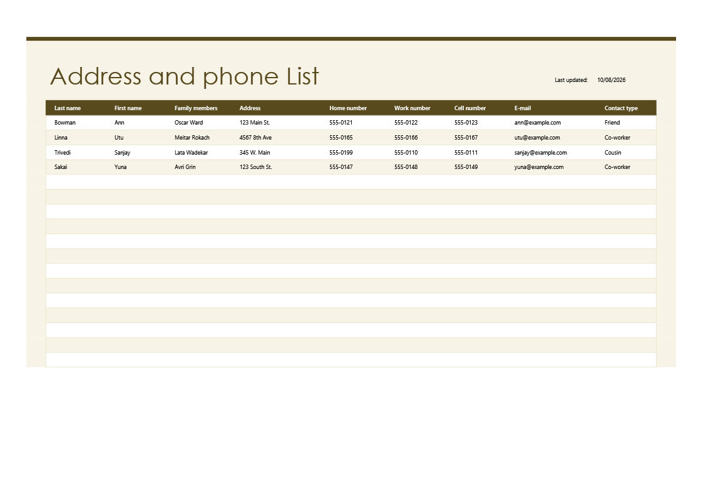 |  |  |

## back-to-school-planner

| Expected (Word) | Skia | ImageSharp |
| --- | --- | --- |
| **Page 1**&nbsp;&nbsp;&nbsp;&nbsp;&nbsp;&nbsp;&nbsp;&nbsp;&nbsp;&nbsp;&nbsp;&nbsp;&nbsp;&nbsp;&nbsp;&nbsp;&nbsp;&nbsp;&nbsp;&nbsp;&nbsp;&nbsp;&nbsp;&nbsp;&nbsp;&nbsp;&nbsp;&nbsp;&nbsp;&nbsp;&nbsp;&nbsp;&nbsp;&nbsp; | **Page 1. ErrorMetric: 0.3412 · SSIM: 0.6761** | **Page 1. ErrorMetric: 0.3578 · SSIM: 0.6687** |
| 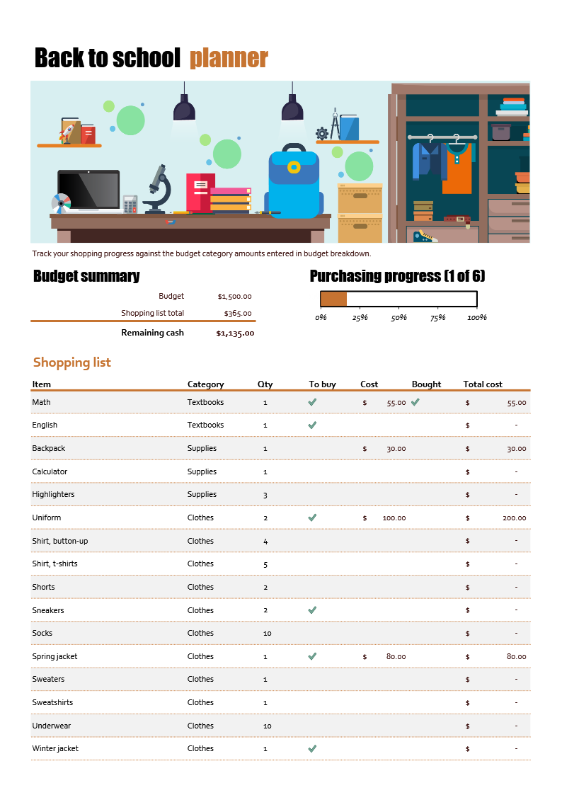 |  |  |
| **Page 2**&nbsp;&nbsp;&nbsp;&nbsp;&nbsp;&nbsp;&nbsp;&nbsp;&nbsp;&nbsp;&nbsp;&nbsp;&nbsp;&nbsp;&nbsp;&nbsp;&nbsp;&nbsp;&nbsp;&nbsp;&nbsp;&nbsp;&nbsp;&nbsp;&nbsp;&nbsp;&nbsp;&nbsp;&nbsp;&nbsp;&nbsp;&nbsp;&nbsp;&nbsp; | **Page 2. ErrorMetric: 0.0533 · SSIM: 0.9380** | **Page 2. ErrorMetric: 0.0535 · SSIM: 0.9377** |
| 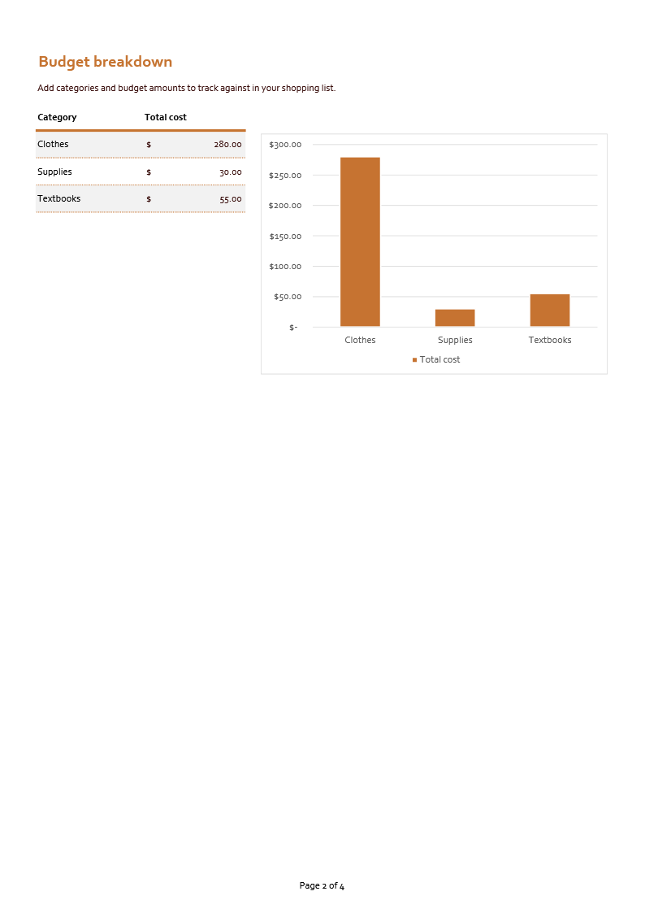 |  |  |

## basic-business-invoice

| Expected (Word) | Skia | ImageSharp |
| --- | --- | --- |
| **Page 1**&nbsp;&nbsp;&nbsp;&nbsp;&nbsp;&nbsp;&nbsp;&nbsp;&nbsp;&nbsp;&nbsp;&nbsp;&nbsp;&nbsp;&nbsp;&nbsp;&nbsp;&nbsp;&nbsp;&nbsp;&nbsp;&nbsp;&nbsp;&nbsp;&nbsp;&nbsp;&nbsp;&nbsp;&nbsp;&nbsp;&nbsp;&nbsp;&nbsp;&nbsp; | **Page 1. ErrorMetric: 0.4509 · SSIM: 0.8011** | **Page 1. ErrorMetric: 0.4557 · SSIM: 0.8013** |
| 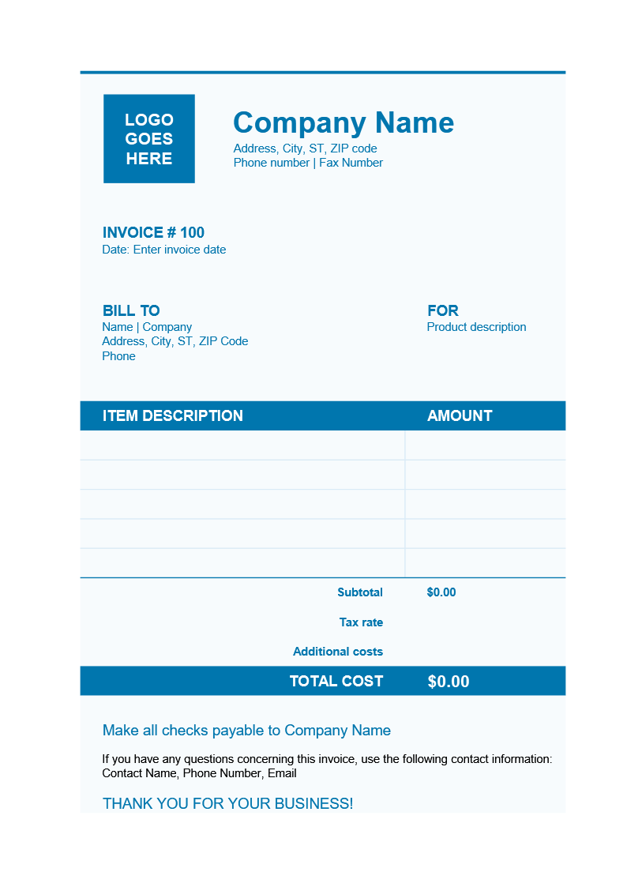 |  |  |
| **Page 2**&nbsp;&nbsp;&nbsp;&nbsp;&nbsp;&nbsp;&nbsp;&nbsp;&nbsp;&nbsp;&nbsp;&nbsp;&nbsp;&nbsp;&nbsp;&nbsp;&nbsp;&nbsp;&nbsp;&nbsp;&nbsp;&nbsp;&nbsp;&nbsp;&nbsp;&nbsp;&nbsp;&nbsp;&nbsp;&nbsp;&nbsp;&nbsp;&nbsp;&nbsp; | **Page 2. ErrorMetric: 0.0359 · SSIM: 0.9961** | **Page 2. ErrorMetric: 0.0359 · SSIM: 0.9961** |
|  |  |  |

## business-plan-checklist

| Expected (Word) | Skia | ImageSharp |
| --- | --- | --- |
| **Page 1**&nbsp;&nbsp;&nbsp;&nbsp;&nbsp;&nbsp;&nbsp;&nbsp;&nbsp;&nbsp;&nbsp;&nbsp;&nbsp;&nbsp;&nbsp;&nbsp;&nbsp;&nbsp;&nbsp;&nbsp;&nbsp;&nbsp;&nbsp;&nbsp;&nbsp;&nbsp;&nbsp;&nbsp;&nbsp;&nbsp;&nbsp;&nbsp;&nbsp;&nbsp; | **Page 1. ErrorMetric: 0.1056 · SSIM: 0.7934** | **Page 1. ErrorMetric: 0.1065 · SSIM: 0.7939** |
| 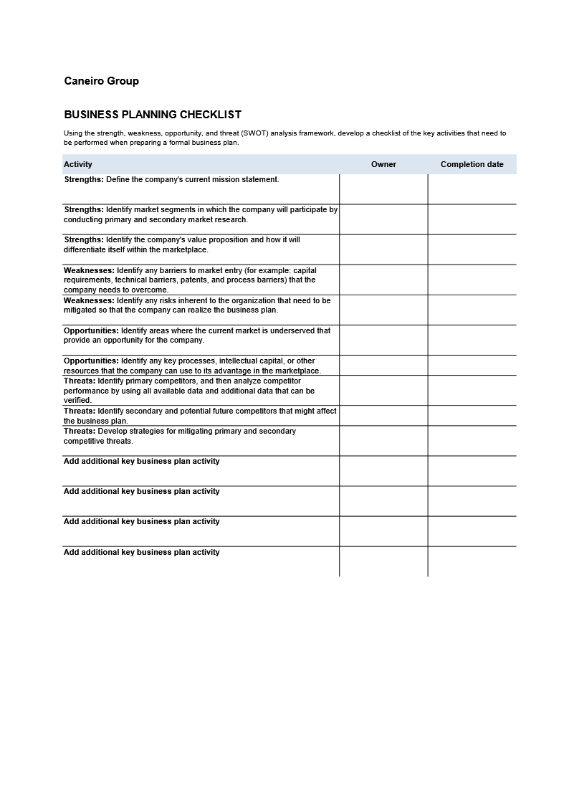 |  |  |

## check-register

| Expected (Word) | Skia | ImageSharp |
| --- | --- | --- |
| **Page 1**&nbsp;&nbsp;&nbsp;&nbsp;&nbsp;&nbsp;&nbsp;&nbsp;&nbsp;&nbsp;&nbsp;&nbsp;&nbsp;&nbsp;&nbsp;&nbsp;&nbsp;&nbsp;&nbsp;&nbsp;&nbsp;&nbsp;&nbsp;&nbsp;&nbsp;&nbsp;&nbsp;&nbsp;&nbsp;&nbsp;&nbsp;&nbsp;&nbsp;&nbsp; | **Page 1. ErrorMetric: 0.3642 · SSIM: 0.7846** | **Page 1. ErrorMetric: 0.3762 · SSIM: 0.7812** |
|  |  |  |

## construction-proposal

| Expected (Word) | Skia | ImageSharp |
| --- | --- | --- |
| **Page 1**&nbsp;&nbsp;&nbsp;&nbsp;&nbsp;&nbsp;&nbsp;&nbsp;&nbsp;&nbsp;&nbsp;&nbsp;&nbsp;&nbsp;&nbsp;&nbsp;&nbsp;&nbsp;&nbsp;&nbsp;&nbsp;&nbsp;&nbsp;&nbsp;&nbsp;&nbsp;&nbsp;&nbsp;&nbsp;&nbsp;&nbsp;&nbsp;&nbsp;&nbsp; | **Page 1. ErrorMetric: 0.3309 · SSIM: 0.7838** | **Page 1. ErrorMetric: 0.3366 · SSIM: 0.7816** |
| 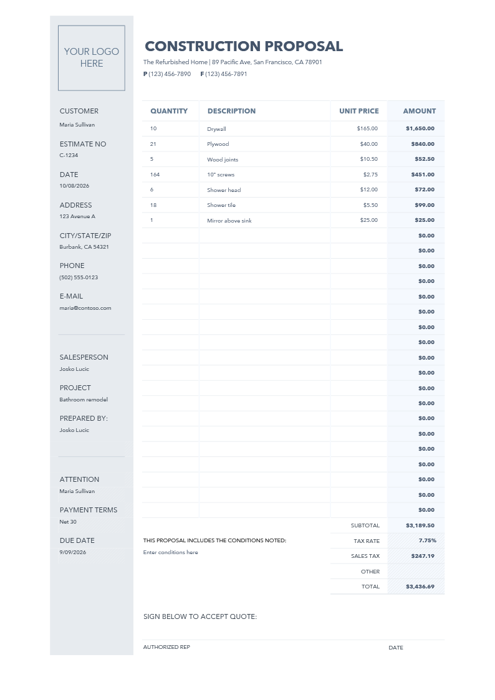 |  |  |

## home-contents-inventory-list

| Expected (Word) | Skia | ImageSharp |
| --- | --- | --- |
| **Page 1**&nbsp;&nbsp;&nbsp;&nbsp;&nbsp;&nbsp;&nbsp;&nbsp;&nbsp;&nbsp;&nbsp;&nbsp;&nbsp;&nbsp;&nbsp;&nbsp;&nbsp;&nbsp;&nbsp;&nbsp;&nbsp;&nbsp;&nbsp;&nbsp;&nbsp;&nbsp;&nbsp;&nbsp;&nbsp;&nbsp;&nbsp;&nbsp;&nbsp;&nbsp; | **Page 1. ErrorMetric: 0.4241 · SSIM: 0.8150** | **Page 1. ErrorMetric: 0.4228 · SSIM: 0.8109** |
| 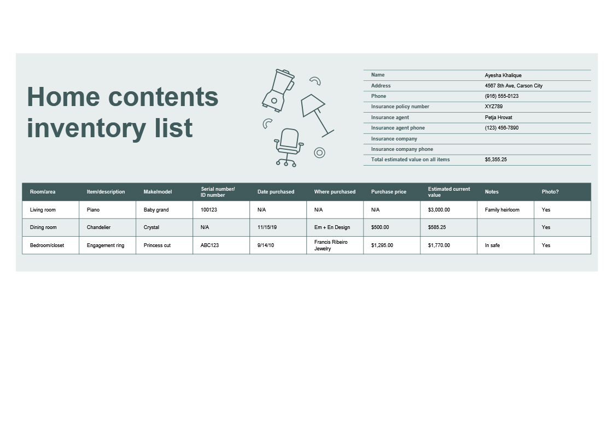 |  |  |

## household-organizer

| Expected (Word) | Skia | ImageSharp |
| --- | --- | --- |
| **Page 1**&nbsp;&nbsp;&nbsp;&nbsp;&nbsp;&nbsp;&nbsp;&nbsp;&nbsp;&nbsp;&nbsp;&nbsp;&nbsp;&nbsp;&nbsp;&nbsp;&nbsp;&nbsp;&nbsp;&nbsp;&nbsp;&nbsp;&nbsp;&nbsp;&nbsp;&nbsp;&nbsp;&nbsp;&nbsp;&nbsp;&nbsp;&nbsp;&nbsp;&nbsp; | **Page 1. ErrorMetric: 0.0342 · SSIM: 0.9051** | **Page 1. ErrorMetric: 0.0345 · SSIM: 0.9052** |
| 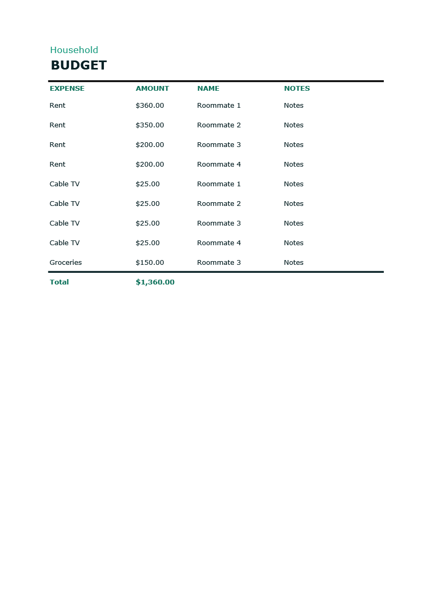 |  |  |
| **Page 2**&nbsp;&nbsp;&nbsp;&nbsp;&nbsp;&nbsp;&nbsp;&nbsp;&nbsp;&nbsp;&nbsp;&nbsp;&nbsp;&nbsp;&nbsp;&nbsp;&nbsp;&nbsp;&nbsp;&nbsp;&nbsp;&nbsp;&nbsp;&nbsp;&nbsp;&nbsp;&nbsp;&nbsp;&nbsp;&nbsp;&nbsp;&nbsp;&nbsp;&nbsp; | **Page 2. ErrorMetric: 0.0450 · SSIM: 0.9016** | **Page 2. ErrorMetric: 0.0450 · SSIM: 0.9003** |
| 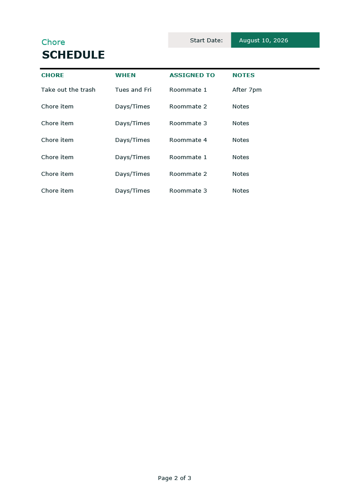 |  |  |

## inventory-list

| Expected (Word) | Skia | ImageSharp |
| --- | --- | --- |
| **Page 1**&nbsp;&nbsp;&nbsp;&nbsp;&nbsp;&nbsp;&nbsp;&nbsp;&nbsp;&nbsp;&nbsp;&nbsp;&nbsp;&nbsp;&nbsp;&nbsp;&nbsp;&nbsp;&nbsp;&nbsp;&nbsp;&nbsp;&nbsp;&nbsp;&nbsp;&nbsp;&nbsp;&nbsp;&nbsp;&nbsp;&nbsp;&nbsp;&nbsp;&nbsp; | **Page 1. ErrorMetric: 0.2858 · SSIM: 0.8832** | **Page 1. ErrorMetric: 0.2879 · SSIM: 0.8856** |
| 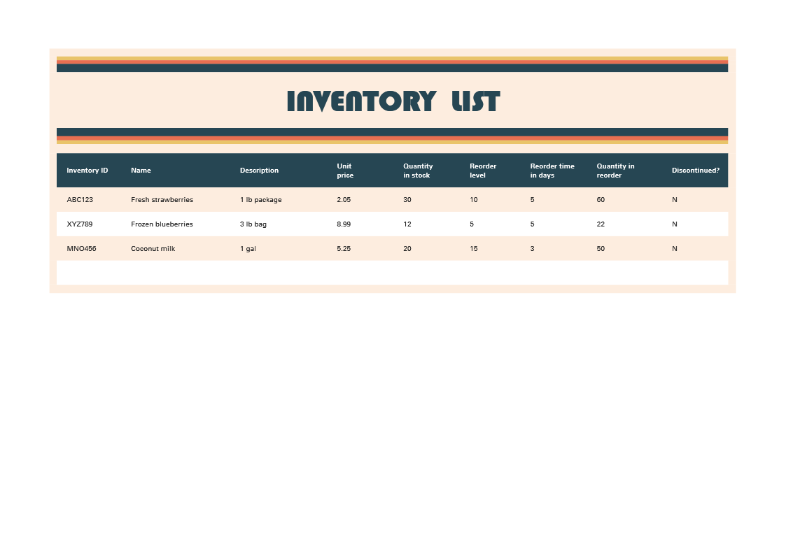 |  |  |

## inventory-list-accessibility-guide

| Expected (Word) | Skia | ImageSharp |
| --- | --- | --- |
| **Page 1**&nbsp;&nbsp;&nbsp;&nbsp;&nbsp;&nbsp;&nbsp;&nbsp;&nbsp;&nbsp;&nbsp;&nbsp;&nbsp;&nbsp;&nbsp;&nbsp;&nbsp;&nbsp;&nbsp;&nbsp;&nbsp;&nbsp;&nbsp;&nbsp;&nbsp;&nbsp;&nbsp;&nbsp;&nbsp;&nbsp;&nbsp;&nbsp;&nbsp;&nbsp; | **Page 1. ErrorMetric: 0.4146 · SSIM: 0.7967** | **Page 1. ErrorMetric: 0.4195 · SSIM: 0.7971** |
| 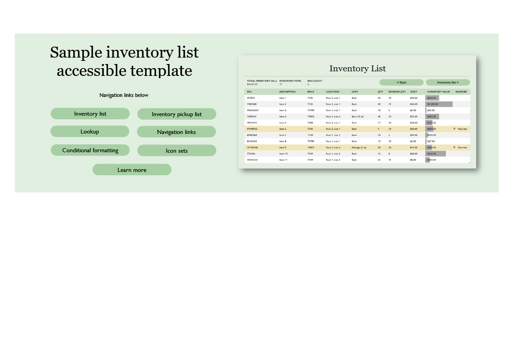 |  |  |
| **Page 2**&nbsp;&nbsp;&nbsp;&nbsp;&nbsp;&nbsp;&nbsp;&nbsp;&nbsp;&nbsp;&nbsp;&nbsp;&nbsp;&nbsp;&nbsp;&nbsp;&nbsp;&nbsp;&nbsp;&nbsp;&nbsp;&nbsp;&nbsp;&nbsp;&nbsp;&nbsp;&nbsp;&nbsp;&nbsp;&nbsp;&nbsp;&nbsp;&nbsp;&nbsp; | **Page 2. ErrorMetric: 0.4407 · SSIM: 0.7982** | **Page 2. ErrorMetric: 0.4410 · SSIM: 0.7990** |
| 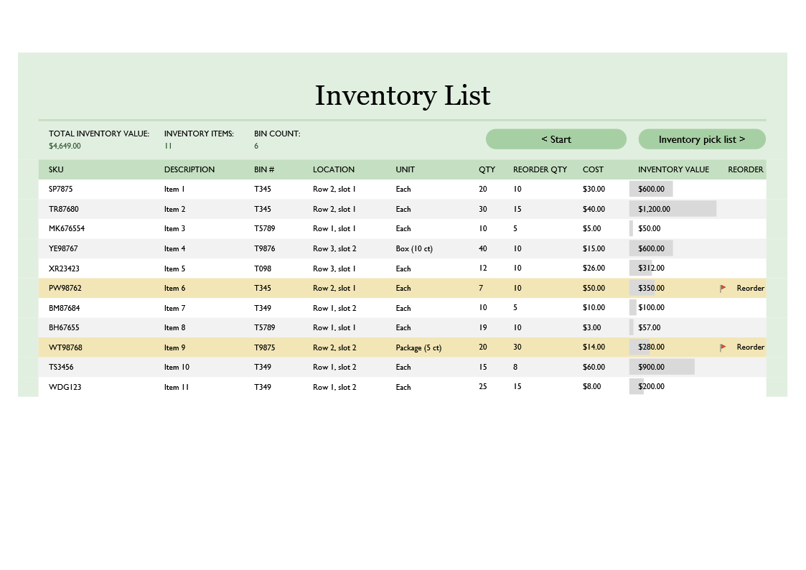 |  |  |

## inventory-list-with-highlighting

| Expected (Word) | Skia | ImageSharp |
| --- | --- | --- |
| **Page 1**&nbsp;&nbsp;&nbsp;&nbsp;&nbsp;&nbsp;&nbsp;&nbsp;&nbsp;&nbsp;&nbsp;&nbsp;&nbsp;&nbsp;&nbsp;&nbsp;&nbsp;&nbsp;&nbsp;&nbsp;&nbsp;&nbsp;&nbsp;&nbsp;&nbsp;&nbsp;&nbsp;&nbsp;&nbsp;&nbsp;&nbsp;&nbsp;&nbsp;&nbsp; | **Page 1. ErrorMetric: 0.7481 · SSIM: 0.8247** | **Page 1. ErrorMetric: 0.7505 · SSIM: 0.8227** |
| 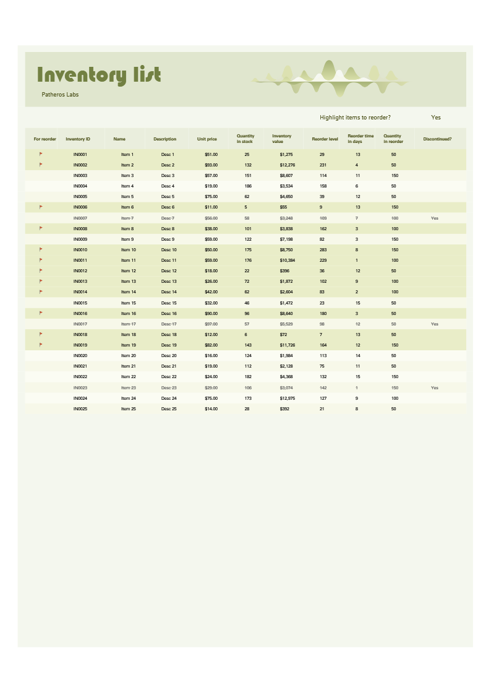 |  |  |
| **Page 2**&nbsp;&nbsp;&nbsp;&nbsp;&nbsp;&nbsp;&nbsp;&nbsp;&nbsp;&nbsp;&nbsp;&nbsp;&nbsp;&nbsp;&nbsp;&nbsp;&nbsp;&nbsp;&nbsp;&nbsp;&nbsp;&nbsp;&nbsp;&nbsp;&nbsp;&nbsp;&nbsp;&nbsp;&nbsp;&nbsp;&nbsp;&nbsp;&nbsp;&nbsp; | **Page 2. ErrorMetric: 0.7507 · SSIM: 0.9633** | **Page 2. ErrorMetric: 0.7534 · SSIM: 0.9615** |
| 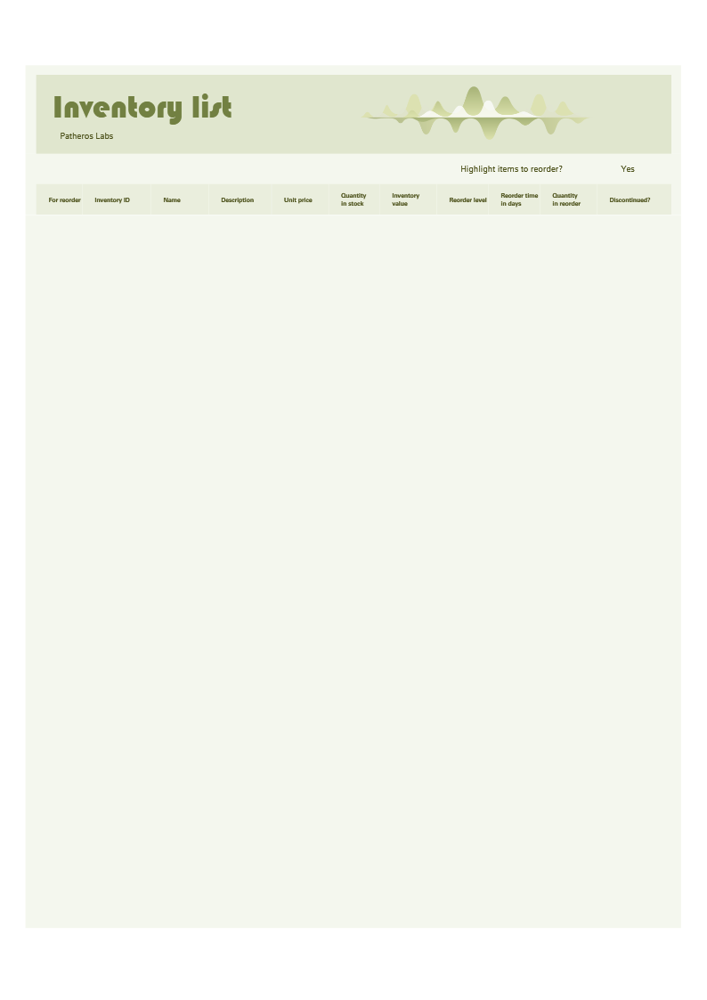 |  |  |

## invoice-accessibility-guide

| Expected (Word) | Skia | ImageSharp |
| --- | --- | --- |
| **Page 1**&nbsp;&nbsp;&nbsp;&nbsp;&nbsp;&nbsp;&nbsp;&nbsp;&nbsp;&nbsp;&nbsp;&nbsp;&nbsp;&nbsp;&nbsp;&nbsp;&nbsp;&nbsp;&nbsp;&nbsp;&nbsp;&nbsp;&nbsp;&nbsp;&nbsp;&nbsp;&nbsp;&nbsp;&nbsp;&nbsp;&nbsp;&nbsp;&nbsp;&nbsp; | **Page 1. ErrorMetric: 0.1985 · SSIM: 0.7894** | **Page 1. ErrorMetric: 0.2056 · SSIM: 0.7905** |
|  |  |  |
| **Page 2**&nbsp;&nbsp;&nbsp;&nbsp;&nbsp;&nbsp;&nbsp;&nbsp;&nbsp;&nbsp;&nbsp;&nbsp;&nbsp;&nbsp;&nbsp;&nbsp;&nbsp;&nbsp;&nbsp;&nbsp;&nbsp;&nbsp;&nbsp;&nbsp;&nbsp;&nbsp;&nbsp;&nbsp;&nbsp;&nbsp;&nbsp;&nbsp;&nbsp;&nbsp; | **Page 2. ErrorMetric: 0.1251 · SSIM: 0.9365** | **Page 2. ErrorMetric: 0.1251 · SSIM: 0.9365** |
| 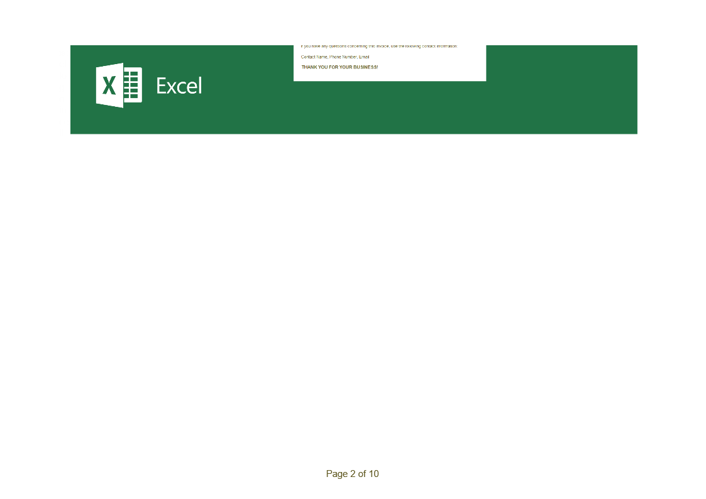 |  |  |

## invoice-worksheet

| Expected (Word) | Skia | ImageSharp |
| --- | --- | --- |
| **Page 1**&nbsp;&nbsp;&nbsp;&nbsp;&nbsp;&nbsp;&nbsp;&nbsp;&nbsp;&nbsp;&nbsp;&nbsp;&nbsp;&nbsp;&nbsp;&nbsp;&nbsp;&nbsp;&nbsp;&nbsp;&nbsp;&nbsp;&nbsp;&nbsp;&nbsp;&nbsp;&nbsp;&nbsp;&nbsp;&nbsp;&nbsp;&nbsp;&nbsp;&nbsp; | **Page 1. ErrorMetric: 0.0706 · SSIM: 0.8604** | **Page 1. ErrorMetric: 0.0734 · SSIM: 0.8591** |
| 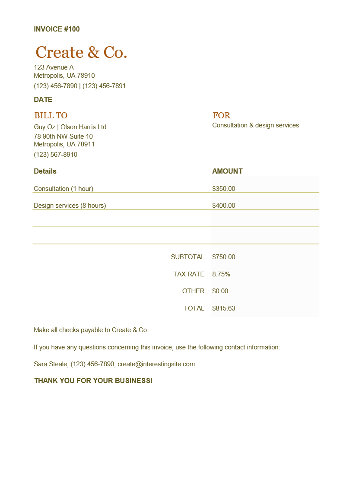 |  |  |

## modern-basic-black-yellow-standard

| Expected (Word) | Skia | ImageSharp |
| --- | --- | --- |
| **Page 1**&nbsp;&nbsp;&nbsp;&nbsp;&nbsp;&nbsp;&nbsp;&nbsp;&nbsp;&nbsp;&nbsp;&nbsp;&nbsp;&nbsp;&nbsp;&nbsp;&nbsp;&nbsp;&nbsp;&nbsp;&nbsp;&nbsp;&nbsp;&nbsp;&nbsp;&nbsp;&nbsp;&nbsp;&nbsp;&nbsp;&nbsp;&nbsp;&nbsp;&nbsp; | **Page 1. ErrorMetric: 0.1931 · SSIM: 0.7414** | **Page 1. ErrorMetric: 0.1985 · SSIM: 0.7278** |
| 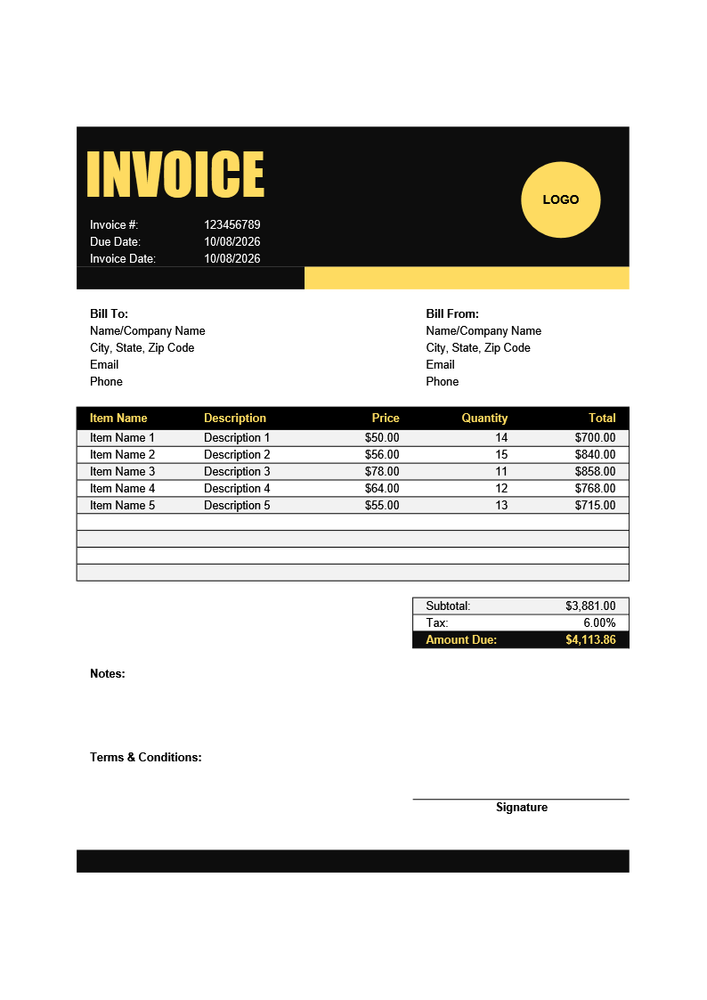 |  |  |

## modern-basic-purple-timesheet-invoice

| Expected (Word) | Skia | ImageSharp |
| --- | --- | --- |
| **Page 1**&nbsp;&nbsp;&nbsp;&nbsp;&nbsp;&nbsp;&nbsp;&nbsp;&nbsp;&nbsp;&nbsp;&nbsp;&nbsp;&nbsp;&nbsp;&nbsp;&nbsp;&nbsp;&nbsp;&nbsp;&nbsp;&nbsp;&nbsp;&nbsp;&nbsp;&nbsp;&nbsp;&nbsp;&nbsp;&nbsp;&nbsp;&nbsp;&nbsp;&nbsp; | **Page 1. ErrorMetric: 0.5394 · SSIM: 0.7926** | **Page 1. ErrorMetric: 0.5467 · SSIM: 0.7592** |
| 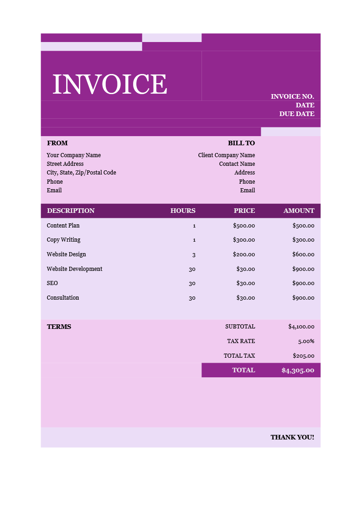 |  |  |

## modern-corporate-blue-timesheet-invoice

| Expected (Word) | Skia | ImageSharp |
| --- | --- | --- |
| **Page 1**&nbsp;&nbsp;&nbsp;&nbsp;&nbsp;&nbsp;&nbsp;&nbsp;&nbsp;&nbsp;&nbsp;&nbsp;&nbsp;&nbsp;&nbsp;&nbsp;&nbsp;&nbsp;&nbsp;&nbsp;&nbsp;&nbsp;&nbsp;&nbsp;&nbsp;&nbsp;&nbsp;&nbsp;&nbsp;&nbsp;&nbsp;&nbsp;&nbsp;&nbsp; | **Page 1. ErrorMetric: 0.3615 · SSIM: 0.8565** | **Page 1. ErrorMetric: 0.3732 · SSIM: 0.8352** |
| 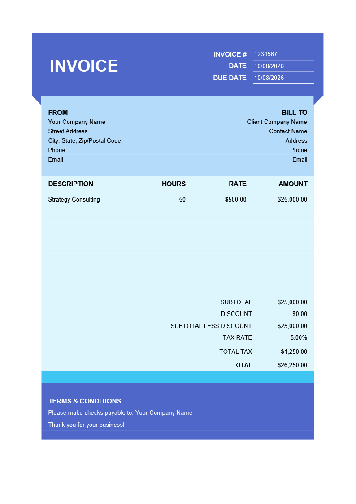 |  |  |

## modern-corporate-green-standard-invoice

| Expected (Word) | Skia | ImageSharp |
| --- | --- | --- |
| **Page 1**&nbsp;&nbsp;&nbsp;&nbsp;&nbsp;&nbsp;&nbsp;&nbsp;&nbsp;&nbsp;&nbsp;&nbsp;&nbsp;&nbsp;&nbsp;&nbsp;&nbsp;&nbsp;&nbsp;&nbsp;&nbsp;&nbsp;&nbsp;&nbsp;&nbsp;&nbsp;&nbsp;&nbsp;&nbsp;&nbsp;&nbsp;&nbsp;&nbsp;&nbsp; | **Page 1. ErrorMetric: 0.3397 · SSIM: 0.8210** | **Page 1. ErrorMetric: 0.3411 · SSIM: 0.8131** |
| 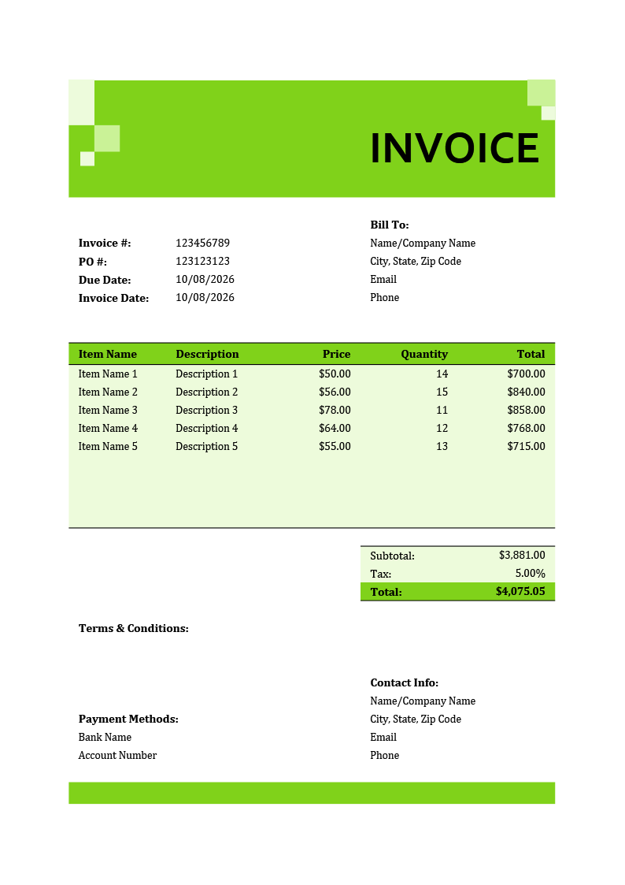 |  |  |

## modern-corporate-purple-black-timesheet

| Expected (Word) | Skia | ImageSharp |
| --- | --- | --- |
| **Page 1**&nbsp;&nbsp;&nbsp;&nbsp;&nbsp;&nbsp;&nbsp;&nbsp;&nbsp;&nbsp;&nbsp;&nbsp;&nbsp;&nbsp;&nbsp;&nbsp;&nbsp;&nbsp;&nbsp;&nbsp;&nbsp;&nbsp;&nbsp;&nbsp;&nbsp;&nbsp;&nbsp;&nbsp;&nbsp;&nbsp;&nbsp;&nbsp;&nbsp;&nbsp; | **Page 1. ErrorMetric: 0.2167 · SSIM: 0.8319** | **Page 1. ErrorMetric: 0.2185 · SSIM: 0.8260** |
| 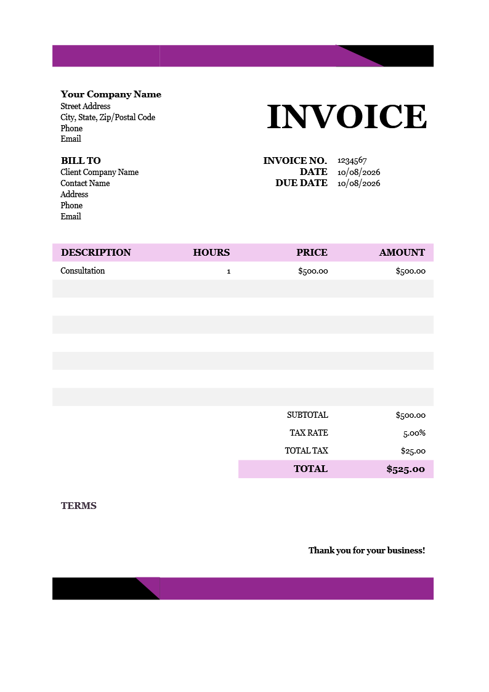 |  |  |

## org-charts-visual

| Expected (Word) | Skia | ImageSharp |
| --- | --- | --- |
| **Page 1**&nbsp;&nbsp;&nbsp;&nbsp;&nbsp;&nbsp;&nbsp;&nbsp;&nbsp;&nbsp;&nbsp;&nbsp;&nbsp;&nbsp;&nbsp;&nbsp;&nbsp;&nbsp;&nbsp;&nbsp;&nbsp;&nbsp;&nbsp;&nbsp;&nbsp;&nbsp;&nbsp;&nbsp;&nbsp;&nbsp;&nbsp;&nbsp;&nbsp;&nbsp; | **Page 1. ErrorMetric: 0.0335 · SSIM: 0.9732** | **Page 1. ErrorMetric: 0.0401 · SSIM: 0.9725** |
| 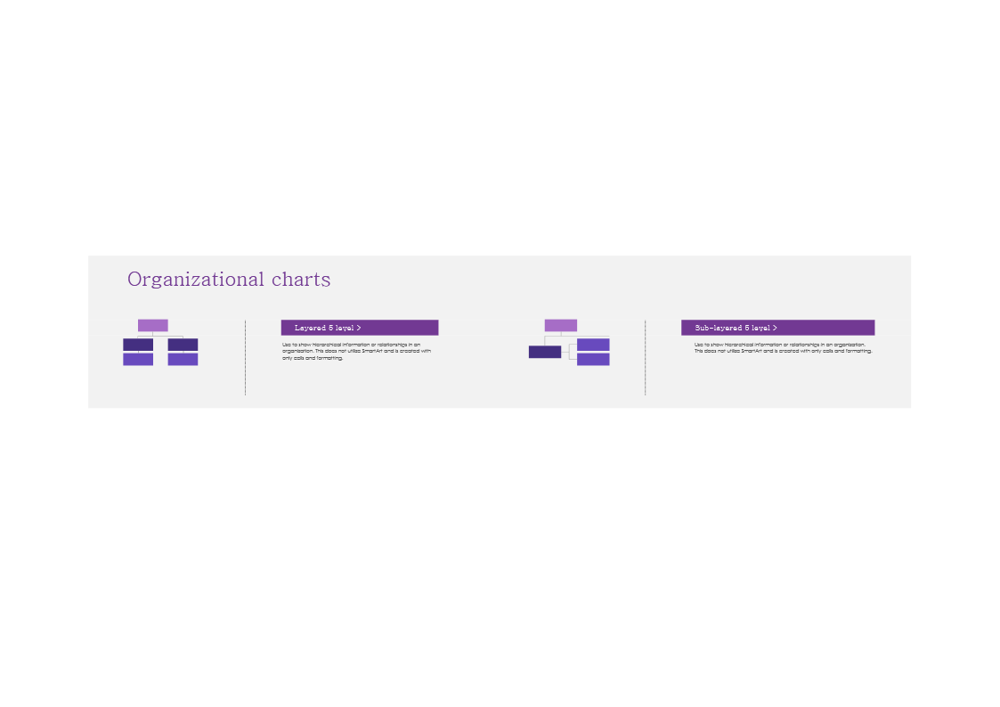 |  |  |
| **Page 2**&nbsp;&nbsp;&nbsp;&nbsp;&nbsp;&nbsp;&nbsp;&nbsp;&nbsp;&nbsp;&nbsp;&nbsp;&nbsp;&nbsp;&nbsp;&nbsp;&nbsp;&nbsp;&nbsp;&nbsp;&nbsp;&nbsp;&nbsp;&nbsp;&nbsp;&nbsp;&nbsp;&nbsp;&nbsp;&nbsp;&nbsp;&nbsp;&nbsp;&nbsp; | **Page 2. ErrorMetric: 0.1450 · SSIM: 0.9208** | **Page 2. ErrorMetric: 0.1507 · SSIM: 0.9187** |
|  |  |  |

## personal-budget

| Expected (Word) | Skia | ImageSharp |
| --- | --- | --- |
| **Page 1**&nbsp;&nbsp;&nbsp;&nbsp;&nbsp;&nbsp;&nbsp;&nbsp;&nbsp;&nbsp;&nbsp;&nbsp;&nbsp;&nbsp;&nbsp;&nbsp;&nbsp;&nbsp;&nbsp;&nbsp;&nbsp;&nbsp;&nbsp;&nbsp;&nbsp;&nbsp;&nbsp;&nbsp;&nbsp;&nbsp;&nbsp;&nbsp;&nbsp;&nbsp; | **Page 1. ErrorMetric: 0.0994 · SSIM: 0.9148** | **Page 1. ErrorMetric: 0.0995 · SSIM: 0.9151** |
|  |  |  |
| **Page 2**&nbsp;&nbsp;&nbsp;&nbsp;&nbsp;&nbsp;&nbsp;&nbsp;&nbsp;&nbsp;&nbsp;&nbsp;&nbsp;&nbsp;&nbsp;&nbsp;&nbsp;&nbsp;&nbsp;&nbsp;&nbsp;&nbsp;&nbsp;&nbsp;&nbsp;&nbsp;&nbsp;&nbsp;&nbsp;&nbsp;&nbsp;&nbsp;&nbsp;&nbsp; | **Page 2. ErrorMetric: 0.0322 · SSIM: 0.9652** | **Page 2. ErrorMetric: 0.0324 · SSIM: 0.9644** |
|  |  |  |

## probate-inventory

| Expected (Word) | Skia | ImageSharp |
| --- | --- | --- |
| **Page 1**&nbsp;&nbsp;&nbsp;&nbsp;&nbsp;&nbsp;&nbsp;&nbsp;&nbsp;&nbsp;&nbsp;&nbsp;&nbsp;&nbsp;&nbsp;&nbsp;&nbsp;&nbsp;&nbsp;&nbsp;&nbsp;&nbsp;&nbsp;&nbsp;&nbsp;&nbsp;&nbsp;&nbsp;&nbsp;&nbsp;&nbsp;&nbsp;&nbsp;&nbsp; | **Page 1. ErrorMetric: 0.0793 · SSIM: 0.8654** | **Page 1. ErrorMetric: 0.0764 · SSIM: 0.8623** |
| 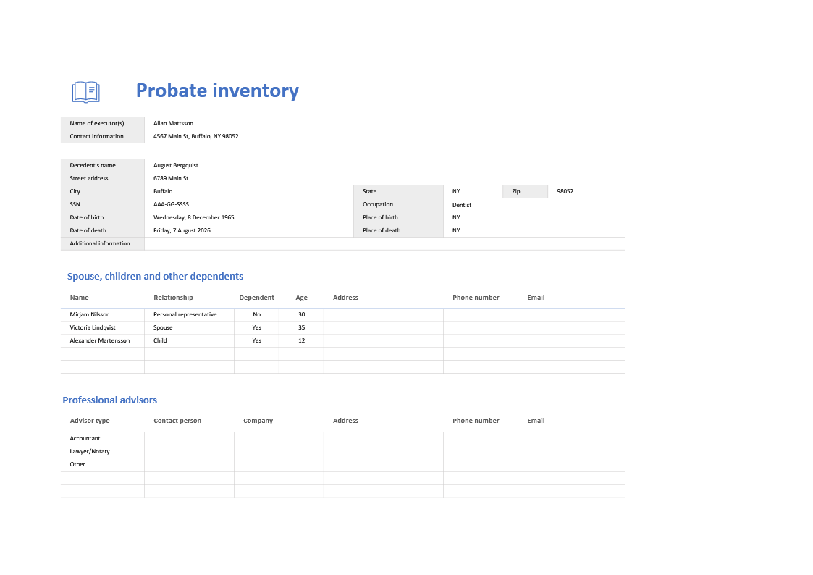 |  |  |
| **Page 2**&nbsp;&nbsp;&nbsp;&nbsp;&nbsp;&nbsp;&nbsp;&nbsp;&nbsp;&nbsp;&nbsp;&nbsp;&nbsp;&nbsp;&nbsp;&nbsp;&nbsp;&nbsp;&nbsp;&nbsp;&nbsp;&nbsp;&nbsp;&nbsp;&nbsp;&nbsp;&nbsp;&nbsp;&nbsp;&nbsp;&nbsp;&nbsp;&nbsp;&nbsp; | **Page 2. ErrorMetric: 0.0424 · SSIM: 0.9422** | **Page 2. ErrorMetric: 0.0406 · SSIM: 0.9399** |
| 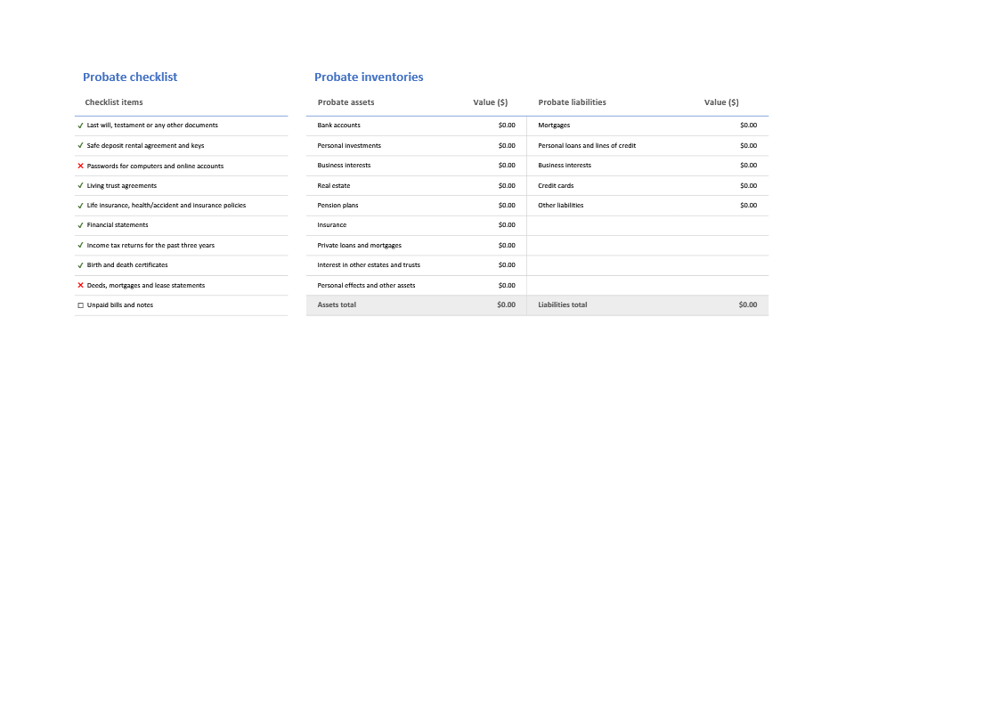 |  |  |

## simple-basic-blue-standard-invoice

| Expected (Word) | Skia | ImageSharp |
| --- | --- | --- |
| **Page 1**&nbsp;&nbsp;&nbsp;&nbsp;&nbsp;&nbsp;&nbsp;&nbsp;&nbsp;&nbsp;&nbsp;&nbsp;&nbsp;&nbsp;&nbsp;&nbsp;&nbsp;&nbsp;&nbsp;&nbsp;&nbsp;&nbsp;&nbsp;&nbsp;&nbsp;&nbsp;&nbsp;&nbsp;&nbsp;&nbsp;&nbsp;&nbsp;&nbsp;&nbsp; | **Page 1. ErrorMetric: 0.3908 · SSIM: 0.7715** | **Page 1. ErrorMetric: 0.3923 · SSIM: 0.7633** |
| 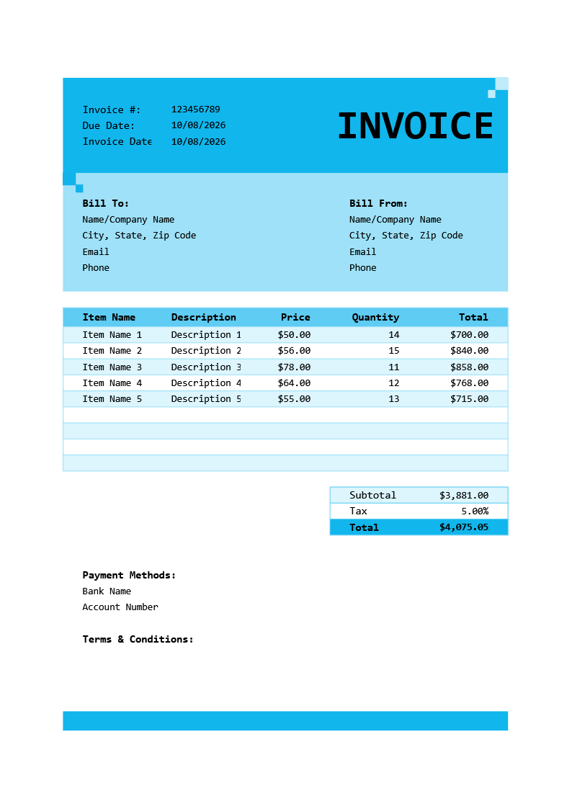 |  |  |

## simple-basic-pink-blue-timesheet

| Expected (Word) | Skia | ImageSharp |
| --- | --- | --- |
| **Page 1**&nbsp;&nbsp;&nbsp;&nbsp;&nbsp;&nbsp;&nbsp;&nbsp;&nbsp;&nbsp;&nbsp;&nbsp;&nbsp;&nbsp;&nbsp;&nbsp;&nbsp;&nbsp;&nbsp;&nbsp;&nbsp;&nbsp;&nbsp;&nbsp;&nbsp;&nbsp;&nbsp;&nbsp;&nbsp;&nbsp;&nbsp;&nbsp;&nbsp;&nbsp; | **Page 1. ErrorMetric: 0.4444 · SSIM: 0.7757** | **Page 1. ErrorMetric: 0.4584 · SSIM: 0.7582** |
| 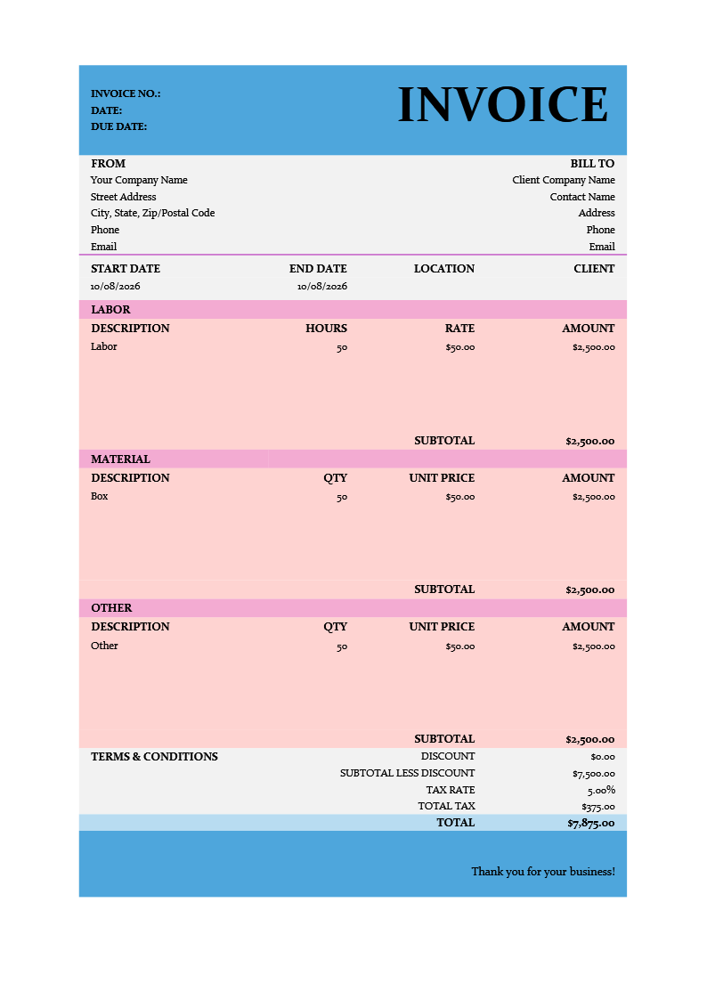 |  |  |

## simple-black-purple-commercial-invoice

| Expected (Word) | Skia | ImageSharp |
| --- | --- | --- |
| **Page 1**&nbsp;&nbsp;&nbsp;&nbsp;&nbsp;&nbsp;&nbsp;&nbsp;&nbsp;&nbsp;&nbsp;&nbsp;&nbsp;&nbsp;&nbsp;&nbsp;&nbsp;&nbsp;&nbsp;&nbsp;&nbsp;&nbsp;&nbsp;&nbsp;&nbsp;&nbsp;&nbsp;&nbsp;&nbsp;&nbsp;&nbsp;&nbsp;&nbsp;&nbsp; | **Page 1. ErrorMetric: 0.1720 · SSIM: 0.7810** | **Page 1. ErrorMetric: 0.1754 · SSIM: 0.7670** |
| 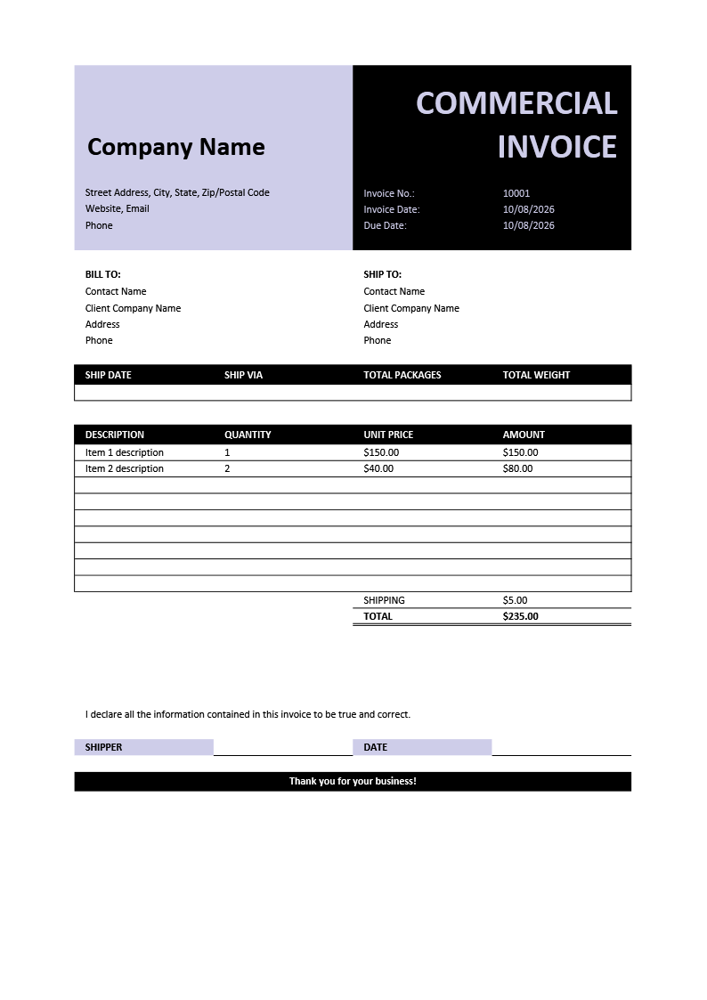 |  |  |

## simple-blue-timesheet-invoice

| Expected (Word) | Skia | ImageSharp |
| --- | --- | --- |
| **Page 1**&nbsp;&nbsp;&nbsp;&nbsp;&nbsp;&nbsp;&nbsp;&nbsp;&nbsp;&nbsp;&nbsp;&nbsp;&nbsp;&nbsp;&nbsp;&nbsp;&nbsp;&nbsp;&nbsp;&nbsp;&nbsp;&nbsp;&nbsp;&nbsp;&nbsp;&nbsp;&nbsp;&nbsp;&nbsp;&nbsp;&nbsp;&nbsp;&nbsp;&nbsp; | **Page 1. ErrorMetric: 0.2419 · SSIM: 0.7230** | **Page 1. ErrorMetric: 0.2461 · SSIM: 0.7056** |
| 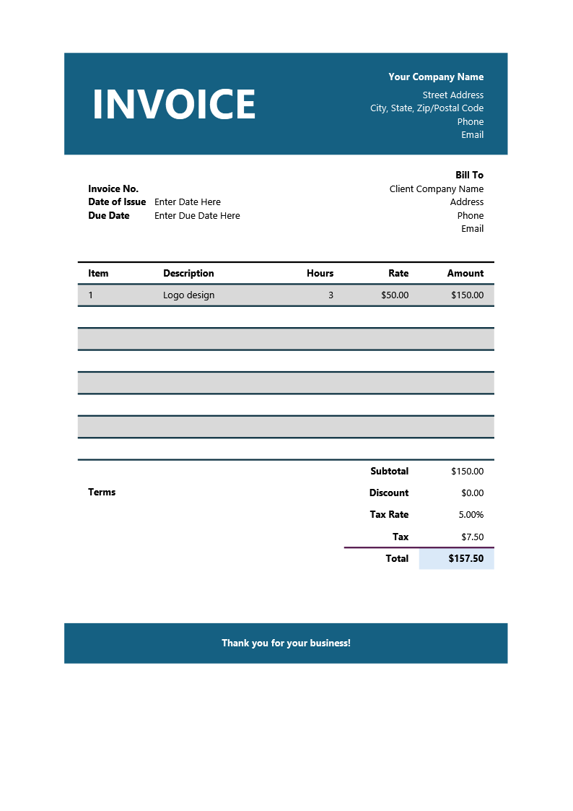 |  |  |

## simple-corporate-green-yellow-standard

| Expected (Word) | Skia | ImageSharp |
| --- | --- | --- |
| **Page 1**&nbsp;&nbsp;&nbsp;&nbsp;&nbsp;&nbsp;&nbsp;&nbsp;&nbsp;&nbsp;&nbsp;&nbsp;&nbsp;&nbsp;&nbsp;&nbsp;&nbsp;&nbsp;&nbsp;&nbsp;&nbsp;&nbsp;&nbsp;&nbsp;&nbsp;&nbsp;&nbsp;&nbsp;&nbsp;&nbsp;&nbsp;&nbsp;&nbsp;&nbsp; | **Page 1. ErrorMetric: 0.1674 · SSIM: 0.8092** | **Page 1. ErrorMetric: 0.1711 · SSIM: 0.8079** |
| 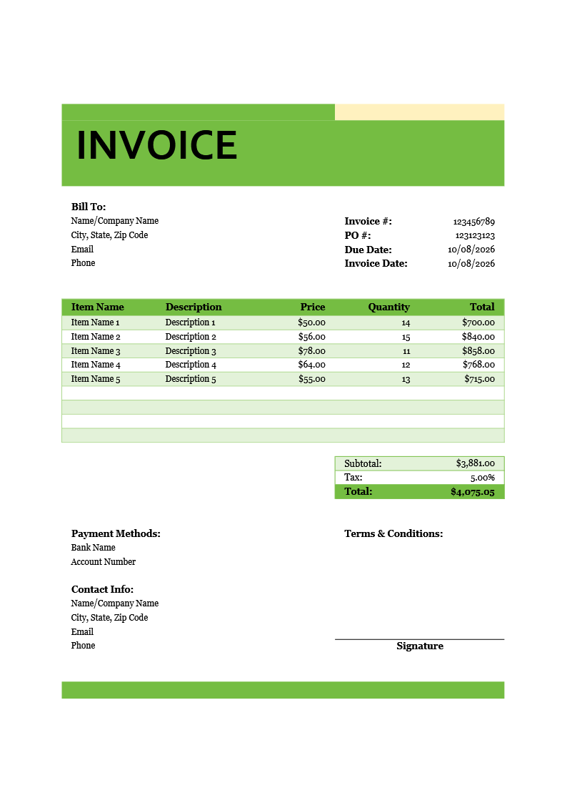 |  |  |

## simple-corporate-purple-standard-invoice

| Expected (Word) | Skia | ImageSharp |
| --- | --- | --- |
| **Page 1**&nbsp;&nbsp;&nbsp;&nbsp;&nbsp;&nbsp;&nbsp;&nbsp;&nbsp;&nbsp;&nbsp;&nbsp;&nbsp;&nbsp;&nbsp;&nbsp;&nbsp;&nbsp;&nbsp;&nbsp;&nbsp;&nbsp;&nbsp;&nbsp;&nbsp;&nbsp;&nbsp;&nbsp;&nbsp;&nbsp;&nbsp;&nbsp;&nbsp;&nbsp; | **Page 1. ErrorMetric: 0.1625 · SSIM: 0.8134** | **Page 1. ErrorMetric: 0.1677 · SSIM: 0.8026** |
| 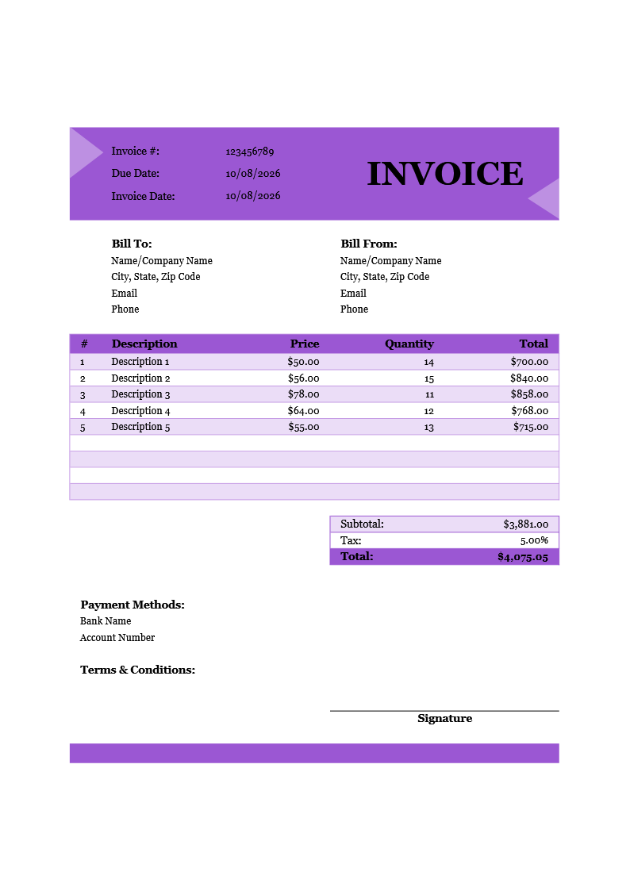 |  |  |

## simple-corporate-yellow-standard-invoice

| Expected (Word) | Skia | ImageSharp |
| --- | --- | --- |
| **Page 1**&nbsp;&nbsp;&nbsp;&nbsp;&nbsp;&nbsp;&nbsp;&nbsp;&nbsp;&nbsp;&nbsp;&nbsp;&nbsp;&nbsp;&nbsp;&nbsp;&nbsp;&nbsp;&nbsp;&nbsp;&nbsp;&nbsp;&nbsp;&nbsp;&nbsp;&nbsp;&nbsp;&nbsp;&nbsp;&nbsp;&nbsp;&nbsp;&nbsp;&nbsp; | **Page 1. ErrorMetric: 0.2758 · SSIM: 0.8485** | **Page 1. ErrorMetric: 0.2911 · SSIM: 0.8425** |
| 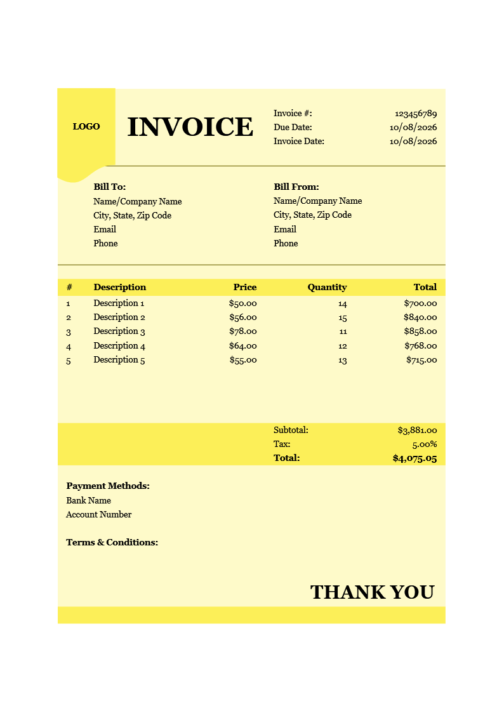 |  |  |

## simple-green-black-timesheet-invoice

| Expected (Word) | Skia | ImageSharp |
| --- | --- | --- |
| **Page 1**&nbsp;&nbsp;&nbsp;&nbsp;&nbsp;&nbsp;&nbsp;&nbsp;&nbsp;&nbsp;&nbsp;&nbsp;&nbsp;&nbsp;&nbsp;&nbsp;&nbsp;&nbsp;&nbsp;&nbsp;&nbsp;&nbsp;&nbsp;&nbsp;&nbsp;&nbsp;&nbsp;&nbsp;&nbsp;&nbsp;&nbsp;&nbsp;&nbsp;&nbsp; | **Page 1. ErrorMetric: 0.2007 · SSIM: 0.7608** | **Page 1. ErrorMetric: 0.2054 · SSIM: 0.7510** |
| 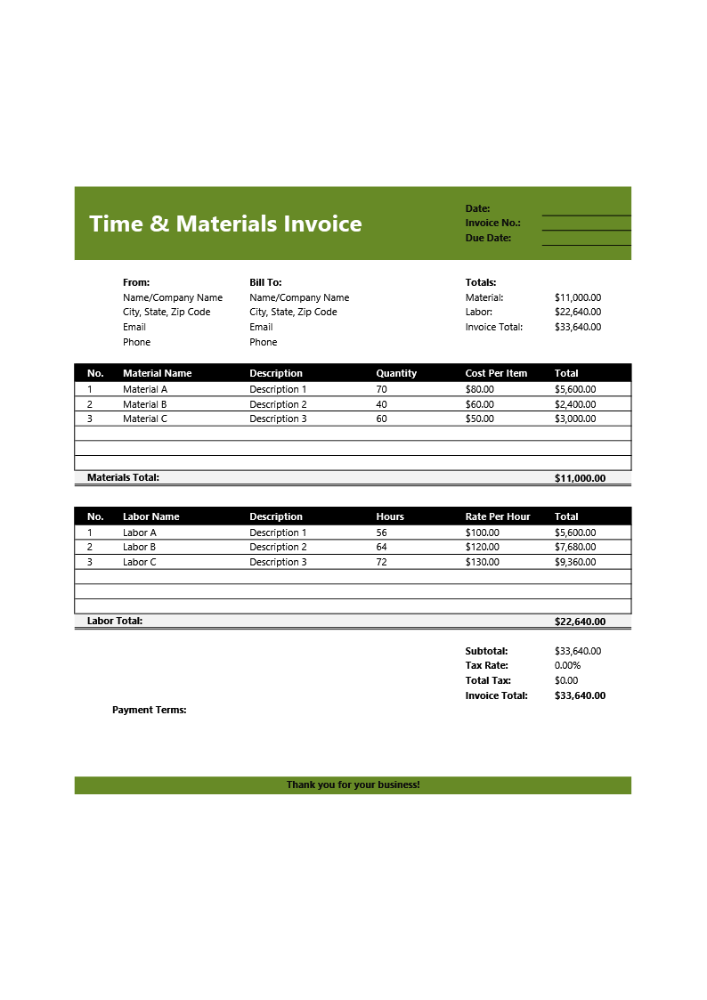 |  |  |

## simple-green-debit-note

| Expected (Word) | Skia | ImageSharp |
| --- | --- | --- |
| **Page 1**&nbsp;&nbsp;&nbsp;&nbsp;&nbsp;&nbsp;&nbsp;&nbsp;&nbsp;&nbsp;&nbsp;&nbsp;&nbsp;&nbsp;&nbsp;&nbsp;&nbsp;&nbsp;&nbsp;&nbsp;&nbsp;&nbsp;&nbsp;&nbsp;&nbsp;&nbsp;&nbsp;&nbsp;&nbsp;&nbsp;&nbsp;&nbsp;&nbsp;&nbsp; | **Page 1. ErrorMetric: 0.1908 · SSIM: 0.8452** | **Page 1. ErrorMetric: 0.1923 · SSIM: 0.8446** |
| 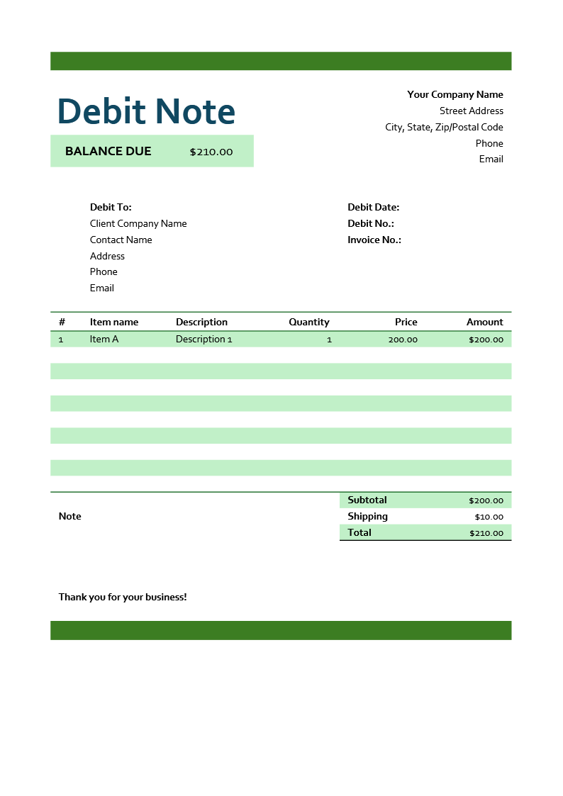 |  |  |

## simple-list

| Expected (Word) | Skia | ImageSharp |
| --- | --- | --- |
| **Page 1**&nbsp;&nbsp;&nbsp;&nbsp;&nbsp;&nbsp;&nbsp;&nbsp;&nbsp;&nbsp;&nbsp;&nbsp;&nbsp;&nbsp;&nbsp;&nbsp;&nbsp;&nbsp;&nbsp;&nbsp;&nbsp;&nbsp;&nbsp;&nbsp;&nbsp;&nbsp;&nbsp;&nbsp;&nbsp;&nbsp;&nbsp;&nbsp;&nbsp;&nbsp; | **Page 1. ErrorMetric: 0.0428 · SSIM: 0.9256** | **Page 1. ErrorMetric: 0.0428 · SSIM: 0.9256** |
| 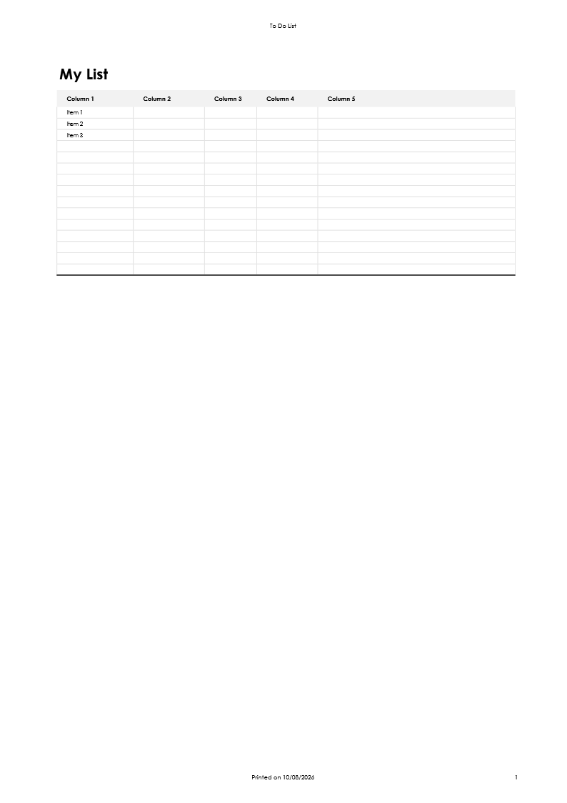 |  |  |
| **Page 2**&nbsp;&nbsp;&nbsp;&nbsp;&nbsp;&nbsp;&nbsp;&nbsp;&nbsp;&nbsp;&nbsp;&nbsp;&nbsp;&nbsp;&nbsp;&nbsp;&nbsp;&nbsp;&nbsp;&nbsp;&nbsp;&nbsp;&nbsp;&nbsp;&nbsp;&nbsp;&nbsp;&nbsp;&nbsp;&nbsp;&nbsp;&nbsp;&nbsp;&nbsp; | **Page 2. ErrorMetric: 0.1168 · SSIM: 0.8350** | **Page 2. ErrorMetric: 0.1171 · SSIM: 0.8335** |
| 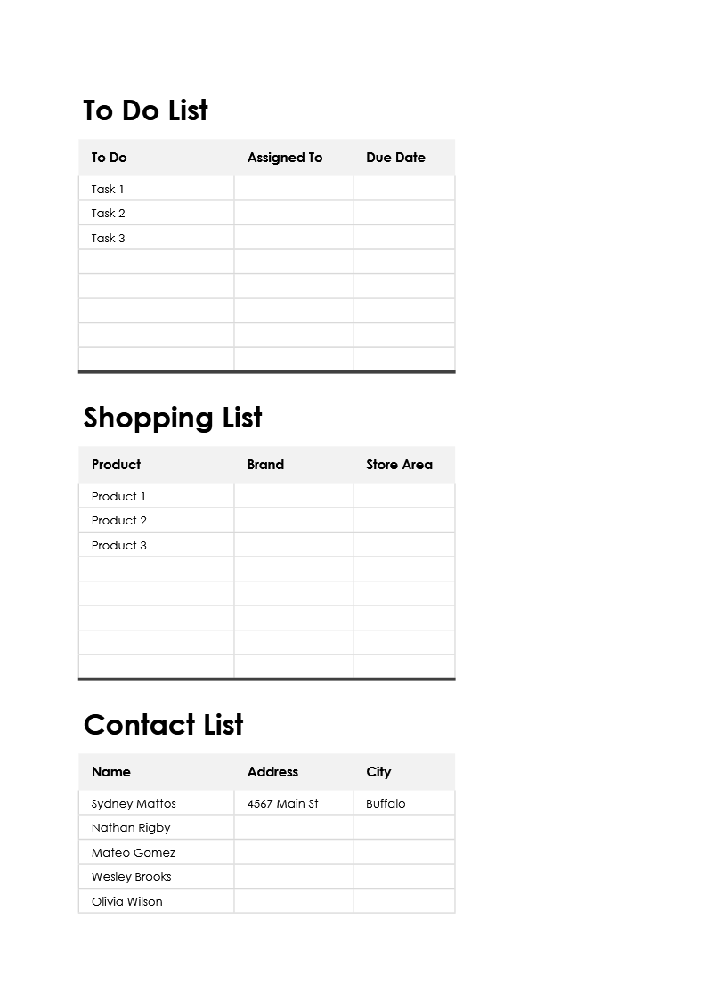 |  |  |

## simple-olive-green-timesheet-invoice

| Expected (Word) | Skia | ImageSharp |
| --- | --- | --- |
| **Page 1**&nbsp;&nbsp;&nbsp;&nbsp;&nbsp;&nbsp;&nbsp;&nbsp;&nbsp;&nbsp;&nbsp;&nbsp;&nbsp;&nbsp;&nbsp;&nbsp;&nbsp;&nbsp;&nbsp;&nbsp;&nbsp;&nbsp;&nbsp;&nbsp;&nbsp;&nbsp;&nbsp;&nbsp;&nbsp;&nbsp;&nbsp;&nbsp;&nbsp;&nbsp; | **Page 1. ErrorMetric: 0.3485 · SSIM: 0.8792** | **Page 1. ErrorMetric: 0.3500 · SSIM: 0.8787** |
| 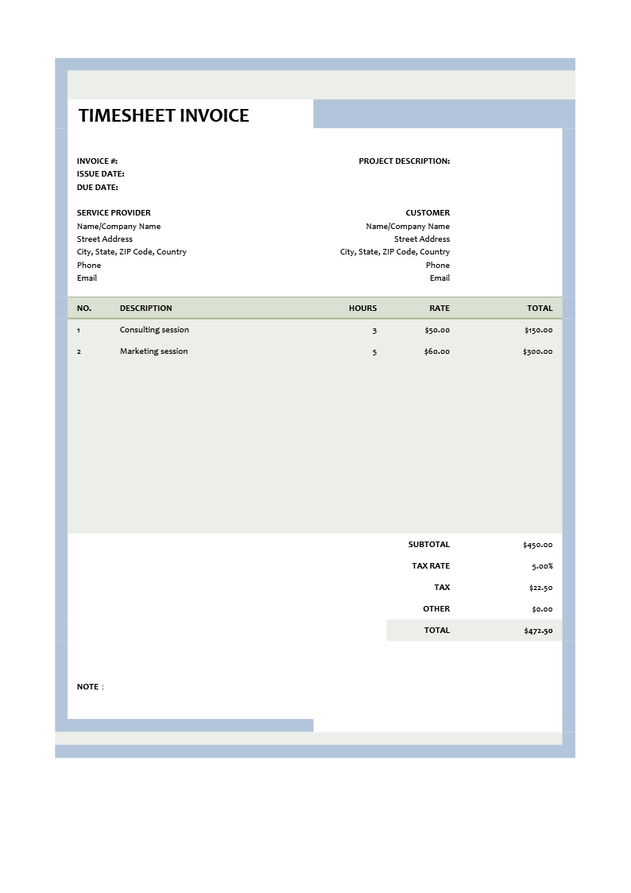 |  |  |

## simple-purple-credit-note

| Expected (Word) | Skia | ImageSharp |
| --- | --- | --- |
| **Page 1**&nbsp;&nbsp;&nbsp;&nbsp;&nbsp;&nbsp;&nbsp;&nbsp;&nbsp;&nbsp;&nbsp;&nbsp;&nbsp;&nbsp;&nbsp;&nbsp;&nbsp;&nbsp;&nbsp;&nbsp;&nbsp;&nbsp;&nbsp;&nbsp;&nbsp;&nbsp;&nbsp;&nbsp;&nbsp;&nbsp;&nbsp;&nbsp;&nbsp;&nbsp; | **Page 1. ErrorMetric: 0.2268 · SSIM: 0.8116** | **Page 1. ErrorMetric: 0.2283 · SSIM: 0.8118** |
| 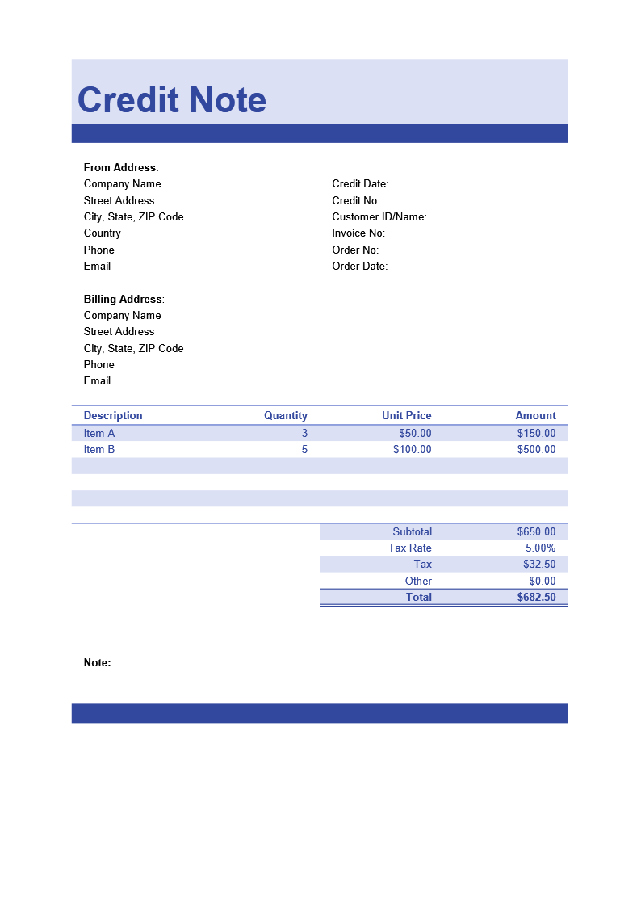 |  |  |

## simple-yellow-standard-invoice

| Expected (Word) | Skia | ImageSharp |
| --- | --- | --- |
| **Page 1**&nbsp;&nbsp;&nbsp;&nbsp;&nbsp;&nbsp;&nbsp;&nbsp;&nbsp;&nbsp;&nbsp;&nbsp;&nbsp;&nbsp;&nbsp;&nbsp;&nbsp;&nbsp;&nbsp;&nbsp;&nbsp;&nbsp;&nbsp;&nbsp;&nbsp;&nbsp;&nbsp;&nbsp;&nbsp;&nbsp;&nbsp;&nbsp;&nbsp;&nbsp; | **Page 1. ErrorMetric: 0.4228 · SSIM: 0.9044** | **Page 1. ErrorMetric: 0.4237 · SSIM: 0.9000** |
| 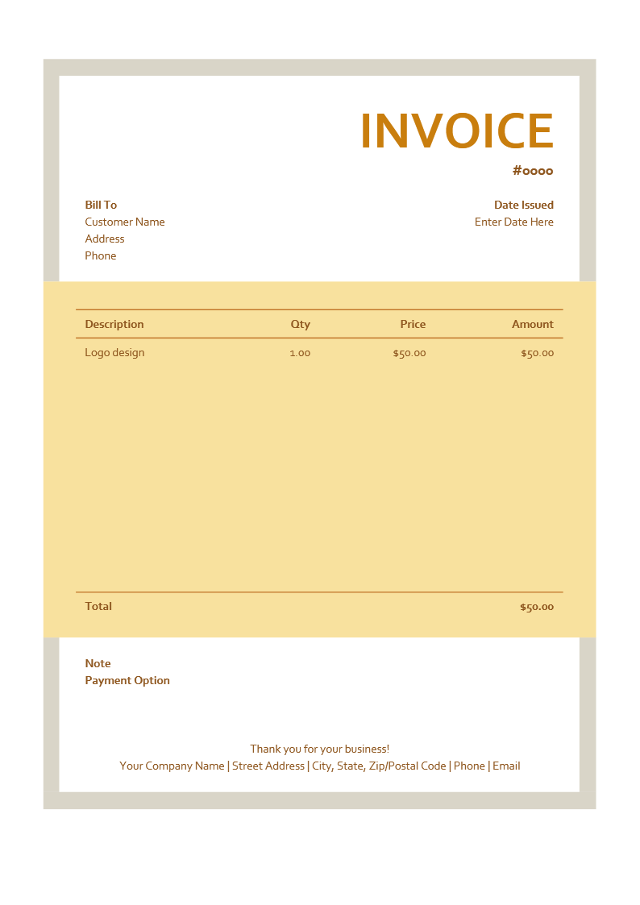 |  |  |

## social-media-editorial-theme-calendar

| Expected (Word) | Skia | ImageSharp |
| --- | --- | --- |
| **Page 1**&nbsp;&nbsp;&nbsp;&nbsp;&nbsp;&nbsp;&nbsp;&nbsp;&nbsp;&nbsp;&nbsp;&nbsp;&nbsp;&nbsp;&nbsp;&nbsp;&nbsp;&nbsp;&nbsp;&nbsp;&nbsp;&nbsp;&nbsp;&nbsp;&nbsp;&nbsp;&nbsp;&nbsp;&nbsp;&nbsp;&nbsp;&nbsp;&nbsp;&nbsp; | **Page 1. ErrorMetric: 0.3457 · SSIM: 0.6700** | **Page 1. ErrorMetric: 0.3472 · SSIM: 0.6679** |
| 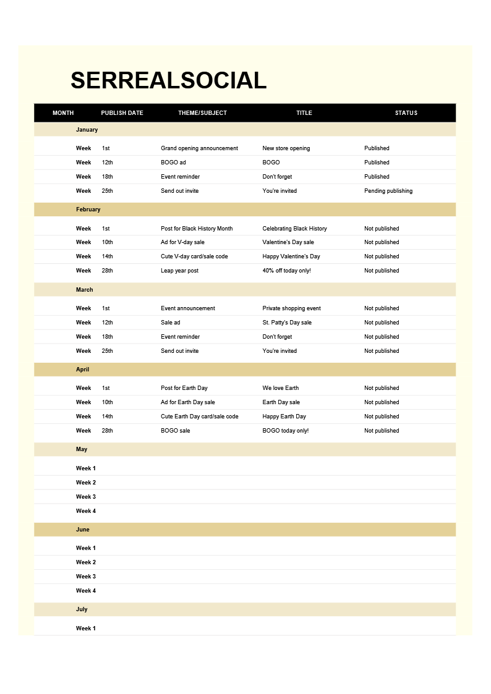 |  |  |
| **Page 2**&nbsp;&nbsp;&nbsp;&nbsp;&nbsp;&nbsp;&nbsp;&nbsp;&nbsp;&nbsp;&nbsp;&nbsp;&nbsp;&nbsp;&nbsp;&nbsp;&nbsp;&nbsp;&nbsp;&nbsp;&nbsp;&nbsp;&nbsp;&nbsp;&nbsp;&nbsp;&nbsp;&nbsp;&nbsp;&nbsp;&nbsp;&nbsp;&nbsp;&nbsp; | **Page 2. ErrorMetric: 0.2931 · SSIM: 0.8065** | **Page 2. ErrorMetric: 0.2953 · SSIM: 0.8071** |
| 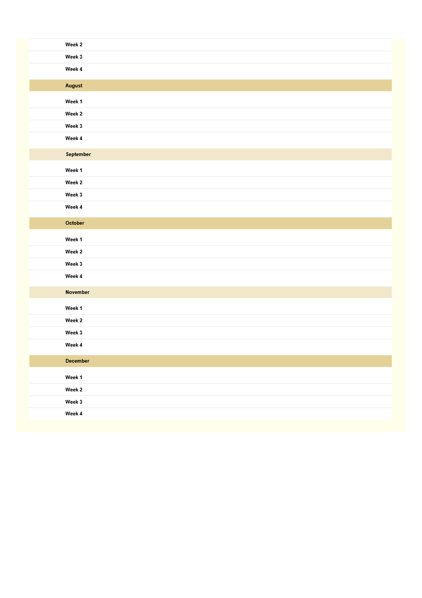 |  |  |

## to-do-list

| Expected (Word) | Skia | ImageSharp |
| --- | --- | --- |
| **Page 1**&nbsp;&nbsp;&nbsp;&nbsp;&nbsp;&nbsp;&nbsp;&nbsp;&nbsp;&nbsp;&nbsp;&nbsp;&nbsp;&nbsp;&nbsp;&nbsp;&nbsp;&nbsp;&nbsp;&nbsp;&nbsp;&nbsp;&nbsp;&nbsp;&nbsp;&nbsp;&nbsp;&nbsp;&nbsp;&nbsp;&nbsp;&nbsp;&nbsp;&nbsp; | **Page 1. ErrorMetric: 0.5881 · SSIM: 0.7061** | **Page 1. ErrorMetric: 0.5958 · SSIM: 0.6968** |
|  |  |  |
| **Page 2**&nbsp;&nbsp;&nbsp;&nbsp;&nbsp;&nbsp;&nbsp;&nbsp;&nbsp;&nbsp;&nbsp;&nbsp;&nbsp;&nbsp;&nbsp;&nbsp;&nbsp;&nbsp;&nbsp;&nbsp;&nbsp;&nbsp;&nbsp;&nbsp;&nbsp;&nbsp;&nbsp;&nbsp;&nbsp;&nbsp;&nbsp;&nbsp;&nbsp;&nbsp; | **Page 2. ErrorMetric: 0.2413 · SSIM: 0.9258** | **Page 2. ErrorMetric: 0.2433 · SSIM: 0.9226** |
| 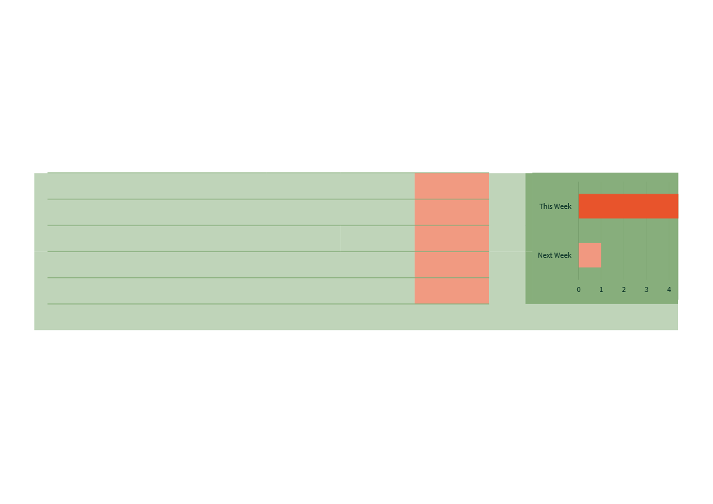 |  |  |

## to-do-list-for-projects

| Expected (Word) | Skia | ImageSharp |
| --- | --- | --- |
| **Page 1**&nbsp;&nbsp;&nbsp;&nbsp;&nbsp;&nbsp;&nbsp;&nbsp;&nbsp;&nbsp;&nbsp;&nbsp;&nbsp;&nbsp;&nbsp;&nbsp;&nbsp;&nbsp;&nbsp;&nbsp;&nbsp;&nbsp;&nbsp;&nbsp;&nbsp;&nbsp;&nbsp;&nbsp;&nbsp;&nbsp;&nbsp;&nbsp;&nbsp;&nbsp; | **Page 1. ErrorMetric: 0.4157 · SSIM: 0.8014** | **Page 1. ErrorMetric: 0.4200 · SSIM: 0.8019** |
| 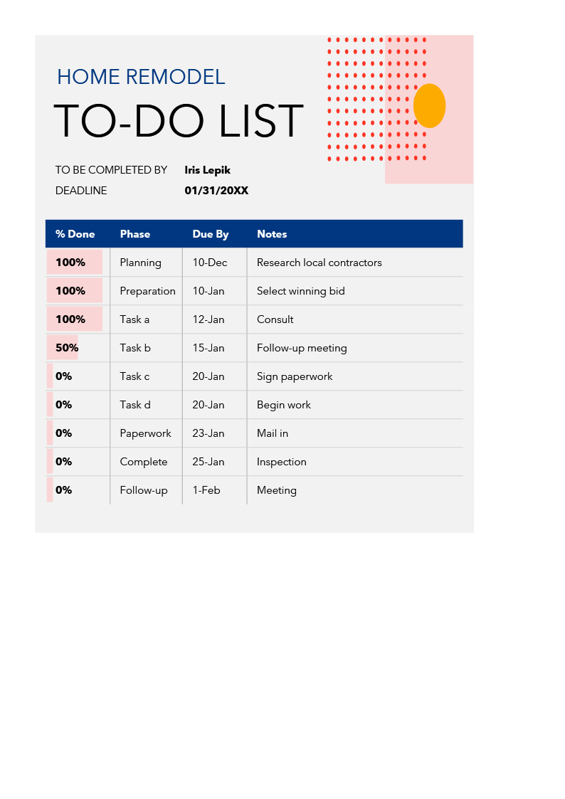 |  |  |
| **Page 2**&nbsp;&nbsp;&nbsp;&nbsp;&nbsp;&nbsp;&nbsp;&nbsp;&nbsp;&nbsp;&nbsp;&nbsp;&nbsp;&nbsp;&nbsp;&nbsp;&nbsp;&nbsp;&nbsp;&nbsp;&nbsp;&nbsp;&nbsp;&nbsp;&nbsp;&nbsp;&nbsp;&nbsp;&nbsp;&nbsp;&nbsp;&nbsp;&nbsp;&nbsp; | **Page 2. ErrorMetric: 0.3416 · SSIM: 0.8543** | **Page 2. ErrorMetric: 0.3433 · SSIM: 0.8542** |
| 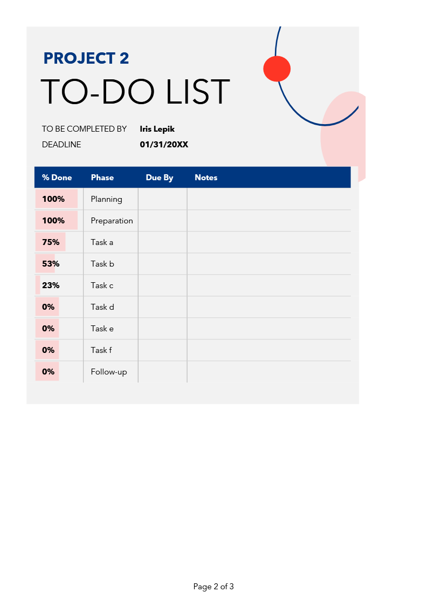 |  |  |

## wedding-budget-template

| Expected (Word) | Skia | ImageSharp |
| --- | --- | --- |
| **Page 1**&nbsp;&nbsp;&nbsp;&nbsp;&nbsp;&nbsp;&nbsp;&nbsp;&nbsp;&nbsp;&nbsp;&nbsp;&nbsp;&nbsp;&nbsp;&nbsp;&nbsp;&nbsp;&nbsp;&nbsp;&nbsp;&nbsp;&nbsp;&nbsp;&nbsp;&nbsp;&nbsp;&nbsp;&nbsp;&nbsp;&nbsp;&nbsp;&nbsp;&nbsp; | **Page 1. ErrorMetric: 0.1989 · SSIM: 0.6016** | **Page 1. ErrorMetric: 0.2001 · SSIM: 0.6004** |
| 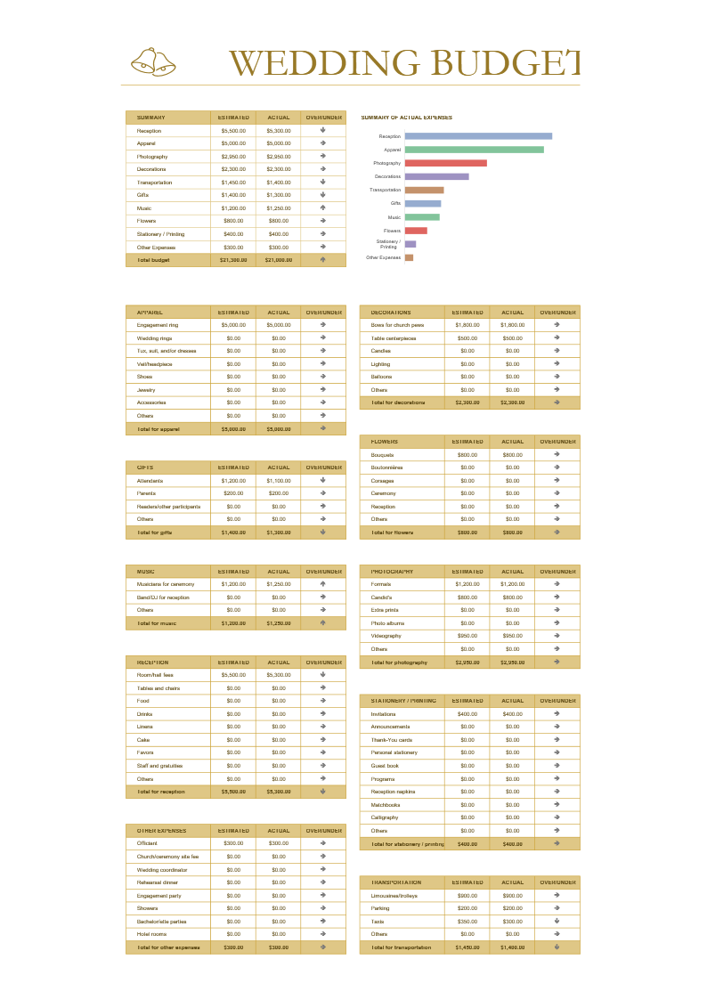 |  |  |

## wedding-invitation-tracker

| Expected (Word) | Skia | ImageSharp |
| --- | --- | --- |
| **Page 1**&nbsp;&nbsp;&nbsp;&nbsp;&nbsp;&nbsp;&nbsp;&nbsp;&nbsp;&nbsp;&nbsp;&nbsp;&nbsp;&nbsp;&nbsp;&nbsp;&nbsp;&nbsp;&nbsp;&nbsp;&nbsp;&nbsp;&nbsp;&nbsp;&nbsp;&nbsp;&nbsp;&nbsp;&nbsp;&nbsp;&nbsp;&nbsp;&nbsp;&nbsp; | **Page 1. ErrorMetric: 0.2752 · SSIM: 0.7850** | **Page 1. ErrorMetric: 0.2943 · SSIM: 0.7828** |
| 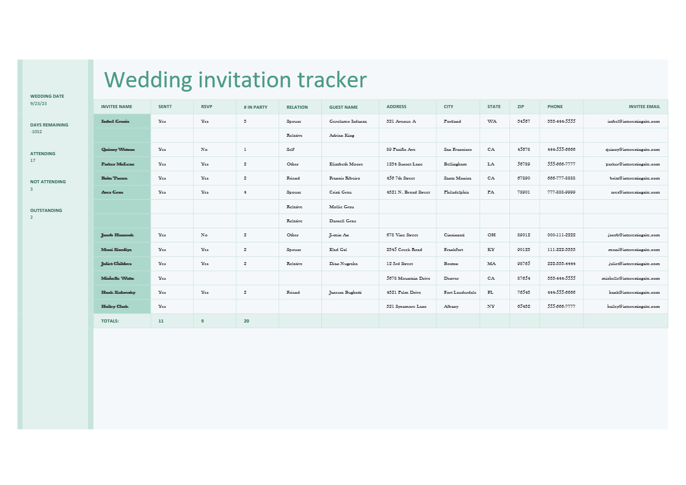 |  |  |
| **Page 2**&nbsp;&nbsp;&nbsp;&nbsp;&nbsp;&nbsp;&nbsp;&nbsp;&nbsp;&nbsp;&nbsp;&nbsp;&nbsp;&nbsp;&nbsp;&nbsp;&nbsp;&nbsp;&nbsp;&nbsp;&nbsp;&nbsp;&nbsp;&nbsp;&nbsp;&nbsp;&nbsp;&nbsp;&nbsp;&nbsp;&nbsp;&nbsp;&nbsp;&nbsp; | **Page 2. ErrorMetric: 0.1431 · SSIM: 0.9511** | **Page 2. ErrorMetric: 0.1700 · SSIM: 0.9501** |
| 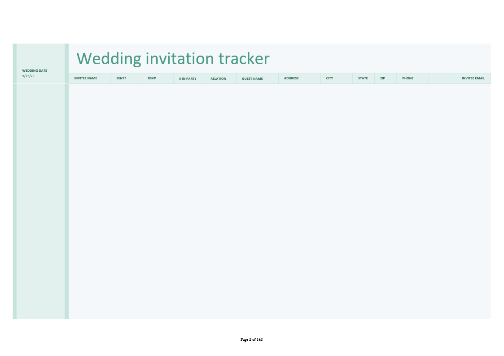 |  |  |

## weekly-lesson-planner

| Expected (Word) | Skia | ImageSharp |
| --- | --- | --- |
| **Page 1**&nbsp;&nbsp;&nbsp;&nbsp;&nbsp;&nbsp;&nbsp;&nbsp;&nbsp;&nbsp;&nbsp;&nbsp;&nbsp;&nbsp;&nbsp;&nbsp;&nbsp;&nbsp;&nbsp;&nbsp;&nbsp;&nbsp;&nbsp;&nbsp;&nbsp;&nbsp;&nbsp;&nbsp;&nbsp;&nbsp;&nbsp;&nbsp;&nbsp;&nbsp; | **Page 1. ErrorMetric: 0.2123 · SSIM: 0.8295** | **Page 1. ErrorMetric: 0.2108 · SSIM: 0.8226** |
|  |  |  |
| **Page 2**&nbsp;&nbsp;&nbsp;&nbsp;&nbsp;&nbsp;&nbsp;&nbsp;&nbsp;&nbsp;&nbsp;&nbsp;&nbsp;&nbsp;&nbsp;&nbsp;&nbsp;&nbsp;&nbsp;&nbsp;&nbsp;&nbsp;&nbsp;&nbsp;&nbsp;&nbsp;&nbsp;&nbsp;&nbsp;&nbsp;&nbsp;&nbsp;&nbsp;&nbsp; | **Page 2. ErrorMetric: 0.2410 · SSIM: 0.7144** | **Page 2. ErrorMetric: 0.2330 · SSIM: 0.7122** |
|  |  |  |

