# All scenarios (40)

Contents

- [abstract-airbrush](#abstract-airbrush)
- [abstracts-paint-by-numbers](#abstracts-paint-by-numbers)
- [angle-lines](#angle-lines)
- [angled-tri-fold-brochure](#angled-tri-fold-brochure)
- [archive](#archive)
- [art-photo-book](#art-photo-book)
- [bohemian](#bohemian)
- [business-cards-horizontal-layout](#business-cards-horizontal-layout)
- [city](#city)
- [color-block](#color-block)
- [dappled](#dappled)
- [dark-modernist](#dark-modernist)
- [dividend](#dividend)
- [education-infographics-poster](#education-infographics-poster)
- [fashion-infographics-poster](#fashion-infographics-poster)
- [fashion-photo-album](#fashion-photo-album)
- [funky-shapes](#funky-shapes)
- [funky-shapes-dark](#funky-shapes-dark)
- [gradient](#gradient)
- [headlines](#headlines)
- [inspirational-bookmarks](#inspirational-bookmarks)
- [leaf](#leaf)
- [lines](#lines)
- [luminous](#luminous)
- [magazine-layout](#magazine-layout)
- [memo](#memo)
- [memorial-photo-album](#memorial-photo-album)
- [minimalist-light-sales-pitch](#minimalist-light-sales-pitch)
- [modern-company-overview](#modern-company-overview)
- [music](#music)
- [offset](#offset)
- [organic-geometry-photo-slideshow](#organic-geometry-photo-slideshow)
- [pebble](#pebble)
- [rose-suite](#rose-suite)
- [savon](#savon)
- [shoji](#shoji)
- [sketchlines](#sketchlines)
- [succulents-paint-by-numbers](#succulents-paint-by-numbers)
- [tech-brochure](#tech-brochure)
- [torn](#torn)

## abstract-airbrush

| Expected (Word) | Skia | ImageSharp |
| --- | --- | --- |
| **Page 1** | **Page 1** _(no page)_ | **Page 1** _(no page)_ |
| 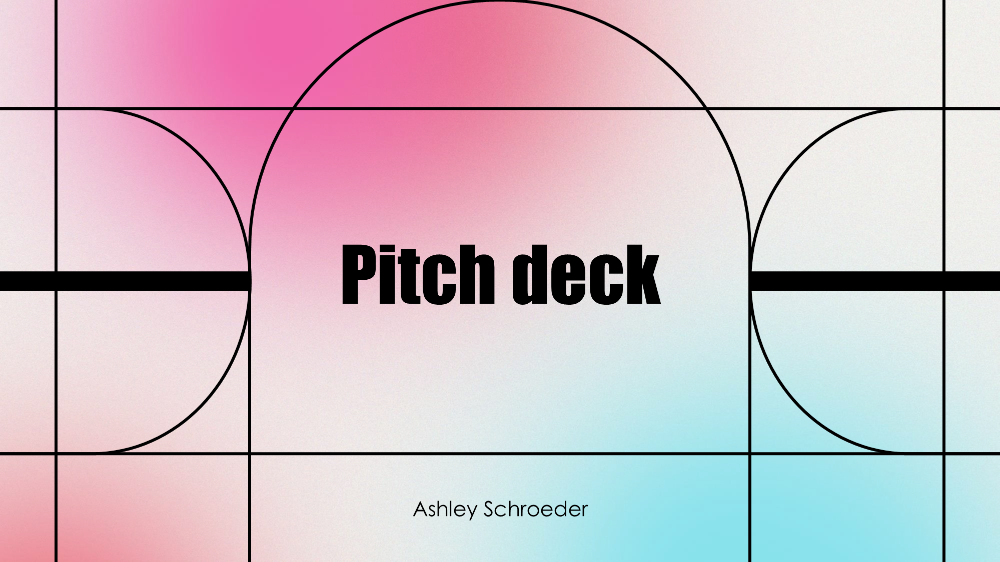 |  |  |
| **Page 2** | **Page 2** _(no page)_ | **Page 2** _(no page)_ |
| 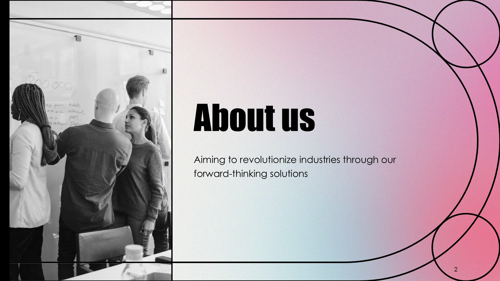 |  |  |
| **Page 3** | **Page 3** _(no page)_ | **Page 3** _(no page)_ |
| 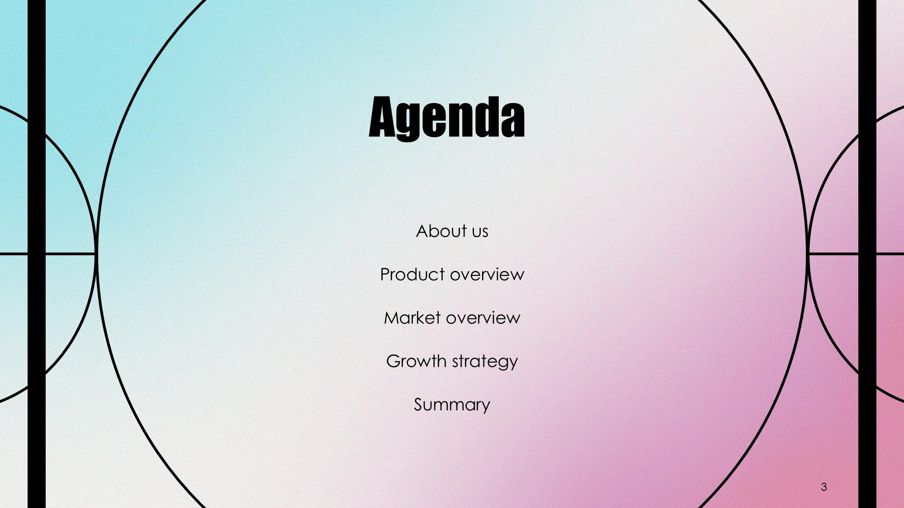 |  |  |

## abstracts-paint-by-numbers

| Expected (Word) | Skia | ImageSharp |
| --- | --- | --- |
| **Page 1** | **Page 1** _(no page)_ | **Page 1** _(no page)_ |
| 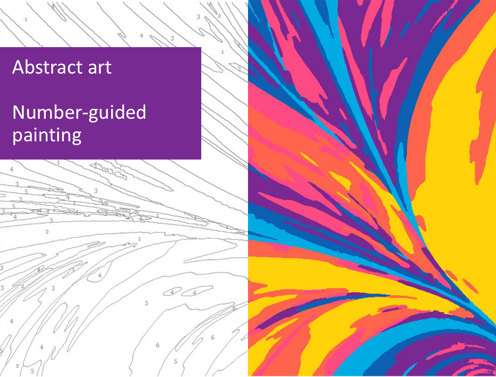 |  |  |
| **Page 2** | **Page 2** _(no page)_ | **Page 2** _(no page)_ |
| 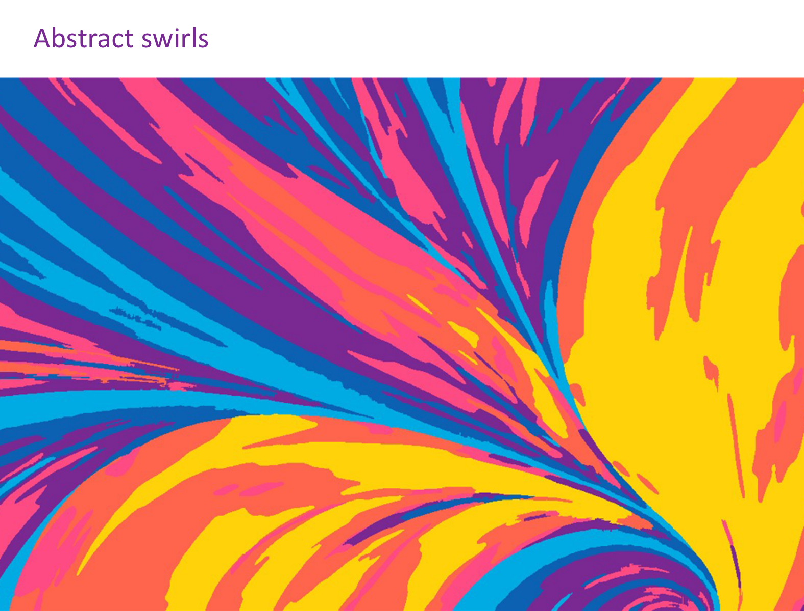 |  |  |
| **Page 3** | **Page 3** _(no page)_ | **Page 3** _(no page)_ |
| 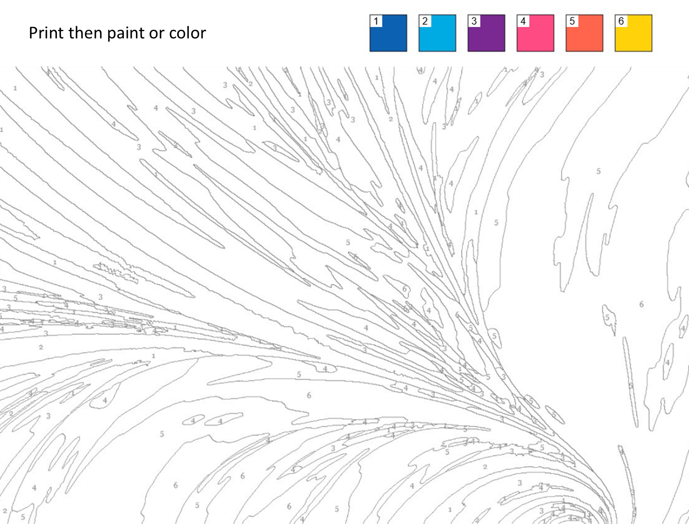 |  |  |

## angle-lines

| Expected (Word) | Skia | ImageSharp |
| --- | --- | --- |
| **Page 1** | **Page 1** _(no page)_ | **Page 1** _(no page)_ |
|  |  |  |
| **Page 2** | **Page 2** _(no page)_ | **Page 2** _(no page)_ |
|  |  |  |
| **Page 3** | **Page 3** _(no page)_ | **Page 3** _(no page)_ |
|  |  |  |

## angled-tri-fold-brochure

| Expected (Word) | Skia | ImageSharp |
| --- | --- | --- |
| **Page 1** | **Page 1** _(no page)_ | **Page 1** _(no page)_ |
|  |  |  |
| **Page 2** | **Page 2** _(no page)_ | **Page 2** _(no page)_ |
|  |  |  |
| **Page 3** | **Page 3** _(no page)_ | **Page 3** _(no page)_ |
|  |  |  |

## archive

| Expected (Word) | Skia | ImageSharp |
| --- | --- | --- |
| **Page 1** | **Page 1** _(no page)_ | **Page 1** _(no page)_ |
|  |  |  |
| **Page 2** | **Page 2** _(no page)_ | **Page 2** _(no page)_ |
|  |  |  |
| **Page 3** | **Page 3** _(no page)_ | **Page 3** _(no page)_ |
|  |  |  |

## art-photo-book

| Expected (Word) | Skia | ImageSharp |
| --- | --- | --- |
| **Page 1** | **Page 1** _(no page)_ | **Page 1** _(no page)_ |
|  |  |  |
| **Page 2** | **Page 2** _(no page)_ | **Page 2** _(no page)_ |
|  |  |  |
| **Page 3** | **Page 3** _(no page)_ | **Page 3** _(no page)_ |
| 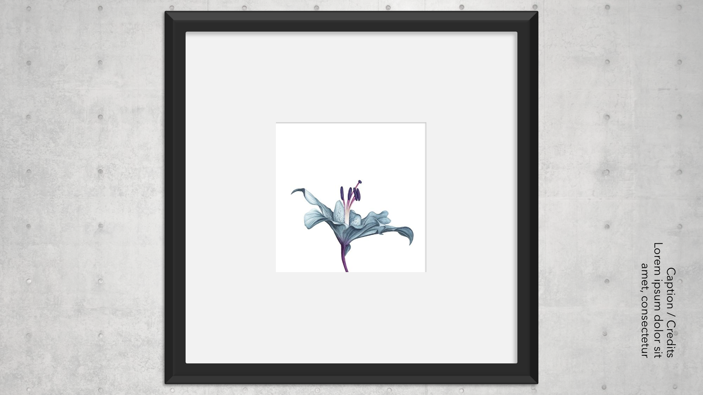 |  |  |

## bohemian

| Expected (Word) | Skia | ImageSharp |
| --- | --- | --- |
| **Page 1** | **Page 1** _(no page)_ | **Page 1** _(no page)_ |
|  |  |  |
| **Page 2** | **Page 2** _(no page)_ | **Page 2** _(no page)_ |
|  |  |  |
| **Page 3** | **Page 3** _(no page)_ | **Page 3** _(no page)_ |
|  |  |  |

## business-cards-horizontal-layout

| Expected (Word) | Skia | ImageSharp |
| --- | --- | --- |
| **Page 1** | **Page 1** _(no page)_ | **Page 1** _(no page)_ |
|  |  |  |

## city

| Expected (Word) | Skia | ImageSharp |
| --- | --- | --- |
| **Page 1** | **Page 1** _(no page)_ | **Page 1** _(no page)_ |
|  |  |  |
| **Page 2** | **Page 2** _(no page)_ | **Page 2** _(no page)_ |
| 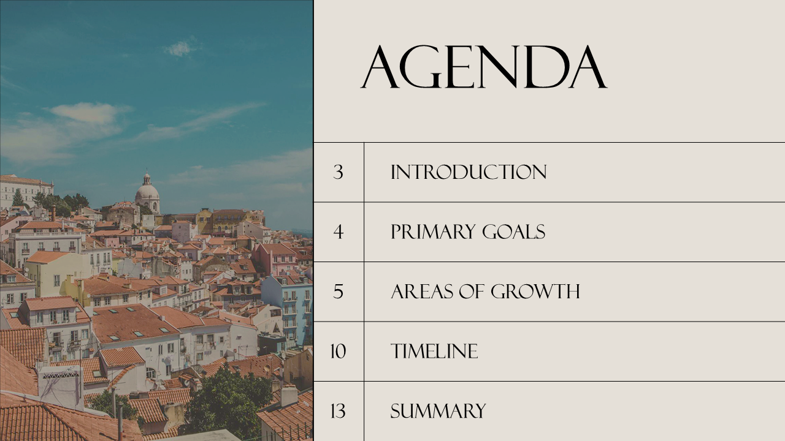 |  |  |
| **Page 3** | **Page 3** _(no page)_ | **Page 3** _(no page)_ |
| 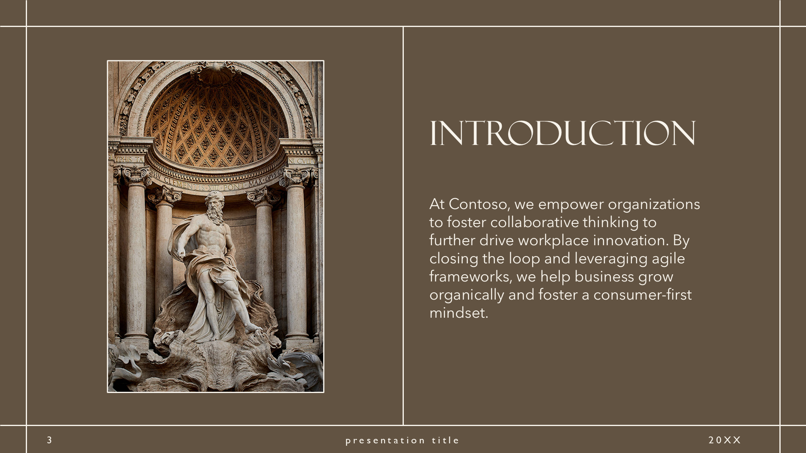 |  |  |

## color-block

| Expected (Word) | Skia | ImageSharp |
| --- | --- | --- |
| **Page 1** | **Page 1** _(no page)_ | **Page 1** _(no page)_ |
|  |  |  |
| **Page 2** | **Page 2** _(no page)_ | **Page 2** _(no page)_ |
|  |  |  |
| **Page 3** | **Page 3** _(no page)_ | **Page 3** _(no page)_ |
|  |  |  |

## dappled

| Expected (Word) | Skia | ImageSharp |
| --- | --- | --- |
| **Page 1** | **Page 1** _(no page)_ | **Page 1** _(no page)_ |
|  |  |  |
| **Page 2** | **Page 2** _(no page)_ | **Page 2** _(no page)_ |
|  |  |  |
| **Page 3** | **Page 3** _(no page)_ | **Page 3** _(no page)_ |
| 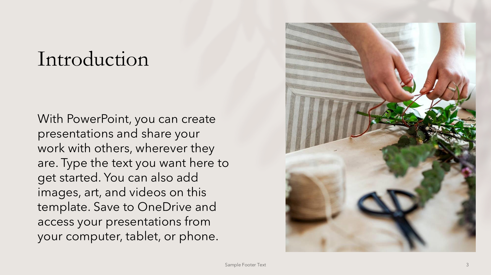 |  |  |

## dark-modernist

| Expected (Word) | Skia | ImageSharp |
| --- | --- | --- |
| **Page 1** | **Page 1** _(no page)_ | **Page 1** _(no page)_ |
|  |  |  |
| **Page 2** | **Page 2** _(no page)_ | **Page 2** _(no page)_ |
| 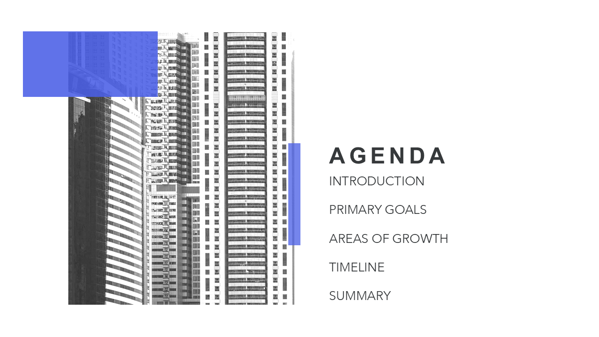 |  |  |
| **Page 3** | **Page 3** _(no page)_ | **Page 3** _(no page)_ |
|  |  |  |

## dividend

| Expected (Word) | Skia | ImageSharp |
| --- | --- | --- |
| **Page 1** | **Page 1** _(no page)_ | **Page 1** _(no page)_ |
|  |  |  |
| **Page 2** | **Page 2** _(no page)_ | **Page 2** _(no page)_ |
|  |  |  |
| **Page 3** | **Page 3** _(no page)_ | **Page 3** _(no page)_ |
|  |  |  |

## education-infographics-poster

| Expected (Word) | Skia | ImageSharp |
| --- | --- | --- |
| **Page 1** | **Page 1** _(no page)_ | **Page 1** _(no page)_ |
|  |  |  |

## fashion-infographics-poster

| Expected (Word) | Skia | ImageSharp |
| --- | --- | --- |
| **Page 1** | **Page 1** _(no page)_ | **Page 1** _(no page)_ |
|  |  |  |
| **Page 2** | **Page 2** _(no page)_ | **Page 2** _(no page)_ |
|  |  |  |
| **Page 3** | **Page 3** _(no page)_ | **Page 3** _(no page)_ |
|  |  |  |

## fashion-photo-album

| Expected (Word) | Skia | ImageSharp |
| --- | --- | --- |
| **Page 1** | **Page 1** _(no page)_ | **Page 1** _(no page)_ |
|  |  |  |
| **Page 2** | **Page 2** _(no page)_ | **Page 2** _(no page)_ |
|  |  |  |
| **Page 3** | **Page 3** _(no page)_ | **Page 3** _(no page)_ |
|  |  |  |

## funky-shapes

| Expected (Word) | Skia | ImageSharp |
| --- | --- | --- |
| **Page 1** | **Page 1** _(no page)_ | **Page 1** _(no page)_ |
|  |  |  |
| **Page 2** | **Page 2** _(no page)_ | **Page 2** _(no page)_ |
|  |  |  |
| **Page 3** | **Page 3** _(no page)_ | **Page 3** _(no page)_ |
| 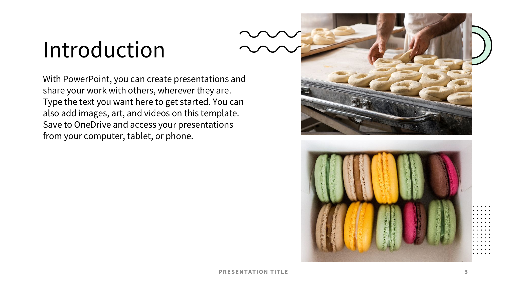 |  |  |

## funky-shapes-dark

| Expected (Word) | Skia | ImageSharp |
| --- | --- | --- |
| **Page 1** | **Page 1** _(no page)_ | **Page 1** _(no page)_ |
|  |  |  |
| **Page 2** | **Page 2** _(no page)_ | **Page 2** _(no page)_ |
|  |  |  |
| **Page 3** | **Page 3** _(no page)_ | **Page 3** _(no page)_ |
| 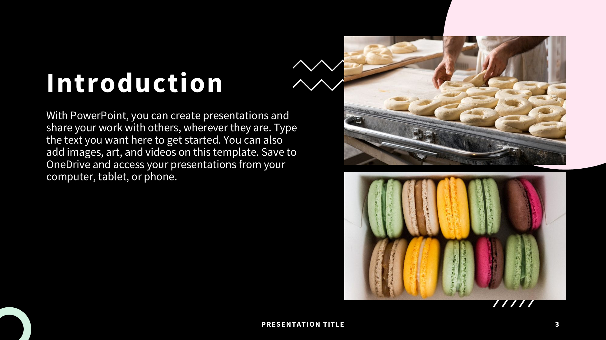 |  |  |

## gradient

| Expected (Word) | Skia | ImageSharp |
| --- | --- | --- |
| **Page 1** | **Page 1** _(no page)_ | **Page 1** _(no page)_ |
|  |  |  |
| **Page 2** | **Page 2** _(no page)_ | **Page 2** _(no page)_ |
|  |  |  |
| **Page 3** | **Page 3** _(no page)_ | **Page 3** _(no page)_ |
| 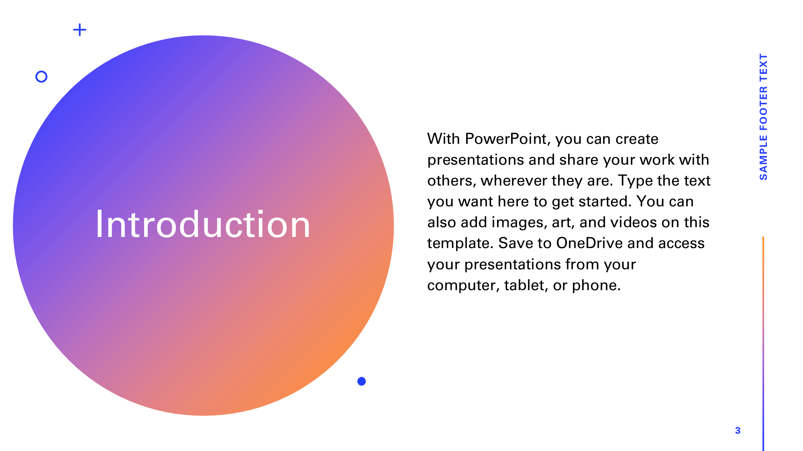 |  |  |

## headlines

| Expected (Word) | Skia | ImageSharp |
| --- | --- | --- |
| **Page 1** | **Page 1** _(no page)_ | **Page 1** _(no page)_ |
| 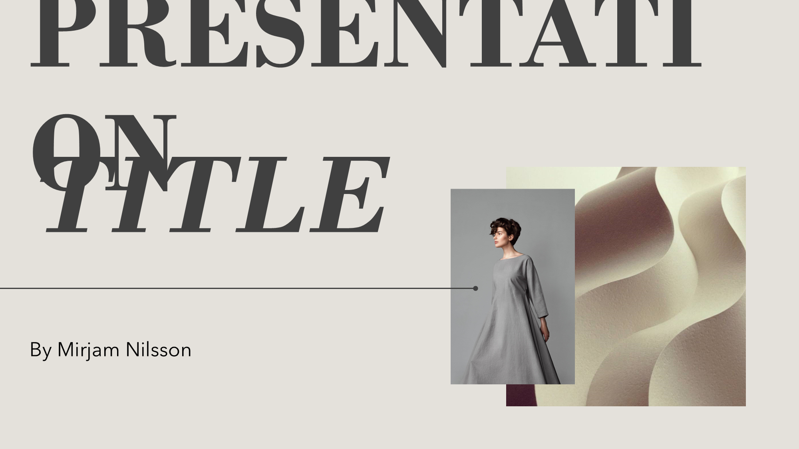 |  |  |
| **Page 2** | **Page 2** _(no page)_ | **Page 2** _(no page)_ |
| 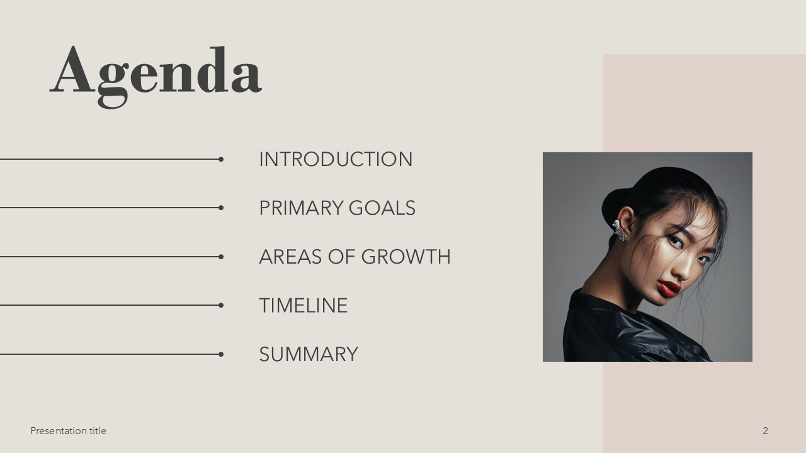 |  |  |
| **Page 3** | **Page 3** _(no page)_ | **Page 3** _(no page)_ |
| 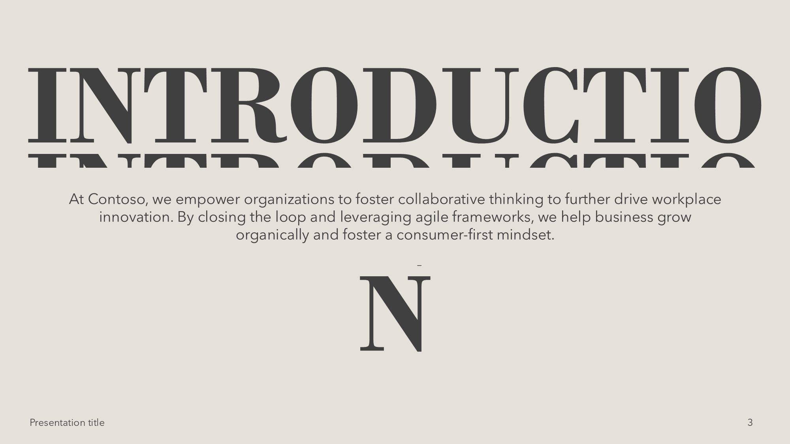 |  |  |

## inspirational-bookmarks

| Expected (Word) | Skia | ImageSharp |
| --- | --- | --- |
| **Page 1** | **Page 1** _(no page)_ | **Page 1** _(no page)_ |
|  |  |  |

## leaf

| Expected (Word) | Skia | ImageSharp |
| --- | --- | --- |
| **Page 1** | **Page 1** _(no page)_ | **Page 1** _(no page)_ |
|  |  |  |
| **Page 2** | **Page 2** _(no page)_ | **Page 2** _(no page)_ |
|  |  |  |
| **Page 3** | **Page 3** _(no page)_ | **Page 3** _(no page)_ |
|  |  |  |

## lines

| Expected (Word) | Skia | ImageSharp |
| --- | --- | --- |
| **Page 1** | **Page 1** _(no page)_ | **Page 1** _(no page)_ |
|  |  |  |
| **Page 2** | **Page 2** _(no page)_ | **Page 2** _(no page)_ |
|  |  |  |
| **Page 3** | **Page 3** _(no page)_ | **Page 3** _(no page)_ |
|  |  |  |

## luminous

| Expected (Word) | Skia | ImageSharp |
| --- | --- | --- |
| **Page 1** | **Page 1** _(no page)_ | **Page 1** _(no page)_ |
|  |  |  |
| **Page 2** | **Page 2** _(no page)_ | **Page 2** _(no page)_ |
|  |  |  |
| **Page 3** | **Page 3** _(no page)_ | **Page 3** _(no page)_ |
| 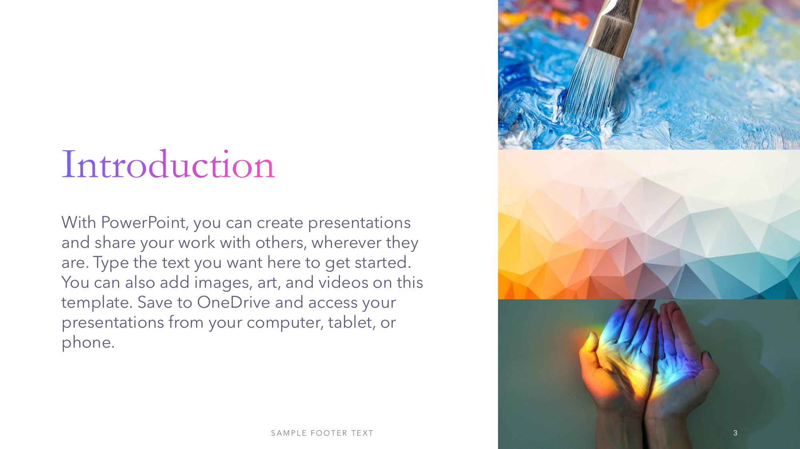 |  |  |

## magazine-layout

| Expected (Word) | Skia | ImageSharp |
| --- | --- | --- |
| **Page 1** | **Page 1** _(no page)_ | **Page 1** _(no page)_ |
|  |  |  |
| **Page 2** | **Page 2** _(no page)_ | **Page 2** _(no page)_ |
|  |  |  |
| **Page 3** | **Page 3** _(no page)_ | **Page 3** _(no page)_ |
| 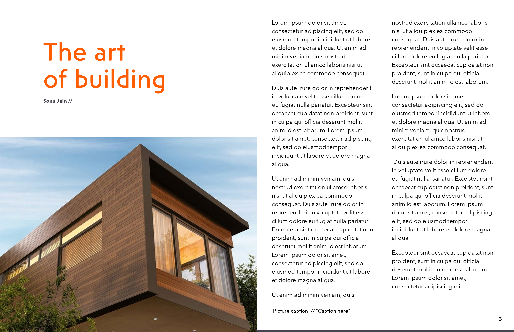 |  |  |

## memo

| Expected (Word) | Skia | ImageSharp |
| --- | --- | --- |
| **Page 1** | **Page 1** _(no page)_ | **Page 1** _(no page)_ |
|  |  |  |
| **Page 2** | **Page 2** _(no page)_ | **Page 2** _(no page)_ |
|  |  |  |
| **Page 3** | **Page 3** _(no page)_ | **Page 3** _(no page)_ |
|  |  |  |

## memorial-photo-album

| Expected (Word) | Skia | ImageSharp |
| --- | --- | --- |
| **Page 1** | **Page 1** _(no page)_ | **Page 1** _(no page)_ |
|  |  |  |
| **Page 2** | **Page 2** _(no page)_ | **Page 2** _(no page)_ |
|  |  |  |
| **Page 3** | **Page 3** _(no page)_ | **Page 3** _(no page)_ |
|  |  |  |

## minimalist-light-sales-pitch

| Expected (Word) | Skia | ImageSharp |
| --- | --- | --- |
| **Page 1** | **Page 1** _(no page)_ | **Page 1** _(no page)_ |
|  |  |  |
| **Page 2** | **Page 2** _(no page)_ | **Page 2** _(no page)_ |
|  |  |  |
| **Page 3** | **Page 3** _(no page)_ | **Page 3** _(no page)_ |
| 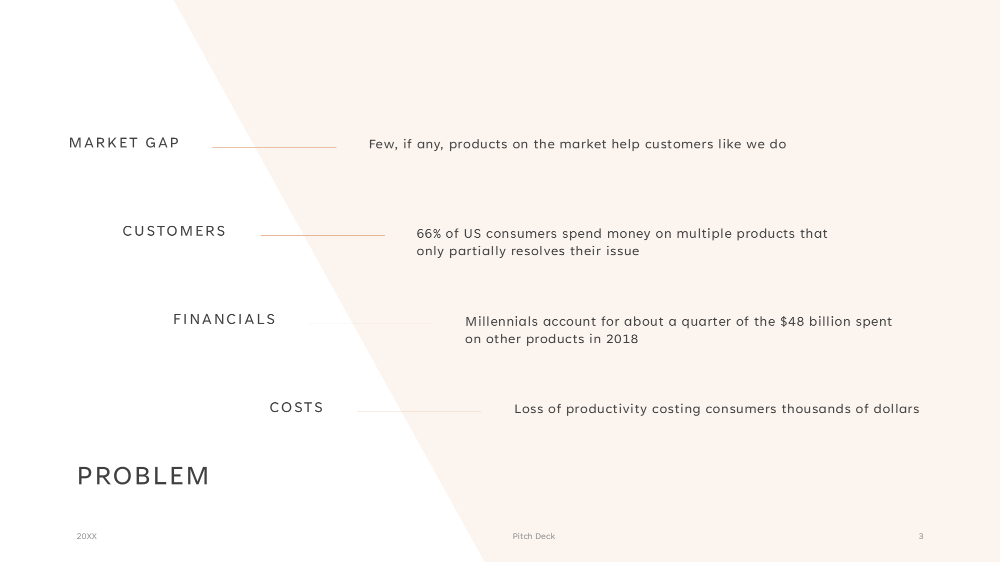 |  |  |

## modern-company-overview

| Expected (Word) | Skia | ImageSharp |
| --- | --- | --- |
| **Page 1** | **Page 1** _(no page)_ | **Page 1** _(no page)_ |
|  |  |  |
| **Page 2** | **Page 2** _(no page)_ | **Page 2** _(no page)_ |
|  |  |  |
| **Page 3** | **Page 3** _(no page)_ | **Page 3** _(no page)_ |
|  |  |  |

## music

| Expected (Word) | Skia | ImageSharp |
| --- | --- | --- |
| **Page 1** | **Page 1** _(no page)_ | **Page 1** _(no page)_ |
|  |  |  |
| **Page 2** | **Page 2** _(no page)_ | **Page 2** _(no page)_ |
|  |  |  |
| **Page 3** | **Page 3** _(no page)_ | **Page 3** _(no page)_ |
| 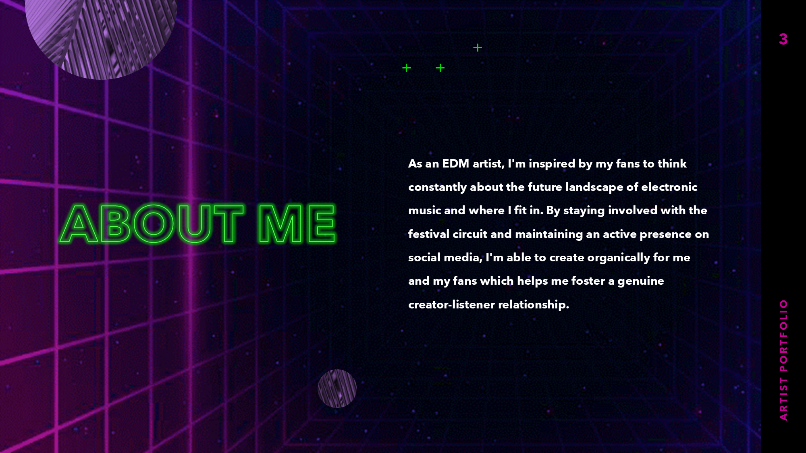 |  |  |

## offset

| Expected (Word) | Skia | ImageSharp |
| --- | --- | --- |
| **Page 1** | **Page 1** _(no page)_ | **Page 1** _(no page)_ |
|  |  |  |
| **Page 2** | **Page 2** _(no page)_ | **Page 2** _(no page)_ |
|  |  |  |
| **Page 3** | **Page 3** _(no page)_ | **Page 3** _(no page)_ |
| 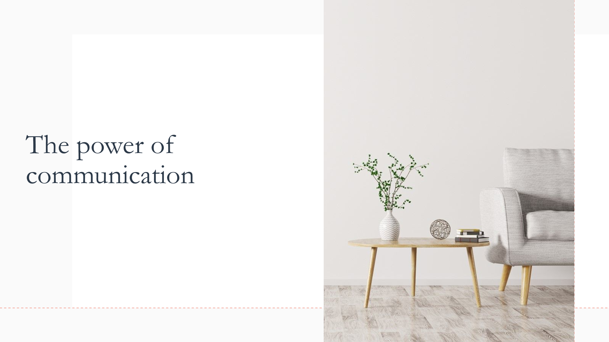 |  |  |

## organic-geometry-photo-slideshow

| Expected (Word) | Skia | ImageSharp |
| --- | --- | --- |
| **Page 1** | **Page 1** _(no page)_ | **Page 1** _(no page)_ |
|  |  |  |
| **Page 2** | **Page 2** _(no page)_ | **Page 2** _(no page)_ |
|  |  |  |
| **Page 3** | **Page 3** _(no page)_ | **Page 3** _(no page)_ |
|  |  |  |

## pebble

| Expected (Word) | Skia | ImageSharp |
| --- | --- | --- |
| **Page 1** | **Page 1** _(no page)_ | **Page 1** _(no page)_ |
|  |  |  |
| **Page 2** | **Page 2** _(no page)_ | **Page 2** _(no page)_ |
|  |  |  |
| **Page 3** | **Page 3** _(no page)_ | **Page 3** _(no page)_ |
|  |  |  |

## rose-suite

| Expected (Word) | Skia | ImageSharp |
| --- | --- | --- |
| **Page 1** | **Page 1** _(no page)_ | **Page 1** _(no page)_ |
|  |  |  |
| **Page 2** | **Page 2** _(no page)_ | **Page 2** _(no page)_ |
|  |  |  |
| **Page 3** | **Page 3** _(no page)_ | **Page 3** _(no page)_ |
|  |  |  |

## savon

| Expected (Word) | Skia | ImageSharp |
| --- | --- | --- |
| **Page 1** | **Page 1** _(no page)_ | **Page 1** _(no page)_ |
|  |  |  |
| **Page 2** | **Page 2** _(no page)_ | **Page 2** _(no page)_ |
|  |  |  |
| **Page 3** | **Page 3** _(no page)_ | **Page 3** _(no page)_ |
|  |  |  |

## shoji

| Expected (Word) | Skia | ImageSharp |
| --- | --- | --- |
| **Page 1** | **Page 1** _(no page)_ | **Page 1** _(no page)_ |
|  |  |  |
| **Page 2** | **Page 2** _(no page)_ | **Page 2** _(no page)_ |
|  |  |  |
| **Page 3** | **Page 3** _(no page)_ | **Page 3** _(no page)_ |
|  |  |  |

## sketchlines

| Expected (Word) | Skia | ImageSharp |
| --- | --- | --- |
| **Page 1** | **Page 1** _(no page)_ | **Page 1** _(no page)_ |
|  |  |  |
| **Page 2** | **Page 2** _(no page)_ | **Page 2** _(no page)_ |
|  |  |  |
| **Page 3** | **Page 3** _(no page)_ | **Page 3** _(no page)_ |
|  |  |  |

## succulents-paint-by-numbers

| Expected (Word) | Skia | ImageSharp |
| --- | --- | --- |
| **Page 1** | **Page 1** _(no page)_ | **Page 1** _(no page)_ |
| 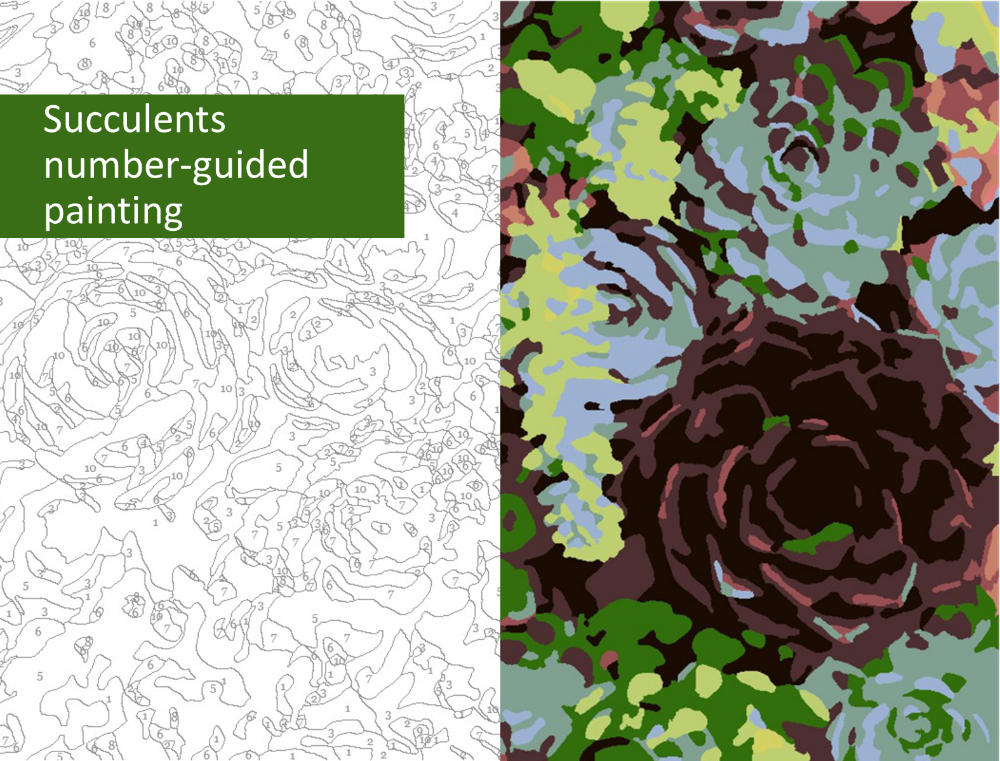 |  |  |
| **Page 2** | **Page 2** _(no page)_ | **Page 2** _(no page)_ |
| 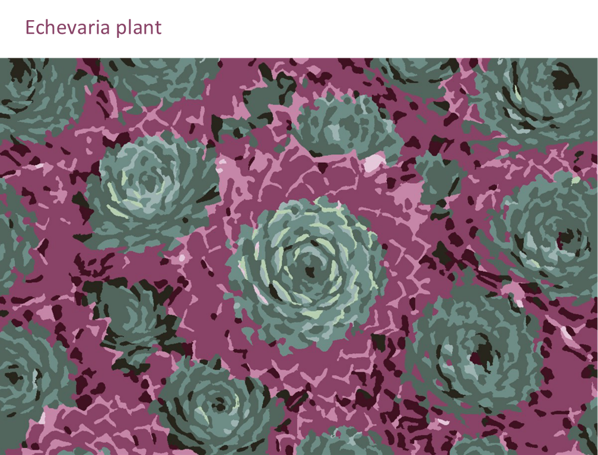 |  |  |
| **Page 3** | **Page 3** _(no page)_ | **Page 3** _(no page)_ |
| 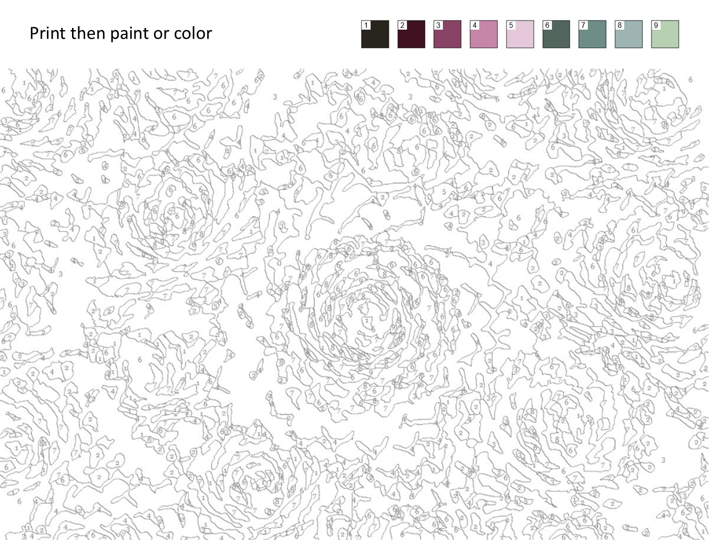 |  |  |

## tech-brochure

| Expected (Word) | Skia | ImageSharp |
| --- | --- | --- |
| **Page 1** | **Page 1** _(no page)_ | **Page 1** _(no page)_ |
|  |  |  |
| **Page 2** | **Page 2** _(no page)_ | **Page 2** _(no page)_ |
|  |  |  |
| **Page 3** | **Page 3** _(no page)_ | **Page 3** _(no page)_ |
|  |  |  |

## torn

| Expected (Word) | Skia | ImageSharp |
| --- | --- | --- |
| **Page 1** | **Page 1** _(no page)_ | **Page 1** _(no page)_ |
|  |  |  |
| **Page 2** | **Page 2** _(no page)_ | **Page 2** _(no page)_ |
|  |  |  |
| **Page 3** | **Page 3** _(no page)_ | **Page 3** _(no page)_ |
|  |  |  |

