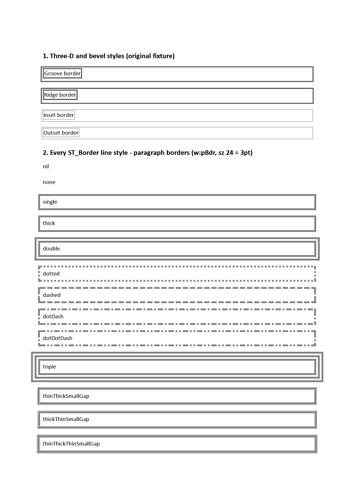
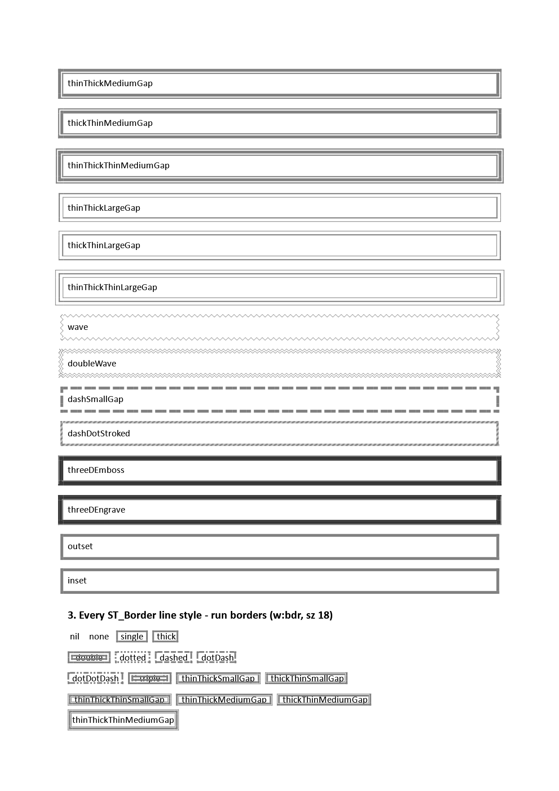
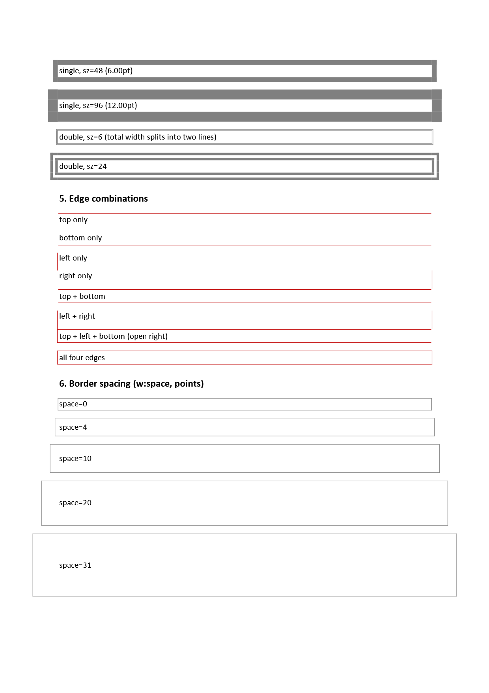
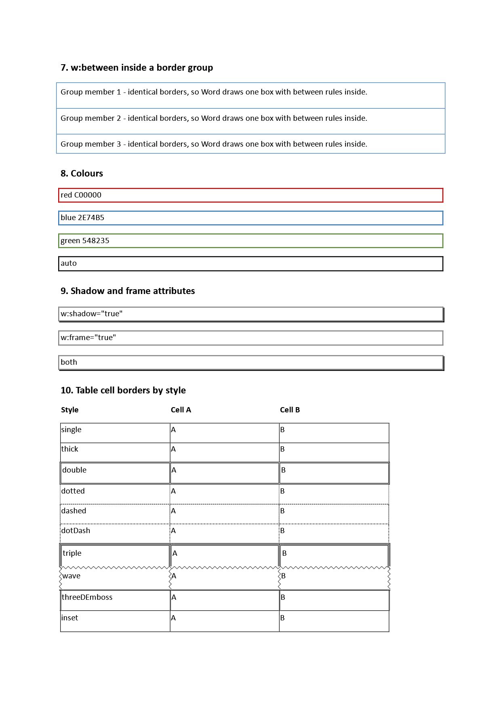
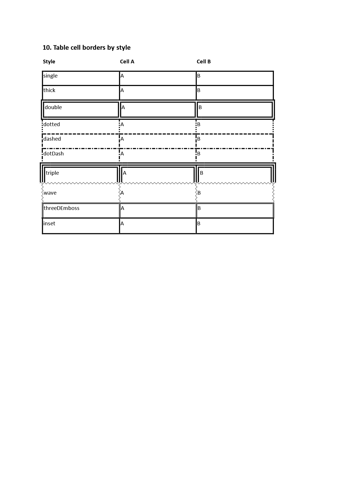

# border_style_variants

A border torture fixture: every `ST_Border` line style (ECMA-376 17.18.2) on both `w:pBdr`
edges and run `w:bdr`, plus the `w:sz` width sweep, edge combinations, `w:space`, `w:between`
grouping, colours, the `w:shadow`/`w:frame` attributes and per-style table cell borders. The
~160 art borders are page-border-only and stay with `page_borders`. Section 1 is the fixture
this scenario grew from, kept verbatim.

Word renders 4 pages and so does every backend.

**What this scenario found and fixed (2026-08-13).** Everything below was broken when the
fixture landed; the root cause was one collapse. `BorderLineStyle` held four values and
`MapBorderStyle` folded OOXML's 27 line styles into them, which lost the stroke AND — because
`ParagraphProperties.SharesBorderGroupWith` compares border records for equality — merged
adjacent paragraphs whose declared styles differed into a single box. Section 2's 27 paragraphs
drew as 6 boxes against Word's 25, and section 1's four separate boxes drew as one rectangle.
Un-collapsing the enum fixed the grouping and the stroke together; `BorderStroke` now owns the
line/gap layout and dash patterns for all three backends, and run borders (`w:bdr`) paint for
the first time.

Paragraph and cell borders have now been measured to differ in Word THREE times: the meaning of
`w:sz` (per-line for a paragraph's symmetric families, total for a cell), and the stack's
geometry (a paragraph border grows outward from the box so a wide one stays clear of the text; a
cell border straddles its edge, which is shared with the neighbour). All are direct measurements
of Word's ink — see `docs/word-features.md` (Cell Borders). Deriving one scope's rule from the
other, or from a single width, was wrong three times during this work.

**Reading the raw XML is not enough to know what a scenario's borders are.** `labels/08` scanned
as `single`-only twice; its 40 `3pt double` borders arrive through a table style. Its
`html_result.verified.html` shows what the parser actually built, and was the reliable source.

**Sizing.** Sections 2, 3 and 10 declare FAT borders (`sz=24`/`sz=18`) on purpose. At the
`sz=6` they used originally every style resolved to 1-2px, antialiasing dominated, and the
checked-in reference could not tell you what correct looked like — which is how `inset`/`outset`
were briefly modelled with a highlight Word does not draw. Section 1 stays at `sz=6` because it
is the original fixture, kept verbatim. Keep the fat sizes when editing.

`wave`/`doubleWave` render as zigzags since 2026-08-13. Word's squiggle is FIXED — declared at
sz=6, 12, 24 and 48 it draws the identical shape every time, so nothing about it scales with
`w:sz`. A single-width probe would have produced a scaling rule that does not exist.

**Still open**, and visible here:

1. The bevel styles' geometry and shading now render (see `BorderStroke`), but the block is
   fitted to one probe: Word's 6pt groove spans 19px split ~12px dark / ~3px light, modelled as
   1.2/0.3 units at 0.41x. The proportions have not been checked at other widths.
2. At `sz=96` (12pt) the band paints across the paragraph text rather than outside it, so the
   label reads "ingle, sz=96". Word keeps the text clear.
3. The thin/thick family's stack is fitted to the measurement rather than understood — see the
   `perLine` comment in `BorderStroke.Bands`.

**On the AE metric.** This scenario's recorded error is HIGH (~0.15 mean against Word) and that
is expected rather than a defect: it is a torture fixture of 25+ bordered boxes per page, so any
residual vertical drift double-counts — Morph's rule differs from white AND Word's rule differs
from white. Positional agreement is the measure that tracks fidelity here; mean distance from
each drawn rule to the nearest Word rule is 11-21px per page. Before treating a change to this
scenario as a regression, measure that instead. (The fixture was rebuilt with fat borders on
2026-08-13, so AE figures recorded against the earlier thin version do not compare.)

| Expected (Word) | Skia | ImageSharp |
| --- | --- | --- |
| **Page 1**&nbsp;&nbsp;&nbsp;&nbsp;&nbsp;&nbsp;&nbsp;&nbsp;&nbsp;&nbsp;&nbsp;&nbsp;&nbsp;&nbsp;&nbsp;&nbsp;&nbsp;&nbsp;&nbsp;&nbsp;&nbsp;&nbsp;&nbsp;&nbsp;&nbsp;&nbsp;&nbsp;&nbsp;&nbsp;&nbsp;&nbsp;&nbsp;&nbsp;&nbsp; | **Page 1. ErrorMetric: 0.1111 · SSIM: 0.7971** | **Page 1. ErrorMetric: 0.1114 · SSIM: 0.7980** |
|  |  |  |
| **Page 2**&nbsp;&nbsp;&nbsp;&nbsp;&nbsp;&nbsp;&nbsp;&nbsp;&nbsp;&nbsp;&nbsp;&nbsp;&nbsp;&nbsp;&nbsp;&nbsp;&nbsp;&nbsp;&nbsp;&nbsp;&nbsp;&nbsp;&nbsp;&nbsp;&nbsp;&nbsp;&nbsp;&nbsp;&nbsp;&nbsp;&nbsp;&nbsp;&nbsp;&nbsp; | **Page 2. ErrorMetric: 0.2346 · SSIM: 0.5450** | **Page 2. ErrorMetric: 0.2354 · SSIM: 0.5446** |
|  |  |  |
| **Page 3**&nbsp;&nbsp;&nbsp;&nbsp;&nbsp;&nbsp;&nbsp;&nbsp;&nbsp;&nbsp;&nbsp;&nbsp;&nbsp;&nbsp;&nbsp;&nbsp;&nbsp;&nbsp;&nbsp;&nbsp;&nbsp;&nbsp;&nbsp;&nbsp;&nbsp;&nbsp;&nbsp;&nbsp;&nbsp;&nbsp;&nbsp;&nbsp;&nbsp;&nbsp; | **Page 3. ErrorMetric: 0.1886 · SSIM: 0.6309** | **Page 3. ErrorMetric: 0.1884 · SSIM: 0.6310** |
|  |  |  |
| **Page 4**&nbsp;&nbsp;&nbsp;&nbsp;&nbsp;&nbsp;&nbsp;&nbsp;&nbsp;&nbsp;&nbsp;&nbsp;&nbsp;&nbsp;&nbsp;&nbsp;&nbsp;&nbsp;&nbsp;&nbsp;&nbsp;&nbsp;&nbsp;&nbsp;&nbsp;&nbsp;&nbsp;&nbsp;&nbsp;&nbsp;&nbsp;&nbsp;&nbsp;&nbsp; | **Page 4. ErrorMetric: 0.0975 · SSIM: 0.6930** | **Page 4. ErrorMetric: 0.0975 · SSIM: 0.6927** |
|  |  |  |
| **Page 5**&nbsp;&nbsp;&nbsp;&nbsp;&nbsp;&nbsp;&nbsp;&nbsp;&nbsp;&nbsp;&nbsp;&nbsp;&nbsp;&nbsp;&nbsp;&nbsp;&nbsp;&nbsp;&nbsp;&nbsp;&nbsp;&nbsp;&nbsp;&nbsp;&nbsp;&nbsp;&nbsp;&nbsp;&nbsp;&nbsp;&nbsp;&nbsp;&nbsp;&nbsp; | **Page 5. ErrorMetric: 0.0336 · SSIM: 0.9550** | **Page 5. ErrorMetric: 0.0345 · SSIM: 0.9552** |
|  |  |  |
