# All scenarios (330)

Contents

- [agendas-minutes/01](#agendas-minutes01)
- [agendas-minutes/02](#agendas-minutes02)
- [agendas-minutes/03](#agendas-minutes03)
- [agendas-minutes/04](#agendas-minutes04)
- [agendas-minutes/05](#agendas-minutes05)
- [agendas-minutes/06](#agendas-minutes06)
- [agendas-minutes/07](#agendas-minutes07)
- [agendas-minutes/08](#agendas-minutes08)
- [agendas-minutes/09](#agendas-minutes09)
- [agendas-minutes/10](#agendas-minutes10)
- [agendas-minutes/11](#agendas-minutes11)
- [agendas-minutes/12](#agendas-minutes12)
- [agendas-minutes/13](#agendas-minutes13)
- [agendas-minutes/14](#agendas-minutes14)
- [agendas-minutes/15](#agendas-minutes15)
- [agendas-minutes/16](#agendas-minutes16)
- [agendas-minutes/17](#agendas-minutes17)
- [agendas-minutes/18](#agendas-minutes18)
- [agendas-minutes/19](#agendas-minutes19)
- [align_center](#align_center)
- [align_justified](#align_justified)
- [align_left](#align_left)
- [align_mixed](#align_mixed)
- [align_right](#align_right)
- [all_caps](#all_caps)
- [bar_tabs](#bar_tabs)
- [block_quote](#block_quote)
- [bold_text](#bold_text)
- [border_style_variants](#border_style_variants)
- [brochures/01](#brochures01)
- [brochures/02](#brochures02)
- [brochures/03](#brochures03)
- [brochures/04](#brochures04)
- [brochures/05](#brochures05)
- [brochures/06](#brochures06)
- [brochures/07](#brochures07)
- [brochures/08](#brochures08)
- [bullet_list](#bullet_list)
- [business-plans/01](#business-plans01)
- [business-plans/02](#business-plans02)
- [business-plans/03](#business-plans03)
- [business-plans/04](#business-plans04)
- [business-plans/05](#business-plans05)
- [business-plans/06](#business-plans06)
- [business-plans/07](#business-plans07)
- [business-plans/08](#business-plans08)
- [business-plans/09](#business-plans09)
- [business-plans/10](#business-plans10)
- [business-plans/12](#business-plans12)
- [business-plans/13](#business-plans13)
- [business-plans/15](#business-plans15)
- [business/01](#business01)
- [business/02](#business02)
- [business/03](#business03)
- [business/04](#business04)
- [business/05](#business05)
- [business/06](#business06)
- [cards/01](#cards01)
- [cards/02](#cards02)
- [cards/03](#cards03)
- [cards/04](#cards04)
- [cards/05](#cards05)
- [cards/06](#cards06)
- [cards/07](#cards07)
- [cards/08](#cards08)
- [cards/09](#cards09)
- [cards/10](#cards10)
- [cards/11](#cards11)
- [cards/12](#cards12)
- [cards/13](#cards13)
- [cards/15](#cards15)
- [cards/16](#cards16)
- [cards/18](#cards18)
- [cards/19](#cards19)
- [colored_text](#colored_text)
- [color_transform_hsl](#color_transform_hsl)
- [color_transform_order](#color_transform_order)
- [color_transform_shade_tint](#color_transform_shade_tint)
- [color_transform_theme_fill](#color_transform_theme_fill)
- [column_breaks](#column_breaks)
- [comments/01](#comments01)
- [compatibility_mode_14](#compatibility_mode_14)
- [complex_document](#complex_document)
- [complex_spacing](#complex_spacing)
- [complex_tables](#complex_tables)
- [content_control_inline](#content_control_inline)
- [cover-letters/01](#cover-letters01)
- [cover-letters/02](#cover-letters02)
- [cover-letters/03](#cover-letters03)
- [cover-letters/04](#cover-letters04)
- [cover-letters/05](#cover-letters05)
- [cover-letters/06](#cover-letters06)
- [cover-letters/07](#cover-letters07)
- [cover-letters/08](#cover-letters08)
- [cover-letters/09](#cover-letters09)
- [cover-letters/10](#cover-letters10)
- [cover-letters/11](#cover-letters11)
- [cover-letters/12](#cover-letters12)
- [cover-letters/14](#cover-letters14)
- [cover-letters/15](#cover-letters15)
- [cover-letters/16](#cover-letters16)
- [custom_margins](#custom_margins)
- [decimal_tabs/01](#decimal_tabs01)
- [deep_nested_list](#deep_nested_list)
- [document_capture/01](#document_capture01)
- [document_protection/01](#document_protection01)
- [dot_points](#dot_points)
- [embedded_font](#embedded_font)
- [empty_paragraphs](#empty_paragraphs)
- [even_odd_headers/01](#even_odd_headers01)
- [even_odd_headers/02](#even_odd_headers02)
- [explicit_break_blank_page](#explicit_break_blank_page)
- [feature_capture/01](#feature_capture01)
- [field_codes_simple/01](#field_codes_simple01)
- [first_line_indent](#first_line_indent)
- [font_families](#font_families)
- [font_sizes](#font_sizes)
- [footer](#footer)
- [form_checkboxes](#form_checkboxes)
- [form_dropdowns](#form_dropdowns)
- [form_text_fields](#form_text_fields)
- [gutter_margins/01](#gutter_margins01)
- [hanging_indent](#hanging_indent)
- [header](#header)
- [header_banner_table](#header_banner_table)
- [header_footer](#header_footer)
- [header_full_bleed_banner](#header_full_bleed_banner)
- [header_row_repeat/01](#header_row_repeat01)
- [headings](#headings)
- [html_basic_formatting](#html_basic_formatting)
- [html_complex](#html_complex)
- [html_css_alignment](#html_css_alignment)
- [html_css_borders](#html_css_borders)
- [html_css_colors](#html_css_colors)
- [html_css_margin_padding](#html_css_margin_padding)
- [html_font_tag](#html_font_tag)
- [html_headings](#html_headings)
- [html_images](#html_images)
- [html_inline_styles](#html_inline_styles)
- [html_links](#html_links)
- [html_lists](#html_lists)
- [html_nested_lists](#html_nested_lists)
- [html_paragraphs](#html_paragraphs)
- [html_table](#html_table)
- [html_table_cellpadding](#html_table_cellpadding)
- [html_table_cell_margin_css](#html_table_cell_margin_css)
- [html_table_cell_padding_css](#html_table_cell_padding_css)
- [html_table_styled](#html_table_styled)
- [hyperlinks](#hyperlinks)
- [hyphenation_auto](#hyphenation_auto)
- [hyphenation_nonbreaking](#hyphenation_nonbreaking)
- [hyphenation_soft](#hyphenation_soft)
- [hyphenation_suppressed](#hyphenation_suppressed)
- [icons_multiple](#icons_multiple)
- [icon_svg](#icon_svg)
- [icon_with_text](#icon_with_text)
- [image_cropping/01](#image_cropping01)
- [image_rotation/01](#image_rotation01)
- [image_wrap_square](#image_wrap_square)
- [inline_group_crop](#inline_group_crop)
- [inline_group_rotation](#inline_group_rotation)
- [inline_image](#inline_image)
- [inline_shape_arrows](#inline_shape_arrows)
- [italic_text](#italic_text)
- [labels/01](#labels01)
- [labels/02](#labels02)
- [labels/03](#labels03)
- [labels/04](#labels04)
- [labels/05](#labels05)
- [labels/06](#labels06)
- [labels/07](#labels07)
- [labels/08](#labels08)
- [labels/09](#labels09)
- [labels/10](#labels10)
- [labels/11](#labels11)
- [labels/12](#labels12)
- [labels/13](#labels13)
- [labels/14](#labels14)
- [labels/15](#labels15)
- [labels/16](#labels16)
- [left_indent](#left_indent)
- [letters/01](#letters01)
- [letters/02](#letters02)
- [letters/03](#letters03)
- [letters/04](#letters04)
- [letters/05](#letters05)
- [letters/06](#letters06)
- [letters/07](#letters07)
- [letters/08](#letters08)
- [letters/09](#letters09)
- [letters/10](#letters10)
- [letters/11](#letters11)
- [letters/12](#letters12)
- [letters/13](#letters13)
- [line_breaks](#line_breaks)
- [line_numbers_continuous](#line_numbers_continuous)
- [line_numbers_count_by_5](#line_numbers_count_by_5)
- [line_numbers_custom_distance](#line_numbers_custom_distance)
- [line_numbers_restart_page](#line_numbers_restart_page)
- [line_numbers_restart_section](#line_numbers_restart_section)
- [line_numbers_suppressed](#line_numbers_suppressed)
- [line_spacing](#line_spacing)
- [line_spacing_at_least](#line_spacing_at_least)
- [line_spacing_exactly](#line_spacing_exactly)
- [long_paragraph](#long_paragraph)
- [menus/01](#menus01)
- [menus/02](#menus02)
- [menus/03](#menus03)
- [menus/04](#menus04)
- [menus/05](#menus05)
- [menus/06](#menus06)
- [menus/07](#menus07)
- [menus/08](#menus08)
- [menus/09](#menus09)
- [mixed_breaks](#mixed_breaks)
- [mixed_formatting](#mixed_formatting)
- [multiple_images](#multiple_images)
- [multiple_pages](#multiple_pages)
- [multiple_paragraphs](#multiple_paragraphs)
- [nested_list](#nested_list)
- [newsletters/01](#newsletters01)
- [newsletters/02](#newsletters02)
- [newsletters/03](#newsletters03)
- [newsletters/04](#newsletters04)
- [newsletters/05](#newsletters05)
- [newsletters/06](#newsletters06)
- [newsletters/07](#newsletters07)
- [newsletters/08](#newsletters08)
- [newsletters/09](#newsletters09)
- [newsletters/10](#newsletters10)
- [newsletters/11](#newsletters11)
- [newsletters/12](#newsletters12)
- [newsletters/13](#newsletters13)
- [newsletters/14](#newsletters14)
- [nonstandard_main_part_name](#nonstandard_main_part_name)
- [numbered_list](#numbered_list)
- [numbered_list_restart](#numbered_list_restart)
- [numbered_list_tracking](#numbered_list_tracking)
- [office_math](#office_math)
- [page_a4](#page_a4)
- [page_borders/01](#page_borders01)
- [page_breaks](#page_breaks)
- [page_landscape](#page_landscape)
- [page_legal](#page_legal)
- [page_letter](#page_letter)
- [page_numbers](#page_numbers)
- [paragraph_borders](#paragraph_borders)
- [paragraph_spacing](#paragraph_spacing)
- [pct_pos_offset](#pct_pos_offset)
- [postcards/02](#postcards02)
- [postcards/03](#postcards03)
- [postcards/04](#postcards04)
- [resumes/01](#resumes01)
- [resumes/02](#resumes02)
- [resumes/03](#resumes03)
- [resumes/04](#resumes04)
- [resumes/05](#resumes05)
- [resumes/06](#resumes06)
- [resumes/07](#resumes07)
- [resumes/08](#resumes08)
- [resumes/09](#resumes09)
- [resumes/10](#resumes10)
- [resumes/11](#resumes11)
- [resumes/12](#resumes12)
- [resumes/13](#resumes13)
- [resumes/14](#resumes14)
- [resumes/15](#resumes15)
- [resumes/16](#resumes16)
- [resumes/17](#resumes17)
- [resumes/18](#resumes18)
- [resumes/19](#resumes19)
- [rtl_paragraph](#rtl_paragraph)
- [section_break_continuous](#section_break_continuous)
- [section_break_even_page](#section_break_even_page)
- [section_break_next_page](#section_break_next_page)
- [section_break_odd_page](#section_break_odd_page)
- [simple_paragraph](#simple_paragraph)
- [simple_table](#simple_table)
- [small_caps](#small_caps)
- [strikethrough_text](#strikethrough_text)
- [subscript_superscript](#subscript_superscript)
- [table_alignment/01](#table_alignment01)
- [table_autofit_no_widths](#table_autofit_no_widths)
- [table_borders](#table_borders)
- [table_cell_margin_per_cell](#table_cell_margin_per_cell)
- [table_cell_padding](#table_cell_padding)
- [table_cell_padding_varied](#table_cell_padding_varied)
- [table_cell_spacing/01](#table_cell_spacing01)
- [table_colors](#table_colors)
- [table_default_cell_margin](#table_default_cell_margin)
- [table_default_cell_margin_start_end](#table_default_cell_margin_start_end)
- [table_default_style](#table_default_style)
- [table_default_style_first_row_run_color](#table_default_style_first_row_run_color)
- [table_default_style_first_row_shading](#table_default_style_first_row_shading)
- [table_default_style_inside_h](#table_default_style_inside_h)
- [table_default_style_outer_borders](#table_default_style_outer_borders)
- [table_diagonal_borders/01](#table_diagonal_borders01)
- [table_explicit_heights](#table_explicit_heights)
- [table_grid_styling_padding](#table_grid_styling_padding)
- [table_indent](#table_indent)
- [table_layout_tall_row](#table_layout_tall_row)
- [table_multipage](#table_multipage)
- [table_of_contents/01](#table_of_contents01)
- [table_of_contents/02](#table_of_contents02)
- [table_of_contents/03](#table_of_contents03)
- [table_page_break](#table_page_break)
- [table_text_direction](#table_text_direction)
- [table_two_column_layout](#table_two_column_layout)
- [table_vmerge_basic](#table_vmerge_basic)
- [table_vmerge_explicit_heights](#table_vmerge_explicit_heights)
- [tab_stops](#tab_stops)
- [text_wrapping_break](#text_wrapping_break)
- [three_columns](#three_columns)
- [tracked_changes/01](#tracked_changes01)
- [two_columns](#two_columns)
- [underline_text](#underline_text)
- [wedding/01](#wedding01)
- [wedding/02](#wedding02)
- [wedding/03](#wedding03)
- [wedding/04](#wedding04)
- [wedding/05](#wedding05)
- [wedding/06](#wedding06)
- [wedding/07](#wedding07)
- [wedding/08](#wedding08)
- [wedding/09](#wedding09)
- [wedding/10](#wedding10)
- [wedding/11](#wedding11)
- [wide_table](#wide_table)
- [wordart](#wordart)
- [wordart-envelope](#wordart-envelope)

## agendas-minutes/01

| Expected (Word) | Skia | ImageSharp |
| --- | --- | --- |
| **Page 1**&nbsp;&nbsp;&nbsp;&nbsp;&nbsp;&nbsp;&nbsp;&nbsp;&nbsp;&nbsp;&nbsp;&nbsp;&nbsp;&nbsp;&nbsp;&nbsp;&nbsp;&nbsp;&nbsp;&nbsp;&nbsp;&nbsp;&nbsp;&nbsp;&nbsp;&nbsp;&nbsp;&nbsp;&nbsp;&nbsp;&nbsp;&nbsp;&nbsp;&nbsp; | **Page 1. ErrorMetric: 0.0630 · SSIM: 0.8349** | **Page 1. ErrorMetric: 0.0684 · SSIM: 0.8263** |
|  |  |  |

## agendas-minutes/02

| Expected (Word) | Skia | ImageSharp |
| --- | --- | --- |
| **Page 1**&nbsp;&nbsp;&nbsp;&nbsp;&nbsp;&nbsp;&nbsp;&nbsp;&nbsp;&nbsp;&nbsp;&nbsp;&nbsp;&nbsp;&nbsp;&nbsp;&nbsp;&nbsp;&nbsp;&nbsp;&nbsp;&nbsp;&nbsp;&nbsp;&nbsp;&nbsp;&nbsp;&nbsp;&nbsp;&nbsp;&nbsp;&nbsp;&nbsp;&nbsp; | **Page 1. ErrorMetric: 0.3001 · SSIM: 0.8463** | **Page 1. ErrorMetric: 0.2979 · SSIM: 0.8574** |
|  |  |  |
| **Page 2**&nbsp;&nbsp;&nbsp;&nbsp;&nbsp;&nbsp;&nbsp;&nbsp;&nbsp;&nbsp;&nbsp;&nbsp;&nbsp;&nbsp;&nbsp;&nbsp;&nbsp;&nbsp;&nbsp;&nbsp;&nbsp;&nbsp;&nbsp;&nbsp;&nbsp;&nbsp;&nbsp;&nbsp;&nbsp;&nbsp;&nbsp;&nbsp;&nbsp;&nbsp; | **Page 2. ErrorMetric: 0.1380 · SSIM: 0.9393** | **Page 2. ErrorMetric: 0.1285 · SSIM: 0.9609** |
|  |  |  |

## agendas-minutes/03

| Expected (Word) | Skia | ImageSharp |
| --- | --- | --- |
| **Page 1**&nbsp;&nbsp;&nbsp;&nbsp;&nbsp;&nbsp;&nbsp;&nbsp;&nbsp;&nbsp;&nbsp;&nbsp;&nbsp;&nbsp;&nbsp;&nbsp;&nbsp;&nbsp;&nbsp;&nbsp;&nbsp;&nbsp;&nbsp;&nbsp;&nbsp;&nbsp;&nbsp;&nbsp;&nbsp;&nbsp;&nbsp;&nbsp;&nbsp;&nbsp; | **Page 1. ErrorMetric: 0.0440 · SSIM: 0.9381** | **Page 1. ErrorMetric: 0.0495 · SSIM: 0.9032** |
| 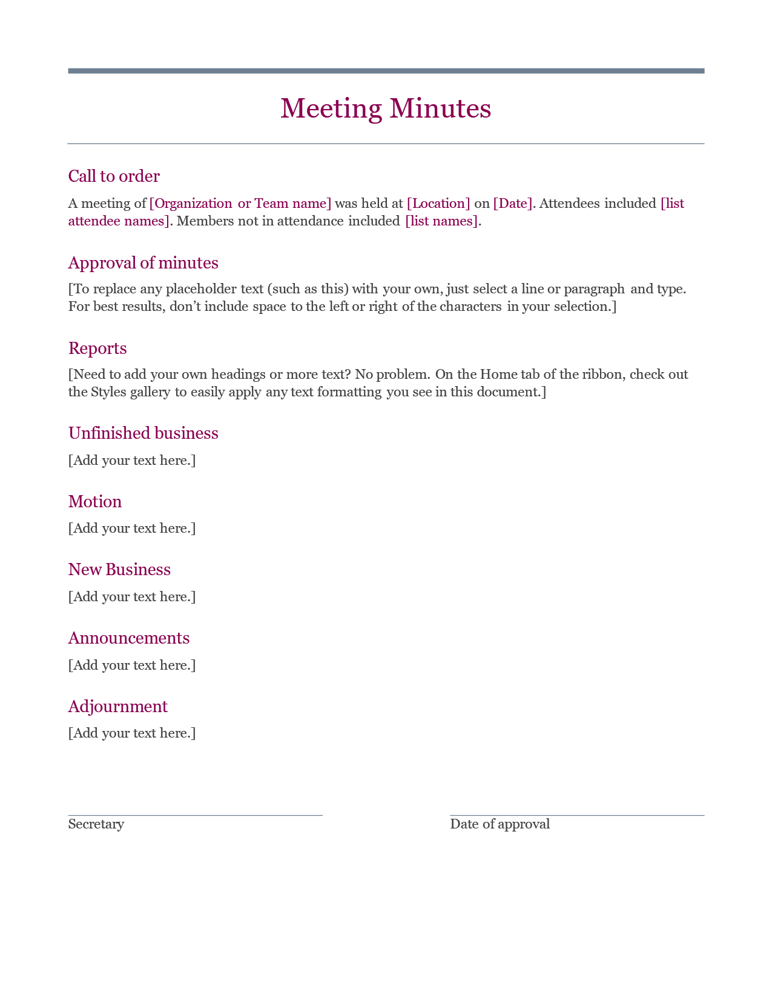 |  |  |

## agendas-minutes/04

| Expected (Word) | Skia | ImageSharp |
| --- | --- | --- |
| **Page 1**&nbsp;&nbsp;&nbsp;&nbsp;&nbsp;&nbsp;&nbsp;&nbsp;&nbsp;&nbsp;&nbsp;&nbsp;&nbsp;&nbsp;&nbsp;&nbsp;&nbsp;&nbsp;&nbsp;&nbsp;&nbsp;&nbsp;&nbsp;&nbsp;&nbsp;&nbsp;&nbsp;&nbsp;&nbsp;&nbsp;&nbsp;&nbsp;&nbsp;&nbsp; | **Page 1. ErrorMetric: 0.0400 · SSIM: 0.9161** | **Page 1. ErrorMetric: 0.0453 · SSIM: 0.9010** |
|  |  |  |

## agendas-minutes/05

| Expected (Word) | Skia | ImageSharp |
| --- | --- | --- |
| **Page 1**&nbsp;&nbsp;&nbsp;&nbsp;&nbsp;&nbsp;&nbsp;&nbsp;&nbsp;&nbsp;&nbsp;&nbsp;&nbsp;&nbsp;&nbsp;&nbsp;&nbsp;&nbsp;&nbsp;&nbsp;&nbsp;&nbsp;&nbsp;&nbsp;&nbsp;&nbsp;&nbsp;&nbsp;&nbsp;&nbsp;&nbsp;&nbsp;&nbsp;&nbsp; | **Page 1. ErrorMetric: 0.0336 · SSIM: 0.9297** | **Page 1. ErrorMetric: 0.0396 · SSIM: 0.9158** |
|  |  |  |

## agendas-minutes/06

| Expected (Word) | Skia | ImageSharp |
| --- | --- | --- |
| **Page 1**&nbsp;&nbsp;&nbsp;&nbsp;&nbsp;&nbsp;&nbsp;&nbsp;&nbsp;&nbsp;&nbsp;&nbsp;&nbsp;&nbsp;&nbsp;&nbsp;&nbsp;&nbsp;&nbsp;&nbsp;&nbsp;&nbsp;&nbsp;&nbsp;&nbsp;&nbsp;&nbsp;&nbsp;&nbsp;&nbsp;&nbsp;&nbsp;&nbsp;&nbsp; | **Page 1. ErrorMetric: 0.0509 · SSIM: 0.8820** | **Page 1. ErrorMetric: 0.0557 · SSIM: 0.8740** |
|  |  |  |

## agendas-minutes/07

| Expected (Word) | Skia | ImageSharp |
| --- | --- | --- |
| **Page 1**&nbsp;&nbsp;&nbsp;&nbsp;&nbsp;&nbsp;&nbsp;&nbsp;&nbsp;&nbsp;&nbsp;&nbsp;&nbsp;&nbsp;&nbsp;&nbsp;&nbsp;&nbsp;&nbsp;&nbsp;&nbsp;&nbsp;&nbsp;&nbsp;&nbsp;&nbsp;&nbsp;&nbsp;&nbsp;&nbsp;&nbsp;&nbsp;&nbsp;&nbsp; | **Page 1. ErrorMetric: 0.0627 · SSIM: 0.8851** | **Page 1. ErrorMetric: 0.0734 · SSIM: 0.8625** |
|  |  |  |
| **Page 2**&nbsp;&nbsp;&nbsp;&nbsp;&nbsp;&nbsp;&nbsp;&nbsp;&nbsp;&nbsp;&nbsp;&nbsp;&nbsp;&nbsp;&nbsp;&nbsp;&nbsp;&nbsp;&nbsp;&nbsp;&nbsp;&nbsp;&nbsp;&nbsp;&nbsp;&nbsp;&nbsp;&nbsp;&nbsp;&nbsp;&nbsp;&nbsp;&nbsp;&nbsp; | **Page 2. ErrorMetric: 0.0440 · SSIM: 0.9090** | **Page 2. ErrorMetric: 0.0472 · SSIM: 0.8972** |
|  |  |  |

## agendas-minutes/08

| Expected (Word) | Skia | ImageSharp |
| --- | --- | --- |
| **Page 1**&nbsp;&nbsp;&nbsp;&nbsp;&nbsp;&nbsp;&nbsp;&nbsp;&nbsp;&nbsp;&nbsp;&nbsp;&nbsp;&nbsp;&nbsp;&nbsp;&nbsp;&nbsp;&nbsp;&nbsp;&nbsp;&nbsp;&nbsp;&nbsp;&nbsp;&nbsp;&nbsp;&nbsp;&nbsp;&nbsp;&nbsp;&nbsp;&nbsp;&nbsp; | **Page 1. ErrorMetric: 0.0707 · SSIM: 0.8767** | **Page 1. ErrorMetric: 0.0759 · SSIM: 0.8446** |
|  |  |  |
| **Page 2**&nbsp;&nbsp;&nbsp;&nbsp;&nbsp;&nbsp;&nbsp;&nbsp;&nbsp;&nbsp;&nbsp;&nbsp;&nbsp;&nbsp;&nbsp;&nbsp;&nbsp;&nbsp;&nbsp;&nbsp;&nbsp;&nbsp;&nbsp;&nbsp;&nbsp;&nbsp;&nbsp;&nbsp;&nbsp;&nbsp;&nbsp;&nbsp;&nbsp;&nbsp; | **Page 2. ErrorMetric: 0.0220 · SSIM: 0.9634** | **Page 2. ErrorMetric: 0.0243 · SSIM: 0.9488** |
|  |  |  |

## agendas-minutes/09

| Expected (Word) | Skia | ImageSharp |
| --- | --- | --- |
| **Page 1**&nbsp;&nbsp;&nbsp;&nbsp;&nbsp;&nbsp;&nbsp;&nbsp;&nbsp;&nbsp;&nbsp;&nbsp;&nbsp;&nbsp;&nbsp;&nbsp;&nbsp;&nbsp;&nbsp;&nbsp;&nbsp;&nbsp;&nbsp;&nbsp;&nbsp;&nbsp;&nbsp;&nbsp;&nbsp;&nbsp;&nbsp;&nbsp;&nbsp;&nbsp; | **Page 1. ErrorMetric: 0.0413 · SSIM: 0.9413** | **Page 1. ErrorMetric: 0.0519 · SSIM: 0.8999** |
|  |  |  |

## agendas-minutes/10

### Top-right flower silhouette renders via the custGeom path renderer

The decorative pink leaf cluster in the top-right is a `wsp` with `<a:custGeom>` whose single
`<a:path>` holds **277 separate closed contours** (277 `moveTo`, 275 `close`) built from 2442
cubic Béziers, with a solid fill. `ShapeParser.ExtractSubpaths` flattens the curves and keeps
each `moveTo`…`close` run as its own contour, so the renderers fill a multi-contour path
(SkiaSharp `SKPath`, ImageSharp `PathBuilder`) with **nonzero winding** — the DrawingML default.

This is the scenario that motivated the path renderer: collapsing every `moveTo` into one
polyline (the earlier behaviour) fused the 277 contours into a single self-crossing blob joined
by connector lines. Keeping the contours separate reproduces Word's crisp leaf outlines.
ArcTo-based custGeom is still unsupported and falls back to the bounding rect.

| Expected (Word) | Skia | ImageSharp |
| --- | --- | --- |
| **Page 1**&nbsp;&nbsp;&nbsp;&nbsp;&nbsp;&nbsp;&nbsp;&nbsp;&nbsp;&nbsp;&nbsp;&nbsp;&nbsp;&nbsp;&nbsp;&nbsp;&nbsp;&nbsp;&nbsp;&nbsp;&nbsp;&nbsp;&nbsp;&nbsp;&nbsp;&nbsp;&nbsp;&nbsp;&nbsp;&nbsp;&nbsp;&nbsp;&nbsp;&nbsp; | **Page 1. ErrorMetric: 0.0429 · SSIM: 0.9300** | **Page 1. ErrorMetric: 0.0521 · SSIM: 0.9090** |
|  |  |  |

## agendas-minutes/11

| Expected (Word) | Skia | ImageSharp |
| --- | --- | --- |
| **Page 1**&nbsp;&nbsp;&nbsp;&nbsp;&nbsp;&nbsp;&nbsp;&nbsp;&nbsp;&nbsp;&nbsp;&nbsp;&nbsp;&nbsp;&nbsp;&nbsp;&nbsp;&nbsp;&nbsp;&nbsp;&nbsp;&nbsp;&nbsp;&nbsp;&nbsp;&nbsp;&nbsp;&nbsp;&nbsp;&nbsp;&nbsp;&nbsp;&nbsp;&nbsp; | **Page 1. ErrorMetric: 0.0463 · SSIM: 0.9159** | **Page 1. ErrorMetric: 0.0526 · SSIM: 0.8939** |
|  |  |  |

## agendas-minutes/12

| Expected (Word) | Skia | ImageSharp |
| --- | --- | --- |
| **Page 1**&nbsp;&nbsp;&nbsp;&nbsp;&nbsp;&nbsp;&nbsp;&nbsp;&nbsp;&nbsp;&nbsp;&nbsp;&nbsp;&nbsp;&nbsp;&nbsp;&nbsp;&nbsp;&nbsp;&nbsp;&nbsp;&nbsp;&nbsp;&nbsp;&nbsp;&nbsp;&nbsp;&nbsp;&nbsp;&nbsp;&nbsp;&nbsp;&nbsp;&nbsp; | **Page 1. ErrorMetric: 0.0267 · SSIM: 0.9619** | **Page 1. ErrorMetric: 0.0289 · SSIM: 0.9561** |
|  |  |  |

## agendas-minutes/13

| Expected (Word) | Skia | ImageSharp |
| --- | --- | --- |
| **Page 1**&nbsp;&nbsp;&nbsp;&nbsp;&nbsp;&nbsp;&nbsp;&nbsp;&nbsp;&nbsp;&nbsp;&nbsp;&nbsp;&nbsp;&nbsp;&nbsp;&nbsp;&nbsp;&nbsp;&nbsp;&nbsp;&nbsp;&nbsp;&nbsp;&nbsp;&nbsp;&nbsp;&nbsp;&nbsp;&nbsp;&nbsp;&nbsp;&nbsp;&nbsp; | **Page 1. ErrorMetric: 0.0826 · SSIM: 0.8213** | **Page 1. ErrorMetric: 0.0831 · SSIM: 0.8181** |
|  |  |  |

## agendas-minutes/14

| Expected (Word) | Skia | ImageSharp |
| --- | --- | --- |
| **Page 1**&nbsp;&nbsp;&nbsp;&nbsp;&nbsp;&nbsp;&nbsp;&nbsp;&nbsp;&nbsp;&nbsp;&nbsp;&nbsp;&nbsp;&nbsp;&nbsp;&nbsp;&nbsp;&nbsp;&nbsp;&nbsp;&nbsp;&nbsp;&nbsp;&nbsp;&nbsp;&nbsp;&nbsp;&nbsp;&nbsp;&nbsp;&nbsp;&nbsp;&nbsp; | **Page 1. ErrorMetric: 0.0550 · SSIM: 0.8726** | **Page 1. ErrorMetric: 0.0568 · SSIM: 0.8688** |
| 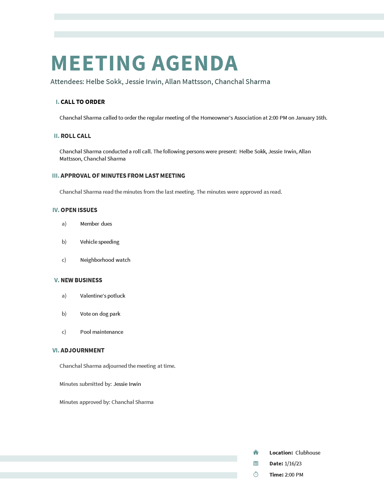 |  |  |

## agendas-minutes/15

| Expected (Word) | Skia | ImageSharp |
| --- | --- | --- |
| **Page 1**&nbsp;&nbsp;&nbsp;&nbsp;&nbsp;&nbsp;&nbsp;&nbsp;&nbsp;&nbsp;&nbsp;&nbsp;&nbsp;&nbsp;&nbsp;&nbsp;&nbsp;&nbsp;&nbsp;&nbsp;&nbsp;&nbsp;&nbsp;&nbsp;&nbsp;&nbsp;&nbsp;&nbsp;&nbsp;&nbsp;&nbsp;&nbsp;&nbsp;&nbsp; | **Page 1. ErrorMetric: 0.0771 · SSIM: 0.8906** | **Page 1. ErrorMetric: 0.0859 · SSIM: 0.8418** |
|  |  |  |

## agendas-minutes/16

### Decorative shapes are SVG with raster fallback

The pink leaf in the top-right (and the dot patterns in the corners) ship as both an SVG (`a:svgBlip` extension) and a PNG raster fallback. Skia renders the SVG via `Svg.Skia`; ImageSharp can't render SVG (`PageRendererBase.CanRenderContentType` returns false for `image/svg+xml`) and falls back to the PNG. Both paths now honour `<a:srcRect>` cropping — see `RenderSvgImage` in `Morph.Skia/SkiaPageRenderer.cs` for the SVG-specific implementation.

Pixel-level differences between Skia's SVG render and Word's renderer remain (gradient interpolation, anti-aliasing) — the verified PNGs lock in our renderer's output, not perfect Word fidelity.

| Expected (Word) | Skia | ImageSharp |
| --- | --- | --- |
| **Page 1**&nbsp;&nbsp;&nbsp;&nbsp;&nbsp;&nbsp;&nbsp;&nbsp;&nbsp;&nbsp;&nbsp;&nbsp;&nbsp;&nbsp;&nbsp;&nbsp;&nbsp;&nbsp;&nbsp;&nbsp;&nbsp;&nbsp;&nbsp;&nbsp;&nbsp;&nbsp;&nbsp;&nbsp;&nbsp;&nbsp;&nbsp;&nbsp;&nbsp;&nbsp; | **Page 1. ErrorMetric: 0.1043 · SSIM: 0.9066** | **Page 1. ErrorMetric: 0.1076 · SSIM: 0.8915** |
| 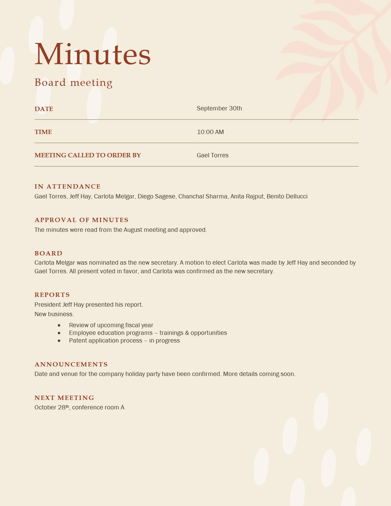 |  |  |

## agendas-minutes/17

| Expected (Word) | Skia | ImageSharp |
| --- | --- | --- |
| **Page 1**&nbsp;&nbsp;&nbsp;&nbsp;&nbsp;&nbsp;&nbsp;&nbsp;&nbsp;&nbsp;&nbsp;&nbsp;&nbsp;&nbsp;&nbsp;&nbsp;&nbsp;&nbsp;&nbsp;&nbsp;&nbsp;&nbsp;&nbsp;&nbsp;&nbsp;&nbsp;&nbsp;&nbsp;&nbsp;&nbsp;&nbsp;&nbsp;&nbsp;&nbsp; | **Page 1. ErrorMetric: 0.0311 · SSIM: 0.9514** | **Page 1. ErrorMetric: 0.0440 · SSIM: 0.9153** |
| 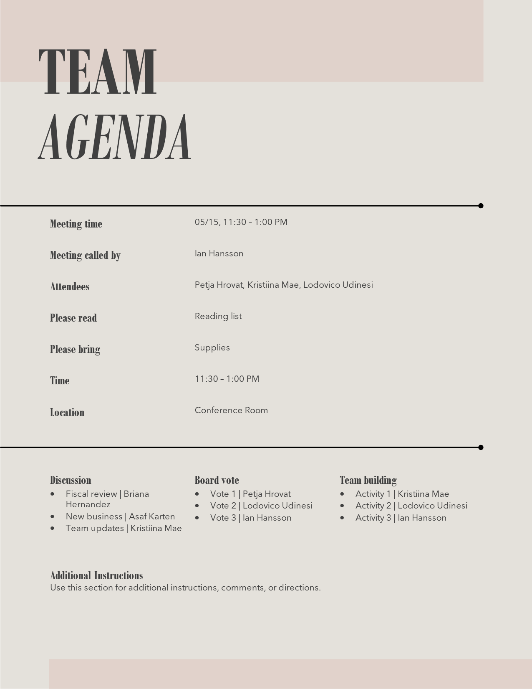 |  |  |

## agendas-minutes/18

| Expected (Word) | Skia | ImageSharp |
| --- | --- | --- |
| **Page 1**&nbsp;&nbsp;&nbsp;&nbsp;&nbsp;&nbsp;&nbsp;&nbsp;&nbsp;&nbsp;&nbsp;&nbsp;&nbsp;&nbsp;&nbsp;&nbsp;&nbsp;&nbsp;&nbsp;&nbsp;&nbsp;&nbsp;&nbsp;&nbsp;&nbsp;&nbsp;&nbsp;&nbsp;&nbsp;&nbsp;&nbsp;&nbsp;&nbsp;&nbsp; | **Page 1. ErrorMetric: 0.0536 · SSIM: 0.9397** | **Page 1. ErrorMetric: 0.0679 · SSIM: 0.8701** |
|  |  |  |

## agendas-minutes/19

### Empty table rows render shorter than Word

The 17 empty rows in the contact table use `<w:trHeight w:val="432"/>` (21.6pt) with no `hRule`. Word renders them at ~30pt; we render at ~25pt. The document has `<w:docGrid w:linePitch="360"/>` (18pt), and Word treats `linePitch` as a per-line minimum even inside table cells. We honour this in `LayoutParagraphForMeasurement` (Skia + ImageSharp), but only for empty paragraphs — applying it to non-empty paragraphs broke other scenarios (e.g. `agendas-minutes/02`'s short data rows).

The remaining ~5pt gap (linePitch 18 + cell padding 7.2 = 25.2pt vs Word's 30pt) isn't fully decoded. Word likely adds extra leading or interprets `trHeight` differently when `linePitch` is present, but a clean formula would need empirical sweeps across more docs.

| Expected (Word) | Skia | ImageSharp |
| --- | --- | --- |
| **Page 1**&nbsp;&nbsp;&nbsp;&nbsp;&nbsp;&nbsp;&nbsp;&nbsp;&nbsp;&nbsp;&nbsp;&nbsp;&nbsp;&nbsp;&nbsp;&nbsp;&nbsp;&nbsp;&nbsp;&nbsp;&nbsp;&nbsp;&nbsp;&nbsp;&nbsp;&nbsp;&nbsp;&nbsp;&nbsp;&nbsp;&nbsp;&nbsp;&nbsp;&nbsp; | **Page 1. ErrorMetric: 0.1293 · SSIM: 0.7002** | **Page 1. ErrorMetric: 0.1313 · SSIM: 0.6995** |
|  |  |  |

## align_center

| Expected (Word) | Skia | ImageSharp |
| --- | --- | --- |
| **Page 1**&nbsp;&nbsp;&nbsp;&nbsp;&nbsp;&nbsp;&nbsp;&nbsp;&nbsp;&nbsp;&nbsp;&nbsp;&nbsp;&nbsp;&nbsp;&nbsp;&nbsp;&nbsp;&nbsp;&nbsp;&nbsp;&nbsp;&nbsp;&nbsp;&nbsp;&nbsp;&nbsp;&nbsp;&nbsp;&nbsp;&nbsp;&nbsp;&nbsp;&nbsp; | **Page 1. ErrorMetric: 0.0052 · SSIM: 0.9909** | **Page 1. ErrorMetric: 0.0055 · SSIM: 0.9899** |
|  |  |  |

## align_justified

| Expected (Word) | Skia | ImageSharp |
| --- | --- | --- |
| **Page 1**&nbsp;&nbsp;&nbsp;&nbsp;&nbsp;&nbsp;&nbsp;&nbsp;&nbsp;&nbsp;&nbsp;&nbsp;&nbsp;&nbsp;&nbsp;&nbsp;&nbsp;&nbsp;&nbsp;&nbsp;&nbsp;&nbsp;&nbsp;&nbsp;&nbsp;&nbsp;&nbsp;&nbsp;&nbsp;&nbsp;&nbsp;&nbsp;&nbsp;&nbsp; | **Page 1. ErrorMetric: 0.0125 · SSIM: 0.9797** | **Page 1. ErrorMetric: 0.0127 · SSIM: 0.9757** |
|  |  |  |

## align_left

| Expected (Word) | Skia | ImageSharp |
| --- | --- | --- |
| **Page 1**&nbsp;&nbsp;&nbsp;&nbsp;&nbsp;&nbsp;&nbsp;&nbsp;&nbsp;&nbsp;&nbsp;&nbsp;&nbsp;&nbsp;&nbsp;&nbsp;&nbsp;&nbsp;&nbsp;&nbsp;&nbsp;&nbsp;&nbsp;&nbsp;&nbsp;&nbsp;&nbsp;&nbsp;&nbsp;&nbsp;&nbsp;&nbsp;&nbsp;&nbsp; | **Page 1. ErrorMetric: 0.0069 · SSIM: 0.9866** | **Page 1. ErrorMetric: 0.0071 · SSIM: 0.9859** |
|  |  |  |

## align_mixed

| Expected (Word) | Skia | ImageSharp |
| --- | --- | --- |
| **Page 1**&nbsp;&nbsp;&nbsp;&nbsp;&nbsp;&nbsp;&nbsp;&nbsp;&nbsp;&nbsp;&nbsp;&nbsp;&nbsp;&nbsp;&nbsp;&nbsp;&nbsp;&nbsp;&nbsp;&nbsp;&nbsp;&nbsp;&nbsp;&nbsp;&nbsp;&nbsp;&nbsp;&nbsp;&nbsp;&nbsp;&nbsp;&nbsp;&nbsp;&nbsp; | **Page 1. ErrorMetric: 0.0085 · SSIM: 0.9854** | **Page 1. ErrorMetric: 0.0088 · SSIM: 0.9838** |
|  |  |  |

## align_right

| Expected (Word) | Skia | ImageSharp |
| --- | --- | --- |
| **Page 1**&nbsp;&nbsp;&nbsp;&nbsp;&nbsp;&nbsp;&nbsp;&nbsp;&nbsp;&nbsp;&nbsp;&nbsp;&nbsp;&nbsp;&nbsp;&nbsp;&nbsp;&nbsp;&nbsp;&nbsp;&nbsp;&nbsp;&nbsp;&nbsp;&nbsp;&nbsp;&nbsp;&nbsp;&nbsp;&nbsp;&nbsp;&nbsp;&nbsp;&nbsp; | **Page 1. ErrorMetric: 0.0029 · SSIM: 0.9949** | **Page 1. ErrorMetric: 0.0031 · SSIM: 0.9941** |
|  |  |  |

## all_caps

| Expected (Word) | Skia | ImageSharp |
| --- | --- | --- |
| **Page 1**&nbsp;&nbsp;&nbsp;&nbsp;&nbsp;&nbsp;&nbsp;&nbsp;&nbsp;&nbsp;&nbsp;&nbsp;&nbsp;&nbsp;&nbsp;&nbsp;&nbsp;&nbsp;&nbsp;&nbsp;&nbsp;&nbsp;&nbsp;&nbsp;&nbsp;&nbsp;&nbsp;&nbsp;&nbsp;&nbsp;&nbsp;&nbsp;&nbsp;&nbsp; | **Page 1. ErrorMetric: 0.0021 · SSIM: 0.9963** | **Page 1. ErrorMetric: 0.0024 · SSIM: 0.9953** |
|  |  |  |

## bar_tabs

| Expected (Word) | Skia | ImageSharp |
| --- | --- | --- |
| **Page 1**&nbsp;&nbsp;&nbsp;&nbsp;&nbsp;&nbsp;&nbsp;&nbsp;&nbsp;&nbsp;&nbsp;&nbsp;&nbsp;&nbsp;&nbsp;&nbsp;&nbsp;&nbsp;&nbsp;&nbsp;&nbsp;&nbsp;&nbsp;&nbsp;&nbsp;&nbsp;&nbsp;&nbsp;&nbsp;&nbsp;&nbsp;&nbsp;&nbsp;&nbsp; | **Page 1. ErrorMetric: 0.0061 · SSIM: 0.9879** | **Page 1. ErrorMetric: 0.0066 · SSIM: 0.9863** |
|  |  |  |

## block_quote

| Expected (Word) | Skia | ImageSharp |
| --- | --- | --- |
| **Page 1**&nbsp;&nbsp;&nbsp;&nbsp;&nbsp;&nbsp;&nbsp;&nbsp;&nbsp;&nbsp;&nbsp;&nbsp;&nbsp;&nbsp;&nbsp;&nbsp;&nbsp;&nbsp;&nbsp;&nbsp;&nbsp;&nbsp;&nbsp;&nbsp;&nbsp;&nbsp;&nbsp;&nbsp;&nbsp;&nbsp;&nbsp;&nbsp;&nbsp;&nbsp; | **Page 1. ErrorMetric: 0.0058 · SSIM: 0.9903** | **Page 1. ErrorMetric: 0.0071 · SSIM: 0.9862** |
|  |  |  |

## bold_text

| Expected (Word) | Skia | ImageSharp |
| --- | --- | --- |
| **Page 1**&nbsp;&nbsp;&nbsp;&nbsp;&nbsp;&nbsp;&nbsp;&nbsp;&nbsp;&nbsp;&nbsp;&nbsp;&nbsp;&nbsp;&nbsp;&nbsp;&nbsp;&nbsp;&nbsp;&nbsp;&nbsp;&nbsp;&nbsp;&nbsp;&nbsp;&nbsp;&nbsp;&nbsp;&nbsp;&nbsp;&nbsp;&nbsp;&nbsp;&nbsp; | **Page 1. ErrorMetric: 0.0021 · SSIM: 0.9964** | **Page 1. ErrorMetric: 0.0022 · SSIM: 0.9962** |
|  |  |  |

## border_style_variants

A border torture fixture: every `ST_Border` line style (ECMA-376 17.18.2) on both `w:pBdr`
edges and run `w:bdr`, plus the `w:sz` width sweep, edge combinations, `w:space`, `w:between`
grouping, colours, the `w:shadow`/`w:frame` attributes and per-style table cell borders. The
~160 art borders are page-border-only and stay with `page_borders`. Section 1 is the fixture
this scenario grew from, kept verbatim.

Word renders 4 pages and so does every backend.

**What this scenario found and fixed (2026-08-13).** Everything below was broken when the
fixture landed; the root cause was one collapse. `BorderLineStyle` held four values and
`MapBorderStyle` folded OOXML's 27 line styles into them, which lost the stroke AND — because
`ParagraphProperties.SharesBorderGroupWith` compares border records for equality — merged
adjacent paragraphs whose declared styles differed into a single box. Section 2's 27 paragraphs
drew as 6 boxes against Word's 25, and section 1's four separate boxes drew as one rectangle.
Un-collapsing the enum fixed the grouping and the stroke together; `BorderStroke` now owns the
line/gap layout and dash patterns for all three backends, and run borders (`w:bdr`) paint for
the first time.

Paragraph and cell borders have now been measured to differ in Word THREE times: the meaning of
`w:sz` (per-line for a paragraph's symmetric families, total for a cell), and the stack's
geometry (a paragraph border grows outward from the box so a wide one stays clear of the text; a
cell border straddles its edge, which is shared with the neighbour). All are direct measurements
of Word's ink — see `docs/word-features.md` (Cell Borders). Deriving one scope's rule from the
other, or from a single width, was wrong three times during this work.

**Reading the raw XML is not enough to know what a scenario's borders are.** `labels/08` scanned
as `single`-only twice; its 40 `3pt double` borders arrive through a table style. Its
`html_result.verified.html` shows what the parser actually built, and was the reliable source.

**Sizing.** Sections 2, 3 and 10 declare FAT borders (`sz=24`/`sz=18`) on purpose. At the
`sz=6` they used originally every style resolved to 1-2px, antialiasing dominated, and the
checked-in reference could not tell you what correct looked like — which is how `inset`/`outset`
were briefly modelled with a highlight Word does not draw. Section 1 stays at `sz=6` because it
is the original fixture, kept verbatim. Keep the fat sizes when editing.

`wave`/`doubleWave` render as zigzags since 2026-08-13. Word's squiggle is FIXED — declared at
sz=6, 12, 24 and 48 it draws the identical shape every time, so nothing about it scales with
`w:sz`. A single-width probe would have produced a scaling rule that does not exist.

**Still open**, and visible here:

1. The bevel styles' geometry and shading now render (see `BorderStroke`), but the block is
   fitted to one probe: Word's 6pt groove spans 19px split ~12px dark / ~3px light, modelled as
   1.2/0.3 units at 0.41x. The proportions have not been checked at other widths.
2. At `sz=96` (12pt) the band paints across the paragraph text rather than outside it, so the
   label reads "ingle, sz=96". Word keeps the text clear.
3. The thin/thick family's stack is fitted to the measurement rather than understood — see the
   `perLine` comment in `BorderStroke.Bands`.

**On the AE metric.** This scenario's recorded error is HIGH (~0.15 mean against Word) and that
is expected rather than a defect: it is a torture fixture of 25+ bordered boxes per page, so any
residual vertical drift double-counts — Morph's rule differs from white AND Word's rule differs
from white. Positional agreement is the measure that tracks fidelity here; mean distance from
each drawn rule to the nearest Word rule is 11-21px per page. Before treating a change to this
scenario as a regression, measure that instead. (The fixture was rebuilt with fat borders on
2026-08-13, so AE figures recorded against the earlier thin version do not compare.)

| Expected (Word) | Skia | ImageSharp |
| --- | --- | --- |
| **Page 1**&nbsp;&nbsp;&nbsp;&nbsp;&nbsp;&nbsp;&nbsp;&nbsp;&nbsp;&nbsp;&nbsp;&nbsp;&nbsp;&nbsp;&nbsp;&nbsp;&nbsp;&nbsp;&nbsp;&nbsp;&nbsp;&nbsp;&nbsp;&nbsp;&nbsp;&nbsp;&nbsp;&nbsp;&nbsp;&nbsp;&nbsp;&nbsp;&nbsp;&nbsp; | **Page 1. ErrorMetric: 0.1683 · SSIM: 0.6634** | **Page 1. ErrorMetric: 0.1687 · SSIM: 0.6607** |
|  |  |  |
| **Page 2**&nbsp;&nbsp;&nbsp;&nbsp;&nbsp;&nbsp;&nbsp;&nbsp;&nbsp;&nbsp;&nbsp;&nbsp;&nbsp;&nbsp;&nbsp;&nbsp;&nbsp;&nbsp;&nbsp;&nbsp;&nbsp;&nbsp;&nbsp;&nbsp;&nbsp;&nbsp;&nbsp;&nbsp;&nbsp;&nbsp;&nbsp;&nbsp;&nbsp;&nbsp; | **Page 2. ErrorMetric: 0.2280 · SSIM: 0.5600** | **Page 2. ErrorMetric: 0.2284 · SSIM: 0.5580** |
|  |  |  |
| **Page 3**&nbsp;&nbsp;&nbsp;&nbsp;&nbsp;&nbsp;&nbsp;&nbsp;&nbsp;&nbsp;&nbsp;&nbsp;&nbsp;&nbsp;&nbsp;&nbsp;&nbsp;&nbsp;&nbsp;&nbsp;&nbsp;&nbsp;&nbsp;&nbsp;&nbsp;&nbsp;&nbsp;&nbsp;&nbsp;&nbsp;&nbsp;&nbsp;&nbsp;&nbsp; | **Page 3. ErrorMetric: 0.1826 · SSIM: 0.6317** | **Page 3. ErrorMetric: 0.1819 · SSIM: 0.6323** |
|  |  |  |
| **Page 4**&nbsp;&nbsp;&nbsp;&nbsp;&nbsp;&nbsp;&nbsp;&nbsp;&nbsp;&nbsp;&nbsp;&nbsp;&nbsp;&nbsp;&nbsp;&nbsp;&nbsp;&nbsp;&nbsp;&nbsp;&nbsp;&nbsp;&nbsp;&nbsp;&nbsp;&nbsp;&nbsp;&nbsp;&nbsp;&nbsp;&nbsp;&nbsp;&nbsp;&nbsp; | **Page 4. ErrorMetric: 0.1065 · SSIM: 0.6984** | **Page 4. ErrorMetric: 0.1069 · SSIM: 0.6982** |
|  |  |  |
| **Page 5**&nbsp;&nbsp;&nbsp;&nbsp;&nbsp;&nbsp;&nbsp;&nbsp;&nbsp;&nbsp;&nbsp;&nbsp;&nbsp;&nbsp;&nbsp;&nbsp;&nbsp;&nbsp;&nbsp;&nbsp;&nbsp;&nbsp;&nbsp;&nbsp;&nbsp;&nbsp;&nbsp;&nbsp;&nbsp;&nbsp;&nbsp;&nbsp;&nbsp;&nbsp; | **Page 5. ErrorMetric: 0.0494 · SSIM: 0.8963** | **Page 5. ErrorMetric: 0.0494 · SSIM: 0.8963** |
|  |  |  |

## brochures/01

| Expected (Word) | Skia | ImageSharp |
| --- | --- | --- |
| **Page 1**&nbsp;&nbsp;&nbsp;&nbsp;&nbsp;&nbsp;&nbsp;&nbsp;&nbsp;&nbsp;&nbsp;&nbsp;&nbsp;&nbsp;&nbsp;&nbsp;&nbsp;&nbsp;&nbsp;&nbsp;&nbsp;&nbsp;&nbsp;&nbsp;&nbsp;&nbsp;&nbsp;&nbsp;&nbsp;&nbsp;&nbsp;&nbsp;&nbsp;&nbsp; | **Page 1. ErrorMetric: 0.1809 · SSIM: 0.9446** | **Page 1. ErrorMetric: 0.8485 · SSIM: 0.9102** |
|  |  |  |
| **Page 2**&nbsp;&nbsp;&nbsp;&nbsp;&nbsp;&nbsp;&nbsp;&nbsp;&nbsp;&nbsp;&nbsp;&nbsp;&nbsp;&nbsp;&nbsp;&nbsp;&nbsp;&nbsp;&nbsp;&nbsp;&nbsp;&nbsp;&nbsp;&nbsp;&nbsp;&nbsp;&nbsp;&nbsp;&nbsp;&nbsp;&nbsp;&nbsp;&nbsp;&nbsp; | **Page 2. ErrorMetric: 0.2411 · SSIM: 0.8442** | **Page 2. ErrorMetric: 0.7665 · SSIM: 0.8458** |
|  |  |  |

## brochures/02

| Expected (Word) | Skia | ImageSharp |
| --- | --- | --- |
| **Page 1**&nbsp;&nbsp;&nbsp;&nbsp;&nbsp;&nbsp;&nbsp;&nbsp;&nbsp;&nbsp;&nbsp;&nbsp;&nbsp;&nbsp;&nbsp;&nbsp;&nbsp;&nbsp;&nbsp;&nbsp;&nbsp;&nbsp;&nbsp;&nbsp;&nbsp;&nbsp;&nbsp;&nbsp;&nbsp;&nbsp;&nbsp;&nbsp;&nbsp;&nbsp; | **Page 1. ErrorMetric: 0.2848 · SSIM: 0.8694** | **Page 1. ErrorMetric: 0.2902 · SSIM: 0.8538** |
|  |  |  |
| **Page 2**&nbsp;&nbsp;&nbsp;&nbsp;&nbsp;&nbsp;&nbsp;&nbsp;&nbsp;&nbsp;&nbsp;&nbsp;&nbsp;&nbsp;&nbsp;&nbsp;&nbsp;&nbsp;&nbsp;&nbsp;&nbsp;&nbsp;&nbsp;&nbsp;&nbsp;&nbsp;&nbsp;&nbsp;&nbsp;&nbsp;&nbsp;&nbsp;&nbsp;&nbsp; | **Page 2. ErrorMetric: 0.3994 · SSIM: 0.8435** | **Page 2. ErrorMetric: 0.4004 · SSIM: 0.8366** |
|  |  |  |

## brochures/03

| Expected (Word) | Skia | ImageSharp |
| --- | --- | --- |
| **Page 1**&nbsp;&nbsp;&nbsp;&nbsp;&nbsp;&nbsp;&nbsp;&nbsp;&nbsp;&nbsp;&nbsp;&nbsp;&nbsp;&nbsp;&nbsp;&nbsp;&nbsp;&nbsp;&nbsp;&nbsp;&nbsp;&nbsp;&nbsp;&nbsp;&nbsp;&nbsp;&nbsp;&nbsp;&nbsp;&nbsp;&nbsp;&nbsp;&nbsp;&nbsp; | **Page 1. ErrorMetric: 0.2255 · SSIM: 0.8894** | **Page 1. ErrorMetric: 0.2350 · SSIM: 0.8785** |
|  |  |  |
| **Page 2**&nbsp;&nbsp;&nbsp;&nbsp;&nbsp;&nbsp;&nbsp;&nbsp;&nbsp;&nbsp;&nbsp;&nbsp;&nbsp;&nbsp;&nbsp;&nbsp;&nbsp;&nbsp;&nbsp;&nbsp;&nbsp;&nbsp;&nbsp;&nbsp;&nbsp;&nbsp;&nbsp;&nbsp;&nbsp;&nbsp;&nbsp;&nbsp;&nbsp;&nbsp; | **Page 2. ErrorMetric: 0.2538 · SSIM: 0.7802** | **Page 2. ErrorMetric: 0.2714 · SSIM: 0.7662** |
|  |  |  |

## brochures/04

| Expected (Word) | Skia | ImageSharp |
| --- | --- | --- |
| **Page 1**&nbsp;&nbsp;&nbsp;&nbsp;&nbsp;&nbsp;&nbsp;&nbsp;&nbsp;&nbsp;&nbsp;&nbsp;&nbsp;&nbsp;&nbsp;&nbsp;&nbsp;&nbsp;&nbsp;&nbsp;&nbsp;&nbsp;&nbsp;&nbsp;&nbsp;&nbsp;&nbsp;&nbsp;&nbsp;&nbsp;&nbsp;&nbsp;&nbsp;&nbsp; | **Page 1. ErrorMetric: 0.4212 · SSIM: 0.6496** | **Page 1. ErrorMetric: 0.4269 · SSIM: 0.6348** |
|  |  |  |
| **Page 2**&nbsp;&nbsp;&nbsp;&nbsp;&nbsp;&nbsp;&nbsp;&nbsp;&nbsp;&nbsp;&nbsp;&nbsp;&nbsp;&nbsp;&nbsp;&nbsp;&nbsp;&nbsp;&nbsp;&nbsp;&nbsp;&nbsp;&nbsp;&nbsp;&nbsp;&nbsp;&nbsp;&nbsp;&nbsp;&nbsp;&nbsp;&nbsp;&nbsp;&nbsp; | **Page 2. ErrorMetric: 0.4993 · SSIM: 0.5558** | **Page 2. ErrorMetric: 0.5149 · SSIM: 0.4828** |
|  |  |  |

## brochures/05

| Expected (Word) | Skia | ImageSharp |
| --- | --- | --- |
| **Page 1**&nbsp;&nbsp;&nbsp;&nbsp;&nbsp;&nbsp;&nbsp;&nbsp;&nbsp;&nbsp;&nbsp;&nbsp;&nbsp;&nbsp;&nbsp;&nbsp;&nbsp;&nbsp;&nbsp;&nbsp;&nbsp;&nbsp;&nbsp;&nbsp;&nbsp;&nbsp;&nbsp;&nbsp;&nbsp;&nbsp;&nbsp;&nbsp;&nbsp;&nbsp; | **Page 1. ErrorMetric: 0.1763 · SSIM: 0.8437** | **Page 1. ErrorMetric: 0.5927 · SSIM: 0.8461** |
|  |  |  |
| **Page 2**&nbsp;&nbsp;&nbsp;&nbsp;&nbsp;&nbsp;&nbsp;&nbsp;&nbsp;&nbsp;&nbsp;&nbsp;&nbsp;&nbsp;&nbsp;&nbsp;&nbsp;&nbsp;&nbsp;&nbsp;&nbsp;&nbsp;&nbsp;&nbsp;&nbsp;&nbsp;&nbsp;&nbsp;&nbsp;&nbsp;&nbsp;&nbsp;&nbsp;&nbsp; | **Page 2. ErrorMetric: 0.1139 · SSIM: 0.8508** | **Page 2. ErrorMetric: 0.1172 · SSIM: 0.8420** |
|  |  |  |
| **Page 3**&nbsp;&nbsp;&nbsp;&nbsp;&nbsp;&nbsp;&nbsp;&nbsp;&nbsp;&nbsp;&nbsp;&nbsp;&nbsp;&nbsp;&nbsp;&nbsp;&nbsp;&nbsp;&nbsp;&nbsp;&nbsp;&nbsp;&nbsp;&nbsp;&nbsp;&nbsp;&nbsp;&nbsp;&nbsp;&nbsp;&nbsp;&nbsp;&nbsp;&nbsp; | **Page 3. ErrorMetric: 0.1357 · SSIM: 0.8221** | **Page 3. ErrorMetric: 0.1361 · SSIM: 0.8251** |
|  |  |  |
| **Page 4**&nbsp;&nbsp;&nbsp;&nbsp;&nbsp;&nbsp;&nbsp;&nbsp;&nbsp;&nbsp;&nbsp;&nbsp;&nbsp;&nbsp;&nbsp;&nbsp;&nbsp;&nbsp;&nbsp;&nbsp;&nbsp;&nbsp;&nbsp;&nbsp;&nbsp;&nbsp;&nbsp;&nbsp;&nbsp;&nbsp;&nbsp;&nbsp;&nbsp;&nbsp; | **Page 4. ErrorMetric: 0.1603 · SSIM: 0.8166** | **Page 4. ErrorMetric: 0.1633 · SSIM: 0.8155** |
|  |  |  |

## brochures/06

| Expected (Word) | Skia | ImageSharp |
| --- | --- | --- |
| **Page 1**&nbsp;&nbsp;&nbsp;&nbsp;&nbsp;&nbsp;&nbsp;&nbsp;&nbsp;&nbsp;&nbsp;&nbsp;&nbsp;&nbsp;&nbsp;&nbsp;&nbsp;&nbsp;&nbsp;&nbsp;&nbsp;&nbsp;&nbsp;&nbsp;&nbsp;&nbsp;&nbsp;&nbsp;&nbsp;&nbsp;&nbsp;&nbsp;&nbsp;&nbsp; | **Page 1. ErrorMetric: 0.2971 · SSIM: 0.7944** | **Page 1. ErrorMetric: 0.3136 · SSIM: 0.7722** |
|  |  |  |
| **Page 2**&nbsp;&nbsp;&nbsp;&nbsp;&nbsp;&nbsp;&nbsp;&nbsp;&nbsp;&nbsp;&nbsp;&nbsp;&nbsp;&nbsp;&nbsp;&nbsp;&nbsp;&nbsp;&nbsp;&nbsp;&nbsp;&nbsp;&nbsp;&nbsp;&nbsp;&nbsp;&nbsp;&nbsp;&nbsp;&nbsp;&nbsp;&nbsp;&nbsp;&nbsp; | **Page 2. ErrorMetric: 0.5097 · SSIM: 0.5782** | **Page 2. ErrorMetric: 0.5078 · SSIM: 0.5831** |
|  |  |  |

## brochures/07

| Expected (Word) | Skia | ImageSharp |
| --- | --- | --- |
| **Page 1**&nbsp;&nbsp;&nbsp;&nbsp;&nbsp;&nbsp;&nbsp;&nbsp;&nbsp;&nbsp;&nbsp;&nbsp;&nbsp;&nbsp;&nbsp;&nbsp;&nbsp;&nbsp;&nbsp;&nbsp;&nbsp;&nbsp;&nbsp;&nbsp;&nbsp;&nbsp;&nbsp;&nbsp;&nbsp;&nbsp;&nbsp;&nbsp;&nbsp;&nbsp; | **Page 1. ErrorMetric: 0.4055 · SSIM: 0.8567** | **Page 1. ErrorMetric: 0.4109 · SSIM: 0.8655** |
|  |  |  |
| **Page 2**&nbsp;&nbsp;&nbsp;&nbsp;&nbsp;&nbsp;&nbsp;&nbsp;&nbsp;&nbsp;&nbsp;&nbsp;&nbsp;&nbsp;&nbsp;&nbsp;&nbsp;&nbsp;&nbsp;&nbsp;&nbsp;&nbsp;&nbsp;&nbsp;&nbsp;&nbsp;&nbsp;&nbsp;&nbsp;&nbsp;&nbsp;&nbsp;&nbsp;&nbsp; | **Page 2. ErrorMetric: 0.3415 · SSIM: 0.7946** | **Page 2. ErrorMetric: 0.3646 · SSIM: 0.8049** |
| 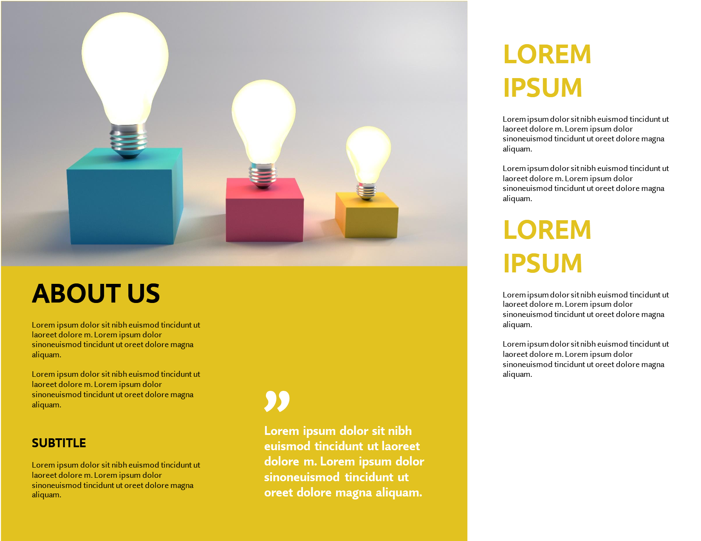 |  |  |

## brochures/08

| Expected (Word) | Skia | ImageSharp |
| --- | --- | --- |
| **Page 1**&nbsp;&nbsp;&nbsp;&nbsp;&nbsp;&nbsp;&nbsp;&nbsp;&nbsp;&nbsp;&nbsp;&nbsp;&nbsp;&nbsp;&nbsp;&nbsp;&nbsp;&nbsp;&nbsp;&nbsp;&nbsp;&nbsp;&nbsp;&nbsp;&nbsp;&nbsp;&nbsp;&nbsp;&nbsp;&nbsp;&nbsp;&nbsp;&nbsp;&nbsp; | **Page 1. ErrorMetric: 0.3538 · SSIM: 0.7539** | **Page 1. ErrorMetric: 0.3723 · SSIM: 0.7175** |
|  |  |  |
| **Page 2**&nbsp;&nbsp;&nbsp;&nbsp;&nbsp;&nbsp;&nbsp;&nbsp;&nbsp;&nbsp;&nbsp;&nbsp;&nbsp;&nbsp;&nbsp;&nbsp;&nbsp;&nbsp;&nbsp;&nbsp;&nbsp;&nbsp;&nbsp;&nbsp;&nbsp;&nbsp;&nbsp;&nbsp;&nbsp;&nbsp;&nbsp;&nbsp;&nbsp;&nbsp; | **Page 2. ErrorMetric: 0.4233 · SSIM: 0.5713** | **Page 2. ErrorMetric: 0.4411 · SSIM: 0.5324** |
|  |  |  |

## bullet_list

| Expected (Word) | Skia | ImageSharp |
| --- | --- | --- |
| **Page 1**&nbsp;&nbsp;&nbsp;&nbsp;&nbsp;&nbsp;&nbsp;&nbsp;&nbsp;&nbsp;&nbsp;&nbsp;&nbsp;&nbsp;&nbsp;&nbsp;&nbsp;&nbsp;&nbsp;&nbsp;&nbsp;&nbsp;&nbsp;&nbsp;&nbsp;&nbsp;&nbsp;&nbsp;&nbsp;&nbsp;&nbsp;&nbsp;&nbsp;&nbsp; | **Page 1. ErrorMetric: 0.0040 · SSIM: 0.9937** | **Page 1. ErrorMetric: 0.0043 · SSIM: 0.9924** |
|  |  |  |

## business-plans/01

| Expected (Word) | Skia | ImageSharp |
| --- | --- | --- |
| **Page 1**&nbsp;&nbsp;&nbsp;&nbsp;&nbsp;&nbsp;&nbsp;&nbsp;&nbsp;&nbsp;&nbsp;&nbsp;&nbsp;&nbsp;&nbsp;&nbsp;&nbsp;&nbsp;&nbsp;&nbsp;&nbsp;&nbsp;&nbsp;&nbsp;&nbsp;&nbsp;&nbsp;&nbsp;&nbsp;&nbsp;&nbsp;&nbsp;&nbsp;&nbsp; | **Page 1. ErrorMetric: 0.0919 · SSIM: 0.8665** | **Page 1. ErrorMetric: 0.1048 · SSIM: 0.8195** |
|  |  |  |

## business-plans/02

| Expected (Word) | Skia | ImageSharp |
| --- | --- | --- |
| **Page 1**&nbsp;&nbsp;&nbsp;&nbsp;&nbsp;&nbsp;&nbsp;&nbsp;&nbsp;&nbsp;&nbsp;&nbsp;&nbsp;&nbsp;&nbsp;&nbsp;&nbsp;&nbsp;&nbsp;&nbsp;&nbsp;&nbsp;&nbsp;&nbsp;&nbsp;&nbsp;&nbsp;&nbsp;&nbsp;&nbsp;&nbsp;&nbsp;&nbsp;&nbsp; | **Page 1. ErrorMetric: 0.0335 · SSIM: 0.9375** | **Page 1. ErrorMetric: 0.0340 · SSIM: 0.9356** |
|  |  |  |
| **Page 2**&nbsp;&nbsp;&nbsp;&nbsp;&nbsp;&nbsp;&nbsp;&nbsp;&nbsp;&nbsp;&nbsp;&nbsp;&nbsp;&nbsp;&nbsp;&nbsp;&nbsp;&nbsp;&nbsp;&nbsp;&nbsp;&nbsp;&nbsp;&nbsp;&nbsp;&nbsp;&nbsp;&nbsp;&nbsp;&nbsp;&nbsp;&nbsp;&nbsp;&nbsp; | **Page 2. ErrorMetric: 0.2663 · SSIM: 0.7783** | **Page 2. ErrorMetric: 0.2850 · SSIM: 0.7644** |
|  |  |  |
| **Page 3**&nbsp;&nbsp;&nbsp;&nbsp;&nbsp;&nbsp;&nbsp;&nbsp;&nbsp;&nbsp;&nbsp;&nbsp;&nbsp;&nbsp;&nbsp;&nbsp;&nbsp;&nbsp;&nbsp;&nbsp;&nbsp;&nbsp;&nbsp;&nbsp;&nbsp;&nbsp;&nbsp;&nbsp;&nbsp;&nbsp;&nbsp;&nbsp;&nbsp;&nbsp; | **Page 3. ErrorMetric: 0.2259 · SSIM: 0.8133** | **Page 3. ErrorMetric: 0.2361 · SSIM: 0.7978** |
|  |  |  |
| **Page 4**&nbsp;&nbsp;&nbsp;&nbsp;&nbsp;&nbsp;&nbsp;&nbsp;&nbsp;&nbsp;&nbsp;&nbsp;&nbsp;&nbsp;&nbsp;&nbsp;&nbsp;&nbsp;&nbsp;&nbsp;&nbsp;&nbsp;&nbsp;&nbsp;&nbsp;&nbsp;&nbsp;&nbsp;&nbsp;&nbsp;&nbsp;&nbsp;&nbsp;&nbsp; | **Page 4. ErrorMetric: 0.0789 · SSIM: 0.8580** | **Page 4. ErrorMetric: 0.0879 · SSIM: 0.8222** |
|  |  |  |
| **Page 5**&nbsp;&nbsp;&nbsp;&nbsp;&nbsp;&nbsp;&nbsp;&nbsp;&nbsp;&nbsp;&nbsp;&nbsp;&nbsp;&nbsp;&nbsp;&nbsp;&nbsp;&nbsp;&nbsp;&nbsp;&nbsp;&nbsp;&nbsp;&nbsp;&nbsp;&nbsp;&nbsp;&nbsp;&nbsp;&nbsp;&nbsp;&nbsp;&nbsp;&nbsp; | **Page 5. ErrorMetric: 0.0773 · SSIM: 0.8427** | **Page 5. ErrorMetric: 0.0798 · SSIM: 0.8330** |
|  |  |  |
| **Page 6**&nbsp;&nbsp;&nbsp;&nbsp;&nbsp;&nbsp;&nbsp;&nbsp;&nbsp;&nbsp;&nbsp;&nbsp;&nbsp;&nbsp;&nbsp;&nbsp;&nbsp;&nbsp;&nbsp;&nbsp;&nbsp;&nbsp;&nbsp;&nbsp;&nbsp;&nbsp;&nbsp;&nbsp;&nbsp;&nbsp;&nbsp;&nbsp;&nbsp;&nbsp; | **Page 6. ErrorMetric: 0.0741 · SSIM: 0.8348** | **Page 6. ErrorMetric: 0.0789 · SSIM: 0.8177** |
|  |  |  |

## business-plans/03

| Expected (Word) | Skia | ImageSharp |
| --- | --- | --- |
| **Page 1**&nbsp;&nbsp;&nbsp;&nbsp;&nbsp;&nbsp;&nbsp;&nbsp;&nbsp;&nbsp;&nbsp;&nbsp;&nbsp;&nbsp;&nbsp;&nbsp;&nbsp;&nbsp;&nbsp;&nbsp;&nbsp;&nbsp;&nbsp;&nbsp;&nbsp;&nbsp;&nbsp;&nbsp;&nbsp;&nbsp;&nbsp;&nbsp;&nbsp;&nbsp; | **Page 1. ErrorMetric: 0.1032 · SSIM: 0.7942** | **Page 1. ErrorMetric: 0.1061 · SSIM: 0.7939** |
|  |  |  |

## business-plans/04

| Expected (Word) | Skia | ImageSharp |
| --- | --- | --- |
| **Page 1**&nbsp;&nbsp;&nbsp;&nbsp;&nbsp;&nbsp;&nbsp;&nbsp;&nbsp;&nbsp;&nbsp;&nbsp;&nbsp;&nbsp;&nbsp;&nbsp;&nbsp;&nbsp;&nbsp;&nbsp;&nbsp;&nbsp;&nbsp;&nbsp;&nbsp;&nbsp;&nbsp;&nbsp;&nbsp;&nbsp;&nbsp;&nbsp;&nbsp;&nbsp; | **Page 1. ErrorMetric: 0.1319 · SSIM: 0.7143** | **Page 1. ErrorMetric: 0.1256 · SSIM: 0.7122** |
|  |  |  |

## business-plans/05

| Expected (Word) | Skia | ImageSharp |
| --- | --- | --- |
| **Page 1**&nbsp;&nbsp;&nbsp;&nbsp;&nbsp;&nbsp;&nbsp;&nbsp;&nbsp;&nbsp;&nbsp;&nbsp;&nbsp;&nbsp;&nbsp;&nbsp;&nbsp;&nbsp;&nbsp;&nbsp;&nbsp;&nbsp;&nbsp;&nbsp;&nbsp;&nbsp;&nbsp;&nbsp;&nbsp;&nbsp;&nbsp;&nbsp;&nbsp;&nbsp; | **Page 1. ErrorMetric: 0.0849 · SSIM: 0.8162** | **Page 1. ErrorMetric: 0.0841 · SSIM: 0.8184** |
|  |  |  |

## business-plans/06

| Expected (Word) | Skia | ImageSharp |
| --- | --- | --- |
| **Page 1**&nbsp;&nbsp;&nbsp;&nbsp;&nbsp;&nbsp;&nbsp;&nbsp;&nbsp;&nbsp;&nbsp;&nbsp;&nbsp;&nbsp;&nbsp;&nbsp;&nbsp;&nbsp;&nbsp;&nbsp;&nbsp;&nbsp;&nbsp;&nbsp;&nbsp;&nbsp;&nbsp;&nbsp;&nbsp;&nbsp;&nbsp;&nbsp;&nbsp;&nbsp; | **Page 1. ErrorMetric: 0.3514 · SSIM: 0.8395** | **Page 1. ErrorMetric: 0.3697 · SSIM: 0.8516** |
|  |  |  |
| **Page 2**&nbsp;&nbsp;&nbsp;&nbsp;&nbsp;&nbsp;&nbsp;&nbsp;&nbsp;&nbsp;&nbsp;&nbsp;&nbsp;&nbsp;&nbsp;&nbsp;&nbsp;&nbsp;&nbsp;&nbsp;&nbsp;&nbsp;&nbsp;&nbsp;&nbsp;&nbsp;&nbsp;&nbsp;&nbsp;&nbsp;&nbsp;&nbsp;&nbsp;&nbsp; | **Page 2. ErrorMetric: 0.0895 · SSIM: 0.8674** | **Page 2. ErrorMetric: 0.0773 · SSIM: 0.8641** |
| 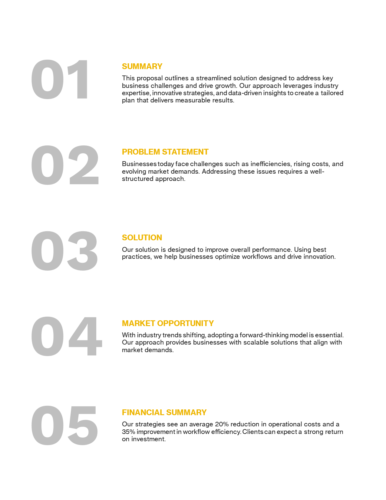 |  |  |

## business-plans/07

| Expected (Word) | Skia | ImageSharp |
| --- | --- | --- |
| **Page 1**&nbsp;&nbsp;&nbsp;&nbsp;&nbsp;&nbsp;&nbsp;&nbsp;&nbsp;&nbsp;&nbsp;&nbsp;&nbsp;&nbsp;&nbsp;&nbsp;&nbsp;&nbsp;&nbsp;&nbsp;&nbsp;&nbsp;&nbsp;&nbsp;&nbsp;&nbsp;&nbsp;&nbsp;&nbsp;&nbsp;&nbsp;&nbsp;&nbsp;&nbsp; | **Page 1. ErrorMetric: 0.0729 · SSIM: 0.8933** | **Page 1. ErrorMetric: 0.0908 · SSIM: 0.8204** |
|  |  |  |

## business-plans/08

| Expected (Word) | Skia | ImageSharp |
| --- | --- | --- |
| **Page 1**&nbsp;&nbsp;&nbsp;&nbsp;&nbsp;&nbsp;&nbsp;&nbsp;&nbsp;&nbsp;&nbsp;&nbsp;&nbsp;&nbsp;&nbsp;&nbsp;&nbsp;&nbsp;&nbsp;&nbsp;&nbsp;&nbsp;&nbsp;&nbsp;&nbsp;&nbsp;&nbsp;&nbsp;&nbsp;&nbsp;&nbsp;&nbsp;&nbsp;&nbsp; | **Page 1. ErrorMetric: 0.0445 · SSIM: 0.9415** | **Page 1. ErrorMetric: 0.0708 · SSIM: 0.9135** |
|  |  |  |
| **Page 2**&nbsp;&nbsp;&nbsp;&nbsp;&nbsp;&nbsp;&nbsp;&nbsp;&nbsp;&nbsp;&nbsp;&nbsp;&nbsp;&nbsp;&nbsp;&nbsp;&nbsp;&nbsp;&nbsp;&nbsp;&nbsp;&nbsp;&nbsp;&nbsp;&nbsp;&nbsp;&nbsp;&nbsp;&nbsp;&nbsp;&nbsp;&nbsp;&nbsp;&nbsp; | **Page 2. ErrorMetric: 0.0659 · SSIM: 0.8887** | **Page 2. ErrorMetric: 0.0668 · SSIM: 0.8868** |
|  |  |  |

## business-plans/09

| Expected (Word) | Skia | ImageSharp |
| --- | --- | --- |
| **Page 1**&nbsp;&nbsp;&nbsp;&nbsp;&nbsp;&nbsp;&nbsp;&nbsp;&nbsp;&nbsp;&nbsp;&nbsp;&nbsp;&nbsp;&nbsp;&nbsp;&nbsp;&nbsp;&nbsp;&nbsp;&nbsp;&nbsp;&nbsp;&nbsp;&nbsp;&nbsp;&nbsp;&nbsp;&nbsp;&nbsp;&nbsp;&nbsp;&nbsp;&nbsp; | **Page 1. ErrorMetric: 0.0469 · SSIM: 0.9447** | **Page 1. ErrorMetric: 0.0517 · SSIM: 0.9316** |
|  |  |  |
| **Page 2**&nbsp;&nbsp;&nbsp;&nbsp;&nbsp;&nbsp;&nbsp;&nbsp;&nbsp;&nbsp;&nbsp;&nbsp;&nbsp;&nbsp;&nbsp;&nbsp;&nbsp;&nbsp;&nbsp;&nbsp;&nbsp;&nbsp;&nbsp;&nbsp;&nbsp;&nbsp;&nbsp;&nbsp;&nbsp;&nbsp;&nbsp;&nbsp;&nbsp;&nbsp; | **Page 2. ErrorMetric: 0.0807 · SSIM: 0.8429** | **Page 2. ErrorMetric: 0.0836 · SSIM: 0.8261** |
|  |  |  |
| **Page 3**&nbsp;&nbsp;&nbsp;&nbsp;&nbsp;&nbsp;&nbsp;&nbsp;&nbsp;&nbsp;&nbsp;&nbsp;&nbsp;&nbsp;&nbsp;&nbsp;&nbsp;&nbsp;&nbsp;&nbsp;&nbsp;&nbsp;&nbsp;&nbsp;&nbsp;&nbsp;&nbsp;&nbsp;&nbsp;&nbsp;&nbsp;&nbsp;&nbsp;&nbsp; | **Page 3. ErrorMetric: 0.0847 · SSIM: 0.7701** | **Page 3. ErrorMetric: 0.0847 · SSIM: 0.7736** |
|  |  |  |
| **Page 4**&nbsp;&nbsp;&nbsp;&nbsp;&nbsp;&nbsp;&nbsp;&nbsp;&nbsp;&nbsp;&nbsp;&nbsp;&nbsp;&nbsp;&nbsp;&nbsp;&nbsp;&nbsp;&nbsp;&nbsp;&nbsp;&nbsp;&nbsp;&nbsp;&nbsp;&nbsp;&nbsp;&nbsp;&nbsp;&nbsp;&nbsp;&nbsp;&nbsp;&nbsp; | **Page 4. ErrorMetric: 0.0211 · SSIM: 0.9330** | **Page 4. ErrorMetric: 0.0213 · SSIM: 0.9322** |
|  |  |  |

## business-plans/10

| Expected (Word) | Skia | ImageSharp |
| --- | --- | --- |
| **Page 1**&nbsp;&nbsp;&nbsp;&nbsp;&nbsp;&nbsp;&nbsp;&nbsp;&nbsp;&nbsp;&nbsp;&nbsp;&nbsp;&nbsp;&nbsp;&nbsp;&nbsp;&nbsp;&nbsp;&nbsp;&nbsp;&nbsp;&nbsp;&nbsp;&nbsp;&nbsp;&nbsp;&nbsp;&nbsp;&nbsp;&nbsp;&nbsp;&nbsp;&nbsp; | **Page 1. ErrorMetric: 0.7535 · SSIM: 0.8634** | **Page 1. ErrorMetric: 0.7681 · SSIM: 0.8600** |
|  |  |  |
| **Page 2**&nbsp;&nbsp;&nbsp;&nbsp;&nbsp;&nbsp;&nbsp;&nbsp;&nbsp;&nbsp;&nbsp;&nbsp;&nbsp;&nbsp;&nbsp;&nbsp;&nbsp;&nbsp;&nbsp;&nbsp;&nbsp;&nbsp;&nbsp;&nbsp;&nbsp;&nbsp;&nbsp;&nbsp;&nbsp;&nbsp;&nbsp;&nbsp;&nbsp;&nbsp; | **Page 2. ErrorMetric: 0.0574 · SSIM: 0.8976** | **Page 2. ErrorMetric: 0.0588 · SSIM: 0.8930** |
|  |  |  |
| **Page 3**&nbsp;&nbsp;&nbsp;&nbsp;&nbsp;&nbsp;&nbsp;&nbsp;&nbsp;&nbsp;&nbsp;&nbsp;&nbsp;&nbsp;&nbsp;&nbsp;&nbsp;&nbsp;&nbsp;&nbsp;&nbsp;&nbsp;&nbsp;&nbsp;&nbsp;&nbsp;&nbsp;&nbsp;&nbsp;&nbsp;&nbsp;&nbsp;&nbsp;&nbsp; | **Page 3. ErrorMetric: 0.0548 · SSIM: 0.8972** | **Page 3. ErrorMetric: 0.0551 · SSIM: 0.9021** |
|  |  |  |
| **Page 4**&nbsp;&nbsp;&nbsp;&nbsp;&nbsp;&nbsp;&nbsp;&nbsp;&nbsp;&nbsp;&nbsp;&nbsp;&nbsp;&nbsp;&nbsp;&nbsp;&nbsp;&nbsp;&nbsp;&nbsp;&nbsp;&nbsp;&nbsp;&nbsp;&nbsp;&nbsp;&nbsp;&nbsp;&nbsp;&nbsp;&nbsp;&nbsp;&nbsp;&nbsp; | **Page 4. ErrorMetric: 0.0362 · SSIM: 0.9085** | **Page 4. ErrorMetric: 0.0367 · SSIM: 0.9065** |
| 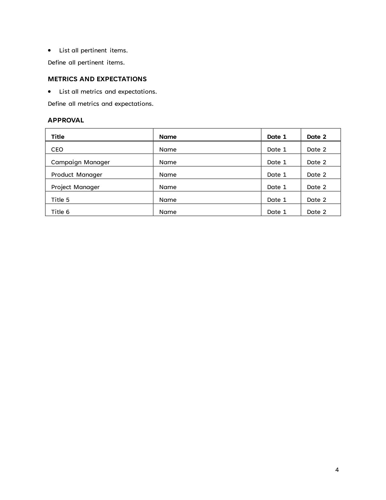 |  |  |
| **Page 5**&nbsp;&nbsp;&nbsp;&nbsp;&nbsp;&nbsp;&nbsp;&nbsp;&nbsp;&nbsp;&nbsp;&nbsp;&nbsp;&nbsp;&nbsp;&nbsp;&nbsp;&nbsp;&nbsp;&nbsp;&nbsp;&nbsp;&nbsp;&nbsp;&nbsp;&nbsp;&nbsp;&nbsp;&nbsp;&nbsp;&nbsp;&nbsp;&nbsp;&nbsp; | **Page 5. ErrorMetric: 0.0331 · SSIM: 0.9206** | **Page 5. ErrorMetric: 0.0326 · SSIM: 0.9250** |
|  |  |  |

## business-plans/12

| Expected (Word) | Skia | ImageSharp |
| --- | --- | --- |
| **Page 1**&nbsp;&nbsp;&nbsp;&nbsp;&nbsp;&nbsp;&nbsp;&nbsp;&nbsp;&nbsp;&nbsp;&nbsp;&nbsp;&nbsp;&nbsp;&nbsp;&nbsp;&nbsp;&nbsp;&nbsp;&nbsp;&nbsp;&nbsp;&nbsp;&nbsp;&nbsp;&nbsp;&nbsp;&nbsp;&nbsp;&nbsp;&nbsp;&nbsp;&nbsp; | **Page 1. ErrorMetric: 0.6250 · SSIM: 0.4367** | **Page 1. ErrorMetric: 0.6188 · SSIM: 0.4476** |
|  |  |  |
| **Page 2**&nbsp;&nbsp;&nbsp;&nbsp;&nbsp;&nbsp;&nbsp;&nbsp;&nbsp;&nbsp;&nbsp;&nbsp;&nbsp;&nbsp;&nbsp;&nbsp;&nbsp;&nbsp;&nbsp;&nbsp;&nbsp;&nbsp;&nbsp;&nbsp;&nbsp;&nbsp;&nbsp;&nbsp;&nbsp;&nbsp;&nbsp;&nbsp;&nbsp;&nbsp; | **Page 2. ErrorMetric: 0.5049 · SSIM: 0.6907** | **Page 2. ErrorMetric: 0.5136 · SSIM: 0.6979** |
|  |  |  |
| **Page 3**&nbsp;&nbsp;&nbsp;&nbsp;&nbsp;&nbsp;&nbsp;&nbsp;&nbsp;&nbsp;&nbsp;&nbsp;&nbsp;&nbsp;&nbsp;&nbsp;&nbsp;&nbsp;&nbsp;&nbsp;&nbsp;&nbsp;&nbsp;&nbsp;&nbsp;&nbsp;&nbsp;&nbsp;&nbsp;&nbsp;&nbsp;&nbsp;&nbsp;&nbsp; | **Page 3. ErrorMetric: 0.1271 · SSIM: 0.6934** | **Page 3. ErrorMetric: 0.1270 · SSIM: 0.7039** |
|  |  |  |
| **Page 4**&nbsp;&nbsp;&nbsp;&nbsp;&nbsp;&nbsp;&nbsp;&nbsp;&nbsp;&nbsp;&nbsp;&nbsp;&nbsp;&nbsp;&nbsp;&nbsp;&nbsp;&nbsp;&nbsp;&nbsp;&nbsp;&nbsp;&nbsp;&nbsp;&nbsp;&nbsp;&nbsp;&nbsp;&nbsp;&nbsp;&nbsp;&nbsp;&nbsp;&nbsp; | **Page 4. ErrorMetric: 0.1158 · SSIM: 0.7267** | **Page 4. ErrorMetric: 0.1150 · SSIM: 0.7306** |
|  |  |  |
| **Page 5**&nbsp;&nbsp;&nbsp;&nbsp;&nbsp;&nbsp;&nbsp;&nbsp;&nbsp;&nbsp;&nbsp;&nbsp;&nbsp;&nbsp;&nbsp;&nbsp;&nbsp;&nbsp;&nbsp;&nbsp;&nbsp;&nbsp;&nbsp;&nbsp;&nbsp;&nbsp;&nbsp;&nbsp;&nbsp;&nbsp;&nbsp;&nbsp;&nbsp;&nbsp; | **Page 5. ErrorMetric: 0.1649 · SSIM: 0.6328** | **Page 5. ErrorMetric: 0.1622 · SSIM: 0.6379** |
|  |  |  |
| **Page 6**&nbsp;&nbsp;&nbsp;&nbsp;&nbsp;&nbsp;&nbsp;&nbsp;&nbsp;&nbsp;&nbsp;&nbsp;&nbsp;&nbsp;&nbsp;&nbsp;&nbsp;&nbsp;&nbsp;&nbsp;&nbsp;&nbsp;&nbsp;&nbsp;&nbsp;&nbsp;&nbsp;&nbsp;&nbsp;&nbsp;&nbsp;&nbsp;&nbsp;&nbsp; | **Page 6. ErrorMetric: 0.1994 · SSIM: 0.5469** | **Page 6. ErrorMetric: 0.1962 · SSIM: 0.5616** |
|  |  |  |
| **Page 7**&nbsp;&nbsp;&nbsp;&nbsp;&nbsp;&nbsp;&nbsp;&nbsp;&nbsp;&nbsp;&nbsp;&nbsp;&nbsp;&nbsp;&nbsp;&nbsp;&nbsp;&nbsp;&nbsp;&nbsp;&nbsp;&nbsp;&nbsp;&nbsp;&nbsp;&nbsp;&nbsp;&nbsp;&nbsp;&nbsp;&nbsp;&nbsp;&nbsp;&nbsp; | **Page 7. ErrorMetric: 0.0164 · SSIM: 0.9599** | **Page 7. ErrorMetric: 0.0168 · SSIM: 0.9575** |
|  |  |  |
| **Page 8**&nbsp;&nbsp;&nbsp;&nbsp;&nbsp;&nbsp;&nbsp;&nbsp;&nbsp;&nbsp;&nbsp;&nbsp;&nbsp;&nbsp;&nbsp;&nbsp;&nbsp;&nbsp;&nbsp;&nbsp;&nbsp;&nbsp;&nbsp;&nbsp;&nbsp;&nbsp;&nbsp;&nbsp;&nbsp;&nbsp;&nbsp;&nbsp;&nbsp;&nbsp; | **Page 8. ErrorMetric: 0.2018 · SSIM: 0.5509** | **Page 8. ErrorMetric: 0.1964 · SSIM: 0.5692** |
|  |  |  |
| **Page 9**&nbsp;&nbsp;&nbsp;&nbsp;&nbsp;&nbsp;&nbsp;&nbsp;&nbsp;&nbsp;&nbsp;&nbsp;&nbsp;&nbsp;&nbsp;&nbsp;&nbsp;&nbsp;&nbsp;&nbsp;&nbsp;&nbsp;&nbsp;&nbsp;&nbsp;&nbsp;&nbsp;&nbsp;&nbsp;&nbsp;&nbsp;&nbsp;&nbsp;&nbsp; | **Page 9. ErrorMetric: 0.1683 · SSIM: 0.7598** | **Page 9. ErrorMetric: 0.1727 · SSIM: 0.7463** |
|  |  |  |
| **Page 10**&nbsp;&nbsp;&nbsp;&nbsp;&nbsp;&nbsp;&nbsp;&nbsp;&nbsp;&nbsp;&nbsp;&nbsp;&nbsp;&nbsp;&nbsp;&nbsp;&nbsp;&nbsp;&nbsp;&nbsp;&nbsp;&nbsp;&nbsp;&nbsp;&nbsp;&nbsp;&nbsp;&nbsp;&nbsp;&nbsp;&nbsp;&nbsp;&nbsp;&nbsp; | **Page 10. ErrorMetric: 0.1706 · SSIM: 0.6090** | **Page 10. ErrorMetric: 0.1688 · SSIM: 0.6244** |
|  |  |  |
| **Page 11**&nbsp;&nbsp;&nbsp;&nbsp;&nbsp;&nbsp;&nbsp;&nbsp;&nbsp;&nbsp;&nbsp;&nbsp;&nbsp;&nbsp;&nbsp;&nbsp;&nbsp;&nbsp;&nbsp;&nbsp;&nbsp;&nbsp;&nbsp;&nbsp;&nbsp;&nbsp;&nbsp;&nbsp;&nbsp;&nbsp;&nbsp;&nbsp;&nbsp;&nbsp; | **Page 11. ErrorMetric: 0.1648 · SSIM: 0.6191** | **Page 11. ErrorMetric: 0.1631 · SSIM: 0.6281** |
|  |  |  |
| **Page 12**&nbsp;&nbsp;&nbsp;&nbsp;&nbsp;&nbsp;&nbsp;&nbsp;&nbsp;&nbsp;&nbsp;&nbsp;&nbsp;&nbsp;&nbsp;&nbsp;&nbsp;&nbsp;&nbsp;&nbsp;&nbsp;&nbsp;&nbsp;&nbsp;&nbsp;&nbsp;&nbsp;&nbsp;&nbsp;&nbsp;&nbsp;&nbsp;&nbsp;&nbsp; | **Page 12. ErrorMetric: 0.1135 · SSIM: 0.7448** | **Page 12. ErrorMetric: 0.1112 · SSIM: 0.7528** |
|  |  |  |
| **Page 13**&nbsp;&nbsp;&nbsp;&nbsp;&nbsp;&nbsp;&nbsp;&nbsp;&nbsp;&nbsp;&nbsp;&nbsp;&nbsp;&nbsp;&nbsp;&nbsp;&nbsp;&nbsp;&nbsp;&nbsp;&nbsp;&nbsp;&nbsp;&nbsp;&nbsp;&nbsp;&nbsp;&nbsp;&nbsp;&nbsp;&nbsp;&nbsp;&nbsp;&nbsp; | **Page 13. ErrorMetric: 0.1065 · SSIM: 0.7776** | **Page 13. ErrorMetric: 0.1168 · SSIM: 0.7500** |
|  |  |  |
| **Page 14**&nbsp;&nbsp;&nbsp;&nbsp;&nbsp;&nbsp;&nbsp;&nbsp;&nbsp;&nbsp;&nbsp;&nbsp;&nbsp;&nbsp;&nbsp;&nbsp;&nbsp;&nbsp;&nbsp;&nbsp;&nbsp;&nbsp;&nbsp;&nbsp;&nbsp;&nbsp;&nbsp;&nbsp;&nbsp;&nbsp;&nbsp;&nbsp;&nbsp;&nbsp; | **Page 14. ErrorMetric: 0.2173 · SSIM: 0.5696** | **Page 14. ErrorMetric: 0.2332 · SSIM: 0.5234** |
|  |  |  |
| **Page 15**&nbsp;&nbsp;&nbsp;&nbsp;&nbsp;&nbsp;&nbsp;&nbsp;&nbsp;&nbsp;&nbsp;&nbsp;&nbsp;&nbsp;&nbsp;&nbsp;&nbsp;&nbsp;&nbsp;&nbsp;&nbsp;&nbsp;&nbsp;&nbsp;&nbsp;&nbsp;&nbsp;&nbsp;&nbsp;&nbsp;&nbsp;&nbsp;&nbsp;&nbsp; | **Page 15. ErrorMetric: 0.1363 · SSIM: 0.6563** | **Page 15. ErrorMetric: 0.1369 · SSIM: 0.6592** |
|  |  |  |
| **Page 16**&nbsp;&nbsp;&nbsp;&nbsp;&nbsp;&nbsp;&nbsp;&nbsp;&nbsp;&nbsp;&nbsp;&nbsp;&nbsp;&nbsp;&nbsp;&nbsp;&nbsp;&nbsp;&nbsp;&nbsp;&nbsp;&nbsp;&nbsp;&nbsp;&nbsp;&nbsp;&nbsp;&nbsp;&nbsp;&nbsp;&nbsp;&nbsp;&nbsp;&nbsp; | **Page 16. ErrorMetric: 0.0795 · SSIM: 0.8285** | **Page 16. ErrorMetric: 0.0810 · SSIM: 0.8239** |
|  |  |  |
| **Page 17**&nbsp;&nbsp;&nbsp;&nbsp;&nbsp;&nbsp;&nbsp;&nbsp;&nbsp;&nbsp;&nbsp;&nbsp;&nbsp;&nbsp;&nbsp;&nbsp;&nbsp;&nbsp;&nbsp;&nbsp;&nbsp;&nbsp;&nbsp;&nbsp;&nbsp;&nbsp;&nbsp;&nbsp;&nbsp;&nbsp;&nbsp;&nbsp;&nbsp;&nbsp; | **Page 17. ErrorMetric: 0.1035 · SSIM: 0.7605** | **Page 17. ErrorMetric: 0.1090 · SSIM: 0.7446** |
|  |  |  |
| **Page 18**&nbsp;&nbsp;&nbsp;&nbsp;&nbsp;&nbsp;&nbsp;&nbsp;&nbsp;&nbsp;&nbsp;&nbsp;&nbsp;&nbsp;&nbsp;&nbsp;&nbsp;&nbsp;&nbsp;&nbsp;&nbsp;&nbsp;&nbsp;&nbsp;&nbsp;&nbsp;&nbsp;&nbsp;&nbsp;&nbsp;&nbsp;&nbsp;&nbsp;&nbsp; | **Page 18. ErrorMetric: 0.1091 · SSIM: 0.7543** | **Page 18. ErrorMetric: 0.1121 · SSIM: 0.7471** |
|  |  |  |

## business-plans/13

| Expected (Word) | Skia | ImageSharp |
| --- | --- | --- |
| **Page 1**&nbsp;&nbsp;&nbsp;&nbsp;&nbsp;&nbsp;&nbsp;&nbsp;&nbsp;&nbsp;&nbsp;&nbsp;&nbsp;&nbsp;&nbsp;&nbsp;&nbsp;&nbsp;&nbsp;&nbsp;&nbsp;&nbsp;&nbsp;&nbsp;&nbsp;&nbsp;&nbsp;&nbsp;&nbsp;&nbsp;&nbsp;&nbsp;&nbsp;&nbsp; | **Page 1. ErrorMetric: 0.5544 · SSIM: 0.9505** | **Page 1. ErrorMetric: 0.6656 · SSIM: 0.9441** |
|  |  |  |
| **Page 2**&nbsp;&nbsp;&nbsp;&nbsp;&nbsp;&nbsp;&nbsp;&nbsp;&nbsp;&nbsp;&nbsp;&nbsp;&nbsp;&nbsp;&nbsp;&nbsp;&nbsp;&nbsp;&nbsp;&nbsp;&nbsp;&nbsp;&nbsp;&nbsp;&nbsp;&nbsp;&nbsp;&nbsp;&nbsp;&nbsp;&nbsp;&nbsp;&nbsp;&nbsp; | **Page 2. ErrorMetric: 0.2287 · SSIM: 0.9577** | **Page 2. ErrorMetric: 0.3614 · SSIM: 0.9304** |
| 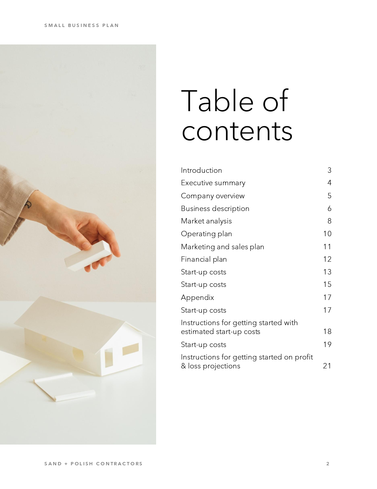 |  |  |
| **Page 3**&nbsp;&nbsp;&nbsp;&nbsp;&nbsp;&nbsp;&nbsp;&nbsp;&nbsp;&nbsp;&nbsp;&nbsp;&nbsp;&nbsp;&nbsp;&nbsp;&nbsp;&nbsp;&nbsp;&nbsp;&nbsp;&nbsp;&nbsp;&nbsp;&nbsp;&nbsp;&nbsp;&nbsp;&nbsp;&nbsp;&nbsp;&nbsp;&nbsp;&nbsp; | **Page 3. ErrorMetric: 0.0890 · SSIM: 0.7664** | **Page 3. ErrorMetric: 0.0966 · SSIM: 0.7369** |
|  |  |  |
| **Page 4**&nbsp;&nbsp;&nbsp;&nbsp;&nbsp;&nbsp;&nbsp;&nbsp;&nbsp;&nbsp;&nbsp;&nbsp;&nbsp;&nbsp;&nbsp;&nbsp;&nbsp;&nbsp;&nbsp;&nbsp;&nbsp;&nbsp;&nbsp;&nbsp;&nbsp;&nbsp;&nbsp;&nbsp;&nbsp;&nbsp;&nbsp;&nbsp;&nbsp;&nbsp; | **Page 4. ErrorMetric: 0.0802 · SSIM: 0.7686** | **Page 4. ErrorMetric: 0.0830 · SSIM: 0.7643** |
|  |  |  |
| **Page 5**&nbsp;&nbsp;&nbsp;&nbsp;&nbsp;&nbsp;&nbsp;&nbsp;&nbsp;&nbsp;&nbsp;&nbsp;&nbsp;&nbsp;&nbsp;&nbsp;&nbsp;&nbsp;&nbsp;&nbsp;&nbsp;&nbsp;&nbsp;&nbsp;&nbsp;&nbsp;&nbsp;&nbsp;&nbsp;&nbsp;&nbsp;&nbsp;&nbsp;&nbsp; | **Page 5. ErrorMetric: 0.1111 · SSIM: 0.7116** | **Page 5. ErrorMetric: 0.1192 · SSIM: 0.6833** |
|  |  |  |
| **Page 6**&nbsp;&nbsp;&nbsp;&nbsp;&nbsp;&nbsp;&nbsp;&nbsp;&nbsp;&nbsp;&nbsp;&nbsp;&nbsp;&nbsp;&nbsp;&nbsp;&nbsp;&nbsp;&nbsp;&nbsp;&nbsp;&nbsp;&nbsp;&nbsp;&nbsp;&nbsp;&nbsp;&nbsp;&nbsp;&nbsp;&nbsp;&nbsp;&nbsp;&nbsp; | **Page 6. ErrorMetric: 0.1188 · SSIM: 0.7379** | **Page 6. ErrorMetric: 0.1321 · SSIM: 0.6865** |
|  |  |  |
| **Page 7**&nbsp;&nbsp;&nbsp;&nbsp;&nbsp;&nbsp;&nbsp;&nbsp;&nbsp;&nbsp;&nbsp;&nbsp;&nbsp;&nbsp;&nbsp;&nbsp;&nbsp;&nbsp;&nbsp;&nbsp;&nbsp;&nbsp;&nbsp;&nbsp;&nbsp;&nbsp;&nbsp;&nbsp;&nbsp;&nbsp;&nbsp;&nbsp;&nbsp;&nbsp; | **Page 7. ErrorMetric: 0.0200 · SSIM: 0.9689** | **Page 7. ErrorMetric: 0.0250 · SSIM: 0.9457** |
| 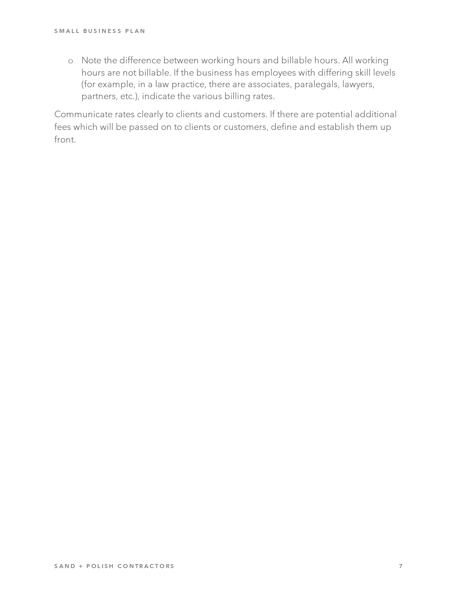 |  |  |
| **Page 8**&nbsp;&nbsp;&nbsp;&nbsp;&nbsp;&nbsp;&nbsp;&nbsp;&nbsp;&nbsp;&nbsp;&nbsp;&nbsp;&nbsp;&nbsp;&nbsp;&nbsp;&nbsp;&nbsp;&nbsp;&nbsp;&nbsp;&nbsp;&nbsp;&nbsp;&nbsp;&nbsp;&nbsp;&nbsp;&nbsp;&nbsp;&nbsp;&nbsp;&nbsp; | **Page 8. ErrorMetric: 0.1370 · SSIM: 0.6670** | **Page 8. ErrorMetric: 0.1482 · SSIM: 0.6271** |
|  |  |  |
| **Page 9**&nbsp;&nbsp;&nbsp;&nbsp;&nbsp;&nbsp;&nbsp;&nbsp;&nbsp;&nbsp;&nbsp;&nbsp;&nbsp;&nbsp;&nbsp;&nbsp;&nbsp;&nbsp;&nbsp;&nbsp;&nbsp;&nbsp;&nbsp;&nbsp;&nbsp;&nbsp;&nbsp;&nbsp;&nbsp;&nbsp;&nbsp;&nbsp;&nbsp;&nbsp; | **Page 9. ErrorMetric: 0.0234 · SSIM: 0.9497** | **Page 9. ErrorMetric: 0.0264 · SSIM: 0.9365** |
|  |  |  |
| **Page 10**&nbsp;&nbsp;&nbsp;&nbsp;&nbsp;&nbsp;&nbsp;&nbsp;&nbsp;&nbsp;&nbsp;&nbsp;&nbsp;&nbsp;&nbsp;&nbsp;&nbsp;&nbsp;&nbsp;&nbsp;&nbsp;&nbsp;&nbsp;&nbsp;&nbsp;&nbsp;&nbsp;&nbsp;&nbsp;&nbsp;&nbsp;&nbsp;&nbsp;&nbsp; | **Page 10. ErrorMetric: 0.1246 · SSIM: 0.7099** | **Page 10. ErrorMetric: 0.1370 · SSIM: 0.6647** |
|  |  |  |
| **Page 11**&nbsp;&nbsp;&nbsp;&nbsp;&nbsp;&nbsp;&nbsp;&nbsp;&nbsp;&nbsp;&nbsp;&nbsp;&nbsp;&nbsp;&nbsp;&nbsp;&nbsp;&nbsp;&nbsp;&nbsp;&nbsp;&nbsp;&nbsp;&nbsp;&nbsp;&nbsp;&nbsp;&nbsp;&nbsp;&nbsp;&nbsp;&nbsp;&nbsp;&nbsp; | **Page 11. ErrorMetric: 0.0812 · SSIM: 0.7751** | **Page 11. ErrorMetric: 0.0835 · SSIM: 0.7725** |
|  |  |  |
| **Page 12**&nbsp;&nbsp;&nbsp;&nbsp;&nbsp;&nbsp;&nbsp;&nbsp;&nbsp;&nbsp;&nbsp;&nbsp;&nbsp;&nbsp;&nbsp;&nbsp;&nbsp;&nbsp;&nbsp;&nbsp;&nbsp;&nbsp;&nbsp;&nbsp;&nbsp;&nbsp;&nbsp;&nbsp;&nbsp;&nbsp;&nbsp;&nbsp;&nbsp;&nbsp; | **Page 12. ErrorMetric: 0.0714 · SSIM: 0.8398** | **Page 12. ErrorMetric: 0.0792 · SSIM: 0.8098** |
|  |  |  |
| **Page 13**&nbsp;&nbsp;&nbsp;&nbsp;&nbsp;&nbsp;&nbsp;&nbsp;&nbsp;&nbsp;&nbsp;&nbsp;&nbsp;&nbsp;&nbsp;&nbsp;&nbsp;&nbsp;&nbsp;&nbsp;&nbsp;&nbsp;&nbsp;&nbsp;&nbsp;&nbsp;&nbsp;&nbsp;&nbsp;&nbsp;&nbsp;&nbsp;&nbsp;&nbsp; | **Page 13. ErrorMetric: 0.0666 · SSIM: 0.9182** | **Page 13. ErrorMetric: 0.0697 · SSIM: 0.9072** |
| 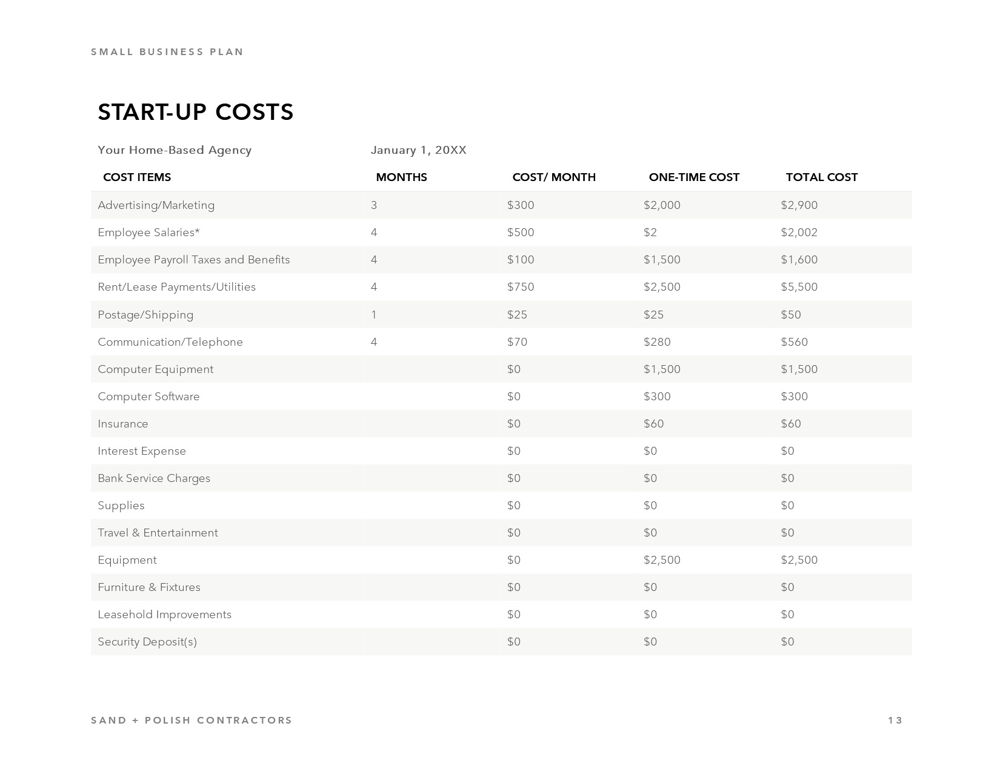 |  |  |
| **Page 14**&nbsp;&nbsp;&nbsp;&nbsp;&nbsp;&nbsp;&nbsp;&nbsp;&nbsp;&nbsp;&nbsp;&nbsp;&nbsp;&nbsp;&nbsp;&nbsp;&nbsp;&nbsp;&nbsp;&nbsp;&nbsp;&nbsp;&nbsp;&nbsp;&nbsp;&nbsp;&nbsp;&nbsp;&nbsp;&nbsp;&nbsp;&nbsp;&nbsp;&nbsp; | **Page 14. ErrorMetric: 0.0336 · SSIM: 0.9523** | **Page 14. ErrorMetric: 0.0369 · SSIM: 0.9398** |
| 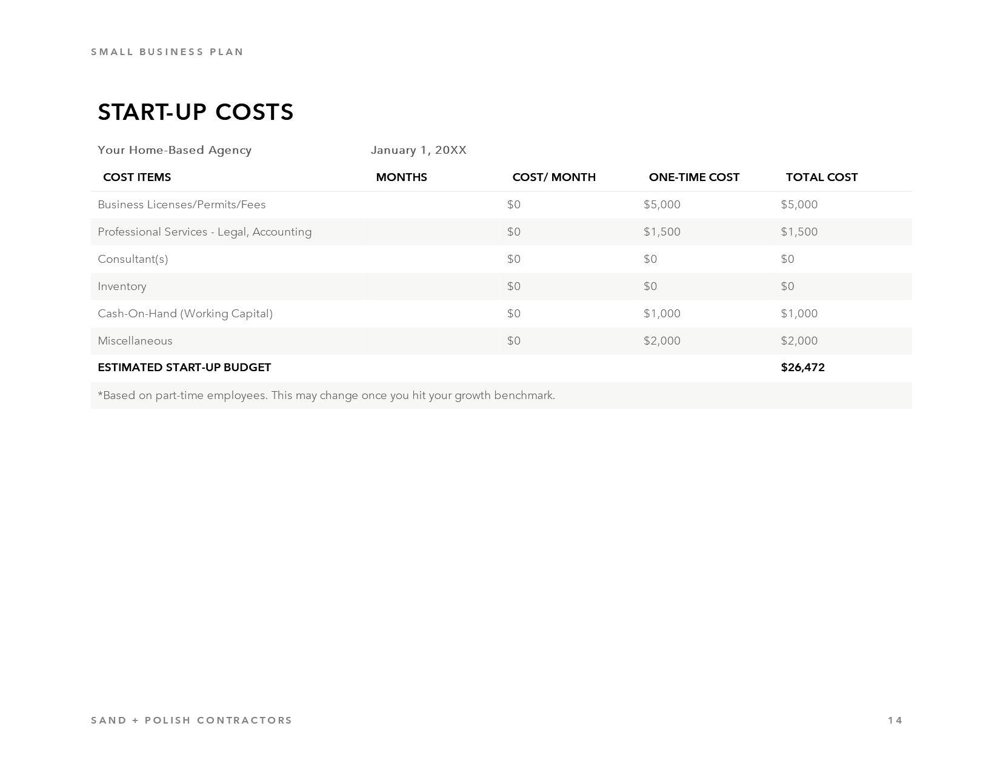 |  |  |
| **Page 15**&nbsp;&nbsp;&nbsp;&nbsp;&nbsp;&nbsp;&nbsp;&nbsp;&nbsp;&nbsp;&nbsp;&nbsp;&nbsp;&nbsp;&nbsp;&nbsp;&nbsp;&nbsp;&nbsp;&nbsp;&nbsp;&nbsp;&nbsp;&nbsp;&nbsp;&nbsp;&nbsp;&nbsp;&nbsp;&nbsp;&nbsp;&nbsp;&nbsp;&nbsp; | **Page 15. ErrorMetric: 0.1029 · SSIM: 0.8264** | **Page 15. ErrorMetric: 0.1151 · SSIM: 0.7852** |
| 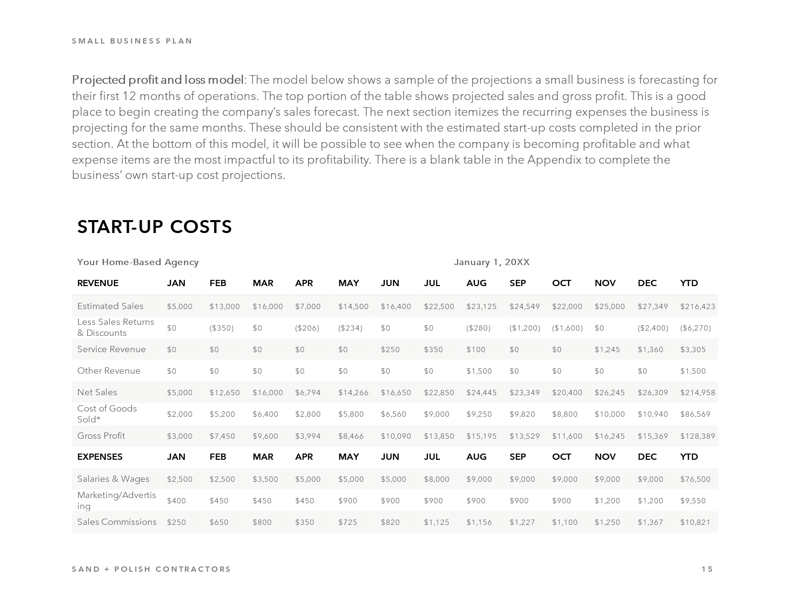 |  |  |
| **Page 16**&nbsp;&nbsp;&nbsp;&nbsp;&nbsp;&nbsp;&nbsp;&nbsp;&nbsp;&nbsp;&nbsp;&nbsp;&nbsp;&nbsp;&nbsp;&nbsp;&nbsp;&nbsp;&nbsp;&nbsp;&nbsp;&nbsp;&nbsp;&nbsp;&nbsp;&nbsp;&nbsp;&nbsp;&nbsp;&nbsp;&nbsp;&nbsp;&nbsp;&nbsp; | **Page 16. ErrorMetric: 0.0666 · SSIM: 0.8949** | **Page 16. ErrorMetric: 0.0729 · SSIM: 0.8675** |
|  |  |  |
| **Page 17**&nbsp;&nbsp;&nbsp;&nbsp;&nbsp;&nbsp;&nbsp;&nbsp;&nbsp;&nbsp;&nbsp;&nbsp;&nbsp;&nbsp;&nbsp;&nbsp;&nbsp;&nbsp;&nbsp;&nbsp;&nbsp;&nbsp;&nbsp;&nbsp;&nbsp;&nbsp;&nbsp;&nbsp;&nbsp;&nbsp;&nbsp;&nbsp;&nbsp;&nbsp; | **Page 17. ErrorMetric: 0.0549 · SSIM: 0.9360** | **Page 17. ErrorMetric: 0.0702 · SSIM: 0.9208** |
|  |  |  |
| **Page 18**&nbsp;&nbsp;&nbsp;&nbsp;&nbsp;&nbsp;&nbsp;&nbsp;&nbsp;&nbsp;&nbsp;&nbsp;&nbsp;&nbsp;&nbsp;&nbsp;&nbsp;&nbsp;&nbsp;&nbsp;&nbsp;&nbsp;&nbsp;&nbsp;&nbsp;&nbsp;&nbsp;&nbsp;&nbsp;&nbsp;&nbsp;&nbsp;&nbsp;&nbsp; | **Page 18. ErrorMetric: 0.0601 · SSIM: 0.8694** | **Page 18. ErrorMetric: 0.0665 · SSIM: 0.8474** |
| 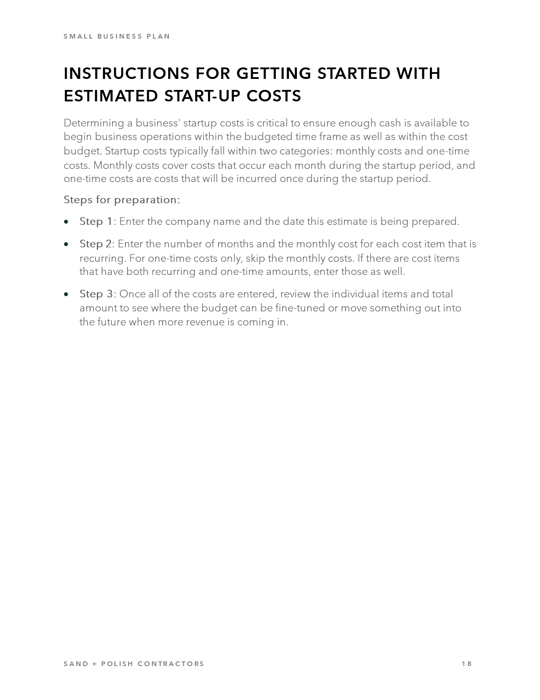 |  |  |
| **Page 19**&nbsp;&nbsp;&nbsp;&nbsp;&nbsp;&nbsp;&nbsp;&nbsp;&nbsp;&nbsp;&nbsp;&nbsp;&nbsp;&nbsp;&nbsp;&nbsp;&nbsp;&nbsp;&nbsp;&nbsp;&nbsp;&nbsp;&nbsp;&nbsp;&nbsp;&nbsp;&nbsp;&nbsp;&nbsp;&nbsp;&nbsp;&nbsp;&nbsp;&nbsp; | **Page 19. ErrorMetric: 0.0574 · SSIM: 0.9469** | **Page 19. ErrorMetric: 0.0627 · SSIM: 0.9357** |
|  |  |  |
| **Page 20**&nbsp;&nbsp;&nbsp;&nbsp;&nbsp;&nbsp;&nbsp;&nbsp;&nbsp;&nbsp;&nbsp;&nbsp;&nbsp;&nbsp;&nbsp;&nbsp;&nbsp;&nbsp;&nbsp;&nbsp;&nbsp;&nbsp;&nbsp;&nbsp;&nbsp;&nbsp;&nbsp;&nbsp;&nbsp;&nbsp;&nbsp;&nbsp;&nbsp;&nbsp; | **Page 20. ErrorMetric: 0.0295 · SSIM: 0.9663** | **Page 20. ErrorMetric: 0.0332 · SSIM: 0.9572** |
|  |  |  |
| **Page 21**&nbsp;&nbsp;&nbsp;&nbsp;&nbsp;&nbsp;&nbsp;&nbsp;&nbsp;&nbsp;&nbsp;&nbsp;&nbsp;&nbsp;&nbsp;&nbsp;&nbsp;&nbsp;&nbsp;&nbsp;&nbsp;&nbsp;&nbsp;&nbsp;&nbsp;&nbsp;&nbsp;&nbsp;&nbsp;&nbsp;&nbsp;&nbsp;&nbsp;&nbsp; | **Page 21. ErrorMetric: 0.0829 · SSIM: 0.8129** | **Page 21. ErrorMetric: 0.0920 · SSIM: 0.7778** |
|  |  |  |

## business-plans/15

| Expected (Word) | Skia | ImageSharp |
| --- | --- | --- |
| **Page 1**&nbsp;&nbsp;&nbsp;&nbsp;&nbsp;&nbsp;&nbsp;&nbsp;&nbsp;&nbsp;&nbsp;&nbsp;&nbsp;&nbsp;&nbsp;&nbsp;&nbsp;&nbsp;&nbsp;&nbsp;&nbsp;&nbsp;&nbsp;&nbsp;&nbsp;&nbsp;&nbsp;&nbsp;&nbsp;&nbsp;&nbsp;&nbsp;&nbsp;&nbsp; | **Page 1. ErrorMetric: 0.0421 · SSIM: 0.9096** | **Page 1. ErrorMetric: 0.0447 · SSIM: 0.9070** |
|  |  |  |
| **Page 2**&nbsp;&nbsp;&nbsp;&nbsp;&nbsp;&nbsp;&nbsp;&nbsp;&nbsp;&nbsp;&nbsp;&nbsp;&nbsp;&nbsp;&nbsp;&nbsp;&nbsp;&nbsp;&nbsp;&nbsp;&nbsp;&nbsp;&nbsp;&nbsp;&nbsp;&nbsp;&nbsp;&nbsp;&nbsp;&nbsp;&nbsp;&nbsp;&nbsp;&nbsp; | **Page 2. ErrorMetric: 0.0611 · SSIM: 0.8322** | **Page 2. ErrorMetric: 0.0777 · SSIM: 0.7479** |
|  |  |  |
| **Page 3**&nbsp;&nbsp;&nbsp;&nbsp;&nbsp;&nbsp;&nbsp;&nbsp;&nbsp;&nbsp;&nbsp;&nbsp;&nbsp;&nbsp;&nbsp;&nbsp;&nbsp;&nbsp;&nbsp;&nbsp;&nbsp;&nbsp;&nbsp;&nbsp;&nbsp;&nbsp;&nbsp;&nbsp;&nbsp;&nbsp;&nbsp;&nbsp;&nbsp;&nbsp; | **Page 3. ErrorMetric: 0.0578 · SSIM: 0.9218** | **Page 3. ErrorMetric: 0.0736 · SSIM: 0.8456** |
|  |  |  |
| **Page 4**&nbsp;&nbsp;&nbsp;&nbsp;&nbsp;&nbsp;&nbsp;&nbsp;&nbsp;&nbsp;&nbsp;&nbsp;&nbsp;&nbsp;&nbsp;&nbsp;&nbsp;&nbsp;&nbsp;&nbsp;&nbsp;&nbsp;&nbsp;&nbsp;&nbsp;&nbsp;&nbsp;&nbsp;&nbsp;&nbsp;&nbsp;&nbsp;&nbsp;&nbsp; | **Page 4. ErrorMetric: 0.1218 · SSIM: 0.6774** | **Page 4. ErrorMetric: 0.1213 · SSIM: 0.6805** |
| 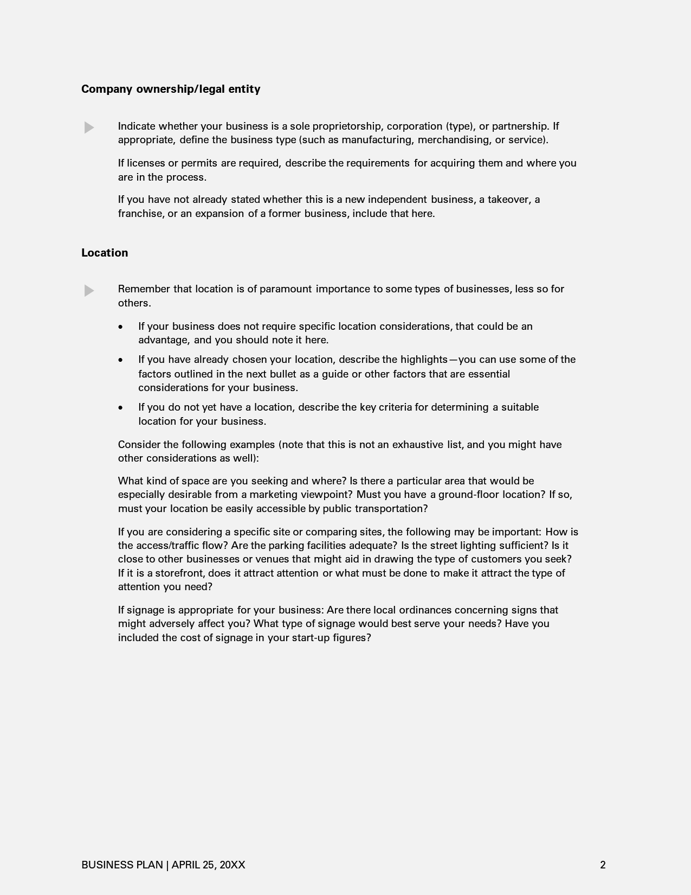 |  |  |
| **Page 5**&nbsp;&nbsp;&nbsp;&nbsp;&nbsp;&nbsp;&nbsp;&nbsp;&nbsp;&nbsp;&nbsp;&nbsp;&nbsp;&nbsp;&nbsp;&nbsp;&nbsp;&nbsp;&nbsp;&nbsp;&nbsp;&nbsp;&nbsp;&nbsp;&nbsp;&nbsp;&nbsp;&nbsp;&nbsp;&nbsp;&nbsp;&nbsp;&nbsp;&nbsp; | **Page 5. ErrorMetric: 0.0967 · SSIM: 0.7506** | **Page 5. ErrorMetric: 0.0972 · SSIM: 0.7488** |
|  |  |  |
| **Page 6**&nbsp;&nbsp;&nbsp;&nbsp;&nbsp;&nbsp;&nbsp;&nbsp;&nbsp;&nbsp;&nbsp;&nbsp;&nbsp;&nbsp;&nbsp;&nbsp;&nbsp;&nbsp;&nbsp;&nbsp;&nbsp;&nbsp;&nbsp;&nbsp;&nbsp;&nbsp;&nbsp;&nbsp;&nbsp;&nbsp;&nbsp;&nbsp;&nbsp;&nbsp; | **Page 6. ErrorMetric: 0.1194 · SSIM: 0.7015** | **Page 6. ErrorMetric: 0.1203 · SSIM: 0.6923** |
|  |  |  |
| **Page 7**&nbsp;&nbsp;&nbsp;&nbsp;&nbsp;&nbsp;&nbsp;&nbsp;&nbsp;&nbsp;&nbsp;&nbsp;&nbsp;&nbsp;&nbsp;&nbsp;&nbsp;&nbsp;&nbsp;&nbsp;&nbsp;&nbsp;&nbsp;&nbsp;&nbsp;&nbsp;&nbsp;&nbsp;&nbsp;&nbsp;&nbsp;&nbsp;&nbsp;&nbsp; | **Page 7. ErrorMetric: 0.1005 · SSIM: 0.7401** | **Page 7. ErrorMetric: 0.1017 · SSIM: 0.7269** |
|  |  |  |
| **Page 8**&nbsp;&nbsp;&nbsp;&nbsp;&nbsp;&nbsp;&nbsp;&nbsp;&nbsp;&nbsp;&nbsp;&nbsp;&nbsp;&nbsp;&nbsp;&nbsp;&nbsp;&nbsp;&nbsp;&nbsp;&nbsp;&nbsp;&nbsp;&nbsp;&nbsp;&nbsp;&nbsp;&nbsp;&nbsp;&nbsp;&nbsp;&nbsp;&nbsp;&nbsp; | **Page 8. ErrorMetric: 0.1117 · SSIM: 0.7070** | **Page 8. ErrorMetric: 0.1134 · SSIM: 0.7007** |
|  |  |  |
| **Page 9**&nbsp;&nbsp;&nbsp;&nbsp;&nbsp;&nbsp;&nbsp;&nbsp;&nbsp;&nbsp;&nbsp;&nbsp;&nbsp;&nbsp;&nbsp;&nbsp;&nbsp;&nbsp;&nbsp;&nbsp;&nbsp;&nbsp;&nbsp;&nbsp;&nbsp;&nbsp;&nbsp;&nbsp;&nbsp;&nbsp;&nbsp;&nbsp;&nbsp;&nbsp; | **Page 9. ErrorMetric: 0.0622 · SSIM: 0.8244** | **Page 9. ErrorMetric: 0.0625 · SSIM: 0.8229** |
| 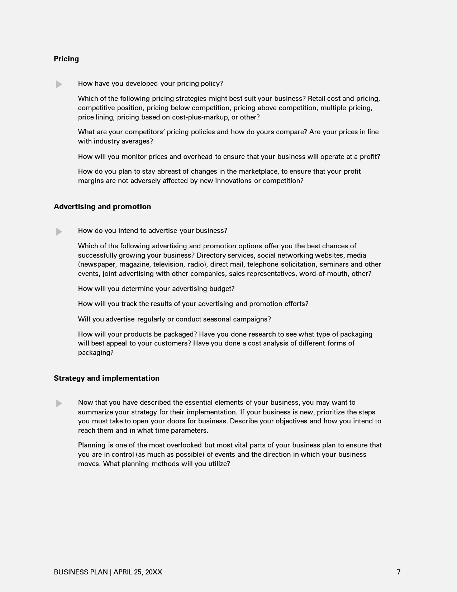 |  |  |
| **Page 10**&nbsp;&nbsp;&nbsp;&nbsp;&nbsp;&nbsp;&nbsp;&nbsp;&nbsp;&nbsp;&nbsp;&nbsp;&nbsp;&nbsp;&nbsp;&nbsp;&nbsp;&nbsp;&nbsp;&nbsp;&nbsp;&nbsp;&nbsp;&nbsp;&nbsp;&nbsp;&nbsp;&nbsp;&nbsp;&nbsp;&nbsp;&nbsp;&nbsp;&nbsp; | **Page 10. ErrorMetric: 0.1056 · SSIM: 0.7741** | **Page 10. ErrorMetric: 0.1014 · SSIM: 0.7938** |
|  |  |  |
| **Page 11**&nbsp;&nbsp;&nbsp;&nbsp;&nbsp;&nbsp;&nbsp;&nbsp;&nbsp;&nbsp;&nbsp;&nbsp;&nbsp;&nbsp;&nbsp;&nbsp;&nbsp;&nbsp;&nbsp;&nbsp;&nbsp;&nbsp;&nbsp;&nbsp;&nbsp;&nbsp;&nbsp;&nbsp;&nbsp;&nbsp;&nbsp;&nbsp;&nbsp;&nbsp; | **Page 11. ErrorMetric: 0.1439 · SSIM: 0.8924** | **Page 11. ErrorMetric: 0.1452 · SSIM: 0.8874** |
|  |  |  |
| **Page 12**&nbsp;&nbsp;&nbsp;&nbsp;&nbsp;&nbsp;&nbsp;&nbsp;&nbsp;&nbsp;&nbsp;&nbsp;&nbsp;&nbsp;&nbsp;&nbsp;&nbsp;&nbsp;&nbsp;&nbsp;&nbsp;&nbsp;&nbsp;&nbsp;&nbsp;&nbsp;&nbsp;&nbsp;&nbsp;&nbsp;&nbsp;&nbsp;&nbsp;&nbsp; | **Page 12. ErrorMetric: 0.3555 · SSIM: 0.6565** | **Page 12. ErrorMetric: 0.3570 · SSIM: 0.6535** |
|  |  |  |
| **Page 13**&nbsp;&nbsp;&nbsp;&nbsp;&nbsp;&nbsp;&nbsp;&nbsp;&nbsp;&nbsp;&nbsp;&nbsp;&nbsp;&nbsp;&nbsp;&nbsp;&nbsp;&nbsp;&nbsp;&nbsp;&nbsp;&nbsp;&nbsp;&nbsp;&nbsp;&nbsp;&nbsp;&nbsp;&nbsp;&nbsp;&nbsp;&nbsp;&nbsp;&nbsp; | **Page 13. ErrorMetric: 0.1085 · SSIM: 0.8294** | **Page 13. ErrorMetric: 0.1300 · SSIM: 0.7313** |
| 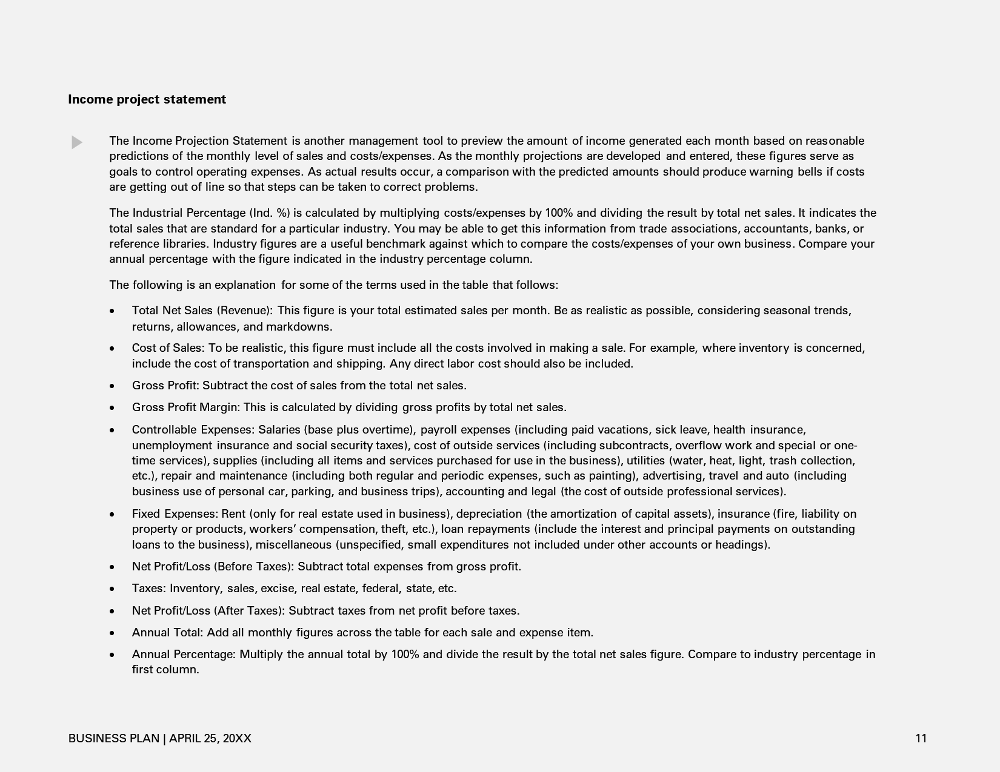 |  |  |
| **Page 14**&nbsp;&nbsp;&nbsp;&nbsp;&nbsp;&nbsp;&nbsp;&nbsp;&nbsp;&nbsp;&nbsp;&nbsp;&nbsp;&nbsp;&nbsp;&nbsp;&nbsp;&nbsp;&nbsp;&nbsp;&nbsp;&nbsp;&nbsp;&nbsp;&nbsp;&nbsp;&nbsp;&nbsp;&nbsp;&nbsp;&nbsp;&nbsp;&nbsp;&nbsp; | **Page 14. ErrorMetric: 0.4904 · SSIM: 0.6805** | **Page 14. ErrorMetric: 0.4913 · SSIM: 0.6759** |
|  |  |  |
| **Page 15**&nbsp;&nbsp;&nbsp;&nbsp;&nbsp;&nbsp;&nbsp;&nbsp;&nbsp;&nbsp;&nbsp;&nbsp;&nbsp;&nbsp;&nbsp;&nbsp;&nbsp;&nbsp;&nbsp;&nbsp;&nbsp;&nbsp;&nbsp;&nbsp;&nbsp;&nbsp;&nbsp;&nbsp;&nbsp;&nbsp;&nbsp;&nbsp;&nbsp;&nbsp; | **Page 15. ErrorMetric: 0.2320 · SSIM: 0.8039** | **Page 15. ErrorMetric: 0.2392 · SSIM: 0.7706** |
|  |  |  |
| **Page 16**&nbsp;&nbsp;&nbsp;&nbsp;&nbsp;&nbsp;&nbsp;&nbsp;&nbsp;&nbsp;&nbsp;&nbsp;&nbsp;&nbsp;&nbsp;&nbsp;&nbsp;&nbsp;&nbsp;&nbsp;&nbsp;&nbsp;&nbsp;&nbsp;&nbsp;&nbsp;&nbsp;&nbsp;&nbsp;&nbsp;&nbsp;&nbsp;&nbsp;&nbsp; | **Page 16. ErrorMetric: 0.0974 · SSIM: 0.8221** | **Page 16. ErrorMetric: 0.1131 · SSIM: 0.7559** |
|  |  |  |
| **Page 17**&nbsp;&nbsp;&nbsp;&nbsp;&nbsp;&nbsp;&nbsp;&nbsp;&nbsp;&nbsp;&nbsp;&nbsp;&nbsp;&nbsp;&nbsp;&nbsp;&nbsp;&nbsp;&nbsp;&nbsp;&nbsp;&nbsp;&nbsp;&nbsp;&nbsp;&nbsp;&nbsp;&nbsp;&nbsp;&nbsp;&nbsp;&nbsp;&nbsp;&nbsp; | **Page 17. ErrorMetric: 0.1682 · SSIM: 0.7111** | **Page 17. ErrorMetric: 0.1648 · SSIM: 0.7219** |
| 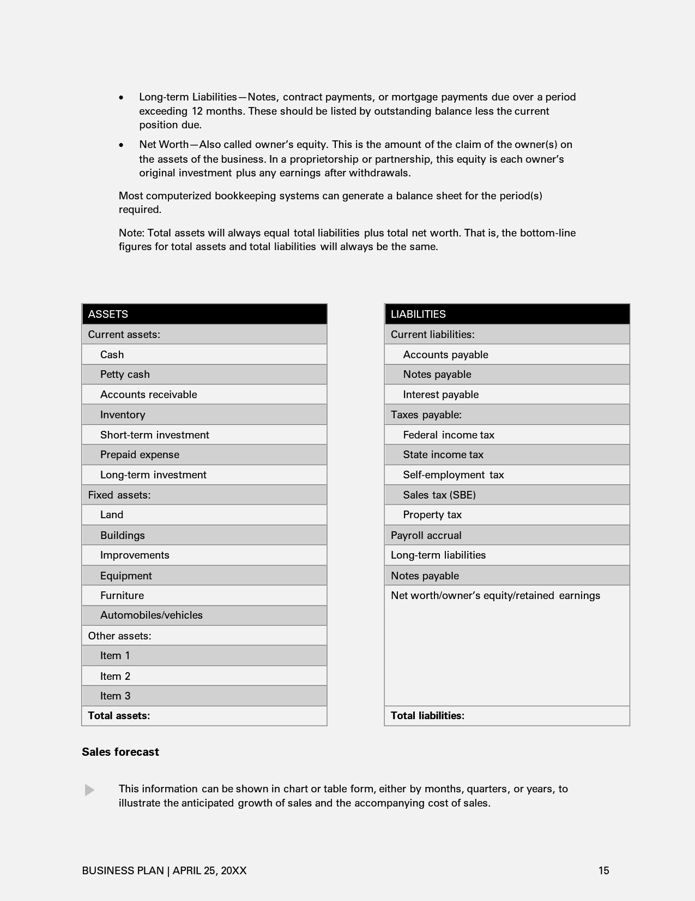 |  |  |
| **Page 18**&nbsp;&nbsp;&nbsp;&nbsp;&nbsp;&nbsp;&nbsp;&nbsp;&nbsp;&nbsp;&nbsp;&nbsp;&nbsp;&nbsp;&nbsp;&nbsp;&nbsp;&nbsp;&nbsp;&nbsp;&nbsp;&nbsp;&nbsp;&nbsp;&nbsp;&nbsp;&nbsp;&nbsp;&nbsp;&nbsp;&nbsp;&nbsp;&nbsp;&nbsp; | **Page 18. ErrorMetric: 0.1064 · SSIM: 0.7313** | **Page 18. ErrorMetric: 0.1073 · SSIM: 0.7215** |
|  |  |  |
| **Page 19**&nbsp;&nbsp;&nbsp;&nbsp;&nbsp;&nbsp;&nbsp;&nbsp;&nbsp;&nbsp;&nbsp;&nbsp;&nbsp;&nbsp;&nbsp;&nbsp;&nbsp;&nbsp;&nbsp;&nbsp;&nbsp;&nbsp;&nbsp;&nbsp;&nbsp;&nbsp;&nbsp;&nbsp;&nbsp;&nbsp;&nbsp;&nbsp;&nbsp;&nbsp; | **Page 19. ErrorMetric: 0.0204 · SSIM: 0.9521** | **Page 19. ErrorMetric: 0.0213 · SSIM: 0.9490** |
| 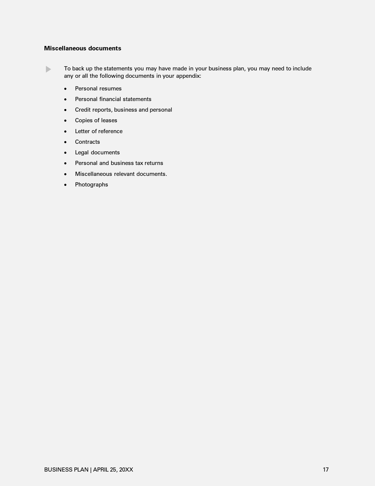 |  |  |

## business/01

| Expected (Word) | Skia | ImageSharp |
| --- | --- | --- |
| **Page 1**&nbsp;&nbsp;&nbsp;&nbsp;&nbsp;&nbsp;&nbsp;&nbsp;&nbsp;&nbsp;&nbsp;&nbsp;&nbsp;&nbsp;&nbsp;&nbsp;&nbsp;&nbsp;&nbsp;&nbsp;&nbsp;&nbsp;&nbsp;&nbsp;&nbsp;&nbsp;&nbsp;&nbsp;&nbsp;&nbsp;&nbsp;&nbsp;&nbsp;&nbsp; | **Page 1. ErrorMetric: 0.0267 · SSIM: 0.9471** | **Page 1. ErrorMetric: 0.0323 · SSIM: 0.9316** |
|  |  |  |

## business/02

| Expected (Word) | Skia | ImageSharp |
| --- | --- | --- |
| **Page 1**&nbsp;&nbsp;&nbsp;&nbsp;&nbsp;&nbsp;&nbsp;&nbsp;&nbsp;&nbsp;&nbsp;&nbsp;&nbsp;&nbsp;&nbsp;&nbsp;&nbsp;&nbsp;&nbsp;&nbsp;&nbsp;&nbsp;&nbsp;&nbsp;&nbsp;&nbsp;&nbsp;&nbsp;&nbsp;&nbsp;&nbsp;&nbsp;&nbsp;&nbsp; | **Page 1. ErrorMetric: 0.0172 · SSIM: 0.9638** | **Page 1. ErrorMetric: 0.0256 · SSIM: 0.9492** |
|  |  |  |

## business/03

| Expected (Word) | Skia | ImageSharp |
| --- | --- | --- |
| **Page 1**&nbsp;&nbsp;&nbsp;&nbsp;&nbsp;&nbsp;&nbsp;&nbsp;&nbsp;&nbsp;&nbsp;&nbsp;&nbsp;&nbsp;&nbsp;&nbsp;&nbsp;&nbsp;&nbsp;&nbsp;&nbsp;&nbsp;&nbsp;&nbsp;&nbsp;&nbsp;&nbsp;&nbsp;&nbsp;&nbsp;&nbsp;&nbsp;&nbsp;&nbsp; | **Page 1. ErrorMetric: 0.2256 · SSIM: 0.8956** | **Page 1. ErrorMetric: 0.2934 · SSIM: 0.8467** |
|  |  |  |
| **Page 2**&nbsp;&nbsp;&nbsp;&nbsp;&nbsp;&nbsp;&nbsp;&nbsp;&nbsp;&nbsp;&nbsp;&nbsp;&nbsp;&nbsp;&nbsp;&nbsp;&nbsp;&nbsp;&nbsp;&nbsp;&nbsp;&nbsp;&nbsp;&nbsp;&nbsp;&nbsp;&nbsp;&nbsp;&nbsp;&nbsp;&nbsp;&nbsp;&nbsp;&nbsp; | **Page 2. ErrorMetric: 0.0528 · SSIM: 0.9262** | **Page 2. ErrorMetric: 0.0668 · SSIM: 0.8622** |
|  |  |  |

## business/04

| Expected (Word) | Skia | ImageSharp |
| --- | --- | --- |
| **Page 1**&nbsp;&nbsp;&nbsp;&nbsp;&nbsp;&nbsp;&nbsp;&nbsp;&nbsp;&nbsp;&nbsp;&nbsp;&nbsp;&nbsp;&nbsp;&nbsp;&nbsp;&nbsp;&nbsp;&nbsp;&nbsp;&nbsp;&nbsp;&nbsp;&nbsp;&nbsp;&nbsp;&nbsp;&nbsp;&nbsp;&nbsp;&nbsp;&nbsp;&nbsp; | **Page 1. ErrorMetric: 0.1709 · SSIM: 0.8967** | **Page 1. ErrorMetric: 0.1793 · SSIM: 0.8637** |
|  |  |  |

## business/05

| Expected (Word) | Skia | ImageSharp |
| --- | --- | --- |
| **Page 1**&nbsp;&nbsp;&nbsp;&nbsp;&nbsp;&nbsp;&nbsp;&nbsp;&nbsp;&nbsp;&nbsp;&nbsp;&nbsp;&nbsp;&nbsp;&nbsp;&nbsp;&nbsp;&nbsp;&nbsp;&nbsp;&nbsp;&nbsp;&nbsp;&nbsp;&nbsp;&nbsp;&nbsp;&nbsp;&nbsp;&nbsp;&nbsp;&nbsp;&nbsp; | **Page 1. ErrorMetric: 0.0474 · SSIM: 0.9180** | **Page 1. ErrorMetric: 0.0564 · SSIM: 0.8789** |
|  |  |  |

## business/06

| Expected (Word) | Skia | ImageSharp |
| --- | --- | --- |
| **Page 1**&nbsp;&nbsp;&nbsp;&nbsp;&nbsp;&nbsp;&nbsp;&nbsp;&nbsp;&nbsp;&nbsp;&nbsp;&nbsp;&nbsp;&nbsp;&nbsp;&nbsp;&nbsp;&nbsp;&nbsp;&nbsp;&nbsp;&nbsp;&nbsp;&nbsp;&nbsp;&nbsp;&nbsp;&nbsp;&nbsp;&nbsp;&nbsp;&nbsp;&nbsp; | **Page 1. ErrorMetric: 0.0724 · SSIM: 0.8425** | **Page 1. ErrorMetric: 0.0749 · SSIM: 0.8371** |
|  |  |  |

## cards/01

| Expected (Word) | Skia | ImageSharp |
| --- | --- | --- |
| **Page 1**&nbsp;&nbsp;&nbsp;&nbsp;&nbsp;&nbsp;&nbsp;&nbsp;&nbsp;&nbsp;&nbsp;&nbsp;&nbsp;&nbsp;&nbsp;&nbsp;&nbsp;&nbsp;&nbsp;&nbsp;&nbsp;&nbsp;&nbsp;&nbsp;&nbsp;&nbsp;&nbsp;&nbsp;&nbsp;&nbsp;&nbsp;&nbsp;&nbsp;&nbsp; | **Page 1. ErrorMetric: 0.3247 · SSIM: 0.9191** | **Page 1. ErrorMetric: 0.3803 · SSIM: 0.9164** |
| 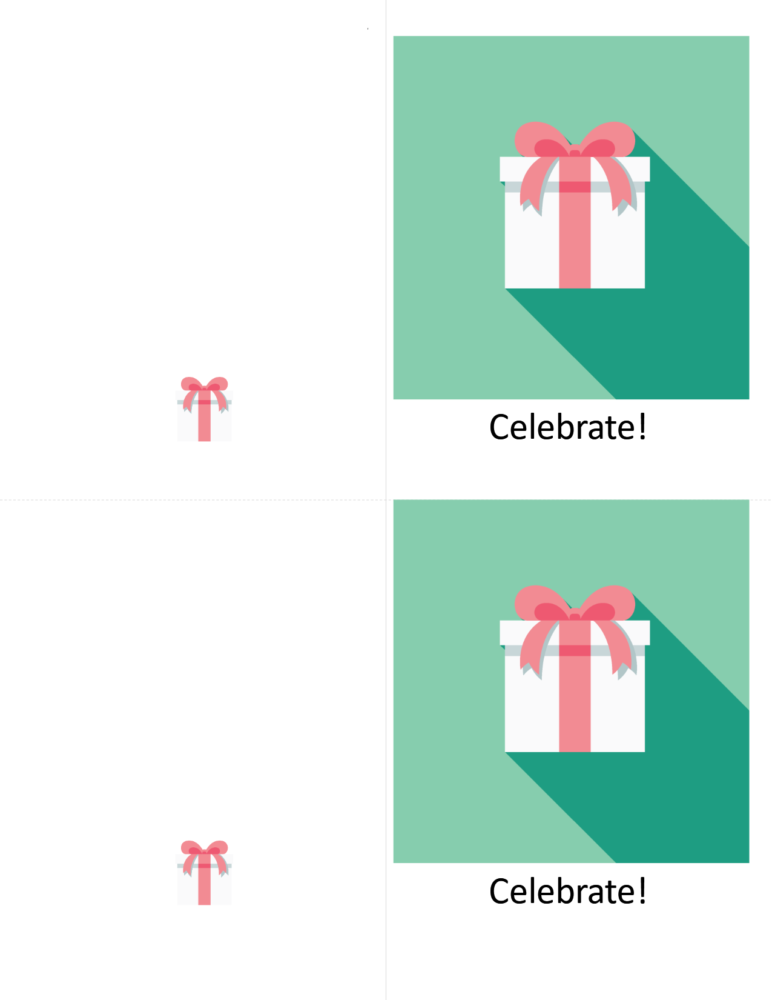 |  |  |
| **Page 2**&nbsp;&nbsp;&nbsp;&nbsp;&nbsp;&nbsp;&nbsp;&nbsp;&nbsp;&nbsp;&nbsp;&nbsp;&nbsp;&nbsp;&nbsp;&nbsp;&nbsp;&nbsp;&nbsp;&nbsp;&nbsp;&nbsp;&nbsp;&nbsp;&nbsp;&nbsp;&nbsp;&nbsp;&nbsp;&nbsp;&nbsp;&nbsp;&nbsp;&nbsp; | **Page 2. ErrorMetric: 0.0158 · SSIM: 0.9672** | **Page 2. ErrorMetric: 0.0168 · SSIM: 0.9599** |
|  |  |  |

## cards/02

| Expected (Word) | Skia | ImageSharp |
| --- | --- | --- |
| **Page 1**&nbsp;&nbsp;&nbsp;&nbsp;&nbsp;&nbsp;&nbsp;&nbsp;&nbsp;&nbsp;&nbsp;&nbsp;&nbsp;&nbsp;&nbsp;&nbsp;&nbsp;&nbsp;&nbsp;&nbsp;&nbsp;&nbsp;&nbsp;&nbsp;&nbsp;&nbsp;&nbsp;&nbsp;&nbsp;&nbsp;&nbsp;&nbsp;&nbsp;&nbsp; | **Page 1. ErrorMetric: 0.0712 · SSIM: 0.9093** | **Page 1. ErrorMetric: 0.0697 · SSIM: 0.9181** |
|  |  |  |
| **Page 2**&nbsp;&nbsp;&nbsp;&nbsp;&nbsp;&nbsp;&nbsp;&nbsp;&nbsp;&nbsp;&nbsp;&nbsp;&nbsp;&nbsp;&nbsp;&nbsp;&nbsp;&nbsp;&nbsp;&nbsp;&nbsp;&nbsp;&nbsp;&nbsp;&nbsp;&nbsp;&nbsp;&nbsp;&nbsp;&nbsp;&nbsp;&nbsp;&nbsp;&nbsp; | **Page 2. ErrorMetric: 0.0391 · SSIM: 0.9585** | **Page 2. ErrorMetric: 0.0478 · SSIM: 0.9459** |
|  |  |  |

## cards/03

| Expected (Word) | Skia | ImageSharp |
| --- | --- | --- |
| **Page 1**&nbsp;&nbsp;&nbsp;&nbsp;&nbsp;&nbsp;&nbsp;&nbsp;&nbsp;&nbsp;&nbsp;&nbsp;&nbsp;&nbsp;&nbsp;&nbsp;&nbsp;&nbsp;&nbsp;&nbsp;&nbsp;&nbsp;&nbsp;&nbsp;&nbsp;&nbsp;&nbsp;&nbsp;&nbsp;&nbsp;&nbsp;&nbsp;&nbsp;&nbsp; | **Page 1. ErrorMetric: 0.0647 · SSIM: 0.9101** | **Page 1. ErrorMetric: 0.0766 · SSIM: 0.8902** |
|  |  |  |

## cards/04

| Expected (Word) | Skia | ImageSharp |
| --- | --- | --- |
| **Page 1**&nbsp;&nbsp;&nbsp;&nbsp;&nbsp;&nbsp;&nbsp;&nbsp;&nbsp;&nbsp;&nbsp;&nbsp;&nbsp;&nbsp;&nbsp;&nbsp;&nbsp;&nbsp;&nbsp;&nbsp;&nbsp;&nbsp;&nbsp;&nbsp;&nbsp;&nbsp;&nbsp;&nbsp;&nbsp;&nbsp;&nbsp;&nbsp;&nbsp;&nbsp; | **Page 1. ErrorMetric: 0.0117 · SSIM: 0.9942** | **Page 1. ErrorMetric: 0.0135 · SSIM: 0.9919** |
| 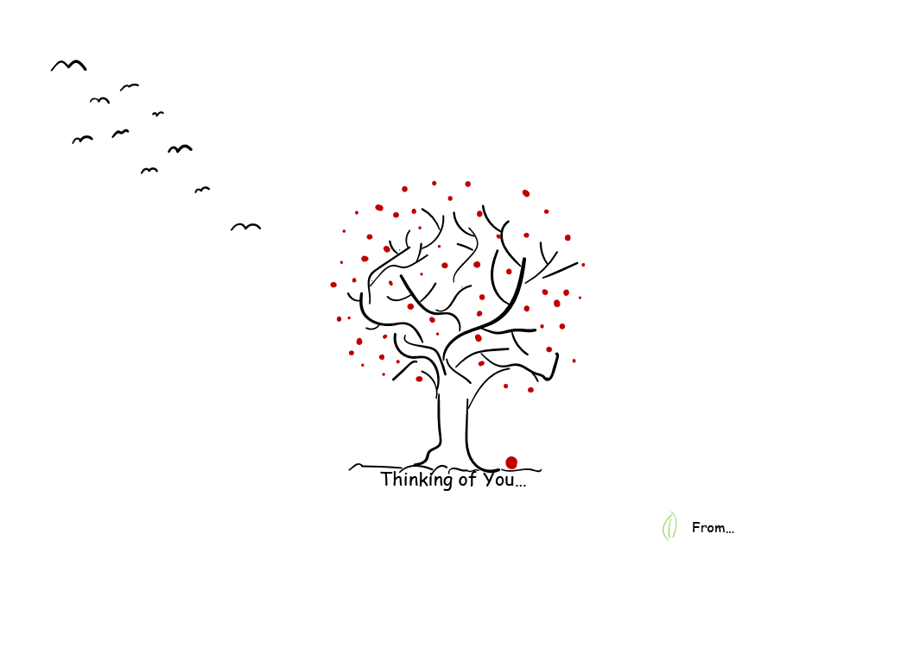 |  |  |

## cards/05

| Expected (Word) | Skia | ImageSharp |
| --- | --- | --- |
| **Page 1**&nbsp;&nbsp;&nbsp;&nbsp;&nbsp;&nbsp;&nbsp;&nbsp;&nbsp;&nbsp;&nbsp;&nbsp;&nbsp;&nbsp;&nbsp;&nbsp;&nbsp;&nbsp;&nbsp;&nbsp;&nbsp;&nbsp;&nbsp;&nbsp;&nbsp;&nbsp;&nbsp;&nbsp;&nbsp;&nbsp;&nbsp;&nbsp;&nbsp;&nbsp; | **Page 1. ErrorMetric: 0.3006 · SSIM: 0.9308** | **Page 1. ErrorMetric: 0.3061 · SSIM: 0.9279** |
|  |  |  |
| **Page 2**&nbsp;&nbsp;&nbsp;&nbsp;&nbsp;&nbsp;&nbsp;&nbsp;&nbsp;&nbsp;&nbsp;&nbsp;&nbsp;&nbsp;&nbsp;&nbsp;&nbsp;&nbsp;&nbsp;&nbsp;&nbsp;&nbsp;&nbsp;&nbsp;&nbsp;&nbsp;&nbsp;&nbsp;&nbsp;&nbsp;&nbsp;&nbsp;&nbsp;&nbsp; | **Page 2. ErrorMetric: 0.0140 · SSIM: 0.9730** | **Page 2. ErrorMetric: 0.0178 · SSIM: 0.9621** |
|  |  |  |
| **Page 3**&nbsp;&nbsp;&nbsp;&nbsp;&nbsp;&nbsp;&nbsp;&nbsp;&nbsp;&nbsp;&nbsp;&nbsp;&nbsp;&nbsp;&nbsp;&nbsp;&nbsp;&nbsp;&nbsp;&nbsp;&nbsp;&nbsp;&nbsp;&nbsp;&nbsp;&nbsp;&nbsp;&nbsp;&nbsp;&nbsp;&nbsp;&nbsp;&nbsp;&nbsp; | **Page 3. ErrorMetric: 0.3012 · SSIM: 0.9472** | **Page 3. ErrorMetric: 0.3064 · SSIM: 0.9366** |
|  |  |  |
| **Page 4**&nbsp;&nbsp;&nbsp;&nbsp;&nbsp;&nbsp;&nbsp;&nbsp;&nbsp;&nbsp;&nbsp;&nbsp;&nbsp;&nbsp;&nbsp;&nbsp;&nbsp;&nbsp;&nbsp;&nbsp;&nbsp;&nbsp;&nbsp;&nbsp;&nbsp;&nbsp;&nbsp;&nbsp;&nbsp;&nbsp;&nbsp;&nbsp;&nbsp;&nbsp; | **Page 4. ErrorMetric: 0.0140 · SSIM: 0.9730** | **Page 4. ErrorMetric: 0.0178 · SSIM: 0.9621** |
|  |  |  |
| **Page 5**&nbsp;&nbsp;&nbsp;&nbsp;&nbsp;&nbsp;&nbsp;&nbsp;&nbsp;&nbsp;&nbsp;&nbsp;&nbsp;&nbsp;&nbsp;&nbsp;&nbsp;&nbsp;&nbsp;&nbsp;&nbsp;&nbsp;&nbsp;&nbsp;&nbsp;&nbsp;&nbsp;&nbsp;&nbsp;&nbsp;&nbsp;&nbsp;&nbsp;&nbsp; | **Page 5. ErrorMetric: 0.2980 · SSIM: 0.9328** | **Page 5. ErrorMetric: 0.3071 · SSIM: 0.9417** |
| 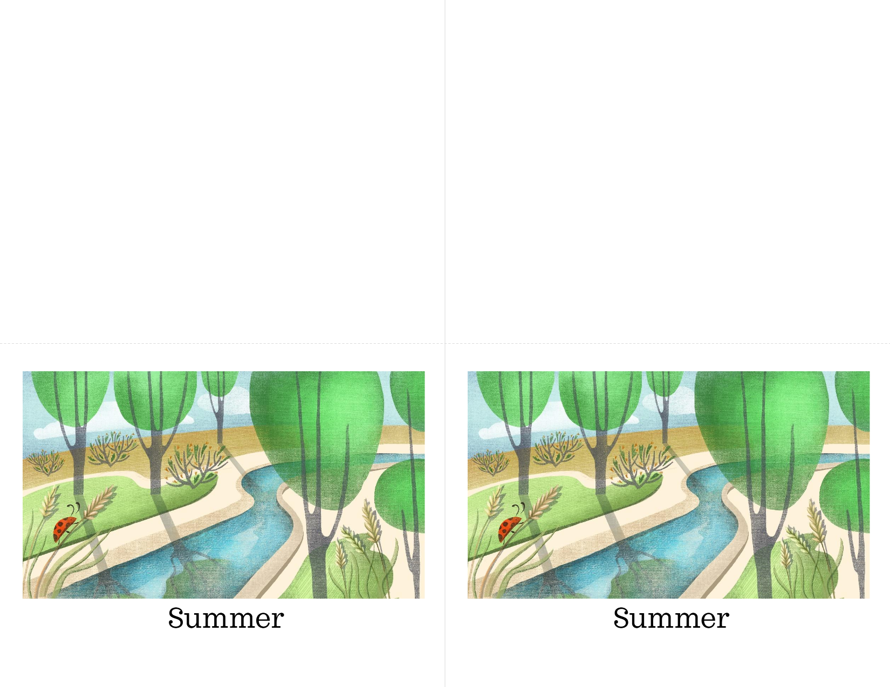 |  |  |
| **Page 6**&nbsp;&nbsp;&nbsp;&nbsp;&nbsp;&nbsp;&nbsp;&nbsp;&nbsp;&nbsp;&nbsp;&nbsp;&nbsp;&nbsp;&nbsp;&nbsp;&nbsp;&nbsp;&nbsp;&nbsp;&nbsp;&nbsp;&nbsp;&nbsp;&nbsp;&nbsp;&nbsp;&nbsp;&nbsp;&nbsp;&nbsp;&nbsp;&nbsp;&nbsp; | **Page 6. ErrorMetric: 0.0140 · SSIM: 0.9730** | **Page 6. ErrorMetric: 0.0178 · SSIM: 0.9621** |
|  |  |  |
| **Page 7**&nbsp;&nbsp;&nbsp;&nbsp;&nbsp;&nbsp;&nbsp;&nbsp;&nbsp;&nbsp;&nbsp;&nbsp;&nbsp;&nbsp;&nbsp;&nbsp;&nbsp;&nbsp;&nbsp;&nbsp;&nbsp;&nbsp;&nbsp;&nbsp;&nbsp;&nbsp;&nbsp;&nbsp;&nbsp;&nbsp;&nbsp;&nbsp;&nbsp;&nbsp; | **Page 7. ErrorMetric: 0.3013 · SSIM: 0.9352** | **Page 7. ErrorMetric: 0.3065 · SSIM: 0.9438** |
|  |  |  |
| **Page 8**&nbsp;&nbsp;&nbsp;&nbsp;&nbsp;&nbsp;&nbsp;&nbsp;&nbsp;&nbsp;&nbsp;&nbsp;&nbsp;&nbsp;&nbsp;&nbsp;&nbsp;&nbsp;&nbsp;&nbsp;&nbsp;&nbsp;&nbsp;&nbsp;&nbsp;&nbsp;&nbsp;&nbsp;&nbsp;&nbsp;&nbsp;&nbsp;&nbsp;&nbsp; | **Page 8. ErrorMetric: 0.0140 · SSIM: 0.9730** | **Page 8. ErrorMetric: 0.0178 · SSIM: 0.9621** |
|  |  |  |

## cards/06

| Expected (Word) | Skia | ImageSharp |
| --- | --- | --- |
| **Page 1**&nbsp;&nbsp;&nbsp;&nbsp;&nbsp;&nbsp;&nbsp;&nbsp;&nbsp;&nbsp;&nbsp;&nbsp;&nbsp;&nbsp;&nbsp;&nbsp;&nbsp;&nbsp;&nbsp;&nbsp;&nbsp;&nbsp;&nbsp;&nbsp;&nbsp;&nbsp;&nbsp;&nbsp;&nbsp;&nbsp;&nbsp;&nbsp;&nbsp;&nbsp; | **Page 1. ErrorMetric: 0.4817 · SSIM: 0.9299** | **Page 1. ErrorMetric: 0.4857 · SSIM: 0.9129** |
|  |  |  |
| **Page 2**&nbsp;&nbsp;&nbsp;&nbsp;&nbsp;&nbsp;&nbsp;&nbsp;&nbsp;&nbsp;&nbsp;&nbsp;&nbsp;&nbsp;&nbsp;&nbsp;&nbsp;&nbsp;&nbsp;&nbsp;&nbsp;&nbsp;&nbsp;&nbsp;&nbsp;&nbsp;&nbsp;&nbsp;&nbsp;&nbsp;&nbsp;&nbsp;&nbsp;&nbsp; | **Page 2. ErrorMetric: 0.0411 · SSIM: 0.9062** | **Page 2. ErrorMetric: 0.0432 · SSIM: 0.8946** |
|  |  |  |

## cards/07

| Expected (Word) | Skia | ImageSharp |
| --- | --- | --- |
| **Page 1**&nbsp;&nbsp;&nbsp;&nbsp;&nbsp;&nbsp;&nbsp;&nbsp;&nbsp;&nbsp;&nbsp;&nbsp;&nbsp;&nbsp;&nbsp;&nbsp;&nbsp;&nbsp;&nbsp;&nbsp;&nbsp;&nbsp;&nbsp;&nbsp;&nbsp;&nbsp;&nbsp;&nbsp;&nbsp;&nbsp;&nbsp;&nbsp;&nbsp;&nbsp; | **Page 1. ErrorMetric: 0.3819 · SSIM: 0.8920** | **Page 1. ErrorMetric: 0.3010 · SSIM: 0.8901** |
|  |  |  |
| **Page 2**&nbsp;&nbsp;&nbsp;&nbsp;&nbsp;&nbsp;&nbsp;&nbsp;&nbsp;&nbsp;&nbsp;&nbsp;&nbsp;&nbsp;&nbsp;&nbsp;&nbsp;&nbsp;&nbsp;&nbsp;&nbsp;&nbsp;&nbsp;&nbsp;&nbsp;&nbsp;&nbsp;&nbsp;&nbsp;&nbsp;&nbsp;&nbsp;&nbsp;&nbsp; | **Page 2. ErrorMetric: 0.0160 · SSIM: 0.9663** | **Page 2. ErrorMetric: 0.0170 · SSIM: 0.9592** |
|  |  |  |

## cards/08

| Expected (Word) | Skia | ImageSharp |
| --- | --- | --- |
| **Page 1**&nbsp;&nbsp;&nbsp;&nbsp;&nbsp;&nbsp;&nbsp;&nbsp;&nbsp;&nbsp;&nbsp;&nbsp;&nbsp;&nbsp;&nbsp;&nbsp;&nbsp;&nbsp;&nbsp;&nbsp;&nbsp;&nbsp;&nbsp;&nbsp;&nbsp;&nbsp;&nbsp;&nbsp;&nbsp;&nbsp;&nbsp;&nbsp;&nbsp;&nbsp; | **Page 1. ErrorMetric: 0.3866 · SSIM: 0.6673** | **Page 1. ErrorMetric: 0.3869 · SSIM: 0.6686** |
|  |  |  |
| **Page 2**&nbsp;&nbsp;&nbsp;&nbsp;&nbsp;&nbsp;&nbsp;&nbsp;&nbsp;&nbsp;&nbsp;&nbsp;&nbsp;&nbsp;&nbsp;&nbsp;&nbsp;&nbsp;&nbsp;&nbsp;&nbsp;&nbsp;&nbsp;&nbsp;&nbsp;&nbsp;&nbsp;&nbsp;&nbsp;&nbsp;&nbsp;&nbsp;&nbsp;&nbsp; | **Page 2. ErrorMetric: 0.0199 · SSIM: 0.9628** | **Page 2. ErrorMetric: 0.0178 · SSIM: 0.9632** |
|  |  |  |
| **Page 3**&nbsp;&nbsp;&nbsp;&nbsp;&nbsp;&nbsp;&nbsp;&nbsp;&nbsp;&nbsp;&nbsp;&nbsp;&nbsp;&nbsp;&nbsp;&nbsp;&nbsp;&nbsp;&nbsp;&nbsp;&nbsp;&nbsp;&nbsp;&nbsp;&nbsp;&nbsp;&nbsp;&nbsp;&nbsp;&nbsp;&nbsp;&nbsp;&nbsp;&nbsp; | **Page 3. ErrorMetric: 0.3796 · SSIM: 0.6904** | **Page 3. ErrorMetric: 0.3800 · SSIM: 0.6916** |
|  |  |  |
| **Page 4**&nbsp;&nbsp;&nbsp;&nbsp;&nbsp;&nbsp;&nbsp;&nbsp;&nbsp;&nbsp;&nbsp;&nbsp;&nbsp;&nbsp;&nbsp;&nbsp;&nbsp;&nbsp;&nbsp;&nbsp;&nbsp;&nbsp;&nbsp;&nbsp;&nbsp;&nbsp;&nbsp;&nbsp;&nbsp;&nbsp;&nbsp;&nbsp;&nbsp;&nbsp; | **Page 4. ErrorMetric: 0.0199 · SSIM: 0.9628** | **Page 4. ErrorMetric: 0.0178 · SSIM: 0.9632** |
|  |  |  |

## cards/09

| Expected (Word) | Skia | ImageSharp |
| --- | --- | --- |
| **Page 1**&nbsp;&nbsp;&nbsp;&nbsp;&nbsp;&nbsp;&nbsp;&nbsp;&nbsp;&nbsp;&nbsp;&nbsp;&nbsp;&nbsp;&nbsp;&nbsp;&nbsp;&nbsp;&nbsp;&nbsp;&nbsp;&nbsp;&nbsp;&nbsp;&nbsp;&nbsp;&nbsp;&nbsp;&nbsp;&nbsp;&nbsp;&nbsp;&nbsp;&nbsp; | **Page 1. ErrorMetric: 0.0587 · SSIM: 0.8691** | **Page 1. ErrorMetric: 0.0574 · SSIM: 0.8730** |
|  |  |  |

## cards/10

| Expected (Word) | Skia | ImageSharp |
| --- | --- | --- |
| **Page 1**&nbsp;&nbsp;&nbsp;&nbsp;&nbsp;&nbsp;&nbsp;&nbsp;&nbsp;&nbsp;&nbsp;&nbsp;&nbsp;&nbsp;&nbsp;&nbsp;&nbsp;&nbsp;&nbsp;&nbsp;&nbsp;&nbsp;&nbsp;&nbsp;&nbsp;&nbsp;&nbsp;&nbsp;&nbsp;&nbsp;&nbsp;&nbsp;&nbsp;&nbsp; | **Page 1. ErrorMetric: 0.1690 · SSIM: 0.9860** | **Page 1. ErrorMetric: 0.1690 · SSIM: 0.9876** |
|  |  |  |

## cards/11

| Expected (Word) | Skia | ImageSharp |
| --- | --- | --- |
| **Page 1**&nbsp;&nbsp;&nbsp;&nbsp;&nbsp;&nbsp;&nbsp;&nbsp;&nbsp;&nbsp;&nbsp;&nbsp;&nbsp;&nbsp;&nbsp;&nbsp;&nbsp;&nbsp;&nbsp;&nbsp;&nbsp;&nbsp;&nbsp;&nbsp;&nbsp;&nbsp;&nbsp;&nbsp;&nbsp;&nbsp;&nbsp;&nbsp;&nbsp;&nbsp; | **Page 1. ErrorMetric: 0.3786 · SSIM: 0.9022** | **Page 1. ErrorMetric: 0.2970 · SSIM: 0.9005** |
| 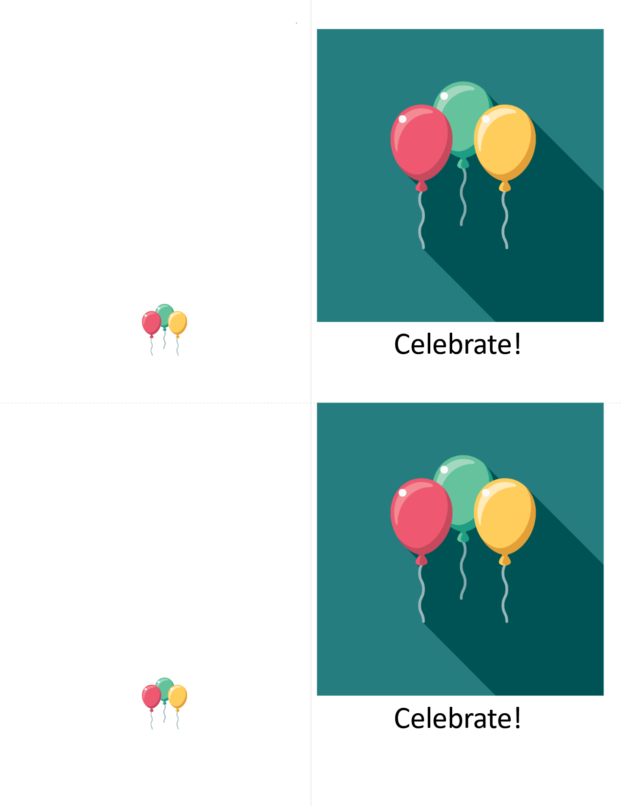 |  |  |
| **Page 2**&nbsp;&nbsp;&nbsp;&nbsp;&nbsp;&nbsp;&nbsp;&nbsp;&nbsp;&nbsp;&nbsp;&nbsp;&nbsp;&nbsp;&nbsp;&nbsp;&nbsp;&nbsp;&nbsp;&nbsp;&nbsp;&nbsp;&nbsp;&nbsp;&nbsp;&nbsp;&nbsp;&nbsp;&nbsp;&nbsp;&nbsp;&nbsp;&nbsp;&nbsp; | **Page 2. ErrorMetric: 0.0158 · SSIM: 0.9672** | **Page 2. ErrorMetric: 0.0168 · SSIM: 0.9599** |
|  |  |  |

## cards/12

| Expected (Word) | Skia | ImageSharp |
| --- | --- | --- |
| **Page 1**&nbsp;&nbsp;&nbsp;&nbsp;&nbsp;&nbsp;&nbsp;&nbsp;&nbsp;&nbsp;&nbsp;&nbsp;&nbsp;&nbsp;&nbsp;&nbsp;&nbsp;&nbsp;&nbsp;&nbsp;&nbsp;&nbsp;&nbsp;&nbsp;&nbsp;&nbsp;&nbsp;&nbsp;&nbsp;&nbsp;&nbsp;&nbsp;&nbsp;&nbsp; | **Page 1. ErrorMetric: 0.3017 · SSIM: 0.9722** | **Page 1. ErrorMetric: 0.1811 · SSIM: 0.9641** |
|  |  |  |
| **Page 2**&nbsp;&nbsp;&nbsp;&nbsp;&nbsp;&nbsp;&nbsp;&nbsp;&nbsp;&nbsp;&nbsp;&nbsp;&nbsp;&nbsp;&nbsp;&nbsp;&nbsp;&nbsp;&nbsp;&nbsp;&nbsp;&nbsp;&nbsp;&nbsp;&nbsp;&nbsp;&nbsp;&nbsp;&nbsp;&nbsp;&nbsp;&nbsp;&nbsp;&nbsp; | **Page 2. ErrorMetric: 0.0083 · SSIM: 0.9834** | **Page 2. ErrorMetric: 0.0092 · SSIM: 0.9831** |
|  |  |  |

## cards/13

| Expected (Word) | Skia | ImageSharp |
| --- | --- | --- |
| **Page 1**&nbsp;&nbsp;&nbsp;&nbsp;&nbsp;&nbsp;&nbsp;&nbsp;&nbsp;&nbsp;&nbsp;&nbsp;&nbsp;&nbsp;&nbsp;&nbsp;&nbsp;&nbsp;&nbsp;&nbsp;&nbsp;&nbsp;&nbsp;&nbsp;&nbsp;&nbsp;&nbsp;&nbsp;&nbsp;&nbsp;&nbsp;&nbsp;&nbsp;&nbsp; | **Page 1. ErrorMetric: 0.1029 · SSIM: 0.7956** | **Page 1. ErrorMetric: 0.1044 · SSIM: 0.7889** |
|  |  |  |

## cards/15

| Expected (Word) | Skia | ImageSharp |
| --- | --- | --- |
| **Page 1**&nbsp;&nbsp;&nbsp;&nbsp;&nbsp;&nbsp;&nbsp;&nbsp;&nbsp;&nbsp;&nbsp;&nbsp;&nbsp;&nbsp;&nbsp;&nbsp;&nbsp;&nbsp;&nbsp;&nbsp;&nbsp;&nbsp;&nbsp;&nbsp;&nbsp;&nbsp;&nbsp;&nbsp;&nbsp;&nbsp;&nbsp;&nbsp;&nbsp;&nbsp; | **Page 1. ErrorMetric: 0.3796 · SSIM: 0.8990** | **Page 1. ErrorMetric: 0.3188 · SSIM: 0.8968** |
|  |  |  |
| **Page 2**&nbsp;&nbsp;&nbsp;&nbsp;&nbsp;&nbsp;&nbsp;&nbsp;&nbsp;&nbsp;&nbsp;&nbsp;&nbsp;&nbsp;&nbsp;&nbsp;&nbsp;&nbsp;&nbsp;&nbsp;&nbsp;&nbsp;&nbsp;&nbsp;&nbsp;&nbsp;&nbsp;&nbsp;&nbsp;&nbsp;&nbsp;&nbsp;&nbsp;&nbsp; | **Page 2. ErrorMetric: 0.0158 · SSIM: 0.9672** | **Page 2. ErrorMetric: 0.0168 · SSIM: 0.9599** |
|  |  |  |

## cards/16

| Expected (Word) | Skia | ImageSharp |
| --- | --- | --- |
| **Page 1**&nbsp;&nbsp;&nbsp;&nbsp;&nbsp;&nbsp;&nbsp;&nbsp;&nbsp;&nbsp;&nbsp;&nbsp;&nbsp;&nbsp;&nbsp;&nbsp;&nbsp;&nbsp;&nbsp;&nbsp;&nbsp;&nbsp;&nbsp;&nbsp;&nbsp;&nbsp;&nbsp;&nbsp;&nbsp;&nbsp;&nbsp;&nbsp;&nbsp;&nbsp; | **Page 1. ErrorMetric: 0.0523 · SSIM: 0.9796** | **Page 1. ErrorMetric: 0.0674 · SSIM: 0.9555** |
| 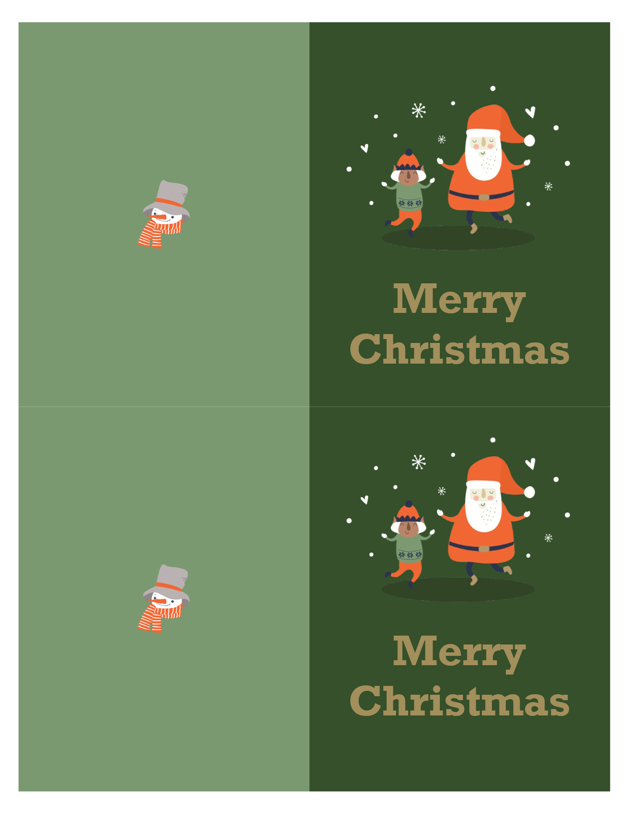 |  |  |
| **Page 2**&nbsp;&nbsp;&nbsp;&nbsp;&nbsp;&nbsp;&nbsp;&nbsp;&nbsp;&nbsp;&nbsp;&nbsp;&nbsp;&nbsp;&nbsp;&nbsp;&nbsp;&nbsp;&nbsp;&nbsp;&nbsp;&nbsp;&nbsp;&nbsp;&nbsp;&nbsp;&nbsp;&nbsp;&nbsp;&nbsp;&nbsp;&nbsp;&nbsp;&nbsp; | **Page 2. ErrorMetric: 0.0055 · SSIM: 0.9948** | **Page 2. ErrorMetric: 0.0100 · SSIM: 0.9811** |
|  |  |  |
| **Page 3**&nbsp;&nbsp;&nbsp;&nbsp;&nbsp;&nbsp;&nbsp;&nbsp;&nbsp;&nbsp;&nbsp;&nbsp;&nbsp;&nbsp;&nbsp;&nbsp;&nbsp;&nbsp;&nbsp;&nbsp;&nbsp;&nbsp;&nbsp;&nbsp;&nbsp;&nbsp;&nbsp;&nbsp;&nbsp;&nbsp;&nbsp;&nbsp;&nbsp;&nbsp; | **Page 3. ErrorMetric: 0.0251 · SSIM: 0.9845** | **Page 3. ErrorMetric: 0.0443 · SSIM: 0.9490** |
|  |  |  |
| **Page 4**&nbsp;&nbsp;&nbsp;&nbsp;&nbsp;&nbsp;&nbsp;&nbsp;&nbsp;&nbsp;&nbsp;&nbsp;&nbsp;&nbsp;&nbsp;&nbsp;&nbsp;&nbsp;&nbsp;&nbsp;&nbsp;&nbsp;&nbsp;&nbsp;&nbsp;&nbsp;&nbsp;&nbsp;&nbsp;&nbsp;&nbsp;&nbsp;&nbsp;&nbsp; | **Page 4. ErrorMetric: 0.0062 · SSIM: 0.9930** | **Page 4. ErrorMetric: 0.0103 · SSIM: 0.9805** |
|  |  |  |
| **Page 5**&nbsp;&nbsp;&nbsp;&nbsp;&nbsp;&nbsp;&nbsp;&nbsp;&nbsp;&nbsp;&nbsp;&nbsp;&nbsp;&nbsp;&nbsp;&nbsp;&nbsp;&nbsp;&nbsp;&nbsp;&nbsp;&nbsp;&nbsp;&nbsp;&nbsp;&nbsp;&nbsp;&nbsp;&nbsp;&nbsp;&nbsp;&nbsp;&nbsp;&nbsp; | **Page 5. ErrorMetric: 0.0541 · SSIM: 0.9779** | **Page 5. ErrorMetric: 0.0700 · SSIM: 0.9513** |
|  |  |  |
| **Page 6**&nbsp;&nbsp;&nbsp;&nbsp;&nbsp;&nbsp;&nbsp;&nbsp;&nbsp;&nbsp;&nbsp;&nbsp;&nbsp;&nbsp;&nbsp;&nbsp;&nbsp;&nbsp;&nbsp;&nbsp;&nbsp;&nbsp;&nbsp;&nbsp;&nbsp;&nbsp;&nbsp;&nbsp;&nbsp;&nbsp;&nbsp;&nbsp;&nbsp;&nbsp; | **Page 6. ErrorMetric: 0.0055 · SSIM: 0.9951** | **Page 6. ErrorMetric: 0.0100 · SSIM: 0.9814** |
|  |  |  |

## cards/18

| Expected (Word) | Skia | ImageSharp |
| --- | --- | --- |
| **Page 1**&nbsp;&nbsp;&nbsp;&nbsp;&nbsp;&nbsp;&nbsp;&nbsp;&nbsp;&nbsp;&nbsp;&nbsp;&nbsp;&nbsp;&nbsp;&nbsp;&nbsp;&nbsp;&nbsp;&nbsp;&nbsp;&nbsp;&nbsp;&nbsp;&nbsp;&nbsp;&nbsp;&nbsp;&nbsp;&nbsp;&nbsp;&nbsp;&nbsp;&nbsp; | **Page 1. ErrorMetric: 0.0315 · SSIM: 0.9626** | **Page 1. ErrorMetric: 0.0377 · SSIM: 0.9540** |
|  |  |  |

## cards/19

| Expected (Word) | Skia | ImageSharp |
| --- | --- | --- |
| **Page 1**&nbsp;&nbsp;&nbsp;&nbsp;&nbsp;&nbsp;&nbsp;&nbsp;&nbsp;&nbsp;&nbsp;&nbsp;&nbsp;&nbsp;&nbsp;&nbsp;&nbsp;&nbsp;&nbsp;&nbsp;&nbsp;&nbsp;&nbsp;&nbsp;&nbsp;&nbsp;&nbsp;&nbsp;&nbsp;&nbsp;&nbsp;&nbsp;&nbsp;&nbsp; | **Page 1. ErrorMetric: 0.0914 · SSIM: 0.9281** | **Page 1. ErrorMetric: 0.1110 · SSIM: 0.9090** |
|  |  |  |
| **Page 2**&nbsp;&nbsp;&nbsp;&nbsp;&nbsp;&nbsp;&nbsp;&nbsp;&nbsp;&nbsp;&nbsp;&nbsp;&nbsp;&nbsp;&nbsp;&nbsp;&nbsp;&nbsp;&nbsp;&nbsp;&nbsp;&nbsp;&nbsp;&nbsp;&nbsp;&nbsp;&nbsp;&nbsp;&nbsp;&nbsp;&nbsp;&nbsp;&nbsp;&nbsp; | **Page 2. ErrorMetric: 0.0751 · SSIM: 0.8779** | **Page 2. ErrorMetric: 0.0786 · SSIM: 0.8866** |
|  |  |  |
| **Page 3**&nbsp;&nbsp;&nbsp;&nbsp;&nbsp;&nbsp;&nbsp;&nbsp;&nbsp;&nbsp;&nbsp;&nbsp;&nbsp;&nbsp;&nbsp;&nbsp;&nbsp;&nbsp;&nbsp;&nbsp;&nbsp;&nbsp;&nbsp;&nbsp;&nbsp;&nbsp;&nbsp;&nbsp;&nbsp;&nbsp;&nbsp;&nbsp;&nbsp;&nbsp; | **Page 3. ErrorMetric: 0.0952 · SSIM: 0.9238** | **Page 3. ErrorMetric: 0.1393 · SSIM: 0.8868** |
|  |  |  |
| **Page 4**&nbsp;&nbsp;&nbsp;&nbsp;&nbsp;&nbsp;&nbsp;&nbsp;&nbsp;&nbsp;&nbsp;&nbsp;&nbsp;&nbsp;&nbsp;&nbsp;&nbsp;&nbsp;&nbsp;&nbsp;&nbsp;&nbsp;&nbsp;&nbsp;&nbsp;&nbsp;&nbsp;&nbsp;&nbsp;&nbsp;&nbsp;&nbsp;&nbsp;&nbsp; | **Page 4. ErrorMetric: 0.0749 · SSIM: 0.8833** | **Page 4. ErrorMetric: 0.0824 · SSIM: 0.8786** |
|  |  |  |

## colored_text

| Expected (Word) | Skia | ImageSharp |
| --- | --- | --- |
| **Page 1**&nbsp;&nbsp;&nbsp;&nbsp;&nbsp;&nbsp;&nbsp;&nbsp;&nbsp;&nbsp;&nbsp;&nbsp;&nbsp;&nbsp;&nbsp;&nbsp;&nbsp;&nbsp;&nbsp;&nbsp;&nbsp;&nbsp;&nbsp;&nbsp;&nbsp;&nbsp;&nbsp;&nbsp;&nbsp;&nbsp;&nbsp;&nbsp;&nbsp;&nbsp; | **Page 1. ErrorMetric: 0.0046 · SSIM: 0.9914** | **Page 1. ErrorMetric: 0.0048 · SSIM: 0.9909** |
|  |  |  |

## color_transform_hsl

Pins the HSL transform family — `a:satMod`, `a:lumMod`, `a:lumOff` — and in particular the rule
that **saturation is not clamped**.

A 6x7 grid of page-anchored 0.8in squares, first swatch at 0.35in / 0.8in, 1.1in pitch.

Rows 1-4 sweep `a:satMod` at 50/100/150/200/300/400% over bases of rising saturation:
4472C4 (s≈0.50), ED7D31 (s≈0.83), A5A5A5 (s=0, a control that must not move at any value) and
FF0000 (s=1, already at the gamut edge).

Rows 5-7 are the luminance cases over 4472C4, ED7D31 and C8C8C8: `lumMod 150`, `lumMod 200`,
`lumOff 50`, `lumOff 80`, `lumMod 75 + lumOff 50`, `lumMod 200 + lumOff 50`.

**Saturation is unclamped.** Word lets `a:satMod` drive HSL saturation past 1 and clips at the
RGB byte instead. 4472C4 therefore keeps moving after saturation nominally maxes out:

| base | 50% | 100% | 150% | 200% | 300% | 400% |
| --- | --- | --- | --- | --- | --- | --- |
| 4472C4 | 647BA4 | 4472C4 | 2469E4 | 0460FF | 004EFF | 003CFF |
| ED7D31 | BE8660 | ED7D31 | FF7402 | FF6B00 | FF5900 | FF4700 |
| A5A5A5 | A5A5A5 | A5A5A5 | A5A5A5 | A5A5A5 | A5A5A5 | A5A5A5 |
| FF0000 | BF4040 | FF0000 | FF0000 | FF0000 | FF0000 | FF0000 |

Clamping saturation to 1 parks 4472C4 at 0961FF from 200% onward and is out by up to 51 per
channel by 400%. The unclamped model is exact on all 24. This is not an edge case: over 97% of
the `a:satMod` values in the corpus exceed 100%.

**Luminance, by contrast, may be clamped** — an out-of-range luminance saturates to black or
white either way, and rows 5-7 measured identical under both. The implementation clamps it, and
this fixture records that the choice is free rather than load-bearing.

The `A5A5A5` row is the one to read first if this scenario ever fails: a neutral grey has no
saturation to modulate, so any movement there means the HSL round trip itself has broken rather
than the transform.

| Expected (Word) | Skia | ImageSharp |
| --- | --- | --- |
| **Page 1**&nbsp;&nbsp;&nbsp;&nbsp;&nbsp;&nbsp;&nbsp;&nbsp;&nbsp;&nbsp;&nbsp;&nbsp;&nbsp;&nbsp;&nbsp;&nbsp;&nbsp;&nbsp;&nbsp;&nbsp;&nbsp;&nbsp;&nbsp;&nbsp;&nbsp;&nbsp;&nbsp;&nbsp;&nbsp;&nbsp;&nbsp;&nbsp;&nbsp;&nbsp; | **Page 1. ErrorMetric: 0.0063 · SSIM: 0.9882** | **Page 1. ErrorMetric: 0.0090 · SSIM: 0.9864** |
| 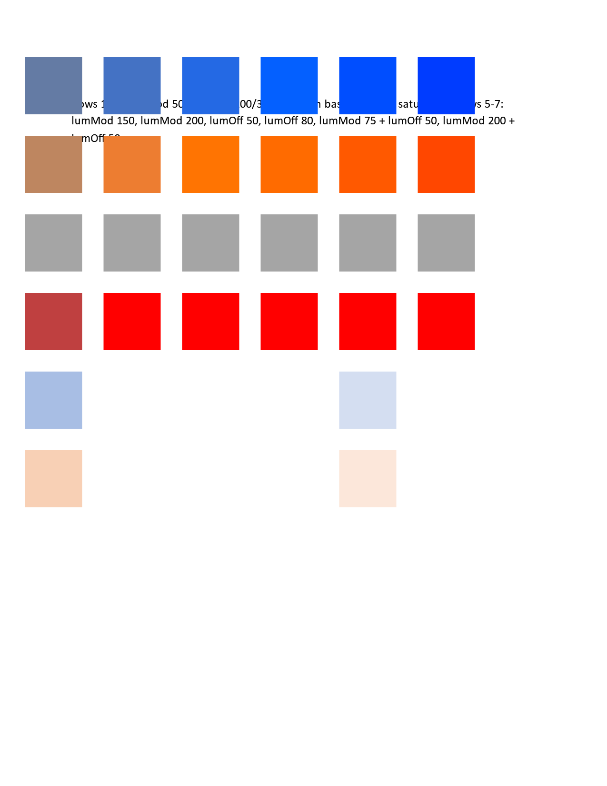 |  |  |

## color_transform_order

Pins the composition rule: Word applies a colour's transform children **in document order**, so
the same two transforms in opposite order give different colours.

A 10x2 grid of page-anchored 0.7in squares, first swatch at 0.3in / 1.0in, 0.78in pitch. Rows are
`a:schemeClr val="accent1"` (4472C4) and `accent2` (ED7D31). Columns:

| # | children, in document order |
| --- | --- |
| 1 | none |
| 2 | `lumMod 50` |
| 3 | `shade 50` |
| 4 | `lumMod 50`, `shade 50` |
| 5 | `shade 50`, `lumMod 50` |
| 6 | `lumMod 75`, `tint 50` |
| 7 | `tint 50`, `lumMod 75` |
| 8 | `satMod 200`, `shade 50` |
| 9 | `shade 50`, `satMod 200` |
| 10 | `lumMod 60`, `lumOff 20`, `shade 75` |

**Columns 4/5, 6/7 and 8/9 are the same pair reversed and must NOT render alike.** On accent1,
column 4 is 142748 and column 5 is 182948; on accent2, column 6 is E5C4BC against column 7's
E9805E — a 94-per-channel gap. Any implementation that sorts transforms into a fixed order, or
that folds them into a single pass, fits one column of each pair and misses the other. Columns 2
and 3 are the single-transform controls that both orderings must agree with.

This rule is why the transform list is an ordered `IReadOnlyList<ColorTransform>` rather than the
flat property bag it replaced: the bag could not represent column 4 and column 5 as different
inputs at all. Repeats matter for the same reason and are kept rather than collapsed — the corpus
carries colours with nine `lumMod`/`satMod`/`tint` triples in a row, and reading only the first of
each kind silently dropped the rest.

Column 10 is the three-child case that mixes both spaces in one chain, and column 8/9 the case
where the interleaved transform pushes saturation past the gamut edge; those two are where an
implementation that batches HSL operations has to be careful to break the batch at a `shade`.

| Expected (Word) | Skia | ImageSharp |
| --- | --- | --- |
| **Page 1**&nbsp;&nbsp;&nbsp;&nbsp;&nbsp;&nbsp;&nbsp;&nbsp;&nbsp;&nbsp;&nbsp;&nbsp;&nbsp;&nbsp;&nbsp;&nbsp;&nbsp;&nbsp;&nbsp;&nbsp;&nbsp;&nbsp;&nbsp;&nbsp;&nbsp;&nbsp;&nbsp;&nbsp;&nbsp;&nbsp;&nbsp;&nbsp;&nbsp;&nbsp; | **Page 1. ErrorMetric: 0.0440 · SSIM: 0.9955** | **Page 1. ErrorMetric: 0.0440 · SSIM: 0.9955** |
|  |  |  |

## color_transform_shade_tint

Pins the model for DrawingML `a:shade` / `a:tint`: **linear light**, at the full `0-100000`
precision, independent of whether the base colour is a literal or a theme entry.

A 7x4 grid of page-anchored 0.8in squares. Columns are the transform — plain, `a:shade` at
25/50/75%, `a:tint` at 25/50/75%. Rows are the base — `a:srgbClr val="748DF3"`,
`a:srgbClr val="ED7D31"`, `a:schemeClr val="accent1"` (4472C4), `a:schemeClr val="accent2"`
(ED7D31). Geometry: first swatch at 0.35in / 0.8in from the page origin, 1.1in pitch, so at
150 DPI a swatch centre sits at `150 * (0.75 + 1.1*column)` by `150 * (1.2 + 1.1*row)`.

Rows 2 and 4 are the same base colour reached two different ways, and must render identically.
That pairing is the point of the fixture: the transform means the same thing whichever kind of
colour declared it, and the codebase previously disagreed with itself about that.

**Word's values** (150 DPI, measured at the swatch centres):

| base | plain | shade 25% | shade 50% | shade 75% | tint 25% | tint 50% | tint 75% |
| --- | --- | --- | --- | --- | --- | --- | --- |
| 748DF3 | 748DF3 | 3B4982 | 5366B3 | 657BD6 | E6E9FC | C9D0F9 | A6B3F6 |
| ED7D31 | ED7D31 | 7F4015 | AE5A21 | D16D2A | FBE7E2 | F6CCBE | F2AA8F |
| accent1 | 4472C4 | 203A68 | 2F528F | 3B64AC | E3E6F2 | C0C9E4 | 93A5D5 |
| accent2 | ED7D31 | 7F4015 | AE5A21 | D16D2A | FBE7E2 | F6CCBE | F2AA8F |

**Why the fixture exists.** Two wrong models shipped against these values, and both looked
plausible at a realistic magnitude. An sRGB-space blend — multiply the encoded byte for shade,
blend toward 255 for tint — is out by up to 127 per channel; HSL luminance scaling, which IS
correct for the WordprocessingML byte form in `color_transform_theme_fill`, is out by up to 69.
Linear light reproduces all 24 transformed swatches exactly. The three models are 30 to 60 apart
per channel here precisely because the magnitudes are amplified; at a realistic `shade 90%` they
agree to within a few counts and the measurement settles nothing.

Six shape-fill call sites also dropped the transform children entirely, rendering every swatch at
its base colour. Nothing in the corpus caught that, which is what this scenario is for.

| Expected (Word) | Skia | ImageSharp |
| --- | --- | --- |
| **Page 1**&nbsp;&nbsp;&nbsp;&nbsp;&nbsp;&nbsp;&nbsp;&nbsp;&nbsp;&nbsp;&nbsp;&nbsp;&nbsp;&nbsp;&nbsp;&nbsp;&nbsp;&nbsp;&nbsp;&nbsp;&nbsp;&nbsp;&nbsp;&nbsp;&nbsp;&nbsp;&nbsp;&nbsp;&nbsp;&nbsp;&nbsp;&nbsp;&nbsp;&nbsp; | **Page 1. ErrorMetric: 0.0022 · SSIM: 0.9962** | **Page 1. ErrorMetric: 0.0051 · SSIM: 0.9953** |
| 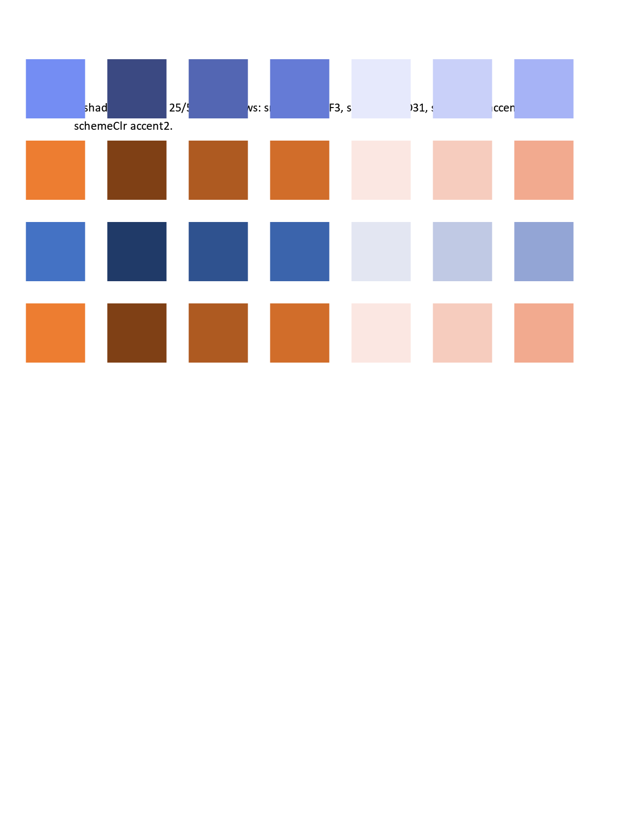 |  |  |

## color_transform_theme_fill

Pins the WordprocessingML byte form — `w:themeFillShade` / `w:themeFillTint` on a `w:shd` — which
is **HSL luminance scaling**, a genuinely different transform from the DrawingML `a:shade` in
`color_transform_shade_tint` rather than a different encoding of it.

Fourteen full-width shaded paragraphs at an exact 12pt line, so each renders as a flat horizontal
band that can be sampled by scanning a column down the page. Two groups of seven, `w:themeFill`
of `accent1` (4472C4) then `accent2` (ED7D31): plain, then `w:themeFillShade` at `40`/`80`/`BF`,
then `w:themeFillTint` at `40`/`80`/`BF`.

The model is `L' = L·(S/255)` for shade and `L' = L·(T/255) + (255−T)/255` for tint, applied to
HSL luminance with hue and saturation preserved. **Word's values:**

| fill | plain | Shade 40 | Shade 80 | Shade BF | Tint 40 | Tint 80 | Tint BF |
| --- | --- | --- | --- | --- | --- | --- | --- |
| accent1 | 4472C4 | 0F1C32 | 1F3864 | 2F5496 | CFDBF0 | A0B7E1 | 7295D2 |
| accent2 | ED7D31 | 411E05 | 833C0B | C45911 | FADECB | F6BD97 | F19D64 |

Applying the linear-light model that IS correct for `a:shade` is out by up to 62 per channel here;
an sRGB blend by up to 103. Luminance scaling is exact to within one channel step on all twelve.
That last step does not clear under either `Math.Round` or truncation and is treated as a rounding
difference in the HSL round trip rather than a model error.

**Why the fixture exists.** These two attributes were parsed nowhere. Every band rendered as its
flat undarkened base — all twelve of them — and no corpus scenario noticed, because the shade of an
accent looks entirely reasonable until it is set beside the value Word produces. `w:color`'s
equivalent `w:themeShade`/`w:themeTint` had been read correctly all along, so a reading of the
parser that started from the run colour found nothing wrong.

The text in each band is incidental, present only to give the paragraph a line box; the sampling
column avoids the glyphs.

| Expected (Word) | Skia | ImageSharp |
| --- | --- | --- |
| **Page 1**&nbsp;&nbsp;&nbsp;&nbsp;&nbsp;&nbsp;&nbsp;&nbsp;&nbsp;&nbsp;&nbsp;&nbsp;&nbsp;&nbsp;&nbsp;&nbsp;&nbsp;&nbsp;&nbsp;&nbsp;&nbsp;&nbsp;&nbsp;&nbsp;&nbsp;&nbsp;&nbsp;&nbsp;&nbsp;&nbsp;&nbsp;&nbsp;&nbsp;&nbsp; | **Page 1. ErrorMetric: 0.1241 · SSIM: 0.9486** | **Page 1. ErrorMetric: 0.1240 · SSIM: 0.9512** |
| 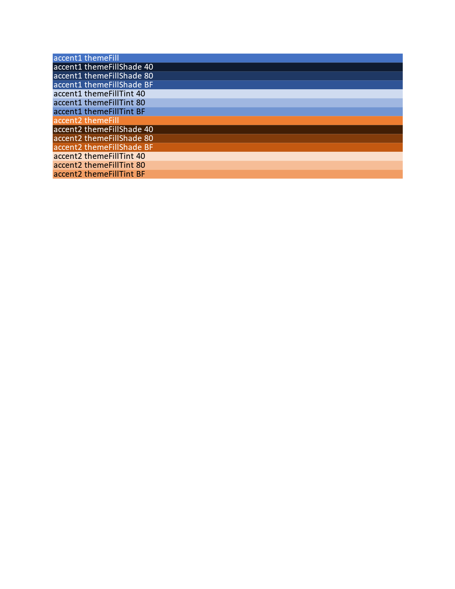 |  |  |

## column_breaks

| Expected (Word) | Skia | ImageSharp |
| --- | --- | --- |
| **Page 1**&nbsp;&nbsp;&nbsp;&nbsp;&nbsp;&nbsp;&nbsp;&nbsp;&nbsp;&nbsp;&nbsp;&nbsp;&nbsp;&nbsp;&nbsp;&nbsp;&nbsp;&nbsp;&nbsp;&nbsp;&nbsp;&nbsp;&nbsp;&nbsp;&nbsp;&nbsp;&nbsp;&nbsp;&nbsp;&nbsp;&nbsp;&nbsp;&nbsp;&nbsp; | **Page 1. ErrorMetric: 0.0053 · SSIM: 0.9877** | **Page 1. ErrorMetric: 0.0055 · SSIM: 0.9872** |
|  |  |  |
| **Page 2**&nbsp;&nbsp;&nbsp;&nbsp;&nbsp;&nbsp;&nbsp;&nbsp;&nbsp;&nbsp;&nbsp;&nbsp;&nbsp;&nbsp;&nbsp;&nbsp;&nbsp;&nbsp;&nbsp;&nbsp;&nbsp;&nbsp;&nbsp;&nbsp;&nbsp;&nbsp;&nbsp;&nbsp;&nbsp;&nbsp;&nbsp;&nbsp;&nbsp;&nbsp; | **Page 2. ErrorMetric: 0.0030 · SSIM: 0.9905** | **Page 2. ErrorMetric: 0.0031 · SSIM: 0.9905** |
|  |  |  |

## comments/01

| Expected (Word) | Skia | ImageSharp |
| --- | --- | --- |
| **Page 1**&nbsp;&nbsp;&nbsp;&nbsp;&nbsp;&nbsp;&nbsp;&nbsp;&nbsp;&nbsp;&nbsp;&nbsp;&nbsp;&nbsp;&nbsp;&nbsp;&nbsp;&nbsp;&nbsp;&nbsp;&nbsp;&nbsp;&nbsp;&nbsp;&nbsp;&nbsp;&nbsp;&nbsp;&nbsp;&nbsp;&nbsp;&nbsp;&nbsp;&nbsp; | **Page 1. ErrorMetric: 0.2496 · SSIM: 0.9842** | **Page 1. ErrorMetric: 0.2497 · SSIM: 0.9840** |
|  |  |  |

## compatibility_mode_14

| Expected (Word) | Skia | ImageSharp |
| --- | --- | --- |
| **Page 1**&nbsp;&nbsp;&nbsp;&nbsp;&nbsp;&nbsp;&nbsp;&nbsp;&nbsp;&nbsp;&nbsp;&nbsp;&nbsp;&nbsp;&nbsp;&nbsp;&nbsp;&nbsp;&nbsp;&nbsp;&nbsp;&nbsp;&nbsp;&nbsp;&nbsp;&nbsp;&nbsp;&nbsp;&nbsp;&nbsp;&nbsp;&nbsp;&nbsp;&nbsp; | **Page 1. ErrorMetric: 0.0940 · SSIM: 0.8144** | **Page 1. ErrorMetric: 0.0978 · SSIM: 0.7955** |
|  |  |  |

## complex_document

| Expected (Word) | Skia | ImageSharp |
| --- | --- | --- |
| **Page 1**&nbsp;&nbsp;&nbsp;&nbsp;&nbsp;&nbsp;&nbsp;&nbsp;&nbsp;&nbsp;&nbsp;&nbsp;&nbsp;&nbsp;&nbsp;&nbsp;&nbsp;&nbsp;&nbsp;&nbsp;&nbsp;&nbsp;&nbsp;&nbsp;&nbsp;&nbsp;&nbsp;&nbsp;&nbsp;&nbsp;&nbsp;&nbsp;&nbsp;&nbsp; | **Page 1. ErrorMetric: 0.0634 · SSIM: 0.8605** | **Page 1. ErrorMetric: 0.0663 · SSIM: 0.8536** |
| 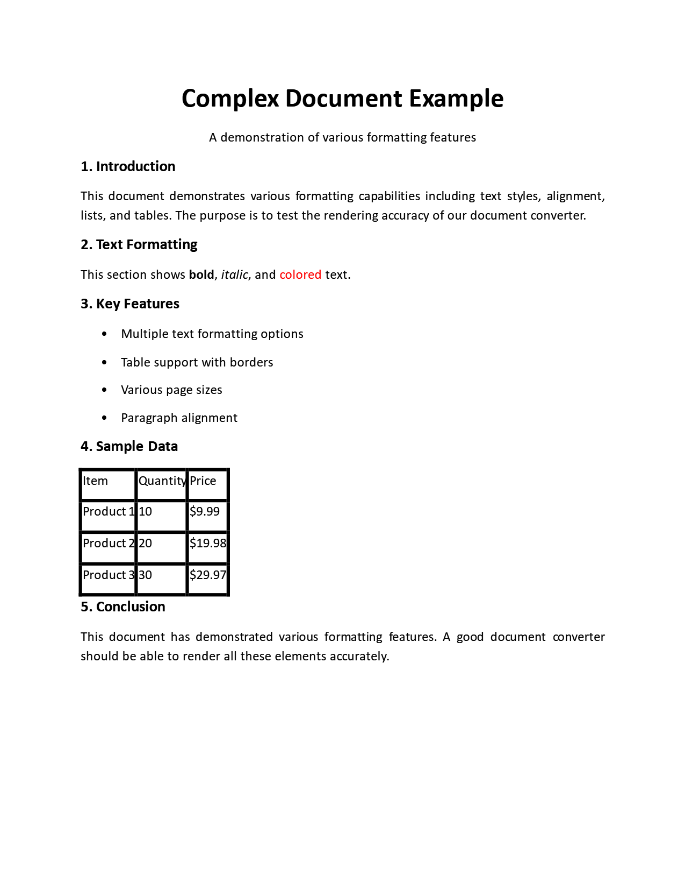 |  |  |

## complex_spacing

| Expected (Word) | Skia | ImageSharp |
| --- | --- | --- |
| **Page 1**&nbsp;&nbsp;&nbsp;&nbsp;&nbsp;&nbsp;&nbsp;&nbsp;&nbsp;&nbsp;&nbsp;&nbsp;&nbsp;&nbsp;&nbsp;&nbsp;&nbsp;&nbsp;&nbsp;&nbsp;&nbsp;&nbsp;&nbsp;&nbsp;&nbsp;&nbsp;&nbsp;&nbsp;&nbsp;&nbsp;&nbsp;&nbsp;&nbsp;&nbsp; | **Page 1. ErrorMetric: 0.0825 · SSIM: 0.8395** | **Page 1. ErrorMetric: 0.0882 · SSIM: 0.8177** |
|  |  |  |
| **Page 2**&nbsp;&nbsp;&nbsp;&nbsp;&nbsp;&nbsp;&nbsp;&nbsp;&nbsp;&nbsp;&nbsp;&nbsp;&nbsp;&nbsp;&nbsp;&nbsp;&nbsp;&nbsp;&nbsp;&nbsp;&nbsp;&nbsp;&nbsp;&nbsp;&nbsp;&nbsp;&nbsp;&nbsp;&nbsp;&nbsp;&nbsp;&nbsp;&nbsp;&nbsp; | **Page 2. ErrorMetric: 0.0742 · SSIM: 0.8597** | **Page 2. ErrorMetric: 0.0788 · SSIM: 0.8328** |
|  |  |  |
| **Page 3**&nbsp;&nbsp;&nbsp;&nbsp;&nbsp;&nbsp;&nbsp;&nbsp;&nbsp;&nbsp;&nbsp;&nbsp;&nbsp;&nbsp;&nbsp;&nbsp;&nbsp;&nbsp;&nbsp;&nbsp;&nbsp;&nbsp;&nbsp;&nbsp;&nbsp;&nbsp;&nbsp;&nbsp;&nbsp;&nbsp;&nbsp;&nbsp;&nbsp;&nbsp; | **Page 3. ErrorMetric: 0.0889 · SSIM: 0.7757** | **Page 3. ErrorMetric: 0.0892 · SSIM: 0.7829** |
|  |  |  |
| **Page 4**&nbsp;&nbsp;&nbsp;&nbsp;&nbsp;&nbsp;&nbsp;&nbsp;&nbsp;&nbsp;&nbsp;&nbsp;&nbsp;&nbsp;&nbsp;&nbsp;&nbsp;&nbsp;&nbsp;&nbsp;&nbsp;&nbsp;&nbsp;&nbsp;&nbsp;&nbsp;&nbsp;&nbsp;&nbsp;&nbsp;&nbsp;&nbsp;&nbsp;&nbsp; | **Page 4. ErrorMetric: 0.0325 · SSIM: 0.9178** | **Page 4. ErrorMetric: 0.0330 · SSIM: 0.9177** |
|  |  |  |
| **Page 5**&nbsp;&nbsp;&nbsp;&nbsp;&nbsp;&nbsp;&nbsp;&nbsp;&nbsp;&nbsp;&nbsp;&nbsp;&nbsp;&nbsp;&nbsp;&nbsp;&nbsp;&nbsp;&nbsp;&nbsp;&nbsp;&nbsp;&nbsp;&nbsp;&nbsp;&nbsp;&nbsp;&nbsp;&nbsp;&nbsp;&nbsp;&nbsp;&nbsp;&nbsp; | **Page 5. ErrorMetric: 0.0569 · SSIM: 0.8905** | **Page 5. ErrorMetric: 0.0610 · SSIM: 0.8682** |
| 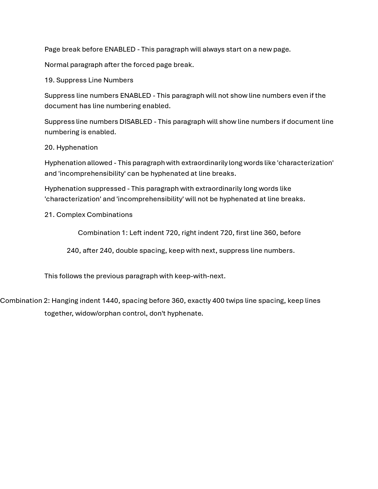 |  |  |
| **Page 6**&nbsp;&nbsp;&nbsp;&nbsp;&nbsp;&nbsp;&nbsp;&nbsp;&nbsp;&nbsp;&nbsp;&nbsp;&nbsp;&nbsp;&nbsp;&nbsp;&nbsp;&nbsp;&nbsp;&nbsp;&nbsp;&nbsp;&nbsp;&nbsp;&nbsp;&nbsp;&nbsp;&nbsp;&nbsp;&nbsp;&nbsp;&nbsp;&nbsp;&nbsp; | **Page 6. ErrorMetric: 0.0309 · SSIM: 0.9249** | **Page 6. ErrorMetric: 0.0315 · SSIM: 0.9227** |
|  |  |  |
| **Page 7**&nbsp;&nbsp;&nbsp;&nbsp;&nbsp;&nbsp;&nbsp;&nbsp;&nbsp;&nbsp;&nbsp;&nbsp;&nbsp;&nbsp;&nbsp;&nbsp;&nbsp;&nbsp;&nbsp;&nbsp;&nbsp;&nbsp;&nbsp;&nbsp;&nbsp;&nbsp;&nbsp;&nbsp;&nbsp;&nbsp;&nbsp;&nbsp;&nbsp;&nbsp; | **Page 7. ErrorMetric: 0.0474 · SSIM: 0.8693** | **Page 7. ErrorMetric: 0.0478 · SSIM: 0.8691** |
|  |  |  |

## complex_tables

| Expected (Word) | Skia | ImageSharp |
| --- | --- | --- |
| **Page 1**&nbsp;&nbsp;&nbsp;&nbsp;&nbsp;&nbsp;&nbsp;&nbsp;&nbsp;&nbsp;&nbsp;&nbsp;&nbsp;&nbsp;&nbsp;&nbsp;&nbsp;&nbsp;&nbsp;&nbsp;&nbsp;&nbsp;&nbsp;&nbsp;&nbsp;&nbsp;&nbsp;&nbsp;&nbsp;&nbsp;&nbsp;&nbsp;&nbsp;&nbsp; | **Page 1. ErrorMetric: 0.3682 · SSIM: 0.6794** | **Page 1. ErrorMetric: 0.3683 · SSIM: 0.6778** |
|  |  |  |
| **Page 2**&nbsp;&nbsp;&nbsp;&nbsp;&nbsp;&nbsp;&nbsp;&nbsp;&nbsp;&nbsp;&nbsp;&nbsp;&nbsp;&nbsp;&nbsp;&nbsp;&nbsp;&nbsp;&nbsp;&nbsp;&nbsp;&nbsp;&nbsp;&nbsp;&nbsp;&nbsp;&nbsp;&nbsp;&nbsp;&nbsp;&nbsp;&nbsp;&nbsp;&nbsp; | **Page 2. ErrorMetric: 0.1549 · SSIM: 0.8789** | **Page 2. ErrorMetric: 0.1550 · SSIM: 0.8775** |
|  |  |  |

## content_control_inline

| Expected (Word) | Skia | ImageSharp |
| --- | --- | --- |
| **Page 1**&nbsp;&nbsp;&nbsp;&nbsp;&nbsp;&nbsp;&nbsp;&nbsp;&nbsp;&nbsp;&nbsp;&nbsp;&nbsp;&nbsp;&nbsp;&nbsp;&nbsp;&nbsp;&nbsp;&nbsp;&nbsp;&nbsp;&nbsp;&nbsp;&nbsp;&nbsp;&nbsp;&nbsp;&nbsp;&nbsp;&nbsp;&nbsp;&nbsp;&nbsp; | **Page 1. ErrorMetric: 0.0088 · SSIM: 0.9763** | **Page 1. ErrorMetric: 0.0091 · SSIM: 0.9757** |
|  |  |  |

## cover-letters/01

| Expected (Word) | Skia | ImageSharp |
| --- | --- | --- |
| **Page 1**&nbsp;&nbsp;&nbsp;&nbsp;&nbsp;&nbsp;&nbsp;&nbsp;&nbsp;&nbsp;&nbsp;&nbsp;&nbsp;&nbsp;&nbsp;&nbsp;&nbsp;&nbsp;&nbsp;&nbsp;&nbsp;&nbsp;&nbsp;&nbsp;&nbsp;&nbsp;&nbsp;&nbsp;&nbsp;&nbsp;&nbsp;&nbsp;&nbsp;&nbsp; | **Page 1. ErrorMetric: 0.0717 · SSIM: 0.8708** | **Page 1. ErrorMetric: 0.0814 · SSIM: 0.8249** |
|  |  |  |

## cover-letters/02

| Expected (Word) | Skia | ImageSharp |
| --- | --- | --- |
| **Page 1**&nbsp;&nbsp;&nbsp;&nbsp;&nbsp;&nbsp;&nbsp;&nbsp;&nbsp;&nbsp;&nbsp;&nbsp;&nbsp;&nbsp;&nbsp;&nbsp;&nbsp;&nbsp;&nbsp;&nbsp;&nbsp;&nbsp;&nbsp;&nbsp;&nbsp;&nbsp;&nbsp;&nbsp;&nbsp;&nbsp;&nbsp;&nbsp;&nbsp;&nbsp; | **Page 1. ErrorMetric: 0.0635 · SSIM: 0.8654** | **Page 1. ErrorMetric: 0.0634 · SSIM: 0.8763** |
|  |  |  |

## cover-letters/03

| Expected (Word) | Skia | ImageSharp |
| --- | --- | --- |
| **Page 1**&nbsp;&nbsp;&nbsp;&nbsp;&nbsp;&nbsp;&nbsp;&nbsp;&nbsp;&nbsp;&nbsp;&nbsp;&nbsp;&nbsp;&nbsp;&nbsp;&nbsp;&nbsp;&nbsp;&nbsp;&nbsp;&nbsp;&nbsp;&nbsp;&nbsp;&nbsp;&nbsp;&nbsp;&nbsp;&nbsp;&nbsp;&nbsp;&nbsp;&nbsp; | **Page 1. ErrorMetric: 0.0640 · SSIM: 0.8823** | **Page 1. ErrorMetric: 0.0586 · SSIM: 0.9087** |
|  |  |  |

## cover-letters/04

| Expected (Word) | Skia | ImageSharp |
| --- | --- | --- |
| **Page 1**&nbsp;&nbsp;&nbsp;&nbsp;&nbsp;&nbsp;&nbsp;&nbsp;&nbsp;&nbsp;&nbsp;&nbsp;&nbsp;&nbsp;&nbsp;&nbsp;&nbsp;&nbsp;&nbsp;&nbsp;&nbsp;&nbsp;&nbsp;&nbsp;&nbsp;&nbsp;&nbsp;&nbsp;&nbsp;&nbsp;&nbsp;&nbsp;&nbsp;&nbsp; | **Page 1. ErrorMetric: 0.0701 · SSIM: 0.8709** | **Page 1. ErrorMetric: 0.0737 · SSIM: 0.8510** |
|  |  |  |

## cover-letters/05

| Expected (Word) | Skia | ImageSharp |
| --- | --- | --- |
| **Page 1**&nbsp;&nbsp;&nbsp;&nbsp;&nbsp;&nbsp;&nbsp;&nbsp;&nbsp;&nbsp;&nbsp;&nbsp;&nbsp;&nbsp;&nbsp;&nbsp;&nbsp;&nbsp;&nbsp;&nbsp;&nbsp;&nbsp;&nbsp;&nbsp;&nbsp;&nbsp;&nbsp;&nbsp;&nbsp;&nbsp;&nbsp;&nbsp;&nbsp;&nbsp; | **Page 1. ErrorMetric: 0.0424 · SSIM: 0.9016** | **Page 1. ErrorMetric: 0.0440 · SSIM: 0.8969** |
|  |  |  |
| **Page 2**&nbsp;&nbsp;&nbsp;&nbsp;&nbsp;&nbsp;&nbsp;&nbsp;&nbsp;&nbsp;&nbsp;&nbsp;&nbsp;&nbsp;&nbsp;&nbsp;&nbsp;&nbsp;&nbsp;&nbsp;&nbsp;&nbsp;&nbsp;&nbsp;&nbsp;&nbsp;&nbsp;&nbsp;&nbsp;&nbsp;&nbsp;&nbsp;&nbsp;&nbsp; | **Page 2. ErrorMetric: 0.0425 · SSIM: 0.9011** | **Page 2. ErrorMetric: 0.0442 · SSIM: 0.8964** |
|  |  |  |
| **Page 3**&nbsp;&nbsp;&nbsp;&nbsp;&nbsp;&nbsp;&nbsp;&nbsp;&nbsp;&nbsp;&nbsp;&nbsp;&nbsp;&nbsp;&nbsp;&nbsp;&nbsp;&nbsp;&nbsp;&nbsp;&nbsp;&nbsp;&nbsp;&nbsp;&nbsp;&nbsp;&nbsp;&nbsp;&nbsp;&nbsp;&nbsp;&nbsp;&nbsp;&nbsp; | **Page 3. ErrorMetric: 0.0617 · SSIM: 0.9013** | **Page 3. ErrorMetric: 0.0634 · SSIM: 0.8966** |
|  |  |  |

## cover-letters/06

| Expected (Word) | Skia | ImageSharp |
| --- | --- | --- |
| **Page 1**&nbsp;&nbsp;&nbsp;&nbsp;&nbsp;&nbsp;&nbsp;&nbsp;&nbsp;&nbsp;&nbsp;&nbsp;&nbsp;&nbsp;&nbsp;&nbsp;&nbsp;&nbsp;&nbsp;&nbsp;&nbsp;&nbsp;&nbsp;&nbsp;&nbsp;&nbsp;&nbsp;&nbsp;&nbsp;&nbsp;&nbsp;&nbsp;&nbsp;&nbsp; | **Page 1. ErrorMetric: 0.1786 · SSIM: 0.8295** | **Page 1. ErrorMetric: 0.1782 · SSIM: 0.8315** |
|  |  |  |

## cover-letters/07

| Expected (Word) | Skia | ImageSharp |
| --- | --- | --- |
| **Page 1**&nbsp;&nbsp;&nbsp;&nbsp;&nbsp;&nbsp;&nbsp;&nbsp;&nbsp;&nbsp;&nbsp;&nbsp;&nbsp;&nbsp;&nbsp;&nbsp;&nbsp;&nbsp;&nbsp;&nbsp;&nbsp;&nbsp;&nbsp;&nbsp;&nbsp;&nbsp;&nbsp;&nbsp;&nbsp;&nbsp;&nbsp;&nbsp;&nbsp;&nbsp; | **Page 1. ErrorMetric: 0.0660 · SSIM: 0.8693** | **Page 1. ErrorMetric: 0.0683 · SSIM: 0.8546** |
|  |  |  |

## cover-letters/08

| Expected (Word) | Skia | ImageSharp |
| --- | --- | --- |
| **Page 1**&nbsp;&nbsp;&nbsp;&nbsp;&nbsp;&nbsp;&nbsp;&nbsp;&nbsp;&nbsp;&nbsp;&nbsp;&nbsp;&nbsp;&nbsp;&nbsp;&nbsp;&nbsp;&nbsp;&nbsp;&nbsp;&nbsp;&nbsp;&nbsp;&nbsp;&nbsp;&nbsp;&nbsp;&nbsp;&nbsp;&nbsp;&nbsp;&nbsp;&nbsp; | **Page 1. ErrorMetric: 0.0656 · SSIM: 0.8603** | **Page 1. ErrorMetric: 0.0570 · SSIM: 0.8723** |
|  |  |  |

## cover-letters/09

| Expected (Word) | Skia | ImageSharp |
| --- | --- | --- |
| **Page 1**&nbsp;&nbsp;&nbsp;&nbsp;&nbsp;&nbsp;&nbsp;&nbsp;&nbsp;&nbsp;&nbsp;&nbsp;&nbsp;&nbsp;&nbsp;&nbsp;&nbsp;&nbsp;&nbsp;&nbsp;&nbsp;&nbsp;&nbsp;&nbsp;&nbsp;&nbsp;&nbsp;&nbsp;&nbsp;&nbsp;&nbsp;&nbsp;&nbsp;&nbsp; | **Page 1. ErrorMetric: 0.1807 · SSIM: 0.8372** | **Page 1. ErrorMetric: 0.1898 · SSIM: 0.8014** |
|  |  |  |

## cover-letters/10

| Expected (Word) | Skia | ImageSharp |
| --- | --- | --- |
| **Page 1**&nbsp;&nbsp;&nbsp;&nbsp;&nbsp;&nbsp;&nbsp;&nbsp;&nbsp;&nbsp;&nbsp;&nbsp;&nbsp;&nbsp;&nbsp;&nbsp;&nbsp;&nbsp;&nbsp;&nbsp;&nbsp;&nbsp;&nbsp;&nbsp;&nbsp;&nbsp;&nbsp;&nbsp;&nbsp;&nbsp;&nbsp;&nbsp;&nbsp;&nbsp; | **Page 1. ErrorMetric: 0.0487 · SSIM: 0.9254** | **Page 1. ErrorMetric: 0.0563 · SSIM: 0.8860** |
|  |  |  |

## cover-letters/11

| Expected (Word) | Skia | ImageSharp |
| --- | --- | --- |
| **Page 1**&nbsp;&nbsp;&nbsp;&nbsp;&nbsp;&nbsp;&nbsp;&nbsp;&nbsp;&nbsp;&nbsp;&nbsp;&nbsp;&nbsp;&nbsp;&nbsp;&nbsp;&nbsp;&nbsp;&nbsp;&nbsp;&nbsp;&nbsp;&nbsp;&nbsp;&nbsp;&nbsp;&nbsp;&nbsp;&nbsp;&nbsp;&nbsp;&nbsp;&nbsp; | **Page 1. ErrorMetric: 0.0658 · SSIM: 0.8527** | **Page 1. ErrorMetric: 0.0658 · SSIM: 0.8482** |
|  |  |  |

## cover-letters/12

| Expected (Word) | Skia | ImageSharp |
| --- | --- | --- |
| **Page 1**&nbsp;&nbsp;&nbsp;&nbsp;&nbsp;&nbsp;&nbsp;&nbsp;&nbsp;&nbsp;&nbsp;&nbsp;&nbsp;&nbsp;&nbsp;&nbsp;&nbsp;&nbsp;&nbsp;&nbsp;&nbsp;&nbsp;&nbsp;&nbsp;&nbsp;&nbsp;&nbsp;&nbsp;&nbsp;&nbsp;&nbsp;&nbsp;&nbsp;&nbsp; | **Page 1. ErrorMetric: 0.9920 · SSIM: 0.6185** | **Page 1. ErrorMetric: 0.9919 · SSIM: 0.6222** |
| 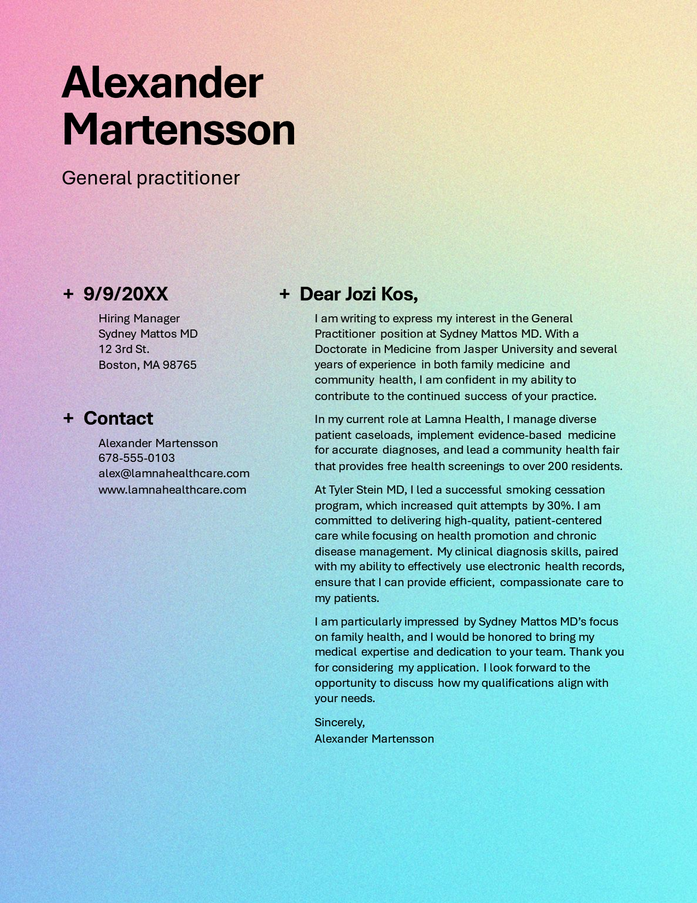 |  |  |

## cover-letters/14

| Expected (Word) | Skia | ImageSharp |
| --- | --- | --- |
| **Page 1**&nbsp;&nbsp;&nbsp;&nbsp;&nbsp;&nbsp;&nbsp;&nbsp;&nbsp;&nbsp;&nbsp;&nbsp;&nbsp;&nbsp;&nbsp;&nbsp;&nbsp;&nbsp;&nbsp;&nbsp;&nbsp;&nbsp;&nbsp;&nbsp;&nbsp;&nbsp;&nbsp;&nbsp;&nbsp;&nbsp;&nbsp;&nbsp;&nbsp;&nbsp; | **Page 1. ErrorMetric: 0.0590 · SSIM: 0.9073** | **Page 1. ErrorMetric: 0.0658 · SSIM: 0.8810** |
|  |  |  |

## cover-letters/15

| Expected (Word) | Skia | ImageSharp |
| --- | --- | --- |
| **Page 1**&nbsp;&nbsp;&nbsp;&nbsp;&nbsp;&nbsp;&nbsp;&nbsp;&nbsp;&nbsp;&nbsp;&nbsp;&nbsp;&nbsp;&nbsp;&nbsp;&nbsp;&nbsp;&nbsp;&nbsp;&nbsp;&nbsp;&nbsp;&nbsp;&nbsp;&nbsp;&nbsp;&nbsp;&nbsp;&nbsp;&nbsp;&nbsp;&nbsp;&nbsp; | **Page 1. ErrorMetric: 0.0660 · SSIM: 0.8731** | **Page 1. ErrorMetric: 0.0668 · SSIM: 0.8663** |
|  |  |  |

## cover-letters/16

| Expected (Word) | Skia | ImageSharp |
| --- | --- | --- |
| **Page 1**&nbsp;&nbsp;&nbsp;&nbsp;&nbsp;&nbsp;&nbsp;&nbsp;&nbsp;&nbsp;&nbsp;&nbsp;&nbsp;&nbsp;&nbsp;&nbsp;&nbsp;&nbsp;&nbsp;&nbsp;&nbsp;&nbsp;&nbsp;&nbsp;&nbsp;&nbsp;&nbsp;&nbsp;&nbsp;&nbsp;&nbsp;&nbsp;&nbsp;&nbsp; | **Page 1. ErrorMetric: 0.1003 · SSIM: 0.8188** | **Page 1. ErrorMetric: 0.1036 · SSIM: 0.7914** |
|  |  |  |

## custom_margins

| Expected (Word) | Skia | ImageSharp |
| --- | --- | --- |
| **Page 1**&nbsp;&nbsp;&nbsp;&nbsp;&nbsp;&nbsp;&nbsp;&nbsp;&nbsp;&nbsp;&nbsp;&nbsp;&nbsp;&nbsp;&nbsp;&nbsp;&nbsp;&nbsp;&nbsp;&nbsp;&nbsp;&nbsp;&nbsp;&nbsp;&nbsp;&nbsp;&nbsp;&nbsp;&nbsp;&nbsp;&nbsp;&nbsp;&nbsp;&nbsp; | **Page 1. ErrorMetric: 0.0069 · SSIM: 0.9869** | **Page 1. ErrorMetric: 0.0075 · SSIM: 0.9843** |
|  |  |  |

## decimal_tabs/01

| Expected (Word) | Skia | ImageSharp |
| --- | --- | --- |
| **Page 1**&nbsp;&nbsp;&nbsp;&nbsp;&nbsp;&nbsp;&nbsp;&nbsp;&nbsp;&nbsp;&nbsp;&nbsp;&nbsp;&nbsp;&nbsp;&nbsp;&nbsp;&nbsp;&nbsp;&nbsp;&nbsp;&nbsp;&nbsp;&nbsp;&nbsp;&nbsp;&nbsp;&nbsp;&nbsp;&nbsp;&nbsp;&nbsp;&nbsp;&nbsp; | **Page 1. ErrorMetric: 0.0021 · SSIM: 0.9959** | **Page 1. ErrorMetric: 0.0023 · SSIM: 0.9952** |
|  |  |  |

## deep_nested_list

| Expected (Word) | Skia | ImageSharp |
| --- | --- | --- |
| **Page 1**&nbsp;&nbsp;&nbsp;&nbsp;&nbsp;&nbsp;&nbsp;&nbsp;&nbsp;&nbsp;&nbsp;&nbsp;&nbsp;&nbsp;&nbsp;&nbsp;&nbsp;&nbsp;&nbsp;&nbsp;&nbsp;&nbsp;&nbsp;&nbsp;&nbsp;&nbsp;&nbsp;&nbsp;&nbsp;&nbsp;&nbsp;&nbsp;&nbsp;&nbsp; | **Page 1. ErrorMetric: 0.0116 · SSIM: 0.9771** | **Page 1. ErrorMetric: 0.0131 · SSIM: 0.9715** |
|  |  |  |

## document_capture/01

| Expected (Word) | Skia | ImageSharp |
| --- | --- | --- |
| **Page 1**&nbsp;&nbsp;&nbsp;&nbsp;&nbsp;&nbsp;&nbsp;&nbsp;&nbsp;&nbsp;&nbsp;&nbsp;&nbsp;&nbsp;&nbsp;&nbsp;&nbsp;&nbsp;&nbsp;&nbsp;&nbsp;&nbsp;&nbsp;&nbsp;&nbsp;&nbsp;&nbsp;&nbsp;&nbsp;&nbsp;&nbsp;&nbsp;&nbsp;&nbsp; | **Page 1. ErrorMetric: 0.0049 · SSIM: 0.9872** | **Page 1. ErrorMetric: 0.0050 · SSIM: 0.9869** |
| 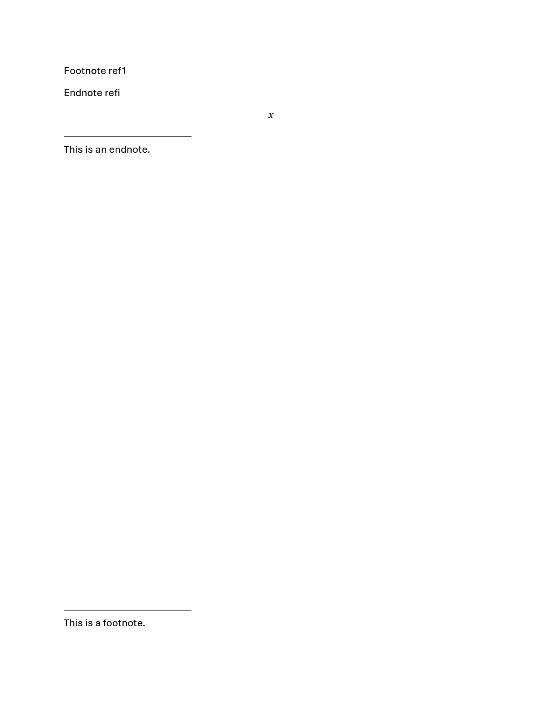 |  |  |

## document_protection/01

| Expected (Word) | Skia | ImageSharp |
| --- | --- | --- |
| **Page 1**&nbsp;&nbsp;&nbsp;&nbsp;&nbsp;&nbsp;&nbsp;&nbsp;&nbsp;&nbsp;&nbsp;&nbsp;&nbsp;&nbsp;&nbsp;&nbsp;&nbsp;&nbsp;&nbsp;&nbsp;&nbsp;&nbsp;&nbsp;&nbsp;&nbsp;&nbsp;&nbsp;&nbsp;&nbsp;&nbsp;&nbsp;&nbsp;&nbsp;&nbsp; | **Page 1. ErrorMetric: 0.0021 · SSIM: 0.9963** | **Page 1. ErrorMetric: 0.0024 · SSIM: 0.9953** |
|  |  |  |

## dot_points

# dot_points

Multi-level bullet list exercising the three Word-default bullet glyphs across the
9 numbering levels (cycling every 3):

- ilvl 0/3/6 - Symbol font, U+F0B7 (filled round bullet)
- ilvl 1/4/7 - Courier New, literal lowercase 'o'
- ilvl 2/5/8 - Wingdings, U+F0A7 (small filled square)

Use this scenario to verify per-level bullet font + glyph fidelity.

| Expected (Word) | Skia | ImageSharp |
| --- | --- | --- |
| **Page 1**&nbsp;&nbsp;&nbsp;&nbsp;&nbsp;&nbsp;&nbsp;&nbsp;&nbsp;&nbsp;&nbsp;&nbsp;&nbsp;&nbsp;&nbsp;&nbsp;&nbsp;&nbsp;&nbsp;&nbsp;&nbsp;&nbsp;&nbsp;&nbsp;&nbsp;&nbsp;&nbsp;&nbsp;&nbsp;&nbsp;&nbsp;&nbsp;&nbsp;&nbsp; | **Page 1. ErrorMetric: 0.0006 · SSIM: 0.9987** | **Page 1. ErrorMetric: 0.0008 · SSIM: 0.9978** |
|  |  |  |

## embedded_font

| Expected (Word) | Skia | ImageSharp |
| --- | --- | --- |
| **Page 1**&nbsp;&nbsp;&nbsp;&nbsp;&nbsp;&nbsp;&nbsp;&nbsp;&nbsp;&nbsp;&nbsp;&nbsp;&nbsp;&nbsp;&nbsp;&nbsp;&nbsp;&nbsp;&nbsp;&nbsp;&nbsp;&nbsp;&nbsp;&nbsp;&nbsp;&nbsp;&nbsp;&nbsp;&nbsp;&nbsp;&nbsp;&nbsp;&nbsp;&nbsp; | **Page 1. ErrorMetric: 0.0071 · SSIM: 0.9904** | **Page 1. ErrorMetric: 0.0085 · SSIM: 0.9837** |
|  |  |  |

## empty_paragraphs

| Expected (Word) | Skia | ImageSharp |
| --- | --- | --- |
| **Page 1**&nbsp;&nbsp;&nbsp;&nbsp;&nbsp;&nbsp;&nbsp;&nbsp;&nbsp;&nbsp;&nbsp;&nbsp;&nbsp;&nbsp;&nbsp;&nbsp;&nbsp;&nbsp;&nbsp;&nbsp;&nbsp;&nbsp;&nbsp;&nbsp;&nbsp;&nbsp;&nbsp;&nbsp;&nbsp;&nbsp;&nbsp;&nbsp;&nbsp;&nbsp; | **Page 1. ErrorMetric: 0.0030 · SSIM: 0.9952** | **Page 1. ErrorMetric: 0.0033 · SSIM: 0.9935** |
|  |  |  |

## even_odd_headers/01

| Expected (Word) | Skia | ImageSharp |
| --- | --- | --- |
| **Page 1**&nbsp;&nbsp;&nbsp;&nbsp;&nbsp;&nbsp;&nbsp;&nbsp;&nbsp;&nbsp;&nbsp;&nbsp;&nbsp;&nbsp;&nbsp;&nbsp;&nbsp;&nbsp;&nbsp;&nbsp;&nbsp;&nbsp;&nbsp;&nbsp;&nbsp;&nbsp;&nbsp;&nbsp;&nbsp;&nbsp;&nbsp;&nbsp;&nbsp;&nbsp; | **Page 1. ErrorMetric: 0.0012 · SSIM: 0.9983** | **Page 1. ErrorMetric: 0.0012 · SSIM: 0.9979** |
|  |  |  |
| **Page 2**&nbsp;&nbsp;&nbsp;&nbsp;&nbsp;&nbsp;&nbsp;&nbsp;&nbsp;&nbsp;&nbsp;&nbsp;&nbsp;&nbsp;&nbsp;&nbsp;&nbsp;&nbsp;&nbsp;&nbsp;&nbsp;&nbsp;&nbsp;&nbsp;&nbsp;&nbsp;&nbsp;&nbsp;&nbsp;&nbsp;&nbsp;&nbsp;&nbsp;&nbsp; | **Page 2. ErrorMetric: 0.0013 · SSIM: 0.9980** | **Page 2. ErrorMetric: 0.0013 · SSIM: 0.9978** |
|  |  |  |

## even_odd_headers/02

| Expected (Word) | Skia | ImageSharp |
| --- | --- | --- |
| **Page 1**&nbsp;&nbsp;&nbsp;&nbsp;&nbsp;&nbsp;&nbsp;&nbsp;&nbsp;&nbsp;&nbsp;&nbsp;&nbsp;&nbsp;&nbsp;&nbsp;&nbsp;&nbsp;&nbsp;&nbsp;&nbsp;&nbsp;&nbsp;&nbsp;&nbsp;&nbsp;&nbsp;&nbsp;&nbsp;&nbsp;&nbsp;&nbsp;&nbsp;&nbsp; | **Page 1. ErrorMetric: 0.0018 · SSIM: 0.9976** | **Page 1. ErrorMetric: 0.0020 · SSIM: 0.9961** |
| 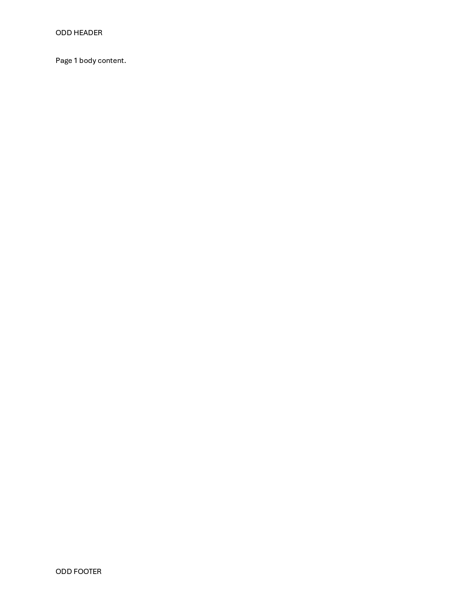 |  |  |
| **Page 2**&nbsp;&nbsp;&nbsp;&nbsp;&nbsp;&nbsp;&nbsp;&nbsp;&nbsp;&nbsp;&nbsp;&nbsp;&nbsp;&nbsp;&nbsp;&nbsp;&nbsp;&nbsp;&nbsp;&nbsp;&nbsp;&nbsp;&nbsp;&nbsp;&nbsp;&nbsp;&nbsp;&nbsp;&nbsp;&nbsp;&nbsp;&nbsp;&nbsp;&nbsp; | **Page 2. ErrorMetric: 0.0017 · SSIM: 0.9979** | **Page 2. ErrorMetric: 0.0020 · SSIM: 0.9964** |
|  |  |  |
| **Page 3**&nbsp;&nbsp;&nbsp;&nbsp;&nbsp;&nbsp;&nbsp;&nbsp;&nbsp;&nbsp;&nbsp;&nbsp;&nbsp;&nbsp;&nbsp;&nbsp;&nbsp;&nbsp;&nbsp;&nbsp;&nbsp;&nbsp;&nbsp;&nbsp;&nbsp;&nbsp;&nbsp;&nbsp;&nbsp;&nbsp;&nbsp;&nbsp;&nbsp;&nbsp; | **Page 3. ErrorMetric: 0.0018 · SSIM: 0.9976** | **Page 3. ErrorMetric: 0.0020 · SSIM: 0.9961** |
|  |  |  |
| **Page 4**&nbsp;&nbsp;&nbsp;&nbsp;&nbsp;&nbsp;&nbsp;&nbsp;&nbsp;&nbsp;&nbsp;&nbsp;&nbsp;&nbsp;&nbsp;&nbsp;&nbsp;&nbsp;&nbsp;&nbsp;&nbsp;&nbsp;&nbsp;&nbsp;&nbsp;&nbsp;&nbsp;&nbsp;&nbsp;&nbsp;&nbsp;&nbsp;&nbsp;&nbsp; | **Page 4. ErrorMetric: 0.0017 · SSIM: 0.9979** | **Page 4. ErrorMetric: 0.0020 · SSIM: 0.9964** |
|  |  |  |

## explicit_break_blank_page

| Expected (Word) | Skia | ImageSharp |
| --- | --- | --- |
| **Page 1**&nbsp;&nbsp;&nbsp;&nbsp;&nbsp;&nbsp;&nbsp;&nbsp;&nbsp;&nbsp;&nbsp;&nbsp;&nbsp;&nbsp;&nbsp;&nbsp;&nbsp;&nbsp;&nbsp;&nbsp;&nbsp;&nbsp;&nbsp;&nbsp;&nbsp;&nbsp;&nbsp;&nbsp;&nbsp;&nbsp;&nbsp;&nbsp;&nbsp;&nbsp; | **Page 1. ErrorMetric: 0.0051 · SSIM: 0.9903** | **Page 1. ErrorMetric: 0.0053 · SSIM: 0.9898** |
|  |  |  |
| **Page 2** | **Page 2** | **Page 2** |
|  |  |  |

## feature_capture/01

| Expected (Word) | Skia | ImageSharp |
| --- | --- | --- |
| **Page 1**&nbsp;&nbsp;&nbsp;&nbsp;&nbsp;&nbsp;&nbsp;&nbsp;&nbsp;&nbsp;&nbsp;&nbsp;&nbsp;&nbsp;&nbsp;&nbsp;&nbsp;&nbsp;&nbsp;&nbsp;&nbsp;&nbsp;&nbsp;&nbsp;&nbsp;&nbsp;&nbsp;&nbsp;&nbsp;&nbsp;&nbsp;&nbsp;&nbsp;&nbsp; | **Page 1. ErrorMetric: 0.0039 · SSIM: 0.9912** | **Page 1. ErrorMetric: 0.0038 · SSIM: 0.9915** |
|  |  |  |

## field_codes_simple/01

| Expected (Word) | Skia | ImageSharp |
| --- | --- | --- |
| **Page 1**&nbsp;&nbsp;&nbsp;&nbsp;&nbsp;&nbsp;&nbsp;&nbsp;&nbsp;&nbsp;&nbsp;&nbsp;&nbsp;&nbsp;&nbsp;&nbsp;&nbsp;&nbsp;&nbsp;&nbsp;&nbsp;&nbsp;&nbsp;&nbsp;&nbsp;&nbsp;&nbsp;&nbsp;&nbsp;&nbsp;&nbsp;&nbsp;&nbsp;&nbsp; | **Page 1. ErrorMetric: 0.0004 · SSIM: 0.9994** | **Page 1. ErrorMetric: 0.0004 · SSIM: 0.9993** |
|  |  |  |

## first_line_indent

| Expected (Word) | Skia | ImageSharp |
| --- | --- | --- |
| **Page 1**&nbsp;&nbsp;&nbsp;&nbsp;&nbsp;&nbsp;&nbsp;&nbsp;&nbsp;&nbsp;&nbsp;&nbsp;&nbsp;&nbsp;&nbsp;&nbsp;&nbsp;&nbsp;&nbsp;&nbsp;&nbsp;&nbsp;&nbsp;&nbsp;&nbsp;&nbsp;&nbsp;&nbsp;&nbsp;&nbsp;&nbsp;&nbsp;&nbsp;&nbsp; | **Page 1. ErrorMetric: 0.0122 · SSIM: 0.9771** | **Page 1. ErrorMetric: 0.0123 · SSIM: 0.9758** |
|  |  |  |

## font_families

| Expected (Word) | Skia | ImageSharp |
| --- | --- | --- |
| **Page 1**&nbsp;&nbsp;&nbsp;&nbsp;&nbsp;&nbsp;&nbsp;&nbsp;&nbsp;&nbsp;&nbsp;&nbsp;&nbsp;&nbsp;&nbsp;&nbsp;&nbsp;&nbsp;&nbsp;&nbsp;&nbsp;&nbsp;&nbsp;&nbsp;&nbsp;&nbsp;&nbsp;&nbsp;&nbsp;&nbsp;&nbsp;&nbsp;&nbsp;&nbsp; | **Page 1. ErrorMetric: 0.0065 · SSIM: 0.9906** | **Page 1. ErrorMetric: 0.0082 · SSIM: 0.9838** |
|  |  |  |

## font_sizes

| Expected (Word) | Skia | ImageSharp |
| --- | --- | --- |
| **Page 1**&nbsp;&nbsp;&nbsp;&nbsp;&nbsp;&nbsp;&nbsp;&nbsp;&nbsp;&nbsp;&nbsp;&nbsp;&nbsp;&nbsp;&nbsp;&nbsp;&nbsp;&nbsp;&nbsp;&nbsp;&nbsp;&nbsp;&nbsp;&nbsp;&nbsp;&nbsp;&nbsp;&nbsp;&nbsp;&nbsp;&nbsp;&nbsp;&nbsp;&nbsp; | **Page 1. ErrorMetric: 0.0067 · SSIM: 0.9877** | **Page 1. ErrorMetric: 0.0059 · SSIM: 0.9895** |
|  |  |  |

## footer

| Expected (Word) | Skia | ImageSharp |
| --- | --- | --- |
| **Page 1**&nbsp;&nbsp;&nbsp;&nbsp;&nbsp;&nbsp;&nbsp;&nbsp;&nbsp;&nbsp;&nbsp;&nbsp;&nbsp;&nbsp;&nbsp;&nbsp;&nbsp;&nbsp;&nbsp;&nbsp;&nbsp;&nbsp;&nbsp;&nbsp;&nbsp;&nbsp;&nbsp;&nbsp;&nbsp;&nbsp;&nbsp;&nbsp;&nbsp;&nbsp; | **Page 1. ErrorMetric: 0.0059 · SSIM: 0.9902** | **Page 1. ErrorMetric: 0.0065 · SSIM: 0.9876** |
| 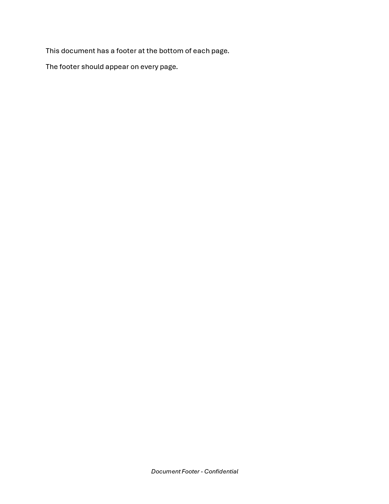 |  |  |

## form_checkboxes

| Expected (Word) | Skia | ImageSharp |
| --- | --- | --- |
| **Page 1**&nbsp;&nbsp;&nbsp;&nbsp;&nbsp;&nbsp;&nbsp;&nbsp;&nbsp;&nbsp;&nbsp;&nbsp;&nbsp;&nbsp;&nbsp;&nbsp;&nbsp;&nbsp;&nbsp;&nbsp;&nbsp;&nbsp;&nbsp;&nbsp;&nbsp;&nbsp;&nbsp;&nbsp;&nbsp;&nbsp;&nbsp;&nbsp;&nbsp;&nbsp; | **Page 1. ErrorMetric: 0.0035 · SSIM: 0.9943** | **Page 1. ErrorMetric: 0.0038 · SSIM: 0.9933** |
|  |  |  |

## form_dropdowns

| Expected (Word) | Skia | ImageSharp |
| --- | --- | --- |
| **Page 1**&nbsp;&nbsp;&nbsp;&nbsp;&nbsp;&nbsp;&nbsp;&nbsp;&nbsp;&nbsp;&nbsp;&nbsp;&nbsp;&nbsp;&nbsp;&nbsp;&nbsp;&nbsp;&nbsp;&nbsp;&nbsp;&nbsp;&nbsp;&nbsp;&nbsp;&nbsp;&nbsp;&nbsp;&nbsp;&nbsp;&nbsp;&nbsp;&nbsp;&nbsp; | **Page 1. ErrorMetric: 0.0024 · SSIM: 0.9959** | **Page 1. ErrorMetric: 0.0026 · SSIM: 0.9952** |
|  |  |  |

## form_text_fields

| Expected (Word) | Skia | ImageSharp |
| --- | --- | --- |
| **Page 1**&nbsp;&nbsp;&nbsp;&nbsp;&nbsp;&nbsp;&nbsp;&nbsp;&nbsp;&nbsp;&nbsp;&nbsp;&nbsp;&nbsp;&nbsp;&nbsp;&nbsp;&nbsp;&nbsp;&nbsp;&nbsp;&nbsp;&nbsp;&nbsp;&nbsp;&nbsp;&nbsp;&nbsp;&nbsp;&nbsp;&nbsp;&nbsp;&nbsp;&nbsp; | **Page 1. ErrorMetric: 0.0031 · SSIM: 0.9947** | **Page 1. ErrorMetric: 0.0033 · SSIM: 0.9937** |
|  |  |  |

## gutter_margins/01

| Expected (Word) | Skia | ImageSharp |
| --- | --- | --- |
| **Page 1**&nbsp;&nbsp;&nbsp;&nbsp;&nbsp;&nbsp;&nbsp;&nbsp;&nbsp;&nbsp;&nbsp;&nbsp;&nbsp;&nbsp;&nbsp;&nbsp;&nbsp;&nbsp;&nbsp;&nbsp;&nbsp;&nbsp;&nbsp;&nbsp;&nbsp;&nbsp;&nbsp;&nbsp;&nbsp;&nbsp;&nbsp;&nbsp;&nbsp;&nbsp; | **Page 1. ErrorMetric: 0.0028 · SSIM: 0.9949** | **Page 1. ErrorMetric: 0.0029 · SSIM: 0.9944** |
|  |  |  |

## hanging_indent

| Expected (Word) | Skia | ImageSharp |
| --- | --- | --- |
| **Page 1**&nbsp;&nbsp;&nbsp;&nbsp;&nbsp;&nbsp;&nbsp;&nbsp;&nbsp;&nbsp;&nbsp;&nbsp;&nbsp;&nbsp;&nbsp;&nbsp;&nbsp;&nbsp;&nbsp;&nbsp;&nbsp;&nbsp;&nbsp;&nbsp;&nbsp;&nbsp;&nbsp;&nbsp;&nbsp;&nbsp;&nbsp;&nbsp;&nbsp;&nbsp; | **Page 1. ErrorMetric: 0.0085 · SSIM: 0.9834** | **Page 1. ErrorMetric: 0.0087 · SSIM: 0.9820** |
|  |  |  |

## header

| Expected (Word) | Skia | ImageSharp |
| --- | --- | --- |
| **Page 1**&nbsp;&nbsp;&nbsp;&nbsp;&nbsp;&nbsp;&nbsp;&nbsp;&nbsp;&nbsp;&nbsp;&nbsp;&nbsp;&nbsp;&nbsp;&nbsp;&nbsp;&nbsp;&nbsp;&nbsp;&nbsp;&nbsp;&nbsp;&nbsp;&nbsp;&nbsp;&nbsp;&nbsp;&nbsp;&nbsp;&nbsp;&nbsp;&nbsp;&nbsp; | **Page 1. ErrorMetric: 0.0058 · SSIM: 0.9894** | **Page 1. ErrorMetric: 0.0061 · SSIM: 0.9887** |
|  |  |  |

## header_banner_table

Regression scenario for shaded banner tables in a page header — the pattern many Word templates
use to paint a coloured marking/title bar above the body.

Covers two former bugs:

1. Tables inside a header/footer were parsed but never rendered — `RenderHeaderFooterElements`
   had no `TableElement` branch, so the banner silently disappeared.
2. Rows without an explicit `w:trHeight` were forced to a 20pt floor, so the thin spacer rows
   (whose height comes only from an empty paragraph mark, `sz=6`/`sz=10`) ballooned and doubled
   the banner's height.

The header holds only the banner, sized to sit within the header band, so the body clears it
without header-space reservation (a separate concern).

| Expected (Word) | Skia | ImageSharp |
| --- | --- | --- |
| **Page 1**&nbsp;&nbsp;&nbsp;&nbsp;&nbsp;&nbsp;&nbsp;&nbsp;&nbsp;&nbsp;&nbsp;&nbsp;&nbsp;&nbsp;&nbsp;&nbsp;&nbsp;&nbsp;&nbsp;&nbsp;&nbsp;&nbsp;&nbsp;&nbsp;&nbsp;&nbsp;&nbsp;&nbsp;&nbsp;&nbsp;&nbsp;&nbsp;&nbsp;&nbsp; | **Page 1. ErrorMetric: 0.0156 · SSIM: 0.9850** | **Page 1. ErrorMetric: 0.0204 · SSIM: 0.9706** |
|  |  |  |

## header_footer

| Expected (Word) | Skia | ImageSharp |
| --- | --- | --- |
| **Page 1**&nbsp;&nbsp;&nbsp;&nbsp;&nbsp;&nbsp;&nbsp;&nbsp;&nbsp;&nbsp;&nbsp;&nbsp;&nbsp;&nbsp;&nbsp;&nbsp;&nbsp;&nbsp;&nbsp;&nbsp;&nbsp;&nbsp;&nbsp;&nbsp;&nbsp;&nbsp;&nbsp;&nbsp;&nbsp;&nbsp;&nbsp;&nbsp;&nbsp;&nbsp; | **Page 1. ErrorMetric: 0.0609 · SSIM: 0.8828** | **Page 1. ErrorMetric: 0.0664 · SSIM: 0.8695** |
|  |  |  |
| **Page 2**&nbsp;&nbsp;&nbsp;&nbsp;&nbsp;&nbsp;&nbsp;&nbsp;&nbsp;&nbsp;&nbsp;&nbsp;&nbsp;&nbsp;&nbsp;&nbsp;&nbsp;&nbsp;&nbsp;&nbsp;&nbsp;&nbsp;&nbsp;&nbsp;&nbsp;&nbsp;&nbsp;&nbsp;&nbsp;&nbsp;&nbsp;&nbsp;&nbsp;&nbsp; | **Page 2. ErrorMetric: 0.0178 · SSIM: 0.9664** | **Page 2. ErrorMetric: 0.0192 · SSIM: 0.9637** |
|  |  |  |

## header_full_bleed_banner

Regression scenario for a header banner that bleeds off BOTH paper edges, and for the body
clearing a header taller than the top margin. Companion to `header_banner_table`, which isolates
the same banner shape at text width and short enough that the body never has to move.

Covers three former bugs, all found together in one render and none of them caught by any other
scenario:

1. **A band table ignored `w:tblInd`.** The banner is a one-column table of 12792 twips with
   `w:tblInd w:w="-1593"`, so against this document's 720-twip margins it starts 79.65pt off the
   left edge and ends level with the right edge of the A4 sheet. `Fragmenter.LayoutBand` laid it
   out at the band's own left edge, which inset the bar by the margin on one side and ran it off
   the paper on the other. The width itself was never the problem: the table is `tblLayout` fixed,
   and `CalculateColumnWidths` only squeezes an over-wide table back to the column when it is
   autofit.

2. **A header table's height was not reserved above the body.** `HeaderReservedTop` summed only
   the header's `ParagraphElement`s, so this header reserved its two lines of marking text and
   none of the 33pt banner below them. The first body heading ("Attachment 5A", a right-aligned
   Heading 1) landed 40pt high, inside the bar. `FooterBand` had always measured tables too.

3. **A table style's `w:tblBorders` did not inherit through `w:basedOn`.** `HouseOfRepsTable` and
   `SenateTable` are both based on `ChamberTable`, which carries top/bottom/insideH; each derived
   style's own `w:tblPr` is empty and adds only a `w:tblStylePr` firstRow fill. Reading just the
   leaf dropped all three rules while the coloured header band still painted, so the table read as
   deliberately borderless. Word draws them at y=508, 562 and 694 on page 1.

Also exercised, incidental but worth having covered:

- Two sibling table styles differing ONLY in their firstRow conditional fill — green
  (`HouseOfRepsTable`, page 1) and red (`SenateTable`, page 2) — over an identical inherited grid.
- A4 (`w:pgSz` 11907x16840, `w:code="9"`) with 720-twip margins all round, `w:header="425"`.
- An explicit `<w:br w:type="page"/>` between the two chamber tables.
- Distinct first/even/default headers AND footers with no `w:titlePg`, so page 1 takes the DEFAULT
  pair — the case where a first-page variant exists but must NOT be selected.
- A `PAGE`/`NUMPAGES` footer ("Page 1 of 2") below a repeated marking line.

Known gap, visible in the comparison: Word renders the header row bold, from the `w:b` in each
style's `w:tblStylePr/w:rPr`. Morph cascades only the run COLOUR from a conditional region — see
`src/todo.md` #10, which records why the bold half was reverted.

Provenance: derived from a public-sector parliamentary report generator's own test fixture, whose
data is already placeholder ("Bill 1", "Minister 1", "TBC"). The protective marking it carried in
its header, footer and `docProps/custom.xml` was replaced with the same equal-length placeholder
`nonstandard_main_part_name` uses, `SENSITIVE//EXAMPLE`. The empty bibliography data island under
`customXml/` was stripped by `DocumentCleaner`.

| Expected (Word) | Skia | ImageSharp |
| --- | --- | --- |
| **Page 1**&nbsp;&nbsp;&nbsp;&nbsp;&nbsp;&nbsp;&nbsp;&nbsp;&nbsp;&nbsp;&nbsp;&nbsp;&nbsp;&nbsp;&nbsp;&nbsp;&nbsp;&nbsp;&nbsp;&nbsp;&nbsp;&nbsp;&nbsp;&nbsp;&nbsp;&nbsp;&nbsp;&nbsp;&nbsp;&nbsp;&nbsp;&nbsp;&nbsp;&nbsp; | **Page 1. ErrorMetric: 0.0299 · SSIM: 0.9550** | **Page 1. ErrorMetric: 0.0359 · SSIM: 0.9383** |
| 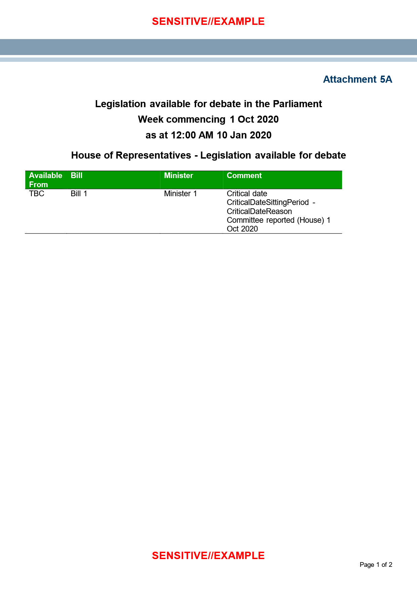 |  |  |
| **Page 2**&nbsp;&nbsp;&nbsp;&nbsp;&nbsp;&nbsp;&nbsp;&nbsp;&nbsp;&nbsp;&nbsp;&nbsp;&nbsp;&nbsp;&nbsp;&nbsp;&nbsp;&nbsp;&nbsp;&nbsp;&nbsp;&nbsp;&nbsp;&nbsp;&nbsp;&nbsp;&nbsp;&nbsp;&nbsp;&nbsp;&nbsp;&nbsp;&nbsp;&nbsp; | **Page 2. ErrorMetric: 0.0208 · SSIM: 0.9692** | **Page 2. ErrorMetric: 0.0239 · SSIM: 0.9602** |
| 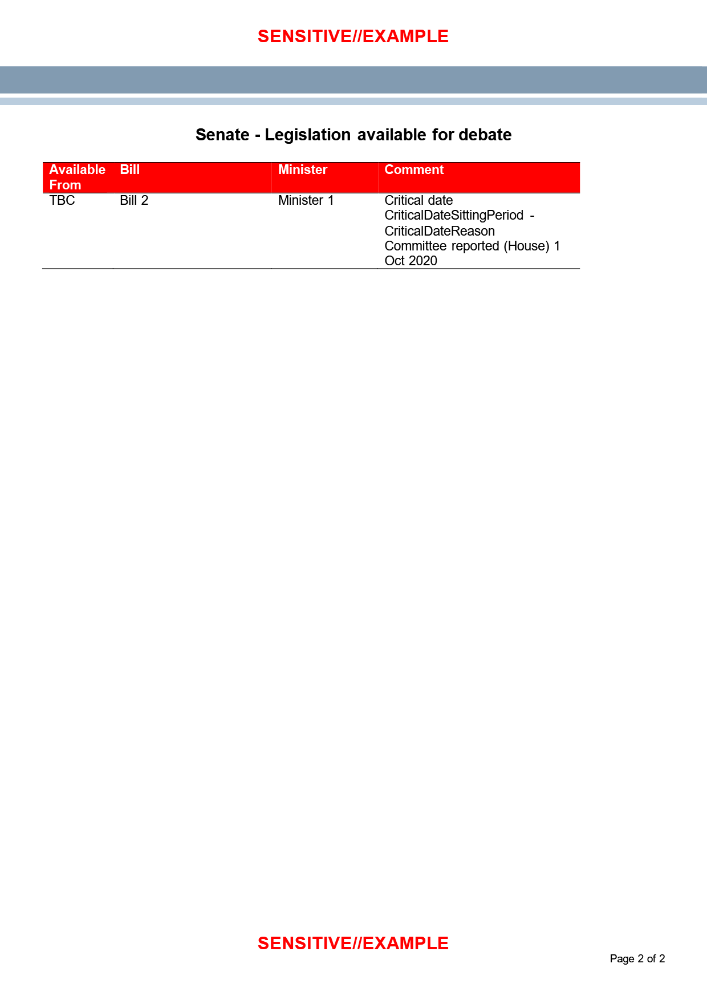 |  |  |

## header_row_repeat/01

| Expected (Word) | Skia | ImageSharp |
| --- | --- | --- |
| **Page 1**&nbsp;&nbsp;&nbsp;&nbsp;&nbsp;&nbsp;&nbsp;&nbsp;&nbsp;&nbsp;&nbsp;&nbsp;&nbsp;&nbsp;&nbsp;&nbsp;&nbsp;&nbsp;&nbsp;&nbsp;&nbsp;&nbsp;&nbsp;&nbsp;&nbsp;&nbsp;&nbsp;&nbsp;&nbsp;&nbsp;&nbsp;&nbsp;&nbsp;&nbsp; | **Page 1. ErrorMetric: 0.0919 · SSIM: 0.7885** | **Page 1. ErrorMetric: 0.0989 · SSIM: 0.7668** |
| 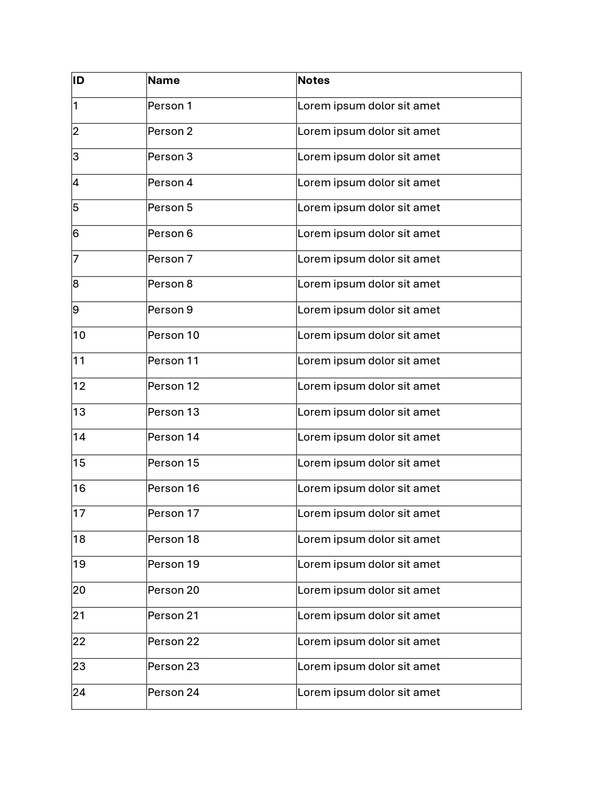 |  |  |
| **Page 2**&nbsp;&nbsp;&nbsp;&nbsp;&nbsp;&nbsp;&nbsp;&nbsp;&nbsp;&nbsp;&nbsp;&nbsp;&nbsp;&nbsp;&nbsp;&nbsp;&nbsp;&nbsp;&nbsp;&nbsp;&nbsp;&nbsp;&nbsp;&nbsp;&nbsp;&nbsp;&nbsp;&nbsp;&nbsp;&nbsp;&nbsp;&nbsp;&nbsp;&nbsp; | **Page 2. ErrorMetric: 0.0842 · SSIM: 0.8604** | **Page 2. ErrorMetric: 0.0893 · SSIM: 0.8453** |
|  |  |  |
| **Page 3**&nbsp;&nbsp;&nbsp;&nbsp;&nbsp;&nbsp;&nbsp;&nbsp;&nbsp;&nbsp;&nbsp;&nbsp;&nbsp;&nbsp;&nbsp;&nbsp;&nbsp;&nbsp;&nbsp;&nbsp;&nbsp;&nbsp;&nbsp;&nbsp;&nbsp;&nbsp;&nbsp;&nbsp;&nbsp;&nbsp;&nbsp;&nbsp;&nbsp;&nbsp; | **Page 3. ErrorMetric: 0.0434 · SSIM: 0.9288** | **Page 3. ErrorMetric: 0.0452 · SSIM: 0.9249** |
| 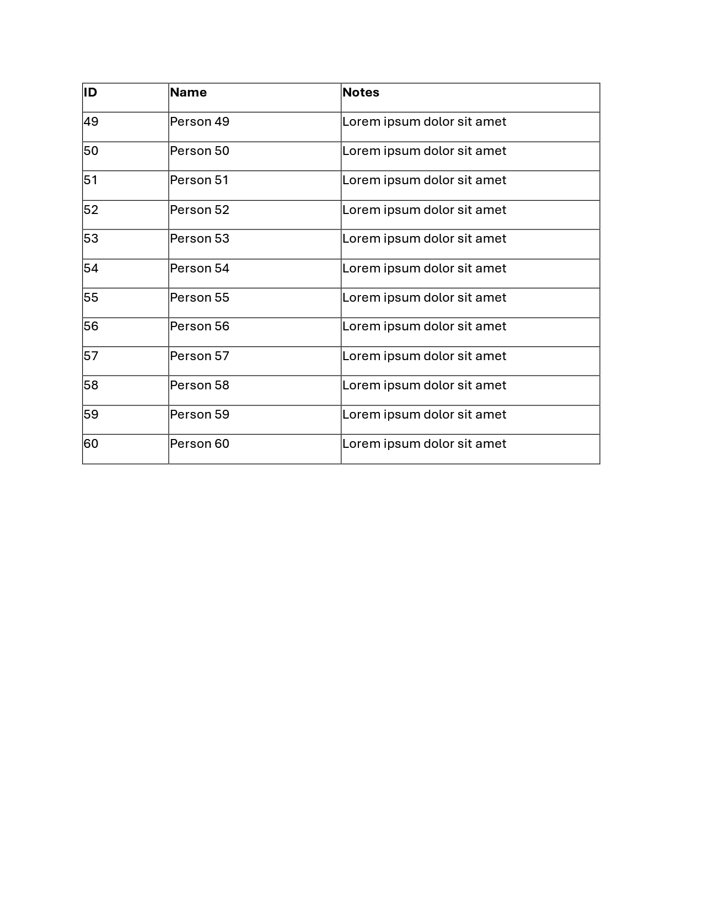 |  |  |

## headings

| Expected (Word) | Skia | ImageSharp |
| --- | --- | --- |
| **Page 1**&nbsp;&nbsp;&nbsp;&nbsp;&nbsp;&nbsp;&nbsp;&nbsp;&nbsp;&nbsp;&nbsp;&nbsp;&nbsp;&nbsp;&nbsp;&nbsp;&nbsp;&nbsp;&nbsp;&nbsp;&nbsp;&nbsp;&nbsp;&nbsp;&nbsp;&nbsp;&nbsp;&nbsp;&nbsp;&nbsp;&nbsp;&nbsp;&nbsp;&nbsp; | **Page 1. ErrorMetric: 0.0111 · SSIM: 0.9851** | **Page 1. ErrorMetric: 0.0132 · SSIM: 0.9774** |
|  |  |  |

## html_basic_formatting

| Expected (Word) | Skia | ImageSharp |
| --- | --- | --- |
| **Page 1**&nbsp;&nbsp;&nbsp;&nbsp;&nbsp;&nbsp;&nbsp;&nbsp;&nbsp;&nbsp;&nbsp;&nbsp;&nbsp;&nbsp;&nbsp;&nbsp;&nbsp;&nbsp;&nbsp;&nbsp;&nbsp;&nbsp;&nbsp;&nbsp;&nbsp;&nbsp;&nbsp;&nbsp;&nbsp;&nbsp;&nbsp;&nbsp;&nbsp;&nbsp; | **Page 1. ErrorMetric: 0.0245 · SSIM: 0.9483** | **Page 1. ErrorMetric: 0.0252 · SSIM: 0.9453** |
| 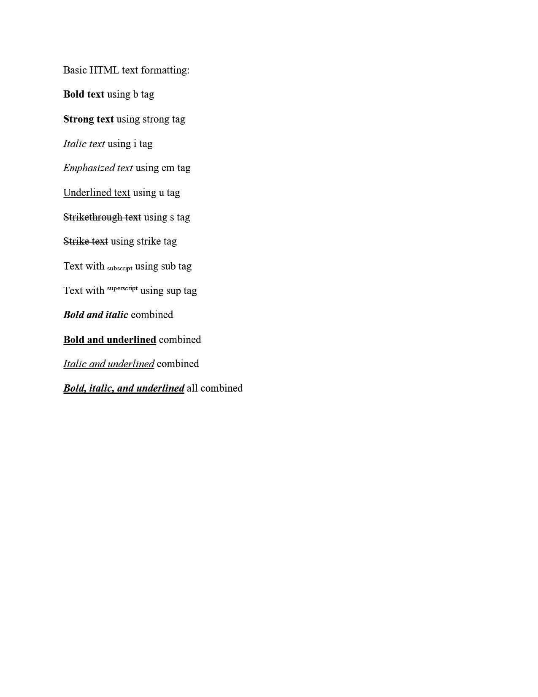 |  |  |

## html_complex

| Expected (Word) | Skia | ImageSharp |
| --- | --- | --- |
| **Page 1**&nbsp;&nbsp;&nbsp;&nbsp;&nbsp;&nbsp;&nbsp;&nbsp;&nbsp;&nbsp;&nbsp;&nbsp;&nbsp;&nbsp;&nbsp;&nbsp;&nbsp;&nbsp;&nbsp;&nbsp;&nbsp;&nbsp;&nbsp;&nbsp;&nbsp;&nbsp;&nbsp;&nbsp;&nbsp;&nbsp;&nbsp;&nbsp;&nbsp;&nbsp; | **Page 1. ErrorMetric: 0.0897 · SSIM: 0.8700** | **Page 1. ErrorMetric: 0.0932 · SSIM: 0.8639** |
|  |  |  |
| **Page 2**&nbsp;&nbsp;&nbsp;&nbsp;&nbsp;&nbsp;&nbsp;&nbsp;&nbsp;&nbsp;&nbsp;&nbsp;&nbsp;&nbsp;&nbsp;&nbsp;&nbsp;&nbsp;&nbsp;&nbsp;&nbsp;&nbsp;&nbsp;&nbsp;&nbsp;&nbsp;&nbsp;&nbsp;&nbsp;&nbsp;&nbsp;&nbsp;&nbsp;&nbsp; | **Page 2. ErrorMetric: 0.0696 · SSIM: 0.9335** | **Page 2. ErrorMetric: 0.0715 · SSIM: 0.9334** |
|  |  |  |

## html_css_alignment

| Expected (Word) | Skia | ImageSharp |
| --- | --- | --- |
| **Page 1**&nbsp;&nbsp;&nbsp;&nbsp;&nbsp;&nbsp;&nbsp;&nbsp;&nbsp;&nbsp;&nbsp;&nbsp;&nbsp;&nbsp;&nbsp;&nbsp;&nbsp;&nbsp;&nbsp;&nbsp;&nbsp;&nbsp;&nbsp;&nbsp;&nbsp;&nbsp;&nbsp;&nbsp;&nbsp;&nbsp;&nbsp;&nbsp;&nbsp;&nbsp; | **Page 1. ErrorMetric: 0.0244 · SSIM: 0.9459** | **Page 1. ErrorMetric: 0.0249 · SSIM: 0.9444** |
|  |  |  |

## html_css_borders

| Expected (Word) | Skia | ImageSharp |
| --- | --- | --- |
| **Page 1**&nbsp;&nbsp;&nbsp;&nbsp;&nbsp;&nbsp;&nbsp;&nbsp;&nbsp;&nbsp;&nbsp;&nbsp;&nbsp;&nbsp;&nbsp;&nbsp;&nbsp;&nbsp;&nbsp;&nbsp;&nbsp;&nbsp;&nbsp;&nbsp;&nbsp;&nbsp;&nbsp;&nbsp;&nbsp;&nbsp;&nbsp;&nbsp;&nbsp;&nbsp; | **Page 1. ErrorMetric: 0.0347 · SSIM: 0.8907** | **Page 1. ErrorMetric: 0.0349 · SSIM: 0.8895** |
|  |  |  |

## html_css_colors

| Expected (Word) | Skia | ImageSharp |
| --- | --- | --- |
| **Page 1**&nbsp;&nbsp;&nbsp;&nbsp;&nbsp;&nbsp;&nbsp;&nbsp;&nbsp;&nbsp;&nbsp;&nbsp;&nbsp;&nbsp;&nbsp;&nbsp;&nbsp;&nbsp;&nbsp;&nbsp;&nbsp;&nbsp;&nbsp;&nbsp;&nbsp;&nbsp;&nbsp;&nbsp;&nbsp;&nbsp;&nbsp;&nbsp;&nbsp;&nbsp; | **Page 1. ErrorMetric: 0.0357 · SSIM: 0.9527** | **Page 1. ErrorMetric: 0.0368 · SSIM: 0.9509** |
|  |  |  |

## html_css_margin_padding

| Expected (Word) | Skia | ImageSharp |
| --- | --- | --- |
| **Page 1**&nbsp;&nbsp;&nbsp;&nbsp;&nbsp;&nbsp;&nbsp;&nbsp;&nbsp;&nbsp;&nbsp;&nbsp;&nbsp;&nbsp;&nbsp;&nbsp;&nbsp;&nbsp;&nbsp;&nbsp;&nbsp;&nbsp;&nbsp;&nbsp;&nbsp;&nbsp;&nbsp;&nbsp;&nbsp;&nbsp;&nbsp;&nbsp;&nbsp;&nbsp; | **Page 1. ErrorMetric: 0.0475 · SSIM: 0.9260** | **Page 1. ErrorMetric: 0.0496 · SSIM: 0.9257** |
| 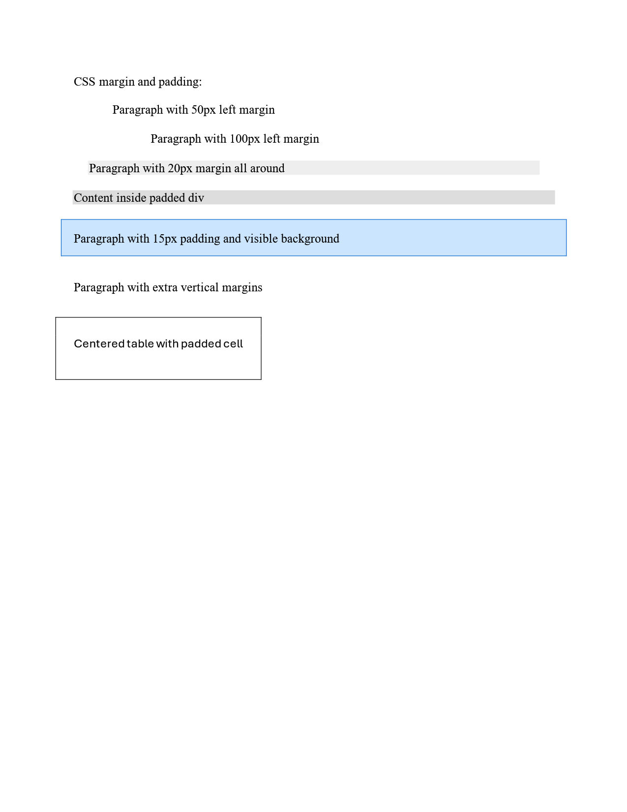 |  |  |

## html_font_tag

| Expected (Word) | Skia | ImageSharp |
| --- | --- | --- |
| **Page 1**&nbsp;&nbsp;&nbsp;&nbsp;&nbsp;&nbsp;&nbsp;&nbsp;&nbsp;&nbsp;&nbsp;&nbsp;&nbsp;&nbsp;&nbsp;&nbsp;&nbsp;&nbsp;&nbsp;&nbsp;&nbsp;&nbsp;&nbsp;&nbsp;&nbsp;&nbsp;&nbsp;&nbsp;&nbsp;&nbsp;&nbsp;&nbsp;&nbsp;&nbsp; | **Page 1. ErrorMetric: 0.0240 · SSIM: 0.9406** | **Page 1. ErrorMetric: 0.0236 · SSIM: 0.9445** |
|  |  |  |

## html_headings

| Expected (Word) | Skia | ImageSharp |
| --- | --- | --- |
| **Page 1**&nbsp;&nbsp;&nbsp;&nbsp;&nbsp;&nbsp;&nbsp;&nbsp;&nbsp;&nbsp;&nbsp;&nbsp;&nbsp;&nbsp;&nbsp;&nbsp;&nbsp;&nbsp;&nbsp;&nbsp;&nbsp;&nbsp;&nbsp;&nbsp;&nbsp;&nbsp;&nbsp;&nbsp;&nbsp;&nbsp;&nbsp;&nbsp;&nbsp;&nbsp; | **Page 1. ErrorMetric: 0.0148 · SSIM: 0.9701** | **Page 1. ErrorMetric: 0.0161 · SSIM: 0.9664** |
|  |  |  |

## html_images

| Expected (Word) | Skia | ImageSharp |
| --- | --- | --- |
| **Page 1**&nbsp;&nbsp;&nbsp;&nbsp;&nbsp;&nbsp;&nbsp;&nbsp;&nbsp;&nbsp;&nbsp;&nbsp;&nbsp;&nbsp;&nbsp;&nbsp;&nbsp;&nbsp;&nbsp;&nbsp;&nbsp;&nbsp;&nbsp;&nbsp;&nbsp;&nbsp;&nbsp;&nbsp;&nbsp;&nbsp;&nbsp;&nbsp;&nbsp;&nbsp; | **Page 1. ErrorMetric: 0.0605 · SSIM: 0.9673** | **Page 1. ErrorMetric: 0.0604 · SSIM: 0.9675** |
|  |  |  |

## html_inline_styles

| Expected (Word) | Skia | ImageSharp |
| --- | --- | --- |
| **Page 1**&nbsp;&nbsp;&nbsp;&nbsp;&nbsp;&nbsp;&nbsp;&nbsp;&nbsp;&nbsp;&nbsp;&nbsp;&nbsp;&nbsp;&nbsp;&nbsp;&nbsp;&nbsp;&nbsp;&nbsp;&nbsp;&nbsp;&nbsp;&nbsp;&nbsp;&nbsp;&nbsp;&nbsp;&nbsp;&nbsp;&nbsp;&nbsp;&nbsp;&nbsp; | **Page 1. ErrorMetric: 0.0368 · SSIM: 0.9505** | **Page 1. ErrorMetric: 0.0389 · SSIM: 0.9472** |
| 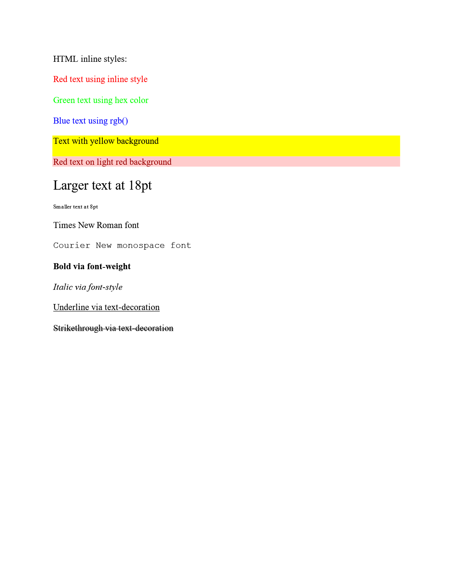 |  |  |

## html_links

| Expected (Word) | Skia | ImageSharp |
| --- | --- | --- |
| **Page 1**&nbsp;&nbsp;&nbsp;&nbsp;&nbsp;&nbsp;&nbsp;&nbsp;&nbsp;&nbsp;&nbsp;&nbsp;&nbsp;&nbsp;&nbsp;&nbsp;&nbsp;&nbsp;&nbsp;&nbsp;&nbsp;&nbsp;&nbsp;&nbsp;&nbsp;&nbsp;&nbsp;&nbsp;&nbsp;&nbsp;&nbsp;&nbsp;&nbsp;&nbsp; | **Page 1. ErrorMetric: 0.0104 · SSIM: 0.9793** | **Page 1. ErrorMetric: 0.0106 · SSIM: 0.9782** |
|  |  |  |

## html_lists

| Expected (Word) | Skia | ImageSharp |
| --- | --- | --- |
| **Page 1**&nbsp;&nbsp;&nbsp;&nbsp;&nbsp;&nbsp;&nbsp;&nbsp;&nbsp;&nbsp;&nbsp;&nbsp;&nbsp;&nbsp;&nbsp;&nbsp;&nbsp;&nbsp;&nbsp;&nbsp;&nbsp;&nbsp;&nbsp;&nbsp;&nbsp;&nbsp;&nbsp;&nbsp;&nbsp;&nbsp;&nbsp;&nbsp;&nbsp;&nbsp; | **Page 1. ErrorMetric: 0.0113 · SSIM: 0.9720** | **Page 1. ErrorMetric: 0.0115 · SSIM: 0.9727** |
|  |  |  |

## html_nested_lists

| Expected (Word) | Skia | ImageSharp |
| --- | --- | --- |
| **Page 1**&nbsp;&nbsp;&nbsp;&nbsp;&nbsp;&nbsp;&nbsp;&nbsp;&nbsp;&nbsp;&nbsp;&nbsp;&nbsp;&nbsp;&nbsp;&nbsp;&nbsp;&nbsp;&nbsp;&nbsp;&nbsp;&nbsp;&nbsp;&nbsp;&nbsp;&nbsp;&nbsp;&nbsp;&nbsp;&nbsp;&nbsp;&nbsp;&nbsp;&nbsp; | **Page 1. ErrorMetric: 0.0132 · SSIM: 0.9637** | **Page 1. ErrorMetric: 0.0135 · SSIM: 0.9630** |
| 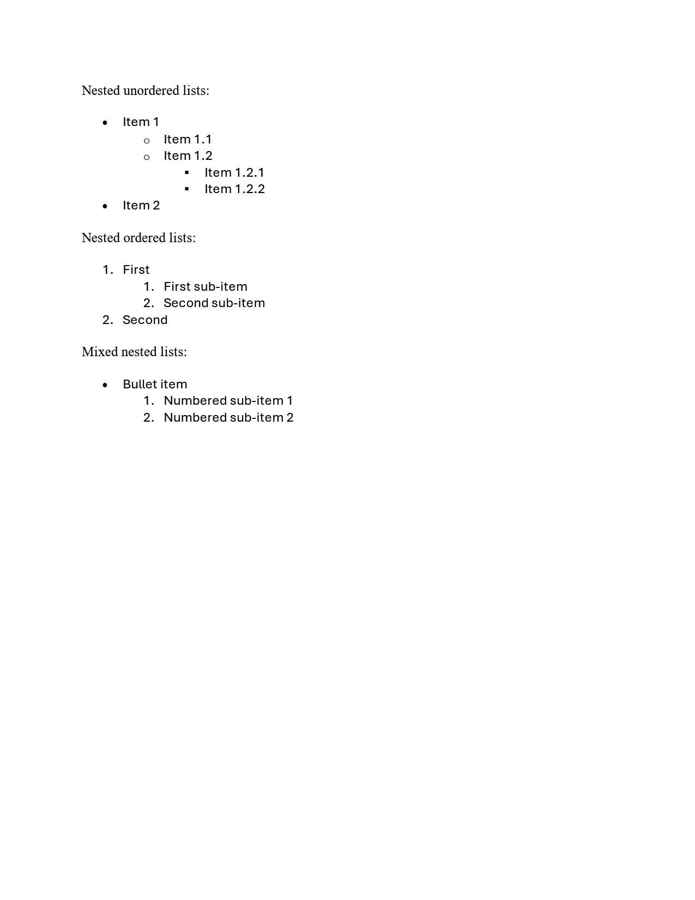 |  |  |

## html_paragraphs

| Expected (Word) | Skia | ImageSharp |
| --- | --- | --- |
| **Page 1**&nbsp;&nbsp;&nbsp;&nbsp;&nbsp;&nbsp;&nbsp;&nbsp;&nbsp;&nbsp;&nbsp;&nbsp;&nbsp;&nbsp;&nbsp;&nbsp;&nbsp;&nbsp;&nbsp;&nbsp;&nbsp;&nbsp;&nbsp;&nbsp;&nbsp;&nbsp;&nbsp;&nbsp;&nbsp;&nbsp;&nbsp;&nbsp;&nbsp;&nbsp; | **Page 1. ErrorMetric: 0.0144 · SSIM: 0.9673** | **Page 1. ErrorMetric: 0.0147 · SSIM: 0.9670** |
|  |  |  |

## html_table

| Expected (Word) | Skia | ImageSharp |
| --- | --- | --- |
| **Page 1**&nbsp;&nbsp;&nbsp;&nbsp;&nbsp;&nbsp;&nbsp;&nbsp;&nbsp;&nbsp;&nbsp;&nbsp;&nbsp;&nbsp;&nbsp;&nbsp;&nbsp;&nbsp;&nbsp;&nbsp;&nbsp;&nbsp;&nbsp;&nbsp;&nbsp;&nbsp;&nbsp;&nbsp;&nbsp;&nbsp;&nbsp;&nbsp;&nbsp;&nbsp; | **Page 1. ErrorMetric: 0.0098 · SSIM: 0.9732** | **Page 1. ErrorMetric: 0.0101 · SSIM: 0.9729** |
|  |  |  |

## html_table_cellpadding

| Expected (Word) | Skia | ImageSharp |
| --- | --- | --- |
| **Page 1**&nbsp;&nbsp;&nbsp;&nbsp;&nbsp;&nbsp;&nbsp;&nbsp;&nbsp;&nbsp;&nbsp;&nbsp;&nbsp;&nbsp;&nbsp;&nbsp;&nbsp;&nbsp;&nbsp;&nbsp;&nbsp;&nbsp;&nbsp;&nbsp;&nbsp;&nbsp;&nbsp;&nbsp;&nbsp;&nbsp;&nbsp;&nbsp;&nbsp;&nbsp; | **Page 1. ErrorMetric: 0.0082 · SSIM: 0.9774** | **Page 1. ErrorMetric: 0.0083 · SSIM: 0.9777** |
|  |  |  |

## html_table_cell_margin_css

| Expected (Word) | Skia | ImageSharp |
| --- | --- | --- |
| **Page 1**&nbsp;&nbsp;&nbsp;&nbsp;&nbsp;&nbsp;&nbsp;&nbsp;&nbsp;&nbsp;&nbsp;&nbsp;&nbsp;&nbsp;&nbsp;&nbsp;&nbsp;&nbsp;&nbsp;&nbsp;&nbsp;&nbsp;&nbsp;&nbsp;&nbsp;&nbsp;&nbsp;&nbsp;&nbsp;&nbsp;&nbsp;&nbsp;&nbsp;&nbsp; | **Page 1. ErrorMetric: 0.0102 · SSIM: 0.9747** | **Page 1. ErrorMetric: 0.0103 · SSIM: 0.9737** |
|  |  |  |

## html_table_cell_padding_css

| Expected (Word) | Skia | ImageSharp |
| --- | --- | --- |
| **Page 1**&nbsp;&nbsp;&nbsp;&nbsp;&nbsp;&nbsp;&nbsp;&nbsp;&nbsp;&nbsp;&nbsp;&nbsp;&nbsp;&nbsp;&nbsp;&nbsp;&nbsp;&nbsp;&nbsp;&nbsp;&nbsp;&nbsp;&nbsp;&nbsp;&nbsp;&nbsp;&nbsp;&nbsp;&nbsp;&nbsp;&nbsp;&nbsp;&nbsp;&nbsp; | **Page 1. ErrorMetric: 0.0093 · SSIM: 0.9785** | **Page 1. ErrorMetric: 0.0093 · SSIM: 0.9784** |
|  |  |  |

## html_table_styled

| Expected (Word) | Skia | ImageSharp |
| --- | --- | --- |
| **Page 1**&nbsp;&nbsp;&nbsp;&nbsp;&nbsp;&nbsp;&nbsp;&nbsp;&nbsp;&nbsp;&nbsp;&nbsp;&nbsp;&nbsp;&nbsp;&nbsp;&nbsp;&nbsp;&nbsp;&nbsp;&nbsp;&nbsp;&nbsp;&nbsp;&nbsp;&nbsp;&nbsp;&nbsp;&nbsp;&nbsp;&nbsp;&nbsp;&nbsp;&nbsp; | **Page 1. ErrorMetric: 0.0900 · SSIM: 0.9273** | **Page 1. ErrorMetric: 0.0909 · SSIM: 0.9265** |
|  |  |  |

## hyperlinks

| Expected (Word) | Skia | ImageSharp |
| --- | --- | --- |
| **Page 1**&nbsp;&nbsp;&nbsp;&nbsp;&nbsp;&nbsp;&nbsp;&nbsp;&nbsp;&nbsp;&nbsp;&nbsp;&nbsp;&nbsp;&nbsp;&nbsp;&nbsp;&nbsp;&nbsp;&nbsp;&nbsp;&nbsp;&nbsp;&nbsp;&nbsp;&nbsp;&nbsp;&nbsp;&nbsp;&nbsp;&nbsp;&nbsp;&nbsp;&nbsp; | **Page 1. ErrorMetric: 0.0060 · SSIM: 0.9890** | **Page 1. ErrorMetric: 0.0062 · SSIM: 0.9881** |
|  |  |  |

## hyphenation_auto

| Expected (Word) | Skia | ImageSharp |
| --- | --- | --- |
| **Page 1**&nbsp;&nbsp;&nbsp;&nbsp;&nbsp;&nbsp;&nbsp;&nbsp;&nbsp;&nbsp;&nbsp;&nbsp;&nbsp;&nbsp;&nbsp;&nbsp;&nbsp;&nbsp;&nbsp;&nbsp;&nbsp;&nbsp;&nbsp;&nbsp;&nbsp;&nbsp;&nbsp;&nbsp;&nbsp;&nbsp;&nbsp;&nbsp;&nbsp;&nbsp; | **Page 1. ErrorMetric: 0.0325 · SSIM: 0.9357** | **Page 1. ErrorMetric: 0.0335 · SSIM: 0.9321** |
|  |  |  |

## hyphenation_nonbreaking

| Expected (Word) | Skia | ImageSharp |
| --- | --- | --- |
| **Page 1**&nbsp;&nbsp;&nbsp;&nbsp;&nbsp;&nbsp;&nbsp;&nbsp;&nbsp;&nbsp;&nbsp;&nbsp;&nbsp;&nbsp;&nbsp;&nbsp;&nbsp;&nbsp;&nbsp;&nbsp;&nbsp;&nbsp;&nbsp;&nbsp;&nbsp;&nbsp;&nbsp;&nbsp;&nbsp;&nbsp;&nbsp;&nbsp;&nbsp;&nbsp; | **Page 1. ErrorMetric: 0.0127 · SSIM: 0.9761** | **Page 1. ErrorMetric: 0.0129 · SSIM: 0.9755** |
|  |  |  |

## hyphenation_soft

| Expected (Word) | Skia | ImageSharp |
| --- | --- | --- |
| **Page 1**&nbsp;&nbsp;&nbsp;&nbsp;&nbsp;&nbsp;&nbsp;&nbsp;&nbsp;&nbsp;&nbsp;&nbsp;&nbsp;&nbsp;&nbsp;&nbsp;&nbsp;&nbsp;&nbsp;&nbsp;&nbsp;&nbsp;&nbsp;&nbsp;&nbsp;&nbsp;&nbsp;&nbsp;&nbsp;&nbsp;&nbsp;&nbsp;&nbsp;&nbsp; | **Page 1. ErrorMetric: 0.0124 · SSIM: 0.9763** | **Page 1. ErrorMetric: 0.0125 · SSIM: 0.9758** |
|  |  |  |

## hyphenation_suppressed

| Expected (Word) | Skia | ImageSharp |
| --- | --- | --- |
| **Page 1**&nbsp;&nbsp;&nbsp;&nbsp;&nbsp;&nbsp;&nbsp;&nbsp;&nbsp;&nbsp;&nbsp;&nbsp;&nbsp;&nbsp;&nbsp;&nbsp;&nbsp;&nbsp;&nbsp;&nbsp;&nbsp;&nbsp;&nbsp;&nbsp;&nbsp;&nbsp;&nbsp;&nbsp;&nbsp;&nbsp;&nbsp;&nbsp;&nbsp;&nbsp; | **Page 1. ErrorMetric: 0.0272 · SSIM: 0.9480** | **Page 1. ErrorMetric: 0.0281 · SSIM: 0.9466** |
|  |  |  |

## icons_multiple

| Expected (Word) | Skia | ImageSharp |
| --- | --- | --- |
| **Page 1**&nbsp;&nbsp;&nbsp;&nbsp;&nbsp;&nbsp;&nbsp;&nbsp;&nbsp;&nbsp;&nbsp;&nbsp;&nbsp;&nbsp;&nbsp;&nbsp;&nbsp;&nbsp;&nbsp;&nbsp;&nbsp;&nbsp;&nbsp;&nbsp;&nbsp;&nbsp;&nbsp;&nbsp;&nbsp;&nbsp;&nbsp;&nbsp;&nbsp;&nbsp; | **Page 1. ErrorMetric: 0.0027 · SSIM: 0.9953** | **Page 1. ErrorMetric: 0.0029 · SSIM: 0.9953** |
|  |  |  |

## icon_svg

| Expected (Word) | Skia | ImageSharp |
| --- | --- | --- |
| **Page 1**&nbsp;&nbsp;&nbsp;&nbsp;&nbsp;&nbsp;&nbsp;&nbsp;&nbsp;&nbsp;&nbsp;&nbsp;&nbsp;&nbsp;&nbsp;&nbsp;&nbsp;&nbsp;&nbsp;&nbsp;&nbsp;&nbsp;&nbsp;&nbsp;&nbsp;&nbsp;&nbsp;&nbsp;&nbsp;&nbsp;&nbsp;&nbsp;&nbsp;&nbsp; | **Page 1. ErrorMetric: 0.0019 · SSIM: 0.9965** | **Page 1. ErrorMetric: 0.0021 · SSIM: 0.9965** |
|  |  |  |

## icon_with_text

| Expected (Word) | Skia | ImageSharp |
| --- | --- | --- |
| **Page 1**&nbsp;&nbsp;&nbsp;&nbsp;&nbsp;&nbsp;&nbsp;&nbsp;&nbsp;&nbsp;&nbsp;&nbsp;&nbsp;&nbsp;&nbsp;&nbsp;&nbsp;&nbsp;&nbsp;&nbsp;&nbsp;&nbsp;&nbsp;&nbsp;&nbsp;&nbsp;&nbsp;&nbsp;&nbsp;&nbsp;&nbsp;&nbsp;&nbsp;&nbsp; | **Page 1. ErrorMetric: 0.0055 · SSIM: 0.9890** | **Page 1. ErrorMetric: 0.0060 · SSIM: 0.9859** |
|  |  |  |

## image_cropping/01

| Expected (Word) | Skia | ImageSharp |
| --- | --- | --- |
| **Page 1**&nbsp;&nbsp;&nbsp;&nbsp;&nbsp;&nbsp;&nbsp;&nbsp;&nbsp;&nbsp;&nbsp;&nbsp;&nbsp;&nbsp;&nbsp;&nbsp;&nbsp;&nbsp;&nbsp;&nbsp;&nbsp;&nbsp;&nbsp;&nbsp;&nbsp;&nbsp;&nbsp;&nbsp;&nbsp;&nbsp;&nbsp;&nbsp;&nbsp;&nbsp; | **Page 1. ErrorMetric: 0.0372 · SSIM: 0.9902** | **Page 1. ErrorMetric: 0.0375 · SSIM: 0.9902** |
|  |  |  |

## image_rotation/01

| Expected (Word) | Skia | ImageSharp |
| --- | --- | --- |
| **Page 1**&nbsp;&nbsp;&nbsp;&nbsp;&nbsp;&nbsp;&nbsp;&nbsp;&nbsp;&nbsp;&nbsp;&nbsp;&nbsp;&nbsp;&nbsp;&nbsp;&nbsp;&nbsp;&nbsp;&nbsp;&nbsp;&nbsp;&nbsp;&nbsp;&nbsp;&nbsp;&nbsp;&nbsp;&nbsp;&nbsp;&nbsp;&nbsp;&nbsp;&nbsp; | **Page 1. ErrorMetric: 0.0408 · SSIM: 0.9795** | **Page 1. ErrorMetric: 0.0477 · SSIM: 0.9746** |
|  |  |  |

## image_wrap_square

| Expected (Word) | Skia | ImageSharp |
| --- | --- | --- |
| **Page 1**&nbsp;&nbsp;&nbsp;&nbsp;&nbsp;&nbsp;&nbsp;&nbsp;&nbsp;&nbsp;&nbsp;&nbsp;&nbsp;&nbsp;&nbsp;&nbsp;&nbsp;&nbsp;&nbsp;&nbsp;&nbsp;&nbsp;&nbsp;&nbsp;&nbsp;&nbsp;&nbsp;&nbsp;&nbsp;&nbsp;&nbsp;&nbsp;&nbsp;&nbsp; | **Page 1. ErrorMetric: 0.0676 · SSIM: 0.8949** | **Page 1. ErrorMetric: 0.0780 · SSIM: 0.8584** |
|  |  |  |
| **Page 2**&nbsp;&nbsp;&nbsp;&nbsp;&nbsp;&nbsp;&nbsp;&nbsp;&nbsp;&nbsp;&nbsp;&nbsp;&nbsp;&nbsp;&nbsp;&nbsp;&nbsp;&nbsp;&nbsp;&nbsp;&nbsp;&nbsp;&nbsp;&nbsp;&nbsp;&nbsp;&nbsp;&nbsp;&nbsp;&nbsp;&nbsp;&nbsp;&nbsp;&nbsp; | **Page 2. ErrorMetric: 0.0878 · SSIM: 0.8071** | **Page 2. ErrorMetric: 0.0964 · SSIM: 0.7752** |
|  |  |  |

## inline_group_crop

# inline_group_crop

Covers `a:srcRect` crops on the `pic:pic` members of an inline `wpg:wgp` group.

Derived from `menus/07` — the same three circle-cropped photos, each given a different
crop so a swapped axis or a flipped sign shows up:

| picture          | `a:srcRect`                          | effect                    |
|------------------|--------------------------------------|---------------------------|
| Bowl of soup     | `l="30000"`                          | trims 30% off the left    |
| Warm potato dish | `t="30000"`                          | trims 30% off the top     |
| Cupcakes         | `l/t="10000"`, `r/b="25000"`         | asymmetric on all four    |

The crop composes with everything else the group carries: each picture is still cropped to an
ellipse by its `pic:spPr/a:prstGeom`, ringed by its `a:ln`, and casts the `a:outerShdw` drop
shadow. `expected_0001.png` is Word's own rendering (via `RenderHelper`).

The corpus otherwise has no usable `a:srcRect` inside a group: `menus/07`'s only value is a
negative `t="-168"`, which `ReadCrop` clamps away.

| Expected (Word) | Skia | ImageSharp |
| --- | --- | --- |
| **Page 1**&nbsp;&nbsp;&nbsp;&nbsp;&nbsp;&nbsp;&nbsp;&nbsp;&nbsp;&nbsp;&nbsp;&nbsp;&nbsp;&nbsp;&nbsp;&nbsp;&nbsp;&nbsp;&nbsp;&nbsp;&nbsp;&nbsp;&nbsp;&nbsp;&nbsp;&nbsp;&nbsp;&nbsp;&nbsp;&nbsp;&nbsp;&nbsp;&nbsp;&nbsp; | **Page 1. ErrorMetric: 0.1787 · SSIM: 0.8077** | **Page 1. ErrorMetric: 0.2046 · SSIM: 0.7930** |
|  |  |  |

## inline_group_rotation

# inline_group_rotation

Covers a group-level rotation (`wpg:grpSpPr/a:xfrm/@rot`) on an inline `wpg:wgp` that contains
a `pic:pic`. Word rotates the whole group — shapes *and* pictures — around the group centre.

Derived from `menus/07`: the three circle-cropped photo groups given distinct rotations so a
wrong pivot or a flipped sign shows up.

| group        | `@rot`      | degrees |
|--------------|-------------|---------|
| Appetizer    | `1800000`   | 30      |
| Main Course  | `5400000`   | 90      |
| Dessert      | `12000000`  | 200     |

The rotation composes with the rest of each group: the photo is still ellipse-cropped by its
`pic:spPr`, ringed by its `a:ln`, and casts its `a:outerShdw`. `expected_0001.png` is Word's own
render (via `RenderHelper`).

The corpus otherwise has no rotated group containing a picture: the eight rotated groups in
`business-plans/12` and `inline_shape_arrows` are all connector-line arrow glyphs.

Skia (`canvas.RotateDegrees` + `DrawBitmap`), the PDF backend (`XGraphics.RotateAtTransform`)
and HTML (an SVG `<g transform="rotate(...)">`) rotate the picture through the same canvas
transform that rotates the shapes. ImageSharp's `DrawingCanvas.Apply` — the ellipse-clip path —
ignores a pushed rotation, so a rotated photo is drawn from a pre-clipped standalone bitmap via
`DrawImage`, which honours it.

| Expected (Word) | Skia | ImageSharp |
| --- | --- | --- |
| **Page 1**&nbsp;&nbsp;&nbsp;&nbsp;&nbsp;&nbsp;&nbsp;&nbsp;&nbsp;&nbsp;&nbsp;&nbsp;&nbsp;&nbsp;&nbsp;&nbsp;&nbsp;&nbsp;&nbsp;&nbsp;&nbsp;&nbsp;&nbsp;&nbsp;&nbsp;&nbsp;&nbsp;&nbsp;&nbsp;&nbsp;&nbsp;&nbsp;&nbsp;&nbsp; | **Page 1. ErrorMetric: 0.1778 · SSIM: 0.8065** | **Page 1. ErrorMetric: 0.2034 · SSIM: 0.7927** |
|  |  |  |

## inline_image

| Expected (Word) | Skia | ImageSharp |
| --- | --- | --- |
| **Page 1**&nbsp;&nbsp;&nbsp;&nbsp;&nbsp;&nbsp;&nbsp;&nbsp;&nbsp;&nbsp;&nbsp;&nbsp;&nbsp;&nbsp;&nbsp;&nbsp;&nbsp;&nbsp;&nbsp;&nbsp;&nbsp;&nbsp;&nbsp;&nbsp;&nbsp;&nbsp;&nbsp;&nbsp;&nbsp;&nbsp;&nbsp;&nbsp;&nbsp;&nbsp; | **Page 1. ErrorMetric: 0.0364 · SSIM: 0.9942** | **Page 1. ErrorMetric: 0.0369 · SSIM: 0.9937** |
|  |  |  |

## inline_shape_arrows

| Expected (Word) | Skia | ImageSharp |
| --- | --- | --- |
| **Page 1**&nbsp;&nbsp;&nbsp;&nbsp;&nbsp;&nbsp;&nbsp;&nbsp;&nbsp;&nbsp;&nbsp;&nbsp;&nbsp;&nbsp;&nbsp;&nbsp;&nbsp;&nbsp;&nbsp;&nbsp;&nbsp;&nbsp;&nbsp;&nbsp;&nbsp;&nbsp;&nbsp;&nbsp;&nbsp;&nbsp;&nbsp;&nbsp;&nbsp;&nbsp; | **Page 1. ErrorMetric: 0.0310 · SSIM: 0.9683** | **Page 1. ErrorMetric: 0.0310 · SSIM: 0.9672** |
| 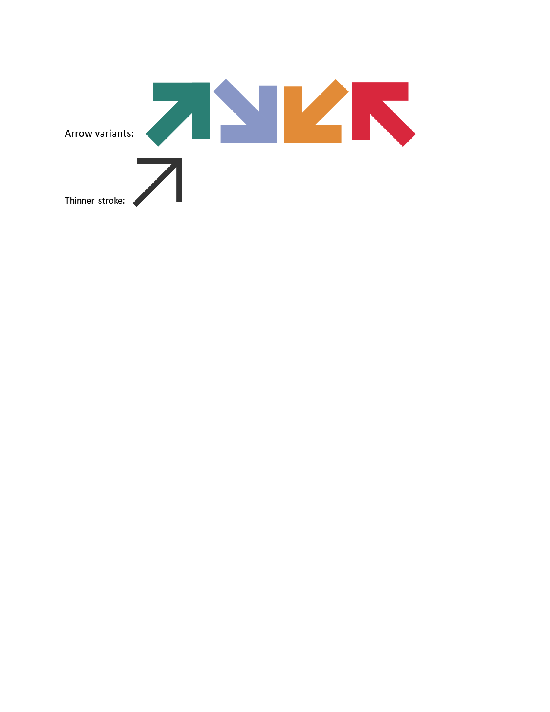 |  |  |

## italic_text

| Expected (Word) | Skia | ImageSharp |
| --- | --- | --- |
| **Page 1**&nbsp;&nbsp;&nbsp;&nbsp;&nbsp;&nbsp;&nbsp;&nbsp;&nbsp;&nbsp;&nbsp;&nbsp;&nbsp;&nbsp;&nbsp;&nbsp;&nbsp;&nbsp;&nbsp;&nbsp;&nbsp;&nbsp;&nbsp;&nbsp;&nbsp;&nbsp;&nbsp;&nbsp;&nbsp;&nbsp;&nbsp;&nbsp;&nbsp;&nbsp; | **Page 1. ErrorMetric: 0.0020 · SSIM: 0.9965** | **Page 1. ErrorMetric: 0.0021 · SSIM: 0.9962** |
|  |  |  |

## labels/01

| Expected (Word) | Skia | ImageSharp |
| --- | --- | --- |
| **Page 1**&nbsp;&nbsp;&nbsp;&nbsp;&nbsp;&nbsp;&nbsp;&nbsp;&nbsp;&nbsp;&nbsp;&nbsp;&nbsp;&nbsp;&nbsp;&nbsp;&nbsp;&nbsp;&nbsp;&nbsp;&nbsp;&nbsp;&nbsp;&nbsp;&nbsp;&nbsp;&nbsp;&nbsp;&nbsp;&nbsp;&nbsp;&nbsp;&nbsp;&nbsp; | **Page 1. ErrorMetric: 0.0990 · SSIM: 0.8466** | **Page 1. ErrorMetric: 0.1183 · SSIM: 0.8227** |
| 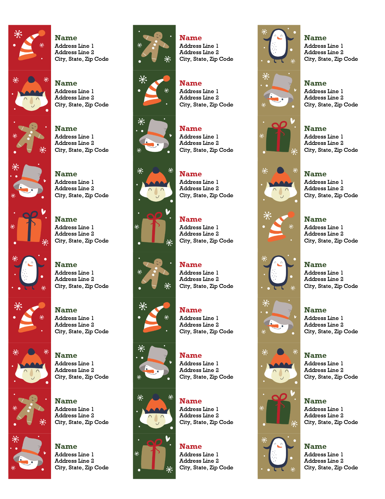 |  |  |

## labels/02

| Expected (Word) | Skia | ImageSharp |
| --- | --- | --- |
| **Page 1**&nbsp;&nbsp;&nbsp;&nbsp;&nbsp;&nbsp;&nbsp;&nbsp;&nbsp;&nbsp;&nbsp;&nbsp;&nbsp;&nbsp;&nbsp;&nbsp;&nbsp;&nbsp;&nbsp;&nbsp;&nbsp;&nbsp;&nbsp;&nbsp;&nbsp;&nbsp;&nbsp;&nbsp;&nbsp;&nbsp;&nbsp;&nbsp;&nbsp;&nbsp; | **Page 1. ErrorMetric: 0.0424 · SSIM: 0.9646** | **Page 1. ErrorMetric: 0.0444 · SSIM: 0.9611** |
| 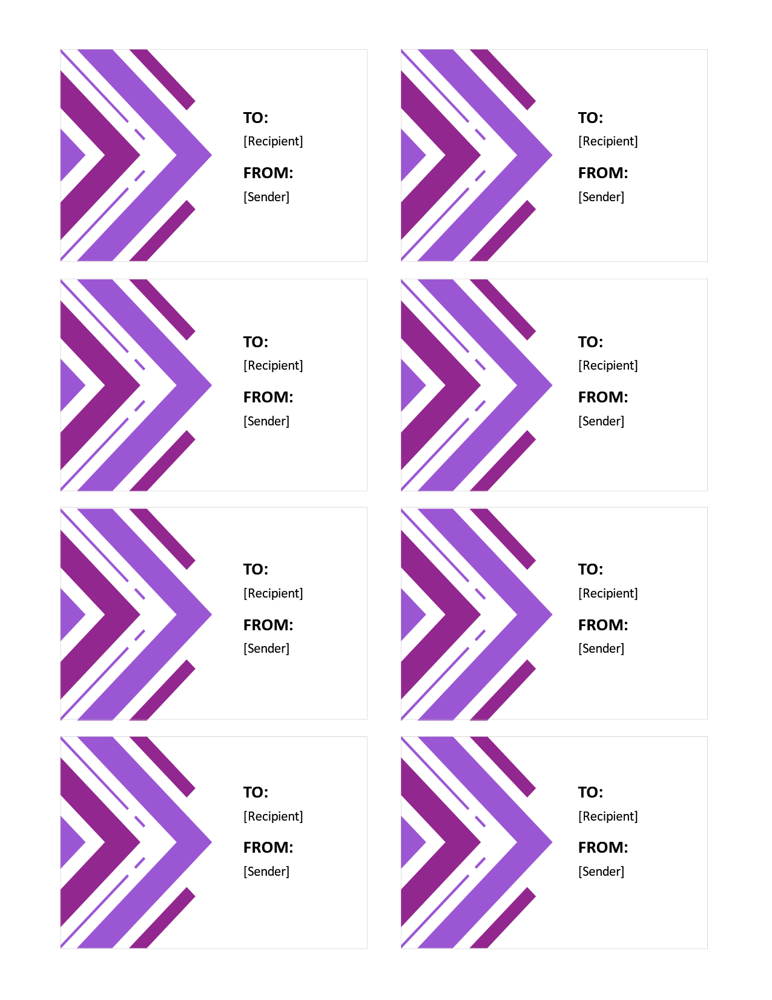 |  |  |

## labels/03

| Expected (Word) | Skia | ImageSharp |
| --- | --- | --- |
| **Page 1**&nbsp;&nbsp;&nbsp;&nbsp;&nbsp;&nbsp;&nbsp;&nbsp;&nbsp;&nbsp;&nbsp;&nbsp;&nbsp;&nbsp;&nbsp;&nbsp;&nbsp;&nbsp;&nbsp;&nbsp;&nbsp;&nbsp;&nbsp;&nbsp;&nbsp;&nbsp;&nbsp;&nbsp;&nbsp;&nbsp;&nbsp;&nbsp;&nbsp;&nbsp; | **Page 1. ErrorMetric: 0.0423 · SSIM: 0.9499** | **Page 1. ErrorMetric: 0.0494 · SSIM: 0.9237** |
| 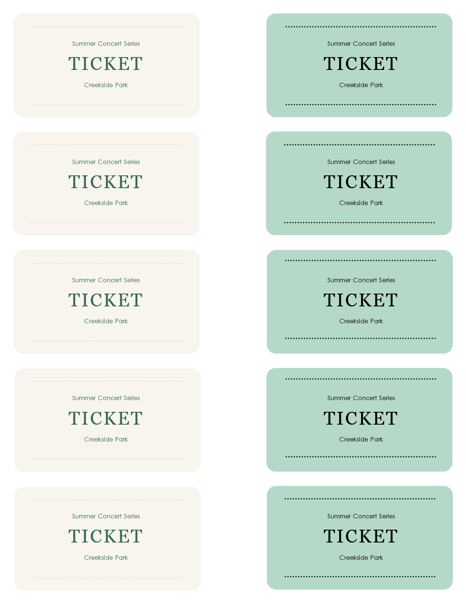 |  |  |

## labels/04

| Expected (Word) | Skia | ImageSharp |
| --- | --- | --- |
| **Page 1**&nbsp;&nbsp;&nbsp;&nbsp;&nbsp;&nbsp;&nbsp;&nbsp;&nbsp;&nbsp;&nbsp;&nbsp;&nbsp;&nbsp;&nbsp;&nbsp;&nbsp;&nbsp;&nbsp;&nbsp;&nbsp;&nbsp;&nbsp;&nbsp;&nbsp;&nbsp;&nbsp;&nbsp;&nbsp;&nbsp;&nbsp;&nbsp;&nbsp;&nbsp; | **Page 1. ErrorMetric: 0.1307 · SSIM: 0.8701** | **Page 1. ErrorMetric: 0.1341 · SSIM: 0.8557** |
| 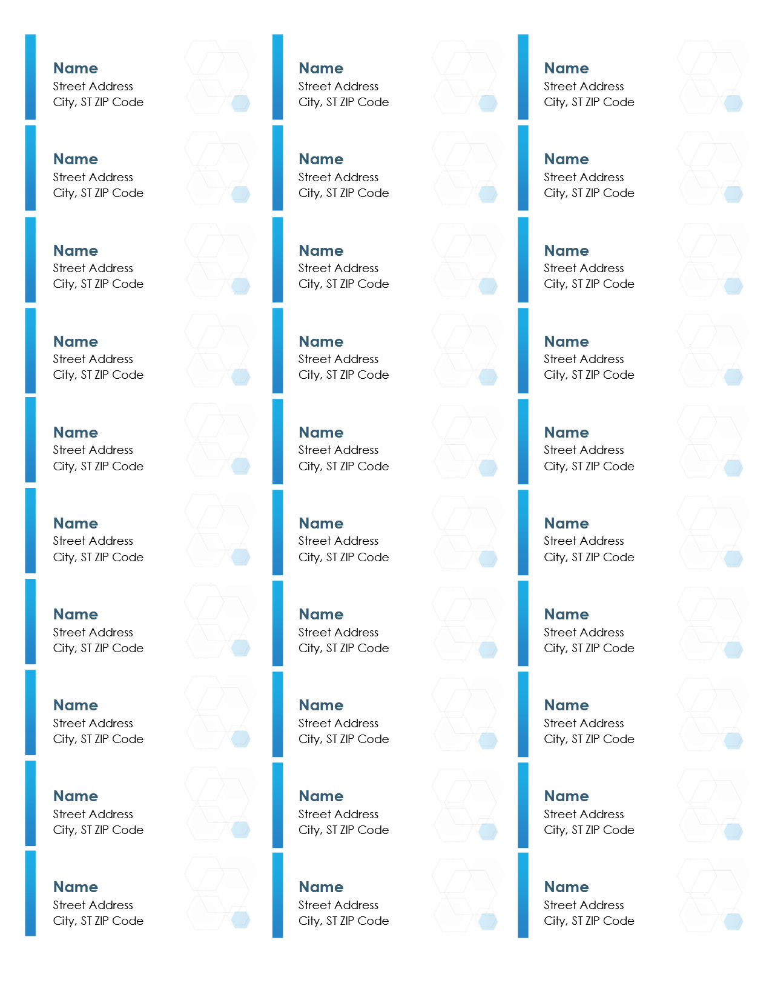 |  |  |

## labels/05

| Expected (Word) | Skia | ImageSharp |
| --- | --- | --- |
| **Page 1**&nbsp;&nbsp;&nbsp;&nbsp;&nbsp;&nbsp;&nbsp;&nbsp;&nbsp;&nbsp;&nbsp;&nbsp;&nbsp;&nbsp;&nbsp;&nbsp;&nbsp;&nbsp;&nbsp;&nbsp;&nbsp;&nbsp;&nbsp;&nbsp;&nbsp;&nbsp;&nbsp;&nbsp;&nbsp;&nbsp;&nbsp;&nbsp;&nbsp;&nbsp; | **Page 1. ErrorMetric: 0.1402 · SSIM: 0.9164** | **Page 1. ErrorMetric: 0.2049 · SSIM: 0.8670** |
|  |  |  |

## labels/06

| Expected (Word) | Skia | ImageSharp |
| --- | --- | --- |
| **Page 1**&nbsp;&nbsp;&nbsp;&nbsp;&nbsp;&nbsp;&nbsp;&nbsp;&nbsp;&nbsp;&nbsp;&nbsp;&nbsp;&nbsp;&nbsp;&nbsp;&nbsp;&nbsp;&nbsp;&nbsp;&nbsp;&nbsp;&nbsp;&nbsp;&nbsp;&nbsp;&nbsp;&nbsp;&nbsp;&nbsp;&nbsp;&nbsp;&nbsp;&nbsp; | **Page 1. ErrorMetric: 0.1546 · SSIM: 0.8385** | **Page 1. ErrorMetric: 0.1565 · SSIM: 0.8357** |
|  |  |  |

## labels/07

| Expected (Word) | Skia | ImageSharp |
| --- | --- | --- |
| **Page 1**&nbsp;&nbsp;&nbsp;&nbsp;&nbsp;&nbsp;&nbsp;&nbsp;&nbsp;&nbsp;&nbsp;&nbsp;&nbsp;&nbsp;&nbsp;&nbsp;&nbsp;&nbsp;&nbsp;&nbsp;&nbsp;&nbsp;&nbsp;&nbsp;&nbsp;&nbsp;&nbsp;&nbsp;&nbsp;&nbsp;&nbsp;&nbsp;&nbsp;&nbsp; | **Page 1. ErrorMetric: 0.0432 · SSIM: 0.9675** | **Page 1. ErrorMetric: 0.0585 · SSIM: 0.9382** |
|  |  |  |

## labels/08

| Expected (Word) | Skia | ImageSharp |
| --- | --- | --- |
| **Page 1**&nbsp;&nbsp;&nbsp;&nbsp;&nbsp;&nbsp;&nbsp;&nbsp;&nbsp;&nbsp;&nbsp;&nbsp;&nbsp;&nbsp;&nbsp;&nbsp;&nbsp;&nbsp;&nbsp;&nbsp;&nbsp;&nbsp;&nbsp;&nbsp;&nbsp;&nbsp;&nbsp;&nbsp;&nbsp;&nbsp;&nbsp;&nbsp;&nbsp;&nbsp; | **Page 1. ErrorMetric: 0.5277 · SSIM: 0.7108** | **Page 1. ErrorMetric: 0.5418 · SSIM: 0.7070** |
|  |  |  |

## labels/09

| Expected (Word) | Skia | ImageSharp |
| --- | --- | --- |
| **Page 1**&nbsp;&nbsp;&nbsp;&nbsp;&nbsp;&nbsp;&nbsp;&nbsp;&nbsp;&nbsp;&nbsp;&nbsp;&nbsp;&nbsp;&nbsp;&nbsp;&nbsp;&nbsp;&nbsp;&nbsp;&nbsp;&nbsp;&nbsp;&nbsp;&nbsp;&nbsp;&nbsp;&nbsp;&nbsp;&nbsp;&nbsp;&nbsp;&nbsp;&nbsp; | **Page 1. ErrorMetric: 0.1135 · SSIM: 0.7898** | **Page 1. ErrorMetric: 0.1215 · SSIM: 0.7598** |
|  |  |  |

## labels/10

| Expected (Word) | Skia | ImageSharp |
| --- | --- | --- |
| **Page 1**&nbsp;&nbsp;&nbsp;&nbsp;&nbsp;&nbsp;&nbsp;&nbsp;&nbsp;&nbsp;&nbsp;&nbsp;&nbsp;&nbsp;&nbsp;&nbsp;&nbsp;&nbsp;&nbsp;&nbsp;&nbsp;&nbsp;&nbsp;&nbsp;&nbsp;&nbsp;&nbsp;&nbsp;&nbsp;&nbsp;&nbsp;&nbsp;&nbsp;&nbsp; | **Page 1. ErrorMetric: 0.0878 · SSIM: 0.8223** | **Page 1. ErrorMetric: 0.0862 · SSIM: 0.8191** |
|  |  |  |

## labels/11

| Expected (Word) | Skia | ImageSharp |
| --- | --- | --- |
| **Page 1**&nbsp;&nbsp;&nbsp;&nbsp;&nbsp;&nbsp;&nbsp;&nbsp;&nbsp;&nbsp;&nbsp;&nbsp;&nbsp;&nbsp;&nbsp;&nbsp;&nbsp;&nbsp;&nbsp;&nbsp;&nbsp;&nbsp;&nbsp;&nbsp;&nbsp;&nbsp;&nbsp;&nbsp;&nbsp;&nbsp;&nbsp;&nbsp;&nbsp;&nbsp; | **Page 1. ErrorMetric: 0.1987 · SSIM: 0.6283** | **Page 1. ErrorMetric: 0.1267 · SSIM: 0.7919** |
|  |  |  |

## labels/12

| Expected (Word) | Skia | ImageSharp |
| --- | --- | --- |
| **Page 1**&nbsp;&nbsp;&nbsp;&nbsp;&nbsp;&nbsp;&nbsp;&nbsp;&nbsp;&nbsp;&nbsp;&nbsp;&nbsp;&nbsp;&nbsp;&nbsp;&nbsp;&nbsp;&nbsp;&nbsp;&nbsp;&nbsp;&nbsp;&nbsp;&nbsp;&nbsp;&nbsp;&nbsp;&nbsp;&nbsp;&nbsp;&nbsp;&nbsp;&nbsp; | **Page 1. ErrorMetric: 0.1102 · SSIM: 0.7489** | **Page 1. ErrorMetric: 0.1103 · SSIM: 0.7465** |
| 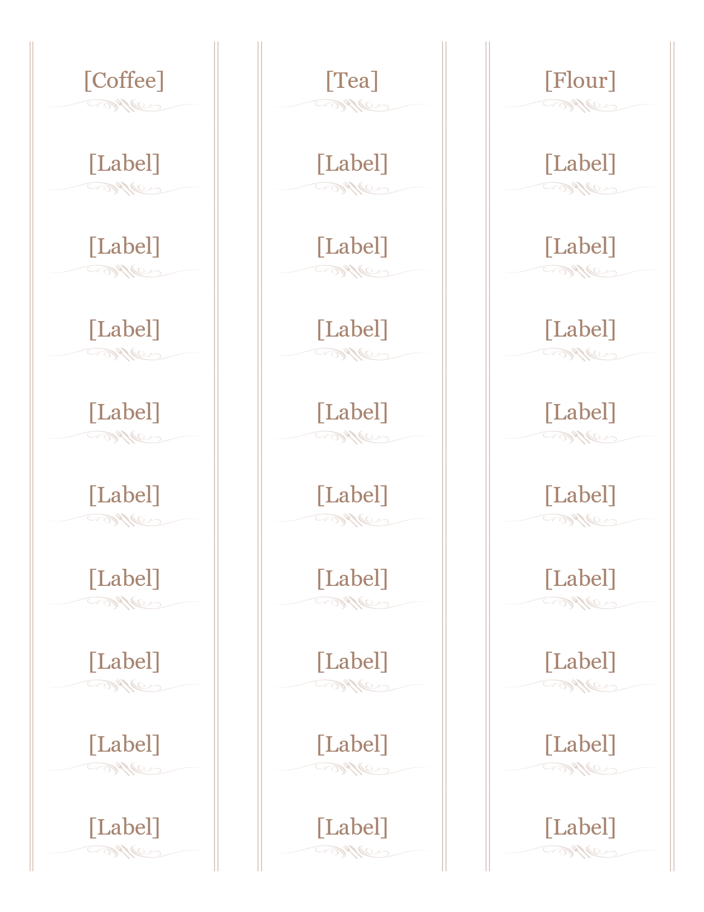 |  |  |

## labels/13

| Expected (Word) | Skia | ImageSharp |
| --- | --- | --- |
| **Page 1**&nbsp;&nbsp;&nbsp;&nbsp;&nbsp;&nbsp;&nbsp;&nbsp;&nbsp;&nbsp;&nbsp;&nbsp;&nbsp;&nbsp;&nbsp;&nbsp;&nbsp;&nbsp;&nbsp;&nbsp;&nbsp;&nbsp;&nbsp;&nbsp;&nbsp;&nbsp;&nbsp;&nbsp;&nbsp;&nbsp;&nbsp;&nbsp;&nbsp;&nbsp; | **Page 1. ErrorMetric: 0.1152 · SSIM: 0.8288** | **Page 1. ErrorMetric: 0.1362 · SSIM: 0.7952** |
|  |  |  |

## labels/14

| Expected (Word) | Skia | ImageSharp |
| --- | --- | --- |
| **Page 1**&nbsp;&nbsp;&nbsp;&nbsp;&nbsp;&nbsp;&nbsp;&nbsp;&nbsp;&nbsp;&nbsp;&nbsp;&nbsp;&nbsp;&nbsp;&nbsp;&nbsp;&nbsp;&nbsp;&nbsp;&nbsp;&nbsp;&nbsp;&nbsp;&nbsp;&nbsp;&nbsp;&nbsp;&nbsp;&nbsp;&nbsp;&nbsp;&nbsp;&nbsp; | **Page 1. ErrorMetric: 0.0554 · SSIM: 0.9008** | **Page 1. ErrorMetric: 0.0583 · SSIM: 0.8924** |
|  |  |  |

## labels/15

| Expected (Word) | Skia | ImageSharp |
| --- | --- | --- |
| **Page 1**&nbsp;&nbsp;&nbsp;&nbsp;&nbsp;&nbsp;&nbsp;&nbsp;&nbsp;&nbsp;&nbsp;&nbsp;&nbsp;&nbsp;&nbsp;&nbsp;&nbsp;&nbsp;&nbsp;&nbsp;&nbsp;&nbsp;&nbsp;&nbsp;&nbsp;&nbsp;&nbsp;&nbsp;&nbsp;&nbsp;&nbsp;&nbsp;&nbsp;&nbsp; | **Page 1. ErrorMetric: 0.1797 · SSIM: 0.6916** | **Page 1. ErrorMetric: 0.2046 · SSIM: 0.5458** |
|  |  |  |

## labels/16

| Expected (Word) | Skia | ImageSharp |
| --- | --- | --- |
| **Page 1**&nbsp;&nbsp;&nbsp;&nbsp;&nbsp;&nbsp;&nbsp;&nbsp;&nbsp;&nbsp;&nbsp;&nbsp;&nbsp;&nbsp;&nbsp;&nbsp;&nbsp;&nbsp;&nbsp;&nbsp;&nbsp;&nbsp;&nbsp;&nbsp;&nbsp;&nbsp;&nbsp;&nbsp;&nbsp;&nbsp;&nbsp;&nbsp;&nbsp;&nbsp; | **Page 1. ErrorMetric: 0.0851 · SSIM: 0.8418** | **Page 1. ErrorMetric: 0.0868 · SSIM: 0.8365** |
|  |  |  |

## left_indent

| Expected (Word) | Skia | ImageSharp |
| --- | --- | --- |
| **Page 1**&nbsp;&nbsp;&nbsp;&nbsp;&nbsp;&nbsp;&nbsp;&nbsp;&nbsp;&nbsp;&nbsp;&nbsp;&nbsp;&nbsp;&nbsp;&nbsp;&nbsp;&nbsp;&nbsp;&nbsp;&nbsp;&nbsp;&nbsp;&nbsp;&nbsp;&nbsp;&nbsp;&nbsp;&nbsp;&nbsp;&nbsp;&nbsp;&nbsp;&nbsp; | **Page 1. ErrorMetric: 0.0084 · SSIM: 0.9856** | **Page 1. ErrorMetric: 0.0093 · SSIM: 0.9819** |
|  |  |  |

## letters/01

| Expected (Word) | Skia | ImageSharp |
| --- | --- | --- |
| **Page 1**&nbsp;&nbsp;&nbsp;&nbsp;&nbsp;&nbsp;&nbsp;&nbsp;&nbsp;&nbsp;&nbsp;&nbsp;&nbsp;&nbsp;&nbsp;&nbsp;&nbsp;&nbsp;&nbsp;&nbsp;&nbsp;&nbsp;&nbsp;&nbsp;&nbsp;&nbsp;&nbsp;&nbsp;&nbsp;&nbsp;&nbsp;&nbsp;&nbsp;&nbsp; | **Page 1. ErrorMetric: 0.2192 · SSIM: 0.7725** | **Page 1. ErrorMetric: 0.2205 · SSIM: 0.7802** |
|  |  |  |

## letters/02

| Expected (Word) | Skia | ImageSharp |
| --- | --- | --- |
| **Page 1**&nbsp;&nbsp;&nbsp;&nbsp;&nbsp;&nbsp;&nbsp;&nbsp;&nbsp;&nbsp;&nbsp;&nbsp;&nbsp;&nbsp;&nbsp;&nbsp;&nbsp;&nbsp;&nbsp;&nbsp;&nbsp;&nbsp;&nbsp;&nbsp;&nbsp;&nbsp;&nbsp;&nbsp;&nbsp;&nbsp;&nbsp;&nbsp;&nbsp;&nbsp; | **Page 1. ErrorMetric: 0.3223 · SSIM: 0.8051** | **Page 1. ErrorMetric: 0.3244 · SSIM: 0.8017** |
|  |  |  |

## letters/03

| Expected (Word) | Skia | ImageSharp |
| --- | --- | --- |
| **Page 1**&nbsp;&nbsp;&nbsp;&nbsp;&nbsp;&nbsp;&nbsp;&nbsp;&nbsp;&nbsp;&nbsp;&nbsp;&nbsp;&nbsp;&nbsp;&nbsp;&nbsp;&nbsp;&nbsp;&nbsp;&nbsp;&nbsp;&nbsp;&nbsp;&nbsp;&nbsp;&nbsp;&nbsp;&nbsp;&nbsp;&nbsp;&nbsp;&nbsp;&nbsp; | **Page 1. ErrorMetric: 0.3161 · SSIM: 0.8212** | **Page 1. ErrorMetric: 0.3203 · SSIM: 0.8171** |
|  |  |  |

## letters/04

| Expected (Word) | Skia | ImageSharp |
| --- | --- | --- |
| **Page 1**&nbsp;&nbsp;&nbsp;&nbsp;&nbsp;&nbsp;&nbsp;&nbsp;&nbsp;&nbsp;&nbsp;&nbsp;&nbsp;&nbsp;&nbsp;&nbsp;&nbsp;&nbsp;&nbsp;&nbsp;&nbsp;&nbsp;&nbsp;&nbsp;&nbsp;&nbsp;&nbsp;&nbsp;&nbsp;&nbsp;&nbsp;&nbsp;&nbsp;&nbsp; | **Page 1. ErrorMetric: 0.2598 · SSIM: 0.9267** | **Page 1. ErrorMetric: 0.2641 · SSIM: 0.9022** |
|  |  |  |

## letters/05

| Expected (Word) | Skia | ImageSharp |
| --- | --- | --- |
| **Page 1**&nbsp;&nbsp;&nbsp;&nbsp;&nbsp;&nbsp;&nbsp;&nbsp;&nbsp;&nbsp;&nbsp;&nbsp;&nbsp;&nbsp;&nbsp;&nbsp;&nbsp;&nbsp;&nbsp;&nbsp;&nbsp;&nbsp;&nbsp;&nbsp;&nbsp;&nbsp;&nbsp;&nbsp;&nbsp;&nbsp;&nbsp;&nbsp;&nbsp;&nbsp; | **Page 1. ErrorMetric: 0.0529 · SSIM: 0.8783** | **Page 1. ErrorMetric: 0.0576 · SSIM: 0.8588** |
| 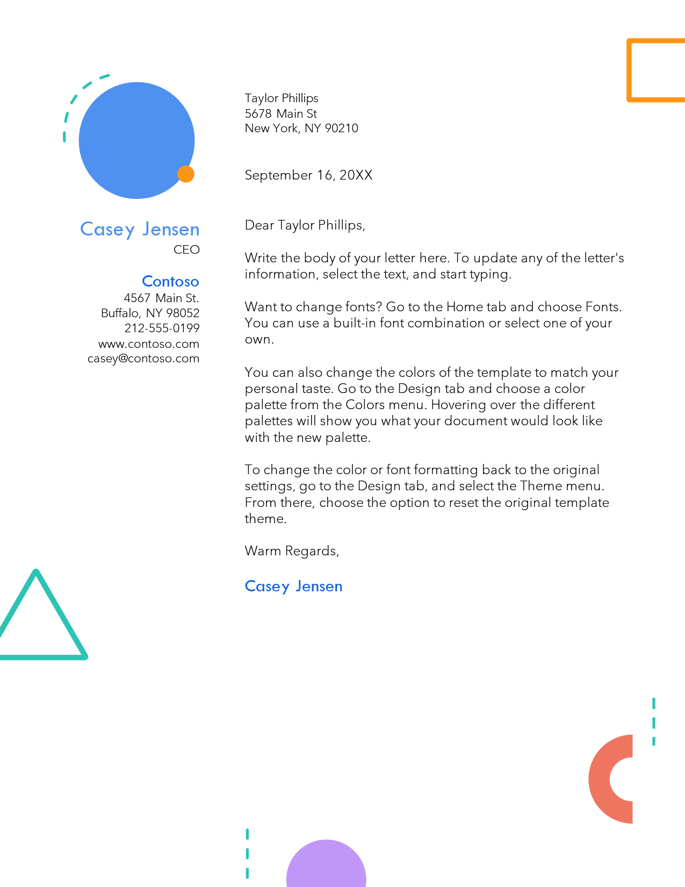 |  |  |
| **Page 2**&nbsp;&nbsp;&nbsp;&nbsp;&nbsp;&nbsp;&nbsp;&nbsp;&nbsp;&nbsp;&nbsp;&nbsp;&nbsp;&nbsp;&nbsp;&nbsp;&nbsp;&nbsp;&nbsp;&nbsp;&nbsp;&nbsp;&nbsp;&nbsp;&nbsp;&nbsp;&nbsp;&nbsp;&nbsp;&nbsp;&nbsp;&nbsp;&nbsp;&nbsp; | **Page 2. ErrorMetric: 0.0524 · SSIM: 0.8661** | **Page 2. ErrorMetric: 0.0558 · SSIM: 0.8523** |
|  |  |  |
| **Page 3**&nbsp;&nbsp;&nbsp;&nbsp;&nbsp;&nbsp;&nbsp;&nbsp;&nbsp;&nbsp;&nbsp;&nbsp;&nbsp;&nbsp;&nbsp;&nbsp;&nbsp;&nbsp;&nbsp;&nbsp;&nbsp;&nbsp;&nbsp;&nbsp;&nbsp;&nbsp;&nbsp;&nbsp;&nbsp;&nbsp;&nbsp;&nbsp;&nbsp;&nbsp; | **Page 3. ErrorMetric: 0.0505 · SSIM: 0.8721** | **Page 3. ErrorMetric: 0.0541 · SSIM: 0.8627** |
| 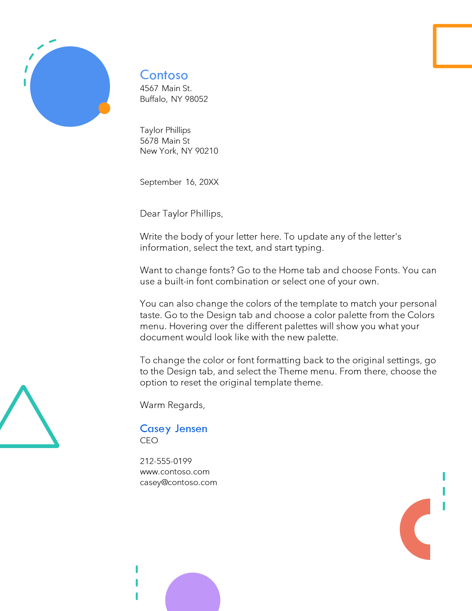 |  |  |

## letters/06

| Expected (Word) | Skia | ImageSharp |
| --- | --- | --- |
| **Page 1**&nbsp;&nbsp;&nbsp;&nbsp;&nbsp;&nbsp;&nbsp;&nbsp;&nbsp;&nbsp;&nbsp;&nbsp;&nbsp;&nbsp;&nbsp;&nbsp;&nbsp;&nbsp;&nbsp;&nbsp;&nbsp;&nbsp;&nbsp;&nbsp;&nbsp;&nbsp;&nbsp;&nbsp;&nbsp;&nbsp;&nbsp;&nbsp;&nbsp;&nbsp; | **Page 1. ErrorMetric: 0.0323 · SSIM: 0.9530** | **Page 1. ErrorMetric: 0.0404 · SSIM: 0.9241** |
|  |  |  |

## letters/07

| Expected (Word) | Skia | ImageSharp |
| --- | --- | --- |
| **Page 1**&nbsp;&nbsp;&nbsp;&nbsp;&nbsp;&nbsp;&nbsp;&nbsp;&nbsp;&nbsp;&nbsp;&nbsp;&nbsp;&nbsp;&nbsp;&nbsp;&nbsp;&nbsp;&nbsp;&nbsp;&nbsp;&nbsp;&nbsp;&nbsp;&nbsp;&nbsp;&nbsp;&nbsp;&nbsp;&nbsp;&nbsp;&nbsp;&nbsp;&nbsp; | **Page 1. ErrorMetric: 0.0551 · SSIM: 0.9106** | **Page 1. ErrorMetric: 0.0591 · SSIM: 0.8915** |
| 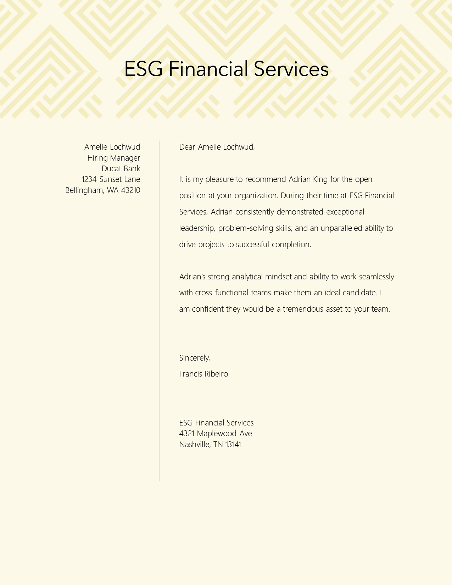 |  |  |

## letters/08

| Expected (Word) | Skia | ImageSharp |
| --- | --- | --- |
| **Page 1**&nbsp;&nbsp;&nbsp;&nbsp;&nbsp;&nbsp;&nbsp;&nbsp;&nbsp;&nbsp;&nbsp;&nbsp;&nbsp;&nbsp;&nbsp;&nbsp;&nbsp;&nbsp;&nbsp;&nbsp;&nbsp;&nbsp;&nbsp;&nbsp;&nbsp;&nbsp;&nbsp;&nbsp;&nbsp;&nbsp;&nbsp;&nbsp;&nbsp;&nbsp; | **Page 1. ErrorMetric: 0.0260 · SSIM: 0.9415** | **Page 1. ErrorMetric: 0.0288 · SSIM: 0.9304** |
|  |  |  |

## letters/09

| Expected (Word) | Skia | ImageSharp |
| --- | --- | --- |
| **Page 1**&nbsp;&nbsp;&nbsp;&nbsp;&nbsp;&nbsp;&nbsp;&nbsp;&nbsp;&nbsp;&nbsp;&nbsp;&nbsp;&nbsp;&nbsp;&nbsp;&nbsp;&nbsp;&nbsp;&nbsp;&nbsp;&nbsp;&nbsp;&nbsp;&nbsp;&nbsp;&nbsp;&nbsp;&nbsp;&nbsp;&nbsp;&nbsp;&nbsp;&nbsp; | **Page 1. ErrorMetric: 0.0477 · SSIM: 0.8885** | **Page 1. ErrorMetric: 0.0512 · SSIM: 0.8733** |
|  |  |  |

## letters/10

| Expected (Word) | Skia | ImageSharp |
| --- | --- | --- |
| **Page 1**&nbsp;&nbsp;&nbsp;&nbsp;&nbsp;&nbsp;&nbsp;&nbsp;&nbsp;&nbsp;&nbsp;&nbsp;&nbsp;&nbsp;&nbsp;&nbsp;&nbsp;&nbsp;&nbsp;&nbsp;&nbsp;&nbsp;&nbsp;&nbsp;&nbsp;&nbsp;&nbsp;&nbsp;&nbsp;&nbsp;&nbsp;&nbsp;&nbsp;&nbsp; | **Page 1. ErrorMetric: 0.0745 · SSIM: 0.8413** | **Page 1. ErrorMetric: 0.0728 · SSIM: 0.8560** |
|  |  |  |

## letters/11

| Expected (Word) | Skia | ImageSharp |
| --- | --- | --- |
| **Page 1**&nbsp;&nbsp;&nbsp;&nbsp;&nbsp;&nbsp;&nbsp;&nbsp;&nbsp;&nbsp;&nbsp;&nbsp;&nbsp;&nbsp;&nbsp;&nbsp;&nbsp;&nbsp;&nbsp;&nbsp;&nbsp;&nbsp;&nbsp;&nbsp;&nbsp;&nbsp;&nbsp;&nbsp;&nbsp;&nbsp;&nbsp;&nbsp;&nbsp;&nbsp; | **Page 1. ErrorMetric: 0.0452 · SSIM: 0.9304** | **Page 1. ErrorMetric: 0.0476 · SSIM: 0.9172** |
|  |  |  |

## letters/12

| Expected (Word) | Skia | ImageSharp |
| --- | --- | --- |
| **Page 1**&nbsp;&nbsp;&nbsp;&nbsp;&nbsp;&nbsp;&nbsp;&nbsp;&nbsp;&nbsp;&nbsp;&nbsp;&nbsp;&nbsp;&nbsp;&nbsp;&nbsp;&nbsp;&nbsp;&nbsp;&nbsp;&nbsp;&nbsp;&nbsp;&nbsp;&nbsp;&nbsp;&nbsp;&nbsp;&nbsp;&nbsp;&nbsp;&nbsp;&nbsp; | **Page 1. ErrorMetric: 0.0491 · SSIM: 0.9087** | **Page 1. ErrorMetric: 0.0530 · SSIM: 0.8943** |
| 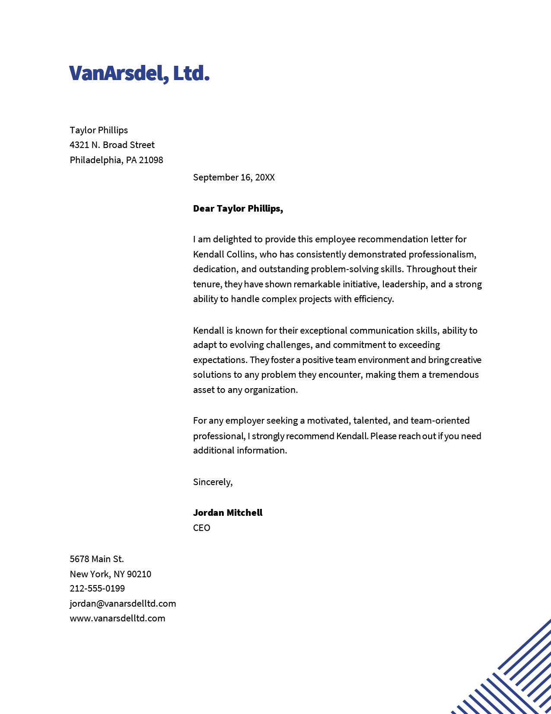 |  |  |

## letters/13

| Expected (Word) | Skia | ImageSharp |
| --- | --- | --- |
| **Page 1**&nbsp;&nbsp;&nbsp;&nbsp;&nbsp;&nbsp;&nbsp;&nbsp;&nbsp;&nbsp;&nbsp;&nbsp;&nbsp;&nbsp;&nbsp;&nbsp;&nbsp;&nbsp;&nbsp;&nbsp;&nbsp;&nbsp;&nbsp;&nbsp;&nbsp;&nbsp;&nbsp;&nbsp;&nbsp;&nbsp;&nbsp;&nbsp;&nbsp;&nbsp; | **Page 1. ErrorMetric: 0.0835 · SSIM: 0.8812** | **Page 1. ErrorMetric: 0.0894 · SSIM: 0.8641** |
|  |  |  |
| **Page 2**&nbsp;&nbsp;&nbsp;&nbsp;&nbsp;&nbsp;&nbsp;&nbsp;&nbsp;&nbsp;&nbsp;&nbsp;&nbsp;&nbsp;&nbsp;&nbsp;&nbsp;&nbsp;&nbsp;&nbsp;&nbsp;&nbsp;&nbsp;&nbsp;&nbsp;&nbsp;&nbsp;&nbsp;&nbsp;&nbsp;&nbsp;&nbsp;&nbsp;&nbsp; | **Page 2. ErrorMetric: 0.0895 · SSIM: 0.8380** | **Page 2. ErrorMetric: 0.0932 · SSIM: 0.8354** |
|  |  |  |
| **Page 3**&nbsp;&nbsp;&nbsp;&nbsp;&nbsp;&nbsp;&nbsp;&nbsp;&nbsp;&nbsp;&nbsp;&nbsp;&nbsp;&nbsp;&nbsp;&nbsp;&nbsp;&nbsp;&nbsp;&nbsp;&nbsp;&nbsp;&nbsp;&nbsp;&nbsp;&nbsp;&nbsp;&nbsp;&nbsp;&nbsp;&nbsp;&nbsp;&nbsp;&nbsp; | **Page 3. ErrorMetric: 0.1625 · SSIM: 0.7878** | **Page 3. ErrorMetric: 0.1437 · SSIM: 0.7972** |
|  |  |  |

## line_breaks

| Expected (Word) | Skia | ImageSharp |
| --- | --- | --- |
| **Page 1**&nbsp;&nbsp;&nbsp;&nbsp;&nbsp;&nbsp;&nbsp;&nbsp;&nbsp;&nbsp;&nbsp;&nbsp;&nbsp;&nbsp;&nbsp;&nbsp;&nbsp;&nbsp;&nbsp;&nbsp;&nbsp;&nbsp;&nbsp;&nbsp;&nbsp;&nbsp;&nbsp;&nbsp;&nbsp;&nbsp;&nbsp;&nbsp;&nbsp;&nbsp; | **Page 1. ErrorMetric: 0.0071 · SSIM: 0.9880** | **Page 1. ErrorMetric: 0.0076 · SSIM: 0.9858** |
|  |  |  |

## line_numbers_continuous

| Expected (Word) | Skia | ImageSharp |
| --- | --- | --- |
| **Page 1**&nbsp;&nbsp;&nbsp;&nbsp;&nbsp;&nbsp;&nbsp;&nbsp;&nbsp;&nbsp;&nbsp;&nbsp;&nbsp;&nbsp;&nbsp;&nbsp;&nbsp;&nbsp;&nbsp;&nbsp;&nbsp;&nbsp;&nbsp;&nbsp;&nbsp;&nbsp;&nbsp;&nbsp;&nbsp;&nbsp;&nbsp;&nbsp;&nbsp;&nbsp; | **Page 1. ErrorMetric: 0.0377 · SSIM: 0.9220** | **Page 1. ErrorMetric: 0.0403 · SSIM: 0.9169** |
|  |  |  |

## line_numbers_count_by_5

| Expected (Word) | Skia | ImageSharp |
| --- | --- | --- |
| **Page 1**&nbsp;&nbsp;&nbsp;&nbsp;&nbsp;&nbsp;&nbsp;&nbsp;&nbsp;&nbsp;&nbsp;&nbsp;&nbsp;&nbsp;&nbsp;&nbsp;&nbsp;&nbsp;&nbsp;&nbsp;&nbsp;&nbsp;&nbsp;&nbsp;&nbsp;&nbsp;&nbsp;&nbsp;&nbsp;&nbsp;&nbsp;&nbsp;&nbsp;&nbsp; | **Page 1. ErrorMetric: 0.0433 · SSIM: 0.9292** | **Page 1. ErrorMetric: 0.0533 · SSIM: 0.8941** |
|  |  |  |

## line_numbers_custom_distance

| Expected (Word) | Skia | ImageSharp |
| --- | --- | --- |
| **Page 1**&nbsp;&nbsp;&nbsp;&nbsp;&nbsp;&nbsp;&nbsp;&nbsp;&nbsp;&nbsp;&nbsp;&nbsp;&nbsp;&nbsp;&nbsp;&nbsp;&nbsp;&nbsp;&nbsp;&nbsp;&nbsp;&nbsp;&nbsp;&nbsp;&nbsp;&nbsp;&nbsp;&nbsp;&nbsp;&nbsp;&nbsp;&nbsp;&nbsp;&nbsp; | **Page 1. ErrorMetric: 0.0669 · SSIM: 0.8791** | **Page 1. ErrorMetric: 0.0782 · SSIM: 0.8406** |
|  |  |  |

## line_numbers_restart_page

| Expected (Word) | Skia | ImageSharp |
| --- | --- | --- |
| **Page 1**&nbsp;&nbsp;&nbsp;&nbsp;&nbsp;&nbsp;&nbsp;&nbsp;&nbsp;&nbsp;&nbsp;&nbsp;&nbsp;&nbsp;&nbsp;&nbsp;&nbsp;&nbsp;&nbsp;&nbsp;&nbsp;&nbsp;&nbsp;&nbsp;&nbsp;&nbsp;&nbsp;&nbsp;&nbsp;&nbsp;&nbsp;&nbsp;&nbsp;&nbsp; | **Page 1. ErrorMetric: 0.0411 · SSIM: 0.9314** | **Page 1. ErrorMetric: 0.0500 · SSIM: 0.8992** |
|  |  |  |

## line_numbers_restart_section

| Expected (Word) | Skia | ImageSharp |
| --- | --- | --- |
| **Page 1**&nbsp;&nbsp;&nbsp;&nbsp;&nbsp;&nbsp;&nbsp;&nbsp;&nbsp;&nbsp;&nbsp;&nbsp;&nbsp;&nbsp;&nbsp;&nbsp;&nbsp;&nbsp;&nbsp;&nbsp;&nbsp;&nbsp;&nbsp;&nbsp;&nbsp;&nbsp;&nbsp;&nbsp;&nbsp;&nbsp;&nbsp;&nbsp;&nbsp;&nbsp; | **Page 1. ErrorMetric: 0.0191 · SSIM: 0.9663** | **Page 1. ErrorMetric: 0.0215 · SSIM: 0.9557** |
|  |  |  |
| **Page 2**&nbsp;&nbsp;&nbsp;&nbsp;&nbsp;&nbsp;&nbsp;&nbsp;&nbsp;&nbsp;&nbsp;&nbsp;&nbsp;&nbsp;&nbsp;&nbsp;&nbsp;&nbsp;&nbsp;&nbsp;&nbsp;&nbsp;&nbsp;&nbsp;&nbsp;&nbsp;&nbsp;&nbsp;&nbsp;&nbsp;&nbsp;&nbsp;&nbsp;&nbsp; | **Page 2. ErrorMetric: 0.0187 · SSIM: 0.9671** | **Page 2. ErrorMetric: 0.0213 · SSIM: 0.9558** |
|  |  |  |

## line_numbers_suppressed

| Expected (Word) | Skia | ImageSharp |
| --- | --- | --- |
| **Page 1**&nbsp;&nbsp;&nbsp;&nbsp;&nbsp;&nbsp;&nbsp;&nbsp;&nbsp;&nbsp;&nbsp;&nbsp;&nbsp;&nbsp;&nbsp;&nbsp;&nbsp;&nbsp;&nbsp;&nbsp;&nbsp;&nbsp;&nbsp;&nbsp;&nbsp;&nbsp;&nbsp;&nbsp;&nbsp;&nbsp;&nbsp;&nbsp;&nbsp;&nbsp; | **Page 1. ErrorMetric: 0.0147 · SSIM: 0.9727** | **Page 1. ErrorMetric: 0.0157 · SSIM: 0.9688** |
|  |  |  |

## line_spacing

| Expected (Word) | Skia | ImageSharp |
| --- | --- | --- |
| **Page 1**&nbsp;&nbsp;&nbsp;&nbsp;&nbsp;&nbsp;&nbsp;&nbsp;&nbsp;&nbsp;&nbsp;&nbsp;&nbsp;&nbsp;&nbsp;&nbsp;&nbsp;&nbsp;&nbsp;&nbsp;&nbsp;&nbsp;&nbsp;&nbsp;&nbsp;&nbsp;&nbsp;&nbsp;&nbsp;&nbsp;&nbsp;&nbsp;&nbsp;&nbsp; | **Page 1. ErrorMetric: 0.0116 · SSIM: 0.9801** | **Page 1. ErrorMetric: 0.0119 · SSIM: 0.9761** |
|  |  |  |

## line_spacing_at_least

| Expected (Word) | Skia | ImageSharp |
| --- | --- | --- |
| **Page 1**&nbsp;&nbsp;&nbsp;&nbsp;&nbsp;&nbsp;&nbsp;&nbsp;&nbsp;&nbsp;&nbsp;&nbsp;&nbsp;&nbsp;&nbsp;&nbsp;&nbsp;&nbsp;&nbsp;&nbsp;&nbsp;&nbsp;&nbsp;&nbsp;&nbsp;&nbsp;&nbsp;&nbsp;&nbsp;&nbsp;&nbsp;&nbsp;&nbsp;&nbsp; | **Page 1. ErrorMetric: 0.0178 · SSIM: 0.9584** | **Page 1. ErrorMetric: 0.0187 · SSIM: 0.9542** |
|  |  |  |

## line_spacing_exactly

| Expected (Word) | Skia | ImageSharp |
| --- | --- | --- |
| **Page 1**&nbsp;&nbsp;&nbsp;&nbsp;&nbsp;&nbsp;&nbsp;&nbsp;&nbsp;&nbsp;&nbsp;&nbsp;&nbsp;&nbsp;&nbsp;&nbsp;&nbsp;&nbsp;&nbsp;&nbsp;&nbsp;&nbsp;&nbsp;&nbsp;&nbsp;&nbsp;&nbsp;&nbsp;&nbsp;&nbsp;&nbsp;&nbsp;&nbsp;&nbsp; | **Page 1. ErrorMetric: 0.0178 · SSIM: 0.9560** | **Page 1. ErrorMetric: 0.0182 · SSIM: 0.9565** |
|  |  |  |

## long_paragraph

| Expected (Word) | Skia | ImageSharp |
| --- | --- | --- |
| **Page 1**&nbsp;&nbsp;&nbsp;&nbsp;&nbsp;&nbsp;&nbsp;&nbsp;&nbsp;&nbsp;&nbsp;&nbsp;&nbsp;&nbsp;&nbsp;&nbsp;&nbsp;&nbsp;&nbsp;&nbsp;&nbsp;&nbsp;&nbsp;&nbsp;&nbsp;&nbsp;&nbsp;&nbsp;&nbsp;&nbsp;&nbsp;&nbsp;&nbsp;&nbsp; | **Page 1. ErrorMetric: 0.1186 · SSIM: 0.7725** | **Page 1. ErrorMetric: 0.1251 · SSIM: 0.7522** |
|  |  |  |

## menus/01

| Expected (Word) | Skia | ImageSharp |
| --- | --- | --- |
| **Page 1**&nbsp;&nbsp;&nbsp;&nbsp;&nbsp;&nbsp;&nbsp;&nbsp;&nbsp;&nbsp;&nbsp;&nbsp;&nbsp;&nbsp;&nbsp;&nbsp;&nbsp;&nbsp;&nbsp;&nbsp;&nbsp;&nbsp;&nbsp;&nbsp;&nbsp;&nbsp;&nbsp;&nbsp;&nbsp;&nbsp;&nbsp;&nbsp;&nbsp;&nbsp; | **Page 1. ErrorMetric: 0.2354 · SSIM: 0.9018** | **Page 1. ErrorMetric: 0.2379 · SSIM: 0.9044** |
|  |  |  |
| **Page 2**&nbsp;&nbsp;&nbsp;&nbsp;&nbsp;&nbsp;&nbsp;&nbsp;&nbsp;&nbsp;&nbsp;&nbsp;&nbsp;&nbsp;&nbsp;&nbsp;&nbsp;&nbsp;&nbsp;&nbsp;&nbsp;&nbsp;&nbsp;&nbsp;&nbsp;&nbsp;&nbsp;&nbsp;&nbsp;&nbsp;&nbsp;&nbsp;&nbsp;&nbsp; | **Page 2. ErrorMetric: 0.2560 · SSIM: 0.9166** | **Page 2. ErrorMetric: 0.2599 · SSIM: 0.9011** |
|  |  |  |
| **Page 3**&nbsp;&nbsp;&nbsp;&nbsp;&nbsp;&nbsp;&nbsp;&nbsp;&nbsp;&nbsp;&nbsp;&nbsp;&nbsp;&nbsp;&nbsp;&nbsp;&nbsp;&nbsp;&nbsp;&nbsp;&nbsp;&nbsp;&nbsp;&nbsp;&nbsp;&nbsp;&nbsp;&nbsp;&nbsp;&nbsp;&nbsp;&nbsp;&nbsp;&nbsp; | **Page 3. ErrorMetric: 0.3166 · SSIM: 0.7438** | **Page 3. ErrorMetric: 0.3162 · SSIM: 0.7465** |
|  |  |  |

## menus/02

| Expected (Word) | Skia | ImageSharp |
| --- | --- | --- |
| **Page 1**&nbsp;&nbsp;&nbsp;&nbsp;&nbsp;&nbsp;&nbsp;&nbsp;&nbsp;&nbsp;&nbsp;&nbsp;&nbsp;&nbsp;&nbsp;&nbsp;&nbsp;&nbsp;&nbsp;&nbsp;&nbsp;&nbsp;&nbsp;&nbsp;&nbsp;&nbsp;&nbsp;&nbsp;&nbsp;&nbsp;&nbsp;&nbsp;&nbsp;&nbsp; | **Page 1. ErrorMetric: 0.0580 · SSIM: 0.9715** | **Page 1. ErrorMetric: 0.0653 · SSIM: 0.9486** |
|  |  |  |

## menus/03

| Expected (Word) | Skia | ImageSharp |
| --- | --- | --- |
| **Page 1**&nbsp;&nbsp;&nbsp;&nbsp;&nbsp;&nbsp;&nbsp;&nbsp;&nbsp;&nbsp;&nbsp;&nbsp;&nbsp;&nbsp;&nbsp;&nbsp;&nbsp;&nbsp;&nbsp;&nbsp;&nbsp;&nbsp;&nbsp;&nbsp;&nbsp;&nbsp;&nbsp;&nbsp;&nbsp;&nbsp;&nbsp;&nbsp;&nbsp;&nbsp; | **Page 1. ErrorMetric: 0.9918 · SSIM: 0.9107** | **Page 1. ErrorMetric: 0.2394 · SSIM: 0.8931** |
|  |  |  |

## menus/04

| Expected (Word) | Skia | ImageSharp |
| --- | --- | --- |
| **Page 1**&nbsp;&nbsp;&nbsp;&nbsp;&nbsp;&nbsp;&nbsp;&nbsp;&nbsp;&nbsp;&nbsp;&nbsp;&nbsp;&nbsp;&nbsp;&nbsp;&nbsp;&nbsp;&nbsp;&nbsp;&nbsp;&nbsp;&nbsp;&nbsp;&nbsp;&nbsp;&nbsp;&nbsp;&nbsp;&nbsp;&nbsp;&nbsp;&nbsp;&nbsp; | **Page 1. ErrorMetric: 0.0804 · SSIM: 0.8778** | **Page 1. ErrorMetric: 0.0861 · SSIM: 0.8681** |
|  |  |  |

## menus/05

| Expected (Word) | Skia | ImageSharp |
| --- | --- | --- |
| **Page 1**&nbsp;&nbsp;&nbsp;&nbsp;&nbsp;&nbsp;&nbsp;&nbsp;&nbsp;&nbsp;&nbsp;&nbsp;&nbsp;&nbsp;&nbsp;&nbsp;&nbsp;&nbsp;&nbsp;&nbsp;&nbsp;&nbsp;&nbsp;&nbsp;&nbsp;&nbsp;&nbsp;&nbsp;&nbsp;&nbsp;&nbsp;&nbsp;&nbsp;&nbsp; | **Page 1. ErrorMetric: 0.0586 · SSIM: 0.8978** | **Page 1. ErrorMetric: 0.0664 · SSIM: 0.8732** |
|  |  |  |
| **Page 2**&nbsp;&nbsp;&nbsp;&nbsp;&nbsp;&nbsp;&nbsp;&nbsp;&nbsp;&nbsp;&nbsp;&nbsp;&nbsp;&nbsp;&nbsp;&nbsp;&nbsp;&nbsp;&nbsp;&nbsp;&nbsp;&nbsp;&nbsp;&nbsp;&nbsp;&nbsp;&nbsp;&nbsp;&nbsp;&nbsp;&nbsp;&nbsp;&nbsp;&nbsp; | **Page 2. ErrorMetric: 0.0499 · SSIM: 0.8975** | **Page 2. ErrorMetric: 0.0577 · SSIM: 0.8624** |
| 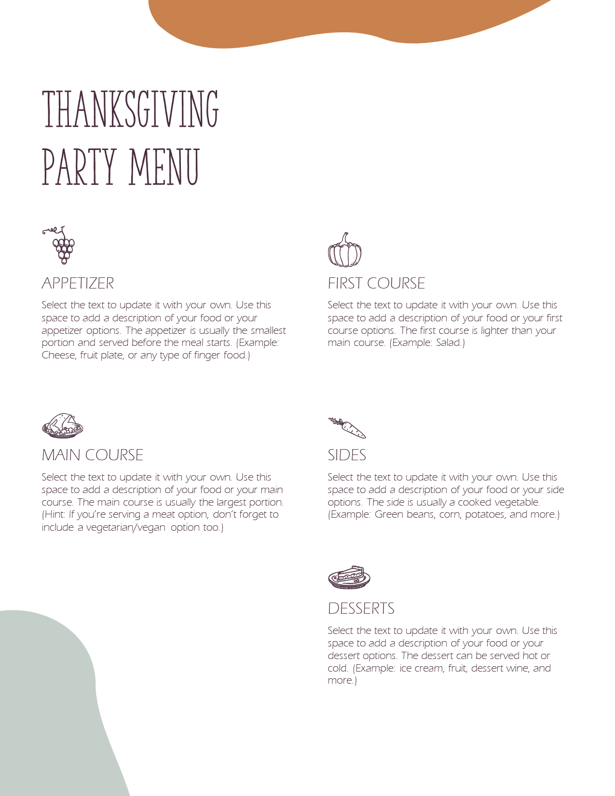 |  |  |
| **Page 3**&nbsp;&nbsp;&nbsp;&nbsp;&nbsp;&nbsp;&nbsp;&nbsp;&nbsp;&nbsp;&nbsp;&nbsp;&nbsp;&nbsp;&nbsp;&nbsp;&nbsp;&nbsp;&nbsp;&nbsp;&nbsp;&nbsp;&nbsp;&nbsp;&nbsp;&nbsp;&nbsp;&nbsp;&nbsp;&nbsp;&nbsp;&nbsp;&nbsp;&nbsp; | **Page 3. ErrorMetric: 0.1331 · SSIM: 0.8658** | **Page 3. ErrorMetric: 0.1454 · SSIM: 0.8492** |
| 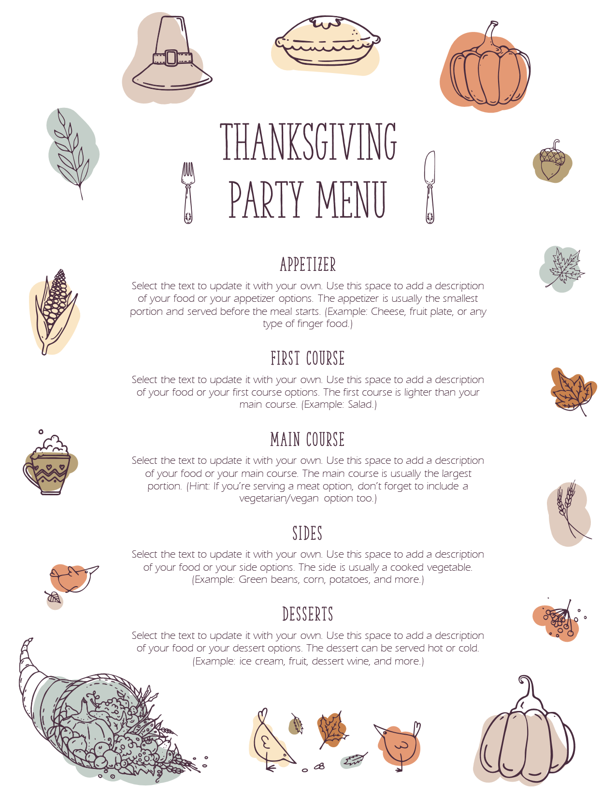 |  |  |

## menus/06

| Expected (Word) | Skia | ImageSharp |
| --- | --- | --- |
| **Page 1**&nbsp;&nbsp;&nbsp;&nbsp;&nbsp;&nbsp;&nbsp;&nbsp;&nbsp;&nbsp;&nbsp;&nbsp;&nbsp;&nbsp;&nbsp;&nbsp;&nbsp;&nbsp;&nbsp;&nbsp;&nbsp;&nbsp;&nbsp;&nbsp;&nbsp;&nbsp;&nbsp;&nbsp;&nbsp;&nbsp;&nbsp;&nbsp;&nbsp;&nbsp; | **Page 1. ErrorMetric: 0.0772 · SSIM: 0.8217** | **Page 1. ErrorMetric: 0.0850 · SSIM: 0.8080** |
|  |  |  |
| **Page 2**&nbsp;&nbsp;&nbsp;&nbsp;&nbsp;&nbsp;&nbsp;&nbsp;&nbsp;&nbsp;&nbsp;&nbsp;&nbsp;&nbsp;&nbsp;&nbsp;&nbsp;&nbsp;&nbsp;&nbsp;&nbsp;&nbsp;&nbsp;&nbsp;&nbsp;&nbsp;&nbsp;&nbsp;&nbsp;&nbsp;&nbsp;&nbsp;&nbsp;&nbsp; | **Page 2. ErrorMetric: 0.0803 · SSIM: 0.8216** | **Page 2. ErrorMetric: 0.0890 · SSIM: 0.8055** |
| 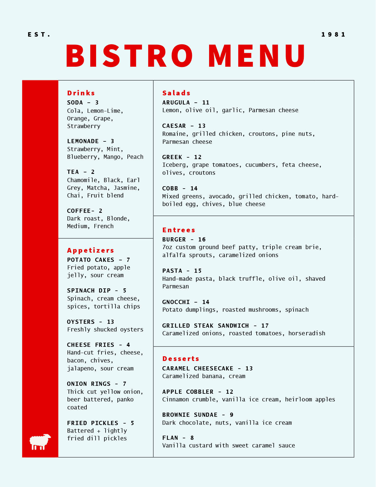 |  |  |
| **Page 3**&nbsp;&nbsp;&nbsp;&nbsp;&nbsp;&nbsp;&nbsp;&nbsp;&nbsp;&nbsp;&nbsp;&nbsp;&nbsp;&nbsp;&nbsp;&nbsp;&nbsp;&nbsp;&nbsp;&nbsp;&nbsp;&nbsp;&nbsp;&nbsp;&nbsp;&nbsp;&nbsp;&nbsp;&nbsp;&nbsp;&nbsp;&nbsp;&nbsp;&nbsp; | **Page 3. ErrorMetric: 0.1100 · SSIM: 0.7242** | **Page 3. ErrorMetric: 0.1182 · SSIM: 0.7120** |
| 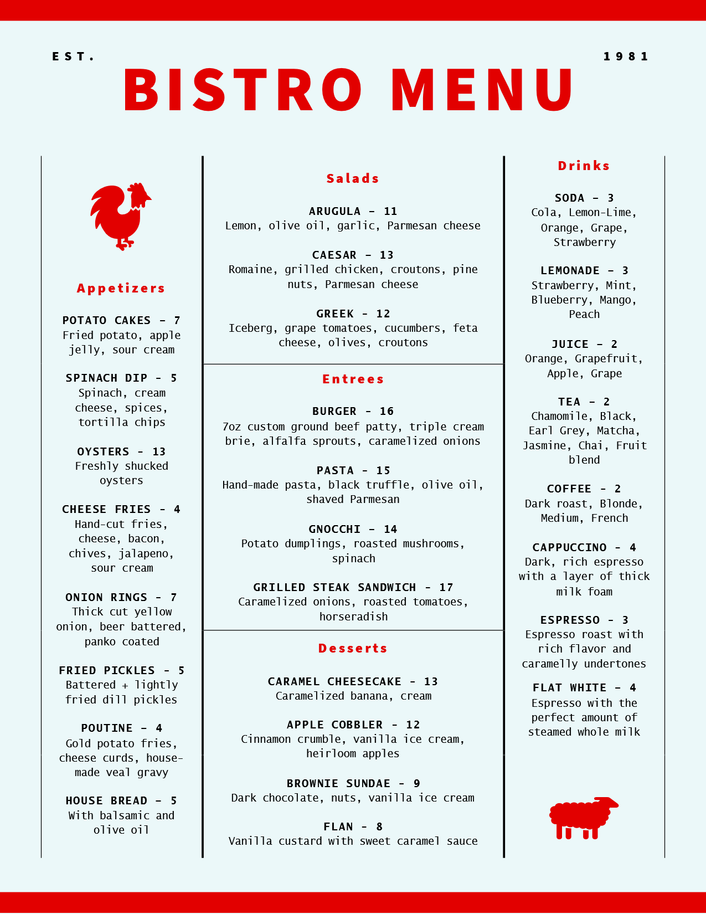 |  |  |

## menus/07

| Expected (Word) | Skia | ImageSharp |
| --- | --- | --- |
| **Page 1**&nbsp;&nbsp;&nbsp;&nbsp;&nbsp;&nbsp;&nbsp;&nbsp;&nbsp;&nbsp;&nbsp;&nbsp;&nbsp;&nbsp;&nbsp;&nbsp;&nbsp;&nbsp;&nbsp;&nbsp;&nbsp;&nbsp;&nbsp;&nbsp;&nbsp;&nbsp;&nbsp;&nbsp;&nbsp;&nbsp;&nbsp;&nbsp;&nbsp;&nbsp; | **Page 1. ErrorMetric: 0.1790 · SSIM: 0.8034** | **Page 1. ErrorMetric: 0.2046 · SSIM: 0.7892** |
| 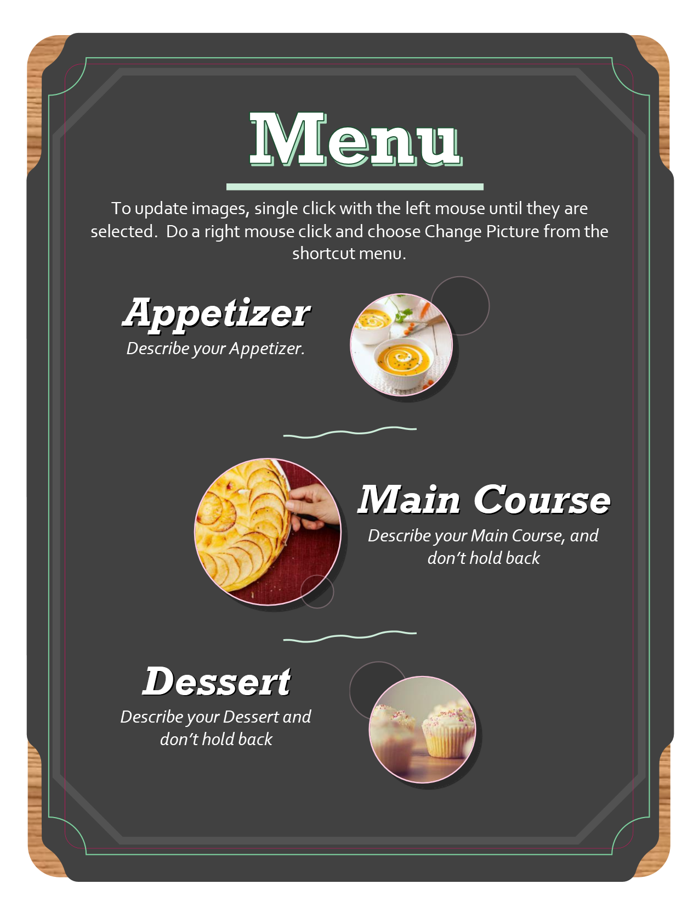 |  |  |

## menus/08

| Expected (Word) | Skia | ImageSharp |
| --- | --- | --- |
| **Page 1**&nbsp;&nbsp;&nbsp;&nbsp;&nbsp;&nbsp;&nbsp;&nbsp;&nbsp;&nbsp;&nbsp;&nbsp;&nbsp;&nbsp;&nbsp;&nbsp;&nbsp;&nbsp;&nbsp;&nbsp;&nbsp;&nbsp;&nbsp;&nbsp;&nbsp;&nbsp;&nbsp;&nbsp;&nbsp;&nbsp;&nbsp;&nbsp;&nbsp;&nbsp; | **Page 1. ErrorMetric: 0.2304 · SSIM: 0.8966** | **Page 1. ErrorMetric: 0.9864 · SSIM: 0.8815** |
|  |  |  |

## menus/09

| Expected (Word) | Skia | ImageSharp |
| --- | --- | --- |
| **Page 1**&nbsp;&nbsp;&nbsp;&nbsp;&nbsp;&nbsp;&nbsp;&nbsp;&nbsp;&nbsp;&nbsp;&nbsp;&nbsp;&nbsp;&nbsp;&nbsp;&nbsp;&nbsp;&nbsp;&nbsp;&nbsp;&nbsp;&nbsp;&nbsp;&nbsp;&nbsp;&nbsp;&nbsp;&nbsp;&nbsp;&nbsp;&nbsp;&nbsp;&nbsp; | **Page 1. ErrorMetric: 0.1456 · SSIM: 0.7998** | **Page 1. ErrorMetric: 0.1625 · SSIM: 0.7911** |
|  |  |  |

## mixed_breaks

| Expected (Word) | Skia | ImageSharp |
| --- | --- | --- |
| **Page 1**&nbsp;&nbsp;&nbsp;&nbsp;&nbsp;&nbsp;&nbsp;&nbsp;&nbsp;&nbsp;&nbsp;&nbsp;&nbsp;&nbsp;&nbsp;&nbsp;&nbsp;&nbsp;&nbsp;&nbsp;&nbsp;&nbsp;&nbsp;&nbsp;&nbsp;&nbsp;&nbsp;&nbsp;&nbsp;&nbsp;&nbsp;&nbsp;&nbsp;&nbsp; | **Page 1. ErrorMetric: 0.0027 · SSIM: 0.9953** | **Page 1. ErrorMetric: 0.0027 · SSIM: 0.9950** |
|  |  |  |
| **Page 2**&nbsp;&nbsp;&nbsp;&nbsp;&nbsp;&nbsp;&nbsp;&nbsp;&nbsp;&nbsp;&nbsp;&nbsp;&nbsp;&nbsp;&nbsp;&nbsp;&nbsp;&nbsp;&nbsp;&nbsp;&nbsp;&nbsp;&nbsp;&nbsp;&nbsp;&nbsp;&nbsp;&nbsp;&nbsp;&nbsp;&nbsp;&nbsp;&nbsp;&nbsp; | **Page 2. ErrorMetric: 0.0007 · SSIM: 0.9989** | **Page 2. ErrorMetric: 0.0008 · SSIM: 0.9984** |
|  |  |  |
| **Page 3**&nbsp;&nbsp;&nbsp;&nbsp;&nbsp;&nbsp;&nbsp;&nbsp;&nbsp;&nbsp;&nbsp;&nbsp;&nbsp;&nbsp;&nbsp;&nbsp;&nbsp;&nbsp;&nbsp;&nbsp;&nbsp;&nbsp;&nbsp;&nbsp;&nbsp;&nbsp;&nbsp;&nbsp;&nbsp;&nbsp;&nbsp;&nbsp;&nbsp;&nbsp; | **Page 3. ErrorMetric: 0.0019 · SSIM: 0.9941** | **Page 3. ErrorMetric: 0.0020 · SSIM: 0.9940** |
|  |  |  |
| **Page 4**&nbsp;&nbsp;&nbsp;&nbsp;&nbsp;&nbsp;&nbsp;&nbsp;&nbsp;&nbsp;&nbsp;&nbsp;&nbsp;&nbsp;&nbsp;&nbsp;&nbsp;&nbsp;&nbsp;&nbsp;&nbsp;&nbsp;&nbsp;&nbsp;&nbsp;&nbsp;&nbsp;&nbsp;&nbsp;&nbsp;&nbsp;&nbsp;&nbsp;&nbsp; | **Page 4. ErrorMetric: 0.0010 · SSIM: 0.9984** | **Page 4. ErrorMetric: 0.0010 · SSIM: 0.9979** |
|  |  |  |

## mixed_formatting

| Expected (Word) | Skia | ImageSharp |
| --- | --- | --- |
| **Page 1**&nbsp;&nbsp;&nbsp;&nbsp;&nbsp;&nbsp;&nbsp;&nbsp;&nbsp;&nbsp;&nbsp;&nbsp;&nbsp;&nbsp;&nbsp;&nbsp;&nbsp;&nbsp;&nbsp;&nbsp;&nbsp;&nbsp;&nbsp;&nbsp;&nbsp;&nbsp;&nbsp;&nbsp;&nbsp;&nbsp;&nbsp;&nbsp;&nbsp;&nbsp; | **Page 1. ErrorMetric: 0.0035 · SSIM: 0.9937** | **Page 1. ErrorMetric: 0.0036 · SSIM: 0.9936** |
|  |  |  |

## multiple_images

| Expected (Word) | Skia | ImageSharp |
| --- | --- | --- |
| **Page 1**&nbsp;&nbsp;&nbsp;&nbsp;&nbsp;&nbsp;&nbsp;&nbsp;&nbsp;&nbsp;&nbsp;&nbsp;&nbsp;&nbsp;&nbsp;&nbsp;&nbsp;&nbsp;&nbsp;&nbsp;&nbsp;&nbsp;&nbsp;&nbsp;&nbsp;&nbsp;&nbsp;&nbsp;&nbsp;&nbsp;&nbsp;&nbsp;&nbsp;&nbsp; | **Page 1. ErrorMetric: 0.0389 · SSIM: 0.9895** | **Page 1. ErrorMetric: 0.0395 · SSIM: 0.9892** |
|  |  |  |

## multiple_pages

| Expected (Word) | Skia | ImageSharp |
| --- | --- | --- |
| **Page 1**&nbsp;&nbsp;&nbsp;&nbsp;&nbsp;&nbsp;&nbsp;&nbsp;&nbsp;&nbsp;&nbsp;&nbsp;&nbsp;&nbsp;&nbsp;&nbsp;&nbsp;&nbsp;&nbsp;&nbsp;&nbsp;&nbsp;&nbsp;&nbsp;&nbsp;&nbsp;&nbsp;&nbsp;&nbsp;&nbsp;&nbsp;&nbsp;&nbsp;&nbsp; | **Page 1. ErrorMetric: 0.1147 · SSIM: 0.7856** | **Page 1. ErrorMetric: 0.1246 · SSIM: 0.7446** |
| 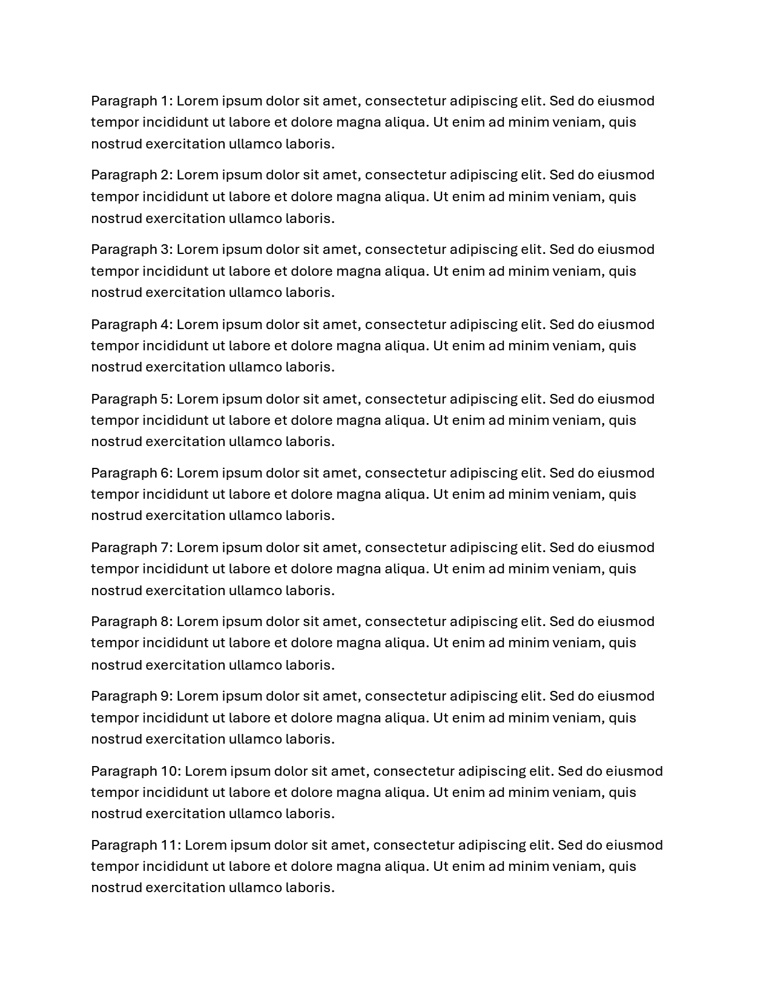 |  |  |
| **Page 2**&nbsp;&nbsp;&nbsp;&nbsp;&nbsp;&nbsp;&nbsp;&nbsp;&nbsp;&nbsp;&nbsp;&nbsp;&nbsp;&nbsp;&nbsp;&nbsp;&nbsp;&nbsp;&nbsp;&nbsp;&nbsp;&nbsp;&nbsp;&nbsp;&nbsp;&nbsp;&nbsp;&nbsp;&nbsp;&nbsp;&nbsp;&nbsp;&nbsp;&nbsp; | **Page 2. ErrorMetric: 0.1157 · SSIM: 0.7824** | **Page 2. ErrorMetric: 0.1253 · SSIM: 0.7422** |
|  |  |  |
| **Page 3**&nbsp;&nbsp;&nbsp;&nbsp;&nbsp;&nbsp;&nbsp;&nbsp;&nbsp;&nbsp;&nbsp;&nbsp;&nbsp;&nbsp;&nbsp;&nbsp;&nbsp;&nbsp;&nbsp;&nbsp;&nbsp;&nbsp;&nbsp;&nbsp;&nbsp;&nbsp;&nbsp;&nbsp;&nbsp;&nbsp;&nbsp;&nbsp;&nbsp;&nbsp; | **Page 3. ErrorMetric: 0.1160 · SSIM: 0.7824** | **Page 3. ErrorMetric: 0.1256 · SSIM: 0.7420** |
| 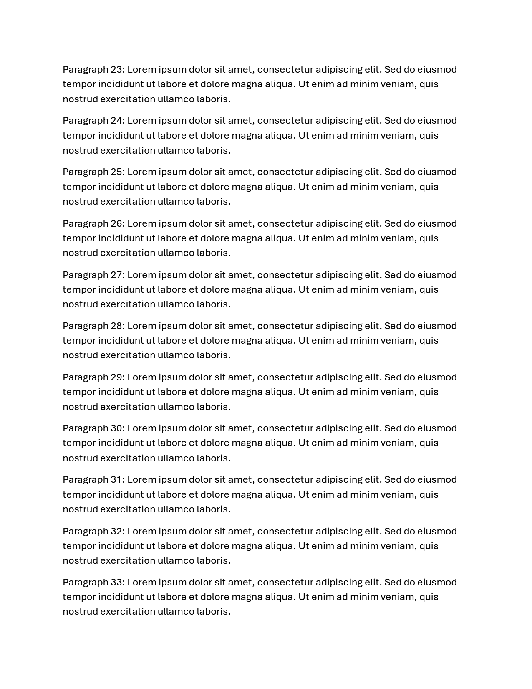 |  |  |
| **Page 4**&nbsp;&nbsp;&nbsp;&nbsp;&nbsp;&nbsp;&nbsp;&nbsp;&nbsp;&nbsp;&nbsp;&nbsp;&nbsp;&nbsp;&nbsp;&nbsp;&nbsp;&nbsp;&nbsp;&nbsp;&nbsp;&nbsp;&nbsp;&nbsp;&nbsp;&nbsp;&nbsp;&nbsp;&nbsp;&nbsp;&nbsp;&nbsp;&nbsp;&nbsp; | **Page 4. ErrorMetric: 0.1160 · SSIM: 0.7824** | **Page 4. ErrorMetric: 0.1255 · SSIM: 0.7422** |
|  |  |  |
| **Page 5**&nbsp;&nbsp;&nbsp;&nbsp;&nbsp;&nbsp;&nbsp;&nbsp;&nbsp;&nbsp;&nbsp;&nbsp;&nbsp;&nbsp;&nbsp;&nbsp;&nbsp;&nbsp;&nbsp;&nbsp;&nbsp;&nbsp;&nbsp;&nbsp;&nbsp;&nbsp;&nbsp;&nbsp;&nbsp;&nbsp;&nbsp;&nbsp;&nbsp;&nbsp; | **Page 5. ErrorMetric: 0.0638 · SSIM: 0.8782** | **Page 5. ErrorMetric: 0.0680 · SSIM: 0.8626** |
|  |  |  |

## multiple_paragraphs

| Expected (Word) | Skia | ImageSharp |
| --- | --- | --- |
| **Page 1**&nbsp;&nbsp;&nbsp;&nbsp;&nbsp;&nbsp;&nbsp;&nbsp;&nbsp;&nbsp;&nbsp;&nbsp;&nbsp;&nbsp;&nbsp;&nbsp;&nbsp;&nbsp;&nbsp;&nbsp;&nbsp;&nbsp;&nbsp;&nbsp;&nbsp;&nbsp;&nbsp;&nbsp;&nbsp;&nbsp;&nbsp;&nbsp;&nbsp;&nbsp; | **Page 1. ErrorMetric: 0.0078 · SSIM: 0.9871** | **Page 1. ErrorMetric: 0.0089 · SSIM: 0.9829** |
|  |  |  |

## nested_list

| Expected (Word) | Skia | ImageSharp |
| --- | --- | --- |
| **Page 1**&nbsp;&nbsp;&nbsp;&nbsp;&nbsp;&nbsp;&nbsp;&nbsp;&nbsp;&nbsp;&nbsp;&nbsp;&nbsp;&nbsp;&nbsp;&nbsp;&nbsp;&nbsp;&nbsp;&nbsp;&nbsp;&nbsp;&nbsp;&nbsp;&nbsp;&nbsp;&nbsp;&nbsp;&nbsp;&nbsp;&nbsp;&nbsp;&nbsp;&nbsp; | **Page 1. ErrorMetric: 0.0041 · SSIM: 0.9937** | **Page 1. ErrorMetric: 0.0048 · SSIM: 0.9915** |
|  |  |  |

## newsletters/01

| Expected (Word) | Skia | ImageSharp |
| --- | --- | --- |
| **Page 1**&nbsp;&nbsp;&nbsp;&nbsp;&nbsp;&nbsp;&nbsp;&nbsp;&nbsp;&nbsp;&nbsp;&nbsp;&nbsp;&nbsp;&nbsp;&nbsp;&nbsp;&nbsp;&nbsp;&nbsp;&nbsp;&nbsp;&nbsp;&nbsp;&nbsp;&nbsp;&nbsp;&nbsp;&nbsp;&nbsp;&nbsp;&nbsp;&nbsp;&nbsp; | **Page 1. ErrorMetric: 0.2547 · SSIM: 0.7313** | **Page 1. ErrorMetric: 0.2621 · SSIM: 0.7227** |
|  |  |  |
| **Page 2**&nbsp;&nbsp;&nbsp;&nbsp;&nbsp;&nbsp;&nbsp;&nbsp;&nbsp;&nbsp;&nbsp;&nbsp;&nbsp;&nbsp;&nbsp;&nbsp;&nbsp;&nbsp;&nbsp;&nbsp;&nbsp;&nbsp;&nbsp;&nbsp;&nbsp;&nbsp;&nbsp;&nbsp;&nbsp;&nbsp;&nbsp;&nbsp;&nbsp;&nbsp; | **Page 2. ErrorMetric: 0.2340 · SSIM: 0.7629** | **Page 2. ErrorMetric: 0.2416 · SSIM: 0.7461** |
|  |  |  |
| **Page 3**&nbsp;&nbsp;&nbsp;&nbsp;&nbsp;&nbsp;&nbsp;&nbsp;&nbsp;&nbsp;&nbsp;&nbsp;&nbsp;&nbsp;&nbsp;&nbsp;&nbsp;&nbsp;&nbsp;&nbsp;&nbsp;&nbsp;&nbsp;&nbsp;&nbsp;&nbsp;&nbsp;&nbsp;&nbsp;&nbsp;&nbsp;&nbsp;&nbsp;&nbsp; | **Page 3. ErrorMetric: 0.5365 · SSIM: 0.7061** | **Page 3. ErrorMetric: 0.5407 · SSIM: 0.7038** |
|  |  |  |
| **Page 4**&nbsp;&nbsp;&nbsp;&nbsp;&nbsp;&nbsp;&nbsp;&nbsp;&nbsp;&nbsp;&nbsp;&nbsp;&nbsp;&nbsp;&nbsp;&nbsp;&nbsp;&nbsp;&nbsp;&nbsp;&nbsp;&nbsp;&nbsp;&nbsp;&nbsp;&nbsp;&nbsp;&nbsp;&nbsp;&nbsp;&nbsp;&nbsp;&nbsp;&nbsp; | **Page 4. ErrorMetric: 0.2636 · SSIM: 0.6898** | **Page 4. ErrorMetric: 0.2657 · SSIM: 0.6899** |
|  |  |  |

## newsletters/02

| Expected (Word) | Skia | ImageSharp |
| --- | --- | --- |
| **Page 1**&nbsp;&nbsp;&nbsp;&nbsp;&nbsp;&nbsp;&nbsp;&nbsp;&nbsp;&nbsp;&nbsp;&nbsp;&nbsp;&nbsp;&nbsp;&nbsp;&nbsp;&nbsp;&nbsp;&nbsp;&nbsp;&nbsp;&nbsp;&nbsp;&nbsp;&nbsp;&nbsp;&nbsp;&nbsp;&nbsp;&nbsp;&nbsp;&nbsp;&nbsp; | **Page 1. ErrorMetric: 0.3319 · SSIM: 0.7886** | **Page 1. ErrorMetric: 0.3385 · SSIM: 0.8135** |
| 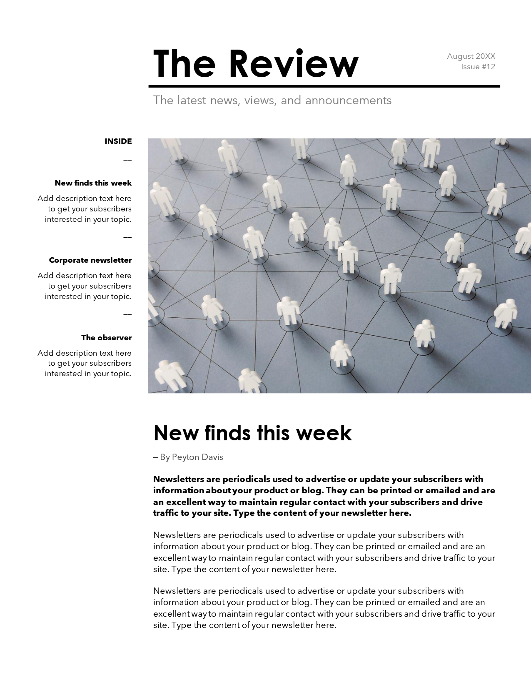 |  |  |
| **Page 2**&nbsp;&nbsp;&nbsp;&nbsp;&nbsp;&nbsp;&nbsp;&nbsp;&nbsp;&nbsp;&nbsp;&nbsp;&nbsp;&nbsp;&nbsp;&nbsp;&nbsp;&nbsp;&nbsp;&nbsp;&nbsp;&nbsp;&nbsp;&nbsp;&nbsp;&nbsp;&nbsp;&nbsp;&nbsp;&nbsp;&nbsp;&nbsp;&nbsp;&nbsp; | **Page 2. ErrorMetric: 0.2227 · SSIM: 0.7554** | **Page 2. ErrorMetric: 0.2648 · SSIM: 0.7271** |
|  |  |  |

## newsletters/03

| Expected (Word) | Skia | ImageSharp |
| --- | --- | --- |
| **Page 1**&nbsp;&nbsp;&nbsp;&nbsp;&nbsp;&nbsp;&nbsp;&nbsp;&nbsp;&nbsp;&nbsp;&nbsp;&nbsp;&nbsp;&nbsp;&nbsp;&nbsp;&nbsp;&nbsp;&nbsp;&nbsp;&nbsp;&nbsp;&nbsp;&nbsp;&nbsp;&nbsp;&nbsp;&nbsp;&nbsp;&nbsp;&nbsp;&nbsp;&nbsp; | **Page 1. ErrorMetric: 0.4311 · SSIM: 0.6105** | **Page 1. ErrorMetric: 0.4413 · SSIM: 0.5882** |
|  |  |  |
| **Page 2**&nbsp;&nbsp;&nbsp;&nbsp;&nbsp;&nbsp;&nbsp;&nbsp;&nbsp;&nbsp;&nbsp;&nbsp;&nbsp;&nbsp;&nbsp;&nbsp;&nbsp;&nbsp;&nbsp;&nbsp;&nbsp;&nbsp;&nbsp;&nbsp;&nbsp;&nbsp;&nbsp;&nbsp;&nbsp;&nbsp;&nbsp;&nbsp;&nbsp;&nbsp; | **Page 2. ErrorMetric: 0.3516 · SSIM: 0.6325** | **Page 2. ErrorMetric: 0.3558 · SSIM: 0.6253** |
|  |  |  |
| **Page 3**&nbsp;&nbsp;&nbsp;&nbsp;&nbsp;&nbsp;&nbsp;&nbsp;&nbsp;&nbsp;&nbsp;&nbsp;&nbsp;&nbsp;&nbsp;&nbsp;&nbsp;&nbsp;&nbsp;&nbsp;&nbsp;&nbsp;&nbsp;&nbsp;&nbsp;&nbsp;&nbsp;&nbsp;&nbsp;&nbsp;&nbsp;&nbsp;&nbsp;&nbsp; | **Page 3. ErrorMetric: 0.3334 · SSIM: 0.7142** | **Page 3. ErrorMetric: 0.3452 · SSIM: 0.6833** |
|  |  |  |
| **Page 4**&nbsp;&nbsp;&nbsp;&nbsp;&nbsp;&nbsp;&nbsp;&nbsp;&nbsp;&nbsp;&nbsp;&nbsp;&nbsp;&nbsp;&nbsp;&nbsp;&nbsp;&nbsp;&nbsp;&nbsp;&nbsp;&nbsp;&nbsp;&nbsp;&nbsp;&nbsp;&nbsp;&nbsp;&nbsp;&nbsp;&nbsp;&nbsp;&nbsp;&nbsp; | **Page 4. ErrorMetric: 0.5551 · SSIM: 0.5502** | **Page 4. ErrorMetric: 0.5625 · SSIM: 0.5380** |
|  |  |  |

## newsletters/04

| Expected (Word) | Skia | ImageSharp |
| --- | --- | --- |
| **Page 1**&nbsp;&nbsp;&nbsp;&nbsp;&nbsp;&nbsp;&nbsp;&nbsp;&nbsp;&nbsp;&nbsp;&nbsp;&nbsp;&nbsp;&nbsp;&nbsp;&nbsp;&nbsp;&nbsp;&nbsp;&nbsp;&nbsp;&nbsp;&nbsp;&nbsp;&nbsp;&nbsp;&nbsp;&nbsp;&nbsp;&nbsp;&nbsp;&nbsp;&nbsp; | **Page 1. ErrorMetric: 0.2657 · SSIM: 0.6424** | **Page 1. ErrorMetric: 0.2670 · SSIM: 0.6434** |
|  |  |  |
| **Page 2**&nbsp;&nbsp;&nbsp;&nbsp;&nbsp;&nbsp;&nbsp;&nbsp;&nbsp;&nbsp;&nbsp;&nbsp;&nbsp;&nbsp;&nbsp;&nbsp;&nbsp;&nbsp;&nbsp;&nbsp;&nbsp;&nbsp;&nbsp;&nbsp;&nbsp;&nbsp;&nbsp;&nbsp;&nbsp;&nbsp;&nbsp;&nbsp;&nbsp;&nbsp; | **Page 2. ErrorMetric: 0.2653 · SSIM: 0.7014** | **Page 2. ErrorMetric: 0.2671 · SSIM: 0.6885** |
|  |  |  |
| **Page 3**&nbsp;&nbsp;&nbsp;&nbsp;&nbsp;&nbsp;&nbsp;&nbsp;&nbsp;&nbsp;&nbsp;&nbsp;&nbsp;&nbsp;&nbsp;&nbsp;&nbsp;&nbsp;&nbsp;&nbsp;&nbsp;&nbsp;&nbsp;&nbsp;&nbsp;&nbsp;&nbsp;&nbsp;&nbsp;&nbsp;&nbsp;&nbsp;&nbsp;&nbsp; | **Page 3. ErrorMetric: 0.3259 · SSIM: 0.6849** | **Page 3. ErrorMetric: 0.3257 · SSIM: 0.6877** |
|  |  |  |
| **Page 4**&nbsp;&nbsp;&nbsp;&nbsp;&nbsp;&nbsp;&nbsp;&nbsp;&nbsp;&nbsp;&nbsp;&nbsp;&nbsp;&nbsp;&nbsp;&nbsp;&nbsp;&nbsp;&nbsp;&nbsp;&nbsp;&nbsp;&nbsp;&nbsp;&nbsp;&nbsp;&nbsp;&nbsp;&nbsp;&nbsp;&nbsp;&nbsp;&nbsp;&nbsp; | **Page 4. ErrorMetric: 0.3729 · SSIM: 0.7725** | **Page 4. ErrorMetric: 0.3750 · SSIM: 0.7816** |
|  |  |  |

## newsletters/05

| Expected (Word) | Skia | ImageSharp |
| --- | --- | --- |
| **Page 1**&nbsp;&nbsp;&nbsp;&nbsp;&nbsp;&nbsp;&nbsp;&nbsp;&nbsp;&nbsp;&nbsp;&nbsp;&nbsp;&nbsp;&nbsp;&nbsp;&nbsp;&nbsp;&nbsp;&nbsp;&nbsp;&nbsp;&nbsp;&nbsp;&nbsp;&nbsp;&nbsp;&nbsp;&nbsp;&nbsp;&nbsp;&nbsp;&nbsp;&nbsp; | **Page 1. ErrorMetric: 0.2328 · SSIM: 0.7744** | **Page 1. ErrorMetric: 0.2459 · SSIM: 0.7680** |
|  |  |  |
| **Page 2**&nbsp;&nbsp;&nbsp;&nbsp;&nbsp;&nbsp;&nbsp;&nbsp;&nbsp;&nbsp;&nbsp;&nbsp;&nbsp;&nbsp;&nbsp;&nbsp;&nbsp;&nbsp;&nbsp;&nbsp;&nbsp;&nbsp;&nbsp;&nbsp;&nbsp;&nbsp;&nbsp;&nbsp;&nbsp;&nbsp;&nbsp;&nbsp;&nbsp;&nbsp; | **Page 2. ErrorMetric: 0.2324 · SSIM: 0.7489** | **Page 2. ErrorMetric: 0.2356 · SSIM: 0.7312** |
|  |  |  |
| **Page 3**&nbsp;&nbsp;&nbsp;&nbsp;&nbsp;&nbsp;&nbsp;&nbsp;&nbsp;&nbsp;&nbsp;&nbsp;&nbsp;&nbsp;&nbsp;&nbsp;&nbsp;&nbsp;&nbsp;&nbsp;&nbsp;&nbsp;&nbsp;&nbsp;&nbsp;&nbsp;&nbsp;&nbsp;&nbsp;&nbsp;&nbsp;&nbsp;&nbsp;&nbsp; | **Page 3. ErrorMetric: 0.2340 · SSIM: 0.7771** | **Page 3. ErrorMetric: 0.2469 · SSIM: 0.7697** |
|  |  |  |
| **Page 4**&nbsp;&nbsp;&nbsp;&nbsp;&nbsp;&nbsp;&nbsp;&nbsp;&nbsp;&nbsp;&nbsp;&nbsp;&nbsp;&nbsp;&nbsp;&nbsp;&nbsp;&nbsp;&nbsp;&nbsp;&nbsp;&nbsp;&nbsp;&nbsp;&nbsp;&nbsp;&nbsp;&nbsp;&nbsp;&nbsp;&nbsp;&nbsp;&nbsp;&nbsp; | **Page 4. ErrorMetric: 0.2321 · SSIM: 0.7508** | **Page 4. ErrorMetric: 0.2354 · SSIM: 0.7325** |
|  |  |  |

## newsletters/06

| Expected (Word) | Skia | ImageSharp |
| --- | --- | --- |
| **Page 1**&nbsp;&nbsp;&nbsp;&nbsp;&nbsp;&nbsp;&nbsp;&nbsp;&nbsp;&nbsp;&nbsp;&nbsp;&nbsp;&nbsp;&nbsp;&nbsp;&nbsp;&nbsp;&nbsp;&nbsp;&nbsp;&nbsp;&nbsp;&nbsp;&nbsp;&nbsp;&nbsp;&nbsp;&nbsp;&nbsp;&nbsp;&nbsp;&nbsp;&nbsp; | **Page 1. ErrorMetric: 0.1421 · SSIM: 0.7383** | **Page 1. ErrorMetric: 0.1384 · SSIM: 0.7420** |
|  |  |  |
| **Page 2**&nbsp;&nbsp;&nbsp;&nbsp;&nbsp;&nbsp;&nbsp;&nbsp;&nbsp;&nbsp;&nbsp;&nbsp;&nbsp;&nbsp;&nbsp;&nbsp;&nbsp;&nbsp;&nbsp;&nbsp;&nbsp;&nbsp;&nbsp;&nbsp;&nbsp;&nbsp;&nbsp;&nbsp;&nbsp;&nbsp;&nbsp;&nbsp;&nbsp;&nbsp; | **Page 2. ErrorMetric: 0.1432 · SSIM: 0.7150** | **Page 2. ErrorMetric: 0.1376 · SSIM: 0.7251** |
|  |  |  |
| **Page 3**&nbsp;&nbsp;&nbsp;&nbsp;&nbsp;&nbsp;&nbsp;&nbsp;&nbsp;&nbsp;&nbsp;&nbsp;&nbsp;&nbsp;&nbsp;&nbsp;&nbsp;&nbsp;&nbsp;&nbsp;&nbsp;&nbsp;&nbsp;&nbsp;&nbsp;&nbsp;&nbsp;&nbsp;&nbsp;&nbsp;&nbsp;&nbsp;&nbsp;&nbsp; | **Page 3. ErrorMetric: 0.1418 · SSIM: 0.7354** | **Page 3. ErrorMetric: 0.1380 · SSIM: 0.7407** |
|  |  |  |
| **Page 4**&nbsp;&nbsp;&nbsp;&nbsp;&nbsp;&nbsp;&nbsp;&nbsp;&nbsp;&nbsp;&nbsp;&nbsp;&nbsp;&nbsp;&nbsp;&nbsp;&nbsp;&nbsp;&nbsp;&nbsp;&nbsp;&nbsp;&nbsp;&nbsp;&nbsp;&nbsp;&nbsp;&nbsp;&nbsp;&nbsp;&nbsp;&nbsp;&nbsp;&nbsp; | **Page 4. ErrorMetric: 0.1432 · SSIM: 0.7132** | **Page 4. ErrorMetric: 0.1376 · SSIM: 0.7234** |
|  |  |  |

## newsletters/07

| Expected (Word) | Skia | ImageSharp |
| --- | --- | --- |
| **Page 1**&nbsp;&nbsp;&nbsp;&nbsp;&nbsp;&nbsp;&nbsp;&nbsp;&nbsp;&nbsp;&nbsp;&nbsp;&nbsp;&nbsp;&nbsp;&nbsp;&nbsp;&nbsp;&nbsp;&nbsp;&nbsp;&nbsp;&nbsp;&nbsp;&nbsp;&nbsp;&nbsp;&nbsp;&nbsp;&nbsp;&nbsp;&nbsp;&nbsp;&nbsp; | **Page 1. ErrorMetric: 0.1503 · SSIM: 0.8378** | **Page 1. ErrorMetric: 0.2581 · SSIM: 0.8304** |
|  |  |  |
| **Page 2**&nbsp;&nbsp;&nbsp;&nbsp;&nbsp;&nbsp;&nbsp;&nbsp;&nbsp;&nbsp;&nbsp;&nbsp;&nbsp;&nbsp;&nbsp;&nbsp;&nbsp;&nbsp;&nbsp;&nbsp;&nbsp;&nbsp;&nbsp;&nbsp;&nbsp;&nbsp;&nbsp;&nbsp;&nbsp;&nbsp;&nbsp;&nbsp;&nbsp;&nbsp; | **Page 2. ErrorMetric: 0.2906 · SSIM: 0.7560** | **Page 2. ErrorMetric: 0.3366 · SSIM: 0.7207** |
|  |  |  |

## newsletters/08

| Expected (Word) | Skia | ImageSharp |
| --- | --- | --- |
| **Page 1**&nbsp;&nbsp;&nbsp;&nbsp;&nbsp;&nbsp;&nbsp;&nbsp;&nbsp;&nbsp;&nbsp;&nbsp;&nbsp;&nbsp;&nbsp;&nbsp;&nbsp;&nbsp;&nbsp;&nbsp;&nbsp;&nbsp;&nbsp;&nbsp;&nbsp;&nbsp;&nbsp;&nbsp;&nbsp;&nbsp;&nbsp;&nbsp;&nbsp;&nbsp; | **Page 1. ErrorMetric: 0.2541 · SSIM: 0.9013** | **Page 1. ErrorMetric: 0.3299 · SSIM: 0.8934** |
|  |  |  |
| **Page 2**&nbsp;&nbsp;&nbsp;&nbsp;&nbsp;&nbsp;&nbsp;&nbsp;&nbsp;&nbsp;&nbsp;&nbsp;&nbsp;&nbsp;&nbsp;&nbsp;&nbsp;&nbsp;&nbsp;&nbsp;&nbsp;&nbsp;&nbsp;&nbsp;&nbsp;&nbsp;&nbsp;&nbsp;&nbsp;&nbsp;&nbsp;&nbsp;&nbsp;&nbsp; | **Page 2. ErrorMetric: 0.0496 · SSIM: 0.9309** | **Page 2. ErrorMetric: 0.0536 · SSIM: 0.9160** |
|  |  |  |

## newsletters/09

| Expected (Word) | Skia | ImageSharp |
| --- | --- | --- |
| **Page 1**&nbsp;&nbsp;&nbsp;&nbsp;&nbsp;&nbsp;&nbsp;&nbsp;&nbsp;&nbsp;&nbsp;&nbsp;&nbsp;&nbsp;&nbsp;&nbsp;&nbsp;&nbsp;&nbsp;&nbsp;&nbsp;&nbsp;&nbsp;&nbsp;&nbsp;&nbsp;&nbsp;&nbsp;&nbsp;&nbsp;&nbsp;&nbsp;&nbsp;&nbsp; | **Page 1. ErrorMetric: 0.2748 · SSIM: 0.6614** | **Page 1. ErrorMetric: 0.2778 · SSIM: 0.6450** |
|  |  |  |
| **Page 2**&nbsp;&nbsp;&nbsp;&nbsp;&nbsp;&nbsp;&nbsp;&nbsp;&nbsp;&nbsp;&nbsp;&nbsp;&nbsp;&nbsp;&nbsp;&nbsp;&nbsp;&nbsp;&nbsp;&nbsp;&nbsp;&nbsp;&nbsp;&nbsp;&nbsp;&nbsp;&nbsp;&nbsp;&nbsp;&nbsp;&nbsp;&nbsp;&nbsp;&nbsp; | **Page 2. ErrorMetric: 0.2777 · SSIM: 0.6051** | **Page 2. ErrorMetric: 0.2766 · SSIM: 0.6153** |
| 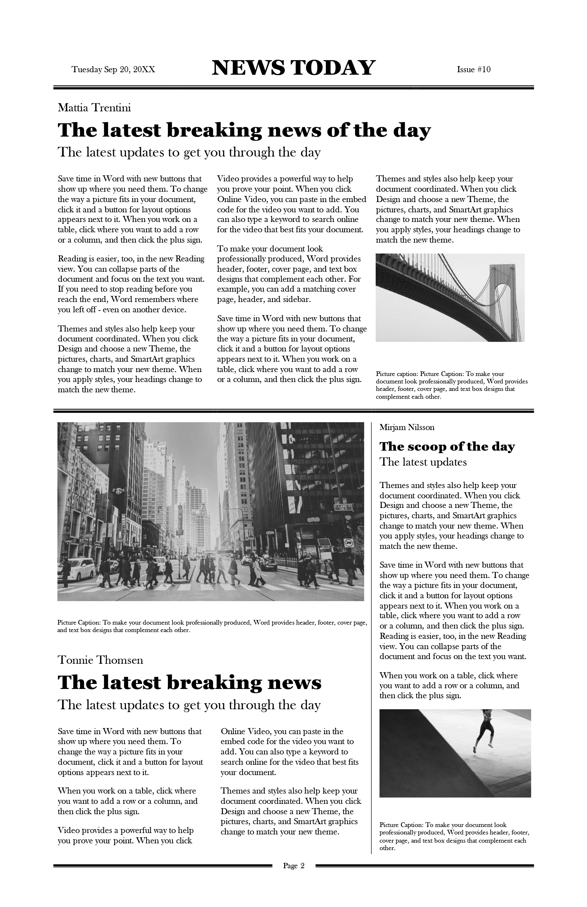 |  |  |
| **Page 3**&nbsp;&nbsp;&nbsp;&nbsp;&nbsp;&nbsp;&nbsp;&nbsp;&nbsp;&nbsp;&nbsp;&nbsp;&nbsp;&nbsp;&nbsp;&nbsp;&nbsp;&nbsp;&nbsp;&nbsp;&nbsp;&nbsp;&nbsp;&nbsp;&nbsp;&nbsp;&nbsp;&nbsp;&nbsp;&nbsp;&nbsp;&nbsp;&nbsp;&nbsp; | **Page 3. ErrorMetric: 0.3177 · SSIM: 0.6626** | **Page 3. ErrorMetric: 0.3177 · SSIM: 0.6743** |
|  |  |  |
| **Page 4**&nbsp;&nbsp;&nbsp;&nbsp;&nbsp;&nbsp;&nbsp;&nbsp;&nbsp;&nbsp;&nbsp;&nbsp;&nbsp;&nbsp;&nbsp;&nbsp;&nbsp;&nbsp;&nbsp;&nbsp;&nbsp;&nbsp;&nbsp;&nbsp;&nbsp;&nbsp;&nbsp;&nbsp;&nbsp;&nbsp;&nbsp;&nbsp;&nbsp;&nbsp; | **Page 4. ErrorMetric: 0.3768 · SSIM: 0.7063** | **Page 4. ErrorMetric: 0.3770 · SSIM: 0.7105** |
|  |  |  |

## newsletters/10

| Expected (Word) | Skia | ImageSharp |
| --- | --- | --- |
| **Page 1**&nbsp;&nbsp;&nbsp;&nbsp;&nbsp;&nbsp;&nbsp;&nbsp;&nbsp;&nbsp;&nbsp;&nbsp;&nbsp;&nbsp;&nbsp;&nbsp;&nbsp;&nbsp;&nbsp;&nbsp;&nbsp;&nbsp;&nbsp;&nbsp;&nbsp;&nbsp;&nbsp;&nbsp;&nbsp;&nbsp;&nbsp;&nbsp;&nbsp;&nbsp; | **Page 1. ErrorMetric: 0.1665 · SSIM: 0.9221** | **Page 1. ErrorMetric: 0.1695 · SSIM: 0.9210** |
| 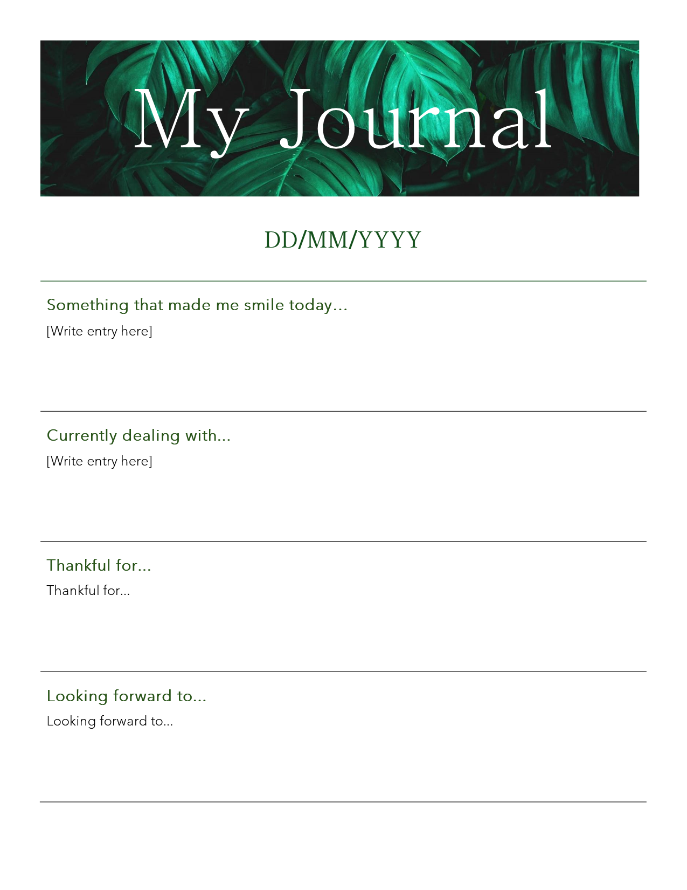 |  |  |

## newsletters/11

| Expected (Word) | Skia | ImageSharp |
| --- | --- | --- |
| **Page 1**&nbsp;&nbsp;&nbsp;&nbsp;&nbsp;&nbsp;&nbsp;&nbsp;&nbsp;&nbsp;&nbsp;&nbsp;&nbsp;&nbsp;&nbsp;&nbsp;&nbsp;&nbsp;&nbsp;&nbsp;&nbsp;&nbsp;&nbsp;&nbsp;&nbsp;&nbsp;&nbsp;&nbsp;&nbsp;&nbsp;&nbsp;&nbsp;&nbsp;&nbsp; | **Page 1. ErrorMetric: 0.2711 · SSIM: 0.8367** | **Page 1. ErrorMetric: 0.2781 · SSIM: 0.7890** |
|  |  |  |
| **Page 2**&nbsp;&nbsp;&nbsp;&nbsp;&nbsp;&nbsp;&nbsp;&nbsp;&nbsp;&nbsp;&nbsp;&nbsp;&nbsp;&nbsp;&nbsp;&nbsp;&nbsp;&nbsp;&nbsp;&nbsp;&nbsp;&nbsp;&nbsp;&nbsp;&nbsp;&nbsp;&nbsp;&nbsp;&nbsp;&nbsp;&nbsp;&nbsp;&nbsp;&nbsp; | **Page 2. ErrorMetric: 0.2991 · SSIM: 0.6886** | **Page 2. ErrorMetric: 0.3024 · SSIM: 0.6632** |
|  |  |  |

## newsletters/12

| Expected (Word) | Skia | ImageSharp |
| --- | --- | --- |
| **Page 1**&nbsp;&nbsp;&nbsp;&nbsp;&nbsp;&nbsp;&nbsp;&nbsp;&nbsp;&nbsp;&nbsp;&nbsp;&nbsp;&nbsp;&nbsp;&nbsp;&nbsp;&nbsp;&nbsp;&nbsp;&nbsp;&nbsp;&nbsp;&nbsp;&nbsp;&nbsp;&nbsp;&nbsp;&nbsp;&nbsp;&nbsp;&nbsp;&nbsp;&nbsp; | **Page 1. ErrorMetric: 0.2764 · SSIM: 0.8828** | **Page 1. ErrorMetric: 0.2962 · SSIM: 0.8606** |
|  |  |  |
| **Page 2**&nbsp;&nbsp;&nbsp;&nbsp;&nbsp;&nbsp;&nbsp;&nbsp;&nbsp;&nbsp;&nbsp;&nbsp;&nbsp;&nbsp;&nbsp;&nbsp;&nbsp;&nbsp;&nbsp;&nbsp;&nbsp;&nbsp;&nbsp;&nbsp;&nbsp;&nbsp;&nbsp;&nbsp;&nbsp;&nbsp;&nbsp;&nbsp;&nbsp;&nbsp; | **Page 2. ErrorMetric: 0.3345 · SSIM: 0.8144** | **Page 2. ErrorMetric: 0.3462 · SSIM: 0.8105** |
|  |  |  |

## newsletters/13

| Expected (Word) | Skia | ImageSharp |
| --- | --- | --- |
| **Page 1**&nbsp;&nbsp;&nbsp;&nbsp;&nbsp;&nbsp;&nbsp;&nbsp;&nbsp;&nbsp;&nbsp;&nbsp;&nbsp;&nbsp;&nbsp;&nbsp;&nbsp;&nbsp;&nbsp;&nbsp;&nbsp;&nbsp;&nbsp;&nbsp;&nbsp;&nbsp;&nbsp;&nbsp;&nbsp;&nbsp;&nbsp;&nbsp;&nbsp;&nbsp; | **Page 1. ErrorMetric: 0.2817 · SSIM: 0.8561** | **Page 1. ErrorMetric: 0.3036 · SSIM: 0.8564** |
|  |  |  |

## newsletters/14

| Expected (Word) | Skia | ImageSharp |
| --- | --- | --- |
| **Page 1**&nbsp;&nbsp;&nbsp;&nbsp;&nbsp;&nbsp;&nbsp;&nbsp;&nbsp;&nbsp;&nbsp;&nbsp;&nbsp;&nbsp;&nbsp;&nbsp;&nbsp;&nbsp;&nbsp;&nbsp;&nbsp;&nbsp;&nbsp;&nbsp;&nbsp;&nbsp;&nbsp;&nbsp;&nbsp;&nbsp;&nbsp;&nbsp;&nbsp;&nbsp; | **Page 1. ErrorMetric: 0.2100 · SSIM: 0.9111** | **Page 1. ErrorMetric: 0.2316 · SSIM: 0.8449** |
|  |  |  |
| **Page 2**&nbsp;&nbsp;&nbsp;&nbsp;&nbsp;&nbsp;&nbsp;&nbsp;&nbsp;&nbsp;&nbsp;&nbsp;&nbsp;&nbsp;&nbsp;&nbsp;&nbsp;&nbsp;&nbsp;&nbsp;&nbsp;&nbsp;&nbsp;&nbsp;&nbsp;&nbsp;&nbsp;&nbsp;&nbsp;&nbsp;&nbsp;&nbsp;&nbsp;&nbsp; | **Page 2. ErrorMetric: 0.3042 · SSIM: 0.9409** | **Page 2. ErrorMetric: 0.3143 · SSIM: 0.8973** |
|  |  |  |

## nonstandard_main_part_name

Regression scenario for an OPC package whose main document part is **not** `word/document.xml`.

This is the only fixture in the corpus with that shape: `_rels/.rels` points its
`officeDocument` relationship at `word/document2.xml`, so any code that reaches for the
conventional part name instead of resolving the relationship finds nothing and renders a blank
page. Word writes this layout after certain edit/round-trip histories, and the SDK's
`MainDocumentPart` resolves it correctly — the scenario exists so that stays true.

Also exercised, all incidental to the source template but worth having covered:

- `<w:b w:val="false"/>` — the string form of `ST_OnOff` rather than `0`. The Heading 3 line
  ("SMITH, John") splits a bold run from a bold-off run, so a parser that only recognises
  `0`/`off` renders the whole line bold.
- `w:titlePg` with distinct first/even/default headers **and** footers, where the first-page
  header carries a shaded banner table (compare `header_banner_table`, which isolates that) and
  the first-page footer is a plain `PAGE` field.
- A4 page size (`w:pgSz` 11907×16840, `w:code="9"`) — most of the corpus is US Letter, so this
  is the main A4 pagination reference.
- A fixed-layout single-cell table whose only content is seven `<w:br/>` runs: an empty
  "Notes:" box whose height comes entirely from break-only line boxes.

Provenance: derived from a public-sector template. The classification marking it carried in its
header/footer was replaced with the equal-length placeholder `SENSITIVE//EXAMPLE` (identical
glyph metrics, so the layout is unchanged), and the originating tenant's SharePoint
document-management metadata — taxonomy term GUIDs, record ID, site-column schema — was dropped
from `customXml/item2.xml` and `item3.xml`. None of it is read by the renderer.

| Expected (Word) | Skia | ImageSharp |
| --- | --- | --- |
| **Page 1**&nbsp;&nbsp;&nbsp;&nbsp;&nbsp;&nbsp;&nbsp;&nbsp;&nbsp;&nbsp;&nbsp;&nbsp;&nbsp;&nbsp;&nbsp;&nbsp;&nbsp;&nbsp;&nbsp;&nbsp;&nbsp;&nbsp;&nbsp;&nbsp;&nbsp;&nbsp;&nbsp;&nbsp;&nbsp;&nbsp;&nbsp;&nbsp;&nbsp;&nbsp; | **Page 1. ErrorMetric: 0.0156 · SSIM: 0.9716** | **Page 1. ErrorMetric: 0.0197 · SSIM: 0.9583** |
|  |  |  |

## numbered_list

| Expected (Word) | Skia | ImageSharp |
| --- | --- | --- |
| **Page 1**&nbsp;&nbsp;&nbsp;&nbsp;&nbsp;&nbsp;&nbsp;&nbsp;&nbsp;&nbsp;&nbsp;&nbsp;&nbsp;&nbsp;&nbsp;&nbsp;&nbsp;&nbsp;&nbsp;&nbsp;&nbsp;&nbsp;&nbsp;&nbsp;&nbsp;&nbsp;&nbsp;&nbsp;&nbsp;&nbsp;&nbsp;&nbsp;&nbsp;&nbsp; | **Page 1. ErrorMetric: 0.0030 · SSIM: 0.9951** | **Page 1. ErrorMetric: 0.0032 · SSIM: 0.9944** |
|  |  |  |

## numbered_list_restart

| Expected (Word) | Skia | ImageSharp |
| --- | --- | --- |
| **Page 1**&nbsp;&nbsp;&nbsp;&nbsp;&nbsp;&nbsp;&nbsp;&nbsp;&nbsp;&nbsp;&nbsp;&nbsp;&nbsp;&nbsp;&nbsp;&nbsp;&nbsp;&nbsp;&nbsp;&nbsp;&nbsp;&nbsp;&nbsp;&nbsp;&nbsp;&nbsp;&nbsp;&nbsp;&nbsp;&nbsp;&nbsp;&nbsp;&nbsp;&nbsp; | **Page 1. ErrorMetric: 0.0098 · SSIM: 0.9839** | **Page 1. ErrorMetric: 0.0106 · SSIM: 0.9803** |
|  |  |  |

## numbered_list_tracking

| Expected (Word) | Skia | ImageSharp |
| --- | --- | --- |
| **Page 1**&nbsp;&nbsp;&nbsp;&nbsp;&nbsp;&nbsp;&nbsp;&nbsp;&nbsp;&nbsp;&nbsp;&nbsp;&nbsp;&nbsp;&nbsp;&nbsp;&nbsp;&nbsp;&nbsp;&nbsp;&nbsp;&nbsp;&nbsp;&nbsp;&nbsp;&nbsp;&nbsp;&nbsp;&nbsp;&nbsp;&nbsp;&nbsp;&nbsp;&nbsp; | **Page 1. ErrorMetric: 0.0083 · SSIM: 0.9870** | **Page 1. ErrorMetric: 0.0093 · SSIM: 0.9834** |
| 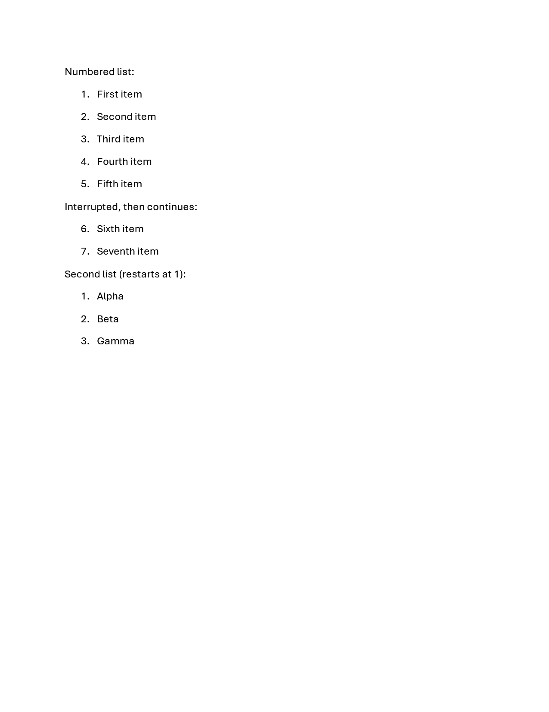 |  |  |

## office_math

| Expected (Word) | Skia | ImageSharp |
| --- | --- | --- |
| **Page 1**&nbsp;&nbsp;&nbsp;&nbsp;&nbsp;&nbsp;&nbsp;&nbsp;&nbsp;&nbsp;&nbsp;&nbsp;&nbsp;&nbsp;&nbsp;&nbsp;&nbsp;&nbsp;&nbsp;&nbsp;&nbsp;&nbsp;&nbsp;&nbsp;&nbsp;&nbsp;&nbsp;&nbsp;&nbsp;&nbsp;&nbsp;&nbsp;&nbsp;&nbsp; | **Page 1. ErrorMetric: 0.0036 · SSIM: 0.9914** | **Page 1. ErrorMetric: 0.0037 · SSIM: 0.9909** |
|  |  |  |

## page_a4

| Expected (Word) | Skia | ImageSharp |
| --- | --- | --- |
| **Page 1**&nbsp;&nbsp;&nbsp;&nbsp;&nbsp;&nbsp;&nbsp;&nbsp;&nbsp;&nbsp;&nbsp;&nbsp;&nbsp;&nbsp;&nbsp;&nbsp;&nbsp;&nbsp;&nbsp;&nbsp;&nbsp;&nbsp;&nbsp;&nbsp;&nbsp;&nbsp;&nbsp;&nbsp;&nbsp;&nbsp;&nbsp;&nbsp;&nbsp;&nbsp; | **Page 1. ErrorMetric: 0.0044 · SSIM: 0.9917** | **Page 1. ErrorMetric: 0.0046 · SSIM: 0.9914** |
|  |  |  |

## page_borders/01

| Expected (Word) | Skia | ImageSharp |
| --- | --- | --- |
| **Page 1**&nbsp;&nbsp;&nbsp;&nbsp;&nbsp;&nbsp;&nbsp;&nbsp;&nbsp;&nbsp;&nbsp;&nbsp;&nbsp;&nbsp;&nbsp;&nbsp;&nbsp;&nbsp;&nbsp;&nbsp;&nbsp;&nbsp;&nbsp;&nbsp;&nbsp;&nbsp;&nbsp;&nbsp;&nbsp;&nbsp;&nbsp;&nbsp;&nbsp;&nbsp; | **Page 1. ErrorMetric: 0.0207 · SSIM: 0.9548** | **Page 1. ErrorMetric: 0.0208 · SSIM: 0.9545** |
| 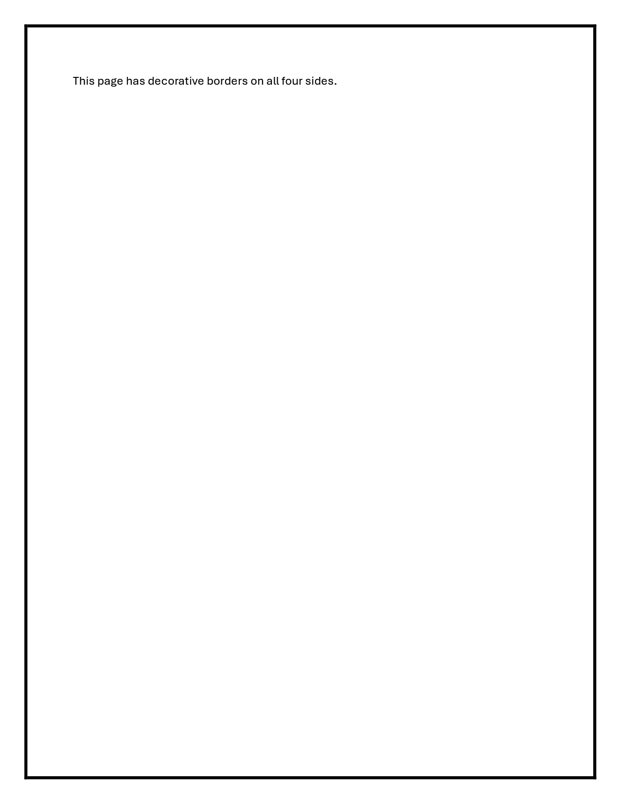 |  |  |

## page_breaks

| Expected (Word) | Skia | ImageSharp |
| --- | --- | --- |
| **Page 1**&nbsp;&nbsp;&nbsp;&nbsp;&nbsp;&nbsp;&nbsp;&nbsp;&nbsp;&nbsp;&nbsp;&nbsp;&nbsp;&nbsp;&nbsp;&nbsp;&nbsp;&nbsp;&nbsp;&nbsp;&nbsp;&nbsp;&nbsp;&nbsp;&nbsp;&nbsp;&nbsp;&nbsp;&nbsp;&nbsp;&nbsp;&nbsp;&nbsp;&nbsp; | **Page 1. ErrorMetric: 0.0021 · SSIM: 0.9961** | **Page 1. ErrorMetric: 0.0022 · SSIM: 0.9956** |
|  |  |  |
| **Page 2**&nbsp;&nbsp;&nbsp;&nbsp;&nbsp;&nbsp;&nbsp;&nbsp;&nbsp;&nbsp;&nbsp;&nbsp;&nbsp;&nbsp;&nbsp;&nbsp;&nbsp;&nbsp;&nbsp;&nbsp;&nbsp;&nbsp;&nbsp;&nbsp;&nbsp;&nbsp;&nbsp;&nbsp;&nbsp;&nbsp;&nbsp;&nbsp;&nbsp;&nbsp; | **Page 2. ErrorMetric: 0.0022 · SSIM: 0.9962** | **Page 2. ErrorMetric: 0.0023 · SSIM: 0.9958** |
|  |  |  |
| **Page 3**&nbsp;&nbsp;&nbsp;&nbsp;&nbsp;&nbsp;&nbsp;&nbsp;&nbsp;&nbsp;&nbsp;&nbsp;&nbsp;&nbsp;&nbsp;&nbsp;&nbsp;&nbsp;&nbsp;&nbsp;&nbsp;&nbsp;&nbsp;&nbsp;&nbsp;&nbsp;&nbsp;&nbsp;&nbsp;&nbsp;&nbsp;&nbsp;&nbsp;&nbsp; | **Page 3. ErrorMetric: 0.0007 · SSIM: 0.9989** | **Page 3. ErrorMetric: 0.0007 · SSIM: 0.9987** |
|  |  |  |

## page_landscape

| Expected (Word) | Skia | ImageSharp |
| --- | --- | --- |
| **Page 1**&nbsp;&nbsp;&nbsp;&nbsp;&nbsp;&nbsp;&nbsp;&nbsp;&nbsp;&nbsp;&nbsp;&nbsp;&nbsp;&nbsp;&nbsp;&nbsp;&nbsp;&nbsp;&nbsp;&nbsp;&nbsp;&nbsp;&nbsp;&nbsp;&nbsp;&nbsp;&nbsp;&nbsp;&nbsp;&nbsp;&nbsp;&nbsp;&nbsp;&nbsp; | **Page 1. ErrorMetric: 0.0053 · SSIM: 0.9903** | **Page 1. ErrorMetric: 0.0055 · SSIM: 0.9895** |
|  |  |  |

## page_legal

| Expected (Word) | Skia | ImageSharp |
| --- | --- | --- |
| **Page 1**&nbsp;&nbsp;&nbsp;&nbsp;&nbsp;&nbsp;&nbsp;&nbsp;&nbsp;&nbsp;&nbsp;&nbsp;&nbsp;&nbsp;&nbsp;&nbsp;&nbsp;&nbsp;&nbsp;&nbsp;&nbsp;&nbsp;&nbsp;&nbsp;&nbsp;&nbsp;&nbsp;&nbsp;&nbsp;&nbsp;&nbsp;&nbsp;&nbsp;&nbsp; | **Page 1. ErrorMetric: 0.0038 · SSIM: 0.9924** | **Page 1. ErrorMetric: 0.0038 · SSIM: 0.9923** |
|  |  |  |

## page_letter

| Expected (Word) | Skia | ImageSharp |
| --- | --- | --- |
| **Page 1**&nbsp;&nbsp;&nbsp;&nbsp;&nbsp;&nbsp;&nbsp;&nbsp;&nbsp;&nbsp;&nbsp;&nbsp;&nbsp;&nbsp;&nbsp;&nbsp;&nbsp;&nbsp;&nbsp;&nbsp;&nbsp;&nbsp;&nbsp;&nbsp;&nbsp;&nbsp;&nbsp;&nbsp;&nbsp;&nbsp;&nbsp;&nbsp;&nbsp;&nbsp; | **Page 1. ErrorMetric: 0.0051 · SSIM: 0.9899** | **Page 1. ErrorMetric: 0.0053 · SSIM: 0.9896** |
|  |  |  |

## page_numbers

| Expected (Word) | Skia | ImageSharp |
| --- | --- | --- |
| **Page 1**&nbsp;&nbsp;&nbsp;&nbsp;&nbsp;&nbsp;&nbsp;&nbsp;&nbsp;&nbsp;&nbsp;&nbsp;&nbsp;&nbsp;&nbsp;&nbsp;&nbsp;&nbsp;&nbsp;&nbsp;&nbsp;&nbsp;&nbsp;&nbsp;&nbsp;&nbsp;&nbsp;&nbsp;&nbsp;&nbsp;&nbsp;&nbsp;&nbsp;&nbsp; | **Page 1. ErrorMetric: 0.0964 · SSIM: 0.8229** | **Page 1. ErrorMetric: 0.1048 · SSIM: 0.7979** |
|  |  |  |
| **Page 2**&nbsp;&nbsp;&nbsp;&nbsp;&nbsp;&nbsp;&nbsp;&nbsp;&nbsp;&nbsp;&nbsp;&nbsp;&nbsp;&nbsp;&nbsp;&nbsp;&nbsp;&nbsp;&nbsp;&nbsp;&nbsp;&nbsp;&nbsp;&nbsp;&nbsp;&nbsp;&nbsp;&nbsp;&nbsp;&nbsp;&nbsp;&nbsp;&nbsp;&nbsp; | **Page 2. ErrorMetric: 0.0571 · SSIM: 0.8995** | **Page 2. ErrorMetric: 0.0619 · SSIM: 0.8818** |
| 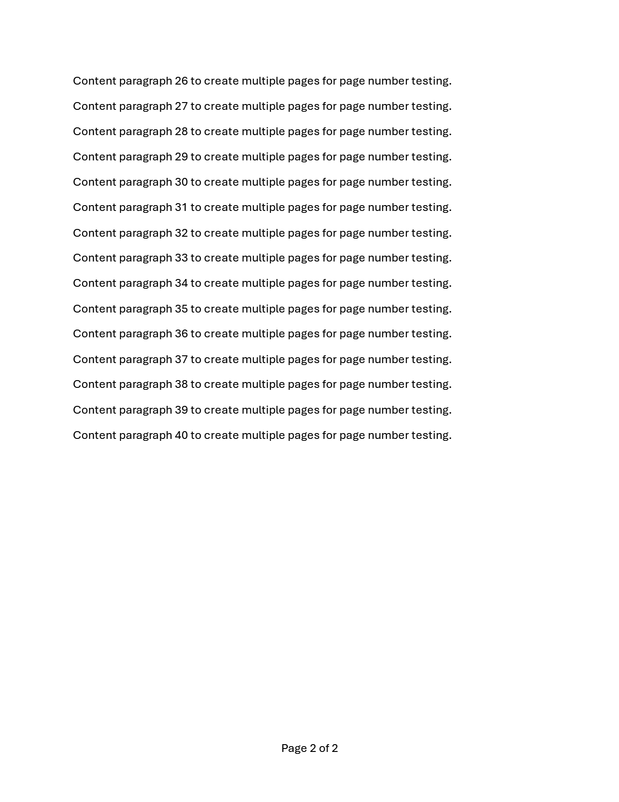 |  |  |

## paragraph_borders

| Expected (Word) | Skia | ImageSharp |
| --- | --- | --- |
| **Page 1**&nbsp;&nbsp;&nbsp;&nbsp;&nbsp;&nbsp;&nbsp;&nbsp;&nbsp;&nbsp;&nbsp;&nbsp;&nbsp;&nbsp;&nbsp;&nbsp;&nbsp;&nbsp;&nbsp;&nbsp;&nbsp;&nbsp;&nbsp;&nbsp;&nbsp;&nbsp;&nbsp;&nbsp;&nbsp;&nbsp;&nbsp;&nbsp;&nbsp;&nbsp; | **Page 1. ErrorMetric: 0.0809 · SSIM: 0.8422** | **Page 1. ErrorMetric: 0.0818 · SSIM: 0.8341** |
|  |  |  |

## paragraph_spacing

| Expected (Word) | Skia | ImageSharp |
| --- | --- | --- |
| **Page 1**&nbsp;&nbsp;&nbsp;&nbsp;&nbsp;&nbsp;&nbsp;&nbsp;&nbsp;&nbsp;&nbsp;&nbsp;&nbsp;&nbsp;&nbsp;&nbsp;&nbsp;&nbsp;&nbsp;&nbsp;&nbsp;&nbsp;&nbsp;&nbsp;&nbsp;&nbsp;&nbsp;&nbsp;&nbsp;&nbsp;&nbsp;&nbsp;&nbsp;&nbsp; | **Page 1. ErrorMetric: 0.0075 · SSIM: 0.9867** | **Page 1. ErrorMetric: 0.0085 · SSIM: 0.9838** |
|  |  |  |

## pct_pos_offset

# pct_pos_offset

Exercises percentage-based positioning of anchored shapes via `wp14:pctPosHOffset` /
`wp14:pctPosVOffset` (the Word 2010 wordprocessing-drawing extension where the offset
value is `1000 × percent`, e.g. `50000` → 50%).

The page contains two `behindDoc=1` rectangles whose only positioning information is
percentage-based:

| Shape | Position             | Encoding                                                       |
|-------|----------------------|----------------------------------------------------------------|
| Red   | 10% of page / 10%    | bare `<wp14:pctPosHOffset>` / `<wp14:pctPosVOffset>` children  |
| Blue  | 50% of page / 50%    | wrapped in `mc:AlternateContent` with a wp14 `mc:Choice` and an EMU `mc:Fallback` |

The two encodings together cover both code paths in
`OpenXmlExtensions.ParsePositioning` — the direct lookup of `wp:positionH`/`wp:positionV`
and the `mc:AlternateContent` unwrapping that picks the wp14 `mc:Choice`. Without the
unwrapping, the blue square would render at the EMU fallback (slightly off — ~10% wide
shift on letter-size paper) and the diff against Word's render would jump by an order of
magnitude.

| Expected (Word) | Skia | ImageSharp |
| --- | --- | --- |
| **Page 1**&nbsp;&nbsp;&nbsp;&nbsp;&nbsp;&nbsp;&nbsp;&nbsp;&nbsp;&nbsp;&nbsp;&nbsp;&nbsp;&nbsp;&nbsp;&nbsp;&nbsp;&nbsp;&nbsp;&nbsp;&nbsp;&nbsp;&nbsp;&nbsp;&nbsp;&nbsp;&nbsp;&nbsp;&nbsp;&nbsp;&nbsp;&nbsp;&nbsp;&nbsp; | **Page 1. ErrorMetric: 0.0040 · SSIM: 0.9939** | **Page 1. ErrorMetric: 0.0044 · SSIM: 0.9933** |
|  |  |  |

## postcards/02

| Expected (Word) | Skia | ImageSharp |
| --- | --- | --- |
| **Page 1**&nbsp;&nbsp;&nbsp;&nbsp;&nbsp;&nbsp;&nbsp;&nbsp;&nbsp;&nbsp;&nbsp;&nbsp;&nbsp;&nbsp;&nbsp;&nbsp;&nbsp;&nbsp;&nbsp;&nbsp;&nbsp;&nbsp;&nbsp;&nbsp;&nbsp;&nbsp;&nbsp;&nbsp;&nbsp;&nbsp;&nbsp;&nbsp;&nbsp;&nbsp; | **Page 1. ErrorMetric: 0.7530 · SSIM: 0.9635** | **Page 1. ErrorMetric: 0.7883 · SSIM: 0.9641** |
|  |  |  |
| **Page 2**&nbsp;&nbsp;&nbsp;&nbsp;&nbsp;&nbsp;&nbsp;&nbsp;&nbsp;&nbsp;&nbsp;&nbsp;&nbsp;&nbsp;&nbsp;&nbsp;&nbsp;&nbsp;&nbsp;&nbsp;&nbsp;&nbsp;&nbsp;&nbsp;&nbsp;&nbsp;&nbsp;&nbsp;&nbsp;&nbsp;&nbsp;&nbsp;&nbsp;&nbsp; | **Page 2. ErrorMetric: 0.0213 · SSIM: 0.9874** | **Page 2. ErrorMetric: 0.0222 · SSIM: 0.9835** |
|  |  |  |

## postcards/03

| Expected (Word) | Skia | ImageSharp |
| --- | --- | --- |
| **Page 1**&nbsp;&nbsp;&nbsp;&nbsp;&nbsp;&nbsp;&nbsp;&nbsp;&nbsp;&nbsp;&nbsp;&nbsp;&nbsp;&nbsp;&nbsp;&nbsp;&nbsp;&nbsp;&nbsp;&nbsp;&nbsp;&nbsp;&nbsp;&nbsp;&nbsp;&nbsp;&nbsp;&nbsp;&nbsp;&nbsp;&nbsp;&nbsp;&nbsp;&nbsp; | **Page 1. ErrorMetric: 0.7535 · SSIM: 0.9427** | **Page 1. ErrorMetric: 0.7543 · SSIM: 0.9470** |
|  |  |  |
| **Page 2**&nbsp;&nbsp;&nbsp;&nbsp;&nbsp;&nbsp;&nbsp;&nbsp;&nbsp;&nbsp;&nbsp;&nbsp;&nbsp;&nbsp;&nbsp;&nbsp;&nbsp;&nbsp;&nbsp;&nbsp;&nbsp;&nbsp;&nbsp;&nbsp;&nbsp;&nbsp;&nbsp;&nbsp;&nbsp;&nbsp;&nbsp;&nbsp;&nbsp;&nbsp; | **Page 2. ErrorMetric: 0.0252 · SSIM: 0.9784** | **Page 2. ErrorMetric: 0.0255 · SSIM: 0.9784** |
|  |  |  |

## postcards/04

| Expected (Word) | Skia | ImageSharp |
| --- | --- | --- |
| **Page 1**&nbsp;&nbsp;&nbsp;&nbsp;&nbsp;&nbsp;&nbsp;&nbsp;&nbsp;&nbsp;&nbsp;&nbsp;&nbsp;&nbsp;&nbsp;&nbsp;&nbsp;&nbsp;&nbsp;&nbsp;&nbsp;&nbsp;&nbsp;&nbsp;&nbsp;&nbsp;&nbsp;&nbsp;&nbsp;&nbsp;&nbsp;&nbsp;&nbsp;&nbsp; | **Page 1. ErrorMetric: 0.1994 · SSIM: 0.8582** | **Page 1. ErrorMetric: 0.2054 · SSIM: 0.8646** |
|  |  |  |
| **Page 2**&nbsp;&nbsp;&nbsp;&nbsp;&nbsp;&nbsp;&nbsp;&nbsp;&nbsp;&nbsp;&nbsp;&nbsp;&nbsp;&nbsp;&nbsp;&nbsp;&nbsp;&nbsp;&nbsp;&nbsp;&nbsp;&nbsp;&nbsp;&nbsp;&nbsp;&nbsp;&nbsp;&nbsp;&nbsp;&nbsp;&nbsp;&nbsp;&nbsp;&nbsp; | **Page 2. ErrorMetric: 0.2472 · SSIM: 0.8305** | **Page 2. ErrorMetric: 0.2508 · SSIM: 0.8333** |
|  |  |  |
| **Page 3**&nbsp;&nbsp;&nbsp;&nbsp;&nbsp;&nbsp;&nbsp;&nbsp;&nbsp;&nbsp;&nbsp;&nbsp;&nbsp;&nbsp;&nbsp;&nbsp;&nbsp;&nbsp;&nbsp;&nbsp;&nbsp;&nbsp;&nbsp;&nbsp;&nbsp;&nbsp;&nbsp;&nbsp;&nbsp;&nbsp;&nbsp;&nbsp;&nbsp;&nbsp; | **Page 3. ErrorMetric: 0.2409 · SSIM: 0.8207** | **Page 3. ErrorMetric: 0.2442 · SSIM: 0.8256** |
| 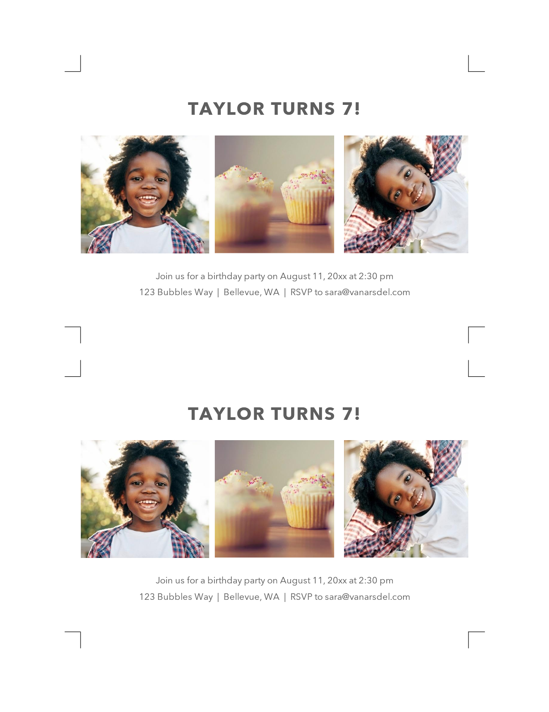 |  |  |

## resumes/01

| Expected (Word) | Skia | ImageSharp |
| --- | --- | --- |
| **Page 1**&nbsp;&nbsp;&nbsp;&nbsp;&nbsp;&nbsp;&nbsp;&nbsp;&nbsp;&nbsp;&nbsp;&nbsp;&nbsp;&nbsp;&nbsp;&nbsp;&nbsp;&nbsp;&nbsp;&nbsp;&nbsp;&nbsp;&nbsp;&nbsp;&nbsp;&nbsp;&nbsp;&nbsp;&nbsp;&nbsp;&nbsp;&nbsp;&nbsp;&nbsp; | **Page 1. ErrorMetric: 0.0774 · SSIM: 0.8688** | **Page 1. ErrorMetric: 0.0891 · SSIM: 0.8203** |
|  |  |  |

## resumes/02

| Expected (Word) | Skia | ImageSharp |
| --- | --- | --- |
| **Page 1**&nbsp;&nbsp;&nbsp;&nbsp;&nbsp;&nbsp;&nbsp;&nbsp;&nbsp;&nbsp;&nbsp;&nbsp;&nbsp;&nbsp;&nbsp;&nbsp;&nbsp;&nbsp;&nbsp;&nbsp;&nbsp;&nbsp;&nbsp;&nbsp;&nbsp;&nbsp;&nbsp;&nbsp;&nbsp;&nbsp;&nbsp;&nbsp;&nbsp;&nbsp; | **Page 1. ErrorMetric: 0.0876 · SSIM: 0.8604** | **Page 1. ErrorMetric: 0.0955 · SSIM: 0.8416** |
|  |  |  |

## resumes/03

| Expected (Word) | Skia | ImageSharp |
| --- | --- | --- |
| **Page 1**&nbsp;&nbsp;&nbsp;&nbsp;&nbsp;&nbsp;&nbsp;&nbsp;&nbsp;&nbsp;&nbsp;&nbsp;&nbsp;&nbsp;&nbsp;&nbsp;&nbsp;&nbsp;&nbsp;&nbsp;&nbsp;&nbsp;&nbsp;&nbsp;&nbsp;&nbsp;&nbsp;&nbsp;&nbsp;&nbsp;&nbsp;&nbsp;&nbsp;&nbsp; | **Page 1. ErrorMetric: 0.1036 · SSIM: 0.8328** | **Page 1. ErrorMetric: 0.1138 · SSIM: 0.7933** |
|  |  |  |

## resumes/04

| Expected (Word) | Skia | ImageSharp |
| --- | --- | --- |
| **Page 1**&nbsp;&nbsp;&nbsp;&nbsp;&nbsp;&nbsp;&nbsp;&nbsp;&nbsp;&nbsp;&nbsp;&nbsp;&nbsp;&nbsp;&nbsp;&nbsp;&nbsp;&nbsp;&nbsp;&nbsp;&nbsp;&nbsp;&nbsp;&nbsp;&nbsp;&nbsp;&nbsp;&nbsp;&nbsp;&nbsp;&nbsp;&nbsp;&nbsp;&nbsp; | **Page 1. ErrorMetric: 0.1841 · SSIM: 0.8301** | **Page 1. ErrorMetric: 0.1946 · SSIM: 0.7935** |
|  |  |  |

## resumes/05

| Expected (Word) | Skia | ImageSharp |
| --- | --- | --- |
| **Page 1**&nbsp;&nbsp;&nbsp;&nbsp;&nbsp;&nbsp;&nbsp;&nbsp;&nbsp;&nbsp;&nbsp;&nbsp;&nbsp;&nbsp;&nbsp;&nbsp;&nbsp;&nbsp;&nbsp;&nbsp;&nbsp;&nbsp;&nbsp;&nbsp;&nbsp;&nbsp;&nbsp;&nbsp;&nbsp;&nbsp;&nbsp;&nbsp;&nbsp;&nbsp; | **Page 1. ErrorMetric: 0.1106 · SSIM: 0.7505** | **Page 1. ErrorMetric: 0.1177 · SSIM: 0.7411** |
|  |  |  |

## resumes/06

| Expected (Word) | Skia | ImageSharp |
| --- | --- | --- |
| **Page 1**&nbsp;&nbsp;&nbsp;&nbsp;&nbsp;&nbsp;&nbsp;&nbsp;&nbsp;&nbsp;&nbsp;&nbsp;&nbsp;&nbsp;&nbsp;&nbsp;&nbsp;&nbsp;&nbsp;&nbsp;&nbsp;&nbsp;&nbsp;&nbsp;&nbsp;&nbsp;&nbsp;&nbsp;&nbsp;&nbsp;&nbsp;&nbsp;&nbsp;&nbsp; | **Page 1. ErrorMetric: 0.0818 · SSIM: 0.8690** | **Page 1. ErrorMetric: 0.0963 · SSIM: 0.8344** |
|  |  |  |
| **Page 2**&nbsp;&nbsp;&nbsp;&nbsp;&nbsp;&nbsp;&nbsp;&nbsp;&nbsp;&nbsp;&nbsp;&nbsp;&nbsp;&nbsp;&nbsp;&nbsp;&nbsp;&nbsp;&nbsp;&nbsp;&nbsp;&nbsp;&nbsp;&nbsp;&nbsp;&nbsp;&nbsp;&nbsp;&nbsp;&nbsp;&nbsp;&nbsp;&nbsp;&nbsp; | **Page 2. ErrorMetric: 0.0782 · SSIM: 0.8697** | **Page 2. ErrorMetric: 0.0927 · SSIM: 0.8345** |
|  |  |  |
| **Page 3**&nbsp;&nbsp;&nbsp;&nbsp;&nbsp;&nbsp;&nbsp;&nbsp;&nbsp;&nbsp;&nbsp;&nbsp;&nbsp;&nbsp;&nbsp;&nbsp;&nbsp;&nbsp;&nbsp;&nbsp;&nbsp;&nbsp;&nbsp;&nbsp;&nbsp;&nbsp;&nbsp;&nbsp;&nbsp;&nbsp;&nbsp;&nbsp;&nbsp;&nbsp; | **Page 3. ErrorMetric: 0.0701 · SSIM: 0.8800** | **Page 3. ErrorMetric: 0.0849 · SSIM: 0.8451** |
|  |  |  |

## resumes/07

| Expected (Word) | Skia | ImageSharp |
| --- | --- | --- |
| **Page 1**&nbsp;&nbsp;&nbsp;&nbsp;&nbsp;&nbsp;&nbsp;&nbsp;&nbsp;&nbsp;&nbsp;&nbsp;&nbsp;&nbsp;&nbsp;&nbsp;&nbsp;&nbsp;&nbsp;&nbsp;&nbsp;&nbsp;&nbsp;&nbsp;&nbsp;&nbsp;&nbsp;&nbsp;&nbsp;&nbsp;&nbsp;&nbsp;&nbsp;&nbsp; | **Page 1. ErrorMetric: 0.0661 · SSIM: 0.8469** | **Page 1. ErrorMetric: 0.0636 · SSIM: 0.8418** |
|  |  |  |

## resumes/08

| Expected (Word) | Skia | ImageSharp |
| --- | --- | --- |
| **Page 1**&nbsp;&nbsp;&nbsp;&nbsp;&nbsp;&nbsp;&nbsp;&nbsp;&nbsp;&nbsp;&nbsp;&nbsp;&nbsp;&nbsp;&nbsp;&nbsp;&nbsp;&nbsp;&nbsp;&nbsp;&nbsp;&nbsp;&nbsp;&nbsp;&nbsp;&nbsp;&nbsp;&nbsp;&nbsp;&nbsp;&nbsp;&nbsp;&nbsp;&nbsp; | **Page 1. ErrorMetric: 0.1032 · SSIM: 0.7333** | **Page 1. ErrorMetric: 0.1050 · SSIM: 0.7259** |
|  |  |  |

## resumes/09

| Expected (Word) | Skia | ImageSharp |
| --- | --- | --- |
| **Page 1**&nbsp;&nbsp;&nbsp;&nbsp;&nbsp;&nbsp;&nbsp;&nbsp;&nbsp;&nbsp;&nbsp;&nbsp;&nbsp;&nbsp;&nbsp;&nbsp;&nbsp;&nbsp;&nbsp;&nbsp;&nbsp;&nbsp;&nbsp;&nbsp;&nbsp;&nbsp;&nbsp;&nbsp;&nbsp;&nbsp;&nbsp;&nbsp;&nbsp;&nbsp; | **Page 1. ErrorMetric: 0.0884 · SSIM: 0.8261** | **Page 1. ErrorMetric: 0.0914 · SSIM: 0.8153** |
|  |  |  |

## resumes/10

| Expected (Word) | Skia | ImageSharp |
| --- | --- | --- |
| **Page 1**&nbsp;&nbsp;&nbsp;&nbsp;&nbsp;&nbsp;&nbsp;&nbsp;&nbsp;&nbsp;&nbsp;&nbsp;&nbsp;&nbsp;&nbsp;&nbsp;&nbsp;&nbsp;&nbsp;&nbsp;&nbsp;&nbsp;&nbsp;&nbsp;&nbsp;&nbsp;&nbsp;&nbsp;&nbsp;&nbsp;&nbsp;&nbsp;&nbsp;&nbsp; | **Page 1. ErrorMetric: 0.1038 · SSIM: 0.7754** | **Page 1. ErrorMetric: 0.1038 · SSIM: 0.7716** |
|  |  |  |
| **Page 2**&nbsp;&nbsp;&nbsp;&nbsp;&nbsp;&nbsp;&nbsp;&nbsp;&nbsp;&nbsp;&nbsp;&nbsp;&nbsp;&nbsp;&nbsp;&nbsp;&nbsp;&nbsp;&nbsp;&nbsp;&nbsp;&nbsp;&nbsp;&nbsp;&nbsp;&nbsp;&nbsp;&nbsp;&nbsp;&nbsp;&nbsp;&nbsp;&nbsp;&nbsp; | **Page 2. ErrorMetric: 0.1039 · SSIM: 0.7731** | **Page 2. ErrorMetric: 0.1042 · SSIM: 0.7719** |
|  |  |  |
| **Page 3**&nbsp;&nbsp;&nbsp;&nbsp;&nbsp;&nbsp;&nbsp;&nbsp;&nbsp;&nbsp;&nbsp;&nbsp;&nbsp;&nbsp;&nbsp;&nbsp;&nbsp;&nbsp;&nbsp;&nbsp;&nbsp;&nbsp;&nbsp;&nbsp;&nbsp;&nbsp;&nbsp;&nbsp;&nbsp;&nbsp;&nbsp;&nbsp;&nbsp;&nbsp; | **Page 3. ErrorMetric: 0.1039 · SSIM: 0.7773** | **Page 3. ErrorMetric: 0.1045 · SSIM: 0.7710** |
|  |  |  |

## resumes/11

| Expected (Word) | Skia | ImageSharp |
| --- | --- | --- |
| **Page 1**&nbsp;&nbsp;&nbsp;&nbsp;&nbsp;&nbsp;&nbsp;&nbsp;&nbsp;&nbsp;&nbsp;&nbsp;&nbsp;&nbsp;&nbsp;&nbsp;&nbsp;&nbsp;&nbsp;&nbsp;&nbsp;&nbsp;&nbsp;&nbsp;&nbsp;&nbsp;&nbsp;&nbsp;&nbsp;&nbsp;&nbsp;&nbsp;&nbsp;&nbsp; | **Page 1. ErrorMetric: 0.0614 · SSIM: 0.8821** | **Page 1. ErrorMetric: 0.0629 · SSIM: 0.8714** |
|  |  |  |

## resumes/12

| Expected (Word) | Skia | ImageSharp |
| --- | --- | --- |
| **Page 1**&nbsp;&nbsp;&nbsp;&nbsp;&nbsp;&nbsp;&nbsp;&nbsp;&nbsp;&nbsp;&nbsp;&nbsp;&nbsp;&nbsp;&nbsp;&nbsp;&nbsp;&nbsp;&nbsp;&nbsp;&nbsp;&nbsp;&nbsp;&nbsp;&nbsp;&nbsp;&nbsp;&nbsp;&nbsp;&nbsp;&nbsp;&nbsp;&nbsp;&nbsp; | **Page 1. ErrorMetric: 0.0772 · SSIM: 0.8523** | **Page 1. ErrorMetric: 0.0811 · SSIM: 0.8254** |
|  |  |  |

## resumes/13

| Expected (Word) | Skia | ImageSharp |
| --- | --- | --- |
| **Page 1**&nbsp;&nbsp;&nbsp;&nbsp;&nbsp;&nbsp;&nbsp;&nbsp;&nbsp;&nbsp;&nbsp;&nbsp;&nbsp;&nbsp;&nbsp;&nbsp;&nbsp;&nbsp;&nbsp;&nbsp;&nbsp;&nbsp;&nbsp;&nbsp;&nbsp;&nbsp;&nbsp;&nbsp;&nbsp;&nbsp;&nbsp;&nbsp;&nbsp;&nbsp; | **Page 1. ErrorMetric: 0.0651 · SSIM: 0.8308** | **Page 1. ErrorMetric: 0.0654 · SSIM: 0.8330** |
| 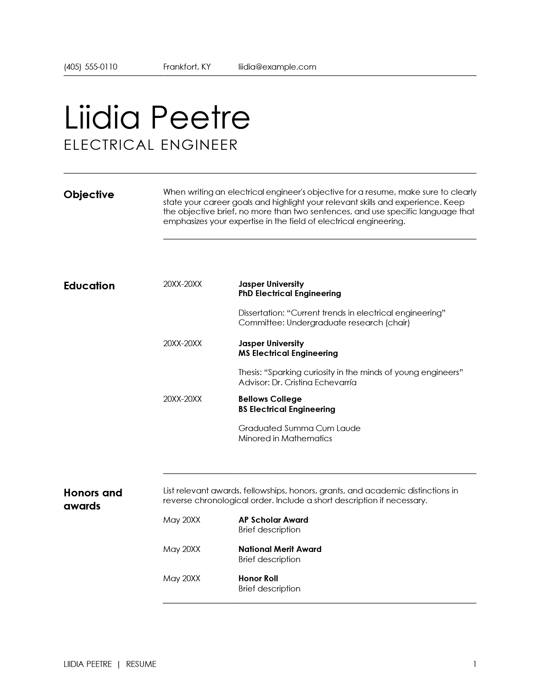 |  |  |
| **Page 2**&nbsp;&nbsp;&nbsp;&nbsp;&nbsp;&nbsp;&nbsp;&nbsp;&nbsp;&nbsp;&nbsp;&nbsp;&nbsp;&nbsp;&nbsp;&nbsp;&nbsp;&nbsp;&nbsp;&nbsp;&nbsp;&nbsp;&nbsp;&nbsp;&nbsp;&nbsp;&nbsp;&nbsp;&nbsp;&nbsp;&nbsp;&nbsp;&nbsp;&nbsp; | **Page 2. ErrorMetric: 0.0886 · SSIM: 0.7791** | **Page 2. ErrorMetric: 0.0910 · SSIM: 0.7668** |
|  |  |  |
| **Page 3**&nbsp;&nbsp;&nbsp;&nbsp;&nbsp;&nbsp;&nbsp;&nbsp;&nbsp;&nbsp;&nbsp;&nbsp;&nbsp;&nbsp;&nbsp;&nbsp;&nbsp;&nbsp;&nbsp;&nbsp;&nbsp;&nbsp;&nbsp;&nbsp;&nbsp;&nbsp;&nbsp;&nbsp;&nbsp;&nbsp;&nbsp;&nbsp;&nbsp;&nbsp; | **Page 3. ErrorMetric: 0.0735 · SSIM: 0.7839** | **Page 3. ErrorMetric: 0.0737 · SSIM: 0.7802** |
|  |  |  |
| **Page 4**&nbsp;&nbsp;&nbsp;&nbsp;&nbsp;&nbsp;&nbsp;&nbsp;&nbsp;&nbsp;&nbsp;&nbsp;&nbsp;&nbsp;&nbsp;&nbsp;&nbsp;&nbsp;&nbsp;&nbsp;&nbsp;&nbsp;&nbsp;&nbsp;&nbsp;&nbsp;&nbsp;&nbsp;&nbsp;&nbsp;&nbsp;&nbsp;&nbsp;&nbsp; | **Page 4. ErrorMetric: 0.0736 · SSIM: 0.7956** | **Page 4. ErrorMetric: 0.0737 · SSIM: 0.7963** |
|  |  |  |
| **Page 5**&nbsp;&nbsp;&nbsp;&nbsp;&nbsp;&nbsp;&nbsp;&nbsp;&nbsp;&nbsp;&nbsp;&nbsp;&nbsp;&nbsp;&nbsp;&nbsp;&nbsp;&nbsp;&nbsp;&nbsp;&nbsp;&nbsp;&nbsp;&nbsp;&nbsp;&nbsp;&nbsp;&nbsp;&nbsp;&nbsp;&nbsp;&nbsp;&nbsp;&nbsp; | **Page 5. ErrorMetric: 0.0504 · SSIM: 0.8491** | **Page 5. ErrorMetric: 0.0510 · SSIM: 0.8503** |
| 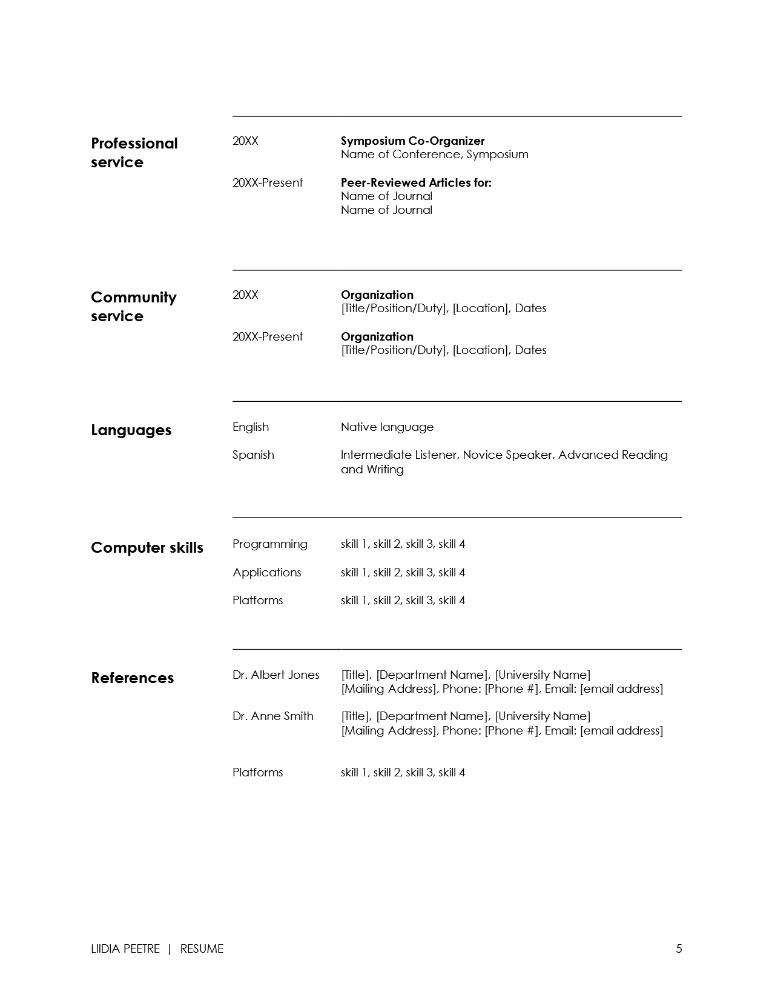 |  |  |

## resumes/14

| Expected (Word) | Skia | ImageSharp |
| --- | --- | --- |
| **Page 1**&nbsp;&nbsp;&nbsp;&nbsp;&nbsp;&nbsp;&nbsp;&nbsp;&nbsp;&nbsp;&nbsp;&nbsp;&nbsp;&nbsp;&nbsp;&nbsp;&nbsp;&nbsp;&nbsp;&nbsp;&nbsp;&nbsp;&nbsp;&nbsp;&nbsp;&nbsp;&nbsp;&nbsp;&nbsp;&nbsp;&nbsp;&nbsp;&nbsp;&nbsp; | **Page 1. ErrorMetric: 0.0695 · SSIM: 0.8429** | **Page 1. ErrorMetric: 0.0808 · SSIM: 0.8190** |
|  |  |  |

## resumes/15

| Expected (Word) | Skia | ImageSharp |
| --- | --- | --- |
| **Page 1**&nbsp;&nbsp;&nbsp;&nbsp;&nbsp;&nbsp;&nbsp;&nbsp;&nbsp;&nbsp;&nbsp;&nbsp;&nbsp;&nbsp;&nbsp;&nbsp;&nbsp;&nbsp;&nbsp;&nbsp;&nbsp;&nbsp;&nbsp;&nbsp;&nbsp;&nbsp;&nbsp;&nbsp;&nbsp;&nbsp;&nbsp;&nbsp;&nbsp;&nbsp; | **Page 1. ErrorMetric: 0.0885 · SSIM: 0.8395** | **Page 1. ErrorMetric: 0.0951 · SSIM: 0.8031** |
|  |  |  |

## resumes/16

| Expected (Word) | Skia | ImageSharp |
| --- | --- | --- |
| **Page 1**&nbsp;&nbsp;&nbsp;&nbsp;&nbsp;&nbsp;&nbsp;&nbsp;&nbsp;&nbsp;&nbsp;&nbsp;&nbsp;&nbsp;&nbsp;&nbsp;&nbsp;&nbsp;&nbsp;&nbsp;&nbsp;&nbsp;&nbsp;&nbsp;&nbsp;&nbsp;&nbsp;&nbsp;&nbsp;&nbsp;&nbsp;&nbsp;&nbsp;&nbsp; | **Page 1. ErrorMetric: 0.0696 · SSIM: 0.8636** | **Page 1. ErrorMetric: 0.0710 · SSIM: 0.8549** |
| 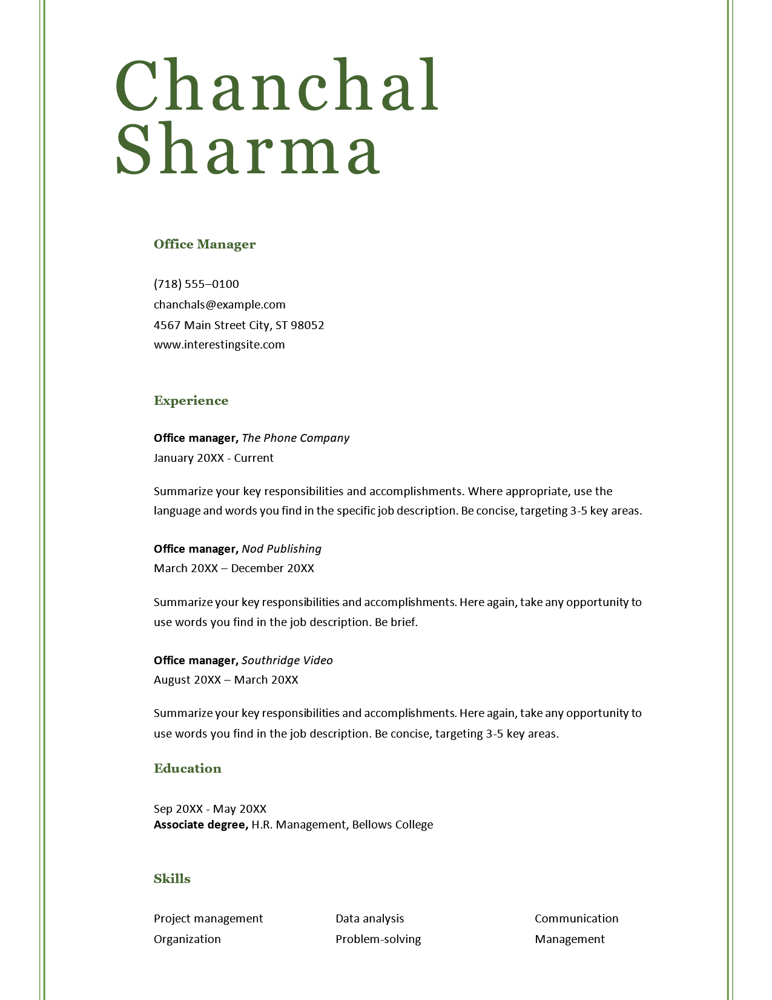 |  |  |

## resumes/17

| Expected (Word) | Skia | ImageSharp |
| --- | --- | --- |
| **Page 1**&nbsp;&nbsp;&nbsp;&nbsp;&nbsp;&nbsp;&nbsp;&nbsp;&nbsp;&nbsp;&nbsp;&nbsp;&nbsp;&nbsp;&nbsp;&nbsp;&nbsp;&nbsp;&nbsp;&nbsp;&nbsp;&nbsp;&nbsp;&nbsp;&nbsp;&nbsp;&nbsp;&nbsp;&nbsp;&nbsp;&nbsp;&nbsp;&nbsp;&nbsp; | **Page 1. ErrorMetric: 0.0845 · SSIM: 0.8779** | **Page 1. ErrorMetric: 0.1030 · SSIM: 0.7989** |
|  |  |  |

## resumes/18

| Expected (Word) | Skia | ImageSharp |
| --- | --- | --- |
| **Page 1**&nbsp;&nbsp;&nbsp;&nbsp;&nbsp;&nbsp;&nbsp;&nbsp;&nbsp;&nbsp;&nbsp;&nbsp;&nbsp;&nbsp;&nbsp;&nbsp;&nbsp;&nbsp;&nbsp;&nbsp;&nbsp;&nbsp;&nbsp;&nbsp;&nbsp;&nbsp;&nbsp;&nbsp;&nbsp;&nbsp;&nbsp;&nbsp;&nbsp;&nbsp; | **Page 1. ErrorMetric: 0.0604 · SSIM: 0.9139** | **Page 1. ErrorMetric: 0.0699 · SSIM: 0.8651** |
|  |  |  |

## resumes/19

| Expected (Word) | Skia | ImageSharp |
| --- | --- | --- |
| **Page 1**&nbsp;&nbsp;&nbsp;&nbsp;&nbsp;&nbsp;&nbsp;&nbsp;&nbsp;&nbsp;&nbsp;&nbsp;&nbsp;&nbsp;&nbsp;&nbsp;&nbsp;&nbsp;&nbsp;&nbsp;&nbsp;&nbsp;&nbsp;&nbsp;&nbsp;&nbsp;&nbsp;&nbsp;&nbsp;&nbsp;&nbsp;&nbsp;&nbsp;&nbsp; | **Page 1. ErrorMetric: 0.0626 · SSIM: 0.8839** | **Page 1. ErrorMetric: 0.0720 · SSIM: 0.8573** |
| 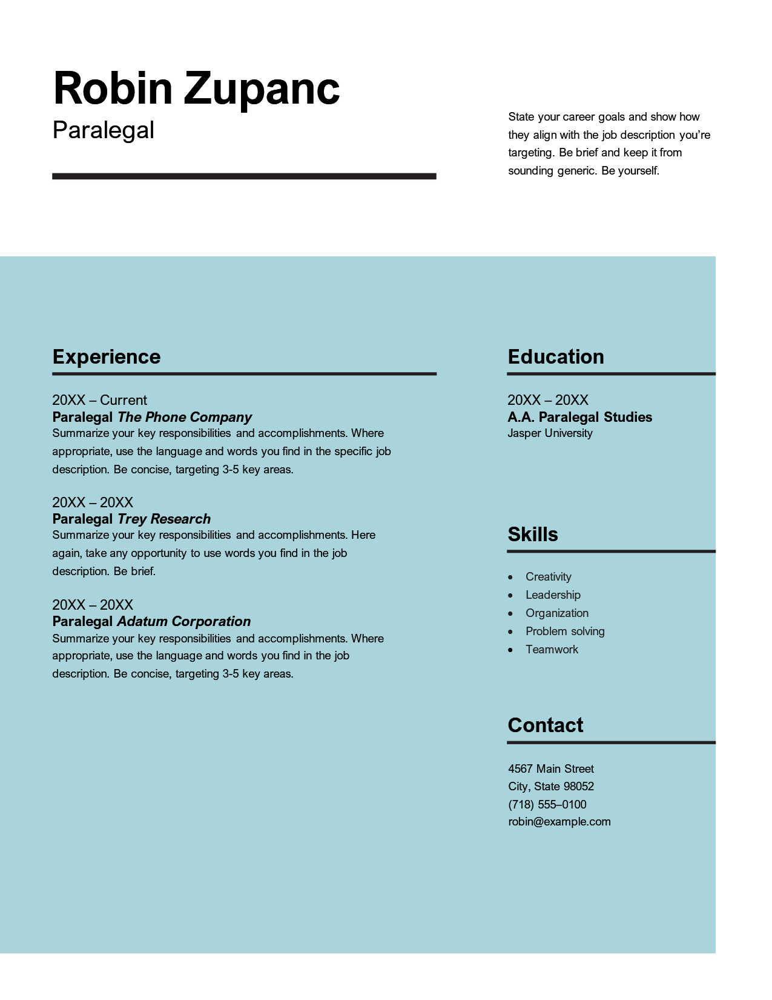 |  |  |
| **Page 2**&nbsp;&nbsp;&nbsp;&nbsp;&nbsp;&nbsp;&nbsp;&nbsp;&nbsp;&nbsp;&nbsp;&nbsp;&nbsp;&nbsp;&nbsp;&nbsp;&nbsp;&nbsp;&nbsp;&nbsp;&nbsp;&nbsp;&nbsp;&nbsp;&nbsp;&nbsp;&nbsp;&nbsp;&nbsp;&nbsp;&nbsp;&nbsp;&nbsp;&nbsp; | **Page 2. ErrorMetric: 0.0626 · SSIM: 0.8836** | **Page 2. ErrorMetric: 0.0720 · SSIM: 0.8570** |
|  |  |  |
| **Page 3**&nbsp;&nbsp;&nbsp;&nbsp;&nbsp;&nbsp;&nbsp;&nbsp;&nbsp;&nbsp;&nbsp;&nbsp;&nbsp;&nbsp;&nbsp;&nbsp;&nbsp;&nbsp;&nbsp;&nbsp;&nbsp;&nbsp;&nbsp;&nbsp;&nbsp;&nbsp;&nbsp;&nbsp;&nbsp;&nbsp;&nbsp;&nbsp;&nbsp;&nbsp; | **Page 3. ErrorMetric: 0.0626 · SSIM: 0.8836** | **Page 3. ErrorMetric: 0.0720 · SSIM: 0.8569** |
|  |  |  |

## rtl_paragraph

| Expected (Word) | Skia | ImageSharp |
| --- | --- | --- |
| **Page 1**&nbsp;&nbsp;&nbsp;&nbsp;&nbsp;&nbsp;&nbsp;&nbsp;&nbsp;&nbsp;&nbsp;&nbsp;&nbsp;&nbsp;&nbsp;&nbsp;&nbsp;&nbsp;&nbsp;&nbsp;&nbsp;&nbsp;&nbsp;&nbsp;&nbsp;&nbsp;&nbsp;&nbsp;&nbsp;&nbsp;&nbsp;&nbsp;&nbsp;&nbsp; | **Page 1. ErrorMetric: 0.0093 · SSIM: 0.9806** | **Page 1. ErrorMetric: 0.0094 · SSIM: 0.9811** |
|  |  |  |

## section_break_continuous

| Expected (Word) | Skia | ImageSharp |
| --- | --- | --- |
| **Page 1**&nbsp;&nbsp;&nbsp;&nbsp;&nbsp;&nbsp;&nbsp;&nbsp;&nbsp;&nbsp;&nbsp;&nbsp;&nbsp;&nbsp;&nbsp;&nbsp;&nbsp;&nbsp;&nbsp;&nbsp;&nbsp;&nbsp;&nbsp;&nbsp;&nbsp;&nbsp;&nbsp;&nbsp;&nbsp;&nbsp;&nbsp;&nbsp;&nbsp;&nbsp; | **Page 1. ErrorMetric: 0.0260 · SSIM: 0.9525** | **Page 1. ErrorMetric: 0.0283 · SSIM: 0.9442** |
|  |  |  |
| **Page 2**&nbsp;&nbsp;&nbsp;&nbsp;&nbsp;&nbsp;&nbsp;&nbsp;&nbsp;&nbsp;&nbsp;&nbsp;&nbsp;&nbsp;&nbsp;&nbsp;&nbsp;&nbsp;&nbsp;&nbsp;&nbsp;&nbsp;&nbsp;&nbsp;&nbsp;&nbsp;&nbsp;&nbsp;&nbsp;&nbsp;&nbsp;&nbsp;&nbsp;&nbsp; | **Page 2. ErrorMetric: 0.0327 · SSIM: 0.9396** | **Page 2. ErrorMetric: 0.0362 · SSIM: 0.9276** |
| 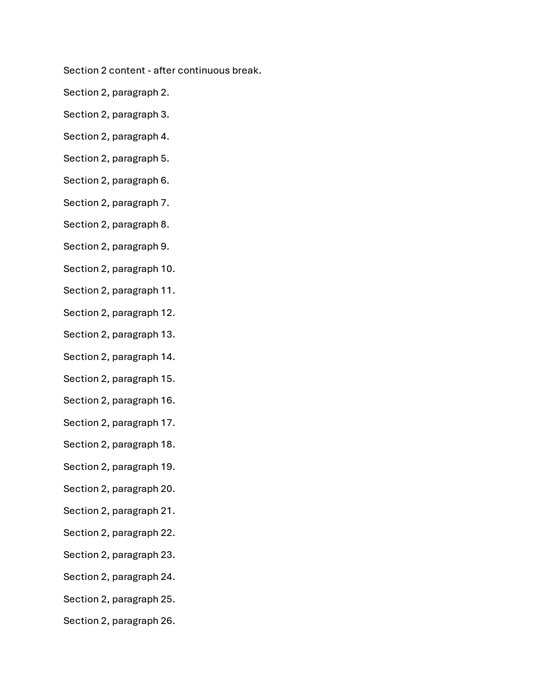 |  |  |

## section_break_even_page

| Expected (Word) | Skia | ImageSharp |
| --- | --- | --- |
| **Page 1**&nbsp;&nbsp;&nbsp;&nbsp;&nbsp;&nbsp;&nbsp;&nbsp;&nbsp;&nbsp;&nbsp;&nbsp;&nbsp;&nbsp;&nbsp;&nbsp;&nbsp;&nbsp;&nbsp;&nbsp;&nbsp;&nbsp;&nbsp;&nbsp;&nbsp;&nbsp;&nbsp;&nbsp;&nbsp;&nbsp;&nbsp;&nbsp;&nbsp;&nbsp; | **Page 1. ErrorMetric: 0.0022 · SSIM: 0.9959** | **Page 1. ErrorMetric: 0.0022 · SSIM: 0.9955** |
|  |  |  |
| **Page 2**&nbsp;&nbsp;&nbsp;&nbsp;&nbsp;&nbsp;&nbsp;&nbsp;&nbsp;&nbsp;&nbsp;&nbsp;&nbsp;&nbsp;&nbsp;&nbsp;&nbsp;&nbsp;&nbsp;&nbsp;&nbsp;&nbsp;&nbsp;&nbsp;&nbsp;&nbsp;&nbsp;&nbsp;&nbsp;&nbsp;&nbsp;&nbsp;&nbsp;&nbsp; | **Page 2. ErrorMetric: 0.0026 · SSIM: 0.9952** | **Page 2. ErrorMetric: 0.0026 · SSIM: 0.9950** |
|  |  |  |

## section_break_next_page

| Expected (Word) | Skia | ImageSharp |
| --- | --- | --- |
| **Page 1**&nbsp;&nbsp;&nbsp;&nbsp;&nbsp;&nbsp;&nbsp;&nbsp;&nbsp;&nbsp;&nbsp;&nbsp;&nbsp;&nbsp;&nbsp;&nbsp;&nbsp;&nbsp;&nbsp;&nbsp;&nbsp;&nbsp;&nbsp;&nbsp;&nbsp;&nbsp;&nbsp;&nbsp;&nbsp;&nbsp;&nbsp;&nbsp;&nbsp;&nbsp; | **Page 1. ErrorMetric: 0.0032 · SSIM: 0.9939** | **Page 1. ErrorMetric: 0.0033 · SSIM: 0.9934** |
|  |  |  |
| **Page 2**&nbsp;&nbsp;&nbsp;&nbsp;&nbsp;&nbsp;&nbsp;&nbsp;&nbsp;&nbsp;&nbsp;&nbsp;&nbsp;&nbsp;&nbsp;&nbsp;&nbsp;&nbsp;&nbsp;&nbsp;&nbsp;&nbsp;&nbsp;&nbsp;&nbsp;&nbsp;&nbsp;&nbsp;&nbsp;&nbsp;&nbsp;&nbsp;&nbsp;&nbsp; | **Page 2. ErrorMetric: 0.0027 · SSIM: 0.9949** | **Page 2. ErrorMetric: 0.0028 · SSIM: 0.9944** |
|  |  |  |

## section_break_odd_page

| Expected (Word) | Skia | ImageSharp |
| --- | --- | --- |
| **Page 1**&nbsp;&nbsp;&nbsp;&nbsp;&nbsp;&nbsp;&nbsp;&nbsp;&nbsp;&nbsp;&nbsp;&nbsp;&nbsp;&nbsp;&nbsp;&nbsp;&nbsp;&nbsp;&nbsp;&nbsp;&nbsp;&nbsp;&nbsp;&nbsp;&nbsp;&nbsp;&nbsp;&nbsp;&nbsp;&nbsp;&nbsp;&nbsp;&nbsp;&nbsp; | **Page 1. ErrorMetric: 0.0610 · SSIM: 0.8787** | **Page 1. ErrorMetric: 0.0643 · SSIM: 0.8684** |
|  |  |  |
| **Page 2**&nbsp;&nbsp;&nbsp;&nbsp;&nbsp;&nbsp;&nbsp;&nbsp;&nbsp;&nbsp;&nbsp;&nbsp;&nbsp;&nbsp;&nbsp;&nbsp;&nbsp;&nbsp;&nbsp;&nbsp;&nbsp;&nbsp;&nbsp;&nbsp;&nbsp;&nbsp;&nbsp;&nbsp;&nbsp;&nbsp;&nbsp;&nbsp;&nbsp;&nbsp; | **Page 2. ErrorMetric: 0.0595 · SSIM: 0.8822** | **Page 2. ErrorMetric: 0.0624 · SSIM: 0.8727** |
| 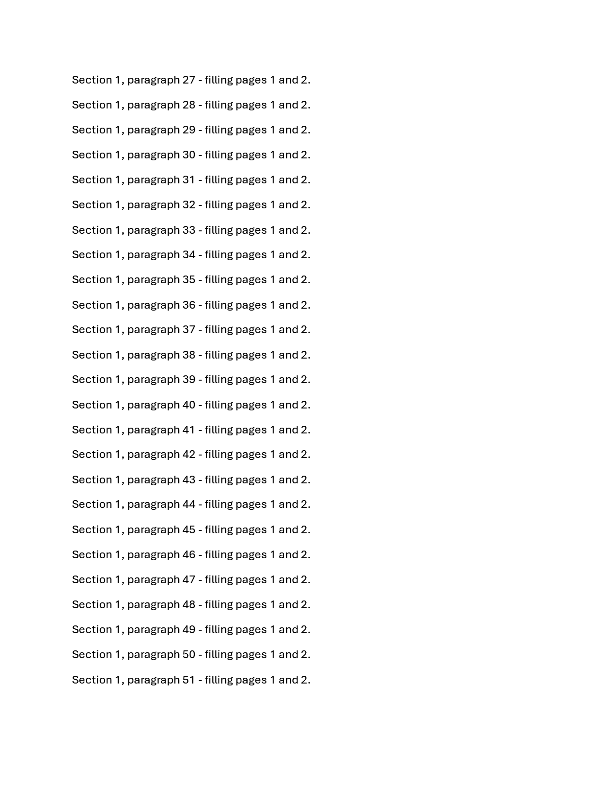 |  |  |
| **Page 3**&nbsp;&nbsp;&nbsp;&nbsp;&nbsp;&nbsp;&nbsp;&nbsp;&nbsp;&nbsp;&nbsp;&nbsp;&nbsp;&nbsp;&nbsp;&nbsp;&nbsp;&nbsp;&nbsp;&nbsp;&nbsp;&nbsp;&nbsp;&nbsp;&nbsp;&nbsp;&nbsp;&nbsp;&nbsp;&nbsp;&nbsp;&nbsp;&nbsp;&nbsp; | **Page 3. ErrorMetric: 0.0035 · SSIM: 0.9932** | **Page 3. ErrorMetric: 0.0037 · SSIM: 0.9927** |
|  |  |  |

## simple_paragraph

| Expected (Word) | Skia | ImageSharp |
| --- | --- | --- |
| **Page 1**&nbsp;&nbsp;&nbsp;&nbsp;&nbsp;&nbsp;&nbsp;&nbsp;&nbsp;&nbsp;&nbsp;&nbsp;&nbsp;&nbsp;&nbsp;&nbsp;&nbsp;&nbsp;&nbsp;&nbsp;&nbsp;&nbsp;&nbsp;&nbsp;&nbsp;&nbsp;&nbsp;&nbsp;&nbsp;&nbsp;&nbsp;&nbsp;&nbsp;&nbsp; | **Page 1. ErrorMetric: 0.0019 · SSIM: 0.9975** | **Page 1. ErrorMetric: 0.0021 · SSIM: 0.9964** |
|  |  |  |

## simple_table

| Expected (Word) | Skia | ImageSharp |
| --- | --- | --- |
| **Page 1**&nbsp;&nbsp;&nbsp;&nbsp;&nbsp;&nbsp;&nbsp;&nbsp;&nbsp;&nbsp;&nbsp;&nbsp;&nbsp;&nbsp;&nbsp;&nbsp;&nbsp;&nbsp;&nbsp;&nbsp;&nbsp;&nbsp;&nbsp;&nbsp;&nbsp;&nbsp;&nbsp;&nbsp;&nbsp;&nbsp;&nbsp;&nbsp;&nbsp;&nbsp; | **Page 1. ErrorMetric: 0.0075 · SSIM: 0.9795** | **Page 1. ErrorMetric: 0.0078 · SSIM: 0.9790** |
|  |  |  |

## small_caps

| Expected (Word) | Skia | ImageSharp |
| --- | --- | --- |
| **Page 1**&nbsp;&nbsp;&nbsp;&nbsp;&nbsp;&nbsp;&nbsp;&nbsp;&nbsp;&nbsp;&nbsp;&nbsp;&nbsp;&nbsp;&nbsp;&nbsp;&nbsp;&nbsp;&nbsp;&nbsp;&nbsp;&nbsp;&nbsp;&nbsp;&nbsp;&nbsp;&nbsp;&nbsp;&nbsp;&nbsp;&nbsp;&nbsp;&nbsp;&nbsp; | **Page 1. ErrorMetric: 0.0071 · SSIM: 0.9859** | **Page 1. ErrorMetric: 0.0075 · SSIM: 0.9841** |
|  |  |  |

## strikethrough_text

| Expected (Word) | Skia | ImageSharp |
| --- | --- | --- |
| **Page 1**&nbsp;&nbsp;&nbsp;&nbsp;&nbsp;&nbsp;&nbsp;&nbsp;&nbsp;&nbsp;&nbsp;&nbsp;&nbsp;&nbsp;&nbsp;&nbsp;&nbsp;&nbsp;&nbsp;&nbsp;&nbsp;&nbsp;&nbsp;&nbsp;&nbsp;&nbsp;&nbsp;&nbsp;&nbsp;&nbsp;&nbsp;&nbsp;&nbsp;&nbsp; | **Page 1. ErrorMetric: 0.0026 · SSIM: 0.9954** | **Page 1. ErrorMetric: 0.0027 · SSIM: 0.9952** |
|  |  |  |

## subscript_superscript

| Expected (Word) | Skia | ImageSharp |
| --- | --- | --- |
| **Page 1**&nbsp;&nbsp;&nbsp;&nbsp;&nbsp;&nbsp;&nbsp;&nbsp;&nbsp;&nbsp;&nbsp;&nbsp;&nbsp;&nbsp;&nbsp;&nbsp;&nbsp;&nbsp;&nbsp;&nbsp;&nbsp;&nbsp;&nbsp;&nbsp;&nbsp;&nbsp;&nbsp;&nbsp;&nbsp;&nbsp;&nbsp;&nbsp;&nbsp;&nbsp; | **Page 1. ErrorMetric: 0.0013 · SSIM: 0.9977** | **Page 1. ErrorMetric: 0.0014 · SSIM: 0.9971** |
|  |  |  |

## table_alignment/01

| Expected (Word) | Skia | ImageSharp |
| --- | --- | --- |
| **Page 1**&nbsp;&nbsp;&nbsp;&nbsp;&nbsp;&nbsp;&nbsp;&nbsp;&nbsp;&nbsp;&nbsp;&nbsp;&nbsp;&nbsp;&nbsp;&nbsp;&nbsp;&nbsp;&nbsp;&nbsp;&nbsp;&nbsp;&nbsp;&nbsp;&nbsp;&nbsp;&nbsp;&nbsp;&nbsp;&nbsp;&nbsp;&nbsp;&nbsp;&nbsp; | **Page 1. ErrorMetric: 0.0050 · SSIM: 0.9924** | **Page 1. ErrorMetric: 0.0052 · SSIM: 0.9921** |
|  |  |  |

## table_autofit_no_widths

| Expected (Word) | Skia | ImageSharp |
| --- | --- | --- |
| **Page 1**&nbsp;&nbsp;&nbsp;&nbsp;&nbsp;&nbsp;&nbsp;&nbsp;&nbsp;&nbsp;&nbsp;&nbsp;&nbsp;&nbsp;&nbsp;&nbsp;&nbsp;&nbsp;&nbsp;&nbsp;&nbsp;&nbsp;&nbsp;&nbsp;&nbsp;&nbsp;&nbsp;&nbsp;&nbsp;&nbsp;&nbsp;&nbsp;&nbsp;&nbsp; | **Page 1. ErrorMetric: 0.0653 · SSIM: 0.8798** | **Page 1. ErrorMetric: 0.0667 · SSIM: 0.8782** |
| 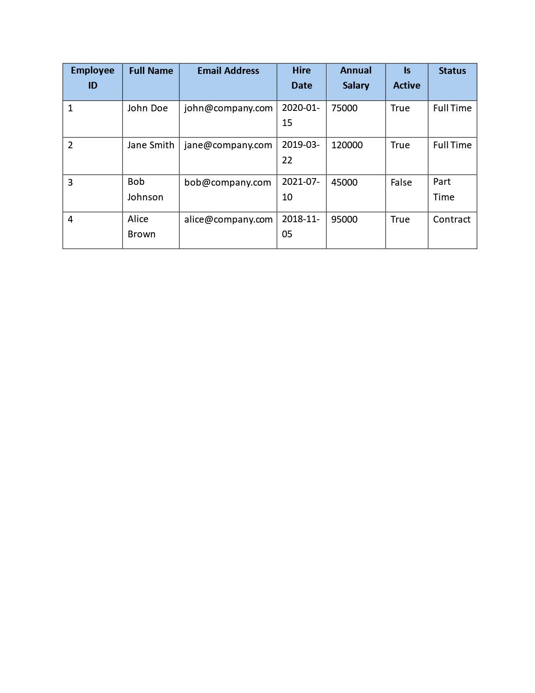 |  |  |

## table_borders

| Expected (Word) | Skia | ImageSharp |
| --- | --- | --- |
| **Page 1**&nbsp;&nbsp;&nbsp;&nbsp;&nbsp;&nbsp;&nbsp;&nbsp;&nbsp;&nbsp;&nbsp;&nbsp;&nbsp;&nbsp;&nbsp;&nbsp;&nbsp;&nbsp;&nbsp;&nbsp;&nbsp;&nbsp;&nbsp;&nbsp;&nbsp;&nbsp;&nbsp;&nbsp;&nbsp;&nbsp;&nbsp;&nbsp;&nbsp;&nbsp; | **Page 1. ErrorMetric: 0.0159 · SSIM: 0.9665** | **Page 1. ErrorMetric: 0.0161 · SSIM: 0.9663** |
|  |  |  |

## table_cell_margin_per_cell

| Expected (Word) | Skia | ImageSharp |
| --- | --- | --- |
| **Page 1**&nbsp;&nbsp;&nbsp;&nbsp;&nbsp;&nbsp;&nbsp;&nbsp;&nbsp;&nbsp;&nbsp;&nbsp;&nbsp;&nbsp;&nbsp;&nbsp;&nbsp;&nbsp;&nbsp;&nbsp;&nbsp;&nbsp;&nbsp;&nbsp;&nbsp;&nbsp;&nbsp;&nbsp;&nbsp;&nbsp;&nbsp;&nbsp;&nbsp;&nbsp; | **Page 1. ErrorMetric: 0.0111 · SSIM: 0.9764** | **Page 1. ErrorMetric: 0.0112 · SSIM: 0.9765** |
|  |  |  |

## table_cell_padding

| Expected (Word) | Skia | ImageSharp |
| --- | --- | --- |
| **Page 1**&nbsp;&nbsp;&nbsp;&nbsp;&nbsp;&nbsp;&nbsp;&nbsp;&nbsp;&nbsp;&nbsp;&nbsp;&nbsp;&nbsp;&nbsp;&nbsp;&nbsp;&nbsp;&nbsp;&nbsp;&nbsp;&nbsp;&nbsp;&nbsp;&nbsp;&nbsp;&nbsp;&nbsp;&nbsp;&nbsp;&nbsp;&nbsp;&nbsp;&nbsp; | **Page 1. ErrorMetric: 0.0332 · SSIM: 0.9273** | **Page 1. ErrorMetric: 0.0341 · SSIM: 0.9243** |
| 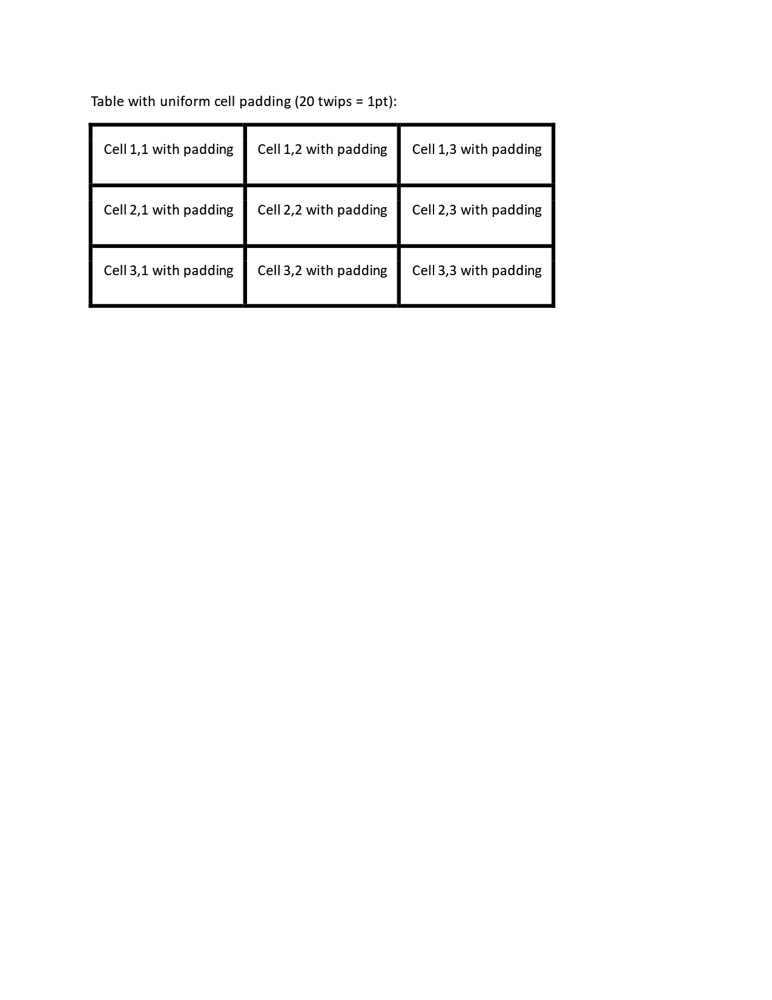 |  |  |

## table_cell_padding_varied

| Expected (Word) | Skia | ImageSharp |
| --- | --- | --- |
| **Page 1**&nbsp;&nbsp;&nbsp;&nbsp;&nbsp;&nbsp;&nbsp;&nbsp;&nbsp;&nbsp;&nbsp;&nbsp;&nbsp;&nbsp;&nbsp;&nbsp;&nbsp;&nbsp;&nbsp;&nbsp;&nbsp;&nbsp;&nbsp;&nbsp;&nbsp;&nbsp;&nbsp;&nbsp;&nbsp;&nbsp;&nbsp;&nbsp;&nbsp;&nbsp; | **Page 1. ErrorMetric: 0.0255 · SSIM: 0.9427** | **Page 1. ErrorMetric: 0.0257 · SSIM: 0.9425** |
| 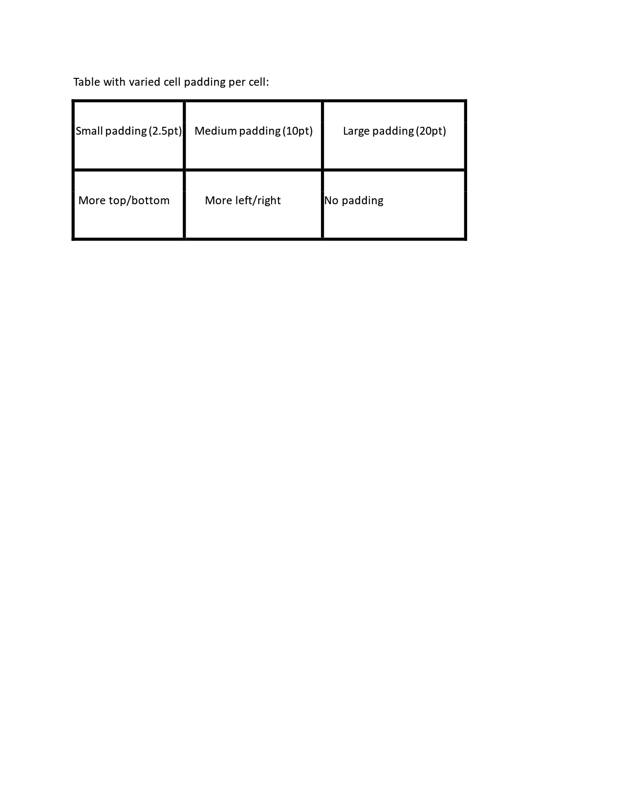 |  |  |

## table_cell_spacing/01

| Expected (Word) | Skia | ImageSharp |
| --- | --- | --- |
| **Page 1**&nbsp;&nbsp;&nbsp;&nbsp;&nbsp;&nbsp;&nbsp;&nbsp;&nbsp;&nbsp;&nbsp;&nbsp;&nbsp;&nbsp;&nbsp;&nbsp;&nbsp;&nbsp;&nbsp;&nbsp;&nbsp;&nbsp;&nbsp;&nbsp;&nbsp;&nbsp;&nbsp;&nbsp;&nbsp;&nbsp;&nbsp;&nbsp;&nbsp;&nbsp; | **Page 1. ErrorMetric: 0.0183 · SSIM: 0.9438** | **Page 1. ErrorMetric: 0.0184 · SSIM: 0.9438** |
|  |  |  |

## table_colors

| Expected (Word) | Skia | ImageSharp |
| --- | --- | --- |
| **Page 1**&nbsp;&nbsp;&nbsp;&nbsp;&nbsp;&nbsp;&nbsp;&nbsp;&nbsp;&nbsp;&nbsp;&nbsp;&nbsp;&nbsp;&nbsp;&nbsp;&nbsp;&nbsp;&nbsp;&nbsp;&nbsp;&nbsp;&nbsp;&nbsp;&nbsp;&nbsp;&nbsp;&nbsp;&nbsp;&nbsp;&nbsp;&nbsp;&nbsp;&nbsp; | **Page 1. ErrorMetric: 0.0166 · SSIM: 0.9696** | **Page 1. ErrorMetric: 0.0170 · SSIM: 0.9692** |
|  |  |  |

## table_default_cell_margin

| Expected (Word) | Skia | ImageSharp |
| --- | --- | --- |
| **Page 1**&nbsp;&nbsp;&nbsp;&nbsp;&nbsp;&nbsp;&nbsp;&nbsp;&nbsp;&nbsp;&nbsp;&nbsp;&nbsp;&nbsp;&nbsp;&nbsp;&nbsp;&nbsp;&nbsp;&nbsp;&nbsp;&nbsp;&nbsp;&nbsp;&nbsp;&nbsp;&nbsp;&nbsp;&nbsp;&nbsp;&nbsp;&nbsp;&nbsp;&nbsp; | **Page 1. ErrorMetric: 0.0179 · SSIM: 0.9603** | **Page 1. ErrorMetric: 0.0183 · SSIM: 0.9591** |
| 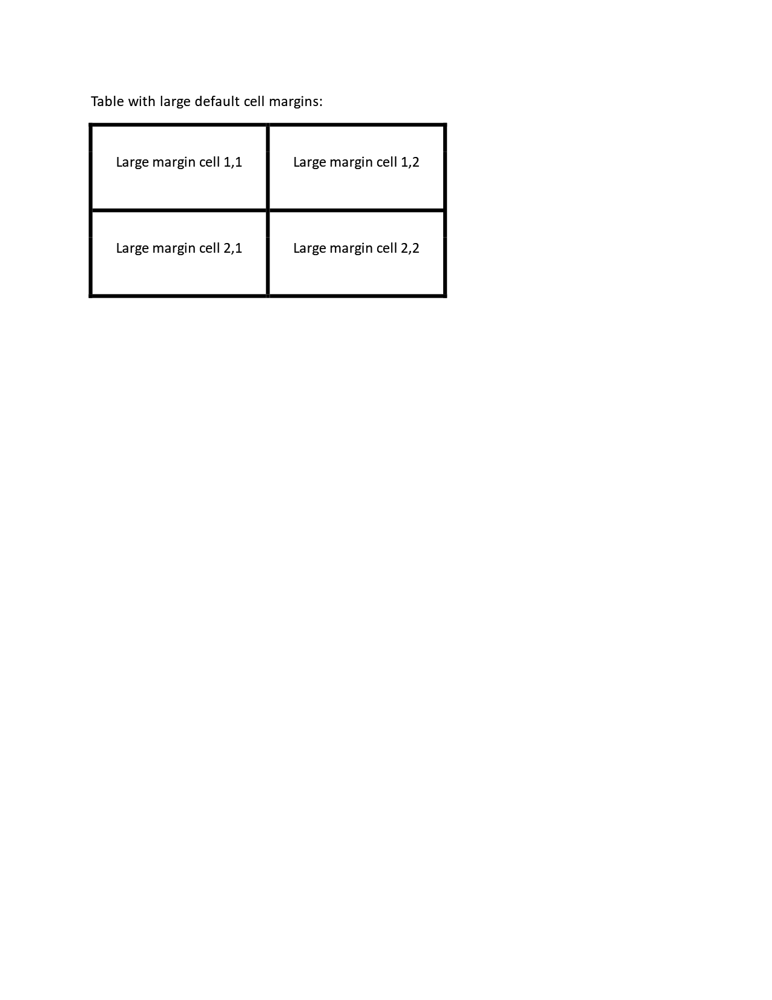 |  |  |

## table_default_cell_margin_start_end

| Expected (Word) | Skia | ImageSharp |
| --- | --- | --- |
| **Page 1**&nbsp;&nbsp;&nbsp;&nbsp;&nbsp;&nbsp;&nbsp;&nbsp;&nbsp;&nbsp;&nbsp;&nbsp;&nbsp;&nbsp;&nbsp;&nbsp;&nbsp;&nbsp;&nbsp;&nbsp;&nbsp;&nbsp;&nbsp;&nbsp;&nbsp;&nbsp;&nbsp;&nbsp;&nbsp;&nbsp;&nbsp;&nbsp;&nbsp;&nbsp; | **Page 1. ErrorMetric: 0.0104 · SSIM: 0.9783** | **Page 1. ErrorMetric: 0.0107 · SSIM: 0.9781** |
|  |  |  |

## table_default_style

| Expected (Word) | Skia | ImageSharp |
| --- | --- | --- |
| **Page 1**&nbsp;&nbsp;&nbsp;&nbsp;&nbsp;&nbsp;&nbsp;&nbsp;&nbsp;&nbsp;&nbsp;&nbsp;&nbsp;&nbsp;&nbsp;&nbsp;&nbsp;&nbsp;&nbsp;&nbsp;&nbsp;&nbsp;&nbsp;&nbsp;&nbsp;&nbsp;&nbsp;&nbsp;&nbsp;&nbsp;&nbsp;&nbsp;&nbsp;&nbsp; | **Page 1. ErrorMetric: 0.0529 · SSIM: 0.8936** | **Page 1. ErrorMetric: 0.0537 · SSIM: 0.8874** |
|  |  |  |

## table_default_style_first_row_run_color

| Expected (Word) | Skia | ImageSharp |
| --- | --- | --- |
| **Page 1**&nbsp;&nbsp;&nbsp;&nbsp;&nbsp;&nbsp;&nbsp;&nbsp;&nbsp;&nbsp;&nbsp;&nbsp;&nbsp;&nbsp;&nbsp;&nbsp;&nbsp;&nbsp;&nbsp;&nbsp;&nbsp;&nbsp;&nbsp;&nbsp;&nbsp;&nbsp;&nbsp;&nbsp;&nbsp;&nbsp;&nbsp;&nbsp;&nbsp;&nbsp; | **Page 1. ErrorMetric: 0.0008 · SSIM: 0.9987** | **Page 1. ErrorMetric: 0.0010 · SSIM: 0.9984** |
|  |  |  |

## table_default_style_first_row_shading

| Expected (Word) | Skia | ImageSharp |
| --- | --- | --- |
| **Page 1**&nbsp;&nbsp;&nbsp;&nbsp;&nbsp;&nbsp;&nbsp;&nbsp;&nbsp;&nbsp;&nbsp;&nbsp;&nbsp;&nbsp;&nbsp;&nbsp;&nbsp;&nbsp;&nbsp;&nbsp;&nbsp;&nbsp;&nbsp;&nbsp;&nbsp;&nbsp;&nbsp;&nbsp;&nbsp;&nbsp;&nbsp;&nbsp;&nbsp;&nbsp; | **Page 1. ErrorMetric: 0.0008 · SSIM: 0.9987** | **Page 1. ErrorMetric: 0.0010 · SSIM: 0.9984** |
|  |  |  |

## table_default_style_inside_h

| Expected (Word) | Skia | ImageSharp |
| --- | --- | --- |
| **Page 1**&nbsp;&nbsp;&nbsp;&nbsp;&nbsp;&nbsp;&nbsp;&nbsp;&nbsp;&nbsp;&nbsp;&nbsp;&nbsp;&nbsp;&nbsp;&nbsp;&nbsp;&nbsp;&nbsp;&nbsp;&nbsp;&nbsp;&nbsp;&nbsp;&nbsp;&nbsp;&nbsp;&nbsp;&nbsp;&nbsp;&nbsp;&nbsp;&nbsp;&nbsp; | **Page 1. ErrorMetric: 0.0009 · SSIM: 0.9983** | **Page 1. ErrorMetric: 0.0010 · SSIM: 0.9979** |
|  |  |  |

## table_default_style_outer_borders

| Expected (Word) | Skia | ImageSharp |
| --- | --- | --- |
| **Page 1**&nbsp;&nbsp;&nbsp;&nbsp;&nbsp;&nbsp;&nbsp;&nbsp;&nbsp;&nbsp;&nbsp;&nbsp;&nbsp;&nbsp;&nbsp;&nbsp;&nbsp;&nbsp;&nbsp;&nbsp;&nbsp;&nbsp;&nbsp;&nbsp;&nbsp;&nbsp;&nbsp;&nbsp;&nbsp;&nbsp;&nbsp;&nbsp;&nbsp;&nbsp; | **Page 1. ErrorMetric: 0.0009 · SSIM: 0.9977** | **Page 1. ErrorMetric: 0.0009 · SSIM: 0.9977** |
|  |  |  |

## table_diagonal_borders/01

| Expected (Word) | Skia | ImageSharp |
| --- | --- | --- |
| **Page 1**&nbsp;&nbsp;&nbsp;&nbsp;&nbsp;&nbsp;&nbsp;&nbsp;&nbsp;&nbsp;&nbsp;&nbsp;&nbsp;&nbsp;&nbsp;&nbsp;&nbsp;&nbsp;&nbsp;&nbsp;&nbsp;&nbsp;&nbsp;&nbsp;&nbsp;&nbsp;&nbsp;&nbsp;&nbsp;&nbsp;&nbsp;&nbsp;&nbsp;&nbsp; | **Page 1. ErrorMetric: 0.0062 · SSIM: 0.9866** | **Page 1. ErrorMetric: 0.0063 · SSIM: 0.9862** |
|  |  |  |

## table_explicit_heights

| Expected (Word) | Skia | ImageSharp |
| --- | --- | --- |
| **Page 1**&nbsp;&nbsp;&nbsp;&nbsp;&nbsp;&nbsp;&nbsp;&nbsp;&nbsp;&nbsp;&nbsp;&nbsp;&nbsp;&nbsp;&nbsp;&nbsp;&nbsp;&nbsp;&nbsp;&nbsp;&nbsp;&nbsp;&nbsp;&nbsp;&nbsp;&nbsp;&nbsp;&nbsp;&nbsp;&nbsp;&nbsp;&nbsp;&nbsp;&nbsp; | **Page 1. ErrorMetric: 0.0098 · SSIM: 0.9819** | **Page 1. ErrorMetric: 0.0106 · SSIM: 0.9788** |
|  |  |  |

## table_grid_styling_padding

| Expected (Word) | Skia | ImageSharp |
| --- | --- | --- |
| **Page 1**&nbsp;&nbsp;&nbsp;&nbsp;&nbsp;&nbsp;&nbsp;&nbsp;&nbsp;&nbsp;&nbsp;&nbsp;&nbsp;&nbsp;&nbsp;&nbsp;&nbsp;&nbsp;&nbsp;&nbsp;&nbsp;&nbsp;&nbsp;&nbsp;&nbsp;&nbsp;&nbsp;&nbsp;&nbsp;&nbsp;&nbsp;&nbsp;&nbsp;&nbsp; | **Page 1. ErrorMetric: 0.0335 · SSIM: 0.9256** | **Page 1. ErrorMetric: 0.0347 · SSIM: 0.9219** |
|  |  |  |

## table_indent

| Expected (Word) | Skia | ImageSharp |
| --- | --- | --- |
| **Page 1**&nbsp;&nbsp;&nbsp;&nbsp;&nbsp;&nbsp;&nbsp;&nbsp;&nbsp;&nbsp;&nbsp;&nbsp;&nbsp;&nbsp;&nbsp;&nbsp;&nbsp;&nbsp;&nbsp;&nbsp;&nbsp;&nbsp;&nbsp;&nbsp;&nbsp;&nbsp;&nbsp;&nbsp;&nbsp;&nbsp;&nbsp;&nbsp;&nbsp;&nbsp; | **Page 1. ErrorMetric: 0.0676 · SSIM: 0.8577** | **Page 1. ErrorMetric: 0.0686 · SSIM: 0.8531** |
| 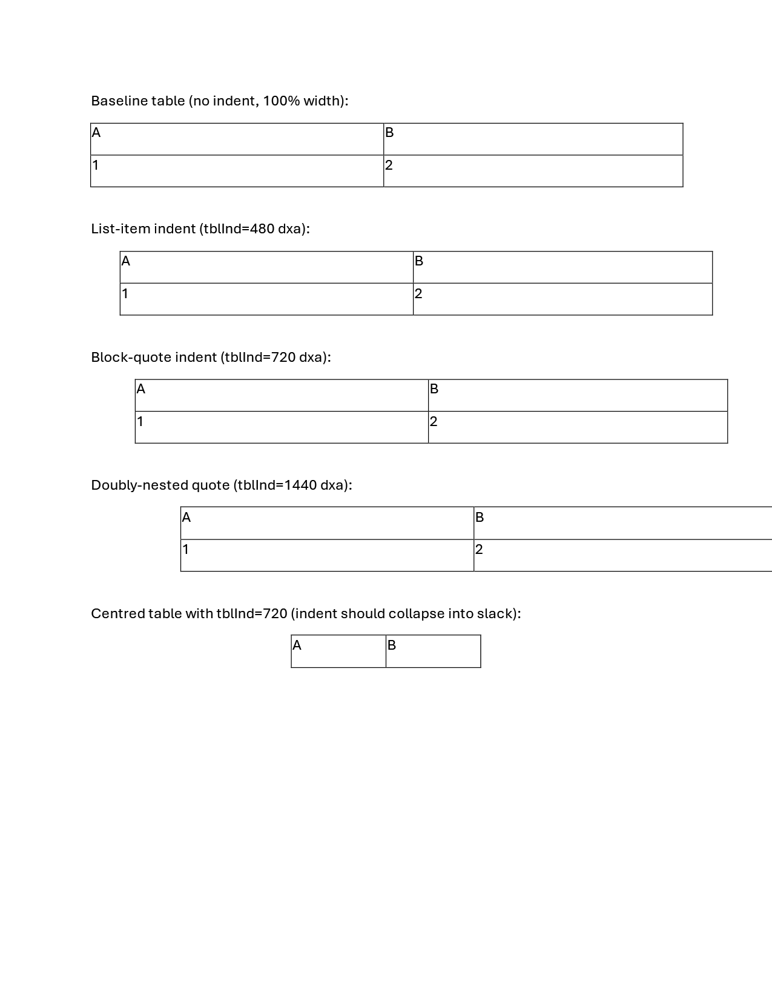 |  |  |

## table_layout_tall_row

| Expected (Word) | Skia | ImageSharp |
| --- | --- | --- |
| **Page 1**&nbsp;&nbsp;&nbsp;&nbsp;&nbsp;&nbsp;&nbsp;&nbsp;&nbsp;&nbsp;&nbsp;&nbsp;&nbsp;&nbsp;&nbsp;&nbsp;&nbsp;&nbsp;&nbsp;&nbsp;&nbsp;&nbsp;&nbsp;&nbsp;&nbsp;&nbsp;&nbsp;&nbsp;&nbsp;&nbsp;&nbsp;&nbsp;&nbsp;&nbsp; | **Page 1. ErrorMetric: 0.0042 · SSIM: 0.9917** | **Page 1. ErrorMetric: 0.0044 · SSIM: 0.9908** |
|  |  |  |
| **Page 2**&nbsp;&nbsp;&nbsp;&nbsp;&nbsp;&nbsp;&nbsp;&nbsp;&nbsp;&nbsp;&nbsp;&nbsp;&nbsp;&nbsp;&nbsp;&nbsp;&nbsp;&nbsp;&nbsp;&nbsp;&nbsp;&nbsp;&nbsp;&nbsp;&nbsp;&nbsp;&nbsp;&nbsp;&nbsp;&nbsp;&nbsp;&nbsp;&nbsp;&nbsp; | **Page 2. ErrorMetric: 0.0310 · SSIM: 0.9104** | **Page 2. ErrorMetric: 0.0314 · SSIM: 0.9092** |
|  |  |  |

## table_multipage

| Expected (Word) | Skia | ImageSharp |
| --- | --- | --- |
| **Page 1**&nbsp;&nbsp;&nbsp;&nbsp;&nbsp;&nbsp;&nbsp;&nbsp;&nbsp;&nbsp;&nbsp;&nbsp;&nbsp;&nbsp;&nbsp;&nbsp;&nbsp;&nbsp;&nbsp;&nbsp;&nbsp;&nbsp;&nbsp;&nbsp;&nbsp;&nbsp;&nbsp;&nbsp;&nbsp;&nbsp;&nbsp;&nbsp;&nbsp;&nbsp; | **Page 1. ErrorMetric: 0.1113 · SSIM: 0.7848** | **Page 1. ErrorMetric: 0.1128 · SSIM: 0.7821** |
| 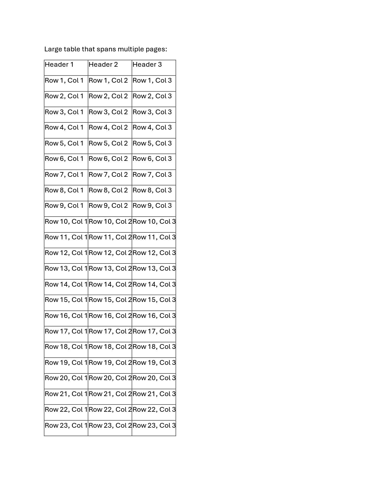 |  |  |
| **Page 2**&nbsp;&nbsp;&nbsp;&nbsp;&nbsp;&nbsp;&nbsp;&nbsp;&nbsp;&nbsp;&nbsp;&nbsp;&nbsp;&nbsp;&nbsp;&nbsp;&nbsp;&nbsp;&nbsp;&nbsp;&nbsp;&nbsp;&nbsp;&nbsp;&nbsp;&nbsp;&nbsp;&nbsp;&nbsp;&nbsp;&nbsp;&nbsp;&nbsp;&nbsp; | **Page 2. ErrorMetric: 0.0382 · SSIM: 0.9349** | **Page 2. ErrorMetric: 0.0401 · SSIM: 0.9304** |
| 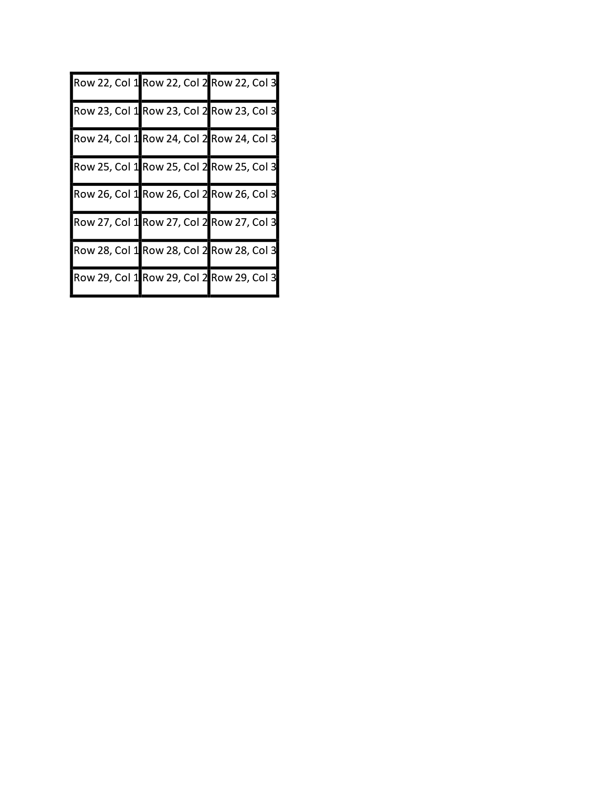 |  |  |

## table_of_contents/01

| Expected (Word) | Skia | ImageSharp |
| --- | --- | --- |
| **Page 1**&nbsp;&nbsp;&nbsp;&nbsp;&nbsp;&nbsp;&nbsp;&nbsp;&nbsp;&nbsp;&nbsp;&nbsp;&nbsp;&nbsp;&nbsp;&nbsp;&nbsp;&nbsp;&nbsp;&nbsp;&nbsp;&nbsp;&nbsp;&nbsp;&nbsp;&nbsp;&nbsp;&nbsp;&nbsp;&nbsp;&nbsp;&nbsp;&nbsp;&nbsp; | **Page 1. ErrorMetric: 0.0118 · SSIM: 0.9672** | **Page 1. ErrorMetric: 0.0125 · SSIM: 0.9599** |
|  |  |  |

## table_of_contents/02

| Expected (Word) | Skia | ImageSharp |
| --- | --- | --- |
| **Page 1**&nbsp;&nbsp;&nbsp;&nbsp;&nbsp;&nbsp;&nbsp;&nbsp;&nbsp;&nbsp;&nbsp;&nbsp;&nbsp;&nbsp;&nbsp;&nbsp;&nbsp;&nbsp;&nbsp;&nbsp;&nbsp;&nbsp;&nbsp;&nbsp;&nbsp;&nbsp;&nbsp;&nbsp;&nbsp;&nbsp;&nbsp;&nbsp;&nbsp;&nbsp; | **Page 1. ErrorMetric: 0.0114 · SSIM: 0.9763** | **Page 1. ErrorMetric: 0.0106 · SSIM: 0.9775** |
|  |  |  |

## table_of_contents/03

| Expected (Word) | Skia | ImageSharp |
| --- | --- | --- |
| **Page 1**&nbsp;&nbsp;&nbsp;&nbsp;&nbsp;&nbsp;&nbsp;&nbsp;&nbsp;&nbsp;&nbsp;&nbsp;&nbsp;&nbsp;&nbsp;&nbsp;&nbsp;&nbsp;&nbsp;&nbsp;&nbsp;&nbsp;&nbsp;&nbsp;&nbsp;&nbsp;&nbsp;&nbsp;&nbsp;&nbsp;&nbsp;&nbsp;&nbsp;&nbsp; | **Page 1. ErrorMetric: 0.0119 · SSIM: 0.9735** | **Page 1. ErrorMetric: 0.0126 · SSIM: 0.9684** |
|  |  |  |

## table_page_break

| Expected (Word) | Skia | ImageSharp |
| --- | --- | --- |
| **Page 1**&nbsp;&nbsp;&nbsp;&nbsp;&nbsp;&nbsp;&nbsp;&nbsp;&nbsp;&nbsp;&nbsp;&nbsp;&nbsp;&nbsp;&nbsp;&nbsp;&nbsp;&nbsp;&nbsp;&nbsp;&nbsp;&nbsp;&nbsp;&nbsp;&nbsp;&nbsp;&nbsp;&nbsp;&nbsp;&nbsp;&nbsp;&nbsp;&nbsp;&nbsp; | **Page 1. ErrorMetric: 0.0590 · SSIM: 0.8958** | **Page 1. ErrorMetric: 0.0648 · SSIM: 0.8739** |
|  |  |  |
| **Page 2**&nbsp;&nbsp;&nbsp;&nbsp;&nbsp;&nbsp;&nbsp;&nbsp;&nbsp;&nbsp;&nbsp;&nbsp;&nbsp;&nbsp;&nbsp;&nbsp;&nbsp;&nbsp;&nbsp;&nbsp;&nbsp;&nbsp;&nbsp;&nbsp;&nbsp;&nbsp;&nbsp;&nbsp;&nbsp;&nbsp;&nbsp;&nbsp;&nbsp;&nbsp; | **Page 2. ErrorMetric: 0.0097 · SSIM: 0.9813** | **Page 2. ErrorMetric: 0.0105 · SSIM: 0.9785** |
|  |  |  |
| **Page 3**&nbsp;&nbsp;&nbsp;&nbsp;&nbsp;&nbsp;&nbsp;&nbsp;&nbsp;&nbsp;&nbsp;&nbsp;&nbsp;&nbsp;&nbsp;&nbsp;&nbsp;&nbsp;&nbsp;&nbsp;&nbsp;&nbsp;&nbsp;&nbsp;&nbsp;&nbsp;&nbsp;&nbsp;&nbsp;&nbsp;&nbsp;&nbsp;&nbsp;&nbsp; | **Page 3. ErrorMetric: 0.0051 · SSIM: 0.9903** | **Page 3. ErrorMetric: 0.0054 · SSIM: 0.9894** |
|  |  |  |

## table_text_direction

| Expected (Word) | Skia | ImageSharp |
| --- | --- | --- |
| **Page 1**&nbsp;&nbsp;&nbsp;&nbsp;&nbsp;&nbsp;&nbsp;&nbsp;&nbsp;&nbsp;&nbsp;&nbsp;&nbsp;&nbsp;&nbsp;&nbsp;&nbsp;&nbsp;&nbsp;&nbsp;&nbsp;&nbsp;&nbsp;&nbsp;&nbsp;&nbsp;&nbsp;&nbsp;&nbsp;&nbsp;&nbsp;&nbsp;&nbsp;&nbsp; | **Page 1. ErrorMetric: 0.0221 · SSIM: 0.9578** | **Page 1. ErrorMetric: 0.0221 · SSIM: 0.9579** |
|  |  |  |

## table_two_column_layout

| Expected (Word) | Skia | ImageSharp |
| --- | --- | --- |
| **Page 1**&nbsp;&nbsp;&nbsp;&nbsp;&nbsp;&nbsp;&nbsp;&nbsp;&nbsp;&nbsp;&nbsp;&nbsp;&nbsp;&nbsp;&nbsp;&nbsp;&nbsp;&nbsp;&nbsp;&nbsp;&nbsp;&nbsp;&nbsp;&nbsp;&nbsp;&nbsp;&nbsp;&nbsp;&nbsp;&nbsp;&nbsp;&nbsp;&nbsp;&nbsp; | **Page 1. ErrorMetric: 0.0264 · SSIM: 0.9449** | **Page 1. ErrorMetric: 0.0270 · SSIM: 0.9427** |
|  |  |  |

## table_vmerge_basic

| Expected (Word) | Skia | ImageSharp |
| --- | --- | --- |
| **Page 1**&nbsp;&nbsp;&nbsp;&nbsp;&nbsp;&nbsp;&nbsp;&nbsp;&nbsp;&nbsp;&nbsp;&nbsp;&nbsp;&nbsp;&nbsp;&nbsp;&nbsp;&nbsp;&nbsp;&nbsp;&nbsp;&nbsp;&nbsp;&nbsp;&nbsp;&nbsp;&nbsp;&nbsp;&nbsp;&nbsp;&nbsp;&nbsp;&nbsp;&nbsp; | **Page 1. ErrorMetric: 0.0056 · SSIM: 0.9906** | **Page 1. ErrorMetric: 0.0060 · SSIM: 0.9888** |
| 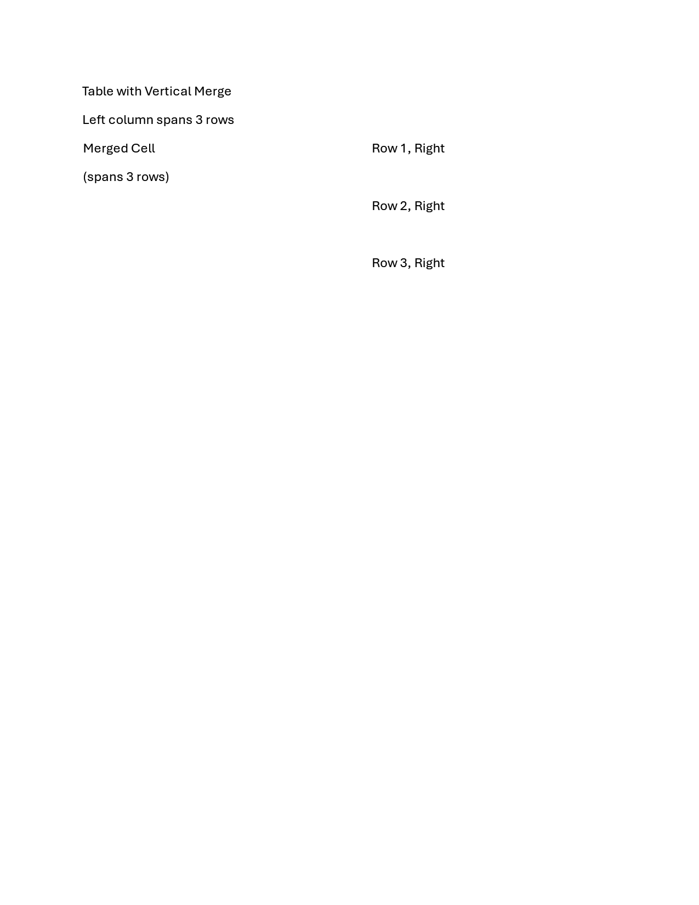 |  |  |

## table_vmerge_explicit_heights

| Expected (Word) | Skia | ImageSharp |
| --- | --- | --- |
| **Page 1**&nbsp;&nbsp;&nbsp;&nbsp;&nbsp;&nbsp;&nbsp;&nbsp;&nbsp;&nbsp;&nbsp;&nbsp;&nbsp;&nbsp;&nbsp;&nbsp;&nbsp;&nbsp;&nbsp;&nbsp;&nbsp;&nbsp;&nbsp;&nbsp;&nbsp;&nbsp;&nbsp;&nbsp;&nbsp;&nbsp;&nbsp;&nbsp;&nbsp;&nbsp; | **Page 1. ErrorMetric: 0.0097 · SSIM: 0.9815** | **Page 1. ErrorMetric: 0.0104 · SSIM: 0.9793** |
|  |  |  |

## tab_stops

| Expected (Word) | Skia | ImageSharp |
| --- | --- | --- |
| **Page 1**&nbsp;&nbsp;&nbsp;&nbsp;&nbsp;&nbsp;&nbsp;&nbsp;&nbsp;&nbsp;&nbsp;&nbsp;&nbsp;&nbsp;&nbsp;&nbsp;&nbsp;&nbsp;&nbsp;&nbsp;&nbsp;&nbsp;&nbsp;&nbsp;&nbsp;&nbsp;&nbsp;&nbsp;&nbsp;&nbsp;&nbsp;&nbsp;&nbsp;&nbsp; | **Page 1. ErrorMetric: 0.0146 · SSIM: 0.9703** | **Page 1. ErrorMetric: 0.0163 · SSIM: 0.9637** |
|  |  |  |

## text_wrapping_break

| Expected (Word) | Skia | ImageSharp |
| --- | --- | --- |
| **Page 1**&nbsp;&nbsp;&nbsp;&nbsp;&nbsp;&nbsp;&nbsp;&nbsp;&nbsp;&nbsp;&nbsp;&nbsp;&nbsp;&nbsp;&nbsp;&nbsp;&nbsp;&nbsp;&nbsp;&nbsp;&nbsp;&nbsp;&nbsp;&nbsp;&nbsp;&nbsp;&nbsp;&nbsp;&nbsp;&nbsp;&nbsp;&nbsp;&nbsp;&nbsp; | **Page 1. ErrorMetric: 0.0046 · SSIM: 0.9932** | **Page 1. ErrorMetric: 0.0053 · SSIM: 0.9897** |
|  |  |  |

## three_columns

| Expected (Word) | Skia | ImageSharp |
| --- | --- | --- |
| **Page 1**&nbsp;&nbsp;&nbsp;&nbsp;&nbsp;&nbsp;&nbsp;&nbsp;&nbsp;&nbsp;&nbsp;&nbsp;&nbsp;&nbsp;&nbsp;&nbsp;&nbsp;&nbsp;&nbsp;&nbsp;&nbsp;&nbsp;&nbsp;&nbsp;&nbsp;&nbsp;&nbsp;&nbsp;&nbsp;&nbsp;&nbsp;&nbsp;&nbsp;&nbsp; | **Page 1. ErrorMetric: 0.0547 · SSIM: 0.9012** | **Page 1. ErrorMetric: 0.0596 · SSIM: 0.8783** |
|  |  |  |

## tracked_changes/01

| Expected (Word) | Skia | ImageSharp |
| --- | --- | --- |
| **Page 1**&nbsp;&nbsp;&nbsp;&nbsp;&nbsp;&nbsp;&nbsp;&nbsp;&nbsp;&nbsp;&nbsp;&nbsp;&nbsp;&nbsp;&nbsp;&nbsp;&nbsp;&nbsp;&nbsp;&nbsp;&nbsp;&nbsp;&nbsp;&nbsp;&nbsp;&nbsp;&nbsp;&nbsp;&nbsp;&nbsp;&nbsp;&nbsp;&nbsp;&nbsp; | **Page 1. ErrorMetric: 0.0018 · SSIM: 0.9969** | **Page 1. ErrorMetric: 0.0018 · SSIM: 0.9967** |
|  |  |  |

## two_columns

| Expected (Word) | Skia | ImageSharp |
| --- | --- | --- |
| **Page 1**&nbsp;&nbsp;&nbsp;&nbsp;&nbsp;&nbsp;&nbsp;&nbsp;&nbsp;&nbsp;&nbsp;&nbsp;&nbsp;&nbsp;&nbsp;&nbsp;&nbsp;&nbsp;&nbsp;&nbsp;&nbsp;&nbsp;&nbsp;&nbsp;&nbsp;&nbsp;&nbsp;&nbsp;&nbsp;&nbsp;&nbsp;&nbsp;&nbsp;&nbsp; | **Page 1. ErrorMetric: 0.1134 · SSIM: 0.7894** | **Page 1. ErrorMetric: 0.1274 · SSIM: 0.7312** |
| 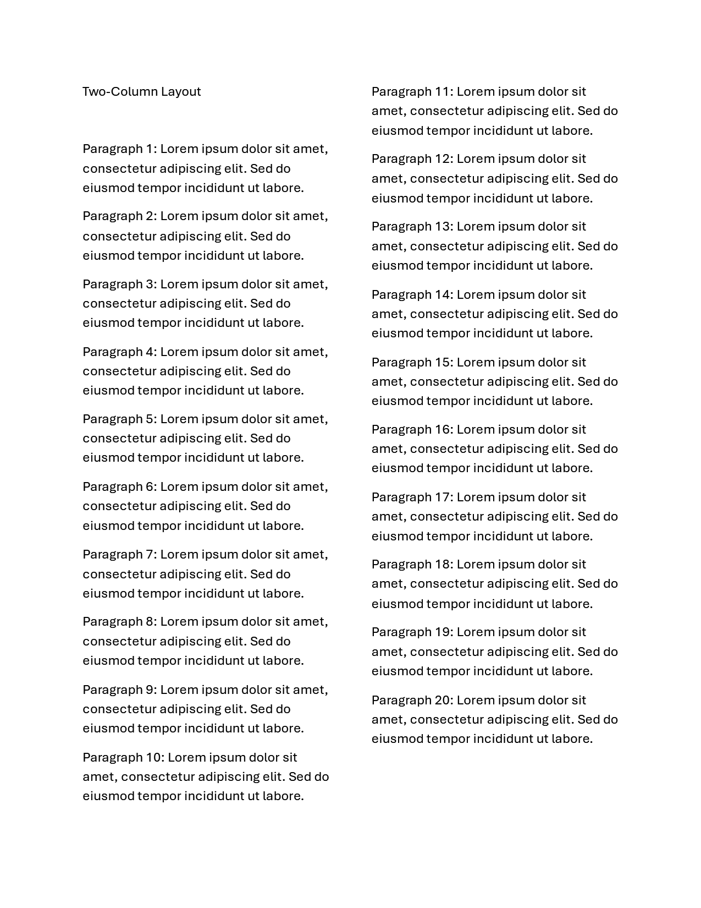 |  |  |

## underline_text

| Expected (Word) | Skia | ImageSharp |
| --- | --- | --- |
| **Page 1**&nbsp;&nbsp;&nbsp;&nbsp;&nbsp;&nbsp;&nbsp;&nbsp;&nbsp;&nbsp;&nbsp;&nbsp;&nbsp;&nbsp;&nbsp;&nbsp;&nbsp;&nbsp;&nbsp;&nbsp;&nbsp;&nbsp;&nbsp;&nbsp;&nbsp;&nbsp;&nbsp;&nbsp;&nbsp;&nbsp;&nbsp;&nbsp;&nbsp;&nbsp; | **Page 1. ErrorMetric: 0.0026 · SSIM: 0.9951** | **Page 1. ErrorMetric: 0.0027 · SSIM: 0.9949** |
|  |  |  |

## wedding/01

| Expected (Word) | Skia | ImageSharp |
| --- | --- | --- |
| **Page 1**&nbsp;&nbsp;&nbsp;&nbsp;&nbsp;&nbsp;&nbsp;&nbsp;&nbsp;&nbsp;&nbsp;&nbsp;&nbsp;&nbsp;&nbsp;&nbsp;&nbsp;&nbsp;&nbsp;&nbsp;&nbsp;&nbsp;&nbsp;&nbsp;&nbsp;&nbsp;&nbsp;&nbsp;&nbsp;&nbsp;&nbsp;&nbsp;&nbsp;&nbsp; | **Page 1. ErrorMetric: 0.5513 · SSIM: 0.5353** | **Page 1. ErrorMetric: 0.5539 · SSIM: 0.5341** |
|  |  |  |

## wedding/02

| Expected (Word) | Skia | ImageSharp |
| --- | --- | --- |
| **Page 1**&nbsp;&nbsp;&nbsp;&nbsp;&nbsp;&nbsp;&nbsp;&nbsp;&nbsp;&nbsp;&nbsp;&nbsp;&nbsp;&nbsp;&nbsp;&nbsp;&nbsp;&nbsp;&nbsp;&nbsp;&nbsp;&nbsp;&nbsp;&nbsp;&nbsp;&nbsp;&nbsp;&nbsp;&nbsp;&nbsp;&nbsp;&nbsp;&nbsp;&nbsp; | **Page 1. ErrorMetric: 0.1015 · SSIM: 0.8992** | **Page 1. ErrorMetric: 0.0806 · SSIM: 0.9502** |
|  |  |  |
| **Page 2**&nbsp;&nbsp;&nbsp;&nbsp;&nbsp;&nbsp;&nbsp;&nbsp;&nbsp;&nbsp;&nbsp;&nbsp;&nbsp;&nbsp;&nbsp;&nbsp;&nbsp;&nbsp;&nbsp;&nbsp;&nbsp;&nbsp;&nbsp;&nbsp;&nbsp;&nbsp;&nbsp;&nbsp;&nbsp;&nbsp;&nbsp;&nbsp;&nbsp;&nbsp; | **Page 2. ErrorMetric: 0.0931 · SSIM: 0.9205** | **Page 2. ErrorMetric: 0.0857 · SSIM: 0.9435** |
|  |  |  |

## wedding/03

| Expected (Word) | Skia | ImageSharp |
| --- | --- | --- |
| **Page 1**&nbsp;&nbsp;&nbsp;&nbsp;&nbsp;&nbsp;&nbsp;&nbsp;&nbsp;&nbsp;&nbsp;&nbsp;&nbsp;&nbsp;&nbsp;&nbsp;&nbsp;&nbsp;&nbsp;&nbsp;&nbsp;&nbsp;&nbsp;&nbsp;&nbsp;&nbsp;&nbsp;&nbsp;&nbsp;&nbsp;&nbsp;&nbsp;&nbsp;&nbsp; | **Page 1. ErrorMetric: 0.3787 · SSIM: 0.8909** | **Page 1. ErrorMetric: 0.3810 · SSIM: 0.8824** |
|  |  |  |
| **Page 2**&nbsp;&nbsp;&nbsp;&nbsp;&nbsp;&nbsp;&nbsp;&nbsp;&nbsp;&nbsp;&nbsp;&nbsp;&nbsp;&nbsp;&nbsp;&nbsp;&nbsp;&nbsp;&nbsp;&nbsp;&nbsp;&nbsp;&nbsp;&nbsp;&nbsp;&nbsp;&nbsp;&nbsp;&nbsp;&nbsp;&nbsp;&nbsp;&nbsp;&nbsp; | **Page 2. ErrorMetric: 0.0158 · SSIM: 0.9672** | **Page 2. ErrorMetric: 0.0168 · SSIM: 0.9599** |
|  |  |  |

## wedding/04

| Expected (Word) | Skia | ImageSharp |
| --- | --- | --- |
| **Page 1**&nbsp;&nbsp;&nbsp;&nbsp;&nbsp;&nbsp;&nbsp;&nbsp;&nbsp;&nbsp;&nbsp;&nbsp;&nbsp;&nbsp;&nbsp;&nbsp;&nbsp;&nbsp;&nbsp;&nbsp;&nbsp;&nbsp;&nbsp;&nbsp;&nbsp;&nbsp;&nbsp;&nbsp;&nbsp;&nbsp;&nbsp;&nbsp;&nbsp;&nbsp; | **Page 1. ErrorMetric: 0.1474 · SSIM: 0.7358** | **Page 1. ErrorMetric: 0.1584 · SSIM: 0.7272** |
|  |  |  |
| **Page 2**&nbsp;&nbsp;&nbsp;&nbsp;&nbsp;&nbsp;&nbsp;&nbsp;&nbsp;&nbsp;&nbsp;&nbsp;&nbsp;&nbsp;&nbsp;&nbsp;&nbsp;&nbsp;&nbsp;&nbsp;&nbsp;&nbsp;&nbsp;&nbsp;&nbsp;&nbsp;&nbsp;&nbsp;&nbsp;&nbsp;&nbsp;&nbsp;&nbsp;&nbsp; | **Page 2. ErrorMetric: 0.0839 · SSIM: 0.8199** | **Page 2. ErrorMetric: 0.0795 · SSIM: 0.8226** |
|  |  |  |

## wedding/05

| Expected (Word) | Skia | ImageSharp |
| --- | --- | --- |
| **Page 1**&nbsp;&nbsp;&nbsp;&nbsp;&nbsp;&nbsp;&nbsp;&nbsp;&nbsp;&nbsp;&nbsp;&nbsp;&nbsp;&nbsp;&nbsp;&nbsp;&nbsp;&nbsp;&nbsp;&nbsp;&nbsp;&nbsp;&nbsp;&nbsp;&nbsp;&nbsp;&nbsp;&nbsp;&nbsp;&nbsp;&nbsp;&nbsp;&nbsp;&nbsp; | **Page 1. ErrorMetric: 0.1499 · SSIM: 0.9131** | **Page 1. ErrorMetric: 0.1742 · SSIM: 0.8918** |
|  |  |  |
| **Page 2**&nbsp;&nbsp;&nbsp;&nbsp;&nbsp;&nbsp;&nbsp;&nbsp;&nbsp;&nbsp;&nbsp;&nbsp;&nbsp;&nbsp;&nbsp;&nbsp;&nbsp;&nbsp;&nbsp;&nbsp;&nbsp;&nbsp;&nbsp;&nbsp;&nbsp;&nbsp;&nbsp;&nbsp;&nbsp;&nbsp;&nbsp;&nbsp;&nbsp;&nbsp; | **Page 2. ErrorMetric: 0.1800 · SSIM: 0.9259** | **Page 2. ErrorMetric: 0.1528 · SSIM: 0.9154** |
|  |  |  |

## wedding/06

| Expected (Word) | Skia | ImageSharp |
| --- | --- | --- |
| **Page 1**&nbsp;&nbsp;&nbsp;&nbsp;&nbsp;&nbsp;&nbsp;&nbsp;&nbsp;&nbsp;&nbsp;&nbsp;&nbsp;&nbsp;&nbsp;&nbsp;&nbsp;&nbsp;&nbsp;&nbsp;&nbsp;&nbsp;&nbsp;&nbsp;&nbsp;&nbsp;&nbsp;&nbsp;&nbsp;&nbsp;&nbsp;&nbsp;&nbsp;&nbsp; | **Page 1. ErrorMetric: 0.1194 · SSIM: 0.9119** | **Page 1. ErrorMetric: 0.1128 · SSIM: 0.9338** |
|  |  |  |
| **Page 2**&nbsp;&nbsp;&nbsp;&nbsp;&nbsp;&nbsp;&nbsp;&nbsp;&nbsp;&nbsp;&nbsp;&nbsp;&nbsp;&nbsp;&nbsp;&nbsp;&nbsp;&nbsp;&nbsp;&nbsp;&nbsp;&nbsp;&nbsp;&nbsp;&nbsp;&nbsp;&nbsp;&nbsp;&nbsp;&nbsp;&nbsp;&nbsp;&nbsp;&nbsp; | **Page 2. ErrorMetric: 0.0742 · SSIM: 0.8840** | **Page 2. ErrorMetric: 0.0754 · SSIM: 0.8788** |
|  |  |  |

## wedding/07

| Expected (Word) | Skia | ImageSharp |
| --- | --- | --- |
| **Page 1**&nbsp;&nbsp;&nbsp;&nbsp;&nbsp;&nbsp;&nbsp;&nbsp;&nbsp;&nbsp;&nbsp;&nbsp;&nbsp;&nbsp;&nbsp;&nbsp;&nbsp;&nbsp;&nbsp;&nbsp;&nbsp;&nbsp;&nbsp;&nbsp;&nbsp;&nbsp;&nbsp;&nbsp;&nbsp;&nbsp;&nbsp;&nbsp;&nbsp;&nbsp; | **Page 1. ErrorMetric: 0.1208 · SSIM: 0.9660** | **Page 1. ErrorMetric: 0.1344 · SSIM: 0.9295** |
|  |  |  |

## wedding/08

| Expected (Word) | Skia | ImageSharp |
| --- | --- | --- |
| **Page 1**&nbsp;&nbsp;&nbsp;&nbsp;&nbsp;&nbsp;&nbsp;&nbsp;&nbsp;&nbsp;&nbsp;&nbsp;&nbsp;&nbsp;&nbsp;&nbsp;&nbsp;&nbsp;&nbsp;&nbsp;&nbsp;&nbsp;&nbsp;&nbsp;&nbsp;&nbsp;&nbsp;&nbsp;&nbsp;&nbsp;&nbsp;&nbsp;&nbsp;&nbsp; | **Page 1. ErrorMetric: 0.0805 · SSIM: 0.8542** | **Page 1. ErrorMetric: 0.0808 · SSIM: 0.8543** |
|  |  |  |
| **Page 2**&nbsp;&nbsp;&nbsp;&nbsp;&nbsp;&nbsp;&nbsp;&nbsp;&nbsp;&nbsp;&nbsp;&nbsp;&nbsp;&nbsp;&nbsp;&nbsp;&nbsp;&nbsp;&nbsp;&nbsp;&nbsp;&nbsp;&nbsp;&nbsp;&nbsp;&nbsp;&nbsp;&nbsp;&nbsp;&nbsp;&nbsp;&nbsp;&nbsp;&nbsp; | **Page 2. ErrorMetric: 0.0510 · SSIM: 0.8866** | **Page 2. ErrorMetric: 0.0510 · SSIM: 0.8867** |
| 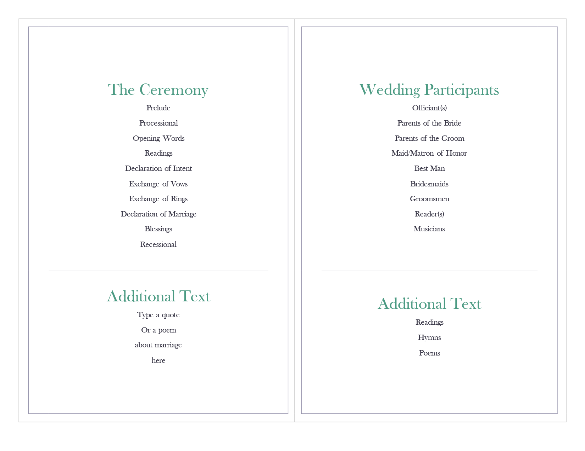 |  |  |

## wedding/09

| Expected (Word) | Skia | ImageSharp |
| --- | --- | --- |
| **Page 1**&nbsp;&nbsp;&nbsp;&nbsp;&nbsp;&nbsp;&nbsp;&nbsp;&nbsp;&nbsp;&nbsp;&nbsp;&nbsp;&nbsp;&nbsp;&nbsp;&nbsp;&nbsp;&nbsp;&nbsp;&nbsp;&nbsp;&nbsp;&nbsp;&nbsp;&nbsp;&nbsp;&nbsp;&nbsp;&nbsp;&nbsp;&nbsp;&nbsp;&nbsp; | **Page 1. ErrorMetric: 0.2125 · SSIM: 0.8960** | **Page 1. ErrorMetric: 0.2052 · SSIM: 0.9166** |
|  |  |  |
| **Page 2**&nbsp;&nbsp;&nbsp;&nbsp;&nbsp;&nbsp;&nbsp;&nbsp;&nbsp;&nbsp;&nbsp;&nbsp;&nbsp;&nbsp;&nbsp;&nbsp;&nbsp;&nbsp;&nbsp;&nbsp;&nbsp;&nbsp;&nbsp;&nbsp;&nbsp;&nbsp;&nbsp;&nbsp;&nbsp;&nbsp;&nbsp;&nbsp;&nbsp;&nbsp; | **Page 2. ErrorMetric: 0.0626 · SSIM: 0.9236** | **Page 2. ErrorMetric: 0.0583 · SSIM: 0.9334** |
| 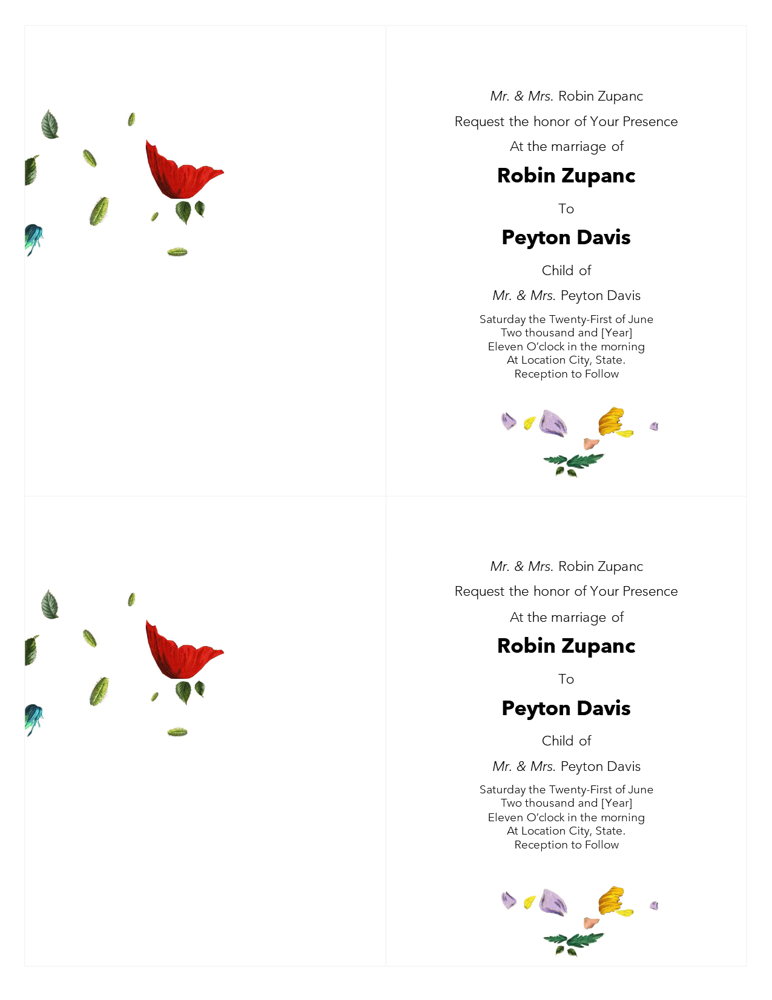 |  |  |

## wedding/10

| Expected (Word) | Skia | ImageSharp |
| --- | --- | --- |
| **Page 1**&nbsp;&nbsp;&nbsp;&nbsp;&nbsp;&nbsp;&nbsp;&nbsp;&nbsp;&nbsp;&nbsp;&nbsp;&nbsp;&nbsp;&nbsp;&nbsp;&nbsp;&nbsp;&nbsp;&nbsp;&nbsp;&nbsp;&nbsp;&nbsp;&nbsp;&nbsp;&nbsp;&nbsp;&nbsp;&nbsp;&nbsp;&nbsp;&nbsp;&nbsp; | **Page 1. ErrorMetric: 0.0925 · SSIM: 0.8769** | **Page 1. ErrorMetric: 0.1191 · SSIM: 0.8310** |
|  |  |  |
| **Page 2**&nbsp;&nbsp;&nbsp;&nbsp;&nbsp;&nbsp;&nbsp;&nbsp;&nbsp;&nbsp;&nbsp;&nbsp;&nbsp;&nbsp;&nbsp;&nbsp;&nbsp;&nbsp;&nbsp;&nbsp;&nbsp;&nbsp;&nbsp;&nbsp;&nbsp;&nbsp;&nbsp;&nbsp;&nbsp;&nbsp;&nbsp;&nbsp;&nbsp;&nbsp; | **Page 2. ErrorMetric: 0.0409 · SSIM: 0.9261** | **Page 2. ErrorMetric: 0.0487 · SSIM: 0.8908** |
|  |  |  |
| **Page 3**&nbsp;&nbsp;&nbsp;&nbsp;&nbsp;&nbsp;&nbsp;&nbsp;&nbsp;&nbsp;&nbsp;&nbsp;&nbsp;&nbsp;&nbsp;&nbsp;&nbsp;&nbsp;&nbsp;&nbsp;&nbsp;&nbsp;&nbsp;&nbsp;&nbsp;&nbsp;&nbsp;&nbsp;&nbsp;&nbsp;&nbsp;&nbsp;&nbsp;&nbsp; | **Page 3. ErrorMetric: 0.0410 · SSIM: 0.9298** | **Page 3. ErrorMetric: 0.0491 · SSIM: 0.8882** |
|  |  |  |
| **Page 4**&nbsp;&nbsp;&nbsp;&nbsp;&nbsp;&nbsp;&nbsp;&nbsp;&nbsp;&nbsp;&nbsp;&nbsp;&nbsp;&nbsp;&nbsp;&nbsp;&nbsp;&nbsp;&nbsp;&nbsp;&nbsp;&nbsp;&nbsp;&nbsp;&nbsp;&nbsp;&nbsp;&nbsp;&nbsp;&nbsp;&nbsp;&nbsp;&nbsp;&nbsp; | **Page 4. ErrorMetric: 0.0450 · SSIM: 0.9205** | **Page 4. ErrorMetric: 0.0529 · SSIM: 0.8805** |
|  |  |  |
| **Page 5**&nbsp;&nbsp;&nbsp;&nbsp;&nbsp;&nbsp;&nbsp;&nbsp;&nbsp;&nbsp;&nbsp;&nbsp;&nbsp;&nbsp;&nbsp;&nbsp;&nbsp;&nbsp;&nbsp;&nbsp;&nbsp;&nbsp;&nbsp;&nbsp;&nbsp;&nbsp;&nbsp;&nbsp;&nbsp;&nbsp;&nbsp;&nbsp;&nbsp;&nbsp; | **Page 5. ErrorMetric: 0.0323 · SSIM: 0.9438** | **Page 5. ErrorMetric: 0.0387 · SSIM: 0.9120** |
|  |  |  |

## wedding/11

| Expected (Word) | Skia | ImageSharp |
| --- | --- | --- |
| **Page 1**&nbsp;&nbsp;&nbsp;&nbsp;&nbsp;&nbsp;&nbsp;&nbsp;&nbsp;&nbsp;&nbsp;&nbsp;&nbsp;&nbsp;&nbsp;&nbsp;&nbsp;&nbsp;&nbsp;&nbsp;&nbsp;&nbsp;&nbsp;&nbsp;&nbsp;&nbsp;&nbsp;&nbsp;&nbsp;&nbsp;&nbsp;&nbsp;&nbsp;&nbsp; | **Page 1. ErrorMetric: 0.2532 · SSIM: 0.9543** | **Page 1. ErrorMetric: 0.3049 · SSIM: 0.9320** |
|  |  |  |
| **Page 2**&nbsp;&nbsp;&nbsp;&nbsp;&nbsp;&nbsp;&nbsp;&nbsp;&nbsp;&nbsp;&nbsp;&nbsp;&nbsp;&nbsp;&nbsp;&nbsp;&nbsp;&nbsp;&nbsp;&nbsp;&nbsp;&nbsp;&nbsp;&nbsp;&nbsp;&nbsp;&nbsp;&nbsp;&nbsp;&nbsp;&nbsp;&nbsp;&nbsp;&nbsp; | **Page 2. ErrorMetric: 0.2776 · SSIM: 0.9143** | **Page 2. ErrorMetric: 0.3283 · SSIM: 0.8960** |
|  |  |  |

## wide_table

| Expected (Word) | Skia | ImageSharp |
| --- | --- | --- |
| **Page 1**&nbsp;&nbsp;&nbsp;&nbsp;&nbsp;&nbsp;&nbsp;&nbsp;&nbsp;&nbsp;&nbsp;&nbsp;&nbsp;&nbsp;&nbsp;&nbsp;&nbsp;&nbsp;&nbsp;&nbsp;&nbsp;&nbsp;&nbsp;&nbsp;&nbsp;&nbsp;&nbsp;&nbsp;&nbsp;&nbsp;&nbsp;&nbsp;&nbsp;&nbsp; | **Page 1. ErrorMetric: 0.0171 · SSIM: 0.9700** | **Page 1. ErrorMetric: 0.0175 · SSIM: 0.9682** |
| 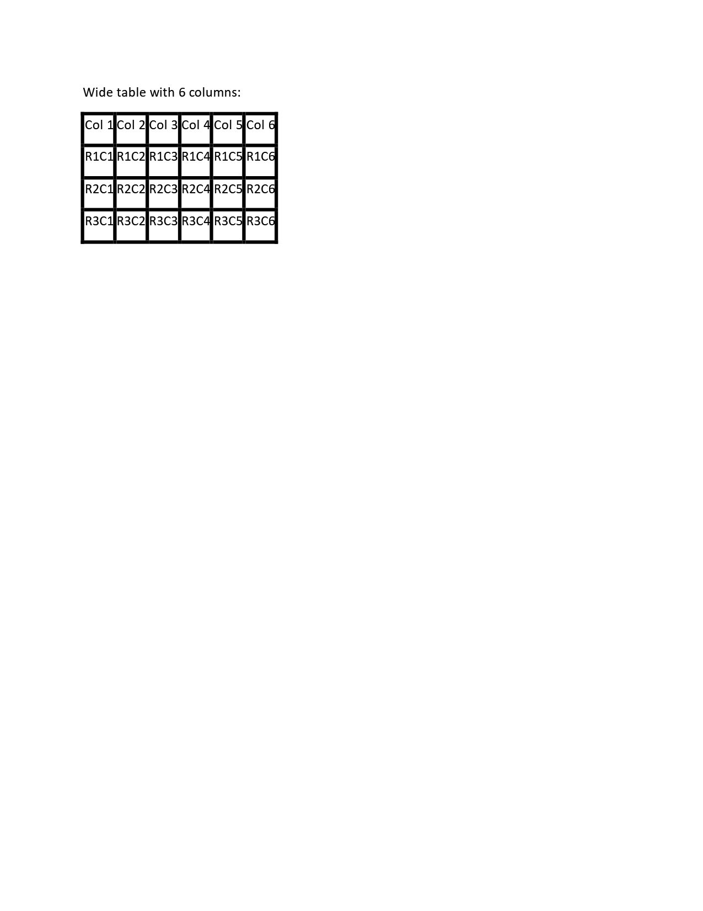 |  |  |

## wordart

### Arc/Circle warps use chord-sagitta envelope geometry

The three single-curve warps (`textArchUp` / `textArchDown` / `textCircle`) render with the geometry Word actually uses, in both backends:

- **`textArchUp` / `textArchDown`**: bbox width is the arc **chord**, bbox height is the **sagitta** (perpendicular distance from chord midpoint to arc midpoint). Circle radius is `R = (W² + 4H²) / (8H)`. For a typical 4:1 wide-and-flat WordArt bbox (e.g. 432pt × 108pt), this gives R ≈ 270pt and a 106° arc — a gentle, mostly-horizontal curve that matches Word. Treating the bbox as the *full* arc bounding box (the obvious first read of "draw an arc inside the bbox") gives a 180° half-ellipse, far sharper and wrongly off-centre.
- **`textCircle`**: text wraps the right side of an inscribed circle. Short text covers a small arc centred on 3 o'clock and reads downward — matches Word's behaviour where the bbox diameter sizes the circle and text sits on the right hemisphere.

Path is sized to the rendered text width and centred on the arc peak/dip (or 3 o'clock for circle), so glyphs sit at the bbox-centre without depending on path-text alignment options. Neither ImageSharp's `RichTextOptions.HorizontalAlignment` nor Skia's `SKTextAlign.Center` centre text the way the obvious read suggests — both place text from the offset point in the direction of path travel — so sizing the path to fit is the more robust approach across both backends.

See `ImageSharpPageRenderer.TryRenderWordArtOnPath` / `BuildChordSagittaArc` and `SkiaPageRenderer.TryRenderWordArtOnPath` / `BuildChordSagittaArc`.

### Wave + Chevron also use path-based rendering

`textChevron` / `textChevronInverted` route through the same chord-sagitta arc as ArchUp/Down — Word's chevron renders as a single-peak smooth arch, not a sharp ^. (A literal polyline ^/v path causes per-glyph overlap at the discontinuous apex regardless of fillet size.)

`textWave1` uses a 64-segment polyline approximation of one full cosine period across the rendered text width: `y = midY - amplitude·cos(2π·t/textWidth)`. Amplitude is bbox H/4 (not H/2) so the wave excursion stays gentle relative to glyph height, matching Word.

### Slant uses a straight diagonal path

`textSlantUp` / `textSlantDown` route through a straight diagonal `LineTo` path with slope ±H/W. Path-text rendering rotates each glyph to match the line angle, so letters lean at the slant angle (Word keeps glyphs upright on a slanted baseline — close approximation, not pixel-identical, but visually distinct from flat).

### Fade and Triangle use per-glyph rendering

`textFadeRight` / `textFadeLeft` / `textTriangle` are *envelope warps* — each glyph is vertically scaled relative to its position along the text. Implemented by drawing one `DrawText` per character with a `Scale(1, sy)` transform anchored at the baseline, so glyph bottoms align and tops shrink toward the baseline. Per-glyph rendering is slower than a single DrawText so the path-based warps are tried first.

Scale curves:
- FadeRight: `1.0 → 0.35` (full at left, reduced at right)
- FadeLeft: `0.35 → 1.0`
- Triangle: peaks at 1.0 mid-text, drops to 0.35 at edges (diamond envelope)

### Vertical positioning vs Word

Path Y is the bbox top — glyph baselines sit on the path peak, so glyph tops extend slightly above the bbox. Word's expected sits ~100px higher again (about one ascent), and the gap is the same shape across all warps. The remaining drift isn't in the warp geometry itself but in the inline-drawing layout cursor (paragraph spacing-after, line metrics) accumulating differently than Word's. A `bodyPr anchor="ctr"` shift (centring the path on the bbox midline) makes it worse — it pushes glyphs further down. Leave the path at the bbox top; closing the residual gap is a layout-flow concern, not a WordArt one.

### `textInflate` / `textDeflate` / `textCan*`

Now handled — see [`../wordart-envelope/notes.md`](../wordart-envelope/notes.md). Top+bottom envelope warps render as per-glyph affine scale (anchor varies by warp), with the text stretched to fill the bbox and the peak glyph sized to fit the bbox height.

| Expected (Word) | Skia | ImageSharp |
| --- | --- | --- |
| **Page 1**&nbsp;&nbsp;&nbsp;&nbsp;&nbsp;&nbsp;&nbsp;&nbsp;&nbsp;&nbsp;&nbsp;&nbsp;&nbsp;&nbsp;&nbsp;&nbsp;&nbsp;&nbsp;&nbsp;&nbsp;&nbsp;&nbsp;&nbsp;&nbsp;&nbsp;&nbsp;&nbsp;&nbsp;&nbsp;&nbsp;&nbsp;&nbsp;&nbsp;&nbsp; | **Page 1. ErrorMetric: 0.0062 · SSIM: 0.9884** | **Page 1. ErrorMetric: 0.0092 · SSIM: 0.9815** |
|  |  |  |
| **Page 2**&nbsp;&nbsp;&nbsp;&nbsp;&nbsp;&nbsp;&nbsp;&nbsp;&nbsp;&nbsp;&nbsp;&nbsp;&nbsp;&nbsp;&nbsp;&nbsp;&nbsp;&nbsp;&nbsp;&nbsp;&nbsp;&nbsp;&nbsp;&nbsp;&nbsp;&nbsp;&nbsp;&nbsp;&nbsp;&nbsp;&nbsp;&nbsp;&nbsp;&nbsp; | **Page 2. ErrorMetric: 0.0481 · SSIM: 0.9351** | **Page 2. ErrorMetric: 0.0543 · SSIM: 0.9265** |
|  |  |  |
| **Page 3**&nbsp;&nbsp;&nbsp;&nbsp;&nbsp;&nbsp;&nbsp;&nbsp;&nbsp;&nbsp;&nbsp;&nbsp;&nbsp;&nbsp;&nbsp;&nbsp;&nbsp;&nbsp;&nbsp;&nbsp;&nbsp;&nbsp;&nbsp;&nbsp;&nbsp;&nbsp;&nbsp;&nbsp;&nbsp;&nbsp;&nbsp;&nbsp;&nbsp;&nbsp; | **Page 3. ErrorMetric: 0.2337 · SSIM: 0.8241** | **Page 3. ErrorMetric: 0.2256 · SSIM: 0.8297** |
|  |  |  |
| **Page 4**&nbsp;&nbsp;&nbsp;&nbsp;&nbsp;&nbsp;&nbsp;&nbsp;&nbsp;&nbsp;&nbsp;&nbsp;&nbsp;&nbsp;&nbsp;&nbsp;&nbsp;&nbsp;&nbsp;&nbsp;&nbsp;&nbsp;&nbsp;&nbsp;&nbsp;&nbsp;&nbsp;&nbsp;&nbsp;&nbsp;&nbsp;&nbsp;&nbsp;&nbsp; | **Page 4. ErrorMetric: 0.3066 · SSIM: 0.7947** | **Page 4. ErrorMetric: 0.2893 · SSIM: 0.8126** |
| 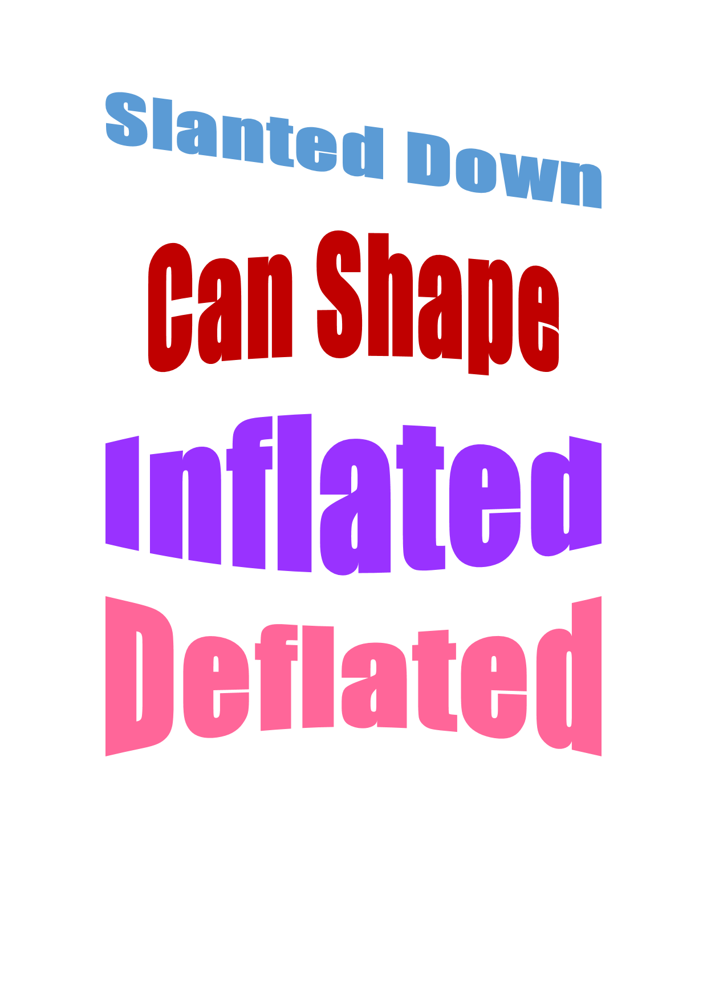 |  |  |
| **Page 5**&nbsp;&nbsp;&nbsp;&nbsp;&nbsp;&nbsp;&nbsp;&nbsp;&nbsp;&nbsp;&nbsp;&nbsp;&nbsp;&nbsp;&nbsp;&nbsp;&nbsp;&nbsp;&nbsp;&nbsp;&nbsp;&nbsp;&nbsp;&nbsp;&nbsp;&nbsp;&nbsp;&nbsp;&nbsp;&nbsp;&nbsp;&nbsp;&nbsp;&nbsp; | **Page 5. ErrorMetric: 0.0115 · SSIM: 0.9809** | **Page 5. ErrorMetric: 0.0218 · SSIM: 0.9623** |
|  |  |  |
| **Page 6**&nbsp;&nbsp;&nbsp;&nbsp;&nbsp;&nbsp;&nbsp;&nbsp;&nbsp;&nbsp;&nbsp;&nbsp;&nbsp;&nbsp;&nbsp;&nbsp;&nbsp;&nbsp;&nbsp;&nbsp;&nbsp;&nbsp;&nbsp;&nbsp;&nbsp;&nbsp;&nbsp;&nbsp;&nbsp;&nbsp;&nbsp;&nbsp;&nbsp;&nbsp; | **Page 6. ErrorMetric: 0.0095 · SSIM: 0.9833** | **Page 6. ErrorMetric: 0.0195 · SSIM: 0.9655** |
|  |  |  |
| **Page 7**&nbsp;&nbsp;&nbsp;&nbsp;&nbsp;&nbsp;&nbsp;&nbsp;&nbsp;&nbsp;&nbsp;&nbsp;&nbsp;&nbsp;&nbsp;&nbsp;&nbsp;&nbsp;&nbsp;&nbsp;&nbsp;&nbsp;&nbsp;&nbsp;&nbsp;&nbsp;&nbsp;&nbsp;&nbsp;&nbsp;&nbsp;&nbsp;&nbsp;&nbsp; | **Page 7. ErrorMetric: 0.0156 · SSIM: 0.9755** | **Page 7. ErrorMetric: 0.0297 · SSIM: 0.9454** |
| 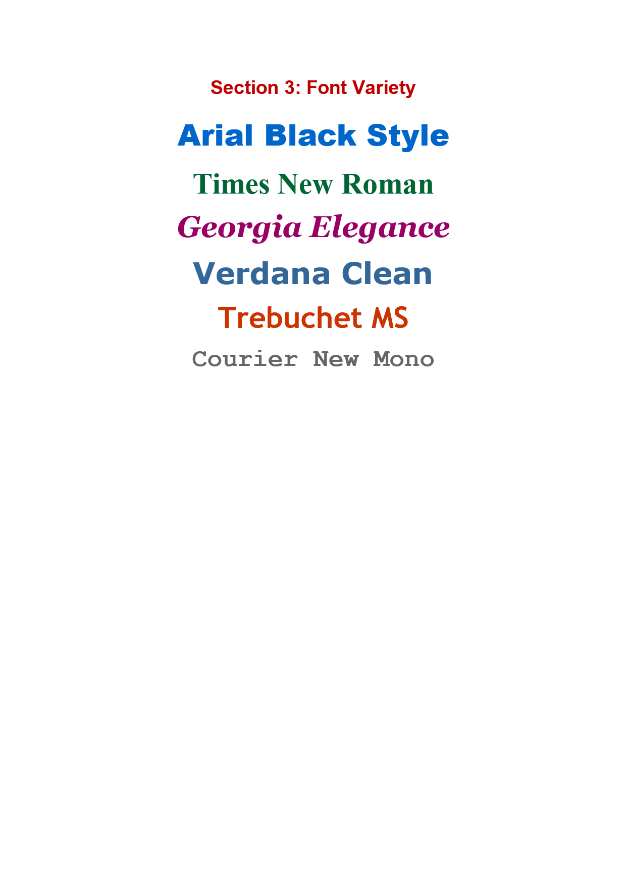 |  |  |
| **Page 8**&nbsp;&nbsp;&nbsp;&nbsp;&nbsp;&nbsp;&nbsp;&nbsp;&nbsp;&nbsp;&nbsp;&nbsp;&nbsp;&nbsp;&nbsp;&nbsp;&nbsp;&nbsp;&nbsp;&nbsp;&nbsp;&nbsp;&nbsp;&nbsp;&nbsp;&nbsp;&nbsp;&nbsp;&nbsp;&nbsp;&nbsp;&nbsp;&nbsp;&nbsp; | **Page 8. ErrorMetric: 0.0192 · SSIM: 0.9608** | **Page 8. ErrorMetric: 0.0317 · SSIM: 0.9414** |
|  |  |  |
| **Page 9**&nbsp;&nbsp;&nbsp;&nbsp;&nbsp;&nbsp;&nbsp;&nbsp;&nbsp;&nbsp;&nbsp;&nbsp;&nbsp;&nbsp;&nbsp;&nbsp;&nbsp;&nbsp;&nbsp;&nbsp;&nbsp;&nbsp;&nbsp;&nbsp;&nbsp;&nbsp;&nbsp;&nbsp;&nbsp;&nbsp;&nbsp;&nbsp;&nbsp;&nbsp; | **Page 9. ErrorMetric: 0.0214 · SSIM: 0.9637** | **Page 9. ErrorMetric: 0.0318 · SSIM: 0.9396** |
|  |  |  |
| **Page 10**&nbsp;&nbsp;&nbsp;&nbsp;&nbsp;&nbsp;&nbsp;&nbsp;&nbsp;&nbsp;&nbsp;&nbsp;&nbsp;&nbsp;&nbsp;&nbsp;&nbsp;&nbsp;&nbsp;&nbsp;&nbsp;&nbsp;&nbsp;&nbsp;&nbsp;&nbsp;&nbsp;&nbsp;&nbsp;&nbsp;&nbsp;&nbsp;&nbsp;&nbsp; | **Page 10. ErrorMetric: 0.0152 · SSIM: 0.9788** | **Page 10. ErrorMetric: 0.0238 · SSIM: 0.9615** |
|  |  |  |
| **Page 11**&nbsp;&nbsp;&nbsp;&nbsp;&nbsp;&nbsp;&nbsp;&nbsp;&nbsp;&nbsp;&nbsp;&nbsp;&nbsp;&nbsp;&nbsp;&nbsp;&nbsp;&nbsp;&nbsp;&nbsp;&nbsp;&nbsp;&nbsp;&nbsp;&nbsp;&nbsp;&nbsp;&nbsp;&nbsp;&nbsp;&nbsp;&nbsp;&nbsp;&nbsp; | **Page 11. ErrorMetric: 0.0162 · SSIM: 0.9716** | **Page 11. ErrorMetric: 0.0291 · SSIM: 0.9474** |
|  |  |  |
| **Page 12**&nbsp;&nbsp;&nbsp;&nbsp;&nbsp;&nbsp;&nbsp;&nbsp;&nbsp;&nbsp;&nbsp;&nbsp;&nbsp;&nbsp;&nbsp;&nbsp;&nbsp;&nbsp;&nbsp;&nbsp;&nbsp;&nbsp;&nbsp;&nbsp;&nbsp;&nbsp;&nbsp;&nbsp;&nbsp;&nbsp;&nbsp;&nbsp;&nbsp;&nbsp; | **Page 12. ErrorMetric: 0.0089 · SSIM: 0.9844** | **Page 12. ErrorMetric: 0.0154 · SSIM: 0.9740** |
|  |  |  |
| **Page 13**&nbsp;&nbsp;&nbsp;&nbsp;&nbsp;&nbsp;&nbsp;&nbsp;&nbsp;&nbsp;&nbsp;&nbsp;&nbsp;&nbsp;&nbsp;&nbsp;&nbsp;&nbsp;&nbsp;&nbsp;&nbsp;&nbsp;&nbsp;&nbsp;&nbsp;&nbsp;&nbsp;&nbsp;&nbsp;&nbsp;&nbsp;&nbsp;&nbsp;&nbsp; | **Page 13. ErrorMetric: 0.0054 · SSIM: 0.9913** | **Page 13. ErrorMetric: 0.0120 · SSIM: 0.9785** |
|  |  |  |
| **Page 14**&nbsp;&nbsp;&nbsp;&nbsp;&nbsp;&nbsp;&nbsp;&nbsp;&nbsp;&nbsp;&nbsp;&nbsp;&nbsp;&nbsp;&nbsp;&nbsp;&nbsp;&nbsp;&nbsp;&nbsp;&nbsp;&nbsp;&nbsp;&nbsp;&nbsp;&nbsp;&nbsp;&nbsp;&nbsp;&nbsp;&nbsp;&nbsp;&nbsp;&nbsp; | **Page 14. ErrorMetric: 0.0194 · SSIM: 0.9644** | **Page 14. ErrorMetric: 0.0307 · SSIM: 0.9482** |
|  |  |  |
| **Page 15**&nbsp;&nbsp;&nbsp;&nbsp;&nbsp;&nbsp;&nbsp;&nbsp;&nbsp;&nbsp;&nbsp;&nbsp;&nbsp;&nbsp;&nbsp;&nbsp;&nbsp;&nbsp;&nbsp;&nbsp;&nbsp;&nbsp;&nbsp;&nbsp;&nbsp;&nbsp;&nbsp;&nbsp;&nbsp;&nbsp;&nbsp;&nbsp;&nbsp;&nbsp; | **Page 15. ErrorMetric: 0.0156 · SSIM: 0.9797** | **Page 15. ErrorMetric: 0.0210 · SSIM: 0.9617** |
|  |  |  |

## wordart-envelope

### Inflate / Deflate / CanUp / CanDown — top+bottom envelope warps

Per-glyph **path-level** distortion: each glyph's outline is extracted, every point on the outline is remapped so the glyph's top edge follows the envelope's top curve and the bottom edge follows the bottom curve. Each glyph ends up as a true non-affine trapezoid (or pillow / pinch shape), matching what Word does. The earlier affine-per-glyph version only varied glyph height while keeping each glyph rectangular — close enough to read but visibly wrong.

**Algorithm** (`TryRenderWordArtPathWarp` in both backends):

1. Render the text outline once at natural size — `TextBuilder.GeneratePaths` (ImageSharp) / `SKPaint.GetTextPath` (Skia). Path is in text-local coords with X spanning `[0, totalWidth]`.
2. Take the path's actual bounds (`pathsBounds.Top` / `pathsBounds.Height`). This is the *visible* glyph extent, tighter than the font's metric box, and is what the envelope curve should map onto.
3. Walk every point. For each `(x, y)`:
   - `t = x / totalWidth` — normalised position along the word
   - `(top_y, bot_y) = EnvelopeAt(t)` — envelope curves at this column
   - `normY = (y - bounds.Top) / bounds.Height` — relative position within the glyph row
   - New point: `(x_box + t·width_box, top_y + normY·(bot_y - top_y))`
4. Build the warped path and fill it.

ImageSharp uses `IPath.Flatten()` to get linear segments; Skia uses `SKPathMeasure` to walk each subpath as a polyline (~2-pixel sample interval).

**Envelope curves** (`EnvelopeAt`): edge text height is `minRatio` of the bbox (0.55) so glyphs at the ends of the word stay readable — without the floor, `sin(πt)·height` collapses to 0 at the edges.

| Warp     | Top curve                | Bottom curve              | Centred on   |
|----------|--------------------------|---------------------------|--------------|
| Inflate  | bows up (peaks above)    | bows down (peaks below)   | bbox centre  |
| Deflate  | dips down (peaks below)  | rises up (peaks above)    | bbox centre  |
| CanUp    | arches up                | flat at bbox bottom       | bbox bottom  |
| CanDown  | flat at bbox top         | arches down               | bbox top     |

The legacy affine `TryRenderWordArtEnvelope` is still the fallback for Fade / Triangle (single-axis warps that don't need path distortion), and tries last in case the path-warp short-circuits.

See `ImageSharpPageRenderer.TryRenderWordArtPathWarp` and `SkiaPageRenderer.TryRenderWordArtPathWarp`.

| Expected (Word) | Skia | ImageSharp |
| --- | --- | --- |
| **Page 1**&nbsp;&nbsp;&nbsp;&nbsp;&nbsp;&nbsp;&nbsp;&nbsp;&nbsp;&nbsp;&nbsp;&nbsp;&nbsp;&nbsp;&nbsp;&nbsp;&nbsp;&nbsp;&nbsp;&nbsp;&nbsp;&nbsp;&nbsp;&nbsp;&nbsp;&nbsp;&nbsp;&nbsp;&nbsp;&nbsp;&nbsp;&nbsp;&nbsp;&nbsp; | **Page 1. ErrorMetric: 0.1949 · SSIM: 0.8599** | **Page 1. ErrorMetric: 0.1638 · SSIM: 0.8836** |
|  |  |  |

