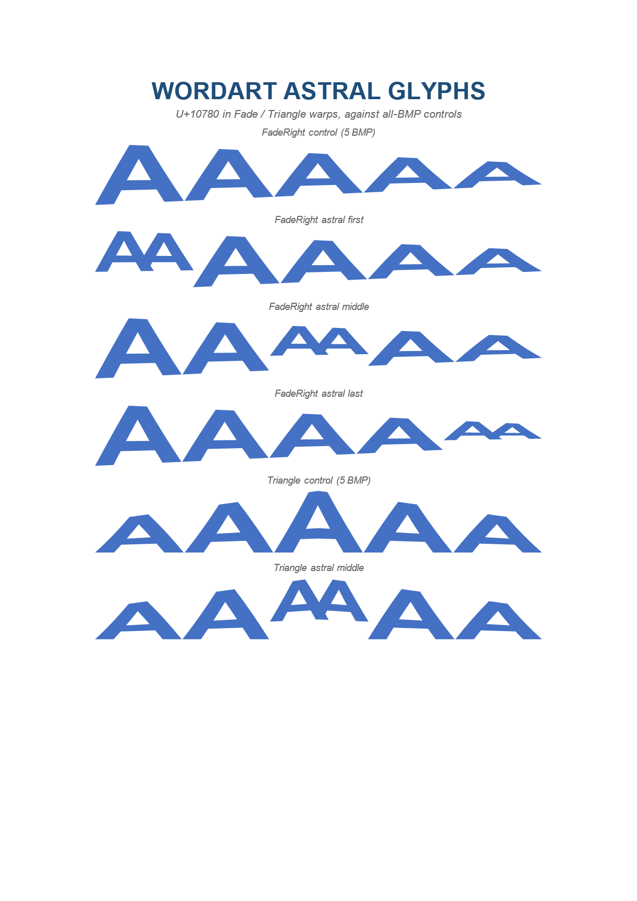

# wordart-astral

### Supplementary-plane glyphs in the per-glyph envelope warps (Fade / Triangle)

Pins the rule that the envelope warps step **per rune, not per UTF-16 code unit**. A character
above the BMP is one glyph occupying one warp position, not two.

Six WordArt boxes, Arial Bold 48pt, all six identical apart from the text. `U+10780`
(MODIFIER LETTER SMALL CAPITAL AA — Arial 7.06 glyph 4557, UTF-16 `D801 DF80`) is placed at each
position in an otherwise all-`A` label, against an all-BMP control of the same glyph count:

| box | warp | text |
| --- | --- | --- |
| 1 | `textFadeRight` | `AAAAA` (control) |
| 2 | `textFadeRight` | `𐞀AAAA` |
| 3 | `textFadeRight` | `AA𐞀AA` |
| 4 | `textFadeRight` | `AAAA𐞀` |
| 5 | `textTriangle` | `AAAAA` (control) |
| 6 | `textTriangle` | `AA𐞀AA` |

**Why Fade and Triangle specifically.** Both backends try three renderers in order:
`TryRenderWordArtOnPath`, then `TryRenderWordArtPathWarp`, then `TryRenderWordArtEnvelope`.
The middle one claims Inflate / Deflate / CanUp / CanDown and outlines the whole string in one
call (`SKPaint.GetTextPath` / `TextBuilder.GeneratePaths`), so it never indexes into the text and
is surrogate-safe by construction. Only Fade and Triangle reach the per-glyph loop in
`TryRenderWordArtEnvelope`, which is the code under test here. A fixture built on `textInflate`
renders **byte-identically** before and after the fix and proves nothing — that mistake cost a
build, so it is recorded here.

**The failure mode is a dropped glyph plus a skewed warp, not tofu.** Splitting with
`text[i].ToString()` yields a lone high surrogate and a lone low surrogate. Neither backend draws
a replacement box for these — measured, they draw *nothing at all*. But they still consume two
iterations, so the loop counted 6 glyphs where the label has 5 and evaluated
`t = i / (glyphCount - 1)` against the wrong denominator, moving every glyph's vertical scale,
while the pen advanced by two unmapped-glyph advances instead of one real one.

Measured on this fixture at 150 dpi, per WordArt row band (ink = pixels in the `4472C4` fill):

| row | Skia h | ink | width | ImageSharp h | ink | width |
| --- | --- | --- | --- | --- | --- | --- |
| FadeRight control | 72 → 72 | 7817 → 7817 | 359 → 359 | 77 → 77 | 7822 → 7822 | 359 → 359 |
| FadeRight astral first | **53 → 72** | 5092 → 7509 | 286 → 368 | **58 → 77** | 5528 → 7503 | 425 → 368 |
| FadeRight astral middle | 72 → 72 | **6330 → 7653** | 286 → 368 | 77 → 77 | **6668 → 7602** | 437 → 368 |
| FadeRight astral last | 72 → 72 | **7438 → 7674** | 287 → 369 | 77 → 76 | **7831 → 7735** | 425 → 368 |
| Triangle control | 72 → 72 | 7035 → 7035 | 358 → 358 | 77 → 77 | 7094 → 7094 | 359 → 359 |
| Triangle astral middle | **44 → 72** | 4458 → 6727 | 285 → 367 | **58 → 77** | 4924 → 6779 | 437 → 368 |

Two things to read from that table. **Both controls are unchanged in both backends** — the fix
cannot move all-BMP text, which is why no existing baseline shifted. And every astral row
converges on its control's geometry afterwards (h 72 / w ≈ 368 on Skia, 77 / ≈ 368 on
ImageSharp), where before it collapsed to 53, 44 or 58 — the band height is the tell, because a
label whose tallest glyph has silently vanished cannot reach the control's height.

**Word's own reference is the reason this is a fidelity fixture rather than a regression latch.**
The bundled `src/Fonts/Arial_700.ttf` and the machine's `arialbd.ttf` are both Version 7.06 and
map `U+10780` to the same glyph 4557, so Word draws the real ᴀᴀ glyph rather than a fallback, and
`expected_0001.png` shows it taking exactly one position in each warp. Morph's WordArt still does
not stretch to fill the box width the way Word does — visible in the comparison as a narrower
label — but that is a pre-existing gap in this fixture's neighbourhood, unrelated to rune
splitting.

| Expected (Word) | Skia | ImageSharp |
| --- | --- | --- |
| **Page 1**&nbsp;&nbsp;&nbsp;&nbsp;&nbsp;&nbsp;&nbsp;&nbsp;&nbsp;&nbsp;&nbsp;&nbsp;&nbsp;&nbsp;&nbsp;&nbsp;&nbsp;&nbsp;&nbsp;&nbsp;&nbsp;&nbsp;&nbsp;&nbsp;&nbsp;&nbsp;&nbsp;&nbsp;&nbsp;&nbsp;&nbsp;&nbsp;&nbsp;&nbsp; | **Page 1. ErrorMetric: 0.1133 · SSIM: 0.8771** | **Page 1. ErrorMetric: 0.1147 · SSIM: 0.8752** |
|  |  |  |
