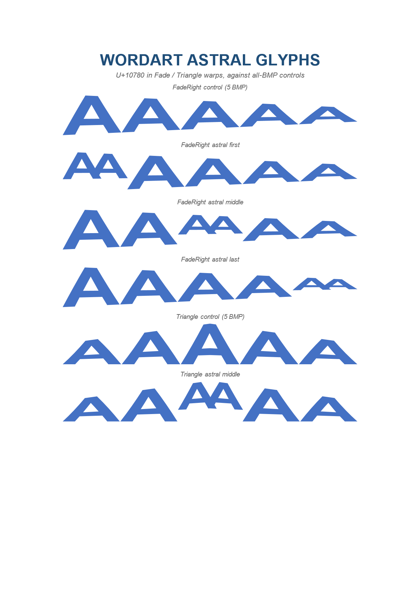

# wordart-astral

### Supplementary-plane glyphs in the per-glyph envelope warps (Fade / Triangle)

Pins the rule that the envelope warps step **per rune, not per UTF-16 code unit**. A character
above the BMP is one glyph occupying one warp position, not two.

Six WordArt boxes, Arial Bold 48pt, all six identical apart from the text. `U+10780`
(MODIFIER LETTER SMALL CAPITAL AA — Arial 7.06 glyph 4557, UTF-16 `D801 DF80`) is placed at each
position in an otherwise all-`A` label, against an all-BMP control of the same glyph count:

| box | warp | text |
| --- | --- | --- |
| 1 | `textFadeRight` | `AAAAA` (control) |
| 2 | `textFadeRight` | `𐞀AAAA` |
| 3 | `textFadeRight` | `AA𐞀AA` |
| 4 | `textFadeRight` | `AAAA𐞀` |
| 5 | `textTriangle` | `AAAAA` (control) |
| 6 | `textTriangle` | `AA𐞀AA` |

**Why Fade and Triangle specifically.** Both backends try three renderers in order:
`TryRenderWordArtOnPath`, then `TryRenderWordArtPathWarp`, then `TryRenderWordArtEnvelope`.
The middle one claims Inflate / Deflate / CanUp / CanDown and outlines the whole string in one
call (`SKPaint.GetTextPath` / `TextBuilder.GeneratePaths`), so it never indexes into the text and
is surrogate-safe by construction. Only Fade and Triangle reach the per-glyph loop in
`TryRenderWordArtEnvelope`, which is the code under test here. A fixture built on `textInflate`
renders **byte-identically** before and after the fix and proves nothing — that mistake cost a
build, so it is recorded here.

**The failure mode is a lost glyph plus a skewed warp.** Splitting with `text[i].ToString()` yields
a lone high surrogate and a lone low surrogate, and the real glyph is drawn by neither backend.
Skia draws *nothing at all* for the pair. ImageSharp draws an empty outlined box for each half —
two boxes where the one glyph belongs. Either way the pair consumes two iterations, so the loop
counted 6 glyphs where the label has 5 and evaluated `t = i / (glyphCount - 1)` against the wrong
denominator, moving every glyph's vertical scale, while the pen advanced by two unmapped-glyph
advances instead of one real one.

Measured on this fixture at 150 dpi, per WordArt row band, before → after the fix. Both sides are
the linux/amd64 container's renders (after is the checked-in `*_result#page_0001.verified.png`),
taken 2026-10-05 on SkiaSharp 4.153.1 and SixLabors.Fonts 3.1.3. Ink is a pixel within 133 of the
`4472C4` fill by RGB distance — the fill itself plus the antialiased edge pixels it covers about
half of or more. A band is a run of consecutive pixel rows carrying ink; its width is the distance
from its leftmost ink column to its rightmost.

| row | Skia h | ink | width | ImageSharp h | ink | width |
| --- | --- | --- | --- | --- | --- | --- |
| FadeRight control | 72 → 72 | 7796 → 7796 | 358 → 358 | 77 → 77 | 7829 → 7829 | 359 → 359 |
| FadeRight astral first | **53 → 72** | 5059 → 7471 | 286 → 368 | **68 → 77** | 5650 → 7505 | 425 → 368 |
| FadeRight astral middle | 72 → 72 | **6293 → 7616** | 286 → 368 | 77 → 77 | **6672 → 7606** | 437 → 368 |
| FadeRight astral last | 72 → 72 | **7506 → 7688** | 287 → 368 | 77 → 76 | **7837 → 7742** | 425 → 369 |
| Triangle control | 72 → 72 | 7020 → 7020 | 357 → 357 | 77 → 77 | 7095 → 7095 | 359 → 359 |
| Triangle astral middle | **44 → 72** | 4430 → 6695 | 285 → 367 | **58 → 77** | 4924 → 6780 | 437 → 368 |

Three things to read from that table. **Both controls are unchanged in both backends** — the fix
cannot move all-BMP text, which is why no existing baseline shifted. Every astral row converges on
its control's geometry afterwards (h 72 / w ≈ 368 on Skia, 77 / ≈ 368 on ImageSharp), where before
it collapsed to 53 or 44 on Skia and 68 or 58 on ImageSharp — the band height is the tell, because
a label whose tallest glyph is missing cannot reach the control's height. And the two backends
failed in opposite directions on width: Skia came out 72px NARROWER than the control, having
drawn nothing for the pair, while ImageSharp came out 66 or 78px WIDER, its two boxes each taking
an advance. ImageSharp's before figures include those boxes, which is why its astral-first band
reaches 68 where the glyphs left in it span only 56.

**Word's own reference is the reason this is a fidelity fixture rather than a regression latch.**
The bundled `src/Fonts/Arial_700.ttf` and the machine's `arialbd.ttf` are both Version 7.06 and
map `U+10780` to the same glyph 4557, so Word draws the real ᴀᴀ glyph rather than a fallback, and
`expected_0001.png` shows it taking exactly one position in each warp. Morph's WordArt still does
not stretch to fill the box width the way Word does — visible in the comparison as a narrower
label — but that is a pre-existing gap in this fixture's neighbourhood, unrelated to rune
splitting.

| Expected (Word) | Skia | ImageSharp |
| --- | --- | --- |
| **Page 1**&nbsp;&nbsp;&nbsp;&nbsp;&nbsp;&nbsp;&nbsp;&nbsp;&nbsp;&nbsp;&nbsp;&nbsp;&nbsp;&nbsp;&nbsp;&nbsp;&nbsp;&nbsp;&nbsp;&nbsp;&nbsp;&nbsp;&nbsp;&nbsp;&nbsp;&nbsp;&nbsp;&nbsp;&nbsp;&nbsp;&nbsp;&nbsp;&nbsp;&nbsp; | **Page 1. ErrorMetric: 0.1119 · SSIM: 0.8817** | **Page 1. ErrorMetric: 0.1123 · SSIM: 0.8812** |
|  |  |  |
